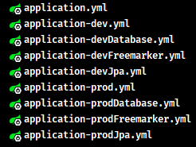

## 1. Spring Boot 打包与部署运行（Windows 篇）

### 1.1. 配置 SpringBoot 构建插件

SpringBoot 项目打包都需要配置 spring-boot-maven-plugin 插件：

```xml
<!-- 构建部分 -->
<build>
  <plugins>
    <!-- spring-boot-maven-plugin构建插件 -->
    <plugin>
      <groupId>org.springframework.boot</groupId>
      <artifactId>spring-boot-maven-plugin</artifactId>
    </plugin>
  </plugins>
</build>
```

> <font color=red>**特别注意：在打包 SpringBoot 工程前，需要先检查 pom.xml 文件是否有配置 spring-boot-maven-plugin 插件，否则打包后无法正常执行程序。**</font>

#### 1.1.1. 插件的七个目标


|         目标名称          |                                                      作用                                                       |
| ----------------------- | -------------------------------------------------------------------------------------------------------------- |
| spring-boot:build-image | 使用构建包将一个应用程序打包成一个OCI图像                                                                            |
| spring-boot:build-info  | 根据当前MavenProject的内容，生成 build-info.properties 文件                                                        |
| spring-boot:help        | 显示spring-boot-maven-plugin的帮助信息。使用`mvn spring-boot:help -Ddetail=true -Dgoal=<goal-name>`命令显示参数细节  |
| spring-boot:repackage   | 重新打包为可以使用`java -jar`命令执行的JAR和WAR包。也可以用`layout=NONE`简单地打包成有嵌套依赖的JAR（没有主类，所以不能执行） |
| spring-boot:run         | 运行应用程序                                                                                                     |
| spring-boot:start       | 启动应用程序，不会阻塞，允许其他目标对应用程序进行操作。这个目标通常用于集成测试场景，在测试套件之前启动应用程序，之后停止         |
| spring-boot:stop        | 停止已经被“开始”目标启动的应用程序。通常在测试套件完成后调用                                                             |

### 1.2. 打成 jar 包部署（官方推荐）

#### 1.2.1. 打包步骤

- 修改项目 pom.xml 文件中的打包类型，默认是 jar。*如果是打成jar包，则跳过此步骤*

```xml
<packaging>jar</packaging>
```

- 执行 maven 打包命令或者使用 IDEA 的 Maven 工具点击 package 按钮，就会对项目进行打包，并在项目根目录的target文件夹中生成jar包

```bash
# 移动至项目根目录，与pom.xml同级
mvn clean package
# 或者执行下面的命令 排除测试代码后进行打包
mvn clean package -Dmaven.test.skip=true
```

> IDEA 中设置跳转测试打包操作
>
> 

- 进入jar包所在目录下，运行启动命令：

```bash
java -jar springboot_demo.jar
# 启动命令的时候也可以配置jvm参数。然后查看一下Java的参数配置结果
java -Xmx80m -Xms20m -jar springboot_demo.jar
```

#### 1.2.2. 内嵌tomcat参数

在 application.properties 设置相关参数即可，如：

```properties
# 设置tomcat端口
server.port=8080
# 设置服务地址
server.address=127.0.0.1
# 设置超时时间
server.connection-timeout=1000
# 设置上下文路径
server.contextPath=/boot
```

### 1.3. 关于配置 spring-boot-maven-plugin 插件打包的说明

#### 1.3.1. 问题概述

如果 Spring Boot 项目在 pom.xml 中不配置 spring-boot-maven-plugin 插件，打包后运行会出现以下问题：


#### 1.3.2. 使用插件打包与无插件打包的区别

下面分别比较一下使用插件和不使用插件打包后的 jar 包有什么区别。观察两种打包后的程序包的差别，共有3处比较明显的特征：

- 打包后文件的大小不同


- 打包后所包含的内容不同


发现内容也完全不一样，仅有一个叫做 META-INF 目录是一样的。打开容量大的程序包中的 BOOT-INF 目录下的 classes 目录，可以发现其中的内容居然和容量小的程序包中的内容完全一样。其中 lib 目录下有很 jar 文件


这些 jar 文件都是此 Spring Boot 工程时导入的坐标对应的文件，甚至还有 tomcat。这种包含有 jar 包的 jar 包，称之为fatJAR(胖jar包)。SpringBoot 程序为了让自己打包生成的 jar 包可以独立运行，不仅将项目中开发的内容进行了打包，还把当前工程运行需要使用的 jar 包全部打包进来了，所以不依赖程序包外部的任何资源，直接通过 `java –jar` 命令即可以独立运行当前程序。

- META-INF 目录下的 MANIFEST.MF 文件内容不一样

打开使用 spring-boot-maven-plugin 插件打包的jar包中，进入目录 org\springframework\boot\loader 中，在里面可以找到一个 JarLauncher.class 的文件，这是一个Spring的相关的目录。然后回到两个程序包的最外层目录，查看名称相同的文件夹 META-INF 下都有一个叫做 MANIFEST.MF 的文件

```
# 小容量 jar 包的 MANIFEST.MF 文件内容：
Manifest-Version: 1.0
Implementation-Title: spring-boot-quickstart
Implementation-Version: 0.0.1-SNAPSHOT
Build-Jdk-Spec: 1.8
Created-By: Maven Jar Plugin 3.2.0

# 大容量 jar 包的 MANIFEST.MF 文件内容：
Manifest-Version: 1.0
Spring-Boot-Classpath-Index: BOOT-INF/classpath.idx
Implementation-Title: spring-boot-quickstart
Implementation-Version: 0.0.1-SNAPSHOT
Spring-Boot-Layers-Index: BOOT-INF/layers.idx
Start-Class: com.moon.SpringBootQuickstartApplication
Spring-Boot-Classes: BOOT-INF/classes/
Spring-Boot-Lib: BOOT-INF/lib/
Build-Jdk-Spec: 1.8
Spring-Boot-Version: 2.5.8
Created-By: Maven Jar Plugin 3.2.0
Main-Class: org.springframework.boot.loader.JarLauncher
```

大 jar 包中明显比小 jar 包中多了几行信息，其中最后一行信息是 `Main-Class: org.springframework.boot.loader.JarLauncher`。如果使用 `java -jar` 执行此程序包，将执行 `Main-Class` 属性配置的类，这个类就是上面所提及的 `JarLauncher.class`。原来 SpringBoot 打包程序中出现 Spring 框架的东西是为这里服务的。而这个 `org.springframework.boot.loader.JarLauncher` 类内部要查找 `Start-Class` 属性中配置的类，并执行对应的类。这个属性在当前配置中也存在，对应的就是 Spring Boot 项目中的引导类类名。

#### 1.3.3. jar 运行流程梳理与问题解析

1. SpringBoot 程序添加 spring-boot-maven-plugin 插件配置后会打出一个特殊的包，包含 Spring 框架部分功能，原始工程内容，原始工程依赖的jar包
2. 首先读取 MANIFEST.MF 文件中的 `Main-Class` 属性，用来标记执行 `java -jar` 命令后运行的类
3. `JarLauncher` 类执行时会找到 `Start-Class` 属性，也就是启动类类名
4. 运行启动类时会运行当前工程的内容
5. 运行当前工程时会使用依赖的 jar 包，从 lib 目录中查找

所以前面如果没有使用 spring-boot-maven-plugin 插件，打包后形成了一个普通的 jar 包，在 MANIFEST.MF 文件中也就没有了 Main-Class 对应的属性了，所以运行时提示找不到主清单属性，这就是报错的原因。

### 1.4. 打 war 包

spring-boot 默认提供内嵌的 tomcat，所以打包直接生成 jar 包，用`java -jar`命令就可以启动。但是可能有时会想让一个 tomcat 来管理多个项目，这种情况下就需要项目是 war 格式的包而不是jar格式的包。

#### 1.4.1. 创建 Spring Boot War 项目

按照以下步骤完成对工程的改造

- 第一步：修改pom.xml

1. 将打包方式改为war
2. 添加的Tomcat依赖配置，覆盖Spring Boot自带的Tomcat依赖
3. 可选：在`<build></build>`标签内配置项目名（该配置类似于`server.context-path=xxx`）

```xml
<!-- 配置打包方式为war包 -->
<packaging>war</packaging>

<!-- 配置tomcat启动器(tomcat我们自己提供) -->
<dependency>
  <groupId>org.springframework.boot</groupId>
  <artifactId>spring-boot-starter-tomcat</artifactId>
  <scope>provided</scope>
</dependency>

<build>
    ...
    <finalName>MoonZero</finalName>
</build>
```

> - 说明：spring-boot-starter-tomcat 是原来被传递过来的依赖，默认会打到包里，所以再次引入此依赖，并指定依赖范围为 provided，这样 tomcat 相关的 jar 就不会打包到 war 里了。
> - 目的：用自己 tomcat，不用它内嵌的 tomcat，这样内嵌的 tomcat 相关 jar 包就不需要。

- 第二步：创建 `ServletInitializer` 类，继承 `org.springframework.boot.web.servlet.support.SpringBootServletInitializer` 抽象类

```java
package com.moon;

import org.springframework.boot.Banner;
import org.springframework.boot.builder.SpringApplicationBuilder;
import org.springframework.boot.web.servlet.support.SpringBootServletInitializer;

/**
 * 定义此类作为web.xml使用
 */
public class ServletInitializer extends SpringBootServletInitializer {
    @Override
    protected SpringApplicationBuilder configure(SpringApplicationBuilder builder) {
        /* 设置启动类 */
        builder.sources(Application.class);
        /* 设置横幅模式 */
        builder.bannerMode(Banner.Mode.OFF);
        /* 返回SpringBoot应用启动对象 */
        return builder;
    }
}
```

> 说明：由于我们采用 web3.0 规范，是没有 web.xml 的，而此类的作用与 web.xml 相同。*注意：Application.class 是本项目 Spring Boot 的启动类*

- 第三步：创建用于测试的 jsp 视图，在 main 目录中新建 webapp 目录和一个 hello.jsp 文件，注意文件名与控制器方法返回的视图逻辑名一致


- 第四步：创建 Spring Boot 项目配置文件，配置视图前后缀，项目部署后访问时，`prefix + 控制器方法返回值 + suffix` 即为视图完整路径

```yml
spring:
  mvc:
    view: # 配置视图的前后缀，访问时，“prefix + 控制器方法返回值 + suffix” 即为视图完整路径
      prefix: /
      suffix: .jsp
```

测试一个跳转视图的控制器方法

```java
@Controller
public class JspDemoController {

    @RequestMapping("/hello")
    public String hello() {
        System.out.println("进入了控制器");
        return "hello"; // 返回 jsp 名称
    }
}
```

- 第五步：运行`mvn clean package`打包命令，在target目录下生成war包。将生成后将war包放入tomcat，启动tomcat，测试完成的功能是否可以使用。


> 注：以上是打包后放到 tomcat 中运行，一般开发的过程都是直接使用 IDE 运行调试。具体操作详见下面章节

#### 1.4.2. 使用外置 tomcat 启动测试

- 使用 idea 添加 tomcat server


访问测试


> 注：在使用外置 tomcat 运行测试时，骨架生成的代码中，多了一个 `ServletInitializer`（如原工程中没有手动创建），它的作用就是配置外置 Tomcat 使用的，在外置 Tomcat 启动后，去调用它创建和运行 SpringApplication

#### 1.4.3. 运行 main 方法启动测试 (暂有问题，待排查)

如果用 maven 插件 `mvn spring-boot:run` 或 main 方法运行测试，是无法访问相应的 jsp，因为此时用的是内嵌 tomcat，而内嵌 tomcat 默认不带 jasper（用于解析 jsp），必须添加如下依赖

```xml
<dependency>
    <groupId>org.apache.tomcat.embed</groupId>
    <artifactId>tomcat-embed-jasper</artifactId>
    <scope>provided</scope>
</dependency>
```

> <font color=purple>**番外：对于 jar 项目，若要支持 jsp，也可以在加入 jasper 依赖的前提下，把 jsp 文件置入 META-INF/resources 目录中**</font>

## 2. Spring Boot 打包与部署运行（Linux 篇）

### 2.1. 上传并运行服务

Spring Boot 程序打包在 windows 系统进行就可以了。只需要将jar上传到 linux 即可

在远程SSH客户端工具中，使用 `rz` 命令上传jar包


进入jar所在目录，跟windows系统一样，使用 `java -jar` 启动即可


通过服务ip，访问服务即可


### 2.2. 后台运行服务

上面是直接启动服务，此时就当前命令行窗口就不做其他的动作。当然也可以新开一个窗口。一般会使用服务在后台运行，输入以下命令：

```bash
nohup java -jar xxx.jar > server.log 2>&1 &
```

> 注：上面命令最后部分是指定保存日志。

如果后台运行时无法直接使用 ctrl+c 结束程序。只能先查询程序的pid

```bash
ps -ef | grep "java -jar"
```

再根据pid杀死进程

```bash
kill -9 pid
```

查询刚刚服务的日志

```bash
cat server.log
```

## 3. 运行 Spring Boot 项目

Spring Boot 有多种启动的方式，并且提供了灵活的配置方式，如果项目中有个别配置属性需要重新设置，可以使用临时属性的方式快速修改某些配置。具体操作就是在启动程序的时候添加上对应参数即可。

### 3.1. 命令行方式

#### 3.1.1. 基础启动（不带参数）

将 Spring Boot 项目打包后，可以直接使用 `java -jar` 命令启动项目：

```bash
$ java -jar moon-project.jar
```

#### 3.1.2. Spring Boot 带参数的命令行启动语法

```bash
java [ options ] -jar *.jar [ arguments ]
```

命令解析：

- `options`：是指**覆盖系统属性中的值**，使用`-D`前缀来指定属性值
- `arguments`：是指**覆盖application中的某个配置项**，使用`--`前缀来指定相关的配置值

#### 3.1.3. 启动时指定配置项

在 Spring Boot 项目中，一般把配置都会写在 application.yml 文件中，随着项目一并打包到 jar 文件中，在生产环境中，启动项目时可以通过添加 `--spring.config.location=/application.yml` 来修改项目的配置文件指向，从而实现覆盖 application 配置的效果。

同理，在使用 `java -jar` 命令启动 SpringBoot 程序包的命令时，通过配置启动参数来覆盖 application 中的某个配置项。在最后空一格，然后输入两个`-`号，紧接着按`属性名=属性值`的形式添加对应参数就可以了。SpringApplication 会默认将命令行选项参数转换为配置信息。

注意：这里的格式不是yaml中的书写格式，当属性存在多级名称时，中间使用`.`分隔，和 properties 文件中的属性格式完全相同。也可以同时配置多个属性，不同属性之间使用空格分隔。例如：

```bash
java -jar springboot-demo.jar --server.port=80 --logging.level.root=debug
```

执行带参数的命令启动，可以在 main 方法的参数中获取该值：

```java
@SpringBootApplication  // 此注解代表为SpringBoot应用的运行主类
public class QuickStartApplication {
    public static void main(String[] args) {
        log.info(">>>>> args: {}", Arrays.toString(args)); // 获取命令带的参数值
        SpringApplication.run(QuickStartApplication.class, args);
    }
}
```

> Notes: 参数的位置在上面语法格式对应 arguments 位置。


#### 3.1.4. 使用带参数命令行注入配置参数

示例：通过带参数的命令行方式启动，并选择不同环境的配置文件。准备两套环境的配置文件，application-dev.yml 和 application-pro.yml，并设置总配置文件 application.yml 如下内容：

```yml
spring:
  profiles:
    active: ${activeName} # 启动时配置相关的参数，在打包时需要替换成@activeName@
```

- 输入启动的命令，带上与配置文件相应对应的参数名，直接使用jar启动输入以下命令

```shell
# 使用dev开发环境配置
java -jar moon-project.jar --spring.profiles.active=dev
# 使用pro生产环境配置
java -jar moon-project.jar --spring.profiles.active=pro
```

> 注：上面示例是直接设置 `spring.profiles.active` 配置项，而不是设置 `activeName` 参数。**如果使用`${}`占位符，在开发过程中可以根据输入的参数切换，但在打包输入命令是无法替换，需要使用`@@`包裹才能实现。**

#### 3.1.5. 禁用命令行启动参数

从命令行指定配置项的比较配置文件优先级高，不过可以通过 `setAddCommandLineProperties` 来禁用

```java
SpringApplication.setAddCommandLineProperties(false)
```

### 3.2. 使用 Spring Boot 的插件命令方式

#### 3.2.1. 基础语法

```bash
$ mvn spring-boot:run
```

#### 3.2.2. 带启动参数

因为配置开发与正式版本的两套配置文件，所以开发时运行需要修改`Environment`的`VM options`的参数为：`-DactiveName=dev`，切换到开发环境的配置，再运行main方法启动

> **注意：使用 mvn 命令启动的方式只适用于`${}`占位符情况，不能使用 `@@`**

当时想在打包时，给配置文件中的占位符设置值。如果配置文件是使用`@@`作为占位符，启动需要使用 Spring Boot 的插件命令：`spring-boot:run`

```shell
# 以开发环境配置启动
spring-boot:run -DactiveName=dev -Dmaven.test.skip=true

# 以正式环境配置启动
spring-boot:run -DactiveName=pro -Dmaven.test.skip=true
```

### 3.3. 使用 maven 命令

需要将依赖的公共包安装到本地仓库，到时需要依赖打包到 war 包中。

项目打包：因为配置了开发环境与正式版本环境的两套配置文件，使用 maven 命令打包时，需要输入配置文件的参数，进行打包即可，完成后将 war 包放到 tomcat 运行部署。

```shell
# 项目安装
mvn clean install -DactiveName=pro -Dmaven.test.skip=true

# 项目打包
mvn clean package -DactiveName=pro -Dmaven.test.skip=true
```

> 注：以上是使用了 `<resource.delimiter>` 配置，让配置文件可以使用 `${}` 作为占位符

### 3.4. 通过 IDE 启动

#### 3.4.1. 使用 IDEA 启动

直接运行 `main` 方法即可


#### 3.4.2. 使用 IDEA 配置启动参数

点击项目下拉按钮后选择【Edit Configurations】，在【Configuration】下的 【VM options】 与 【Program arguments】 均中填入启动需要的属性值


需要注意的是：此这两个选项实现修改的意义不一样，语法格式也不同：

【VM options】填写的格式如下：

```shell
# 示例，前面是配置文件没有配置（如配置了，会被覆盖），直接指定参数值；后面是配置文件使用${}指定参数名
-Dserver.port=8888 -Dspring.redis.port=6378 -D"要配置的参数名"="参数值"
```

【Program arguments】 填写的格式与命令行方式的一样：

```shell
--server.port=8888 --spring.redis.port=6378 --"要配置的参数名"="参数值"
```

> Notes: VM options 配置的优先级比 Program arguments 小，即如果两者都配置相同的属性，则 Program arguments 会覆盖 VM options 中配置的相同的属性。*具体优先级排序详见《属性加载优先级》章节*

### 3.5. 使用 junit 测试配置启动参数

可以通过 `@SpringBootTest` 注解的 `properties` 属性向 `Environment` 中设置新的属性，也可以通过使用 `EnvironmentTestUtils` 工具类来向 `ConfigurableEnvironment` 中添加新的属性。

```java
@SpringBootTest(properties = {"activeName=dev"})
@RunWith(SpringRunner.class)
public class JavMainTest {
}
```

### 3.6. 启动传递参数的原理

启动程序时配置的参数，是在通过运行 Spring Boot 启动类的 `main` 方法的形参 `args` 的传递的。如：

```bash
java –jar springboot-demo.jar –-user.name=MooNkirA
```

```java
@SpringBootApplication
public class Application {
    public static void main(String[] args) {
        // 输出：--user.name=MooNkirA
        for (String arg : args) {
            System.out.println(arg);
        }
        SpringApplication.run(Application.class, args);
    }
}
```

通过上面示例可知，命令行参数是通过 `main` 方法的形参，再从 `run` 方法的形参中传递到 Spring Boot 程序的。

### 3.7. 使用 ${} 作为动态参数的解决方案

从 spring-boot-starter-parent 的 pom.xml 文件中可以看到一句注释：`delimiter that doesn't clash with Spring ${}`

```xml
<properties>
    <java.version>1.6</java.version>
    <resource.delimiter>@</resource.delimiter> <!-- delimiter that doesn't clash with Spring ${} placeholders -->
    <project.build.sourceEncoding>UTF-8</project.build.sourceEncoding>
    <project.reporting.outputEncoding>UTF-8</project.reporting.outputEncoding>
    <maven.compiler.source>${java.version}</maven.compiler.source>
    <maven.compiler.target>${java.version}</maven.compiler.target>
</properties>
```

Spring Boot 默认是使用 `@@` 占位符来读取 maven 的配置属性值，如需要修改使用 `${}` 作为动态参数读取配置值，可以有以下处理方案。

> 注：使用这种方式是为了在使用 maven 命令时，可以设置配置中相应的变量值

#### 3.7.1. 方案一

手动配置 maven 的插件来实现使用 `${}` 读取配置值，具体配置如下：

1. 指定配置文件的 `filtering` 属性为 true
2. 配置 maven 的源码插件，配置 `delimiter` 为 `${*}`

```xml
<build>
    <resources>
        <resource>
            <directory>src/main/resources/</directory>
            <!-- 指定以下配置中可填充不同 profile 中变量值 -->
            <filtering>true</filtering>
            <includes>
                <include>**/*.properties</include>
                <include>**/*.lua</include>
            </includes>
        </resource>
    </resources>

    <plugins>
        <plugin>
            <groupId>org.apache.maven.plugins</groupId>
            <artifactId>maven-resources-plugin</artifactId>
            <configuration>
                <useDefaultDelimiters>false</useDefaultDelimiters>
                <!-- 配置替换配置文件的占位符
                    在新的 spring boot 版本中，是使用 @@ 作为占位符，
                    为了兼容旧的写法，所以这些配置使用 ${} 作为占位符
                -->
                <delimiters>
                    <delimiter>${*}</delimiter>
                </delimiters>
                <encoding>UTF-8</encoding>
            </configuration>
        </plugin>
    </plugins>
</build>
```

#### 3.7.2. 方案二

若项目使用了 spring-boot-starter-parent 做项目版本管理，替换 `resource.delimiter` 属性

```xml
<!-- 使用spring-boot-starter-parent管理jar包版本 -->
<parent>
    <groupId>org.springframework.boot</groupId>
    <artifactId>spring-boot-starter-parent</artifactId>
    <version>1.2.5.RELEASE</version>
</parent>

<!-- 需要在<properties>中添加 -->
<properties>
    <resource.delimiter>${}</resource.delimiter>
</properties>
```

<font color=red>**注意：使用些方式后，使用 mvn 命令打包时，不能使用 `${参数名:默认值}` 这种设置默认值方式**</font>

## 4. 属性加载优先级

配置读取的优先顺序，详情查询[官方文档](https://docs.spring.io/spring-boot/docs/current/reference/html/boot-features-external-config.html)，优先级由低到高：

Spring Boot uses a very particular `PropertySource` order that is designed to allow sensible overriding of values. Properties are considered in the following order (with values from lower items overriding earlier ones):

1. Default properties (specified by setting `SpringApplication.setDefaultProperties`).
> 应用默认属性，使用 `SpringApplication.setDefaultProperties` 定义的内容
2. `@PropertySource` annotations on your `@Configuration` classes. Please note that such property sources are not added to the `Environment` until the application context is being refreshed. This is too late to configure certain properties such as `logging.*` and `spring.main.*` which are read before refresh begins.
> 在 `@Configuration` 注解修改的类中，通过 `@PropertySource` 注解定义的属性
3. Config data (such as `application.properties` files).
> - 位于当前应用 jar 包之外，针对不同`{profile}`环境的配置文件内容，例如`application-{profile}.properties`或是 YAML 定义的配置文件
> - 位于当前应用 jar 包之内，针对不同`{profile}`环境的配置文件内容，例如`application-{profile}.properties`或是 YAML 定义的配置文件
> - 位于当前应用 jar 包之外的 application.properties 和 YAML 配置内容
> - 位于当前应用 jar 包之内的 application.properties 和 YAML 配置内容
4. A `RandomValuePropertySource` that has properties only in `random.*`.
> 通过`random.*`配置的随机属性
5. OS environment variables.
> 操作系统的环境变量
6. Java System properties (`System.getProperties()`).
> Java的系统属性，可以通过`System.getProperties()`获得的内容
7. JNDI attributes from `java:comp/env`.
> `java:comp/env` 中的 JNDI 属性
8. `ServletContext` init parameters.
9. `ServletConfig` init parameters.
10. Properties from `SPRING_APPLICATION_JSON` (inline JSON embedded in an environment variable or system property).
> SPRING_APPLICATION_JSON 中的属性。SPRING_APPLICATION_JSON 是以 JSON 的格式配置在系统环境变量中的内容
11. Command line arguments. 即使用命令行启动时传入的参数
12. `properties` attribute on your tests. Available on `@SpringBootTest`  and the test annotations for testing a particular slice of your application.
13. `@TestPropertySource` annotations on your tests.
14. Devtools global settings properties in the `$HOME/.config/spring-boot` directory when devtools is active.

## 5. Spring Boot 加载不同位置的配置文件的顺序

### 5.1. 默认加载的配置文件分类（按位置不同）

Spring Boot 默认加载的配置文件是 application.properties 或者 application.yaml，默认加载的位置分为 5 个：

- 类路径下配置文件（一直使用的是这个，也就是 resources 目录中的 application.yml 文件）
- 类路径下 config 目录下配置文件。如：`classpath:/config/application.properties`
- 程序包所在目录中配置文件。如：`file:./application.properties`
- 程序包所在目录中 config 目录下配置文件。如：`file:./config/application.properties`
- 程序包所在目录中 config 目录的子文件夹的配置文件（不能加载孙子级文件夹）。如：`file:./config/a/application.properties` 可以加载，但不能加载 `file:./config/a/b/application.properties`

> Tips: 以上是 Spring Boot 默认加载配置文件的顺序，后面加载的配置会覆盖掉前面的。*也可以理解为后面的配置文件优先级较高*

### 5.2. 配置文件加载优先级顺序

Spring Boot 程序启动时，会按以下位置的从上往下的优先级加载配置文件：

1. `file:./config/application.properties`：当前项目下的 /config 目录下。*【优先级最高】*
2. `file:./application.properties`：当前项目的根目录
3. `classpath:/config/application.properties`：classpath 的 /config 目录
4. `classpath:/application.properties`：classpath 的根目录。*【优先级最低】*

加载顺序为上文的排列顺序，高优先级配置的属性会生效。

### 5.3. 总结

1. 配置文件分为4种
   - 项目类路径配置文件：服务于开发人员本机开发与测试
   - 项目类路径config目录中配置文件：服务于项目经理整体调控
   - 工程路径配置文件：服务于运维人员配置涉密线上环境
   - 工程路径config目录中配置文件：服务于运维经理整体调控
2. 多层级配置文件间的属性采用叠加并覆盖的形式作用于程序。*即不同配置文件不同的配置会叠加一起生效，不同配置文件相同的配置会高级别配置覆盖低级别配置*。

## 6. 自定义配置文件

如果不想使用 application.properties/application.yml 作为配置文件，可以通过启动程序时使用参数来指定配置文件。自定义配置文件方式有如下几种：

> <font color=purple>温馨提示</font>：这种方式仅适用于Spring Boot单体项目，实际企业开发的项目都基于微服务，部署到多个服务器上，所有的服务器将不再各自设置自己的配置文件，而是通过配置中心获取配置，动态加载配置信息。

### 6.1. 通过程序启动参数加载指定的配置文件

#### 6.1.1. 设置配置文件名

通过启动参数 `--spring.config.name` 来指定配置文件的名称。<font color=violet>**注意：仅仅是名称，不要带扩展名，多个配置文件之间使用 `,` 号分隔**</font>

```bash
java -jar springboot-demo.jar --spring.config.name=default,override
```

以上示例设置加载默认位置上名称为 default.yaml / override.yaml 的配置文件。（*默认位置详见前面章节*）

#### 6.1.2. 设置配置文件路径

通过启动参数 `--spring.config.location` 来指定配置文件的所在路径。<font color=violet>**注意：相对路径名、全路径名均可**</font>。

```bash
java -jar springboot-demo.jar --spring.config.location=classpath:/default.properties
# 或者
java -jar springboot-demo.jar --spring.config.location=D:\config\config.properties
```

也可以设置加载多个自定义配置文件，不同配置文件路径之间使用 `,` 号分隔

```bash
java -jar springboot-demo.jar --spring.config.location=D:\config\config.properties,D:\config\confg-dev.properties
```

注意：若在 classpath 前面加上了 `optional:` 表示如果这个配置文件不存在，则按照默认的方式启动，不会因找不到指定配置文件而报错。如果不加这个前缀，则当系统找不到指定的配置文件时，就会抛出 `ConfigDataLocationNotFoundException` 异常，进而导致应用启动失败。

```bash
java -jar springboot-demo.jar --spring.config.location=optional:config/config.properties
```

如果 `spring.config.location` 的配置只是指定了目录，则必须以 `/` 结尾，并且通过 `spring.config.name` 属性指定配置文件的文件名。

```bash
java -jar springboot-demo.jar --spring.config.location=optional:config/ --spring.config.name=config
```

#### 6.1.3. 覆盖默认配置位置

如果不想覆盖掉 Spring Boot 默认的配置文件查找策略，又想自定义加载配置文件，那么可以通过 `spring.config.additional-location ` 配置项方式指定配置文件位置：

```bash
java -jar springboot-demo.jar --spring.config.additional-location=optional:abc/app.yaml
```

#### 6.1.4. 位置通配符

假设有 redis 和 mysql 的配置，并放在两个不同的文件夹中以便于管理，可以通过通配符 `*` 批量扫描相应的文件夹：


```bash
java -jar boot_config_file-0.0.1-SNAPSHOT.jar --spring.config.additional-location=optional:config/*/
```

> Notes: 使用通配符批量扫描 mysql 和 redis 目录时，默认的加载顺序是按照文件夹的字母排序，即先加载 mysql 目录后加载 redis 目录。<font color=red>**需要注意的是，通配符只能用在外部目录中，不可以用在 classpath 中的目录上。另外，包含了通配符的目录，只能有一个通配符 `*`，不可以有多个，并且还必须是以 `*/` 结尾，即一个目录的最后部分可以不确定。**</font>

#### 6.1.5. 导入外部文件

从 Spring Boot 2.4 开始，可以使用 `spring.config.import` 参数来导入配置文件，相比于 `spring.config.additional-location` 参数配置，此导入方式更加灵活，可以导入任意名称的配置文件。

```bash
spring.config.import=optional:file:./dev.properties
```

`spring.config.import` 还可以导入无扩展名的配置文件。例如有一个 properties 格式的配置文件，但是此配置文件没有扩展名，如果想导入将该配置文件，可以进行以下的配置：

```bash
spring.config.import=optional:file:/Users/moon/dev[.properties]
```

### 6.2. 在代码中指定自定义配置文件

通过 `@PropertySource` 注解导入自定义配置文件

```java
@SpringBootApplication
@PropertySource(value={"file:config.properties"})
public class SpringbootrestdemoApplication {
    public static void main(String[] args) {
        SpringApplication.run(SpringbootrestdemoApplication.class, args);
    }
}
```

## 7. profile 切换多环境

开发 Spring Boot 应用时，通常同一套程序会被安装到不同环境，比如：开发、测试、生产等。其中数据库地址、服务器端口等等配置都不同，profile 功能就是来进行根据不同环境进行动态配置切换的。

> profile 就是用于指定那些配置文件生效。

### 7.1. 单个配置文件

单个 applicationproperties 配置文件

```properties
# 配置数据源
spring.datasource.driverClassName=com.mysql.jdbc.Driver
spring.datasource.url=jdbc:mysql://localhost:3306/springboot_db
spring.datasource.username=root
spring.datasource.password=root
spring.datasource.type=com.mchange.v2.c3p0.ComboPooledDataSource
```

单个 application.yml 配置文件

```yml
# 配置数据源
spring:
  datasource:
    url: jdbc:mysql://localhost:3306/springboot_db
    driverClassName: com.mysql.jdbc.Driver
    username: root
    password: root
    type: com.mchange.v2.c3p0.ComboPooledDataSource
```

其实 application.yml 配置文件就是将原来 application.properties 使用（`.`）分割的方式，改为树状结构，使用（`:`）分割。

**注意：最后key的字段与值之间的冒号（`:`）后面一定要有一个空格。**

### 7.2. 同一个 yml 文档中配置多环境规则

在同一个yml文档中，可以直接使用 “`---`” 来分隔不同环境的配置。

<font color=red>**特别注意，分隔不同环境配置的分隔符必须的3个`-`，不能多不能少**</font>

```yml
# 指定当前激活那个 profile
spring:
  profiles:
    active: dev
---
spring:
  profiles: dev

server:
  port: 8081
---
spring:
  profiles: test

server:
  port: 8082
---
spring:
  profiles: pro

server:
  port: 8083
---
```

> 值得注意：在比较高版本的Spring Boot中，`spring.profiles` 这个配置项已经过时，最新的配置是 `spring.config.active.on-profile`。过时与最新的配置都是可以使用的。

### 7.3. 多环境配置文件命名与引用规则

创建多个`application-xxx.properties`或者`application-xxx.yml`，文件的后缀“`xxx`”代表不同环境的名称。示例如下：

- application-dev.properties/yml 开发环境
- application-test.properties/yml 测试环境
- application-pro.properties/yml 生产环境

在主配置文件中，指定当前环境的配置文件的后缀名称即可。如：

```yml
# application.yml
spring:
  profiles:
    active: dev
```

```properties
# application.properties
spring.profiles.active=dev
```

### 7.4. 按功能拆分多个配置文件

#### 7.4.1. spring.profiles.include 加载多配置文件

**多个 `*.properties` 配置文件**

- 第一步：在项目的 resources 目录创建 application.properties 及多个文件名为 application-xxx.properties 的配置文件，其中xxx是一个任意的字符串。


- 第二步：在 application.properties 总配置文件（或者其他配置文件，但确保此文件最终会被引用）指定，加载的其它（多个）配置文件。通过 `active` 或者 `include` 均可引入。推荐使用`include`，因为`active` 一般用于指定不同环境的配置文件

```properties
spring.profiles.active=database,jpa,freemarker
# 或者
spring.profiles.include=database,freemarker,jpa
```

**多个 `*.yml` 配置文件**

- 第一步：在项目的 resources 目录创建 application.yml 以及多个名为 application-xxx.yml 的配置文件，其中xxx是一个任意的字符串。


- 第二步：在application.yml总配置文件（或者其他配置文件，但确保此文件最终会被引用）指定，加载的多个配置文件。通过 `active` 或者 `include` 均可引入。推荐使用`include`，因为`active` 一般用于指定不同环境的配置文件

```yml
spring:
  profiles:
    active: database,jpa,freemarker
# 或者
spring:
  profiles:
    include: database,freemarker,jpa
```

> <font color=red>值得注意：使用`include`引入的多个配置文件，如果有相同属性的，是后面的配置文件覆盖前端的</font>

#### 7.4.2. spring.profiles.group 引入多配置文件（2.4版本后）

上面使用 `spring.profiles.include` 引入按功能拆分的配置文件，但实现项目中可能会再细分到按不同环境不同功能拆分，如下：



此时，如果使用 `spring.profiles.include` 引入就出现，如果切换环境后，`incloude`属性的值也需要一起修改。

```yml
spring:
  profiles:
    # 指定当前激活环境的配置文件
    active: dev
    # 使用include引入不同环境中按功能拆分的配置。但有缺点就是每次环境修改都要同时修改include的值
    include: devDatabase,devFreemarker,devJpa
```

```properties
# 指定当前激活的环境配置文件
spring.profiles.active=dev
# 使用include引入不同环境中按功能拆分的配置。但有缺点就是每次环境修改都要同时修改include的值
spring.profiles.include=devdatabase,devfreemarker,dvejpa
```

所以 SpringBoot 从 2.4 版本开始引入新的 `group` 属性替代 `include` 属性，可以将配置设置为不同的分组，定义不同环境对应的不同功能的配置，在切换环境时，只需要修改环境名称即可，从而降低了配置书写量。

```yml
spring:
  profiles:
    # 指定当前激活环境的配置文件
    active: dev
    # spring boot 2.4 版本后新增一个 group 属性，可以将配置文件分组
    group:
      "dev": devDatabase,devFreemarker,devJpa
      "prod": prodDatabase,prodFreemarker,prodJpa
```

```properties
# 指定当前激活的环境配置文件
spring.profiles.active=dev
# spring boot 2.4 版本后新增一个 group 属性，可以将配置文件分组
spring.profiles.group.dev=devDatabase,devFreemarker,devJpa
spring.profiles.group.prod=prodDatabase,prodFreemarker,prodJpa
```

### 7.5. profile 的激活方式

1. 通过在主配置文件中，`spring.profiles.active`来指定当前激活的配置

```properties
spring.profiles.active=profiles的名称
```

```yml
spring:
  profiles:
    active: profiles的名称
```

2. 在IDE里配置虚拟机的参数，通过 VM options 选项，指定当前激活的配置。

```
-Dspring.profiles.active=profiles的名称
```

3. 通过命令行启动时的参数指定当前激活的配置

```bash
java –jar xxx.jar --spring.profiles.active=profiles的名称
```

4. 使用 SpringBoot 插件激活 profile

```bash
spring-boot:run -Drun.profiles=prod
```

## 8. Maven 与 SpringBoot 多环境兼容

### 8.1. 概述

在多环境开发中，Maven 和 SpringBoot 都可以同时设置多环境的配置。maven 是用于项目构建管理，最终由它生成程序包。所以 SpringBoot 应该是根据 Maven 的配置来决定最终的环境。

1. 主要在 maven 中配置具体使用什么的环境
2. 然后在 SpringBoot 项目中读取 maven 设置的环境即可

### 8.2. 实现步骤

- **maven中设置多环境（使用属性方式区分环境）**

```xml
<profiles>
    <profile>
        <id>env_dev</id>
        <properties>
            <profile.active>dev</profile.active>
        </properties>
        <activation>
            <activeByDefault>true</activeByDefault>		<!--默认启动环境-->
        </activation>
    </profile>
    <profile>
        <id>env_pro</id>
        <properties>
            <profile.active>prod</profile.active>
        </properties>
    </profile>
</profiles>
```

- 在 SpringBoot 的配置文件中，需要使用`@@`占位符读取 Maven 对应的配置属性值

```yml
spring:
  profiles:
    active: @profile.active@
```

- 执行 Maven 打包指令，并在生成的 boot 打包文件 .jar 文件中查看对应信息

> 注意：基于 SpringBoot 读取 Maven 配置属性的前提下，如果在 IDEA 下测试工程时 pom.xml 每次更新需要手动 compile 方可生效

## 9. 其他相关知识

### 9.1. SpingBoot 项目在 windows 环境中运行时命令行窗口及日志中文乱码

1. 配置日志的xml文件中，`<appender name="CONSOLE">`与`appender name="FILE">`的标签中都要指定`<encoder>`标签内的`<charset>utf8</charset>`
2. 由于指定的编码与 windows 系统默认编码不符，此时命令行窗口将会出现日志输出乱码，需要将系统默认编码改为utf-8。cmd命令窗口在启动jar包之前增加命令`chcp 65001`

```bash
$ chcp 65001
$ java -Dxxxx=xxxx -jar .\app.jar
```

### 9.2. Windows 系统常用命令

#### 9.2.1. 查询端口

```bash
netstat -ano
```

#### 9.2.2. 查询指定端口

```bash
netstat -ano | findstr "端口号"
```

#### 9.2.3. 根据进程PID查询进程名称

```bash
tasklist | findstr "进程PID号"
```

#### 9.2.4. 根据 PID 杀死任务

```bash
taskkill /F /PID "进程PID号"
```

#### 9.2.5. 根据进程名称杀死任务

```bash
taskkill -f -t -im "进程名称"
```
