## 1. 系统架构的演变

随着互联网的发展，网站应用的规模不断扩大，常规的应用架构已无法应对，分布式服务架构以及微服务架构势在必行，亟需一个治理系统确保架构有条不紊的演进。

### 1.1. 单体应用架构

Web应用程序发展的早期，大部分web工程(包含前端页面，web层代码，service层代码，dao层代码)是将所有的功能模块，打包到一起并放在一个web容器中运行。比如搭建一个电商系统：客户下订单，商品展示，用户管理。这种将所有功能都部署在一个web容器中运行的系统就叫做单体架构。

面对业务发展与用户量增加带来的高并发访问，可以将单体应用进行集群部署，并增加负载均衡服务器（如Nginx等）。另外，还需要增加集群部署的缓存服务器和文件服务器，并将数据库读写分离

用负载均衡服务器分发高并发的网络请求，用户的访问被分派到不同的应用服务器，用户量增加时，添加应用服务器即可。通过添加缓存服务器来缓解数据库的数据以及数据库读取数据的压力。大多数的读取操作是由缓存完成，但仍然有少数读操作是从数据库读取的，例如缓存失效、实时数据等。

当有大量读写操作时，可以将数据库进行读写分离，例如MySQL的主从热备份，通过相关配置可以将主数据库服务器的数据同步到从数据库服务器，实现数据库的读写分离，改善数据库的负载能力。


单体应用架构优点：

- 所有的功能集成在一个项目工程中
- 项目架构简单，前期开发成本低，周期短，小型项目的首选

单体应用架构缺点：

- 全部功能集成在一个工程中，对于大型项目不易开发、扩展及维护
- 系统性能扩展只能通过扩展集群结点，成本高、有瓶颈
- 技术栈受限

### 1.2. 垂直应用架构

当访问量逐渐增大，单一应用增加机器带来的加速度越来越小，将应用拆成互不相干的几个应用，以提升效率

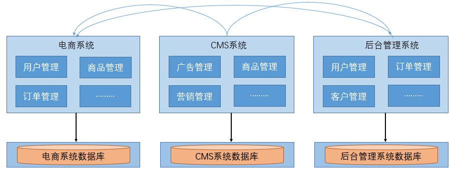

垂直应用架构优点：

- 项目架构简单，前期开发成本低，周期短，小型项目的首选
- 通过垂直拆分，原来的单体项目不至于无限扩大
- 不同的项目可采用不同的技术

垂直应用架构缺点：

- 全部功能集成在一个工程中，对于大型项目不易开发、扩展及维护
- 系统性能扩展只能通过扩展集群结点，成本高、有瓶颈

### 1.3. 分布式 SOA 架构

SOA 全称为 Service-Oriented Architecture，即面向服务的架构。它可以根据需求通过网络对松散耦合的粗粒度应用组件(服务)进行分布式部署、组合和使用。一个服务通常以独立的形式存在于操作系统进程中

站在功能的角度，把业务逻辑抽象成可复用、可组装的服务，通过服务的编排实现业务的快速再生，其主要目的是把原先固有的业务功能转变为通用的业务服务，实现业务逻辑的快速复用。

**SOA 架构特点：分布式、可重用、扩展灵活、松耦合**。当垂直应用越来越多，应用之间交互不可避免，将核心业务抽取出来，作为独立的服务，逐渐形成稳定的服务中心，使前端应用能更快速的响应多变的市场需求。

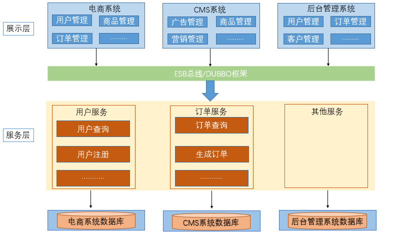

SOA 架构优点：

- 抽取公共的功能为服务，提高开发效率
- 对不同的服务进行集群化部署解决系统压力
- 基于ESB/DUBBO减少系统耦合

SOA 架构缺点：

- 抽取服务的粒度较大
- 服务提供方与调用方接口耦合度较高

### 1.4. 微服务架构

微服务架构，简单的说就是将单体应用进一步拆分，拆分成更小的服务，每个服务都是一个可以独立运行的项目。

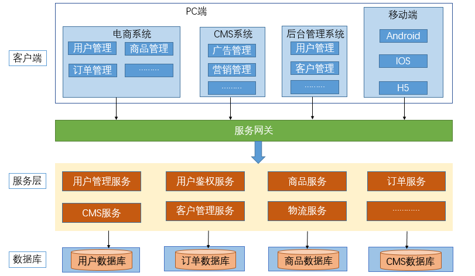

优点：

- 通过服务的原子化拆分，以及微服务的独立打包、部署和升级，小团队的交付周期将缩短，运维成本也将大幅度下降
- 微服务遵循单一原则。微服务之间采用 Restful 等轻量协议传输

缺点：

- 微服务过多，服务治理成本高，不利于系统维护
- 分布式系统开发的技术成本高（容错、分布式事务等）

### 1.5. SOA 与微服务的关系

- **SOA（ Service Oriented Architecture ）“面向服务的架构”**：是一种设计方法，其中包含多个服务，服务之间通过相互依赖最终提供一系列的功能。一个服务通常以独立的形式存在与操作系统进程中。各个服务之间通过网络调用。
- **微服务架构**：其实和 SOA 架构类似，微服务是在 SOA 上做的升华，微服务架构强调的一个重点是“业务需要彻底的组件化和服务化”，原有的单个业务系统会拆分为多个可以独立开发、设计、运行的小应用。这些小应用之间通过服务完成交互和集成。


## 2. 微服务架构

### 2.1. 微服务概述

*以下是节选 spring 官网关于微服务介绍*

> Microservices
>
> Microservice architectures are the ‘new normal’. Building small, self-contained, ready to run applications can bring great flexibility and added resilience to your code. Spring Boot’s many purpose-built features make it easy to build and run your microservices in production at scale. And don’t forget, no microservice architecture is complete without Spring Cloud ‒ easing administration and boosting your fault-tolerance.
>
> 翻译：微服务架构是一种 "新常态"。构建小型的、独立的、可随时运行的应用程序可以为您的代码带来极大的灵活性，并增加弹性。Spring Boot 的许多专用功能使其能够轻松地在生产中大规模地构建和运行你的微服务。别忘了，没有 Spring Cloud 的微服务架构是不完整的 -- 它可以减轻管理，提高容错能力。

微服务架构是一种架构模式、风格，它提倡将单一应用程序划分为一组小的服务，每个服务运行在其自己独立的进程中。服务之间采用轻量级的通信机制互相协调、配合（通常是基于 HTTP 的 RESTful API），每个服务都围绕着具体的业务进行构建，并且能够被独立的构建在生产环境、类生产环境等。

另外，应避免统一的、集中式的服务管理机制，可以有一个非常轻量级的集中式管理来协调这些服务。对具体的一个服务而言，应根据业务上下文，选择合适的语言、工具对其进行构建，各个微服务可以使用不同的语言来编写，也可以使用不同的数据存储。

### 2.2. 常见微服务框架

#### 2.2.1. Spring Cloud

Spring Cloud 是一系列框架的有序集合。它利用 Spring Boot 的开发便利性巧妙地简化了分布式系统基础设施的开发，如**服务发现注册、配置中心、消息总线、负载均衡、断路器、数据监控**等，都可以用 Spring Boot 的开发风格做到一键启动和部署。

Spring Cloud 并没有重复制造轮子，它只是将目前各家公司开发的比较成熟、经得起实际考验的服务框架组合起来，通过 Spring Boot 风格进行再封装屏蔽掉了复杂的配置和实现原理，最终给开发者留出了一套简单易懂、易部署和易维护的分布式系统开发工具包

官网：https://spring.io/projects/spring-cloud

#### 2.2.2. Apache ServiceComb

Apache ServiceComb，前身是华为云的微服务引擎 CSE (Cloud Service Engine) 云服务，是业界第一个Apache微服务顶级项目，它提供了一站式的微服务开源解决方案，致力于帮助企业、用户和开发者将企业应用轻松微服务化上云，并实现对微服务应用的高效运维管理。其融合SDK框架级、零侵入ServiceMesh场景并支持多语言

官网：http://servicecomb.apache.org/cn/

#### 2.2.3. ZeroC ICE

ZeroC IceGrid 是ZeroC公司的杰作，继承了CORBA的血统，是新一代的面向对象的分布式系统中间件。作为一种微服务架构，它基于RPC框架发展而来，具有良好的性能与分布式能力

官网：https://zeroc.com/products/ice

#### 2.2.4. Spring Cloud Alibaba

Spring Cloud Alibaba 致力于提供微服务开发的一站式解决方案。此项目包含开发分布式应用微服务的必需组件，方便开发者通过 Spring Cloud 编程模型轻松使用这些组件来开发分布式应用服务。

官网：https://spring.io/projects/spring-cloud-alibaba#overview

### 2.3. 微服务特点

- 按业务划分成一个独立运行的程序，即服务单元
- 服务之间通过HTTP协议相互通信
- 自动化部署
- 可以用不同的编程语言
- 可以用不同的存储技术
- 服务集中化管理
- 微服务是一个分布式系统，具有极强的横向扩展能力，微服务可以集群化部署

#### 2.3.1. 微服务通过 HTTP 相互通信

- 微服务单元之间的通信一般使用 HTTP 的通信机制，更多的时候使用 RESTFUL api 的，可以跨平台与语言
- 服务与服务之间也可以通过轻量级的消息总线来通信，如 RabbitMQ，Kafaka 等
- 服务与服务之间的通信格式一般为 json、xml。这两种数据格式与平台、语言、通信协议无关

#### 2.3.2. 微服务的数据库独立

微服务都有自己独立的数据库，数据库之间没有任何联系。数据库的存储方式可以是关系型数据库，也可以是非关系数据库（如：MongoDB、Redis）

#### 2.3.3. 微服务的自动化部署

微服务架构有多少服务就需要部署多少次，所以微服务部署的核心是Docker容器技术，是微服务最佳部署的容器，需要使用Docker容器技术以及自动化部署工具（如：开源组件Jenkins）。DevOps是一种部署手段或理念。

### 2.4. 微服务架构的常见问题

#### 2.4.1. 微服务的复杂度

服务与服务之间相互依赖，如果修改某个服务，会对另一个服务产生影响。比如修改一个比较基础的服务，可能需要重启所有的服务才能完成测试

#### 2.4.2. 分布式事务

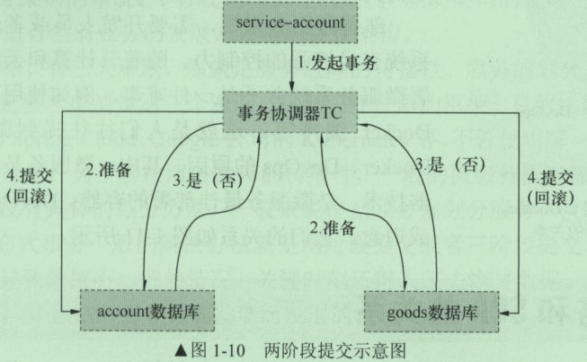

分布式事务提交需要两个阶段

第1个阶段：Service-account发起一个分布式事务，交给事务协调器TC处理，事务协调器TC向所有参与的事务的节点发送处理事务操作的准备操作，将Undo和Redo信息写进日志，并向事务管理器返回准备操作是否成功

第2个阶段：事务管理器收集的呢节点的准备操作是否成功，如果都成功，则通知所有的节点执行提交操作；如果有一个失败，则执行回滚操作。但如果第1阶段都成功，而执行第2阶段的某一个节点失败，仍然导致数据的不准确。如果分布式事务涉及的节点很多，某个节点的网络出现异常会导致整个事务处于阻塞状态，大大降低数据库的性能。所以一般情况下，尽量少用分布式事务

## 3. 服务治理（注册中心）

服务治理就是进行服务的自动化管理，其**核心是服务的自动化注册与发现**。

注册中心相当于微服务架构中的“通讯录”，它记录了服务和服务地址的映射关系。在分布式架构中，服务会注册到这里，当服务需要调用其它服务时，就这里找到服务的地址，进行调用。

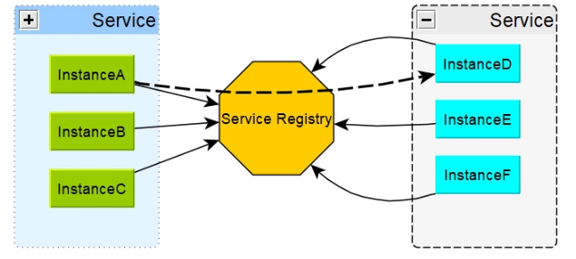

### 3.1. 服务的注册与发现概念

- **服务注册**：服务实例将自身服务信息注册到注册中心。这部分服务信息包括服务所在主机IP和提供服务的Port，以及暴露服务自身状态以及访问协议等信息。
- **服务发现**：服务实例请求注册中心获取所依赖服务信息。服务实例通过注册中心，获取到注册到其中的服务实例的信息（如服务名、IP地址等），通过这些信息去请求它们提供的服务
- **服务剔除**：服务注册中心会以心跳的方式去监测服务注册清单中的服务是否可用，如有服务不可用，服务注册中心将出问题的服务自动剔除到可用列表之外，使其不会被调用到。

一个服务既是服务提供者，也是服务消费者。服务消费者一般使用HTTP协议或者消费。


Spring cloud 采用 Eureka 来注册服务和发现服务。也可以使用 Zookeeper、Consul 等服务集中化管理框架

### 3.2. 注册中心的主要作用

服务注册中心（下称注册中心）是微服务架构非常重要的一个组件，在微服务架构里主要起到了协调者的一个作用。注册中心一般包含如下几个功能：

服务发现：

- 服务注册/反注册：保存服务提供者和服务调用者的信息
- 服务订阅/取消订阅：服务调用者订阅服务提供者的信息，注册中心会向订阅者推送提供者的信息（通常都是实时推送）
- 服务路由（可选）：具有筛选整合服务提供者的能力。

服务配置：

- 配置订阅：服务提供者和服务调用者订阅微服务相关的配置
- 配置下发：主动将配置推送给服务提供者和服务调用者

服务健康检测：

- 检测服务提供者的健康情况。如果发现异常，执行服务剔除

### 3.3. 微服务的注册与发现流程图


由上图可以看出：

1. 服务提供者将服务注册到注册中心
2. 服务消费者通过注册中心查找服务
3. 查找到服务后进行调用（这里就是无需硬编码url的解决方案）
4. 服务的消费者与服务注册中心保持心跳连接，一旦服务提供者的地址发生变更时，注册中心会通知服务消费者

### 3.4. 常见的注册中心

- **Zookeeper**：它是一个分布式服务框架，是Apache Hadoop 的一个子项目，它主要是用来解决分布式应用中经常遇到的一些数据管理问题，如：统一命名服务、状态同步服务、集群管理、分布式应用配置项的管理等。简单来说<font color=red>**zookeeper=文件系统+监听通知机制**</font>。
- **Eureka**：是使用Java语言开发的，基于Restful Api开发的服务注册与发现组件，Springcloud Netflix中的重要组件。*但目前现在已经闭源*
- **Consul**：是由HashiCorp基于Go语言开发的支持多数据中心分布式高可用的服务发布和注册服务软件，其中包括：服务注册/发现、健康检查、Key/Value 存储、多数据中心和采用Raft算法保证分布式服务的一致性等特性。Consul本身只是一个二进制的可执行文件，所以安装和部署都非常简单，只需要从官网下载后，在执行对应的启动脚本即可。
- **Nacos**：是 Spring Cloud Alibaba 组件之一，是一个更易于构建云原生应用的动态服务发现、配置管理和服务管理平台。简单来说<font color=red>**Nacos 就是注册中心 + 配置中心的组合**</font>，提供简单易用的特性集，解决微服务开发必会涉及到的服务注册与发现，服务配置，服务管理等问题。

### 3.5. 常见的注册中心总结

选择什么类型的服务注册与发现组件可以根据自身项目要求决定。整体区别如下：

|   组件名   | 语言  | CAP | 一致性算法 | 服务健康检查 | 对外暴露接口 |
| --------- | ---- | --- | --------- | ---------- | ---------- |
| Eureka    | Java | AP  | 无        | 可配支持     | HTTP       |
| Consul    | go   | CP  | Raft      | 支持        | HTTP/DNS   |
| Zookeeper | Java | CP  | Paxos     | 支持        | 客户端      |
| Nacos     | Java | AP  | Raft      | 支持        | HTTP       |


## 4. 服务调用

在微服务架构中，通常存在多个服务之间的远程调用的需求。<font color=red>**远程调用通常包含两个部分：序列化和通信协议**</font>。常见的序列化协议包括json、xml、hession、protobuf、thrift、text、bytes等，<font color=red>**目前主流的远程调用技术有基于 HTTP 的 RESTful 接口以及基于 TCP 的 RPC 协议**</font>。

- RPC (Remote Promote Call)：一种进程间通信方式。允许像调用本地服务一样调用远程服务。RPC框架的主要目标就是让远程服
务调用更简单、透明。RPC框架负责屏蔽底层的传输方式、序列化方式和通信细节。开发人员在使
用的时候只需要了解谁在什么位置提供了什么样的远程服务接口即可，并不需要关心底层通信细节
和调用过程。

### 4.1. HTTP 的 RESTfull 接口

REST（Representational State Transfer），这是一种HTTP调用的格式，更标准，更通用，无论哪种语言都支持http协议。如果一个架构符合REST原则，就称它为RESTful架构。

- **资源（Resources）**：就是网络上的一个实体，或者说是网络上的一个具体信息。可以用一个URI（统一资源定位符）指向它，每种资源对应一个特定的URI。要获取这个资源，访问它的URI就可以
- **表现层（Representation）**：把"资源"具体呈现出来的形式。
- **状态转化（State Transfer）**：访问一个网站，就代表了客户端和服务器的一个互动过程。在这个过程中，势必涉及到数据和状态的变化。如果客户端想要操作服务器，必须通过某种手段，让服务器端发生"状态转化"（State Transfer）。客户端用到的手段就是HTTP协议里面，四个表示操作方式的动词：GET、POST、PUT、DELETE。它们分别对应四种基本操作：GET用来获取资源，POST用来新建资源（也可以用于更新资源），PUT用来更新资源，DELETE用来删除资源。

RESTful架构总结：

- 每一个URI代表一种资源
- 客户端和服务器之间，传递这种资源的某种表现层
- 客户端通过四个HTTP动词，对服务器端资源进行操作，实现"表现层状态转化"

### 4.2. RPC 协议

RPC（Remote Procedure Call ）一种进程间通信方式。允许像调用本地服务一样调用远程服务。RPC 框架的主要目标就是让远程服务调用更简单、透明。RPC框架负责屏蔽底层的传输方式（TCP或者UDP）、序列化方式（XML/JSON/二进制）和通信细节。开发人员在使用的时候只需要了解谁在什么位置提供了什么样的远程服务接口即可，并不需要关心底层通信细节和调用过程。


### 4.3. RESTful 与 RPC 的区别

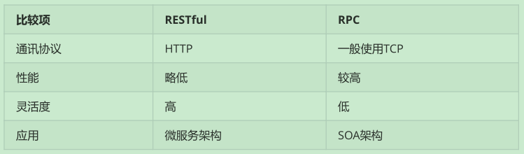

- HTTP 相对更规范，更标准，更通用，无论哪种语言都支持http协议。如果对外开放API，例如开放平台，外部的编程语言多种多样，需要对每种语言的支持，现在开源中间件，基本最先支持的几个协议都包含 RESTful
- RPC 框架作为架构微服务化的基础组件，它能大大降低架构微服务化的成本，提高调用方与服务提供方的研发效率，屏蔽跨进程调用函数（服务）的各类复杂细节。让调用方感觉就像调用本地函数一样调用远端函数、让服务提供方感觉就像实现一个本地函数一样来实现服务

## 5. 服务网关（API Gateway）

随着微服务的不断增多，不同的微服务一般会有不同的网络地址，而外部客户端可能需要调用多个服务的接口才能完成一个业务需求，如果让客户端直接与各个微服务通信可能出现以下问题：

- 客户端会请求多个不同的服务，需要维护不同的请求地址，增加开发难度
- 在某些场景下存在跨域请求的问题
- 加大身份认证的难度，每个微服务需要独立的身份认证

此时需要一个微服务网关，介于客户端与服务器之间的中间层，所有的外部请求都会先经过微服务网关。客户端只需要与网关交互，只知道一个网关地址即可。增加服务网关的有以下优点：

1. 易于监控
2. 易于认证
3. 减少了客户端与各个微服务之间的交互次数


### 5.1. 服务网关的概念

微服务系统中，API接口资源通常是由服务网关（也称API网关）统一暴露，由网关层统一接入和输出。API Gateway 是一个服务器，也可以说是进入系统的唯一节点。

API网关封装了系统内部架构，为每个客户端提供一个定制的API。API网关方式的核心要点是，所有的客户端和消费端都通过统一的网关接入微服务，在网关层处理所有的非业务功能。通常，网关也是提供REST/HTTP的访问API。服务端通过API-GW注册和管理服务。

### 5.2. 作用和应用场景

API Gateway 封装内部系统的架构，并且提供 API 给各个客户端。一个网关的基本功能有：统一接入、安全防护、协议适配、流量管控、长短链接支持、容错能力。有了网关之后，各个API服务提供团队可以专注于自己的的业务逻辑处理，而API网关更专注于安全、流量、路由等问题。它还可以有其他功能，如授权、监控、负载均衡、缓存、请求分片和管理、静态响应处理等。网关层作用如下：

1. 将所有服务的API接口资源统一暴露
2. 实现用户身份认证、权限认证、防止非法请求操作API接口
3. 实现监控功能，实时日志输出，对请求进行记录
4. 做流量监控
5. API接口从内部分离出来

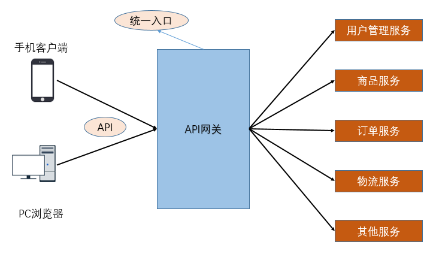

**API Gateway 负责请求转发、合成和协议转换**。所有来自客户端的请求都要先经过 API Gateway，然后路由这些请求到对应的微服务。API Gateway 将经常通过调用多个微服务来处理一个请求以及聚合多个服务的结果。它可以在 web 协议与内部使用的非 Web 友好型协议间进行转换，如 HTTP 协议、WebSocket 协议。

### 5.3. 常见的API网关实现方式

**Kong**

- 基于Nginx+Lua开发，性能高，稳定，有多个可用的插件(限流、鉴权等等)可以开箱即用。
- 问题：只支持Http协议；二次开发，自由扩展困难；提供管理API，缺乏更易用的管控、配置方式

**Zuul**

- Netflix开源，功能丰富，使用JAVA开发，易于二次开发；需要运行在web容器中，如Tomcat。
- 问题：缺乏管控，无法动态配置；依赖组件较多；处理Http请求依赖的是Web容器，性能不如Nginx

**Traefik**

- Go语言开发；轻量易用；提供大多数的功能：服务路由，负载均衡等等；提供WebUI
- 问题：二进制文件部署，二次开发难度大；UI更多的是监控，缺乏配置、管理能力；

**Spring Cloud Gateway**

- SpringCloud提供的网关服务

**Nginx+lua实现**

- 使用Nginx的反向代理和负载均衡可实现对api服务器的负载均衡及高可用。lua是一种脚本语言,可以来编写一些简单的逻辑, nginx支持lua脚本
- 问题：自注册的问题和网关本身的扩展性

### 5.4. 基于Nginx的网关实现（扩展）

> 注：这里只是简介使用介绍，详细使用看Nginx的笔记

#### 5.4.1. Nginx介绍


#### 5.4.2. 正向/反向代理

**正向代理**

正向代理，"它代理的是客户端，代客户端发出请求"，是一个位于客户端和原始服务器(origin server)之间的服务器，为了从原始服务器取得内容，客户端向代理发送一个请求并指定目标(原始服务器)，然后代理向原始服务器转交请求并将获得的内容返回给客户端。客户端必须要进行一些特别的设置才能使用正向代理。

**反向代理**

多个客户端给服务器发送的请求，Nginx服务器接收到之后，按照一定的规则分发给了后端的业务处理服务器进行处理了。此时~请求的来源也就是客户端是明确的，但是请求具体由哪台服务器处理的并不明确了，Nginx扮演的就是一个反向代理角色。客户端是无感知代理的存在的，反向代理对外都是透明的，访问者并不知道自己访问的是一个代理。因为客户端不需要任何配置就可以访问。反向代理，"它代理的是服务端，代服务端接收请求"，主要用于服务器集群分布式部署的情况下，反向代理隐藏了服务器的信息

如果只是单纯的需要一个最基础的具备转发功能的网关，那么使用Ngnix是一个不错的选择。

#### 5.4.3. 简单的使用示例

- 启动订单微服务，单独请求地址：http://127.0.0.1:9001/
- 启动商品微服务，单独请求地址：http://127.0.0.1:9002/

安装ngnix，找到根目录ngnix.exe双击运行即可。修改conf目录下的nginx.conf文件

```
server {
    listen       80;
    server_name  127.0.0.1;
	ssi on;
	ssi_silent_errors on;

	# 订单服务
	location /api-order {
		proxy_pass http://127.0.0.1:9001/;
	}

	# 端口服务
	location /api-product {
		proxy_pass http://127.0.0.1:9002/;
	}
}
```

## 6. 负载均衡

### 6.1. 概述

负载均衡，是高可用网络基础架构的关键组件，通常建立在现有网络结构之上，用于将工作负载分布到多个服务器，扩展网络设备和服务器的带宽，从而提高网站、应用、数据库或其他服务的性能、吞吐量，加强了网络数据处理能力，并提高了网络的灵活性和可用性的一套解决方案。简单来说，负载均衡就是将负载（工作任务，访问请求）进行分摊到多个操作单元（服务器、组件）上进行执行。项目中常用的负载均衡有**四层负载均衡**和**七层负载均衡**。

为了保证服务的高可用，服务单元往往是集群化部署。由于服务注册中心既要接收每个服务的定时心跳，而且每个服务会定期获取服务注册列表的信息，所以**一般做法将服务注册中心集群化，每个服务注册中心的数据实时同步**。

服务提供者可以进行集群化部署，服务消费者集成负载均衡组件，该组件会向服务消费者获取服务注册列表信息，并每隔一段时间重新刷新获取列表。当消费服务时，负载均衡组件获取服务提供者所有注册信息，并通过负载均衡策略，选择一个服务提供者进行消费。


根据负载均衡发生位置的不同，一般分为**服务端负载均衡**和**客户端负载均衡**。

- **服务端负载均衡**指的是在服务提供方进行负载均衡处理。比如常见的nginx负载均衡
- **客户端负载均衡**指的是在服务请求时进行负载均衡处理。也就是在发送请求之前已经选好了由哪个实例处理请求。

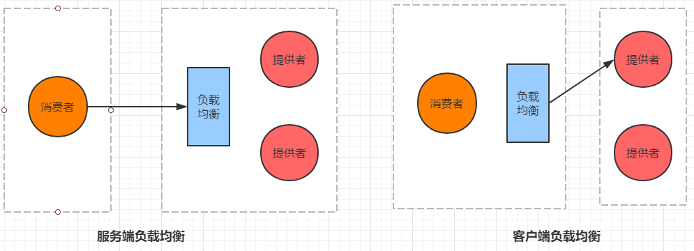

> 在微服务调用关系中一般会选择客户端负载均衡，也就是在服务调用的一方来决定服务由哪个提供者执行。

### 6.2. Nginx 反向代理的负载均衡

> 详见[《Nginx 基础笔记》](/分布式微服务/Nginx/Nginx-基础)

### 6.3. 四层负载均衡

四层负载均衡主要通过**修改报文中的目标地址和端口来实现报文的分发和负载均衡**。以 TCP 为例，负载均衡设备在接收到第 1 个来自客户端的 SYN 请求后，会根据负载均衡配置和负载均衡策略选择一个最佳的服务器，并将报文中的目标IP地址修改为该服务器的IP直接转发给该服务器。TCP 连接的建立（即三次握手过程）是在客户端和服务器端之间完成的，负载均衡设备只起到路由器的转发功能。

四层负载均衡常用的软硬件如下：

- F5：硬件负载均衡器，功能完备，价格昂贵。
- LVS：基于 `IP+端口` 实现的四层负载软件，常和 Keepalive 配合使用。
- Nginx：同时实现四层负载和七层负载均衡，带缓存功能，可基于正则表达式灵活转发。

### 6.4. 七层负载均衡

七层负载均衡又叫作“内容负载均衡”，主要通过解析报文中真正有意义的应用层内容，并根据负载均衡配置和负载均衡策略选择一个最佳的服务器响应用户的请求。

七层应用负载可以使整个网络更智能化，七层负载均衡根据不同的数据类型将数据存储在不同的服务器上来提高网络整体的负载能力。比如将客户端的基本信息存储在内存较大的缓存服务器上，将文件信息存储在磁盘空间较大的文件服务器上，将图片视频存储在网络 I/O 能力较强的流媒体服务器上。在接收到不同的客户端的请求时从不同的服务器上获取数据并将其返回给客户端，提高客户端的访问效率

七层负载均衡常用的软件如下：


- HAProxy：支持七层代理、会话保持、标记、路径转移等。
- Nginx：同时实现四层负载和七层负载均衡，在 HTTP 和 Mail 协议上功能比较好，性能与 HAProxy 差不多。
- Apache：使用简单，性能较差。

### 6.5. 四层负载均衡与七层负载均衡的对比

- 四层负载均衡基于IP和端口的方式实现网络的负载均衡，具体实现为对外提供一个虚拟IP和端口接收所有用户的请求，然后根据负载均衡配置和负载均衡策略将请求发送给真实的服务器。
- 七层负载均衡基于URL等资源来实现应用层基于内容的负载均衡，具体实现为通过虚拟的URL或主机名接收所有用户的请求，然后将请求发送给真实的服务器。

四层负载均衡和七层负载均衡的最大差别是：四层负载均衡只能针对 IP 地址和端口上的数据做统一的分发，而七层负载均衡能根据消息的内容做更加详细的有针对性的负载均衡。通常使用 LVS 等技术实现基于 Socket 的四层负载均衡，使用 Nginx 等技术实现基于内容分发的七层负载均衡，比如将以 `/user/***` 开头的 URL 请求负载到单点登录服务器，而将以 `/business/***` 开头的 URL 请求负载到具体的业务服务器，如下图：


### 6.6. 负载均衡算法

常用的负载均衡算法有：轮询均衡（Round Robin）、权重轮询均衡（Weighted Round Robin）、随机均衡（Random）、权重随机均衡（Weighted Random）、响应速度均衡（Response Time）、最少连接数均衡（Least Connection）、处理能力均衡、DNS响应均衡（Flash DNS）、散列算法均衡、IP地址散列、URL散列。不同的负载均衡算法适用于不同的应用场景。

#### 6.6.1. 轮询均衡（Round Robin）

轮询均衡指将客户端请求轮流分配到 1 至 N 台服务器上，每台服务器均被均等地分配一定数量的客户端请求。轮询均衡算法适用于集群中所有服务器都有相同的软硬件配置和服务能力的情况下。

#### 6.6.2. 权重轮询均衡（Weighted Round Robin）

权重轮询均衡指根据每台服务器的不同配置及服务能力，为每台服务器都设置不同的权重值，然后按照设置的权重值轮询地将请求分配到不同的服务器上。

例如，服务器A的权重值被设计成 3，服务器 B 的权重值被设计成 3，服务器 C 的权重值被设计成 4，则服务器 A、B、C 将分别承担 30%、30%、40% 的客户端请求。权重轮询均衡算法主要用于服务器配置不均等的集群中。

#### 6.6.3. 随机均衡（Random）

随机均衡指将来自网络的请求随机分配给内部的多台服务器，不考虑服务器的配置和负载情况。

#### 6.6.4. 权重随机均衡（Weighted Random）

权重随机均衡算法类似于权重轮询算法，只是在分配请求时不再轮询发送，而是随机选择某个权重的服务器发送。

#### 6.6.5. 响应速度均衡（Response Time）

响应速度均衡指根据服务器设备响应速度的不同将客户端请求发送到响应速度最快的服务器上。对响应速度的获取是通过负载均衡设备定时为每台服务都发出一个探测请求（例如Ping）实现的。响应速度均衡能够为当前的每台服务器根据其不同的负载情况分配不同的客户端请求，这有效避免了某台服务器单点负载过高的情况。但需要注意的是，这里探测到的响应速度是负载均衡设备到各个服务器之间的响应速度，并不完全代表客户端到服务器的响应速度，因此存在一定偏差。

#### 6.6.6. 最少连接数均衡（Least Connection）

最少连接数均衡指在负载均衡器内部记录当前每台服务器正在处理的连接数量，在有新的请求时，将该请求分配给连接数最少的服务器。这种均衡算法适用于网络连接和带宽有限、CPU 处理任务简单的请求服务，例如 FTP。

#### 6.6.7. 处理能力均衡

处理能力均衡算法将服务请求分配给内部负荷最轻的服务器，负荷是根据服务器的CPU型号、CPU数量、内存大小及当前连接数等换算而成的。处理能力均衡算法由于考虑到了内部服务器的处理能力及当前网络的运行状况，所以相对来说更加精确，尤其适用于七层负载均衡的场景。

#### 6.6.8. DNS 响应均衡（Flash DNS）

DNS响应均衡算法指在分布在不同中心机房的负载均衡设备都收到同一个客户端的域名解析请求时，所有负载均衡设备均解析此域名并将解析后的服务器IP地址返回给客户端，客户端向收到第一个域名解析后的IP地址发起请求服务，而忽略其他负载均衡设备的响应。这种均衡算法适用于全局负载均衡的场景。

#### 6.6.9. 散列算法均衡

散列算法均衡指通过一致性散列算法和虚拟节点技术将相同参数的请求总是发送到同一台服务器，该服务器将长期、稳定地为某些客户端提供服务。在某个服务器被移除或异常宕机后，该服务器的请求基于虚拟节点技术平摊到其他服务器，而不会影响集群整体的稳定性。

#### 6.6.10. IP 地址散列

IP 地址散列指在负载均衡器内部维护了不同链接上客户端和服务器的 IP 对应关系表，将来自同一客户端的请求统一转发给相同的服务器。该算法能够以会话为单位，保证同一客户端的请求能够一直在同一台服务器上处理，主要适用于客户端和服务器需要保持长连接的场景，比如基于 TCP 长连接的应用。

#### 6.6.11. URL散列

URL 散列指通过管理客户端请求 URL 信息的散列表，将相同 URL 的请求转发给同一台服务器。该算法主要适用于在七层负载中根据用户请求类型的不同将其转发给不同类型的应用服务器。

### 6.7. LVS 的原理及应用

LVS（Linux Virtual Server）是一个虚拟的服务器集群系统，采用 IP 负载均衡技术将请求均衡地转移到不同的服务器上执行，且通过调度器自动屏蔽故障服务器，从而将一组服务器构成一个高性能、高可用的虚拟服务器。整个服务器集群的结构对用户是透明的，无须修改客户端和服务器端的程序，便可实现客户端到服务器的负载均衡。

#### 6.7.1. LVS 技术常用名词

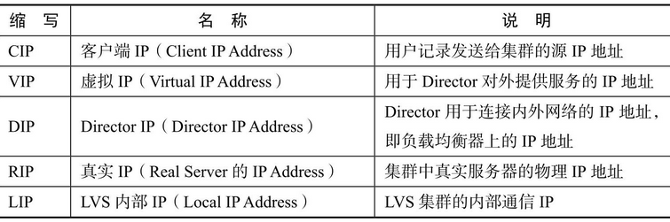

#### 6.7.2. LVS 的原理

LVS 由前端的负载均衡器（Load Balancer，LB）和后端的真实服务器（Real Server，RS）群组成，在真实服务器间可通过局域网或广域网连接。LVS 的这种结构对用户是透明的，用户只需要关注作为 LB 的虚拟服务器（Virtual Server），而不需要关注提供服务的真实服务器群。在用户的请求被发送给虚拟服务器后，LB 根据设定的包转发策略和负载均衡调度算法将用户的请求转发给真实服务器，真实服务器再将用户请求的结果返回给用户。

实现 LVS 的核心组件有负载均衡调度器、服务器池和共享存储。

- 负载均衡调度器（Load Balancer/Director）：是整个集群对外提供服务的入口，通过对外提供一个虚拟 IP 来接收客户端请求。在客户端将请求发送到该虚拟 IP 后，负载均衡调度器会负责将请求按照负载均衡策略发送到一组具体的服务器上。
- 服务器池（Server Pool）：服务器池是一组真正处理客户端请求的真实服务器，具体执行的服务有 WEB、MAIL、FTP 和 DNS 等。
- 共享存储（Shared Storage）：为服务器池提供一个共享的存储区，使得服务器池拥有相同的内容，提供相同的服务。

LVS 的 IP 负载均衡技术是通过 IPVS 模块实现的。IPVS 是 LVS 集群系统的核心软件，被安装在 Director Server 上，同时在 Director Server上虚拟出一个 IP 地址。用户通过这个虚拟的 IP 地址访问服务器。这个虚拟的 IP 地址一般被称为 LVS 的 VIP，即 Virtual IP。访问的请求首先经过 VIP 到达负载调度器，然后由负载调度器从真实服务器列表中选取一个服务节点响应用户的请求。

#### 6.7.3. LVS 数据转发

LVS 的数据转发流程是 LVS 设计的核心部分

1. PREROUTING 链接收用户请求：客户端向 PREROUTING 链发送请求。
2. INPUT 链转发：在 PREROUTING 链通过 RouteTable 列表发现请求数据包的目的地址是本机时，将数据包发送给 INPUT 链。
3. IPVS 检查：IPVS 检查 INPUT 链上的数据包，如果数据包中的目的地址和端口不在规则列表中，则将该数据包发送到用户空间的 ipvsadm。ipvsadm主要用于用户定义和管理集群。
4. POSTROUTING 链转发：如果数据包里面的目的地址和端口都在规则里面，那么将该数据包中的目的地址修改为事先定义好的真实服务器地址，通过 FORWARD 将数据发送到 POSTROUTING 链。
5. 真实服务器转发：POSTROUTING 链根据数据包中的目的地址将数据包转发到真实服务器。

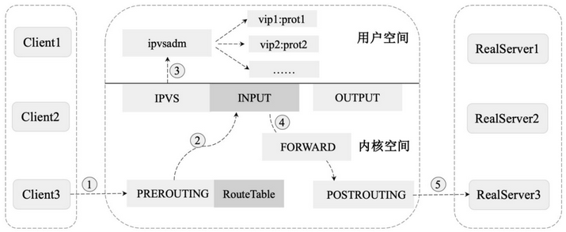

#### 6.7.4. LVS NAT 模式

LVS NAT（Network Address Translation）即网络地址转换模式，具体的实现流程如下图：


NAT 模式通过对请求报文和响应报文的地址进行改写完成对数据的转发，具体流程如下：

1. 客户端将请求报文发送到 LVS，请求报文的源地址是 CIP（Client IP Address，客户端IP），目标地址是 VIP（Virtual IP Address，虚拟IP）。
2. LVS 在收到报文后，发现请求的 IP 地址在 LVS 的规则列表中存在，则将客户端请求报文的目标地址 VIP 修改为 RIP（Real-server IP Address，后端服务器的真实 IP），并将报文发送到具体的真实服务器上。
3. 真实服务器在收到报文后，由于报文的目标地址是自己的 IP，所以会响应该请求，并将响应报文返回给 LVS。
4. LVS 在收到数据后将此报文的源地址修改为本机 IP 地址（即 VIP），并将报文发送给客户端。

**NAT 模式的特点**：

- 请求的报文和响应的报文都需要通过 LVS 进行地址改写，因此在并发访问量较大的时候 LVS 存在瓶颈问题，一般适用于节点不是很多的情况下。
- 只需要在 LVS 上配置一个公网 IP 即可。
- 每台内部的真实服务器的网关地址都必须是 LVS 的内网地址。
- NAT 模式支持对 IP 地址和端口进行转换，即用户请求的端口和真实服务器的端口可以不同。

#### 6.7.5. LVS DR 模式

LVS DR（Direct Routing）模式用直接路由技术实现，通过改写请求报文的 MAC 地址将请求发送给真实服务器，具体的实现流程如下图：

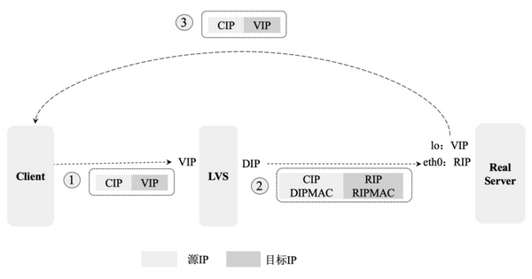

LVD DR 模式是局域网中经常被用到的一种模式，其报文转发流程如下：

1. 客户端将请求发送给 LVS，请求报文的源地址是 CIP，目标地址是 VIP。
2. LVS 在收到报文后，发现请求在规则中存在，则将客户端请求报文的源 MAC 地址改为自己的 DIP（Direct IP Address，内部转发 IP）的 MAC 地址，将目标 MAC 改为 RIP 的 MAC 地址，并将此包发送给真实服务器。
3. 真实服务器在收到请求后发现请求报文中的目标 MAC 是自己，就会将此报文接收下来，在处理完请求报文后，将响应报文通过 lo（回环路由）接口发送给 eth0 网卡，并最终发送给客户端。

**DR 模式的特点**：

- 通过 LVS 修改数据包的目的 MAC 地址实现转发。注意，源 IP 地址仍然是 CIP，目标 IP 地址仍然是 VIP 地址。
- 请求的报文均经过 LVS，而真实服务器响应报文时无须经过 LVS，因此在并发访问量大时比 NAT 模式的效率高很多。
- 因为 DR 模式是通过 MAC 地址改写机制实现转发的，因此所有真实服务器节点和 LVS 只能被部署在同一个局域网内。
- 真实服务器主机需要绑定 VIP 地址在 lo 接口（掩码 32 位）上，并且需要配置 ARP 抑制。
- 真实服务器节点的默认网关无须被配置为 LVS 网关，只需要被配置为上级路由的网关，能让真实服务器直接出网即可。
- DR 模式仅做 MAC 地址的改写，不能改写目标端口，即真实服务器端口和 VIP 端口必须相同。

#### 6.7.6. LVS TUN 模式

TUN（IP Tunneling）通过 IP 隧道技术实现，具体的实现流程如下图：

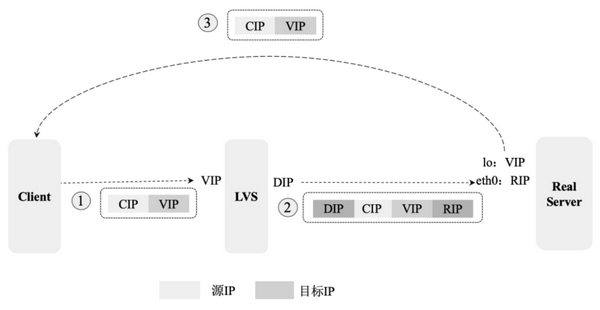

LVS TUN模式常用于跨网段或跨机房的负载均衡，具体的报文转发流程如下：

1. 客户端将请求发送给前端的 LVS，请求报文的源地址是 CIP，目标地址是 VIP。
2. LVS 在收到报文后，发现请求在规则里中存在，则将在客户端请求报文的首部再封装一层 IP 报文，将源地址改为 DIP，将目标地址改为 RIP，并将此包发送给真实服务器。
3. 真实服务器在收到请求报文后会先拆开第 1 层封装，因为发现里面还有一层 IP 首部的目标地址是自己 lo 接口上的 VIP，所以会处理该请求报文，并将响应报文通过 lo 接口发送给 eth0 网卡，并最终发送给客户端。

**TUN 模式的特点**：

- TUNNEL模式需要设置 lo 接口的 VIP 不能在公网上出现。
- TUNNEL模式必须在所有的真实服务器上绑定 VIP 的 IP 地址。
- TUNNEL 模式中 VIP ->  真实服务器的包通信通过 TUNNEL 隧道技术实现，不管是内网还是外网都能通信，所以不需要 LVS 和真实服务器在同一个网段内。
- 在 TUNNEL 模式中，真实服务器会把响应报文直接发送给客户端而不经过 LVS，负载能力较强。
- TUNNEL 模式采用的是隧道模式，使用方法相对复杂，一般用于跨机房 LVS 实现，并且需要所有服务器都支持 IP Tunneling 或 IP Encapsulation 协议。

#### 6.7.7. LVS FULLNAT 模式

无论是 DR 模式还是 NAT 模式，都要求 LVS 和真实服务器在同一个 VLAN 下，否则 LVS 无法作为真实服务器的网关，因此跨 VLAN 的真实服务器无法接入。同时，在流量增大、真实服务器水平扩容时，单点 LVS 会成为瓶颈。

FULLNAT 能够很好地解决 LVS 和真实服务器跨 VLAN 的问题，在跨 VLAN 问题解决后，LVS 和真实服务器不再存在 VLAN 上的从属关系，可以做到多个 LVS 对应多个真实服务器，解决水平扩容的问题。FULLNAT 的原理是在 NAT 的基础上引入 Local Address IP（内网IP地址），将 CIP -> VIP 转换为 LIP -> RIP，而 LIP 和 RIP 均为 IDC 内网 IP，可以通过交换机实现跨 VLAN 通信。FULLNAT 的具体实现流程如下图：


LVS FULLNAT 具体的报文转发流程：

1. 客户端将请求发送给 LVS 的 DNAT，请求报文的源地址是 CIP，目标地址是 VIP。
2. LVS 在收到数据后将源地址 CIP 修改成 LIP（ Local IP Address，LVS 的内网 IP），将目标地址 VIP 修改为 RIP，并将数据发送到真实服务器。多个 LIP 在同一个 IDC 数据中心，可以通过交换机跨 VLAN 通信。
3. 真实服务器在收到数据包并处理完成后，将目标地址修改为 LIP，将源地址修改为 RIP，最终将这个数据包返回给 LVS。
4. LVS 在收到数据包后，将数据包中的目标地址修改为 CIP，将源地址修改为 VIP，并将数据发送给客户端。

## 7. 服务容错

服务容错的三个核心思想是：

- 不被外界环境影响
- 不被上游请求压垮
- 不被下游响应拖垮

### 7.1. 雪崩效应

在微服务架构中，一个请求需要调用多个服务，服务与服务之间也会相互调用，这是非常常见的。如客户端访问A服务，而A服务需要调用B服务，B服务需要调用C服务，由于网络原因或者自身的原因，如果B服务或者C服务不能及时响应，A服务将处于阻塞状态，直到B服务C服务响应。此时若有大量的请求涌入，会形成任务堆积，容器的线程资源会被消耗完毕，导致服务瘫痪。

由于服务与服务之间的依赖性，故障会传播，造成连锁反应，会对整个微服务系统造成灾难性的严重后果，这就是服务故障的**“雪崩效应”**。


雪崩是系统中的蝴蝶效应导致其发生的原因多种多样，有不合理的容量设计，或者是高并发下某一个法响应变慢，亦或是某台机器的资源耗尽。从源头上无法完全杜绝雪崩源头的发生，但是雪崩的根本原因来源于服务之间的强依赖，所以可以做好容错（如：<font color=red>**熔断，隔离，限流**</font>）来防止雪崩效应，保证在一个服务发生问题，不会影响到其它服务的正常运行。

### 7.2. 常见容错（防止雪崩效应）方案

常见的容错思路有：隔离、超时、限流、熔断、降级

#### 7.2.1. 服务隔离

**服务隔离**是指将系统按照一定的原则划分为若干个服务模块，各个模块之间相对独立，无强依赖。当有故障发生时，能将问题和影响隔离在某个模块内部，而不扩散风险，不波及其它模块，不影响整体的系统服务。常见的隔离方式有：**线程池隔离**和**信号量隔离**。

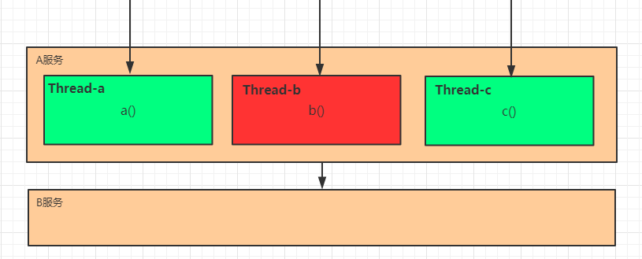

> 上图是线程池隔离

#### 7.2.2. 超时

在上游服务调用下游服务的时候，设置一个最大响应时间，如果超过这个时间，下游未作出反应，就断开请求，释放掉线程。

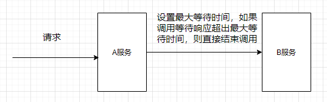

#### 7.2.3. 服务熔断

为了防止“雪崩效应”，分布式系统采用了**熔断机制**。当下游服务因访问压力过大而响应变慢或失败，上游服务为了保护系统整体的可用性，可以暂时切断对下游服务的调用，从而保全整体的措施就叫做熔断。在Spring Cloud构建的微服务系统中，采用了**熔断器**（即Hystrix组件的Ciruit Breaker）去做熔断。

例：当服务b出现故障，请求失败次数超过设定的阀值之后，服务b就会开启熔断器，之后服务b不进行任何的业务逻辑操作，执行快速失败并直接返回请求失败的信息。其他依赖b的服务就不会因为得不到响应而线程阻塞。此时除了服务b和依赖于服务b的部分功能不可用外，其他功能正常

熔断器还具有一个**自我修复的机制**。即当服务b熔断后，半打开的熔断器会检查一部分请求，其他请求执行快速失败响应，检查的部分如何成功，则会判定服务b正常，就会关闭服务b的熔断器；如果不正常，则继续打开熔断器。

熔断组件往往会提供一系列的监控，例如：服务是否可用，熔断器是否被打开、目前的吞吐量、网络延迟状态的监控等。

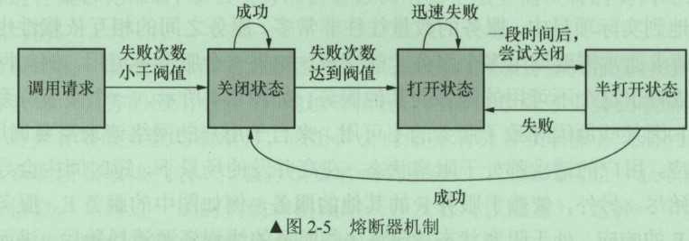

**熔断器机制的作用**：

- 将资源进行隔离，只会隔离故障的API接口，不会影响其他的API接口
- 服务降级的功能。当大量请求剏并发时，熔断器会被打开，将服务降级，以免服务器因负载过高而出现故障
- 自我修复能力。

**服务熔断一般有三种状态**：

- 熔断关闭状态（Closed）：服务没有故障时，熔断器所处的状态，对调用方的调用不做任何限制
- 熔断开启状态（Open）：后续对该服务接口的调用不再经过网络，直接执行本地的 fallback 方法
- 半熔断状态（Half-Open）：尝试恢复服务调用，允许有限的流量调用该服务，并监控调用成功率。如果成功率达到预期，则说明服务已恢复，进入熔断关闭状态；如果成功率仍旧很低，则重新进入熔断关闭状态。

#### 7.2.4. 服务降级

**降级**，就是当某个服务熔断之后，服务器将不再被调用，此时客户端可以自己准备一个本地的 fallback 回调，返回一个缺省值。也可以理解为兜底


#### 7.2.5. 服务限流

**限流**也可以认为服务降级的一种，限流就是限制系统的输入和输出流量已达到保护系统的目的。一般来说系统的吞吐量是可以被测算的，为了保证系统的稳固运行，一旦达到的需要限制的阈值，就需要限制流量并采取少量措施以完成限制流量的目的。比方：推迟解决，拒绝解决，或者部分拒绝解决等等。

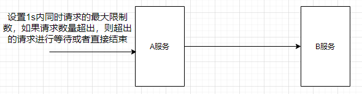

### 7.3. 常见的容错组件

- **Hystrix**

Hystrix 是由 Netflix 开源的一个延迟和容错库，用于隔离访问远程系统、服务或者第三方库，防止级联失败，从而提升系统的可用性与容错性。

- **Resilience4J**

Resilicence4J 一款非常轻量、简单，并且文档非常清晰、丰富的熔断工具，这也是 Hystrix 官方推荐的替代产品。不仅如此，Resilicence4j 还原生支持 Spring Boot 1.x/2.x，而且监控也支持和 prometheus 等多款主流产品进行整合。

- **Sentinel**

Sentinel 是阿里巴巴开源的一款断路器实现，本身在阿里内部已经被大规模采用，非常稳定。

三个组件在各方面的对比：

|              |                     Sentinel                      |        Hystrix        |        resilience4j         |
| ------------ | ------------------------------------------------- | --------------------- | --------------------------- |
| 隔离策略      | 信号量隔离（并发线程数限流）                          | 线程池隔离/信号量隔离    | 信号量隔离                    |
| 熔断降级策略   | 基于响应时间、异常比率、异常数                         | 基于异常比率            | 基于异常比率、响应时间          |
| 实时统计实现   | 滑动窗口（LeapArray）                               | 滑动窗口（基于 RxJava） | Ring Bit Buffer             |
| 动态规则配置   | 支持多种数据源                                      | 支持多种数据源          | 有限支持                     |
| 扩展性        | 多个扩展点                                         | 插件的形式             | 接口的形式                    |
| 基于注解的支持 | 支持                                              | 支持                  | 支持                         |
| 限流          | 基于 QPS，支持基于调用关系的限流                      | 有限的支持             | Rate Limiter                |
| 流量整形      | 支持预热模式、匀速器模式、预热排队模式                  | 不支持                 | 简单的 Rate Limiter模式       |
| 系统自适应保护 | 支持                                              | 不支持                 | 不支持                       |
| 控制台        | 提供开箱即用的控制台，可配置规则、查看秒级监控、机器发现等 | 简单的监控查看          | 不提供控制台，可对接其它监控系统 |

## 8. 链路追踪

### 8.1. 微服务架构下的问题

在大型系统的微服务化构建中，微服务按照不同的维度，一个系统会被拆分成许多模块。这些模块负责不同的功能，组合成系统，最终可以提供丰富的功能。在这种架构中，一次请求往往需要涉及到多个服务。互联网应用构建在不同的软件模块集上，这些软件模块，有可能是由不同的团队开发、可能使用不同的编程语言来实现、有可能布在了几千台服务器，横跨多个不同的数据中心，也就意味着这种架构形式也会存在一些问题：

- 如何快速发现问题？
- 如何判断故障影响范围？
- 如何梳理服务依赖以及依赖的合理性？
- 如何分析链路性能问题以及实时容量规划？


### 8.2. 分布式链路追踪（Distributed Tracing）

**分布式链路追踪**（Distributed Tracing），就是将一次分布式请求还原成调用链路，进行日志记录，性能监控并将 一次分布式请求的调用情况集中展示。比如各个服务节点上的耗时、请求具体到达哪台机器上、每个服务节点的请求状态等等。

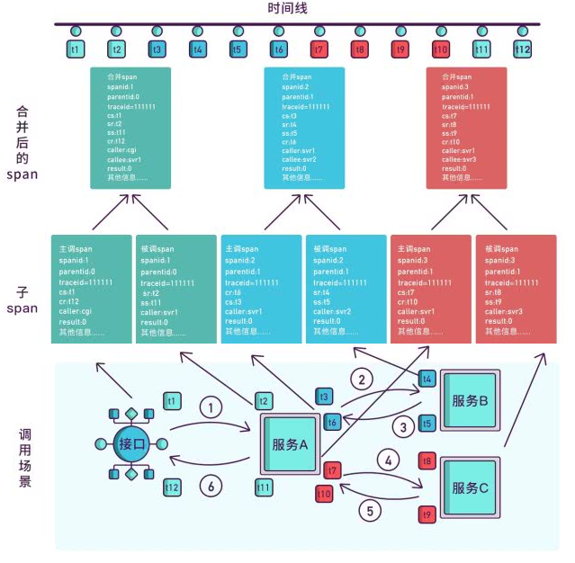

### 8.3. 链路追踪相关产品

目前业界比较流行的链路追踪技术，如下：

- cat：由大众点评开源，基于Java开发的实时应用监控平台，包括实时应用监控，业务监控。集成方案是通过代码埋点的方式来实现监控，比如：拦截器，过滤器等。对代码的侵入性很大，集成成本较高。风险较大。
- zipkin：由Twitter公司开源，开放源代码分布式的跟踪系统，用于收集服务的定时数据，以解决微服务架构中的延迟问题，包括：数据的收集、存储、查找和展现。该产品结合 spring-cloud-sleuth 使用较为简单，集成很方便，但是功能较简单。
- Pinpoint：是韩国人开源的基于字节码注入的调用链分析，以及应用监控分析工具。特点是支持多种插件，UI功能强大，接入端无代码侵入。
- SkyWalking：是本土开源的基于字节码注入的调用链分析，以及应用监控分析工具。特点是支持多种插件，UI功能较强，接入端无代码侵入。目前已加入Apache孵化器。
- Sleuth：Spring Cloud 提供的分布式系统中链路追踪解决方案。
- 阿里的鹰眼
- 美团的Mtrace

以上链路追踪技术大部分都是基于google发表的Dapper。Dapper阐述了分布式系统，特别是微服务架构中链路追踪的概念、数据表示、埋点、传递、收集、存储与展示等技术细节。

## 9. 分布式中的CAP原理

对于多数大型互联网应用都是分页式系统（distributed system），分布式系统的最大难点，就是各个节点的状态如何同步。CAP 定理是这方面的基本定理，也是理解分布式系统的起点。

分布式系统的CAP理论，把分布式系统归纳成以下三个特性：

- **Consistency（一致性）**：数据一致更新，所有数据的变化都是同步的
- **Availability（可用性）**：在集群中一部分节点故障后，集群整体是否还能响应客户端的读写请求
- **Partition tolerance（分区容忍性）**：某个节点的故障，并不影响整个系统的运行

> 注：通过学习CAP理论，得知任何分布式系统只可同时满足二点，没法三者兼顾，既然一个分布式系统无法同时满足一致性、可用性、分区容错性三个特点，所以就需要抛弃其中一点

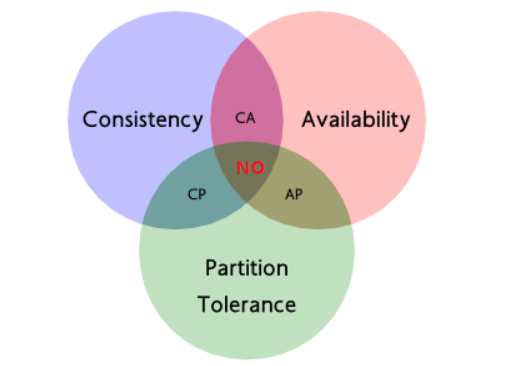

| 选择 |                                                     说明                                                      |
| --- | ------------------------------------------------------------------------------------------------------------ |
| CA   | 放弃分区容错性，加强一致性和可用性，其实就是传统的关系型数据库的选择                                                 |
| AP   | 放弃一致性（这里说的一致性是强一致性），追求分区容错性和可用性，这是很多分布式系统设计时的选择，例如很多NoSQL系统就是如此 |
| CP   | 放弃可用性，追求一致性和分区容错性，基本不会选择，网络问题会直接让整个系统不可用                                      |

需要明确一点的是，**在一个分布式系统当中，分区容忍性和可用性是最基本的需求，所以在分布是系统中最当关注的就是A（可用性）P（容忍性），通过补偿的机制寻求数据的一致性**

## 10. 分布式事务

### 10.1. 事务概念回顾

事务指的就是一个操作单元，在这个操作单元中的所有操作最终要保持一致的行为，要么所有操作都成功，要么所有的操作都被撤销。

本地事务其实可以认为是数据库提供的事务机制。数据库事务中的四大特性:

- A：原子性(Atomicity)，一个事务中的所有操作，要么全部完成，要么全部不完成
- C：一致性(Consistency)，在一个事务执行之前和执行之后数据库都必须处于一致性状态
- I：隔离性(Isolation)，在并发环境中，当不同的事务同时操作相同的数据时，事务之间互不影响
- D：持久性(Durability)，指的是只要事务成功结束，它对数据库所做的更新就必须永久的保存下来

数据库事务在实现时会将一次事务涉及的所有操作全部纳入到一个不可分割的执行单元，该执行单元中的所有操作要么都成功，要么都失败，只要其中任一操作执行失败，都将导致整个事务的回滚

### 10.2. 分布式事务概述

分布式事务指事务的参与者、支持事务的服务器、资源服务器以及事务管理器分别位于不同的分布式系统的不同节点之上。本质上来说，分布式事务就是为了保证不同数据库的数据一致性。

简单来说，就是一次大的操作由不同的小操作组成，这些小的操作分布在不同的服务器上，且属于不同的应用，分布式事务需要保证这些小操作要么全部成功，要么全部失败。

### 10.3. 分布式事务的场景

- **单体系统访问多个数据库**。一个服务需要调用多个数据库实例完成数据的增删改操作


- **多个微服务访问同一个数据库**。多个服务需要调用一个数据库实例完成数据的增删改操作

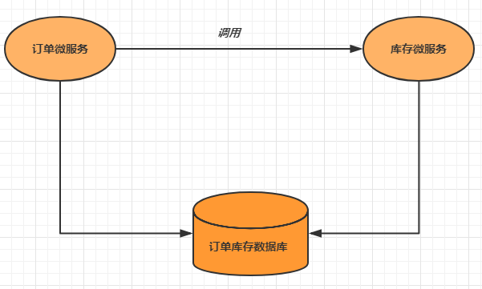

- **多个微服务访问多个数据库**。多个服务需要调用多个数据库实例完成数据的增删改操作

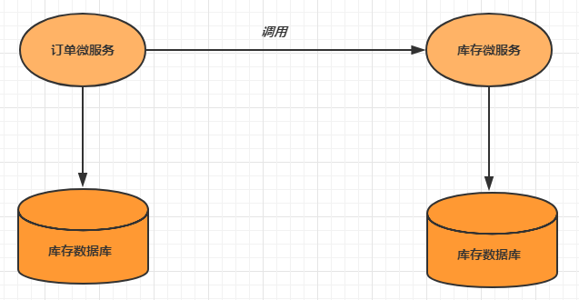

### 10.4. 分布式事务解决方案

#### 10.4.1. 全局事务

全局事务基于DTP模型实现。DTP是由X/Open组织提出的一种分布式事务模型——X/Open Distributed Transaction Processing Reference Model。它规定了要实现分布式事务，需要三种角色：

- AP: Application 应用系统 (微服务)
- TM: Transaction Manager 事务管理器 (全局事务管理)
- RM: Resource Manager 资源管理器 (数据库)

整个事务分成两个阶段：

- 阶段一: 表决阶段，所有参与者都将本事务执行预提交，并将能否成功的信息反馈发给协调者。
- 阶段二: 执行阶段，协调者根据所有参与者的反馈，通知所有参与者，步调一致地执行提交或者回滚。

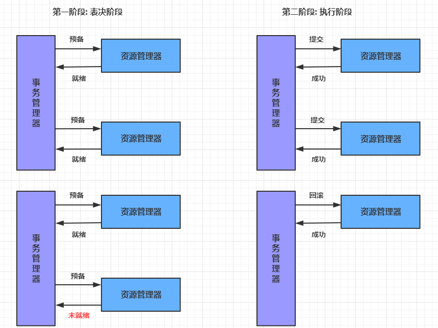

**优点**

- 提高了数据一致性的概率，实现成本较低

**缺点**

- 单点问题: 事务协调者宕机
- 同步阻塞: 延迟了提交时间，加长了资源阻塞时间
- 数据不一致: 提交第二阶段，依然存在commit结果未知的情况，有可能导致数据不一致

#### 10.4.2. 可靠消息服务

基于可靠消息服务的方案是通过消息中间件保证上、下游应用数据操作的一致性。假设有A和B两个系统，分别可以处理任务A和任务B。此时存在一个业务流程，需要将任务A和任务B在同一个事务中处理。就可以使用消息中间件来实现这种分布式事务。

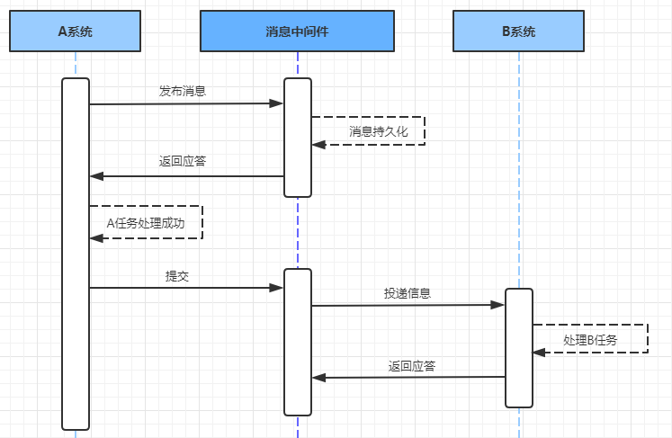

**第一步: 消息由系统A投递到中间件**

1. 在系统A处理任务A前，首先向消息中间件发送一条消息
2. 消息中间件收到后将该条消息持久化，但并不投递。持久化成功后，向A回复一个确认应答
3. 系统A收到确认应答后，则可以开始处理任务A
4. 任务A处理完成后，向消息中间件发送Commit或者Rollback请求。该请求发送完成后，对系统A而言，该事务的处理过程就结束了
5. 如果消息中间件收到Commit，则向B系统投递消息；如果收到Rollback，则直接丢弃消息。但是如果消息中间件收不到Commit和Rollback指令，那么就要依靠"超时询问机制"。

> 超时询问机制：系统A除了实现正常的业务流程外，还需提供一个事务询问的接口，供消息中间件调用。当消息中间件收到发布消息便开始计时，如果到了超时没收到确认指令，就会主动调用系统A提供的事务询问接口询问该系统目前的状态。该接口会返回三种结果，中间件根据三种结果做出不同反应：
>
> - 提交：将该消息投递给系统B
> - 回滚：直接将条消息丢弃
> - 处理中：继续等待

**第一步: 消息由系统A投递到中间件**

消息中间件向下游系统投递完消息后便进入阻塞等待状态，下游系统便立即进行任务的处理，任务处理完成后便向消息中间件返回应答。

- 如果消息中间件收到确认应答后便认为该事务处理完毕
- 如果消息中间件在等待确认应答超时之后就会重新投递，直到下游消费者返回消费成功响应为止。一般消息中间件可以设置消息重试的次数和时间间隔，如果最终还是不能成功投递，则需要手工干预。这里之所以使用人工干预，而不是使用让A系统回滚，主要是考虑到整个系统设计的复杂度问题。

基于可靠消息服务的分布式事务，前半部分使用异步，注重性能；后半部分使用同步，注重开发成本。

#### 10.4.3. 最大努力通知

最大努力通知也被称为定期校对，其实是对第二种解决方案的进一步优化。它引入了本地消息表来记录错误消息，然后加入失败消息的定期校对功能，来进一步保证消息会被下游系统消费。


**第一步: 消息由系统A投递到中间件**

1. 处理业务的同一事务中，向本地消息表中写入一条记录
2. 准备专门的消息发送者不断地发送本地消息表中的消息到消息中间件，如果发送失败则重试

**第二步: 消息由中间件投递到系统B**

1. 消息中间件收到消息后负责将该消息同步投递给相应的下游系统，并触发下游系统的任务执行
2. 当下游系统处理成功后，向消息中间件反馈确认应答，消息中间件便可以将该条消息删除，从而该事务完成
3. 对于投递失败的消息，利用重试机制进行重试，对于重试失败的，写入错误消息表
4. 消息中间件需要提供失败消息的查询接口，下游系统会定期查询失败消息，并将其消费

最大努力通知的优缺点：

- **优点**：一种非常经典的实现，实现了最终一致性。
- **缺点**：消息表会耦合到业务系统中，如果没有封装好的解决方案，会有很多杂活需要处理。

#### 10.4.4. TCC 事务

TCC（Try Confirm Cancel），它属于补偿型分布式事务。TCC 实现分布式事务一共有三个步骤：

- Try：尝试待执行的业务

这个过程并未执行业务，只是完成所有业务的一致性检查，并预留好执行所需的全部资源

- Confirm：确认执行业务

确认执行业务操作，不做任何业务检查， 只使用 Try 阶段预留的业务资源。通常情况下，采用 TCC 则认为 Confirm 阶段是不会出错的。即：只要 Try 成功，Confirm 一定成功。若 Confirm 阶段真的出错了，需引入重试机制或人工处理。

- Cancel：取消待执行的业务

取消 Try 阶段预留的业务资源。通常情况下，采用 TCC 则认为 Cancel 阶段也是一定成功的。若 Cancel 阶段真的出错了，需引入重试机制或人工处理。


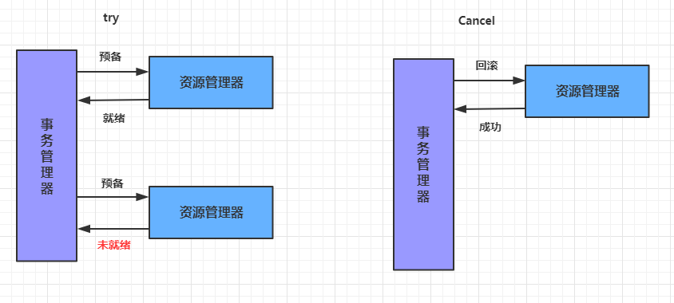

**TCC两阶段提交与XA两阶段提交的区别是**：

- XA 是资源层面的分布式事务，强一致性，在两阶段提交的整个过程中，一直会持有资源的锁。
- TCC 是业务层面的分布式事务，最终一致性，不会一直持有资源的锁。

**TCC事务的优缺点**：

- **优点**：把数据库层的二阶段提交上提到了应用层来实现，规避了数据库层的 2PC 性能低下问题。
- **缺点**：TCC 的 Try、Confirm 和 Cancel 操作功能需业务提供，开发成本高。

## 11. 分布式缓存的核心问题

分布式缓存设计的核心问题是**以哪种方式进行缓存预热和缓存更新，以及如何优雅解决缓存雪崩、缓存穿透、缓存降级等问题**。在不同的应用场景下有不同的解决方案。

### 11.1. 缓存预热

缓存预热就是系统上线后，将相关的缓存数据直接加载到缓存系统。从而避免在用户请求的时候，先查询数据库，然后再将数据缓存的问题！用户直接查询事先被预热的缓存数据，以提高系统查询效率！

缓存预热一般有**系统启动加载**、**定时加载**等方式。

### 11.2. 缓存更新

缓存更新，是指在数据发生变化后及时将变化后的数据更新到缓存。除了缓存服务器自带的缓存失效策略之外（Redis 默认的有 6 中策略可供选择），还可以根据具体的业务需求进行自定义的缓存淘汰，常见的策略有以下几种：

1. **定时更新**：定时将底层数据库内的数据更新到缓存中，此方式比较简单，适合需要缓存的数据量不是很大的应用场景。
2. **过期更新**：定时清理缓存中过期的数据，更新为最新数据与缓存的过期时间。
3. **写请求更新**：在用户有写请求时先写数据库同时更新缓存，这适用于用户对缓存数据和数据库的数据有实时强一致性要求的情况。
4. **读请求更新**：在用户有读请求时，先判断该请求数据的缓存是否存在或过期，如果不存在或已过期，则进行底层数据库查询并将查询结果更新到缓存中，同时将查询结果返回给用户。

### 11.3. 缓存淘汰策略

在缓存数据过多时需要使用某种淘汰算法决定淘汰哪些数据。常用的淘汰算法有以下几种：

- FIFO（First In First Out，先进先出）：判断被存储的时间，离目前最远的数据优先被淘汰。
- LRU（Least Recently Used，最近最少使用）：判断缓存最近被使用的时间，距离当前时间最远的数据优先被淘汰。
- LFU（Least Frequently Used，最不经常使用）：在一段时间内，被使用次数最少的缓存优先被淘汰。

### 11.4. 缓存雪崩

缓存雪崩，是指在同一时刻由于大量缓存失效，导致大量原本应该访问缓存的请求都去查询数据库，而对数据库的CPU和内存造成巨大压力，严重的话会导致数据库宕机，从而形成一系列连锁反应，使整个系统崩溃。

- **请求加锁**：对于并发量不是很多的应用，可以使用请求加锁排队的方案防止过多请求数据库。
- **失效更新**：给每一个缓存数据都增加过期标记，记录缓存数据是否失效。如果缓存标记失效，则更新数据缓存。
- **设置不同的失效时间**：给不同的 key 设置不同的缓存失效时间，防止在同一时刻有大量的数据失效。

### 11.5. 缓存穿透

缓存穿透，是指由于缓存系统故障或者用户频繁查询系统中不存在的数据（在系统中不存在，在自然数据库和缓存中都不存在）。就会导致用户查询请求，在缓存中找不到数据后，会穿过缓存不断地发送到数据库（整个过程相当于进行了两次无用的查询），导致数据库过载，进而引发一连串并发问题。请求绕过缓存直接查数据库，也是缓存命中率的问题。

常用的解决缓存穿透问题有以下的方法：

- **布隆过滤器**：将所有可能存在的数据哈希到一个足够大的 Bitmap 中，在接收到请求时，首先经过布隆过滤器的拦截，一些肯定不存在的数据都会被这个 bitmap 拦截掉，从而避免了对底层存储系统的查询压力。
- **cache null 策略**：如果一个查询返回的数据为空（不管是数据不存在，还是系统故障），仍然将这个空结果进行缓存，并设置一个较短的过期时间（最长不超过5分钟）。当再次请求该数据时直接到缓存中返回空值，而不会继续访问数据库。此策略的核心原理是：在缓存中记录一个短暂的（数据过期时间内）数据在系统中是否存在的状态，如果不存在，则直接返回null，不再查询数据库，从而避免缓存穿透到数据库上。

> 番外：布隆过滤器的原理，当一个元素被加入集合时，通过 K 个散列函数将这个元素映射成一个位数组中的 K 个点，把它们置为 1。查询时，将元素通过散列函数映射之后会得到 k 个点，如果这些点有任何一个 0，则被检元素一定不在，直接返回；如果都是 1，则查询元素很可能存在，就会去查询 Redis 和数据库。

### 11.6. 缓存击穿

缓存击穿：大量的请求同时查询一个 key 时，此时这个 key 刚好失效了，就会导致大量的请求都落到数据库。

> Tips: **缓存击穿是查询缓存中失效的 key，而缓存穿透是查询不存在的 key**。

解决方法：加分布式锁，第一个请求的线程可以拿到锁，拿到锁的线程查询到了数据之后设置缓存，其他的线程获取锁失败会等待 50ms 然后重新到缓存取数据，这样便可以避免大量的请求落到数据库。以下实现的伪代码：

```java
public String get(String key) {
    String value = redis.get(key);
    if (value == null) { // 缓存值过期
        String unique_key = systemId + ":" + key;
        // 设置30s的超时
        if (redis.set(unique_key, 1, 'NX', 'PX', 30000) == 1) { // 设置成功
            value = db.get(key);
            redis.set(key, value, expire_secs);
            redis.del(unique_key);
        } else { // 其他线程已经到数据库取值并回写到缓存了，可以重试获取缓存值
            sleep(50);
            get(key); // 重试
        }
    } else {
        return value;
    }
}
```

### 11.7. 缓存降级

缓存降级，指由于访问量剧增导致服务出现问题（如响应时间慢或不响应）或非核心服务影响到核心流程的性能时，为了优先保障核心业务的运行，采取减少或关闭非核心业务对资源的使用。系统可以根据一些关键数据进行自动降级，也可以配置开关实现人工降级。降级的最终目的是保证核心服务可用，即使是有损的。但需要注意的是，有些服务是无法降级的（如加入购物车、结算）。

常见的服务降级策略如下：

- **写降级**：在写请求增大时，可以只对缓存进行更新，然后将数据异步更新到数据库中，保证最终一致性即可。即将写请求从数据库降级为缓存。
- **读降级**：在数据库服务负载过高或数据库系统故障时，可以只对缓存进行读取并将结果返回给用户，在数据库服务正常后再去查询数据库。即将读请求从数据库降级为缓存。这种方式适用于对数据实时性要求不高的场景，保障了在系统发生故障的情况下用户依然能够访问到数据，只是访问到的数据相对有延迟。

进行降级之前要对系统进行梳理，哪些必须保护，哪些可降级。比如可以参考日志级别设置预案：

1. 一般：比如有些服务偶尔因为网络抖动或者服务正在上线而超时，可以自动降级；
2. 警告：有些服务在一段时间内成功率有波动（如在95~100%之间），可以自动降级或人工降级，并发送告警；
3. 错误：比如可用率低于90%，或者数据库连接池被打爆了，或者访问量突然猛增到系统能承受的最大阀值，此时可以根据情况自动降级或者人工降级；
4. 严重错误：比如因为特殊原因数据错误了，此时需要紧急人工降级。
