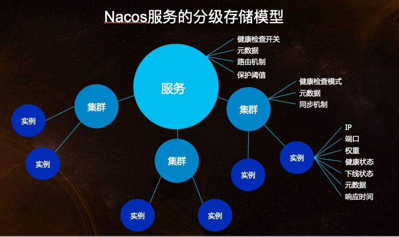

## 1. Nacos

### 1.1. Nacos 简介

Nacos(全称：Name and Config Service) 致力于发现、配置和管理微服务。Nacos 提供了一组简单易用的特性集，快速实现动态服务发现、服务配置、服务元数据及流量管理。更敏捷和容易地构建、交付和管理微服务平台。Nacos 是构建以“服务”为中心的现代应用架构 (例如微服务范式、云原生范式) 的服务基础设施。

Nacos 的核心功能 = 服务注册 + 动态配置，也可以理解为 Nacos = Spring Cloud Eureka + Spring Cloud Config

> 官网：https://nacos.io/zh-cn/index.html

### 1.2. Nacos 的关键特性

Nacos 支持几乎所有主流类型的“服务”的发现、配置和管理：

- Kubernetes Service
- gRPC & Dubbo RPC Service
- Spring Cloud RESTful Service

Nacos 的关键特性包括:

- **服务发现和服务健康监测**

Nacos 支持基于 DNS 和基于 RPC 的服务发现。服务提供者使用 [原生SDK](https://nacos.io/zh-cn/docs/v2/guide/user/sdk.html)、[OpenAPI](https://nacos.io/zh-cn/docs/v2/guide/user/open-api.html)、或一个[独立的Agent TODO](https://nacos.io/zh-cn/docs/v2/guide/user/other-language.html)注册 Service 后，服务消费者可以使用[DNS TODO](https://nacos.io/zh-cn/docs/v2/xx) 或[HTTP&API](https://nacos.io/zh-cn/docs/v2/guide/user/open-api.html)查找和发现服务。

Nacos 提供对服务的实时的健康检查，阻止向不健康的主机或服务实例发送请求。Nacos 支持传输层 (PING 或 TCP)和应用层 (如 HTTP、MySQL、用户自定义）的健康检查。 对于复杂的云环境和网络拓扑环境中（如 VPC、边缘网络等）服务的健康检查，Nacos 提供了 agent 上报模式和服务端主动检测2种健康检查模式。Nacos 还提供了统一的健康检查仪表盘，帮助您根据健康状态管理服务的可用性及流量。

- **动态配置服务**

动态配置服务可以让您以中心化、外部化和动态化的方式管理所有环境的应用配置和服务配置。

动态配置消除了配置变更时重新部署应用和服务的需要，让配置管理变得更加高效和敏捷。

配置中心化管理让实现无状态服务变得更简单，让服务按需弹性扩展变得更容易。

Nacos 提供了一个简洁易用的UI ([控制台样例 Demo](http://console.nacos.io/nacos/index.html)) 帮助您管理所有的服务和应用的配置。Nacos 还提供包括配置版本跟踪、金丝雀发布、一键回滚配置以及客户端配置更新状态跟踪在内的一系列开箱即用的配置管理特性，帮助您更安全地在生产环境中管理配置变更和降低配置变更带来的风险。

- **动态 DNS 服务**

动态 DNS 服务支持权重路由，让您更容易地实现中间层负载均衡、更灵活的路由策略、流量控制以及数据中心内网的简单DNS解析服务。动态DNS服务还能让您更容易地实现以 DNS 协议为基础的服务发现，以帮助您消除耦合到厂商私有服务发现 API 上的风险。

Nacos 提供了一些简单的 [DNS APIs TODO](https://nacos.io/zh-cn/docs/v2/xx) 帮助您管理服务的关联域名和可用的 IP:PORT 列表.

- **服务及其元数据管理**

Nacos 能让您从微服务平台建设的视角管理数据中心的所有服务及元数据，包括管理服务的描述、生命周期、服务的静态依赖分析、服务的健康状态、服务的流量管理、路由及安全策略、服务的 SLA 以及最首要的 metrics 统计数据。

### 1.3. Nacos 架构

#### 1.3.1. 基本架构及概念


**服务 (Service)**

服务是指一个或一组软件功能（例如特定信息的检索或一组操作的执行），其目的是不同的客户端可以为不同的目的重用（例如通过跨进程的网络调用）。Nacos 支持主流的服务生态，如 Kubernetes Service、gRPC|Dubbo RPC Service 或者 Spring Cloud RESTful Service。

**服务注册中心 (Service Registry)**

服务注册中心，它是服务，其实例及元数据的数据库。服务实例在启动时注册到服务注册表，并在关闭时注销。服务和路由器的客户端查询服务注册表以查找服务的可用实例。服务注册中心可能会调用服务实例的健康检查 API 来验证它是否能够处理请求。

**服务元数据 (Service Metadata)**

服务元数据是指包括服务端点(endpoints)、服务标签、服务版本号、服务实例权重、路由规则、安全策略等描述服务的数据。

**服务提供方 (Service Provider)**

是指提供可复用和可调用服务的应用方。

**服务消费方 (Service Consumer)**

是指会发起对某个服务调用的应用方。

**配置 (Configuration)**

在系统开发过程中通常会将一些需要变更的参数、变量等从代码中分离出来独立管理，以独立的配置文件的形式存在。目的是让静态的系统工件或者交付物（如 WAR，JAR 包等）更好地和实际的物理运行环境进行适配。配置管理一般包含在系统部署的过程中，由系统管理员或者运维人员完成这个步骤。配置变更是调整系统运行时的行为的有效手段之一。

**配置管理 (Configuration Management)**

在数据中心中，系统中所有配置的编辑、存储、分发、变更管理、历史版本管理、变更审计等所有与配置相关的活动统称为配置管理。

**名字服务 (Naming Service)**

提供分布式系统中所有对象(Object)、实体(Entity)的“名字”到关联的元数据之间的映射管理服务，例如 ServiceName -> Endpoints Info, Distributed Lock Name -> Lock Owner/Status Info, DNS Domain Name -> IP List, 服务发现和 DNS 就是名字服务的2大场景。

**配置服务 (Configuration Service)**

在服务或者应用运行过程中，提供动态配置或者元数据以及配置管理的服务提供者。

#### 1.3.2. 逻辑架构及其组件介绍


- 服务管理：实现服务 CRUD，域名 CRUD，服务健康状态检查，服务权重管理等功能
- 配置管理：实现配置管 CRUD，版本管理，灰度管理，监听管理，推送轨迹，聚合数据等功能
- 元数据管理：提供元数据 CURD 和打标能力
- 插件机制：实现三个模块可分可合能力，实现扩展点 SPI 机制
- 事件机制：实现异步化事件通知，sdk 数据变化异步通知等逻辑
- 日志模块：管理日志分类，日志级别，日志可移植性（尤其避免冲突），日志格式，异常码+帮助文档
- 回调机制：sdk 通知数据，通过统一的模式回调用户处理。接口和数据结构需要具备可扩展性
- 寻址模式：解决 ip，域名，nameserver、广播等多种寻址模式，需要可扩展
- 推送通道：解决 server 与存储、server 间、server 与 sdk 间推送性能问题
- 容量管理：管理每个租户，分组下的容量，防止存储被写爆，影响服务可用性
- 流量管理：按照租户，分组等多个维度对请求频率，长链接个数，报文大小，请求流控进行控制
- 缓存机制：容灾目录，本地缓存，server缓存机制。容灾目录使用需要工具
- 启动模式：按照单机模式，配置模式，服务模式，dns 模式，或者 all 模式，启动不同的程序+UI
- 一致性协议：解决不同数据，不同一致性要求情况下，不同一致性机制
- 存储模块：解决数据持久化、非持久化存储，解决数据分片问题
- Nameserver：解决 namespace 到 clusterid 的路由问题，解决用户环境与 nacos 物理环境映射问题
- CMDB：解决元数据存储，与三方 cmdb 系统对接问题，解决应用，人，资源关系
- Metrics：暴露标准metrics数据，方便与三方监控系统打通
- Trace：暴露标准 trace，方便与 SLA 系统打通，日志白平化，推送轨迹等能力，并且可以和计量计费系统打通
- 接入管理：相当于阿里云开通服务，分配身份、容量、权限过程
- 用户管理：解决用户管理，登录，sso 等问题
- 权限管理：解决身份识别，访问控制，角色管理等问题
- 审计系统：扩展接口方便与不同公司审计系统打通
- 通知系统：核心数据变更，或者操作，方便通过 SMS 系统打通，通知到对应人数据变更
- OpenAPI：暴露标准 Rest 风格 HTTP 接口，简单易用，方便多语言集成
- Console：易用控制台，做服务管理、配置管理等操作
- SDK：多语言 sdk
- Agent：dns-f 类似模式，或者与 mesh 等方案集成
- CLI：命令行对产品进行轻量化管理，像 git 一样好用

### 1.4. Nacos 相关资源

- [Nacos开发团队 - Nacos 架构 & 原理（语雀）](https://www.yuque.com/nacos/ebook)

## 2. Nacos 的获取与搭建

> Nacos 定义为一个 IDC 内部应用组件，并非面向公网环境的产品，建议在内部隔离网络环境中部署，强烈不建议部署在公共网络环境。

### 2.1. 版本选择

Nacos 1.X 是老版本，将来会停止维护。建议使用2.X版本。

在 Nacos 的[release notes](https://github.com/alibaba/nacos/releases)及[博客](https://nacos.io/zh-cn/blog/index.html)中找到每个版本支持的功能的介绍，当前推荐的稳定版本为2.1.1。（*更新于2023.03.11*）

### 2.2. 预备环境准备

Nacos 依赖 Java 环境来运行。如果是从代码开始构建并运行 Nacos，还需要为此配置 Maven 环境，请确保是在以下版本环境中安装使用:

1. 64 bit OS，支持 Linux/Unix/Mac/Windows，推荐选用 Linux/Unix/Mac。
2. 64 bit JDK 1.8+
3. Maven 3.2.x+
4. 单机部署建议: 2核 CPU / 4G 内存 及其以上
5. 集群部署建议: 生产环境 3 个节点 及其以上

### 2.3. Nacos 的获取

Nacos 服务端搭建只需要下载官方安装包，github 仓库下载地址：https://github.com/alibaba/nacos/releases

> Tips: Github 在国内下载速度比较慢，可以到『Gitee 极速下载/Nacos』下载安装包或者源码。地址：https://gitee.com/mirrors/Nacos

可以通过源码和发行包两种方式来获取 Nacos。

#### 2.3.1. 从 Github 上下载源码方式

```bash
git clone https://github.com/alibaba/nacos.git
cd nacos/
mvn -Prelease-nacos -Dmaven.test.skip=true clean install -U  
ls -al distribution/target/

// change the $version to your actual path
cd distribution/target/nacos-server-$version/nacos/bin
```

#### 2.3.2. 下载编译后压缩包方式

可以直接从官方仓库（github）下载 `nacos-server-x.x.x.zip` 包（*笔记编写时最新版本是2.0.3*）。下载后压缩，进行bin目录运行即可

```bash
unzip nacos-server-$version.zip 或者 tar -xvf nacos-server-$version.tar.gz
cd nacos/bin
```

> 注：命令中的`$version`为nacos的版本号

### 2.4. Nacos 支持三种部署模式

- 单机模式 - 用于测试和单机试用。
- 集群模式 - 用于生产环境，确保高可用。
- 多集群模式 - 用于多数据中心场景。

### 2.5. 单机模式

#### 2.5.1. 启动服务器

进入 nacos 的 bin 目录中执行以下命令启动服务，其中命令参数 `standalone` 代表单机模式运行，非集群模式。**Windows 环境下的启动命令**：

```bash
$ cmd startup.cmd -m standalone
```

> 注：命令参数 `standalone` 代表着单机模式运行，非集群模式。*在2.0.3版本，如果直接点击startup.cmd脚本启动会报错，必须通过命令行方式指定参数运行*

**Linux/Unix/Mac 环境下的启动命令**：

```shell
$ sh startup.sh -m standalone
```

如果使用的是ubuntu系统，或者运行脚本报错提示[[符号找不到，可尝试如下运行：

```bash
bash startup.sh -m standalone
```

#### 2.5.2. 访问 nacos 服务

打开浏览器输入 `http://127.0.0.1:8848/nacos`，即可访问服务，默认账号和密码是nacos/nacos

#### 2.5.3. Nacos 测试 API

**服务注册测试请求**

```
curl -X POST 'http://127.0.0.1:8848/nacos/v1/ns/instance?serviceName=nacos.naming.serviceName&ip=20.18.7.10&port=8080'
```

**服务发现测试请求**

```
curl -X GET 'http://127.0.0.1:8848/nacos/v1/ns/instance/list?serviceName=nacos.naming.serviceName'
```

**发布配置测试请求**

```
curl -X POST "http://127.0.0.1:8848/nacos/v1/cs/configs?dataId=nacos.cfg.dataId&group=test&content=HelloWorld"
```

**获取配置测试请求**

```
curl -X GET "http://127.0.0.1:8848/nacos/v1/cs/configs?dataId=nacos.cfg.dataId&group=test"
```

#### 2.5.4. 关闭服务器

**Windows 环境**

```bash
shutdown.cmd
```

或者双击shutdown.cmd运行文件。

**Linux/Unix/Mac 环境**

```shell
sh shutdown.sh
```

#### 2.5.5. 单机模式支持 mysql

在 nacos 0.7 版本之前，在单机模式时 nacos 使用嵌入式数据库实现数据的存储，不方便观察数据存储的基本情况。0.7 版本增加了支持 mysql 数据源能力，具体的操作步骤：

1. 安装数据库，版本要求：5.6.5+
2. 初始化 mysql 数据库，数据库初始化文件：mysql-schema.sql
3. 修改 conf/application.properties 文件，增加支持 mysql 数据源配置（目前只支持mysql），添加 mysql 数据源的 url、用户名和密码。

```properties
spring.datasource.platform=mysql

### Count of DB:
db.num=1

### Connect URL of DB:
db.url.0=jdbc:mysql://127.0.0.1:3306/nacos?characterEncoding=utf8&connectTimeout=1000&socketTimeout=3000&autoReconnect=true&useUnicode=true&useSSL=false&serverTimezone=UTC
db.user.0=root
db.password.0=123456
```

再以单机模式启动 nacos，此时所有相关的配置数据都持久化到 mysql 数据库

### 2.6. 集群模式

#### 2.6.1. 集群部署架构图

- `http://ip1:port/openAPI` 直连 ip 模式，机器挂则需要修改 ip 才可以使用。
- `http://SLB:port/openAPI` 挂载 SLB 模式(内网 SLB，不可暴露到公网，以免带来安全风险)，直连 SLB 即可，下面挂 server 真实 ip，可读性不好。
- `http://nacos.com:port/openAPI` 域名 + SLB 模式(内网 SLB，不可暴露到公网，以免带来安全风险)，可读性好，而且换 ip 方便，推荐模式


> Tips: 推荐用户把所有服务列表放到一个 vip 下面，然后挂到一个域名下面

#### 2.6.2. 环境准备

请确保是在环境中安装使用:

- 64 bit OS Linux/Unix/Mac，推荐使用Linux系统
- 64 bit JDK 1.8+
- Maven 3.2.x+
- 3个或3个以上Nacos节点才能构成集群

> 根据前面章节介绍的方法获取 Nacos 与安装

#### 2.6.3. 配置集群配置文件

在 nacos 的解压目录 nacos/conf 目录下，创建配置文件 cluster.conf，在每行配置成 ip:port（至少配置3个或3个以上节点）。**每个节点均要配置此文件**。如下：

```
# ip:port
200.8.9.16:8848
200.8.9.17:8848
200.8.9.18:8848
```

> Tips: nacos/conf 目录下有 cluster.conf.example 示例配置，复制一份后直接将 `.example` 后缀去掉来使用即可

#### 2.6.4. 配置数据源

- **使用内置数据源**：使用这种方式无需进行任何配置
- **使用外置数据源**：生产使用建议至少主备模式，或者采用高可用数据库。并且需要以下配置：
    - 在 nacos 的 conf 目录中，有初始化 MySQL 数据库脚本：mysql-schema.sql，或者查看在线的[初始化源文件](https://github.com/alibaba/nacos/blob/master/distribution/conf/mysql-schema.sql)
    - 修改 nacos 的 conf 目录中 application.properties 配置文件，或者查看在线的[示例模板](https://github.com/alibaba/nacos/blob/master/distribution/conf/application.properties)

#### 2.6.5. 启动与关闭服务器

使用内置数据源的集群模式：

```bash
sh startup.sh -p embedded
```

使用外置数据源的集群模式：

```bash
sh startup.sh
```

Linux/Unix/Mac 关闭服务器

```bash
sh shutdown.sh
```

#### 2.6.6. 使用 Nginx 配置 Nacos 负载均衡

修改 Nginx 配置，添加如下：

```
upstream nacos {
    server 127.0.0.1:8841;
    server 127.0.0.1:8842;
    server 127.0.0.1:8853;
}
server {
    listen 9090;
    server_name localhost;
    location /nacos/ {
        proxy_pass http://nacos;
    }
}
```

#### 2.6.7. 服务注册&发现和配置管理测试

配置完成后，发送以下请求进行测试

**服务注册**

```
curl -X PUT 'http://127.0.0.1:8848/nacos/v1/ns/instance?serviceName=nacos.naming.serviceName&ip=20.18.7.10&port=8080'
```

**服务发现**

```
curl -X GET 'http://127.0.0.1:8848/nacos/v1/ns/instance/list?serviceName=nacos.naming.serviceName'
```

**发布配置**

```
curl -X POST "http://127.0.0.1:8848/nacos/v1/cs/configs?dataId=nacos.cfg.dataId&group=test&content=helloWorld"
```

**获取配置**

```
curl -X GET "http://127.0.0.1:8848/nacos/v1/cs/configs?dataId=nacos.cfg.dataId&group=test"
```

### 2.7. 多集群模式

Nacos 支持 NameServer 路由请求模式，通过它您可以设计一个有用的映射规则来控制请求转发到相应的集群，在映射规则中您可以按命名空间或租户等分片请求...

### 2.8. 多网卡IP选择

当本地环境比较复杂的时候，Nacos服务在启动的时候需要选择运行时使用的IP或者网卡。Nacos从多网卡获取IP参考Spring Cloud设计，通过nacos.inetutils参数，可以指定Nacos使用的网卡和IP地址。目前支持的配置参数有：

`ip-address` 参数可以直接设置 nacos 的 ip

```properties
nacos.inetutils.ip-address=10.11.105.155
```

`use-only-site-local-interfaces` 参数可以让 nacos 使用局域网 ip，这个在nacos 部署的机器有多网卡时很有用，可以让 nacos 选择局域网网卡

```properties
nacos.inetutils.use-only-site-local-interfaces=true
```

`ignored-interfaces` 支持网卡数组，可以让 nacos忽略多个网卡

```properties
nacos.inetutils.ignored-interfaces[0]=eth0
nacos.inetutils.ignored-interfaces[1]=eth1
```

`preferred-networks` 参数可以让 nacos 优先选择匹配的ip，支持正则匹配和前缀匹配
 
```properties
nacos.inetutils.preferred-networks[0]=30.5.124.
nacos.inetutils.preferred-networks[0]=30.5.124.(25[0-5]|2[0-4]\\d|((1d{2})|([1-9]?\\d))),30.5.124.(25[0-5]|2[0-4]\\d|((1d{2})|([1-9]?\\d)))
```

## 3. Spring Cloud Alibaba Nacos Discovery

### 3.1. Nacos Discovery 概述

服务发现是微服务架构体系中最关键的组件之一。如果尝试着用手动的方式来给每一个客户端来配置所有服务提供者的服务列表是一件非常困难的事，而且也不利于**服务的动态扩缩容**。Nacos Discovery 可以将服务自动注册到 Nacos 服务端并且能够动态感知和刷新某个服务实例的服务列表。除此之外，Nacos Discovery 也将服务实例自身的一些元数据信息（例如 host，port，健康检查URL，主页等）注册到 Nacos。

Spring Cloud 项目中，通过 Nacos Server 和 spring-cloud-starter-alibaba-nacos-discovery 实现服务的注册与发现。如下图示:

### 3.2. Nacos 实现服务注册与发现


> 前提条件：需要先下载 Nacos 并启动 Nacos server。

以下示例是在 Spring Cloud 项目中启动 Nacos 的服务发现功能。以『商品模块』作为服务提供者，以『订单模块』作为服务消费方。

> 完整示例代码请参考：https://github.com/MooNkirA/spring-cloud-note

#### 3.2.1. Nacos Discovery Starter 依赖

在项目中使用 Nacos 来实现服务发现，使用 group ID 为 `com.alibaba.cloud` 和 artifact ID 为 `spring-cloud-starter-alibaba-nacos-discovery` 的 starter。修改商品模块 pom.xml 添加 nacos 注册中心客户端依赖。

```xml
<!-- nacos 注册中心客户端 -->
<dependency>
    <groupId>com.alibaba.cloud</groupId>
    <artifactId>spring-cloud-starter-alibaba-nacos-discovery</artifactId>
    <version>${latest.version}</version>
</dependency>
```

> Tips: 
>
> - 版本 2.1.x.RELEASE 对应的是 Spring Boot 2.1.x 版本
> - 版本 2.0.x.RELEASE 对应的是 Spring Boot 2.0.x 版本
> - 版本 1.5.x.RELEASE 对应的是 Spring Boot 1.5.x 版本

#### 3.2.2. 启动 Provider 应用

1. 引入依赖。一个完整的 pom.xml 配置如下所示：

```xml
<?xml version="1.0" encoding="UTF-8"?>
<project xmlns="http://maven.apache.org/POM/4.0.0" xmlns:xsi="http://www.w3.org/2001/XMLSchema-instance"
         xsi:schemaLocation="http://maven.apache.org/POM/4.0.0 http://maven.apache.org/xsd/maven-4.0.0.xsd">
    <modelVersion>4.0.0</modelVersion>

    <groupId>open.source.test</groupId>
    <artifactId>nacos-discovery-test</artifactId>
    <version>1.0-SNAPSHOT</version>
    <name>nacos-discovery-test</name>

    <parent>
        <groupId>org.springframework.boot</groupId>
        <artifactId>spring-boot-starter-parent</artifactId>
        <version>${spring.boot.version}</version>
        <relativePath/>
    </parent>

    <properties>
        <project.build.sourceEncoding>UTF-8</project.build.sourceEncoding>
        <project.reporting.outputEncoding>UTF-8</project.reporting.outputEncoding>
        <java.version>1.8</java.version>
    </properties>

    <dependencyManagement>
        <dependencies>
            <dependency>
                <groupId>org.springframework.cloud</groupId>
                <artifactId>spring-cloud-dependencies</artifactId>
                <version>${spring.cloud.version}</version>
                <type>pom</type>
                <scope>import</scope>
            </dependency>
            <dependency>
                <groupId>com.alibaba.cloud</groupId>
                <artifactId>spring-cloud-alibaba-dependencies</artifactId>
                <version>${spring.cloud.alibaba.version}</version>
                <type>pom</type>
                <scope>import</scope>
            </dependency>
        </dependencies>
    </dependencyManagement>

    <dependencies>
        <dependency>
            <groupId>org.springframework.boot</groupId>
            <artifactId>spring-boot-starter-web</artifactId>
        </dependency>

        <dependency>
            <groupId>org.springframework.boot</groupId>
            <artifactId>spring-boot-starter-actuator</artifactId>
        </dependency>

        <dependency>
            <groupId>com.alibaba.cloud</groupId>
            <artifactId>spring-cloud-starter-alibaba-nacos-discovery</artifactId>
        </dependency>
    </dependencies>

    <build>
        <plugins>
            <plugin>
                <groupId>org.springframework.boot</groupId>
                <artifactId>spring-boot-maven-plugin</artifactId>
            </plugin>
        </plugins>
    </build>
</project>
```

2. 在项目的配置文件（Spring Boot 项目）中，配置 Nacos server 一些基本的配置。

application.yml

```yml
server:
  port: 8081
spring:
  application:
    name: service-product
  cloud:
    nacos:
      discovery:
        server-addr: 127.0.0.1:8848 # 配置 Nacos server 的地址
```

application.properties

```properties
server.port=8070
spring.application.name=service-provider

spring.cloud.nacos.discovery.server-addr=127.0.0.1:8848
```

> Notes: 如果不想使用 Nacos 作为服务注册与发现，可以将 `spring.cloud.nacos.discovery.enabled` 设置为 `false`

2. 在项目的启动类或者配置类中，通过 Spring Cloud 原生注解 `@EnableDiscoveryClient` 开启服务注册发现功能：

```java
@SpringBootApplication
// Spring Cloud 原生注解 @EnableDiscoveryClient 开启服务注册发现功能
@EnableDiscoveryClient
public class ProductApplication {
    public static void main(String[] args) {
        SpringApplication.run(ProductApplication.class, args);
    }
}
```

3. 通过以上步骤后，已完成将服务提供者可以通过 Nacos 的服务注册发现功能将其服务注册到 Nacos server 上。服务注册成功后，能在 nacos 服务端的控制面板中看到相应注册的微服务。


> Tips: 在启动 Provider 应用之前，应请先将 Nacos 服务启动。

##### 3.2.2.1. 扩展：服务的 EndPoint

spring-cloud-starter-alibaba-nacos-discovery 在实现的时候提供了一个 EndPoint，其访问地址为 `http://ip:port/actuator/nacos-discovery`。EndPoint 的信息主要提供了两类：

1. subscribe: 显示了当前有哪些服务订阅者
2. NacosDiscoveryProperties: 显示了当前服务实例关于 Nacos 的基础配置

在项目的配置文件中增加 `endpoints` 相关内容：

```properties
management.endpoints.web.exposure.include=*
```

一个服务实例访问 EndPoint 的信息如下所示：

```json
{
  "subscribe": [
    {
      "jsonFromServer": "",
      "name": "nacos-provider",
      "clusters": "",
      "cacheMillis": 10000,
      "hosts": [
        {
          "instanceId": "30.5.124.156#8081#DEFAULT#nacos-provider",
          "ip": "30.5.124.156",
          "port": 8081,
          "weight": 1.0,
          "healthy": true,
          "enabled": true,
          "cluster": {
            "serviceName": null,
            "name": null,
            "healthChecker": {
              "type": "TCP"
            },
            "defaultPort": 80,
            "defaultCheckPort": 80,
            "useIPPort4Check": true,
            "metadata": {

            }
          },
          "service": null,
          "metadata": {

          }
        }
      ],
      "lastRefTime": 1541755293119,
      "checksum": "e5a699c9201f5328241c178e804657e11541755293119",
      "allIPs": false,
      "key": "nacos-producer",
      "valid": true
    }
  ],
  "NacosDiscoveryProperties": {
    "serverAddr": "127.0.0.1:8848",
    "endpoint": "",
    "namespace": "",
    "logName": "",
    "service": "nacos-provider",
    "weight": 1.0,
    "clusterName": "DEFAULT",
    "metadata": {

    },
    "registerEnabled": true,
    "ip": "30.5.124.201",
    "networkInterface": "",
    "port": 8082,
    "secure": false,
    "accessKey": "",
    "secretKey": ""
  }
}
```

#### 3.2.3. 启动 Consumer 应用

服务消费者（Consumer 端）与服务提供方（Provider 端）注册 Nacos 服务端的步骤和配置一致（*参考『服务提供者』的 pom.xml 和 application.properties/yml 的配置*），Consumer 端的区别在于，需要去调用Provider 端提供的 REST 服务。

Spring Cloud 的 `DiscoveryClient` 接口是专门负责服务注册和发现的，可以通过它获取到注册到注册中心的所有服务实例。修改服务消费者（订单服务），通过 nacos 注册中心获取到服务提供者（商品服务）的地址与端口，再显示地使用 `RestTemplate` 进行服务调用。

```java
@Autowired
private RestTemplate restTemplate;
@Autowired
private DiscoveryClient discoveryClient;

@GetMapping("/add/serviceInstance/{pid}")
public Order serviceInstancedAdd(@PathVariable("pid") Long pid) {
    log.info("接收到ID为{}的商品下单请求", pid);

    /*
     * 通过 DiscoveryClient 的 getInstances 方法可以获取到指定的服务实例对象（返回值是集合，因为服务会有集群的情况）。
     * 通过服务实例对象，可获取服务的地址和端口
     */
    List<ServiceInstance> instances = discoveryClient.getInstances("service-product");
    // 此处测试只有一个商品微服务，所以直接获取服务列表第一个是没有问题，但如果是集群服务的话，这种调用方式显然有问题
    ServiceInstance serviceInstance = instances.get(0);
    String host = serviceInstance.getHost(); // 地址
    int port = serviceInstance.getPort(); // 端口
    Product product = restTemplate
            .getForObject(String.format("http://%s:%d/product/%s", host, port, pid), Product.class);

    Order order = new Order();
    if (product != null) {
        order.setProductId(pid);
        order.setNumber(1);
        order.setPrice(product.getPrice());
        order.setAmount(product.getPrice());
        order.setProductName(product.getProductName());
        // 暂写死用户
        order.setUserId(Long.parseLong("0"));
        order.setUsername("测试用户");

        // 创建订单
        orderService.createOrder(order);
    }

    return order;
}
```

也可以结合 LoadBalanceClient 的方式来访问，例如：

```java
@Autowired
private LoadBalancerClient loadBalancerClient;
@Autowired
private RestTemplate restTemplate;

@GetMapping("/add/serviceInstance/{pid}")
public Order serviceInstancedAdd(@PathVariable("pid") Long pid) {
    log.info("接收到ID为{}的商品下单请求", pid);

    /*
     * 使用 LoadBalanceClient 和 RestTemolate 结合的方式来访问
     */
    ServiceInstance serviceInstance = loadBalancerClient.choose("service-product");
    String host = serviceInstance.getHost(); // 地址
    int port = serviceInstance.getPort(); // 端口
    Product product = restTemplate
            .getForObject(String.format("http://%s:%d/product/%s", host, port, pid), Product.class);
    // ...省略
}
```

> Tips: 
>
> - 通过带有负载均衡的 RestTemplate 和 FeignClient 也是可以进行服务访问的。
> - 在启动 Consumer 应用之前请先将 Nacos 服务启动好。

#### 3.2.4. 测试

启动服务提供者（商品服务）和服务消费者（订单服务），观察 nacos 的控制面板中是否已注册相应的服务，然后通过访问消费者服务验证调用是否成功

### 3.3. Nacos Discovery Starter 配置项

spring-cloud-starter-alibaba-nacos-discovery 的 starter 配置项如下所示:

|       配置项        |                       Key                        |             默认值             |                                      说明                                      |
| ------------------ | ------------------------------------------------ | ---------------------------- | ----------------------------------------------------------------------------- |
| 服务端地址          | `spring.cloud.nacos.discovery.server-addr`       | 无                           | Nacos Server 启动监听的ip地址和端口                                               |
| 服务名              | `spring.cloud.nacos.discovery.service`           | `${spring.application.name}` | 给当前的服务命名                                                                 |
| 服务分组            | `spring.cloud.nacos.discovery.group`             | DEFAULT_GROUP                | 设置服务所处的分组                                                                |
| 权重                | `spring.cloud.nacos.discovery.weight`            | 1                            | 取值范围 1 到 100，数值越大，权重越大                                               |
| 网卡名              | `spring.cloud.nacos.discovery.network-interface` | 无                           | 当IP未配置时，注册的IP为此网卡所对应的IP地址，如果此项也未配置，则默认取第一块网卡的地址       |
| 注册的IP地址        | `spring.cloud.nacos.discovery.ip`                | 无                           | 优先级最高                                                                      |
| 注册的端口          | `spring.cloud.nacos.discovery.port`              | -1                           | 默认情况下不用配置，会自动探测                                                      |
| 命名空间            | `spring.cloud.nacos.discovery.namespace`         | 无                           | 常用场景之一是不同环境的注册的区分隔离，例如开发测试环境和生产环境的资源（如配置、服务）隔离等。 |
| AccessKey          | `spring.cloud.nacos.discovery.access-key`        | 无                           | 当要上阿里云时，阿里云上面的一个云账号名                                              |
| SecretKey          | `spring.cloud.nacos.discovery.secret-key`        | 无                           | 当要上阿里云时，阿里云上面的一个云账号密码                                             |
| Metadata           | `spring.cloud.nacos.discovery.metadata`          | 无                           | 使用Map格式配置，用户可以根据自己的需要自定义一些和服务相关的元数据信息                     |
| 日志文件名          | `spring.cloud.nacos.discovery.log-name`          | 无                           |                                                                               |
| 集群                | `spring.cloud.nacos.discovery.cluster-name`      | DEFAULT                      | 配置成Nacos集群名称                                                              |
| 接入点              | `spring.cloud.nacos.discovery.enpoint`           | UTF-8                        | 地域的某个服务的入口域名，通过此域名可以动态地拿到服务端地址                              |
| 是否集成Ribbon      | `ribbon.nacos.enabled`                           | true                         | 一般都设置成true即可                                                             |
| 是否开启Nacos Watch | `spring.cloud.nacos.discovery.watch.enabled`     | true                         | 可以设置成false来关闭 watch                                                      |
| 注册的IP地址类型      | `spring.cloud.nacos.discovery.ip-type`           | IPv4                         | 可以配置IPv4和IPv6两种类型                                                        |

## 4. Nacos Discovery 进阶使用

### 4.1. 基于 Ribbon 实现负载均衡

> Ribbon 是 Spring Cloud 的一个组件，用于实现服务调用的负载均衡

Nacos Discovery Starter 默认集成了 Ribbon ，所以对于使用了 Ribbon 做负载均衡的组件，可以直接使用 Nacos 的服务发现。具体实现步骤如下：

- 在配置类中生成 `RestTemplate` 实例方法上添加 `@LoadBalanced` 注解，使得 `RestTemplate` 接入 Ribbon

```java
@Bean
@LoadBalanced // @LoadBalanced 注解让 RestTemplate 接入 Ribbon 实现负载均衡
public RestTemplate restTemplate() {
    return new RestTemplate();
}
```

- 修改服务调用方法，直接通过在nacos上注册的服务名称进行调用

```java
/* RestTemplate 接入 Ribbon 后，将原来的url+端口替换成注册中心上的服务名称 */
Product product = restTemplate
        .getForObject(String.format("http://service-product/product/%s", pid), Product.class);
```

- 通过修改 application.yml 配置项`被调用的服务名称.ribbon.NFLoadBalancerRuleClassName`，可以调整 Ribbon 的负载均衡策略。*如果不配置，则默认的负载均衡策略是轮询*

```yml
# 配置 Ribbon 的负载均衡策略
service-product: # 调用的提供者的名称
  ribbon:
    NFLoadBalancerRuleClassName: com.netflix.loadbalancer.RandomRule # 随机选择一个server
```

Ribbon 内置了多种负载均衡策略，内部负载均衡的顶级接口为 `com.netflix.loadbalancer.IRule`，具体的负载策略如下所示:


### 4.2. 基于 Feign 实现服务调用

#### 4.2.1. Feign 概述

Feign 是 Spring Cloud 提供的一个声明式、模板化的伪 Http 客户端，它使得调用远程服务就像调用本地服务一样简单，只需要创建一个接口并添加一个注解即可。

> 注：Feign 的详细使用文档，详见[《Spring-Cloud-OpenFeign.md》](/分布式微服务/SpringCloud/Spring-Cloud-OpenFeign)

Nacos 很好的兼容了 Feign，Feign 默认集成了 Ribbon，所以在 Nacos 下使用 Fegin 默认就实现了负载均衡的效果。

#### 4.2.2. Feign 与 Nacos 整合实现服务调用

- 修改服务消费者（订单模块），添加 Fegin 的依赖

```xml
<!-- openfeign 依赖 -->
<dependency>
    <groupId>org.springframework.cloud</groupId>
    <artifactId>spring-cloud-starter-openfeign</artifactId>
</dependency>
```

- 在项目启动类或者配置类上，添加 `@EnableFeignClients` 注解，开启 Feign 功能

```java
@SpringBootApplication
// Spring Cloud 原生注解 @EnableDiscoveryClient 开启服务注册发现功能
@EnableDiscoveryClient
// 开启fegin的客户端
@EnableFeignClients
public class OrderApplication {
    public static void main(String[] args) {
        SpringApplication.run(OrderApplication.class, args);
    }
}
```

- 创建一个 Feign 的服务接口，使用 `@FeignClient` 注解的接口，Feign 会生成此接口的代理对象。

```java
/*
 * @FeignClient 注解，用于标识当前接口为Feign调用微服务的核心接口
 *  value/name属性：指定需要调用的服务提供者注册的名称
 */
@FeignClient("service-product") // 或者：@FeignClient(name = "待调用的服务注册名称")
public interface ProductFeignClient {
    /*
     * 创建需要调用的微服务接口方法，SpringCloud 对 Feign 进行了增强兼容了 SpringMVC 的注解
     * @FeignClient 的 value值 + @RequestMapping 的 value 值，相当于服务的请求地址："http://service-product/product/" + pid
     *  在使用的两个注意点：
     *  1. FeignClient 接口有参数时，必须在参数加@PathVariable("XXX")和@RequestParam("XXX")注解，并且必须要指定对应的参数值（原来SpringMVC是可以省略）
     *  2. feignClient 返回值为复杂对象时，其对象类型必须有无参构造函数
     *  3. 方法的名称不需要与被调用的服务接口名称一致
     */
    @GetMapping("/product/{pid}")
    Product findById(@PathVariable("pid") Long id);
}
```

> 注：Feign 定义调用的服务接口的方法是根据，`@FeignClient` 的 `value` 值 + `@RequestMapping` 的 `value` 值，相当于服务的请求地址。

- 修改服务消费者，通过 Feign 的接口调用远程服务。

```java
@RestController
@RequestMapping("order")
@Slf4j
public class OrderFeignController {
    @Autowired
    private ProductFeignClient productFeignClient;

    @Autowired
    private OrderService orderService;

    /**
     * 下单请求方法，通过 Feign 实现负载均衡的服务调用
     *
     * @param pid
     * @return
     */
    @GetMapping("/feign/{pid}")
    public Order feignLoadBalanced(@PathVariable("pid") Long pid) {
        log.info("接收到ID为{}的商品下单请求", pid);

        /* 通过 FeignClient 接口调用本地方法的方式，实现服务的调用。 */
        Product product = productFeignClient.findById(pid);

        Order order = new Order();
        if (product != null) {
            order.setProductId(pid);
            order.setNumber(1);
            order.setPrice(product.getPrice());
            order.setAmount(product.getPrice());
            order.setProductName(product.getProductName());
            // 暂写死用户
            order.setUserId(Long.parseLong("0"));
            order.setUsername("测试用户");
            // 创建订单
            orderService.createOrder(order);
        }
        return order;
    }
}
```

## 5. Spring Cloud Alibaba Nacos Config

### 5.1. Nacos Config 概述

Nacos 提供用于存储配置和其他元数据的 key/value 存储，为分布式系统中的外部化配置提供服务器端和客户端支持。使用 Spring Cloud Alibaba Nacos Config 可以在 Nacos Server 集中管理 Spring Cloud 应用的外部属性配置。

Spring Cloud Alibaba Nacos Config 是 Config Server 和 Client 的替代方案，客户端和服务器上的概念与 Spring Environment 和 PropertySource 有着一致的抽象，在特殊的 bootstrap 阶段，配置被加载到 Spring 环境中。当应用程序通过部署管道从开发到测试再到生产时，可以管理这些环境之间的配置，并确保应用程序具有迁移时需要运行的所有内容。

#### 5.1.1. 数据模型

Nacos 数据模型 Key 由三元组唯一确定，Namespace 默认是空串，公共命名空间（public），分组默认是 DEFAULT_GROUP。


- **命名空间(Namespace)**：命名空间可用于进行不同环境的配置隔离。一般一个环境划分到一个命名空间


- **配置分组(Group)**：配置分组用于将不同的服务可以归类到同一分组。一般将一个项目的配置分到一组


- **配置集(Data ID)**：在系统中，一个配置文件通常就是一个配置集。一般微服务的配置就是一个配置集

#### 5.1.2. 服务领域模型



#### 5.1.3. 配置领域模型

围绕配置，主要有两个关联的实体，一个是配置变更历史，一个是服务标签（用于打标分类，方便索引），由 ID 关联。


### 5.2. Nacos 实现配置管理

使用 nacos 作为配置中心，其实就是将 nacos 当做一个服务端，将各个微服务看成是客户端。将各个微服务的配置文件统一存放在 nacos 服务器上，然后各个微服务从 nacos 上拉取配置即可。*下面以商品服务做为示例*

#### 5.2.1. Nacos 服务端搭建与启动

> 此部分详见《Nacos 的获取与搭建》章节

#### 5.2.2. 客户端引入依赖

要在项目中使用 Nacos 来实现应用的外部化配置管理，修改项目的 pom.xml 文件引入 group ID 为 `com.alibaba.cloud` 和 artifact ID 为 `spring-cloud-starter-alibaba-nacos-config` 的 Nacos Config Starter 依赖。

```xml
<!-- nacos 配置中心客户端 -->
<dependency>
    <groupId>com.alibaba.cloud</groupId>
    <artifactId>spring-cloud-starter-alibaba-nacos-config</artifactId>
</dependency>
```

#### 5.2.3. bootstrap 配置文件

使用 Nacos 使用配置管理，客户端不能使用原来的 application.yml 作为配置文件，必须新建一个 **bootstrap.properties/bootstrap.yml** 作为配置文件。<font color=red>**因为 nacos config 是在特殊的 bootstrap 阶段，将配置被加载到 Spring 环境中**</font>。

> Tips: **配置文件优先级(由高到低)**：bootstrap.properties -> bootstrap.yml -> application.properties -> application.yml

在应用的 `/src/main/resources/` 目录下，创建 bootstrap.properties/bootstrap.yml 配置文件，并配置 Nacos Config 元数据。如下：

```yml
# 配置一些必需项，其他的从注册中心获取
spring:
  application:
    name: service-product
  cloud:
    nacos:
      config:
        server-addr: 127.0.0.1:8848 # nacos 的服务端地址
        file-extension: yaml # dataID 后缀及内容文件格式，默认值是 properties
  profiles:
    active: dev # 环境标识
```

> Notes: 当使用域名的方式来访问 Nacos 时，`spring.cloud.nacos.config.server-addr` 配置的方式为 `域名:port`。例如 Nacos 的域名为`abc.com.nacos`，监听的端口为 `80`，则 `spring.cloud.nacos.config.server-addr=abc.com.nacos:80`。注意 `80` 端口不能省略。更多配置项详见《Nacos Config Starter 相关配置项》章节或者项目示例代码

#### 5.2.4. nacos 控制台创建配置

点击配置列表，点击右边 + 号，新建配置。


在 Nacos 添加如下的配置：

```
Data ID:    service-product-dev.yaml
Group  :    DEFAULT_GROUP
配置格式:    YAML
配置内容:    与原工程的 application.yml 配置内容一致
```


配置内容时需要注意以下细节：

- 注意 DataID 与 bootstrap 配置文件相应关系，DataID 是以 properties(默认的文件扩展名方式)为扩展名。
- 配置文件格式要跟配置文件的格式对应，且目前仅仅支持 YAML 和 Properties
- 配置内容按照上面选定的格式书写


#### 5.2.5. 测试

完成上述步骤后，应用会从 Nacos Config 中获取相应的配置，并添加在 Spring Environment 的 `PropertySources` 中。现在可以使用 `@Value` 注解来将对应的配置注入到 Spring 容器的相关实例中。示例创建 `NacosConfigSampleController` 类，定义 userName 和 age 字段用于读取配置中心设置的值，并添加 `@RefreshScope` 注解打开动态刷新功能。

```java
@RestController
@RequestMapping("nacos-config")
@RefreshScope // Spring Cloud 原生注解，实现配置文件的动态加载。
public class NacosConfigSampleController implements EnvironmentAware {

    @Value("${user.name}") // 动态注入配置中心相应的配置项
    private String userName;

    @Value("${user.age}")
    private int age;

    private Environment environment;

    @GetMapping("value-annotation")
    public String getByValueAnnotation() {
        return String.format("通过@Value注解获取配置值，name: %s, age: %d", userName, age);
    }


    @GetMapping("environment")
    public String getByEnvironment() {
        String userName = environment.getProperty("name");
        String age = environment.getProperty("age");
        return String.format("通过 Environment 对象获取配置值，name: %s, age: %s", userName, age);
    }

    /**
     * Set the {@code Environment} that this component runs in.
     *
     * @param environment
     */
    @Override
    public void setEnvironment(Environment environment) {
        this.environment = environment;
    }
}
```

删除本地项目的 application.yml 配置，启动程序进行测试。项目能成功启动，说明 nacos 的配置中心功能已经实现。

### 5.3. Nacos Config Starter 相关配置项

|         配置项         |                     key                     |           默认值           |                               说明                                |
| --------------------- | ------------------------------------------- | ------------------------- | ---------------------------------------------------------------- |
| 服务端地址              | `spring.cloud.nacos.config.server-addr`     |                           |                                                                  |
| DataId前缀             | `spring.cloud.nacos.config.prefix`          | `spring.application.name` |                                                                  |
| Group                 | `spring.cloud.nacos.config.group`           | DEFAULT_GROUP             |                                                                  |
| dataID后缀及内容文件格式 | `spring.cloud.nacos.config.file-extension`  | properties                | dataId 的后缀，同时也是配置内容的文件格式，目前只支持 properties           |
| 配置内容的编码方式       | `spring.cloud.nacos.config.encode`          | UTF-8                     | 配置的编码                                                         |
| 获取配置的超时时间       | `spring.cloud.nacos.config.timeout`         | 3000                      | 单位为 ms                                                          |
| 配置的命名空间           | `spring.cloud.nacos.config.namespace`       |                           | 常用场景之一是不同环境的配置的区分隔离，例如开发测试环境和生产环境的资源隔离等。 |
| AccessKey             | `spring.cloud.nacos.config.access-key`      |                           |                                                                  |
| SecretKey             | `spring.cloud.nacos.config.secret-key`      |                           |                                                                  |
| 相对路径               | `spring.cloud.nacos.config.context-path`    |                           | 服务端 API 的相对路径                                                |
| 接入点                 | `spring.cloud.nacos.config.endpoint`        | UTF-8                     | 地域的某个服务的入口域名，通过此域名可以动态地拿到服务端地址                 |
| 是否开启监听和自动刷新    | `spring.cloud.nacos.config.refresh-enabled` | true                      |                                                                  |

## 6. Nacos Config 高级使用

### 6.1. 基于 dataId 为 yaml 的文件扩展名配置方式

spring-cloud-starter-alibaba-nacos-config 也支持 yaml 格式，设置步骤如下：

1. 在应用的 bootstrap.properties 配置文件中显示的声明 dataId 文件扩展名。如下所示

```properties
spring.cloud.nacos.config.file-extension=yaml
```

2. 在 Nacos 的控制台新增一个扩展名为 yaml 的 dataId 的配置，如下所示：

```
Data ID:    nacos-config.yaml
Group  :    DEFAULT_GROUP
配置格式:     YAML
配置内容:     user.name: nacos-config-yaml
            user.age: 68
```

### 6.2. 配置的动态更新

通过项目的配置项 `spring.cloud.nacos.config.refresh-enabled` 来控制是否开启监听和自动刷新，默认是true（开启）。程序中动态获取最新配置的方法如下：

#### 6.2.1. 方式一：硬编码方式

通过 `org.springframework.context.ConfigurableApplicationContext` 对象获取 `Environment` 实例，可以根据key值获取到相应的配置值

```java
@Autowired
private ConfigurableApplicationContext applicationContext;

@GetMapping("configurableApplicationContext")
public String getByConfigurableApplicationContext() {
    String userName = applicationContext.getEnvironment().getProperty("user.name");
    String age = applicationContext.getEnvironment().getProperty("user.age");
    return String.format("通过 ConfigurableApplicationContext.getEnvironment() 获取 Environment对象，获取配置值，name: %s, age: %s", userName, age);
}
```

> 注：此方式与快速开始示例中的实现 `EnvironmentAware` 接口获取 `Environment` 实例的效果一样。

#### 6.2.2. 方式二：注解方式(推荐)

```java
@RestController
@RequestMapping("nacos-config")
@RefreshScope // Spring Cloud 原生注解，实现配置文件的动态加载。。只需要在需要动态读取配置的类上添加此注解即可。
public class NacosConfigSampleController implements EnvironmentAware {
    @Value("${user.name}") // 动态注入配置中心相应的配置项
    private String userName;

    @Value("${user.age}")
    private int age;

    @GetMapping("value-annotation")
    public String getByValueAnnotation() {
        return String.format("通过@Value注解获取配置值，name: %s, age: %d", userName, age);
    }
}
```

### 6.3. 可支持 profile 粒度的配置

spring-cloud-starter-alibaba-nacos-config 在加载配置的时候，不仅仅加载了以 dataId 为 `${spring.application.name}.${file-extension:properties}` 为前缀的基础配置，还加载了 dataId 为 `${spring.application.name}-${profile}.${file-extension:properties}` 的基础配置。在日常开发中如果遇到多套环境下的不同配置，可以通过 Spring 提供的 `${spring.profiles.active}` 这个配置项来配置。

Nacos 上新增分别两个不同 dataId 的基础配置：如下：

```
Data ID:        nacos-config-develop.yaml
Group  :        DEFAULT_GROUP
配置格式:        YAML
配置内容:        current.env: develop-env

Data ID:        nacos-config-product.yaml
Group  :        DEFAULT_GROUP
配置格式:        YAML
配置内容:        current.env: product-env
```

修改 bootstrap.properties 配置文件 `${spring.profiles.active}` 参数配置来切换不同的环境

```properties
# 开发环境
spring.profiles.active=develop
# 生产环境
# spring.profiles.active=product
```

> Notes: 
>
> - `${spring.profiles.active}` 当通过配置文件来指定时，必须放在 bootstrap.properties 文件中。
> - 此案例中通过 `spring.profiles.active=<profilename>` 的方式硬编码在配置文件中，而在真正的项目实施过程中这个变量的值是需要不同环境而有不同的值。通常的做法是通过 `-Dspring.profiles.active=<profile>` 命令参数的方法指定其配置来达到环境间灵活的切换。

### 6.4. 配置共享

配置共享，即将公共配置的部分抽取出来，在其他配置文件中引入。

#### 6.4.1. 同一个微服务的不同环境配置文件之间共享配置

在同一个微服务的不同环境之间实现配置共享，只需要提取一个以 `spring.application.name` 命名的配置文件，然后将其所有环境的公共配置放在里面即可。

以商品微服务为例，新建一个名为 `service-product.yaml` 配置商品微服务的公共配置项


新建一个名为 `service-product-test.yaml` 配置测试环境的配置项


删除 `service-product-dev.yaml` 原来公共部分的配置。修改本地的 `spring.profiles.active` 配置项的，切换不同的环境的配置文件进行测试。


#### 6.4.2. 不同微服务之间共享配置

不同为服务之间实现配置共享的原理类似于文件引入，就是定义一个公共配置，然后在不同的服务的配置中引入。

以商品微服务为例，在 nacos 配置中心中定义一个 DataID 为 all-service.yaml 的配置，用于所有微服务共享


在配置中心中，将商品服务的公共配置项删除


修改商品服务本地的 bootstrap.yml/bootstrap.properties 配置文件，配置引入公共配置

```yml
# 配置一些必需项，其他的从注册中心获取
spring:
  application:
    name: service-product
  cloud:
    nacos:
      config:
        server-addr: 127.0.0.1:8848 # nacos 的服务端地址
        file-extension: yaml # dataID后缀及内容文件格式，默认值是 properties
        # 引入公共配置，已经过时
        shared-dataids: all-service.yaml # 配置要引入的配置
        refreshable-dataids: all-service.yaml # 配置要实现动态配置刷新的配置
  profiles:
    active: dev # 环境标识
```

启动商品微服务进行测试

### 6.5. 配置的隔离

#### 6.5.1. 支持自定义 namespace 的配置

在没有明确指定 `${spring.cloud.nacos.config.namespace}` 配置的情况下， 默认使用的是 `Public` 的 namespace。如果需要使用自定义的命名空间，可以通过以下配置来实现：

```properties
spring.cloud.nacos.config.namespace=b3404bc0-d7dc-4855-b519-570ed34b62d7
```

> Notes: 该配置必须放在 bootstrap.properties 文件中。此外 `spring.cloud.nacos.config.namespace` 的值是 namespace 对应的 id，id 值可以在 Nacos 的控制台获取。并且在添加配置时注意不要选择其他的 namespace，否则将会导致读取不到正确的配置。

#### 6.5.2. 支持自定义 Group 的配置

在没有明确指定 `${spring.cloud.nacos.config.group}` 分组配置的情况下，默认使用的是 `DEFAULT_GROUP`。如果需要自定义 Group，可以通过以下配置来实现：

```properties
spring.cloud.nacos.config.group=DEVELOP_GROUP
```

> Notes: 该配置必须放在 bootstrap.properties 文件中。并且在添加配置时 Group 的值一定要和 `spring.cloud.nacos.config.group` 的配置值一致。

#### 6.5.3. 支持自定义扩展的 Data Id 配置

Spring Cloud Alibaba Nacos Config 从 0.2.1 版本后，可支持自定义 Data Id 的配置。完整的配置案例如下所示：

```properties
spring.application.name=opensource-service-provider
spring.cloud.nacos.config.server-addr=127.0.0.1:8848

# config external configuration
# 1、Data Id 在默认的组 DEFAULT_GROUP,不支持配置的动态刷新
spring.cloud.nacos.config.extension-configs[0].data-id=ext-config-common01.properties

# 2、Data Id 不在默认的组，不支持动态刷新
spring.cloud.nacos.config.extension-configs[1].data-id=ext-config-common02.properties
spring.cloud.nacos.config.extension-configs[1].group=GLOBALE_GROUP

# 3、Data Id 既不在默认的组，也支持动态刷新
spring.cloud.nacos.config.extension-configs[2].data-id=ext-config-common03.properties
spring.cloud.nacos.config.extension-configs[2].group=REFRESH_GROUP
spring.cloud.nacos.config.extension-configs[2].refresh=true
```

示例配置参数解释：

- 通过 `spring.cloud.nacos.config.extension-configs[n].data-id` 的配置方式来支持多个 Data Id 的配置。
- 通过 `spring.cloud.nacos.config.extension-configs[n].group` 的配置方式自定义 Data Id 所在的组，不明确配置的话，默认是 DEFAULT_GROUP。
- 通过 `spring.cloud.nacos.config.extension-configs[n].refresh` 的配置方式来控制该 Data Id 在配置变更时，是否支持应用中可动态刷新， 感知到最新的配置值。默认是不支持的。

> Notes: 
>
> - 多个 Data Id 同时配置时，优先级关系是 n 的值越大，优先级越高。
> - `spring.cloud.nacos.config.extension-configs[n].data-id` 的值必须带文件扩展名，文件扩展名既可支持 properties，又可以支持 yaml/yml。此时 `spring.cloud.nacos.config.file-extension` 的配置对自定义扩展配置的 Data Id 文件扩展名没有影响。

通过自定义扩展的 Data Id 配置，既可以解决多个应用间配置共享的问题，又可以支持一个应用有多个配置文件。为了更加清晰的在多个应用间配置共享的 Data Id ，可以通过以下的方式来配置：

```properties
# 配置支持共享的 Data Id
spring.cloud.nacos.config.shared-configs[0].data-id=common.yaml

# 配置 Data Id 所在分组，缺省默认 DEFAULT_GROUP
spring.cloud.nacos.config.shared-configs[0].group=GROUP_APP1

# 配置Data Id 在配置变更时，是否动态刷新，缺省默认 false
spring.cloud.nacos.config.shared-configs[0].refresh=true
```

示例配置参数解释：

- 通过 `spring.cloud.nacos.config.shared-configs[n].data-id` 来支持多个共享 Data Id 的配置。
- 通过 `spring.cloud.nacos.config.shared-configs[n].group` 来配置自定义 Data Id 所在的组，不明确配置的话，默认是 `DEFAULT_GROUP`。
- 通过 `spring.cloud.nacos.config.shared-configs[n].refresh` 来控制该 Data Id 在配置变更时，是否支持应用中动态刷新，默认 false。

### 6.6. 配置的优先级

Spring Cloud Alibaba Nacos Config 目前提供了三种配置能力从 Nacos 拉取相关的配置。

1. 通过 `spring.cloud.nacos.config.shared-configs[n].data-id` 支持多个共享 Data Id 的配置
2. 通过 `spring.cloud.nacos.config.extension-configs[n].data-id` 的方式支持多个扩展 Data Id 的配置
3. 通过内部相关规则(应用名、应用名 + Profile )自动生成相关的 Data Id 配置

当三种方式共同使用时，它们的优先级关系是：`1 < 2 < 3`

### 6.7. 完全关闭配置

通过设置 `spring.cloud.nacos.config.enabled` 配置项来设置是否完全关闭 Spring Cloud Nacos Config

```properties
spring.cloud.nacos.config.enabled = false
```

## 7. Nacos 使用中遇到的问题记录

### 7.1. nacos 启动失败，提示 No DataSource set

启动 nacos，报错提示 No DataSource set，很明显是 nacos-server 无法连接外部的 mysql 数据库，之前启动是正常，查询一些资料，推测是mysql数据库驱动的问题，然后反编译了 `nacos-server.jar`，发现mysql-connector-java 的版本是8.0.21，而本地安装的 mysql 版本是8.0.30

 

因些无法启动服务。解决方法有两种，

- 方式1：下载 nacos 源码工程，在 pom 文件修改 mysql 驱动包的依赖版本，然后编译打包。
- 方式2：查看一下现成最新版本支持 的mysql 驱动包的版本是多少，直接使用可用的。

但后面发现还是不支持本地安装的 mysql 版本（*所以有时真的不要过于追求最新版本*），还好本地有之前测试使用的 5.7 免安装版本，直接修改 nacos 的 conf/application.properties 文件中数据库连接地址即可。
