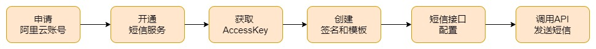
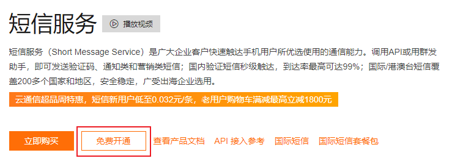
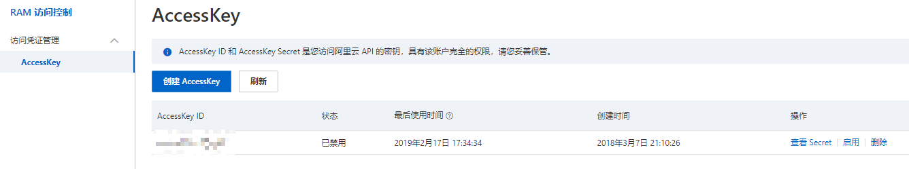
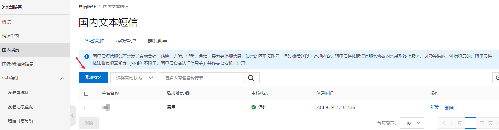
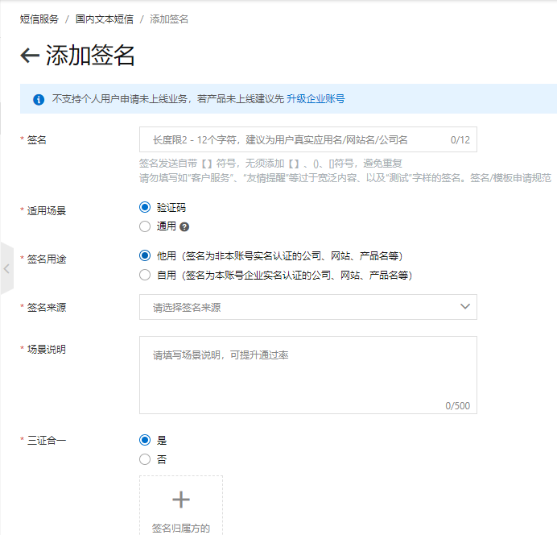
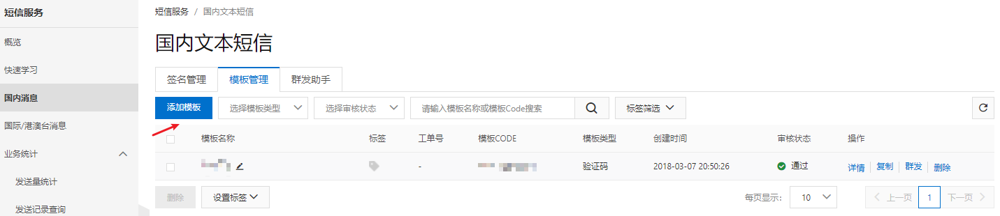
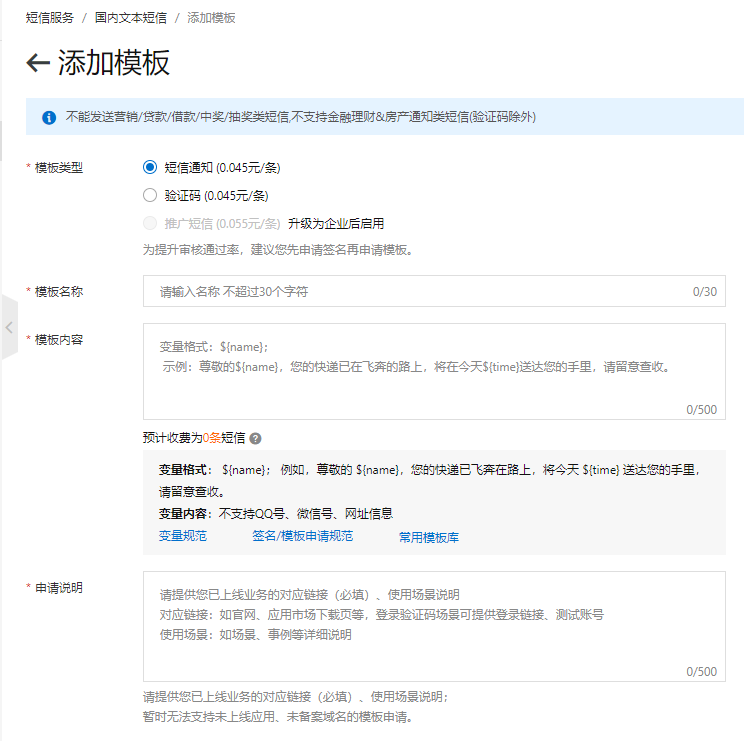
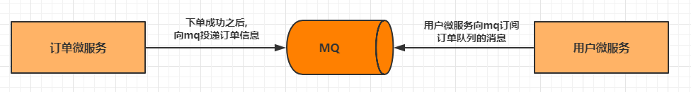

## 1. 短信服务介绍

短信服务（Short Message Service）是阿里云为用户提供的一种通信服务的能力。

> - 产品优势：覆盖全面、高并发处理、消息堆积处理、开发管理简单、智能监控调度
> - 产品功能：短信通知、短信验证码、推广短信、异步通知、数据统计
> - 应用场景：短信验证码、系统信息推送、推广短信等

## 2. 短信服务使用

阿里云短信服务的使用流程；



### 2.1. 阿里云短信服务准备

[短信服务官方说明文档](https://www.aliyun.com/product/sms)

#### 2.1.1. 开通短信服务



#### 2.1.2. 申请认证秘钥



#### 2.1.3. 申请短信签名





#### 2.1.4. 申请短信模板





### 2.2. 短信服务API介绍

短信服务提供的相关API接口及各API接口的用法

- [API 概览官方文档](https://help.aliyun.com/document_detail/102715.html?spm=5176.25163407.help.dexternal.37a2bb6e0UlvAt)
- [短信服务 API 概览](https://next.api.aliyun.com/product/Dysmsapi)

#### 2.2.1. 短信发送(SendSms)

- [短信发送(SendSms)](https://help.aliyun.com/document_detail/101414.htm?spm=a2c4g.11186623.0.0.39595695xJNDTO#t83759.html)

#### 2.2.2. 短信查询(QuerySendDetails)

- [短信查询(QuerySendDetails)](https://help.aliyun.com/document_detail/102352.htm?spm=a2c4g.11186623.0.0.3959dfabwQumRs#t92654.html)

### 2.3. 短信发送基础功能测试

- 引入阿里云服务依赖

```xml
<!--短信发送-->
<dependency>
    <groupId>com.alibaba.cloud</groupId>
    <artifactId>spring-cloud-alicloud-sms</artifactId>
</dependency>
```

- 使用阿里云提供的Demo测试短信发送

```java
public class SmsDemoTest {

    //产品名称:云通信短信API产品,开发者无需替换
    static final String product = "Dysmsapi";
    //产品域名,开发者无需替换
    static final String domain = "dysmsapi.aliyuncs.com";

    // TODO 此处需要替换成开发者自己的AK(在阿里云访问控制台寻找)
    static final String accessKeyId = "yourAccessKeyId";
    static final String accessKeySecret = "yourAccessKeySecret";

    //短信发送
    public static SendSmsResponse sendSms() throws ClientException, com.aliyuncs.exceptions.ClientException {
        //可自助调整超时时间
        System.setProperty("sun.net.client.defaultConnectTimeout", "10000");
        System.setProperty("sun.net.client.defaultReadTimeout", "10000");

        //初始化acsClient,暂不支持region化
        IClientProfile profile = DefaultProfile.getProfile("cn-hangzhou", accessKeyId, accessKeySecret);
        DefaultProfile.addEndpoint("cn-hangzhou", "cn-hangzhou", product, domain);
        IAcsClient acsClient = new DefaultAcsClient(profile);

        //组装请求对象-具体描述见控制台-文档部分内容
        SendSmsRequest request = new SendSmsRequest();
        //必填:待发送手机号
        request.setPhoneNumbers("15000000000");
        //必填:短信签名-可在短信控制台中找到
        request.setSignName("云通信");
        //必填:短信模板-可在短信控制台中找到
        request.setTemplateCode("SMS_1000000");
        //可选:模板中的变量替换JSON串,如模板内容为"亲爱的${name},您的验证码为${code}"时,此处的值为
        request.setTemplateParam("{\"name\":\"Tom\", \"code\":\"123\"}");

        //选填-上行短信扩展码(无特殊需求用户请忽略此字段)
        //request.setSmsUpExtendCode("90997");

        //可选:outId为提供给业务方扩展字段,最终在短信回执消息中将此值带回给调用者
        request.setOutId("yourOutId");

        //hint 此处可能会抛出异常,注意catch
        SendSmsResponse sendSmsResponse = acsClient.getAcsResponse(request);

        return sendSmsResponse;
    }

    //短信查询
    public static QuerySendDetailsResponse querySendDetails(String bizId) throws ClientException, com.aliyuncs.exceptions.ClientException {

        //可自助调整超时时间
        System.setProperty("sun.net.client.defaultConnectTimeout", "10000");
        System.setProperty("sun.net.client.defaultReadTimeout", "10000");

        //初始化acsClient,暂不支持region化
        IClientProfile profile = DefaultProfile.getProfile("cn-hangzhou", accessKeyId, accessKeySecret);
        DefaultProfile.addEndpoint("cn-hangzhou", "cn-hangzhou", product, domain);
        IAcsClient acsClient = new DefaultAcsClient(profile);

        //组装请求对象
        QuerySendDetailsRequest request = new QuerySendDetailsRequest();
        //必填-号码
        request.setPhoneNumber("15000000000");
        //可选-流水号
        request.setBizId(bizId);
        //必填-发送日期 支持30天内记录查询,格式yyyyMMdd
        SimpleDateFormat ft = new SimpleDateFormat("yyyyMMdd");
        request.setSendDate(ft.format(new Date()));
        //必填-页大小
        request.setPageSize(10L);
        //必填-当前页码从1开始计数
        request.setCurrentPage(1L);

        //hint 此处可能会抛出异常,注意catch
        QuerySendDetailsResponse querySendDetailsResponse = acsClient.getAcsResponse(request);

        return querySendDetailsResponse;
    }

    public static void main(String[] args) throws ClientException, InterruptedException, com.aliyuncs.exceptions.ClientException {

        //发短信
        SendSmsResponse response = sendSms();
        System.out.println("短信接口返回的数据----------------");
        System.out.println("Code=" + response.getCode());
        System.out.println("Message=" + response.getMessage());
        System.out.println("RequestId=" + response.getRequestId());
        System.out.println("BizId=" + response.getBizId());

        Thread.sleep(3000L);

        //查明细
        if (response.getCode() != null && response.getCode().equals("OK")) {
            QuerySendDetailsResponse querySendDetailsResponse = querySendDetails(response.getBizId());
            System.out.println("短信明细查询接口返回数据----------------");
            System.out.println("Code=" + querySendDetailsResponse.getCode());
            System.out.println("Message=" + querySendDetailsResponse.getMessage());
            int i = 0;
            for (QuerySendDetailsResponse.SmsSendDetailDTO smsSendDetailDTO : querySendDetailsResponse.getSmsSendDetailDTOs()) {
                System.out.println("SmsSendDetailDTO[" + i + "]:");
                System.out.println("Content=" + smsSendDetailDTO.getContent());
                System.out.println("ErrCode=" + smsSendDetailDTO.getErrCode());
                System.out.println("OutId=" + smsSendDetailDTO.getOutId());
                System.out.println("PhoneNum=" + smsSendDetailDTO.getPhoneNum());
                System.out.println("ReceiveDate=" + smsSendDetailDTO.getReceiveDate());
                System.out.println("SendDate=" + smsSendDetailDTO.getSendDate());
                System.out.println("SendStatus=" + smsSendDetailDTO.getSendStatus());
                System.out.println("Template=" + smsSendDetailDTO.getTemplateCode());
            }
            System.out.println("TotalCount=" + querySendDetailsResponse.getTotalCount());
            System.out.println("RequestId=" + querySendDetailsResponse.getRequestId());
        }
    }
}
```

## 3. 消息中间件 RocketMQ 与短信服务综合案例

案例需求：模拟场景，下单成功之后，向下单用户发送短信。设计图如下：



### 3.1. 订单微服务发送信息

- 在订单微服务中添加 RocketMQ 的依赖

```xml
<!-- RocketMQ 依赖 -->
<dependency>
    <groupId>org.apache.rocketmq</groupId>
    <artifactId>rocketmq-spring-boot-starter</artifactId>
    <version>2.1.1</version>
</dependency>
```

- 修改配置文件，添加 Nacos 相关配置

```yml
# RocketMQ 配置
rocketmq:
  name-server: 127.0.0.1:9876 # RocketMQ 服务的地址
  producer:
    group: producer-order # 生产者组名称
```

- 修改

```java
@Slf4j
@RestController
@RequestMapping("order_sms")
public class OrderSmsController {
    @Autowired
    private ProductFeignClient productFeignClient;

    @Autowired
    private OrderService orderService;

    @Autowired
    private RocketMQTemplate rocketMQTemplate;

    /**
     * 下单请求方法，通过 Feign 实现负载均衡的服务调用
     *
     * @param pid
     * @return
     */
    @GetMapping("/createOrder/{pid}")
    public Order createOrderAndSendMessage(@PathVariable("pid") Long pid) {
        log.info("接收到ID为{}的商品下单请求", pid);

        /* 通过 FeignClient 接口调用本地方法的方式，实现服务的调用。 */
        Product product = productFeignClient.findById(pid);

        Order order = new Order();
        if (product != null) {
            order.setProductId(pid);
            order.setNumber(1);
            order.setPrice(product.getPrice());
            order.setAmount(product.getPrice());
            order.setProductName(product.getProductName());
            // 暂写死用户
            order.setUserId(Long.parseLong("1"));
            order.setUsername("夜神月");

            // 创建订单
            orderService.createOrder(order);

            /*
             * void convertAndSend(D destination, Object payload) throws MessagingException;
             *   发送异步消息到 RocketMQ
             *  D destination：主题名称
             *  Object payload：消息体
             */
            rocketMQTemplate.convertAndSend("alibaba-sample-sms-topic", order);
        }
        return order;
    }
}
```

### 3.2. 用户微服务接收信息

- 用户微服务中添加相关的依赖，包括 nacos 客户端、RocketMQ 客户端、Alibaba Cloud SMS 等依赖

```xml
<!-- nacos 客户端 -->
<dependency>
    <groupId>com.alibaba.cloud</groupId>
    <artifactId>spring-cloud-starter-alibaba-nacos-discovery</artifactId>
</dependency>
<!-- RocketMQ 依赖 -->
<dependency>
    <groupId>org.apache.rocketmq</groupId>
    <artifactId>rocketmq-spring-boot-starter</artifactId>
    <version>2.1.1</version>
</dependency>
<!-- Alibaba Cloud SMS 短信发送依赖 -->
<dependency>
    <groupId>com.alibaba.cloud</groupId>
    <artifactId>spring-cloud-alicloud-sms</artifactId>
    <version>2.1.1.RELEASE</version>
</dependency>
```

- 修改配置文件，添加 Nacos、RocketMQ 相关配置

```yml
spring:
  cloud:
    nacos:
      discovery:
        server-addr: 127.0.0.1:8848 # 配置 Nacos server 的地址
# RocketMQ 配置
rocketmq:
  name-server: 127.0.0.1:9876 # RocketMQ 服务的地址
```

- 将阿里云短信给出的demo封装成工具类(参考源代码)
- 创建短信服务监听类，监听 RocketMQ 消息

```java
@Slf4j
@Service
// @RocketMQMessageListener 注解用于配置消费者相关信息
@RocketMQMessageListener(
        consumerGroup = "consume-user",         // 消费者分组
        topic = "alibaba-sample-sms-topic",     // 要消费的主题
        consumeMode = ConsumeMode.CONCURRENTLY, // 消费模式:无序和有序，默认是无序
        messageModel = MessageModel.CLUSTERING  // 消息模式:广播和集群，默认是集群
)
public class SmsService implements RocketMQListener<Order> {
    @Autowired
    private UserDao userDao;

    @Override
    public void onMessage(Order message) {
        log.info("接收到了一个订单信息消息：{}，准备发送短信通知", JSON.toJSONString(message));

        // 根据用户 id 查询用户信息
        User user = userDao.findById(message.getUserId()).get();
        log.info("根据用户 id 获取用户信息：{}", JSON.toJSONString(user));

        Map<String, String> params = new HashMap<>();
        // 设置验证码，简单写死
        params.put("code", "123456");

        try {
            // 发送短信的模拟 {"code":"123456"}
            SmsUtil.sendSms("13800000000", "短信信息", "SMS_170836451", JSON.toJSONString(params));
            log.info("短信发送成功");
        } catch (Exception e) {
            e.printStackTrace();
        }
    }
}
```
