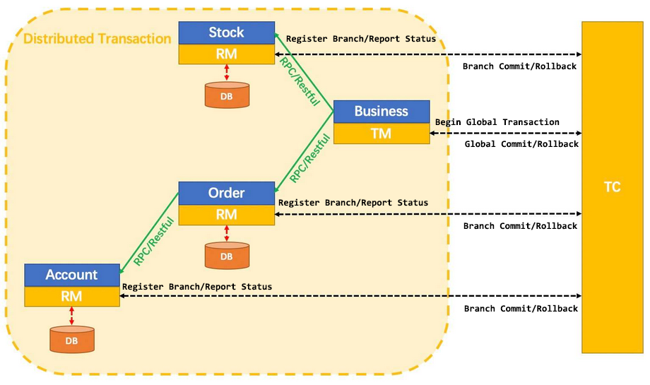
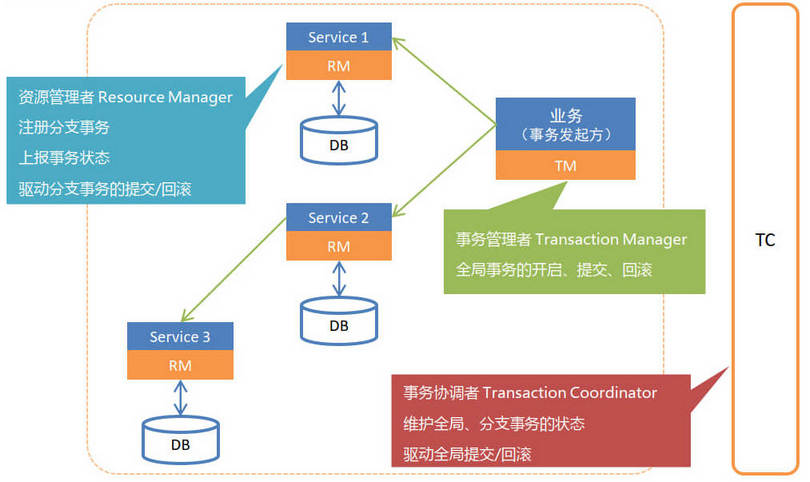
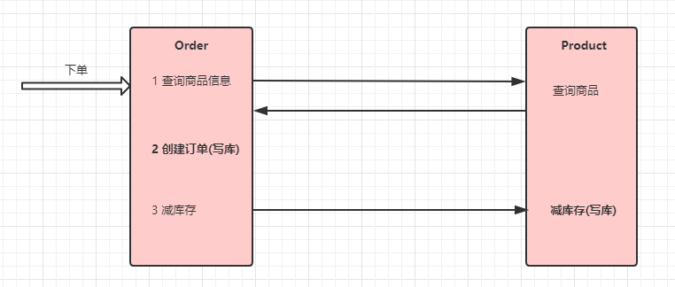
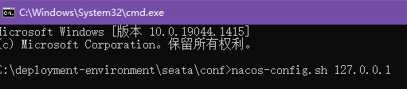
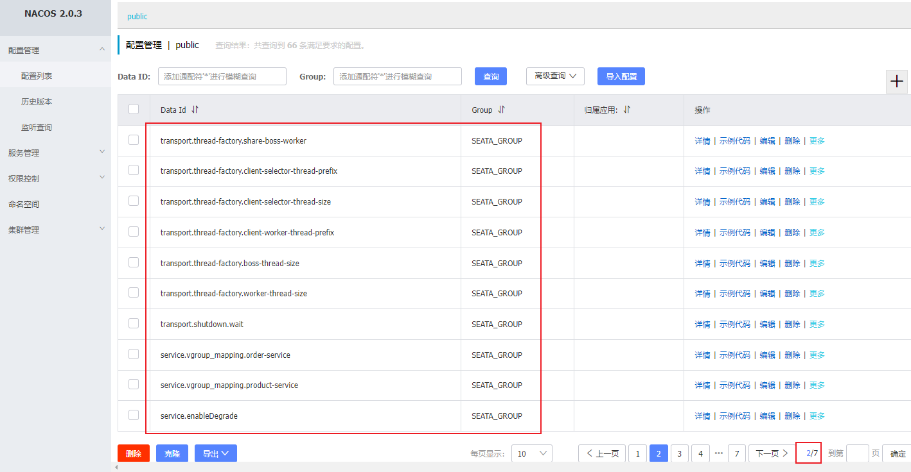
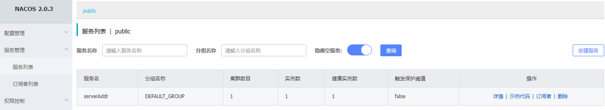
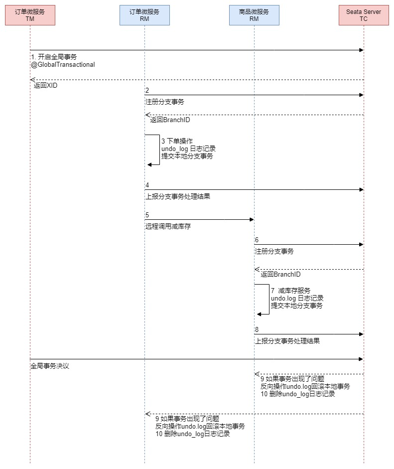
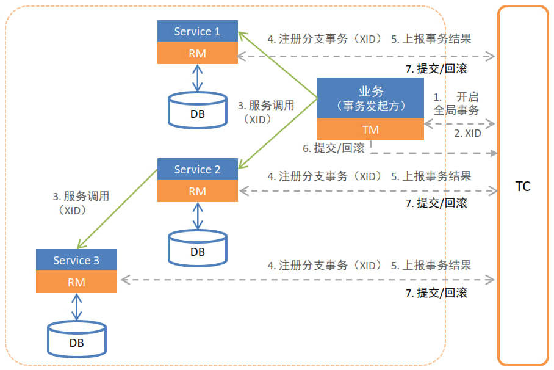

## 1. Seata 概述

Seata 是一款开源的分布式事务解决方案，致力于提供高性能和简单易用的分布式事务服务。Seata 将为用户提供了 **AT、TCC、SAGA 和 XA 事务模式**，为用户打造一站式的分布式解决方案。

> 官网：https://seata.io/zh-cn/index.html



### 1.1. 发展历史

2019 年 1 月，阿里巴巴中间件团队发起了开源项目 Fescar（Fast & EaSy Commit And Rollback），其愿景是让分布式事务的使用像本地事务的使用一样，简单和高效，并逐步解决开发者们遇到的分布式事务方面的所有难题。后来更名为 Seata，意为：Simple Extensible AutonomousTransaction Architecture，是一套分布式事务解决方案。

Seata 的设计目标是对业务无侵入，因此从业务无侵入的 2PC 方案着手，在传统 2PC 的基础上演进。它把一个分布式事务理解成一个包含了若干分支事务的全局事务。全局事务的职责是协调其下管辖的分支事务达成一致，要么一起成功提交，要么一起失败回滚。此外，通常分支事务本身就是一个关系数据库的本地事务。

### 1.2. Seata 三个重要组件

- **TC (Transaction Coordinator) - 事务协调者**：维护全局和分支事务的状态，驱动全局事务提交或回滚。
- **TM (Transaction Manager) - 事务管理器**：定义全局事务的范围：开始全局事务、提交或回滚全局事务。
- **RM (Resource Manager) - 资源管理器**：管理分支事务处理的资源，与 TC 交互以注册分支事务和报告分支事务的状态，并驱动分支事务提交或回滚。



### 1.3. Seata 的执行流程


1. A 服务的 TM 向 TC 申请开启一个全局事务，TC 就会创建一个全局事务并返回一个唯一的 XID
2. A 服务的 RM 向 TC 注册分支事务，并及其纳入 XID 对应全局事务的管辖
3. A 服务执行分支事务，向数据库做操作
4. A 服务开始远程调用 B 服务，此时 XID 会在微服务的调用链上传播
5. B 服务的 RM 向 TC 注册分支事务，并将其纳入 XID 对应的全局事务的管辖
6. B 服务执行分支事务，向数据库做操作
7. 全局事务调用链处理完毕，TM 根据有无异常向 TC 发起全局事务的提交或者回滚
8. TC 协调其管辖之下的所有分支事务，决定是否回滚

### 1.4. Seata 实现 2PC 与传统 2PC 的差别

1. 架构层次方面，传统 2PC 方案的 RM 实际上是在数据库层，RM 本质上就是数据库自身，通过 XA 协议实现，而 Seata 的 RM 是以 jar 包的形式作为中间件层部署在应用程序这一侧的。
2. 两阶段提交方面，传统 2PC 无论第二阶段的决议是 commit 还是 rollback，事务性资源的锁都要保持到 Phase2 完成才释放。而 Seata 的做法是在 Phase1 就将本地事务提交，这样就可以省去 Phase2 持锁的时间，整体提高效率。

## 2. Seata 快速开始（基于 Seata AT 模式）

快速开始的示例通过Seata中间件实现分布式事务，模拟电商中的下单和扣库存的过程。案例通过订单微服务执行下单操作，然后由订单微服务调用商品微服务扣除库存



### 2.1. 编写业务处理逻辑

> 此部分详见案例项目 `spring-cloud-note\spring-cloud-alibaba-sample-seata\`

### 2.2. 启动 Seata 服务(0.9.0 版服务端)

#### 2.2.1. 下载 Seata

官方下载地址：https://github.com/seata/seata/releases

本次示例 Seata 版本为 0.9.0。

> demo中使用的相关版本号，具体请看代码。如果搭建个人demo不成功，验证是否是由版本导致，由于目前这几个项目更新比较频繁，版本稍有变化便会出现许多奇怪问题

#### 2.2.2. 修改 Seata 配置

将Seata压缩包进行解压，进入conf目录，修改以下的配置文件：

- registry.conf。该配置用于指定 TC 的注册中心和配置文件，默认都是 `file`；如果使用其他的注册中心，要求 Seata-Server 也注册到该配置中心上。*此示例使用了 nacos，修改type值，将其他不需要的内容删除。*

```
registry {
  # file 、nacos 、eureka、redis、zk、consul、etcd3、sofa
  type = "nacos"

  nacos {
    serverAddr = "127.0.0.1:8848"
    namespace = "public"
    cluster = "default"
  }
}

config {
  # file、nacos 、apollo、zk、consul、etcd3
  type = "nacos"

  nacos {
    serverAddr = "127.0.0.1:8848"
    namespace = "public"
    cluster = "default"
  }
}
```

- nacos-config.txt 用于定义导入到 nocao 配置中心的相关内容。这里需要增加本次示例服务的服务名称。语法为：`service.vgroup_mapping.${your-service-gruop}=default`，中间的 `${your-service-gruop}` 为自定义的服务组名称，这里需要在程序的配置文件中配置。

```
service.vgroup_mapping.product-service=default
service.vgroup_mapping.order-service=default
```

#### 2.2.3. 初始化 seata 相关配置至 nacos

确保正常运行 nacos 服务后，进行 seata 的 config 目录，运行以下命令：

```bash
nacos-config.sh 127.0.0.1
```



执行成功后可以打开 Nacos 的控制台，在配置列表中，可以看到初始化了很多 Group 为 SEATA_GROUP 的配置。也可以找到 nacos-config.txt 增加的服务名称映射。



#### 2.2.4. 启动 Seata 服务

进行 Seata 的 bin 目录。（windows 运行 .bat 脚本，linux 运行 .sh 的脚本）

```bash
cd /d E:\deployment-environment\seata\bin\
seata-server.bat -p 9000 -m file
```

启动成功后，在 Nacos 的服务列表下面可以看到一个名为 serverAddr 的服务。



### 2.3. 微服务使用 Seata 实现事务控制(0.7.1 版客户端)

#### 2.3.1. 添加依赖

在需要进行分布式控制的微服务中（*示例是订单微服务、商品微服务*），添加 Spring Cloud Alibaba 依赖管理工具和 Seata 依赖

<font color=red>**特别注意有坑：这个 Spring Cloud Alibaba 的版本是 <u>2.1.0.RELEASE</u>！！！如果使用更高的版本，io.seata:seata-all 的版本就不是0.7.1，以下示例相关配置将不会生效！！！**</font>

```xml
<dependencyManagement>
    <dependencies>
        <dependency>
            <groupId>com.alibaba.cloud</groupId>
            <artifactId>spring-cloud-alibaba-dependencies</artifactId>
            <version>2.1.0.RELEASE</version>
            <type>pom</type>
            <scope>import</scope>
        </dependency>
    </dependencies>
</dependencyManagement>

<dependency>
	<groupId>com.alibaba.cloud</groupId>
	<artifactId>spring-cloud-starter-alibaba-seata</artifactId>
</dependency>
```

需要注意的是 Spring Cloud Alibaba 的毕业版本的 GroupId 是 `com.alibaba.cloud`。`spring-cloud-starter-alibaba-seata` 这个依赖中只依赖了 `spring-cloud-alibaba-seata`，所以在项目中添加 `spring-cloud-starter-alibaba-seata` 和 `spring-cloud-alibaba-seata` 是一样的

> 此示例是使用nacos作为注册配置中心，需要再引入 `spring-cloud-starter-alibaba-nacos-config` 相关的依赖

#### 2.3.2. 初始化 undo_log 表

在微服务业务相关的数据库中添加 undo_log 表，这是Seata记录事务日志要用到的表，用于保存需要回滚的数据

```sql
CREATE TABLE `undo_log` (
	`id` BIGINT ( 20 ) NOT NULL AUTO_INCREMENT,
	`branch_id` BIGINT ( 20 ) NOT NULL,
	`xid` VARCHAR ( 100 ) NOT NULL,
	`context` VARCHAR ( 128 ) NOT NULL,
	`rollback_info` LONGBLOB NOT NULL,
	`log_status` INT ( 11 ) NOT NULL,
	`log_created` DATETIME NOT NULL,
	`log_modified` DATETIME NOT NULL,
	`ext` VARCHAR ( 100 ) DEFAULT NULL,
	PRIMARY KEY ( `id` ),
UNIQUE KEY `ux_undo_log` ( `xid`, `branch_id` )
) ENGINE = INNODB AUTO_INCREMENT = 1 DEFAULT CHARSET = utf8;
```

#### 2.3.3. 注入数据源

Seata 是通过代理数据源实现事务分支的，所以需要配置 `io.seata.rm.datasource.DataSourceProxy` 的 Bean，且是 `@Primary` 默认的数据源，否则事务不会回滚，无法实现分布式事务

> 值得注意：MyBatis 和 JPA 都需要注入 `io.seata.rm.datasource.DataSourceProxy`, 不同的是，MyBatis 还需要额外注入 `org.apache.ibatis.session.SqlSessionFactory`

- JPA 配置

```java
@Configuration
public class DataSourceProxyConfig {
    @Bean
    @ConfigurationProperties(prefix = "spring.datasource")
    public DruidDataSource druidDataSource() {
        return new DruidDataSource();
    }

    @Primary
    @Bean
    public DataSourceProxy dataSource(DruidDataSource druidDataSource) {
        return new DataSourceProxy(druidDataSource);
    }
}
```

- MyBatis 配置

```java
@Configuration
public class DataSourceProxyConfig {
    @Bean
    @ConfigurationProperties(prefix = "spring.datasource")
    public DataSource dataSource() {
        return new DruidDataSource();
    }

    @Bean
    public DataSourceProxy dataSourceProxy(DataSource dataSource) {
        return new DataSourceProxy(dataSource);
    }

    @Bean
    public SqlSessionFactory sqlSessionFactoryBean(DataSourceProxy dataSourceProxy) throws Exception {
        SqlSessionFactoryBean sqlSessionFactoryBean = new SqlSessionFactoryBean();
        sqlSessionFactoryBean.setDataSource(dataSourceProxy);
        return sqlSessionFactoryBean.getObject();
    }
}
```

#### 2.3.4. 修改微服务项目配置文件

- 修改项目配置文件，创建 `bootstrap.yaml`/`bootstrap.properties` 文件，增加 nacos 配置中心与 seata 的配置

```yml
spring:
  cloud:
    nacos:
      config:
        server-addr: 127.0.0.1:8848 # nacos 的服务端地址
        group: SEATA_GROUP # 默认值：DEFAULT_GROUP
        namespace: public # 配置的命名空间。常用场景之一是不同环境的配置的区分隔离，例如开发测试环境和生产环境的资源隔离等。
    # 配置seata
    alibaba:
      seata:
        tx-service-group: ${spring.application.name}
```

- 在 resources 目录下添加 Seata 的配置文件 registry.conf

#### 2.3.5. 在微服务开启全局事务

Seata 实现全局事务，只需要在<font color=red>**业务发起方**</font>的方法上使用 `@GlobalTransactional` 注解，即可开启全局事务，Seata 会将事务的 xid 通过拦截器添加到调用其他服务的请求中，实现分布式事务。

```java
@Override
@GlobalTransactional
public Order createOrder(Long pid)  {
    ....
}
```

## 3. Seata 运行流程分析



要点说明：

1. 每个 RM 使用 `DataSourceProxy` 连接数据库，其目的是使用 `ConnectionProxy`，使用数据源和数据连接代理的目的就是在第一阶段将 undo_log 和业务数据放在一个本地事务提交，这样就保存了只要有业务操作就一定有 undo_log。
2. 在第一阶段 undo_log 中存放了数据修改前和修改后的值，为事务回滚作好准备，所以第一阶段完成就已经将分支事务提交，也就释放了锁资源。
3. TM 开启全局事务开始，将 XID 全局事务 id 放在事务上下文中，通过 feign 调用也将 XID 传入下游分支事务，每个分支事务将自己的 Branch ID 分支事务 ID 与 XID 关联。
4. 第二阶段全局事务提交，TC 会通知各各分支参与者提交分支事务，在第一阶段就已经提交了分支事务，这里各各参与者只需要删除 undo_log 即可，并且可以异步执行，第二阶段很快可以完成。
5. 第二阶段全局事务回滚，TC 会通知各各分支参与者回滚分支事务，通过 XID 和 Branch ID 找到相应的回滚日志，通过回滚日志生成反向的 SQL 并执行，以完成分支事务回滚到之前的状态，如果回滚失败则会重试回滚操作。



## 4. Seata AT 模式

> 前面章节的快速开始案例就是基于 Seata AT 模式的实现。

### 4.1. 实现前提

- 基于支持本地 ACID 事务的关系型数据库。
- Java 应用，通过 JDBC 访问数据库

### 4.2. 整体机制

两阶段提交协议的演变：

- 一阶段：业务数据和回滚日志记录在同一个本地事务中提交，释放本地锁和连接资源。
- 二阶段：
    - 提交异步化，非常快速地完成。
    - 回滚通过一阶段的回滚日志进行反向补偿。

### 4.3. 写隔离


