## 1. Sentinel 概述

### 1.1. 简介

随着微服务的流行，服务和服务之间的稳定性变得越来越重要。Sentinel (分布式系统的流量防卫兵) 是阿里开源的一套用于服务容错的综合性解决方案。以流量为切入点，从流量控制、熔断降级、系统负载保护等多个维度保护服务的稳定性。

**Sentinel 的主要特性**：

- **丰富的应用场景**：Sentinel 承接了阿里巴巴近 10 年的双十一大促流量的核心场景，例如秒杀（即突发流量控制在系统容量可以承受的范围）、消息削峰填谷、集群流量控制、实时熔断下游不可用应用等。
- **完备的实时监控**：Sentinel 同时提供实时的监控功能。您可以在控制台中看到接入应用的单台机器秒级数据，甚至 500 台以下规模的集群的汇总运行情况。
- **广泛的开源生态**：Sentinel 提供开箱即用的与其它开源框架/库的整合模块，例如与 Spring Cloud、Dubbo、gRPC 的整合。您只需要引入相应的依赖并进行简单的配置即可快速地接入Sentinel。
- **完善的 SPI 扩展点**：Sentinel 提供简单易用、完善的 SPI 扩展接口。您可以通过实现扩展接口来快速地定制逻辑。例如定制规则管理、适配动态数据源等。

**Sentinel 的构架图**：

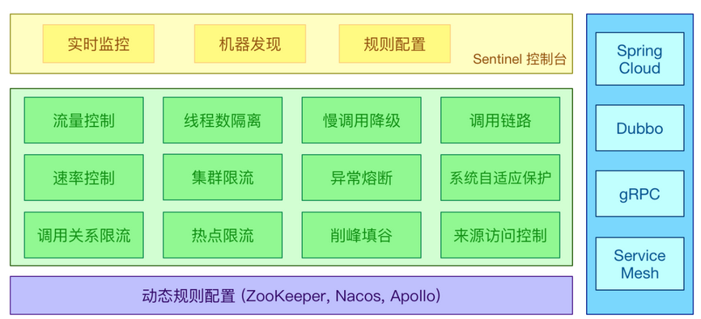

### 1.2. Sentinel 与 Hystrix 的区别

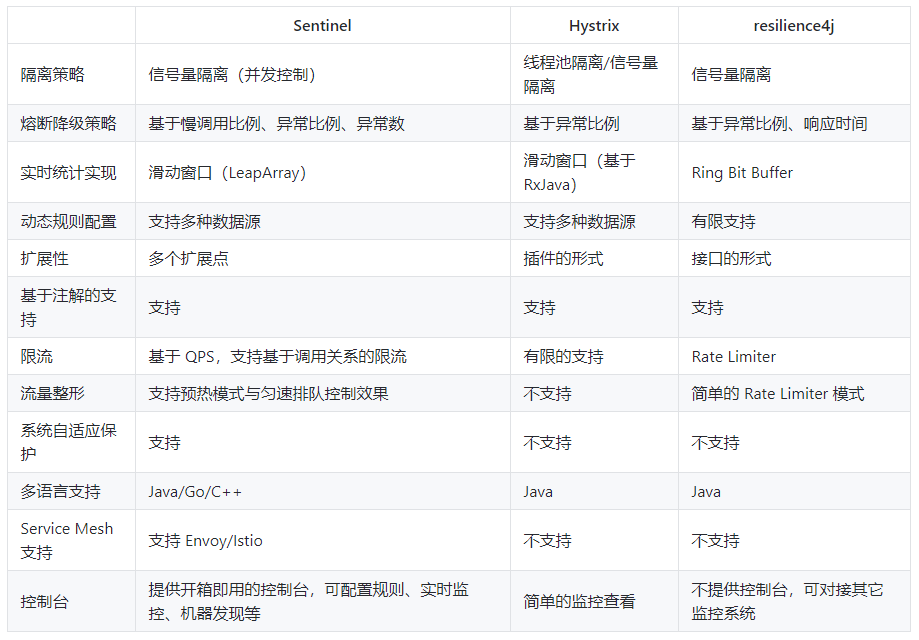

### 1.3. 迁移方案

Sentinel 官方提供了由 Hystrix 迁移到 Sentinel 的详细方法。详情参考 [Guideline: 从 Hystrix 迁移到 Sentinel](https://github.com/alibaba/Sentinel/wiki/Guideline:-从-Hystrix-迁移到-Sentinel)

- 线程池隔离/信号量隔离迁移方案：Sentinel 不支持线程池隔离；信号量隔离对应 Sentinel 中的线程数限流，详见[此处](https://github.com/alibaba/Sentinel/wiki/Guideline:-从-Hystrix-迁移到-Sentinel#信号量隔离)
- 熔断器迁移方案：Sentinel 支持按平均响应时间、异常比率、异常数来进行熔断降级。从 Hystrix 的异常比率熔断迁移的步骤详见[此处](https://github.com/alibaba/Sentinel/wiki/Guideline:-从-Hystrix-迁移到-Sentinel#熔断降级)
- Command 创建迁移方案：直接使用 Sentinel `SphU` API 定义资源即可，资源定义与规则配置分离，详见[此处](https://github.com/alibaba/Sentinel/wiki/Guideline:-从-Hystrix-迁移到-Sentinel#command-迁移) 
- 规则配置迁移方案：在 Sentinel 中可通过 API 硬编码配置规则，也支持多种动态规则源
- 注解支持迁移方案：Sentinel 也提供注解支持，可以很方便地迁移，详见[此处](https://github.com/alibaba/Sentinel/wiki/Guideline:-从-Hystrix-迁移到-Sentinel#注解支持)
- 开源框架支持迁移方案：Sentinel 提供 Servlet、Dubbo、Spring Cloud、gRPC 的适配模块，开箱即用；若之前使用 Spring Cloud Netflix，可迁移至 [Spring Cloud Alibaba](https://github.com/spring-cloud-incubator/spring-cloud-alibaba)

### 1.4. Sentinel 组成部分

Sentinel 的使用可以分为两个部分:

- 核心库（Java 客户端）：不依赖任何框架/库，能够运行于 Java 8 及以上的版本的运行时环境，同时对 Dubbo / Spring Cloud 等框架也有较好的支持（见 主流框架适配）。
- 控制台（Dashboard）：Dashboard 主要负责管理推送规则、监控、管理机器信息等。

> 核心库不依赖 Dashboard，但是结合 Dashboard 可以取得最好的效果。

## 2. Sentinel 基本原理

### 2.1. Sentinel 功能和设计理念

Sentinel 总体功能概述图：

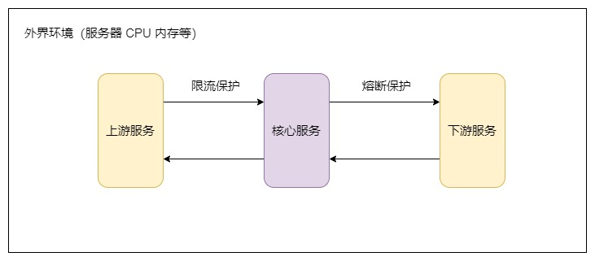

#### 2.1.1. 流量控制

流量控制在网络传输中是一个常用的概念，它用于调整网络包的发送数据。然而，从系统稳定性角度考虑，在处理请求的速度上，也有非常多的讲究。任意时间到来的请求往往是随机不可控的，而系统的处理能力是有限的。需要根据系统的处理能力对流量进行控制。Sentinel 作为一个调配器，可以根据需要把随机的请求调整成合适的形状，如下图所示：

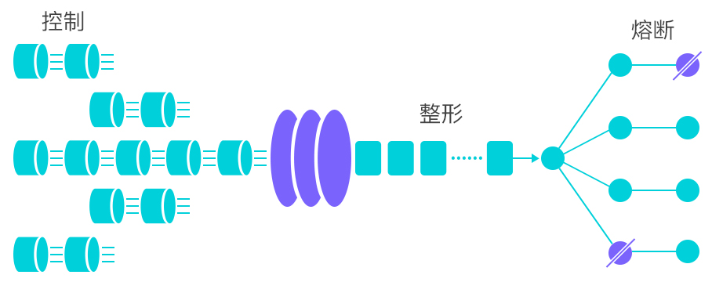

流量控制有以下几个角度:

- 资源的调用关系，例如资源的调用链路，资源和资源之间的关系；
- 运行指标，例如 QPS、线程池、系统负载等；
- 控制的效果，例如直接限流、冷启动、排队等。

Sentinel 的设计理念是让开发者自由选择控制的角度，并进行灵活组合，从而达到想要的效果。

#### 2.1.2. 熔断降级

除了流量控制以外，降低调用链路中的不稳定资源也是 Sentinel 的使命之一。由于调用关系的复杂性，如果调用链路中的某个资源出现了不稳定，最终会导致请求发生堆积。

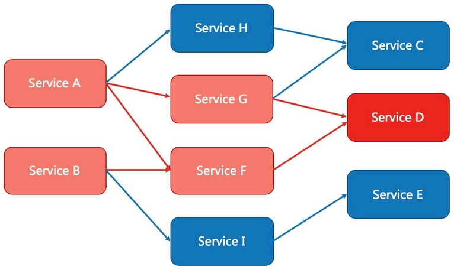

Sentinel 和 Hystrix 的原则是一致的：当调用链路中某个资源出现不稳定，例如，表现为请求时长超时（timeout），异常比例升高的时候，则对这个资源的调用进行限制，并让请求快速失败，避免影响到其它的资源，最终产生雪崩的效果。

Sentinel 针对熔断降级设计，采取了两种手段:

- **通过并发线程数进行限制**

和资源池隔离的方法不同，Sentinel 通过限制资源并发线程的数量，来减少不稳定资源对其它资源的影响。这样不但没有线程切换的损耗，也不需要您预先分配线程池的大小。当某个资源出现不稳定的情况下，例如响应时间变长，对资源的直接影响就是会造成线程数的逐步堆积。当线程数在特定资源上堆积到一定的数量之后，对该资源的新请求就会被拒绝。堆积的线程完成任务后才开始继续接收请求。

- **通过响应时间对资源进行降级**

除了对并发线程数进行控制以外，Sentinel 还可以通过响应时间来快速降级不稳定的资源。当依赖的资源出现响应时间过长后，所有对该资源的访问都会被直接拒绝，直到过了指定的时间窗口之后才重新恢复。

> 在限制的手段上，Sentinel 和 Hystrix 采取了完全不一样的方法。
>
> Hystrix 通过线程池的方式，来对依赖(在我们的概念中对应资源)进行了隔离。这样做的好处是资源和资源之间做到了最彻底的隔离。缺点是除了增加了线程切换的成本，还需要预先给各个资源做线程池大小的分配。

#### 2.1.3. 系统负载保护

Sentinel 同时提供系统维度的自适应保护能力。当系统负载较高的时候，如果还持续让请求进入，可能会导致系统崩溃，无法响应。在集群环境下，网络负载均衡会把本应这台机器承载的流量转发到其它的机器上去。如果这个时候其它的机器也处在一个边缘状态的时候，这个增加的流量就会导致这台机器也崩溃，最后导致整个集群不可用。

针对这个情况，Sentinel 提供了对应的保护机制，让系统的入口流量和系统的负载达到一个平衡，保证系统在能力范围之内处理最多的请求。

### 2.2. Sentinel 的工作机制

Sentinel 的主要工作机制如下：

- 对主流框架提供适配或者显示的 API，来定义需要保护的资源，并提供设施对资源进行实时统计和调用链路分析。
- 根据预设的规则，结合对资源的实时统计信息，对流量进行控制。同时，Sentinel 提供开放的接口，方便开发者定义及改变规则。
- Sentinel 提供实时的监控系统，方便开发者快速了解目前系统的状态。

### 2.3. Sentinel 工作主流程

在 Sentinel 里面，所有的资源都对应一个资源名称以及一个 Entry。Entry 可以通过对主流框架的适配自动创建，也可以通过注解的方式或调用 API 显式创建；每一个 Entry 创建的时候，同时也会创建一系列功能插槽（slot chain）。这些插槽有不同的职责，例如:

- `NodeSelectorSlot` 负责收集资源的路径，并将这些资源的调用路径，以树状结构存储起来，用于根据调用路径来限流降级；
- `ClusterBuilderSlot` 则用于存储资源的统计信息以及调用者信息，例如该资源的 RT, QPS, thread count 等等，这些信息将用作为多维度限流，降级的依据；
- `StatisticSlot` 则用于记录、统计不同纬度的 runtime 指标监控信息；
- `FlowSlot` 则用于根据预设的限流规则以及前面 slot 统计的状态，来进行流量控制；
- `AuthoritySlot` 则根据配置的黑白名单和调用来源信息，来做黑白名单控制；
- `DegradeSlot` 则通过统计信息以及预设的规则，来做熔断降级；
- `SystemSlot` 则通过系统的状态，例如 load1 等，来控制总的入口流量；

总体的框架如下：

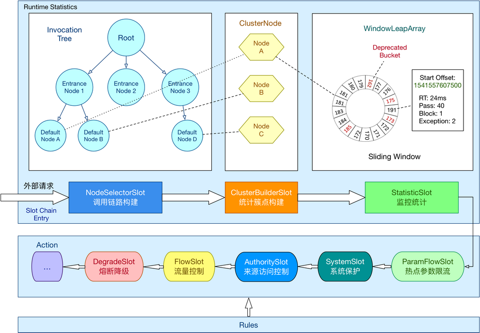

Sentinel 将 ProcessorSlot 作为 SPI 接口进行扩展（1.7.2 版本以前 SlotChainBuilder 作为 SPI），使得 Slot Chain 具备了扩展的能力。您可以自行加入自定义的 slot 并编排 slot 间的顺序，从而可以给 Sentinel 添加自定义的功能。

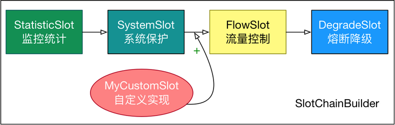

## 3. Sentinel 管理控制台（Dashboard）

### 3.1. 概述

Sentinel 提供一个轻量级的开源控制台，它提供机器发现以及健康情况管理、监控（单机和集群），规则管理和推送的功能。Sentinel 控制台包含如下功能：

- **查看机器列表以及健康情况**：收集 Sentinel 客户端发送的心跳包，用于判断机器是否在线。
- **监控 (单机和集群聚合)**：通过 Sentinel 客户端暴露的监控 API，定期拉取并且聚合应用监控信息，最终可以实现秒级的实时监控。
- **规则管理和推送**：统一管理推送规则。
- **鉴权**：生产环境中鉴权非常重要。这里每个开发者需要根据自己的实际情况进行定制。

> Notes: Sentinel 控制台目前仅支持单机部署。以下示例不通常直接在生产环境中使用，若在生产环境使用可参考[官方文档](https://github.com/alibaba/Sentinel/wiki/%E5%9C%A8%E7%94%9F%E4%BA%A7%E7%8E%AF%E5%A2%83%E4%B8%AD%E4%BD%BF%E7%94%A8-Sentinel) 自行进行定制和改造。阿里云上提供企业级的 Sentinel 服务：[AHAS Sentinel 控制台](https://github.com/alibaba/Sentinel/wiki/AHAS-Sentinel-控制台)，包含多样化的监控及全自动托管的集群流控能力。

### 3.2. 获取 Sentinel 控制台

#### 3.2.1. 下载编译后 jar 包

可以官方仓库中的 release 页面，下载最新版本的编译后控制台 jar 包。

> 下载地址：https://github.com/alibaba/Sentinel/releases/

#### 3.2.2. 通过源码构建 jar 包

也可以下载最新版本的源码自行构建 Sentinel 控制台。

> - 源码仓库地址：https://github.com/alibaba/Sentinel
> - 控制台源码目录：https://github.com/alibaba/Sentinel/tree/master/sentinel-dashboard

下载源码工程后，进入 sentinel-dashboard 目录，使用命令 `mvn clean package` 将代码打包成一个 fat jar: 

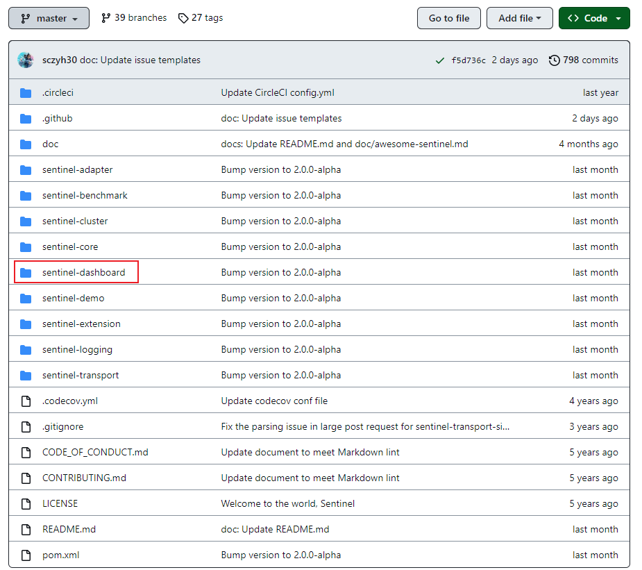

#### 3.2.3. 版本选择

从 `spring-cloud-alibaba-dependencies` 的依赖中可以看到 Sentinel 的版本，因为选择控制台的版本尽量与其一致。本次示例使用v1.8.0版本

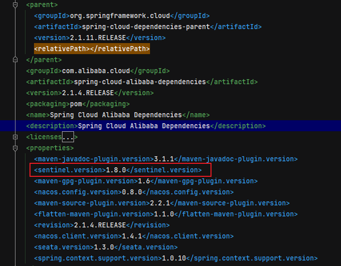

### 3.3. 启动 Sentinel 控制台

进入 Sentinel jar 包所在的目录，直接使用 jar 命令启动项目(控制台本身是一个SpringBoot项目)。具体命令如下：

```bash
$ java -Dserver.port=8080 -Dcsp.sentinel.dashboard.server=localhost:8080 -Dproject.name=sentinel-dashboard -jar sentinel-dashboard.jar
```

参数说明：

- `-Dserver.port=8080`：用于指定Sentinel控制台端口为8080
- `-Dsentinel.dashboard.auth.username=sentinel`：用于指定控制台的登录用户名为`sentinel`；
- `-Dsentinel.dashboard.auth.password=123456`：用于指定控制台的登录密码为`123456`；如果省略这两个参数，默认用户和密码均为`sentinel`；
- `-Dserver.servlet.session.timeout=7200`：用于指定 Spring Boot 服务端 session 的过期时间，如 7200 表示 7200 秒；60m 表示 60 分钟，默认为 30 分钟；

> 注：从 Sentinel 1.6.0 起，Sentinel 控制台引入基本的登录功能，默认用户名和密码都是`sentinel`。可以参考 [官方鉴权模块文档](https://sentinelguard.io/zh-cn/docs/dashboard.html#鉴权) 配置用户名和密码。启动Sentinel控制台需要JDK版本为1.8及以上版本。

### 3.4. 访问 Sentinel 控制台

通过浏览器访问 `http://127.0.0.1:部署的服务端口号` 进入控制台。默认用户名密码是 sentinel/sentinel

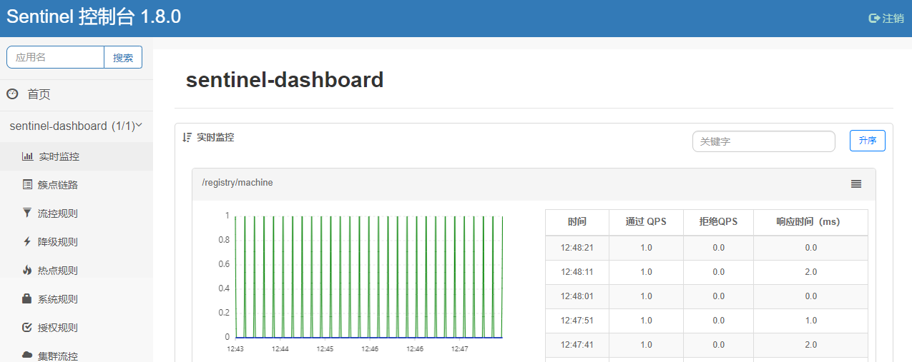

### 3.5. 扩展：了解控制台的使用原理

Sentinel 的控制台其实就是一个 SpringBoot 编写的程序。只需要将相应的微服务程序注册到控制台上，即在微服务中指定控制台的地址，并且还要开启一个跟控制台传递数据的端口，控制台也可以通过此端口调用微服务中的监控程序获取微服务的各种信息。

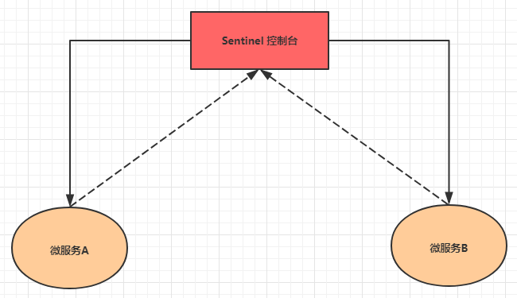

## 4. Sentinel 快速开始

此部分主要介绍是核心库（Java 客户端）的基础使用示例。包括引入 Sentinel 依赖、定义服务保护的资源、配置参数、通过控制台查询信息等示例

### 4.1. 微服务客户端接入 Sentinel 控制台

#### 4.1.1. 方式1：依赖 Transport 模块

客户端需要引入 Transport 模块来与 Sentinel 控制台进行通信。可以通过 pom.xml 引入相关依赖

```xml
<dependency>
    <groupId>com.alibaba.csp</groupId>
    <artifactId>sentinel-transport-simple-http</artifactId>
</dependency>
```

#### 4.1.2. 方式2（推荐）：整合 Spring Cloud Alibaba

使用 Spring Cloud 整合了 Spring Cloud Alibaba 的方式来接入 Sentinel。

> *注：需要注意Spring Cloud Alibaba与Spring Cloud的版本关系*。具体详见：[《Spring Cloud Alibaba 概述》](/分布式微服务/SpringCloud/Spring-Cloud-Alibaba)笔记的『版本说明』章节

如果需要使用 Spring Cloud Greenwich 版本，在父工程`pom.xml`文件的`<dependencyManagement>`中添加如下内容：

```xml
<dependency>
    <groupId>com.alibaba.cloud</groupId>
    <artifactId>spring-cloud-alibaba-dependencies</artifactId>
    <version>2.1.2.RELEASE</version>
    <type>pom</type>
    <scope>import</scope>
</dependency>
```

如果应用使用了 Maven，为微服务集成 Sentinel 只需要在相应子工程中的 pom.xml 文件中加入 sentinel 的依赖即可：

```xml
<!-- Spring Cloud Alibaba Sentinel 依赖 -->
<dependency>
    <groupId>com.alibaba.cloud</groupId>
    <artifactId>spring-cloud-starter-alibaba-sentinel</artifactId>
</dependency>
```

### 4.2. 定义需要保护资源

资源是 Sentinel 中的核心概念之一。最常用的资源是项目代码中的 Java 方法。在订单服务中，定义一些请求的方法。参考代码如下:

```java
@RestController
@RequestMapping("demo/sentinel")
public class SentinelDemoController {

    @RequestMapping("message1")
    public String message1() {
        return "message1";
    }
}
```

在引入 Sentinel 客户端后，以上定义的这些请求方法，都会被保护起来

### 4.3. 配置启动参数

在相应工程的`application.yml`中添加开启`Sentinel`控制台配置信息，通过`spring.cloud.sentinel.transport.dashboard`属性配置控制台的请求路径。

```yml
spring:
  cloud:
    # Sentinel 相关配置
    sentinel:
      transport:
        port: 9999 # 跟控制台交流的端口，随意指定一个未使用的端口即可
        dashboard: localhost:8080 # 配置sentinel控制台的请求地址
      eager: true # 取消Sentinel控制台懒加载，当服务启动时立即加载到控制台中
```

### 4.4. 通过 Sentinel 控制台查看机器列表以及健康情况

默认情况下 Sentinel 会在客户端首次调用的时候才进行初始化，开始向控制台发送心跳包。也可以配置 `sentinel.eager=true`，取消Sentinel控制台懒加载。

*通过调用相关服务接口后，打开浏览器即可展示Sentinel的管理控制台，并且可以看到相应服务的列表以及相关信息*

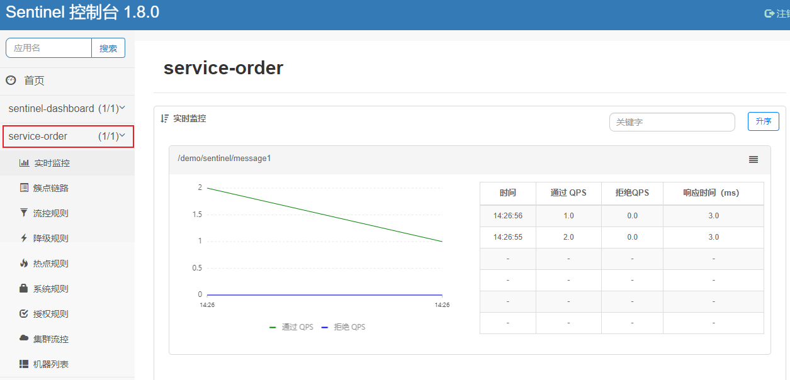

> 在控制台可以定义一些资源的保护规则，具体的规则分类、定义、使用等待详见《基本使用 - 资源与规则》章节

## 5. Sentinel 基础使用

### 5.1. 资源

资源是 Sentinel 的关键概念。它可以是 Java 应用程序中的任何内容，例如，由应用程序提供的一个服务、或由应用程序调用的其它应用提供的服务、或者是服务里的一个方法、甚至可以是一段代码。简而言之，**资源就是 Sentinel 要保护的东西**。

> 在此文档中的示例中，每个请求的方法都可以认为是一个资源

只要通过 Sentinel API 定义的代码，就是资源，能够被 Sentinel 保护起来。大部分情况下，可以使用方法签名，URL，甚至服务名称作为资源名来标示资源。

### 5.2. 规则

**规则就是用来定义如何进行保护资源的**。作用在资源之上，定义以什么样的方式保护资源。Sentinel 支持围绕资源的实时状态设定的规则：流量控制规则、熔断降级规则、系统保护规则、来源访问控制规则和热点参数规则。

> Notes: <font color=violet>**Sentinel 的所有规则可以动态实时调整**</font>。即规则都可以在内存态中动态地查询及修改，修改之后立即生效

### 5.3. 资源保护步骤

在快速开始的章节中，已经实现了定义基础保护的资源，但是没有设置任何的保护规则。此章节主要介绍 Sentinel 核心库如何定义规则来进行资源保护，主要分为几个步骤：

1. 定义资源
2. 定义规则
3. 检验规则是否生效

先把可能需要保护的资源定义好，之后再配置规则。也可以理解为，只要有了资源，我们就可以在任何时候灵活地定义各种流量控制规则。在编码的时候，只需要考虑这个代码是否需要保护，如果需要保护，就将之定义为一个资源。

## 6. 定义资源

### 6.1. 方式一：主流框架的默认适配

对大部分的主流框架，例如 Web Servlet、Dubbo、Spring Cloud、gRPC、Spring WebFlux、Reactor 等都做了适配。只需要引入对应的依赖即可方便地整合 Sentinel。

> *注：快速开始章节的示例介绍就是属于这种默认适配方式*

### 6.2. （待实践）方式二：抛出异常的方式定义资源

`SphU` 类包含了 try-catch 风格的 API 方式，当资源发生了限流之后会抛出 `BlockException`。此时可以捕捉异常，进行限流之后的逻辑处理。示例代码如下：

```java
// 1.5.0 版本开始可以利用 try-with-resources 特性
// 资源名可使用任意有业务语义的字符串，比如方法名、接口名或其它可唯一标识的字符串。
try (Entry entry = SphU.entry("resourceName")) {
    // 被保护的业务逻辑
    // do something here...
} catch (BlockException ex) {
    // 资源访问阻止，被限流或被降级
    // 在此处进行相应的处理操作
}
```

值得注意的是，若 `entry` 的时候传入了热点参数，那么调用 `exit` 方法的时候也一定要带上对应的参数 `exit(count, args)`，否则可能会有统计错误。这个时候不能使用 try-with-resources 的方式。另外通过 `Tracer.trace(ex)` 来统计异常信息时，由于 try-with-resources 语法中 catch 调用顺序的问题，会导致无法正确统计异常数，因此统计异常信息时也不能在 try-with-resources 的 catch 块中调用 `Tracer.trace(ex)`。1.5.0 之前的版本的示例：

```java
Entry entry = null;
// 务必保证finally会被执行
try {
    // 资源名可使用任意有业务语义的字符串
    entry = SphU.entry("自定义资源名");
    // 被保护的业务逻辑
    // do something...
} catch (BlockException e1) {
    // 资源访问阻止，被限流或被降级
    // 进行相应的处理操作
} finally {
    if (entry != null) {
        entry.exit();
    }
}
```

> Notes: `SphU.entry(xxx)` 需要与 `entry.exit()` 方法成对出现，匹配调用，否则会导致调用链记录异常，抛出 `ErrorEntryFreeException` 异常。

### 6.3. 方式三：返回布尔值方式定义资源（使用时再整理！）

`SphO` 类提供 if-else 风格的 API 方式，当资源发生了限流之后会返回 false，此时可以根据返回值，进行限流之后的逻辑处理。示例代码如下：

```java
// 资源名可使用任意有业务语义的字符串
if (SphO.entry("自定义资源名")) {
    // 务必保证finally会被执行
    try {
        /**
         * 被保护的业务逻辑
         */
    } finally {
        SphO.exit();
    }
} else {
    // 资源访问阻止，被限流或被降级
    // 进行相应的处理操作
}
```

### 6.4. 方式四：注解方式定义资源（使用时再整理！）

Sentinel 支持通过 `@SentinelResource` 注解定义资源，并可以配置 `blockHandler` 和 `fallback` 函数来进行限流之后的处理。示例：

```java
// 原本的业务方法.
@SentinelResource(blockHandler = "blockHandlerForGetUser")
public User getUserById(String id) {
    throw new RuntimeException("getUserById command failed");
}

// blockHandler 函数，原方法调用被限流/降级/系统保护的时候调用
public User blockHandlerForGetUser(String id, BlockException ex) {
    return new User("admin");
}
```

> 注意 `blockHandler` 函数会在原方法被限流/降级/系统保护的时候调用，而 `fallback` 函数会针对所有类型的异常。请注意 `blockHandler` 和 `fallback` 函数的形式要求，更多指引详见后面『`@SentinelResource` 注解』章节。

### 6.5. （待实践）方式五：异步调用支持

Sentinel 支持异步调用链路的统计。在异步调用中，需要通过 `SphU.asyncEntry(xxx)` 方法定义资源，并通常需要在异步的回调函数中调用 `exit` 方法。以下是一个简单的示例：

```java
try {
    AsyncEntry entry = SphU.asyncEntry(resourceName);

    // 异步调用.
    doAsync(userId, result -> {
        try {
            // 在此处处理异步调用的结果.
        } finally {
            // 在回调结束后 exit.
            entry.exit();
        }
    });
} catch (BlockException ex) {
    // Request blocked.
    // Handle the exception (e.g. retry or fallback).
}
```

`SphU.asyncEntry(xxx)` 方法不会影响当前（调用线程）的 Context，因此以下两个 entry 在调用链上是平级关系（处于同一层），而不是嵌套关系：

```java
// 调用链类似于：
// -parent
// ---asyncResource
// ---syncResource
asyncEntry = SphU.asyncEntry(asyncResource);
entry = SphU.entry(normalResource);
```

若在异步回调中需要嵌套其它的资源调用（无论是 entry 还是 asyncEntry），只需要借助 Sentinel 提供的上下文切换功能，在对应的地方通过 `ContextUtil.runOnContext(context, f)` 进行 Context 变换，将对应资源调用处的 Context 切换为生成的异步 Context，即可维持正确的调用链路关系。示例如下：

```java
public void handleResult(String result) {
    Entry entry = null;
    try {
        entry = SphU.entry("handleResultForAsync");
        // Handle your result here.
    } catch (BlockException ex) {
        // Blocked for the result handler.
    } finally {
        if (entry != null) {
            entry.exit();
        }
    }
}

public void someAsync() {
    try {
        AsyncEntry entry = SphU.asyncEntry(resourceName);

        // Asynchronous invocation.
        doAsync(userId, result -> {
            // 在异步回调中进行上下文变换，通过 AsyncEntry 的 getAsyncContext 方法获取异步 Context
            ContextUtil.runOnContext(entry.getAsyncContext(), () -> {
                try {
                    // 此处嵌套正常的资源调用.
                    handleResult(result);
                } finally {
                    entry.exit();
                }
            });
        });
    } catch (BlockException ex) {
        // Request blocked.
        // Handle the exception (e.g. retry or fallback).
    }
}
```

此时的调用链就类似于：

```
-parent
---asyncInvocation
-----handleResultForAsync
```

## 7. 定义规则

### 7.1. 规则的种类

Sentinel 的所有规则都可以在内存态中动态地查询及修改，修改之后立即生效。同时 Sentinel 也提供相关 API，供您来定制自己的规则策略。

Sentinel 支持以下几种规则：**流量控制规则**、**熔断降级规则**、**系统保护规则**、**来源访问控制规则**和**热点参数规则**。

### 7.2. 流量控制规则 (FlowRule)

#### 7.2.1. 定义

流量控制，其原理是监控应用流量的QPS(每秒查询率) 或并发线程数等指标，当达到指定的阈值时对流量进行控制，以避免被瞬时的流量高峰冲垮，从而保障应用的高可用性。

> Notes: <font color=red>**同一个资源可以同时有多个限流规则。**</font>

#### 7.2.2. 控制台规则设置界面

点击簇点链路，就可以看到访问过的接口地址，然后点击对应的流控按钮，进入流控规则配置页面。新增流控规则界面如下

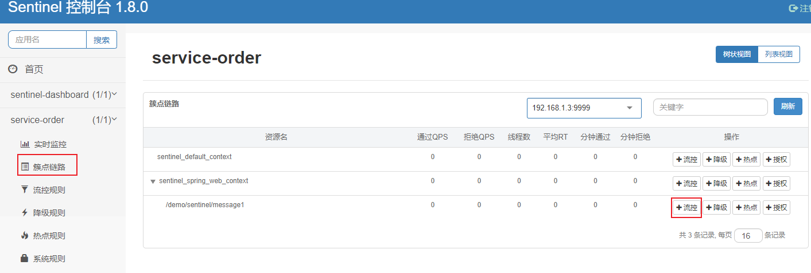

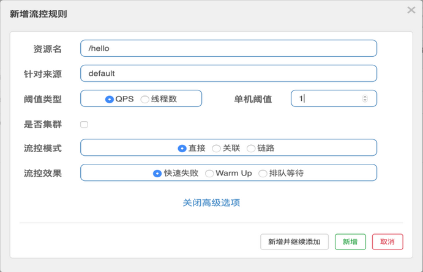

图形化界面设置项解析：

- **资源名**：唯一名称，默认是请求路径，也可填写自定义资源名称
- **针对来源**：指定对来自哪个微服务的请求进行限流，默认指default，意思是不区分来源，全部限制
- **阈值类型**：
    - QPS（每秒请求数量）：当调用该接口的QPS达到阈值的时候，进行限流
    - 线程数：当调用该接口的线程数达到阈值的时候，进行限流
- **单机阈值**：控制值 
- **是否集群**：是否为集群
- **流控模式**(高级选项)：针对这个接口本身选择不同的控制模式
- **流控效果**(高级选项)：选择控制的响应效果

#### 7.2.3. 编程式定义流控规则

重要属性：

|      Field      |                            说明                             |            默认值             |
| :-------------: | ----------------------------------------------------------- | ---------------------------- |
|    resource     | 资源名，资源名是限流规则的作用对象                            |                              |
|      count      | 限流阈值                                                    |                              |
|      grade      | 限流阈值类型，QPS 或线程数模式                               | QPS 模式                     |
|    limitApp     | 流控针对的调用来源                                           | `default`，代表不区分调用来源 |
|    strategy     | 调用关系限流策略：直接、链路、关联                            | 根据资源本身（直接）          |
| controlBehavior | 流控效果（直接拒绝/排队等待/慢启动模式），不支持按调用关系限流 | 直接拒绝                      |

可以通过调用 `FlowRuleManager.loadRules()` 方法来用硬编码的方式定义流量控制规则，比如：

```java
private static void initFlowQpsRule() {
    List<FlowRule> rules = new ArrayList<>();
    FlowRule rule1 = new FlowRule();
    rule1.setResource(resource);
    // Set max qps to 20
    rule1.setCount(20);
    rule1.setGrade(RuleConstant.FLOW_GRADE_QPS);
    rule1.setLimitApp("default");
    rules.add(rule1);
    FlowRuleManager.loadRules(rules);
}
```

#### 7.2.4. 基于QPS/并发数的流量控制

##### 7.2.4.1. 基础配置

设置阈值类型为QPS，单机阈值为3。即每秒请求量大于3的时候开始限流。

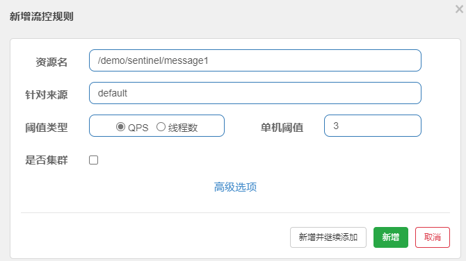

在【流控规则】页面就可以查看新增的配置。

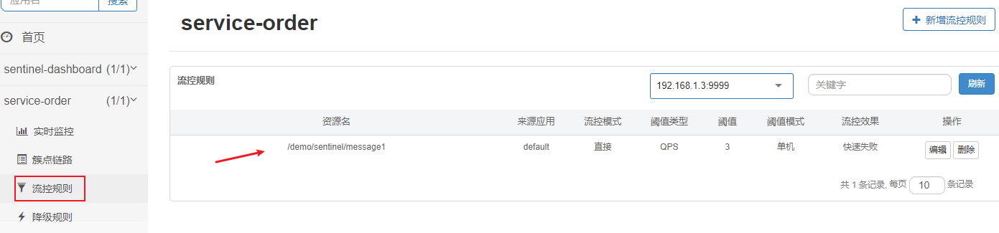

然后访问相应的接口url，快速点击刷新，当 `QPS > 3` 的时候，服务就不能正常响应，而是返回 `Blocked by Sentinel (flow limiting)` 结果。


##### 7.2.4.2. 配置流控模式

点击上面设置流控规则的编辑按钮，然后在编辑页面点击【高级选项】，会看到有流控模式一栏。

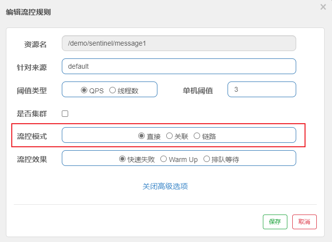

Sentinel 共有三种流控模式，分别是：

- **直接（默认）流控模式**：当指定的接口达到限流条件时，开启限流。直接流控模式是最简单的模式，*在基础配置的章节中就是这种模式*
- **关联流控模式**：当指定接口A关联的资源（接口B）达到限流条件时，开启对指定接口A的限流（适合做应用让步）

配置限流规则，将流控模式设置为关联，关联资源设置为的 `/demo/sentinel/message2`。

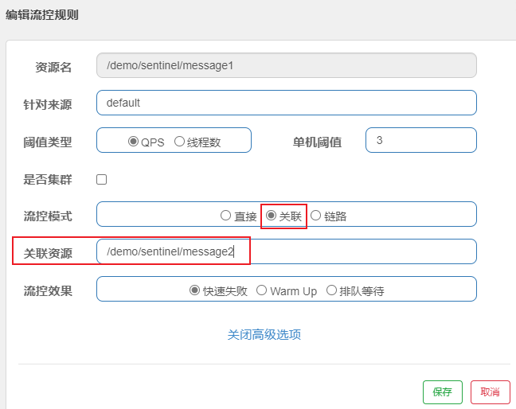

使用postman 在1s内连续请求 `/demo/sentinel/message2` 多次（`QPS>3`）

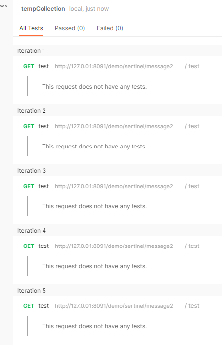

此时访问 `/demo/sentinel/message1`接口，会补限流

- **链路流控模式**：当从某个接口过来的资源达到限流条件时，开启限流。（**目前有问题，暂未实现**）
    - 它的功能有点类似于针对来源配置项，区别在于：针对来源是针对上级微服务，而链路流控是针对上级接口，也就是说它的粒度更细。

第1步： 编写一个service，在里面添加一个方法message

```java
@Service
@Slf4j
public class SentinelDemoServiceImpl implements SentinelDemoService {
    // Sentinel 支持通过 @SentinelResource 注解定义资源
    @SentinelResource("message")
    @Override
    public void message() {
        log.info("SentinelDemoServiceImpl.message 方法执行....");
    }
}
```

在请求类中定义两个请求方法，分别都调用`SentinelDemoServiceImpl`类设置的了保护的资源方法

```java
@RestController
@RequestMapping("demo/sentinel")
public class SentinelDemoController {
    @Autowired
    private SentinelDemoService sentinelDemoService;

    /* 用于测试链路流控模式：当 /message3 与 /message4 都调用同样的受保护资源 message，
     * 可以指定其中一个受流量控制，另一个不受流量控制
     */
    @RequestMapping("message3")
    public String getMessage3() {
        sentinelDemoService.message();
        return "message3";
    }

    @RequestMapping("message4")
    public String getMessage4() {
        sentinelDemoService.message();
        return "message4";
    }
}
```

禁止收敛 URL 的入口 context

> - 从 1.6.3 版本开始，Sentinel Web filter默认收敛所有URL的入口context，因此链路限流不生效。
> - 1.7.0 版本开始（对应SCA的2.1.1.RELEASE)，官方在CommonFilter 引入了
> - `WEB_CONTEXT_UNIFY` 参数，用于控制是否收敛context。将其配置为 `false` 即可根据不同的 URL 进行链路限流。
> - ~~SCA 2.1.1.RELEASE 之后的版本,可以通过配置 `spring.cloud.sentinel.web-context-unify=false` 即可关闭收敛~~（百度上此方法无效）

如果是使用 Spring Cloud Alibaba 2.1.0 版本，是无法实现链路限流。如果使用 2.1.1+ 版本，则需要写代码的形式实现链路限流

- 在配置文件中关闭 sentinel 的 `CommonFilter` 实例化

```yml
sentinel:
  # 配置关闭 sentinel 的 CommonFilter 实例化。用于测试实现链路限流
  filter:
    enabled: false
```

添加一个配置类，用于创建 `CommonFilter` 实例。

```java
/**
 * 1.7.0 版本开始（对应 Spring Cloud Alibaba 的2.1.1.RELEASE)，官方在CommonFilter 引入了 WEB_CONTEXT_UNIFY 参数，
 * 用于控制是否收敛context。将其配置为 false 即可根据不同的 URL 进行链路限流。
 * <p>
 * 注意：如果使用 Spring Cloud Alibaba 2.1.1 及更高的版本都需要手动配置此类
 */
@Configuration
public class FilterContextConfig {
    @Bean
    public FilterRegistrationBean sentinelFilterRegistration() {
        FilterRegistrationBean registration = new FilterRegistrationBean();
        registration.setFilter(new CommonFilter());
        registration.addUrlPatterns("/*");
        // 入口资源关闭聚合
        registration.addInitParameter(CommonFilter.WEB_CONTEXT_UNIFY, "false");
        registration.setName("sentinelFilter");
        registration.setOrder(1);
        return registration;
    }
}
```

成功关闭后

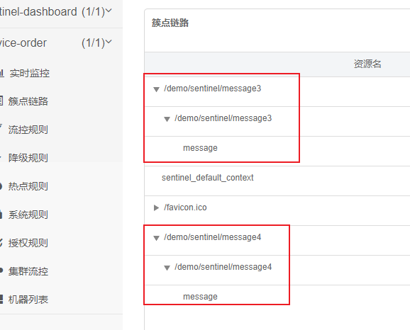

控制台配置限流规则

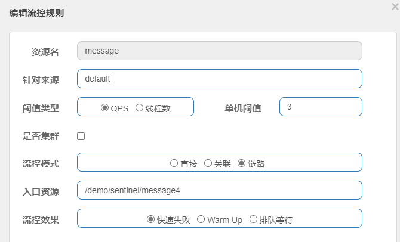

分别访问 /demo/sentinel/message3 和 /demo/sentinel/message4 访问，发现3没问题，4被限流了

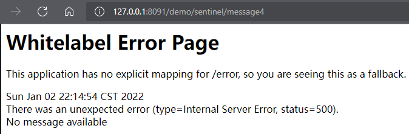

##### 7.2.4.3. 配置流控效果

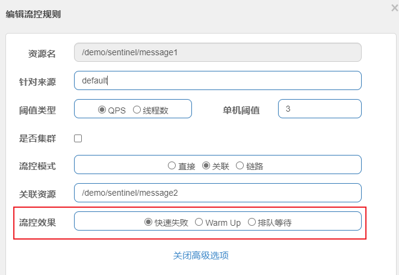

共有三种选择：

- **快速失败（默认）**: 直接失败，抛出异常，不做任何额外的处理，是最简单的效果
- **Warm Up**：它从开始阈值到最大QPS阈值会有一个缓冲阶段，一开始的阈值是最大QPS阈值的1/3，然后慢慢增长，直到最大阈值，适用于将突然增大的流量转换为缓步增长的场景。
- **排队等待**：让请求以均匀的速度通过，单机阈值为每秒通过数量，其余的排队等待； 它还会让设置一个超时时间，当请求超过超时间时间还未处理，则会被丢弃。

#### 7.2.5. 基于调用关系的流量控制

调用关系包括调用方、被调用方；方法又可能会调用其它方法，形成一个调用链路的层次关系。Sentinel 通过 NodeSelectorSlot 建立不同资源间的调用的关系，并且通过 ClusterNodeBuilderSlot 记录每个资源的实时统计信息。

#### 7.2.6. 关联限流

**关联限流**，是指某个接口自己没有设置限流规则，而受其他相关接口影响的而进行限流。

假设一个 Service 中有2个接口：查询、修改。当查询接口访问量特别大时，必然要影响修改接口，可能会导致修改接口无法处理请求。如果业务上，修改功能优先于查询功能，这就出现了一种限流的需求：“当修改接口的访问量达到一定程度时，就对查询接口限流”，这就是『关联限流』。

**实现关联限流测试步骤**：

1. 构建一个项目，创建2个测试接口，并整合 Sentinel
2. 在 Sentinel 管理控制台中对接口1设置关联接口2的限流规则
3. 测试当接口2（`/hi`）的 QPS 达到相应的设置值时，是否触发接口1（`/hello`）的限流

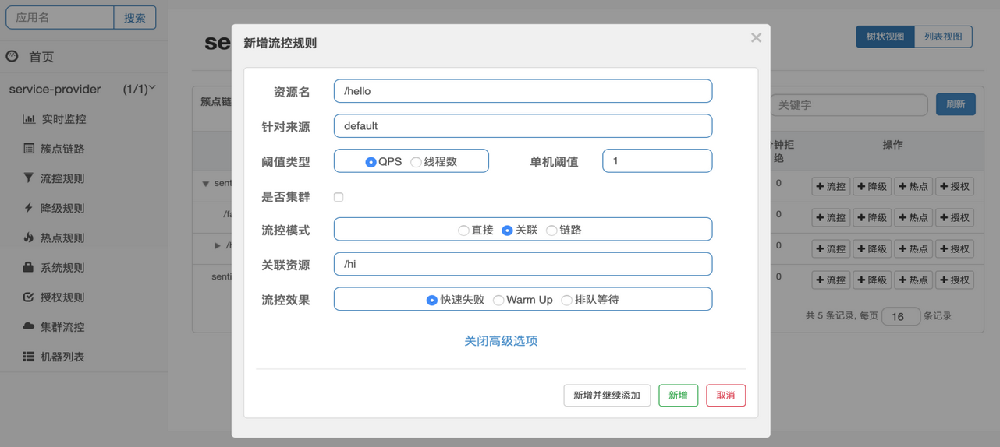

**流控效果验证**：

- 持续大量访问 `/hi` 接口，使其触发阈值。持续访问的脚本如下：

```bash
while true; \
do curl -X GET "http://localhost:8001/hi?name=a" ;\
done;
```

- 访问接口 `/hello`，此时应该已经被限流。被限流后的效果：

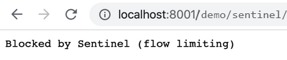

#### 7.2.7. 链路限流

**链路限流**，是指执行限流时要判断流量的来源。

假设有查询与修改的两个接口需要调用某个微服务的资源，需要做限流保护。如果查询接口请求多，导致这个资源被限流，那么就造成修改接口也无法请求该资源。此时就出现一种限流的需求：“这个微服务资源只对查询接口限流，不影响修改接口”，这就是『链路限流』

**实现链路限流测试步骤**：

1. 构建一个项目，创建2个测试接口（`/testa`，`/testb`），都调用同一个业务接口（设置为 `SentinelResource`）
2. 在 Sentinel 管理控制台中对该业务接口设置链路限流，入口资源指定 `/testa`
3. 测试当接口（`/testa`）的 QPS 达到相应的设置值后，产生被限流效果时，验证接口（`/testb`）是否不受影响，正常访问业务接口


**流控效果验证**：

- 持续大量访问 `/testa` 接口，使其触发阈值并产生被限流效果。持续访问的脚本如下：

```bash
while true; \
do curl -X GET "http://localhost:8081/testa" ;\
done;
```

- 访问接口 `/testb`，可以正常访问资源。

### 7.3. 熔断降级规则 (DegradeRule)

#### 7.3.1. 定义

降级规则就是设置当满足什么条件的时候，对服务进行降级。<font color=red>**同一个资源可以同时有多个降级规则。**</font>

> Tips: 本文档针对 Sentinel 1.8.0 及以上版本。1.8.0 版本对熔断降级特性进行了全新的改进升级，请使用最新版本以更好地利用熔断降级的能力。更多详情可以参考 [熔断降级](https://sentinelguard.io/zh-cn/docs/circuit-breaking.html)。

#### 7.3.2. 熔断策略

Sentinel 提供以下几种熔断策略：

- 慢调用比例/平均响应时间 (`SLOW_REQUEST_RATIO`)：选择以慢调用比例作为阈值，需要设置允许的慢调用 RT（即最大的响应时间），请求的响应时间大于该值则统计为慢调用。当单位统计时长（`statIntervalMs`）内请求数目大于设置的最小请求数目，并且慢调用的比例大于阈值，则接下来的熔断时长内请求会自动被熔断。经过熔断时长后熔断器会进入探测恢复状态（HALF-OPEN 状态），若接下来的一个请求响应时间小于设置的慢调用 RT 则结束熔断，若大于设置的慢调用 RT 则会再次被熔断。
- 异常比例 (`ERROR_RATIO`)：当单位统计时长（`statIntervalMs`）内请求数目大于设置的最小请求数目，并且异常的比例大于阈值，则接下来的熔断时长内请求会自动被熔断。经过熔断时长后熔断器会进入探测恢复状态（HALF-OPEN 状态），若接下来的一个请求成功完成（没有错误）则结束熔断，否则会再次被熔断。异常比率的阈值范围是 `[0.0, 1.0]`，代表 0% - 100%。
- 异常数 (`ERROR_COUNT`)：当单位统计时长内的异常数目超过阈值之后会自动进行熔断。经过熔断时长后熔断器会进入探测恢复状态（HALF-OPEN 状态），若接下来的一个请求成功完成（没有错误）则结束熔断，否则会再次被熔断。

#### 7.3.3. 编程式定义熔断降级规则

熔断降级规则包含下面几个重要的属性：

|       Field        |                                    说明                                     |   默认值   |
| :----------------: | -------------------------------------------------------------------------- | --------- |
|      resource      | 资源名，即规则的作用对象                                                       |           |
|       grade        | 熔断策略，支持慢调用比例/异常比例/异常数策略                                      | 慢调用比例 |
|       count        | 慢调用比例模式下为慢调用临界 RT（超出该值计为慢调用）；异常比例/异常数模式下为对应的阈值 |           |
|     timeWindow     | 熔断时长，单位为 s                                                            |           |
|  minRequestAmount  | 熔断触发的最小请求数，请求数小于该值时即使异常比率超出阈值也不会熔断（1.7.0 引入）      | 5         |
|   statIntervalMs   | 统计时长（单位为 ms），如 `60*1000` 代表分钟级（1.8.0 引入）                      | 1000 ms   |
| slowRatioThreshold | 慢调用比例阈值，仅慢调用比例模式有效（1.8.0 引入）                                 |           |

可以通过调用 `DegradeRuleManager.loadRules()` 方法来用硬编码的方式定义流量控制规则。

```java
private static void initDegradeRule() {
    List<DegradeRule> rules = new ArrayList<>();
    DegradeRule rule = new DegradeRule(resource)
        .setGrade(CircuitBreakerStrategy.ERROR_RATIO.getType());
        .setCount(0.7); // Threshold is 70% error ratio
        .setMinRequestAmount(100)
        .setStatIntervalMs(30000) // 30s
        .setTimeWindow(10);
    rules.add(rule);
    DegradeRuleManager.loadRules(rules);
}
```

#### 7.3.4. 慢调用比例/平均响应时间(配置界面)

点击簇点链路，可以看到访问过的接口地址，然后点击对应的降级按钮，进入降级规则配置页面。新增降级规则界面如下

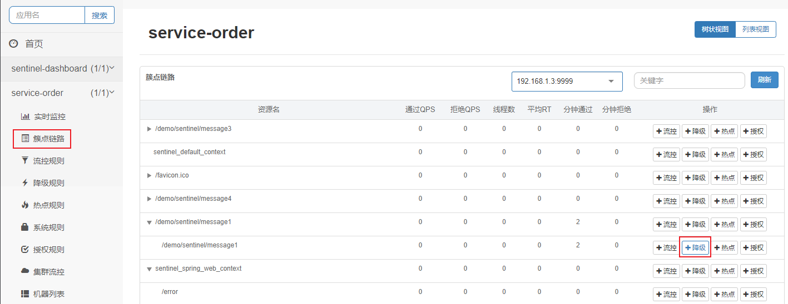

慢调用比例/平均响应时间规则的设置

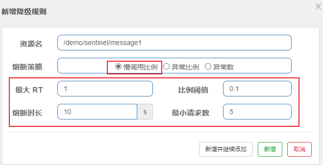

以上设置是当资源的平均响应时间超过阈值（以 ms 为单位）之后，资源进入准降级状态。如果接下来 1s 内持续进入 5 个请求，它们的 RT 都持续超过这个阈值，那么在接下的时间窗口（10s）之内，就会对这个方法进行服务降级。10s之后恢复正常，进行下一轮判断。

在【降级规则】可查询所有创建的降级规则

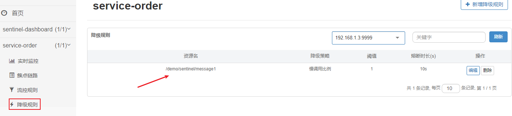

> 注意：Sentinel 默认统计的 RT 上限是 `4900 ms`，超出此阈值的都会算作 `4900 ms`，若需要变更此上限可以通过启动配置项 `-Dcsp.sentinel.statistic.max.rt=xxx` 来配置。

#### 7.3.5. 异常比例(配置界面)

定义请求方法模拟异常

```java
int i = 0;

/* 模拟出现异常的请求方法 */
@RequestMapping("message5")
public String getMessage5() {
    i++;
    // 模拟异常出现的机率是0.333
    if (i % 3 == 0) {
        throw new RuntimeException();
    }
    return "message5";
}
```

设置异常比例规则

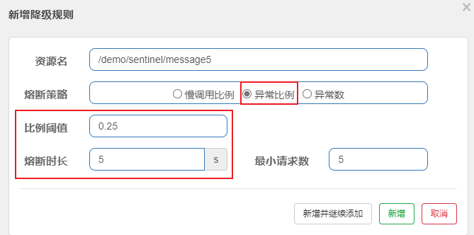

以上设置是当资源的每秒异常总数占通过量的比值超过阈值（0.25）之后，资源进入降级状态，即在接下的时间窗口（5s）之内，对这个方法的调用都会自动地返回。

#### 7.3.6. 异常数(配置界面)

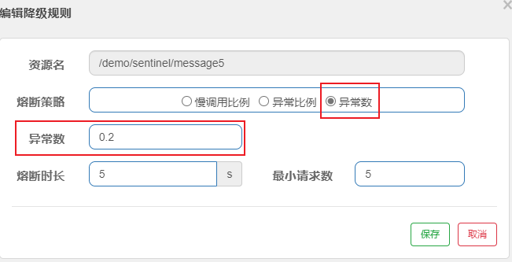

以上设置是当资源近 1 分钟的异常数目超过阈值之后会进行服务降级。经过熔断时长（5s）后熔断器会进入探测恢复状态（HALF-OPEN 状态），若接下来的一个请求成功完成（没有错误）则结束熔断，否则会再次被熔断。

### 7.4. 热点规则 (ParamFlowRule)

#### 7.4.1. 定义

热点即经常访问的数据。很多时候希望统计某个热点数据中访问频次最高的 Top K 数据，并对其访问进行限制。

热点参数限流会统计传入参数中的热点参数，并根据配置的限流阈值与模式，对包含热点参数的资源调用进行限流。热点参数限流可以看做是一种特殊的、更细粒度的流量控制，仅对包含热点参数的资源调用生效。

Sentinel 利用 LRU 策略统计最近最常访问的热点参数，结合令牌桶算法来进行参数级别的流控。

> Notes: 详情可以参考 [热点参数限流](https://sentinelguard.io/zh-cn/docs/parameter-flow-control.html)。

#### 7.4.2. 编程式定义热点参数规则

要使用热点参数限流功能，需要引入以下依赖：

```xml
<dependency>
    <groupId>com.alibaba.csp</groupId>
    <artifactId>sentinel-parameter-flow-control</artifactId>
    <version>x.y.z</version>
</dependency>
```

热点参数规则（ParamFlowRule）类似于流量控制规则（FlowRule），其重要属性如下：

|        属性        |                                                   说明                                                   |  默认值   |
| :---------------: | ------------------------------------------------------------------------------------------------------- | -------- |
|     resource      | 资源名，必填                                                                                             |          |
|       count       | 限流阈值，必填                                                                                           |          |
|       grade       | 限流模式                                                                                                 | QPS 模式 |
|   durationInSec   | 统计窗口时间长度（单位为秒），1.6.0 版本开始支持                                                           | 1s       |
|  controlBehavior  | 流控效果（支持快速失败和匀速排队模式），1.6.0 版本开始支持                                                  | 快速失败  |
| maxQueueingTimeMs | 最大排队等待时长（仅在匀速排队模式生效），1.6.0 版本开始支持                                                | 0ms      |
|     paramIdx      | 热点参数的索引，必填，对应 `SphU.entry(xxx, args)` 中的参数索引位置                                        |          |
| paramFlowItemList | 参数例外项，可以针对指定的参数值单独设置限流阈值，不受前面 `count` 阈值的限制。**仅支持基本类型和字符串类型** |          |
|    clusterMode    | 是否是集群参数流控规则                                                                                    | `false`  |
|   clusterConfig   | 集群流控相关配置                                                                                         |          |

可以通过 ParamFlowRuleManager 的 loadRules 方法更新热点参数规则：

```java
ParamFlowRule rule = new ParamFlowRule(resourceName)
    .setParamIdx(0)
    .setCount(5);
// 针对 int 类型的参数 PARAM_B，单独设置限流 QPS 阈值为 10，而不是全局的阈值 5.
ParamFlowItem item = new ParamFlowItem().setObject(String.valueOf(PARAM_B))
    .setClassType(int.class.getName())
    .setCount(10);
rule.setParamFlowItemList(Collections.singletonList(item));

ParamFlowRuleManager.loadRules(Collections.singletonList(rule));
```

#### 7.4.3. 热点规则基础使用

- 编写资源，带有参数的请求方法

```java
/* 测试热点规则限流 */
@SentinelResource("paramFlowRuleDemo") // 注意：必须在资源上使用 @SentinelResource 注解，否则热点规则不生效
@RequestMapping("paramFlowRuleDemo")
public String getMessage6(String name, Integer age) {
    return String.format("name: %s, age: %d", name, age);
}
```

- 配置热点规则

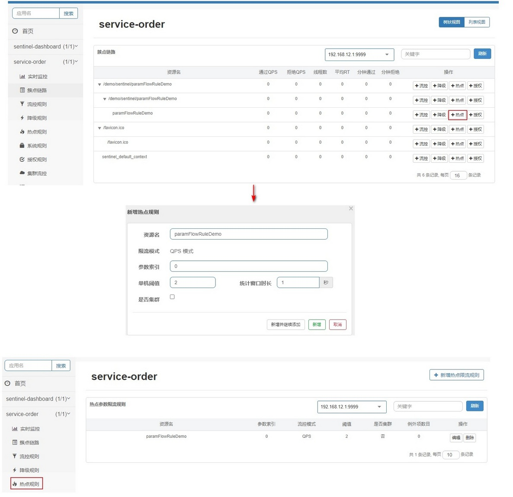

- 分别用两个参数访问，会发现只对第一个参数限流了

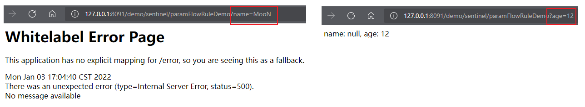

#### 7.4.4. 热点规则增强使用

在编辑热点规则中，有高级选项。值得注意的是，在原来『簇点链路』中的『热点』是没有此『高级选项』，需要点击左侧导航栏中的『热点规则』，在『+新增热点限流规则』中才能设置高级选项。

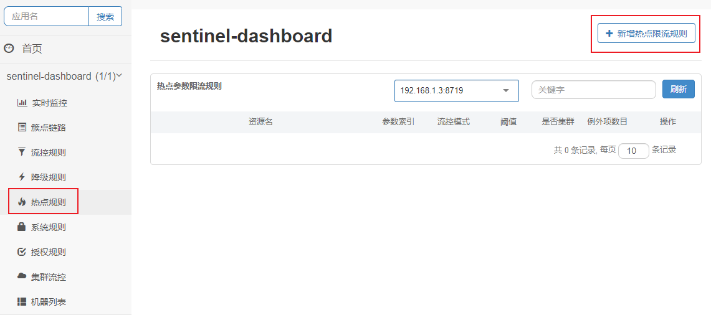

<font color=red>**必须注意一点：在『热点规则』中配置的『资源名』必须是填写 `@SentinelResource` 注解标识的资源名称，否则无法生效！**</font>

在『参数例外项』中，允许对一个参数的具体值进行流控

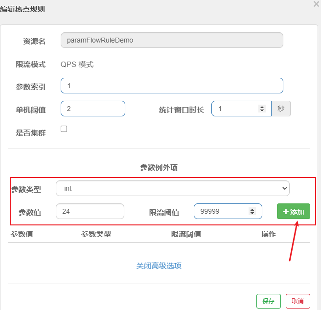

测试结果

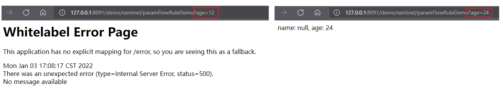

### 7.5. 访问控制规则（黑白名单）(AuthorityRule)（暂时有问题）

#### 7.5.1. 定义

当需要根据调用方来限制资源是否通过，此时可以使用 Sentinel 的黑白名单控制的功能。黑白名单根据资源的请求来源（origin）限制资源是否通过，

- 若配置白名单则只有请求来源位于白名单内时才可通过；
- 若配置黑名单则请求来源位于黑名单时不通过，其余的请求通过。

#### 7.5.2. 编程式定义访问控制规则

黑白名单规则（`AuthorityRule`）主要有以下配置项：

- `resource`：资源名，即限流规则的作用对象
- `limitApp`：对应的黑名单/白名单，不同 origin 用 `,` 分隔，如 `appA,appB`
- `strategy`：限制模式，`AUTHORITY_WHITE` 为白名单模式，`AUTHORITY_BLACK` 为黑名单模式，默认为白名单模式

例如希望控制对资源 test 的访问设置白名单，只有来源为 appA 和 appB 的请求才可通过，则可以配置如下白名单规则：

```java
AuthorityRule rule = new AuthorityRule();
rule.setResource("test");
rule.setStrategy(RuleConstant.AUTHORITY_WHITE);
rule.setLimitApp("appA,appB");
AuthorityRuleManager.loadRules(Collections.singletonList(rule));
```

#### 7.5.3. 基础使用

- 定义规则

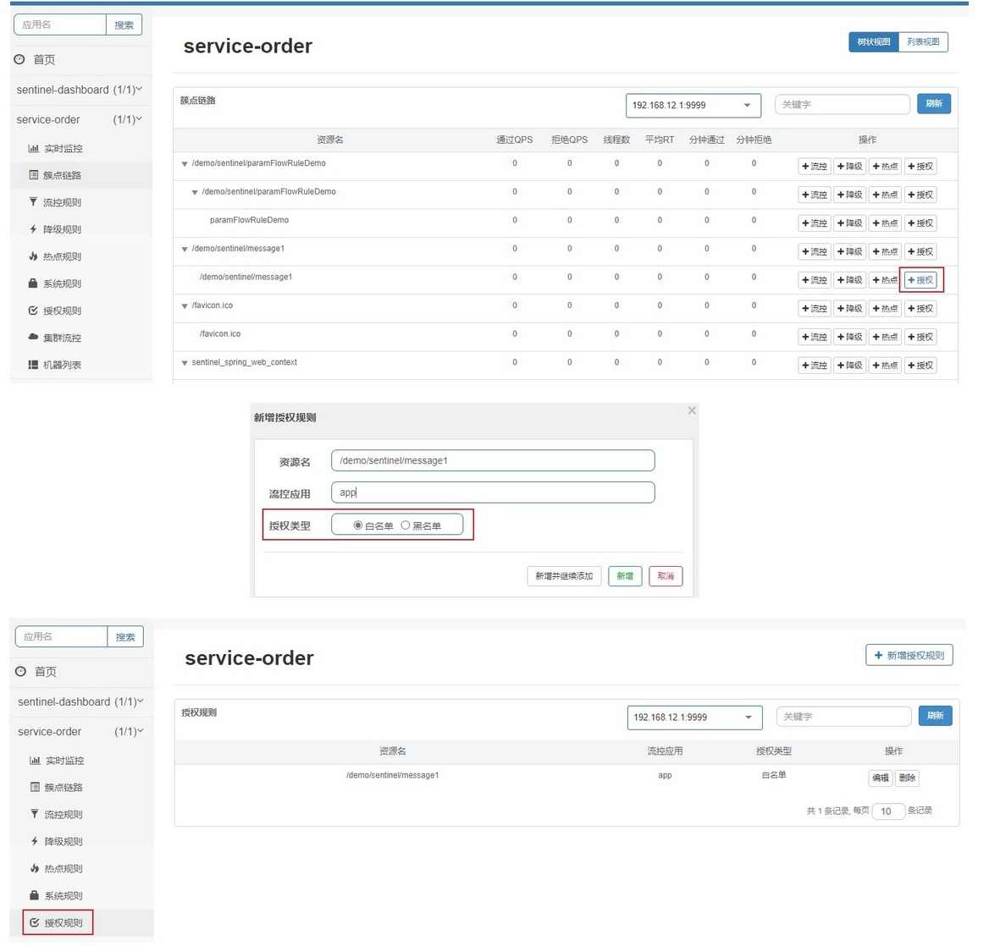

其实这个位置要填写的是来源标识，Sentinel 提供了 `RequestOriginParser` 接口来处理来源。只要 Sentinel 保护的接口资源被访问，Sentinel 就会调用 `RequestOriginParser` 的实现类去解析访问来源。

- 编写自定义来源处理规则处理类

```java
@Component
public class RequestOriginParserHandler implements RequestOriginParser {
    @Override
    public String parseOrigin(HttpServletRequest request) {
        /* 定义区分来源: 本质作用是通过 HttpServletRequest 对象获取请求一些信息 */
        String client = request.getParameter("client");
        if (StringUtils.isEmpty(client)) {
            throw new RuntimeException("client is not empty");
        }
        return client;
    }
}
```

- 测试访问：http://127.0.0.1:8091/demo/sentinel/message1?client=pc

### 7.6. 系统保护规则 (SystemRule)

#### 7.6.1. 定义

Sentinel 系统自适应保护从整体维度对应用入口流量进行控制，结合应用的 Load、总体平均 RT、入口 QPS 和线程数等几个维度的监控指标，让系统的入口流量和系统的负载达到一个平衡，让系统尽可能跑在最大吞吐量的同时保证系统整体的稳定性。

> Notes: 更多详情可以参考 [系统自适应保护](https://sentinelguard.io/zh-cn/docs/system-adaptive-protection.html)。

#### 7.6.2. 编程式定义系统规则

系统规则包含下面几个重要的属性：

|       Field       |                 说明                  |   默认值    |
| :---------------: | ------------------------------------- | ----------- |
| highestSystemLoad | `load1` 触发值，用于触发自适应控制阶段 | -1 (不生效) |
|       avgRt       | 所有入口流量的平均响应时间             | -1 (不生效) |
|     maxThread     | 入口流量的最大并发数                  | -1 (不生效) |
|        qps        | 所有入口资源的 QPS                    | -1 (不生效) |
|  highestCpuUsage  | 当前系统的 CPU 使用率（0.0-1.0）      | -1 (不生效) |

可以通过调用 `SystemRuleManager.loadRules()` 方法来用硬编码的方式定义流量控制规则：

```java
 private void initSystemProtectionRule() {
    List<SystemRule> rules = new ArrayList<>();
    SystemRule rule = new SystemRule();
    rule.setHighestSystemLoad(10);
    rules.add(rule);
    SystemRuleManager.loadRules(rules);
}
```

#### 7.6.3. 系统规则支持类型

系统保护规则是应用整体维度的，而不是资源维度的，并且**仅对入口流量生效**。入口流量指的是进入应用的流量（`EntryType.IN`），比如 Web 服务或 Dubbo 服务端接收的请求，都属于入口流量。

系统规则支持以下的阈值类型：

- **Load**（仅对 Linux/Unix-like 机器生效）：当系统 load1 超过阈值，且系统当前的<font color=red>**并发线程数超过系统容量**</font>时才会触发系统保护。系统容量由系统的 `maxQps * minRt` 计算得出。设定参考值一般是 `CPU cores * 2.5`。
- **CPU usage**（1.5.0+ 版本）：当系统 CPU 使用率超过阈值即触发系统保护（取值范围 0.0-1.0）。
- **平均 RT**：当单台机器上所有入口流量的平均 RT 达到阈值即触发系统保护，单位是毫秒。
- **线程数**：当单台机器上所有入口流量的并发线程数达到阈值即触发系统保护。
- **入口 QPS**：当单台机器上所有入口流量的 QPS 达到阈值即触发系统保护。

### 7.7. 自定义规则异常返回

- 定义公共的响应类

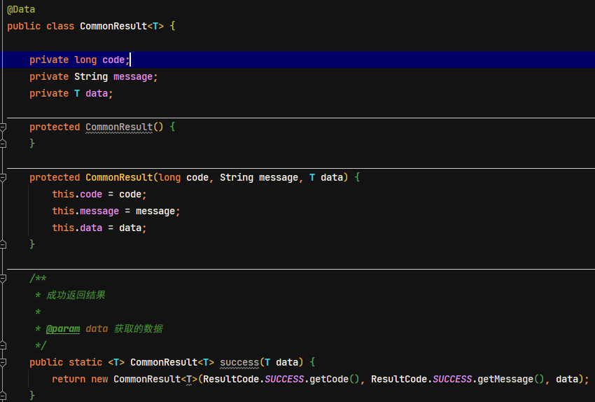

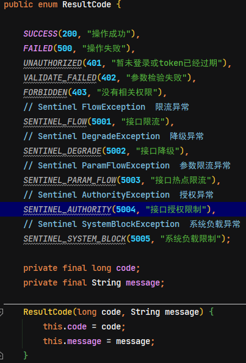

- 实现 `com.alibaba.csp.sentinel.adapter.servlet.callback.UrlBlockHandler` 接口，在 Sentinel 进行规则拦截时，会调用到接口的 `blocked` 方法。所以在此方法中，根据不同的异常类型自定义相应的返回内容。

#### 7.7.1. 旧版本（1.8以前版本）实现 UrlBlockHandler 的接口

```java
@Component
public class ExceptionPageHandler implements UrlBlockHandler {
    /**
     * Handle the request when blocked.
     *
     * @param request  Servlet request
     * @param response Servlet response
     * @param ex       the block exception.
     * @throws IOException some error occurs
     */
    @Override
    public void blocked(HttpServletRequest request, HttpServletResponse response, BlockException ex) throws IOException {
        response.setContentType("application/json;charset=utf-8");

        CommonResult responseData = null;
        // BlockException 是 Sentinel 异常接口,包含 Sentinel 的五种异常
        if (ex instanceof FlowException) {
            // FlowException  限流异常
            responseData = CommonResult.failed(ResultCode.SENTINEL_FLOW);
        } else if (ex instanceof DegradeException) {
            // DegradeException  降级异常
            responseData = CommonResult.failed(ResultCode.SENTINEL_DEGRADE);
        } else if (ex instanceof ParamFlowException) {
            // ParamFlowException  参数限流异常
            responseData = CommonResult.failed(ResultCode.SENTINEL_PARAM_FLOW);
        } else if (ex instanceof AuthorityException) {
            // AuthorityException  授权异常
            responseData = CommonResult.failed(ResultCode.SENTINEL_AUTHORITY);
        } else if (ex instanceof SystemBlockException) {
            // SystemBlockException  系统负载异常
            responseData = CommonResult.failed(ResultCode.SENTINEL_SYSTEM_BLOCK);
        }
        response.getWriter().write(JSON.toJSONString(responseData));
    }
}
```

#### 7.7.2. 新版本（1.8版本）实现 BlockExceptionHandler 的接口

```java
@Component
public class ExceptionPageHandler implements BlockExceptionHandler {
    /**
     * Handle the request when blocked.
     *
     * @param request  Servlet request
     * @param response Servlet response
     * @param e        the block exception
     * @throws Exception users may throw out the BlockException or other error occurs
     */
    @Override
    public void handle(HttpServletRequest request, HttpServletResponse response, BlockException e) throws Exception {
        response.setContentType("application/json;charset=utf-8");

        CommonResult responseData = null;
        // BlockException 是 Sentinel 异常接口,包含 Sentinel 的五种异常
        if (e instanceof FlowException) {
            // FlowException  限流异常
            responseData = CommonResult.failed(ResultCode.SENTINEL_FLOW);
        } else if (e instanceof DegradeException) {
            // DegradeException  降级异常
            responseData = CommonResult.failed(ResultCode.SENTINEL_DEGRADE);
        } else if (e instanceof ParamFlowException) {
            // ParamFlowException  参数限流异常
            responseData = CommonResult.failed(ResultCode.SENTINEL_PARAM_FLOW);
        } else if (e instanceof AuthorityException) {
            // AuthorityException  授权异常
            responseData = CommonResult.failed(ResultCode.SENTINEL_AUTHORITY);
        } else if (e instanceof SystemBlockException) {
            // SystemBlockException  系统负载异常
            responseData = CommonResult.failed(ResultCode.SENTINEL_SYSTEM_BLOCK);
        }
        response.getWriter().write(JSON.toJSONString(responseData));
    }
}
```

### 7.8. Sentinel 规则持久化

#### 7.8.1. 概述

上面的规则配置，都是存在内存中的。即如果应用重启，这个规则就会失效。Sentinel 提供了开放的接口，可以通过实现 DataSource 接口的方式，来自定义规则的存储数据源。通常的建议有：

- 整合动态配置系统，如 ZooKeeper、Nacos 等，动态地实时刷新配置规则
- 结合 RDBMS、NoSQL、VCS 等来实现该规则
- 配合 Sentinel Dashboard 使用

#### 7.8.2. 规则推送原理

本地文件数据源会定时轮询文件的变更，读取规则。这样既可以在应用本地直接修改文件来更新规则，也可以通过 Sentinel 控制台推送规则。以本地文件数据源为例，推送过程如下图所示：

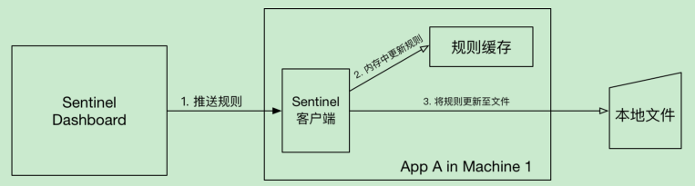

首先 Sentinel 控制台通过 API 将规则推送至客户端并更新到内存中，接着注册的写数据源会将新的规则保存到本地的文件中。

#### 7.8.3. 实现规则持久化步骤

注册数据源。可以借助 Sentinel 的 InitFunc SPI 扩展接口。只需要实现自己的 `InitFunc` 接口，在 `init` 方法中编写注册数据源的逻辑。

```java
public class DataSourceInitFunc implements InitFunc {
    /* 此处初始化时，是无法读取配置文件 */
    @Value("${spring.application.name}")
    private String appcationName;

    @Override
    public void init() throws Exception {
        // String ruleDir = System.getProperty("user.home") + "/sentinel-rules/" + appcationName;
        String ruleDir = "D:/deployment-environment/sentinel/sentinel-rules/service-order/";
        String flowRulePath = ruleDir + "/flow-rule.json";
        String degradeRulePath = ruleDir + "/degrade-rule.json";
        String systemRulePath = ruleDir + "/system-rule.json";
        String authorityRulePath = ruleDir + "/authority-rule.json";
        String paramFlowRulePath = ruleDir + "/param-flow-rule.json";

        this.mkdirIfNotExits(ruleDir);
        this.createFileIfNotExits(flowRulePath);
        this.createFileIfNotExits(degradeRulePath);
        this.createFileIfNotExits(systemRulePath);
        this.createFileIfNotExits(authorityRulePath);
        this.createFileIfNotExits(paramFlowRulePath);

        // 流控规则
        ReadableDataSource<String, List<FlowRule>> flowRuleRDS = new FileRefreshableDataSource<>(
                flowRulePath,
                flowRuleListParser
        );
        FlowRuleManager.register2Property(flowRuleRDS.getProperty());
        WritableDataSource<List<FlowRule>> flowRuleWDS = new FileWritableDataSource<>(
                flowRulePath,
                this::encodeJson
        );
        WritableDataSourceRegistry.registerFlowDataSource(flowRuleWDS);

        // 降级规则
        ReadableDataSource<String, List<DegradeRule>> degradeRuleRDS = new FileRefreshableDataSource<>(
                degradeRulePath,
                degradeRuleListParser
        );
        DegradeRuleManager.register2Property(degradeRuleRDS.getProperty());
        WritableDataSource<List<DegradeRule>> degradeRuleWDS = new FileWritableDataSource<>(
                degradeRulePath,
                this::encodeJson
        );
        WritableDataSourceRegistry.registerDegradeDataSource(degradeRuleWDS);

        // 系统规则
        ReadableDataSource<String, List<SystemRule>> systemRuleRDS = new FileRefreshableDataSource<>(
                systemRulePath,
                systemRuleListParser
        );
        SystemRuleManager.register2Property(systemRuleRDS.getProperty());
        WritableDataSource<List<SystemRule>> systemRuleWDS = new FileWritableDataSource<>(
                systemRulePath,
                this::encodeJson
        );
        WritableDataSourceRegistry.registerSystemDataSource(systemRuleWDS);

        // 授权规则
        ReadableDataSource<String, List<AuthorityRule>> authorityRuleRDS = new FileRefreshableDataSource<>(
                authorityRulePath,
                authorityRuleListParser
        );
        AuthorityRuleManager.register2Property(authorityRuleRDS.getProperty());
        WritableDataSource<List<AuthorityRule>> authorityRuleWDS = new FileWritableDataSource<>(
                authorityRulePath,
                this::encodeJson
        );
        WritableDataSourceRegistry.registerAuthorityDataSource(authorityRuleWDS);

        // 热点参数规则
        ReadableDataSource<String, List<ParamFlowRule>> paramFlowRuleRDS = new FileRefreshableDataSource<>(
                paramFlowRulePath,
                paramFlowRuleListParser
        );
        ParamFlowRuleManager.register2Property(paramFlowRuleRDS.getProperty());
        WritableDataSource<List<ParamFlowRule>> paramFlowRuleWDS = new FileWritableDataSource<>(
                paramFlowRulePath,
                this::encodeJson
        );
        ModifyParamFlowRulesCommandHandler.setWritableDataSource(paramFlowRuleWDS);
    }

    private Converter<String, List<FlowRule>> flowRuleListParser = source -> JSON.parseObject(
            source,
            new TypeReference<List<FlowRule>>() {
            }
    );
    private Converter<String, List<DegradeRule>> degradeRuleListParser = source -> JSON.parseObject(
            source,
            new TypeReference<List<DegradeRule>>() {
            }
    );
    private Converter<String, List<SystemRule>> systemRuleListParser = source -> JSON.parseObject(
            source,
            new TypeReference<List<SystemRule>>() {
            }
    );

    private Converter<String, List<AuthorityRule>> authorityRuleListParser = source -> JSON.parseObject(
            source,
            new TypeReference<List<AuthorityRule>>() {
            }
    );

    private Converter<String, List<ParamFlowRule>> paramFlowRuleListParser = source -> JSON.parseObject(
            source,
            new TypeReference<List<ParamFlowRule>>() {
            }
    );

    private void mkdirIfNotExits(String filePath) throws IOException {
        File file = new File(filePath);
        if (!file.exists()) {
            file.mkdirs();
        }
    }

    private void createFileIfNotExits(String filePath) throws IOException {
        File file = new File(filePath);
        if (!file.exists()) {
            file.createNewFile();
        }
    }

    private <T> String encodeJson(T t) {
        return JSON.toJSONString(t);
    }
}
```

在对应的类名添加到位于资源目录（通常是 resource 目录）下的 `META-INF/services` 目录下的 `com.alibaba.csp.sentinel.init.InitFunc` 文件中，添加自定义 `InitFunc` 接口实现类全限定名

```
com.moon.order.config.DataSourceInitFunc
```

当初次访问任意资源的时候，Sentinel 就可以自动去注册对应的数据源了。

## 8. @SentinelResource 注解

### 8.1. 定义

Sentinel 提供了 `@SentinelResource` 注解用于定义资源，并提供了 AspectJ 的扩展用于自动定义资源、处理 `BlockException` 等。

### 8.2. 注解属性

`@SentinelResource` 用于定义资源，并提供可选的异常处理和 `fallback` 配置项。 `@SentinelResource` 注解包含以下属性：

- `value`：资源名称，必需项（不能为空）
- `entryType`：entry 类型，标记流量的方向，可选项 `EntryType.IN`/`EntryType.OUT`（默认为 `EntryType.OUT`）
- `blockHandler` / `blockHandlerClass`: `blockHandler` 对应处理 `BlockException` 的函数名称，可选项。函数签名和位置要求：
    - `blockHandler` 函数访问范围需要是 `public`
    - 返回类型需要与原方法相匹配，参数类型需要和原方法相匹配并且最后加一个额外的参数，类型为 `BlockException`。
    - `blockHandler` 函数默认需要和原方法在同一个类中。若希望使用其他类的函数，则可以指定 `blockHandlerClass` 为对应的类的 `Class` 对象，注意对应的函数必需为 `static` 函数，否则无法解析。
- `fallback`/`fallbackClass`：`fallback` 函数名称，可选项，用于在抛出异常的时候提供 `fallback` 处理逻辑。`fallback` 函数可以针对所有类型的异常（除了 `exceptionsToIgnore`  里面排除掉的异常类型）进行处理。`fallback` 函数签名和位置要求：
  - 返回值类型必须与原函数返回值类型一致；
  - 方法参数列表需要和原函数一致，或者可以额外多一个 `Throwable` 类型的参数用于接收对应的异常。
  - `fallback` 函数默认需要和原方法在同一个类中。若希望使用其他类的函数，则可以指定 `fallbackClass` 为对应的类的 `Class` 对象，注意对应的函数必需为 `static` 函数，否则无法解析。
- `defaultFallback`（since 1.6.0）：默认的 `fallback` 函数名称，可选项，通常用于通用的 `fallback` 逻辑（即可以用于很多服务或方法）。默认 `fallback` 函数可以针对所有类型的异常（除了`exceptionsToIgnore`里面排除掉的异常类型）进行处理。若同时配置了 `fallback` 和 `defaultFallback`，则只有 `fallback` `会生效。defaultFallback` 函数签名要求：
  - 返回值类型必须与原函数返回值类型一致；
  - 方法参数列表需要为空，或者可以额外多一个 `Throwable` 类型的参数用于接收对应的异常。
  - `defaultFallback` 函数默认需要和原方法在同一个类中。若希望使用其他类的函数，则可以指定 `fallbackClass` 为对应的类的 `Class` 对象，注意对应的函数必需为 `static` 函数，否则无法解析。
- `exceptionsToIgnore`（since 1.6.0）：用于指定哪些异常被排除掉，不会计入异常统计中，也不会进入 `fallback` 逻辑中，而是会原样抛出。
- `exceptionsToTrace`：需要trace的异常。
- `resourceType`（since 1.7.0）：分类

> 注：
>
> - 1.8.0 版本开始，`defaultFallback` 支持在类级别进行配置。
> - 1.6.0 之前的版本 `fallback` 函数只针对降级异常（`DegradeException`）进行处理，**不能针对业务异常进行处理**。

特别地，若 `blockHandler` 和 `fallback` 都进行了配置，则被限流降级而抛出 `BlockException` 时只会进入 `blockHandler` 处理逻辑。若未配置 `blockHandler`、`fallback` 和 `defaultFallback`，则被限流降级时会将 `BlockException` **直接抛出**（若方法本身未定义 throws BlockException 则会被 JVM 包装一层 `UndeclaredThrowableException`）。

### 8.3. 定义限流和降级后的处理方法

#### 8.3.1. 保护方法与处理方法定义在同一类中

```java
@Service
@Slf4j
public class SentinelDemoServiceImpl implements SentinelDemoService {

    private static int count = 0;

    /*
     * @SentinelResource 注解是用于指定需要 Sentinel 保护的方法上
     *  blockHandler属性：声明熔断时调用的降级方法
     *  fallback属性：声明抛出异常时执行的降级方法
     *  value属性：设置自定义的资源名称，如不设置，默认值是“当前全类名.方法名”
     */
    @SentinelResource(value = "sentinelResourceBlockHandler", blockHandler = "blockHandler")
    @Override
    public String sentinelResourceBlockHandler(String text) {
        return "BlockException 异常处理测试方法。函数默认需要和原方法在同一个类中";
    }

    @SentinelResource(value = "sentinelResourceFallback", fallback = "fallback")
    @Override
    public String sentinelResourceFallback(String text) {
        count++;
        if (count % 3 == 0) {
            throw new RuntimeException("发生异常了。");
        }

        return "抛出异常处理测试方法。函数默认需要和原方法在同一个类中";
    }

    /*
     * 定义@SentinelResource注解相应的熔断降级方法，函数的要求：
     *  1.必须是public修饰
     *  2.返回类型与原方法一致
     *  3.参数类型需要和原方法相匹配，并在最后加BlockException类型的参数
     *  4.默认需和原方法在同一个类中。若希望使用其他类的函数，可配置blockHandlerClass属性，并指定blockHandlerClass里面的方法，注意函数必需为 `static` 修饰的
     */
    public String blockHandler(String text, BlockException e) {
        log.info("当前方法入参text: {}", text);
        e.printStackTrace();
        return "触发本类内熔断的降级方法";
    }

    /*
     * 定义@SentinelResource注解相应的抛出异常的降级方法，函数的要求：
     *  1.返回类型与原方法一致
     *  2.参数类型需要和原方法相匹配，Sentinel 1.6开始，也可在方法最后加Throwable类型的参数
     *  3.默认需和原方法在同一个类中。若希望使用其他类的函数，可配置fallbackClass，并指定fallbackClass里面的方法，注意函数必需为 `static` 修饰的
     */
    public String fallback(String text, Throwable throwable) {
        log.info("当前方法入参text: {}", text);
        throwable.printStackTrace();
        return "触发本类内抛出异常执行的降级方法";
    }
}
```

#### 8.3.2. 处理方法定义在外部类中

定义需要保护的方法

```java
@Service
@Slf4j
public class SentinelDemoServiceImpl implements SentinelDemoService {

    private static int count = 0;

    @SentinelResource(value = "sentinelResourceBlockHandlerOut",
            blockHandlerClass = BlockHandlerOutDemo.class,
            blockHandler = "blockHandler")
    @Override
    public String sentinelResourceBlockHandlerOut(String text) {
        return "外部类方式处理 BlockException 异常的测试方法";
    }

    @SentinelResource(value = "sentinelResourceFallbackOut",
            fallbackClass = FallbackOutDemo.class,
            fallback = "fallback")
    @Override
    public String sentinelResourceFallbackOut(String text) {
        count++;
        if (count % 3 == 0) {
            throw new RuntimeException("发生异常了。");
        }
        return "外部类方式处理抛出异常处理的测试方法";
    }

}
```

在其它的类分别定义处理方法，注意：**对应的函数必需为 `static` 函数**

```java
@Slf4j
public class BlockHandlerOutDemo {
    public static String blockHandler(String text, BlockException e) {
        log.info("当前方法入参text: {}", text);
        e.printStackTrace();
        return "外部类方式处理 BlockException 异常";
    }
}

@Slf4j
public class FallbackOutDemo {
    public static String fallback(String text, Throwable throwable) {
        log.info("当前方法入参text: {}", text);
        throwable.printStackTrace();
        return "外部类方式处理抛出异常处理";
    }
}
```

## 9. 基于 Sentinel 的服务保护

### 9.1. Sentinel 对通用资源保护

#### 9.1.1. 基础说明

通用资源保护是指，无论是使用哪种远程调用的技术，只在需要被保护的方法上使用`@SentinelResource`注解进行熔断配置即可。与Hystrix不同的是，Sentinel对抛出异常和熔断降级做了更加细致的区分，通过`blockHandler`属性指定熔断降级方法；通过`fallback`属性指定触发异常执行的降级方法。

<font color=red>**特别注意：若`blockHandler`和`fallback`都进行了配置，则被限流降级而抛出`BlockException`时只会进入`blockHandler`处理逻辑。若未配置`blockHandler`、`fallback`和`defaultFallback`，则被限流降级时会将`BlockException`直接抛出。**</font>

#### 9.1.2. 使用示例

修改`shop-service-order-resttemplate`工程的`OrderController`，在方法上使用`@SentinelResource`注解增加熔断保护配置，并编写熔断、异常的降级方法

```java
@RestController
@RequestMapping("order")
public class OrderController {
    /* 日志对象 */
    private static final Logger LOGGER = LoggerFactory.getLogger(OrderController.class);

    // 注入HTTP请求工具类RestTemplate
    @Autowired
    private RestTemplate restTemplate;

    /*
     * @SentinelResource注解是用于指定需要熔断保护的方法上
     *  blockHandler属性：声明熔断时调用的降级方法
     *  fallback属性：声明抛出异常时执行的降级方法
     *  value属性：设置自定义的资源名称，如不设置，默认值是“当前全类名.方法名”
     */
    @SentinelResource(value = "createOrderById", blockHandler = "createOrderBlockHandler", fallback = "createOrderFallback")
    @PostMapping("/{id}")
    public String createOrder(@PathVariable Long id) {
        // 调用服务
        Product product = restTemplate.getForObject("http://shop-service-product/product/" + id, Product.class);
        LOGGER.info("当前下单的商品是: ${}", product);
        return "创建订单成功";
    }

    /*
     * 定义@SentinelResource注解相应的熔断降级方法，函数的要求：
     *  1.必须是public修饰
     *  2.返回类型与原方法一致
     *  3.参数类型需要和原方法相匹配，并在最后加BlockException类型的参数
     *  4.默认需和原方法在同一个类中。若希望使用其他类的函数，可配置blockHandlerClass属性，并指定blockHandlerClass里面的方法
     */
    public String createOrderBlockHandler(Long id, BlockException e) {
        LOGGER.info("当前下单的商品id是: ${}", id);
        e.printStackTrace();
        return "触发熔断的降级方法";
    }

    /*
     * 定义@SentinelResource注解相应的抛出异常的降级方法，函数的要求：
     *  1.返回类型与原方法一致
     *  2.参数类型需要和原方法相匹配，Sentinel 1.6开始，也可在方法最后加Throwable类型的参数
     *  3.默认需和原方法在同一个类中。若希望使用其他类的函数，可配置fallbackClass，并指定fallbackClass里面的方法
     */
    public String createOrderFallback(Long id, Throwable throwable) {
        LOGGER.info("当前下单的商品id是: ${}", id);
        throwable.printStackTrace();
        return "抛出异常执行的降级方法";
    }
}
```

#### 9.1.3. 测试

直接通过控制台方式添加/修改降级规则如下：

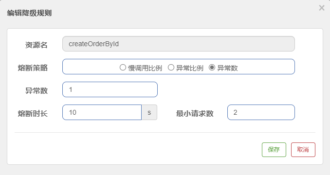

测试结果：使用post请求`http://127.0.0.1:9002/order/1`成功，然后请求`http://127.0.0.1:9002/order/2`两次后都执行了异常处理的方法，此时再次请求`http://127.0.0.1:9002/order/1`，会执行熔断方法，等待10s后，再次请求就会恢复成功响应

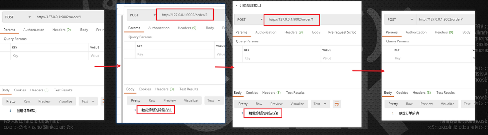

#### 9.1.4. Sentinel 加载本地配置

**一条限流规则主要由下面几个因素组成**：

- `resource`：资源名，即限流规则的作用对象
- `count`：限流阈值
- `grade`：限流阈值类型（QPS 或并发线程数）
- `limitApp`：流控针对的调用来源，若为`default`则不区分调用来源
- `strategy`：调用关系限流策略
- `controlBehavior`：流量控制效果（直接拒绝、Warm Up、匀速排队）

Sentinel可以通过控制台的方式修改相应服务的降级规则等相关参数。

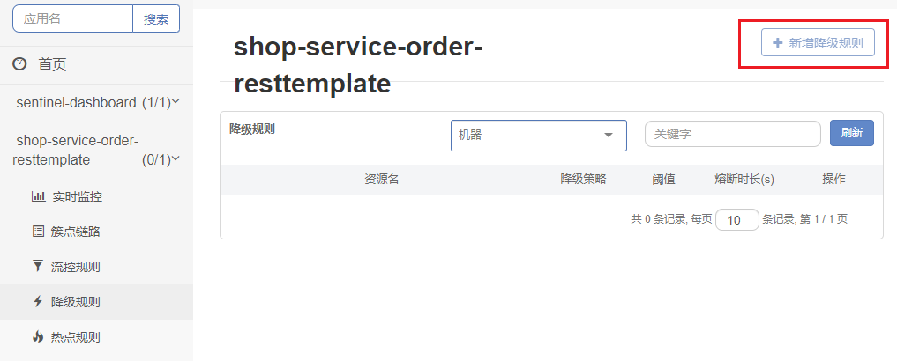

但会存在一定问题，因为通过控制台新增/修改的规则配置，都保存在相应服务的内存中，如果此服务重启后，内存中这些配置都没有了。所以一般都会将相应的Sentinel规则保存在本地文件，然后设置Sentinel加载本地配置。实现本地配置的步骤如下：

1. 修改服务工程的 application.yml 配置文件，增加以下配置

```yml
spring:
  cloud:
    # Sentinel 相关配置
    sentinel:
      # 配置Sentinel读取本地文件配置限流规则
      datasource:
        ds1:
          file:
            file: classpath:flowrule.json
            data-type: json
            rule-type: flow
```

application.properties 配置文件

```properties
# 配置Sentinel读取本地文件配置限流规则
spring.cloud.sentinel.datasource.ds1.file.file=classpath: flowrule.json
spring.cloud.sentinel.datasource.ds1.file.data-type=json
spring.cloud.sentinel.datasource.ds1.file.rule-type=flow
```

2. 在工程的`resources`目录下，创建`flowrule.json`文件，具体配置内容如下：

```json
[
  {
    "resource": "orderFindById",
    "controlBehavior": 0,
    "count": 1,
    "grade": 1,
    "limitApp": "default",
    "strategy": 0
  }
]
```

> *注意：其中`resource`字段是相应需要保存的资源（接口）的名称，即`@SentinelResource`注解中配置的`value`属性值*
>
> 相应的可设置项参考`sentinel-core`包下的`com.alibaba.csp.sentinel.slots.block.RuleConstant`类

3. 启动服务，在Sentinel控制台可以看到相应的配置

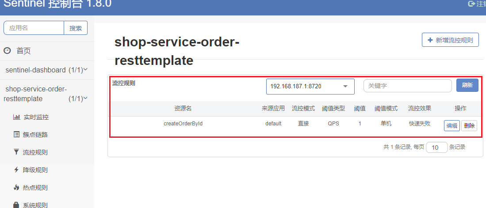

### 9.2. RestTemplate 基于 Sentinel 实现熔断

#### 9.2.1. 基础说明

Spring Cloud Alibaba Sentinel 支持对 `RestTemplate` 的服务调用使用 Sentinel 进行保护，在构造`RestTemplate`对象的时候需要加上 `@SentinelRestTemplate` 注解即可

```java
@Bean
@SentinelRestTemplate(blockHandler = "handleException", blockHandlerClass = ExceptionUtil.class)
public RestTemplate restTemplate() {
    return new RestTemplate();
}
```

`@SentinelRestTemplate`注解的属性支持限流(`blockHandler`，`blockHandlerClass`)和降级(`fallback`，`fallbackClass`)的处理。其中`blockHandler`或`fallback`属性对应的方法必须是对应`blockHandlerClass`或`fallbackClass`属性中的静态方法。

该方法的参数跟返回值跟`org.springframework.http.client.ClientHttpRequestInterceptor#interceptor`方法一致，其中参数多出了一个`BlockException`参数用于获取Sentinel捕获的异常。

比如上述 `@SentinelRestTemplate` 注解中 `ExceptionUtil` 的 `handleException` 属性对应的方法声明如下：

```java
public class ExceptionUtil {
    public static ClientHttpResponse handleException(HttpRequest request, byte[] body, ClientHttpRequestExecution execution, BlockException exception) {
        ...
    }
}
```

#### 9.2.2. 使用示例

1. 修改`shop-service-order-resttemplate`工程的配置类`HttpConfig`，在创建`RestTemplate`对象方法上增加``@SentinelRestTemplate`注解

```java
@LoadBalanced
@Bean("restTemplate")
/*
 * @SentinelRestTemplate注解表示使用Sentinel对象RestTemplate的支持
 *  blockHandler属性：指定熔断时降级方法
 *  blockHandlerClass属性：指定熔断降级配置类
 *  fallback属性：指定异常时降级方法
 *  fallbackClass属性：指定异常限级配置类
 */
@SentinelRestTemplate(blockHandler = "handleBlock", blockHandlerClass = ExceptionUtil.class,
        fallback = "handleFallback", fallbackClass = ExceptionUtil.class)
public RestTemplate createRestTemplate() {
    return new RestTemplate();
}
```

2. 创建处理熔断降级的处理类`ExceptionUtil`，在此类中定义相应的熔断、异常降级方法

```java
package com.moon.order.exception;

import com.alibaba.cloud.sentinel.rest.SentinelClientHttpResponse;
import com.alibaba.csp.sentinel.slots.block.BlockException;
import org.slf4j.Logger;
import org.slf4j.LoggerFactory;
import org.springframework.http.HttpRequest;
import org.springframework.http.client.ClientHttpRequestExecution;

/**
 * Sentinel 对 RestTemplate 支持的熔断降级处理类
 * 其中 blockHandler 或 fallback 属性对应的方法必须是对应 blockHandlerClass 或 fallbackClass 属性中的静态方法。
 * 1. 熔断与异常的处理方法都必须为static修饰的静态方法
 * 2. 方法的返回值必须为SentinelClientHttpResponse对象
 * 3. 方法的形参为 HttpRequest request, byte[] body, ClientHttpRequestExecution execution, BlockException ex
 * <p>
 * 即该方法的参数跟返回值跟 org.springframework.http.client.ClientHttpRequestInterceptor#interceptor 方法一致，
 * 其中参数多出了一个 BlockException 参数用于获取 Sentinel 捕获的异常。
 */
public class ExceptionUtil {
    /* 日志对象 */
    private static final Logger LOGGER = LoggerFactory.getLogger(ExceptionUtil.class);

    // 熔断降级业务逻辑
    public static SentinelClientHttpResponse handleBlock(HttpRequest request, byte[] body,
                                                         ClientHttpRequestExecution execution, BlockException ex) {
        LOGGER.error("熔断降级业务逻辑：${}", ex.getClass().getCanonicalName());
        return new SentinelClientHttpResponse("handleBlock");
    }

    // 异常降级业务逻辑
    public static SentinelClientHttpResponse handleFallback(HttpRequest request, byte[] body,
                                                            ClientHttpRequestExecution execution, BlockException ex) {
        LOGGER.error("异常降级业务逻辑：${}", ex.getClass().getCanonicalName());
        return new SentinelClientHttpResponse("handleFallback");
    }
}
```

3. 在Sentinel控制台中配置相应的接口限流规则。Sentinel RestTemplate 限流的资源规则提供两种粒度：
    - `httpmethod:schema://host:port/path`：协议、主机、端口和路径
    - `httpmethod:schema://host:port`：协议、主机和端口

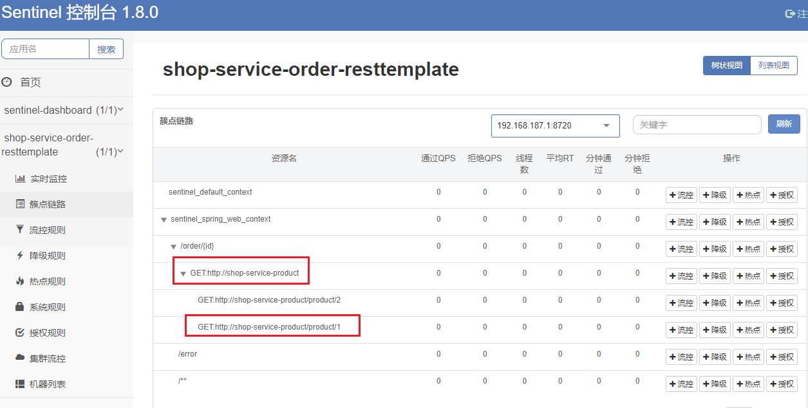

设置相应的“流控”模块，发送测试测试，观察后台日志是否实现熔断降级

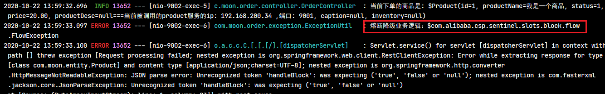

#### 9.2.3. @SentinelRestTemplate 相关属性

|        属性名        |       作用       |    取值    |
| :-----------------: | ---------------- | ---------- |
|   `blockHandler`    | 指定熔断时降级方法 |            |
| `blockHandlerClass` | 指定熔断降级配置类 | `Class<?>` |
|     `fallback`      | 指定异常时降级方法 |            |
|   `fallbackClass`   | 指定异常限级配置类 | `Class<?>` |
|    `urlCleaner`     |                  |            |
|  `urlCleanerClass`  |                  | `Class<?>` |

### 9.3. Feign 基于 Sentinel 实现熔断

#### 9.3.1. 基础说明

Sentinel 适配了`OpenFeign`组件。如果想使用，除了引入 `sentinel-starter` 的依赖外还需要2个步骤：

- 配置文件打开 sentinel 对 feign 的支持：`feign.sentinel.enabled=true`
- 加入 `openfeign starter` 依赖使 `sentinel starter` 中的自动化配置类生效：

> 注：Feign 对应的接口中的资源名策略定义：`httpmethod:protocol://requesturl`。`@FeignClient` 注解中的所有属性，Sentinel 都做了兼容。
>
> 下面示例的`ProductFeginClient`接口中方法 `findById` 对应的资源名为 `GET:http://shop-service-product/product/{str}`

#### 9.3.2. 使用示例

1. 引入依赖`openfeign`与`sentinel`的依赖

```xml
<!-- SpringCloud整合的openFeign -->
<dependency>
    <groupId>org.springframework.cloud</groupId>
    <artifactId>spring-cloud-starter-openfeign</artifactId>
</dependency>
<!-- Spring Cloud Alibaba Sentinel 依赖 -->
<dependency>
    <groupId>com.alibaba.cloud</groupId>
    <artifactId>spring-cloud-starter-alibaba-sentinel</artifactId>
</dependency>
```

2. 在工程的`application.yml`中开启 sentinel 对 feign 的支持

```yml
# 开启 feign 对 sentinel 的支持
feign:
  sentinel:
    enabled: true # 激活sentinel的支持
```

3. 和使用 Hystrix 一样，编写熔断容错处理类。此类需要实现相应的 FeignClient 的接口。当 FeignClient 接口调用出错后，会调用到当前容错实现类中同名的方法

```java
@Component
public class ProductFeignClientCallBack implements ProductFeignClient {
    /* 日志对象 */
    private static final Logger LOGGER = LoggerFactory.getLogger(ProductFeignClientCallBack.class);

    /**
     * 此方法为ProductFeignClient接口中相应方法的降级实现
     *
     * @param id
     * @return
     */
    @Override
    public Product findById(Long id) {
        LOGGER.info("当前下单商品的id是: " + id + "，触发ProductFeignClientCallBack类中熔断的findById降级方法");
        Product product = new Product();
        product.setProductName("feign调用触发熔断降级方法");
        return product;
    }
}
```

4. 和使用 Hystrix 的方式基本一致，配置 FeignClient 的接口，在接口标识`@FeignClient`注解，通过`name`属性指定服务名称以及通过`fallback`属性指定处理熔断降级实现类

```java
@FeignClient(name = "shop-service-product", fallback = ProductFeignClientCallBack.class)
public interface ProductFeignClient {
    ....
}
```

5. 测试，修改资源相应的降级规则，测试的结果与 Hystrix 一样

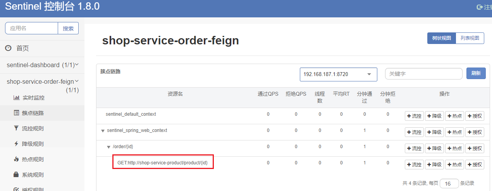

#### 9.3.3. 从容错类中获取具体的错误信息

上面章节的容错方式在出现异常时，不能获取到异常的信息。如果需要获取容错发生时的具体的异常信息。则需要实现 Feign 提供的 `feign.hystrix.FallbackFactory` 接口。具体实现步骤如下：

- 创建容错处理类，实现 `FallbackFactory` 接口。此接口的泛型 `T` 为需要容错的 Feign 接口类型

```java
/**
 * 商品服务 Feign 调用容错处理类。
 * 与直接实现 Feign 接口的方式不同的地点在于，在此接口的 create 方法，可以获取到容错时发生的异常的信息。
 * `FallbackFactory<T>` 的泛型为容错的 Feign 的接口
 */
@Slf4j
@Service
public class ProductFeignClientFallBackFactory implements FallbackFactory<ProductFeignClient> {
    /**
     * Returns an instance of the fallback appropriate for the given cause.
     * 此方法返回相应的 Feign 接口实现类。所以直接创建 Feign 接口的实现类，在重写里面所有方法，
     * 执行的效果与容错类直接实现 Feign 接口一样
     *
     * @param cause 这就是 fegin 在调用过程中产生异常
     */
    @Override
    public ProductFeignClient create(Throwable cause) {
        return new ProductFeignClient() {
            @Override
            public Product findById(Long id) {
                // 此处就可以获取到异常发生的具体信息，做相应的处理和分析
                log.error("ProductFeignClientFallBackFactory 容错获取到的异常信息是：{}", cause);
                // 调用报错时的处理逻辑
                Product product = new Product();
                product.setId(Long.parseLong("-1"));
                product.setProductName("查询产品出错了");
                return product;
            }
        };
    }
}
```

- 修改接口的 `@FeignClient` 注解，通过 `fallbackFactory` 属性指定相应的容错处理类。

```java
@FeignClient(value = "service-product", fallbackFactory = ProductFeignClientFallBackFactory.class)
public interface ProductFeignClient {
    ....
}
```

- 测试效果

<font color=red>**需要注意：`fallback` 和 `fallbackFactory` 只能使用其中一种方式**</font>

### 9.4. 示例项目

#### 9.4.1. spring-cloud-greenwich-sample 项目中的示例

参考`08-springcloud-hystrix-resttemplate`与`09-springcloud-hystrix-feign`工程，创建`10-springcloud-alibaba-sentinel`，删除hystrix组件部分内容，创建两个order服务，一个使用`RestTemplate`一个使用`Feign`

具体项目代码参考`spring-cloud-note\spring-cloud-greenwich-sample\10-springcloud-alibaba-sentinel`

#### 9.4.2. spring-cloud-alibaba-2.1.x-sample 项目中示例

具体项目代码参考`spring-cloud-note\spring-cloud-alibaba-2.1.x-sample\service-order`

## 10. 常用 API 说明

### 10.1. 资源规则工具类 SphU

Sentinel 提供了 `com.alibaba.csp.sentinel.SphU` 基础 Api，用于记录统计数据和执行资源的规则检查。

### 10.2. 业务异常统计 Tracer

业务异常记录类 `com.alibaba.csp.sentinel.Tracer` 用于记录业务异常。相关方法：

```java
public static void trace(Throwable e)
```

- 记录业务异常（非 `BlockException` 异常），对应的资源为当前线程 context 下 entry 对应的资源。

```java
public static void trace(Throwable e, int count)
```

- 记录业务异常（非 `BlockException` 异常），异常数目为传入的 count。(此方法已过时)

```java
public static void traceContext(Throwable e, int count, Context context)
```

- 向传入 entry 对应的资源记录业务异常（非 BlockException 异常），异常数目为传入的 count。(此方法已过时)

如果用户通过 `SphU` 或 `SphO` 手动定义资源，则 Sentinel 不能感知上层业务的异常，需要手动调用 `Tracer.trace(ex)` 来记录业务异常，否则对应的异常不会统计到 Sentinel 异常计数中。注意不要在 try-with-resources 形式的 `SphU.entry(xxx)` 中使用，否则会统计不上。

从 1.3.1 版本开始，注解方式定义资源支持自动统计业务异常，无需手动调用 `Tracer.trace(ex)` 来记录业务异常。Sentinel 1.3.1 以前的版本需要手动记录。

### 10.3. 上下文工具类 ContextUtil

ContextUtil 是用于操作上下文的工具类，相关静态方法：

#### 10.3.1. 标识进入调用链入口（上下文）

```java
public static Context enter(String contextName)
public static Context enter(String contextName, String origin)
```

`enter` 方法标识调用链路入口，用于区分不同的调用链路。方法参数说明如下：

- `contextName` 代表调用链路入口名称（上下文名称）
- `origin` 代表调用来源名称。默认调用来源为空。
- 返回值类型为 `Context`，即生成的调用链路上下文对象。

> Notes: 
>
> - `ContextUtil.enter(xxx)` 方法仅在调用链路入口处生效，即仅在当前线程的初次调用生效，后面再调用不会覆盖当前线程的调用链路，直到 exit。`Context` 存于 ThreadLocal 中，因此切换线程时可能会丢掉，如果需要跨线程使用可以结合 `runOnContext` 方法使用。
> - 流控规则中若选择“流控方式”为“链路”方式，则入口资源名即为上面的 `contextName`。

#### 10.3.2. 退出调用链（清空上下文）

```java
public static void exit()
```

该方法用于退出调用链，清理当前线程的上下文。

#### 10.3.3. 获取当前线程的调用链上下文

```java
public static Context getContext()
```

获取当前线程的调用链路上下文对象。

#### 10.3.4. 在某个调用链上下文中执行代码

```java
public static void runOnContext(Context context, Runnable f)
```

常用于异步调用链路中 context 的变换。
