# Spring Cloud Config （配置中心）

## 1. 配置中心概述

### 1.1. 什么是配置中心

对于传统的单体应用而言，常使用配置文件来管理所有配置，比如SpringBoot的`application.yml`文件，但是在微服务架构中全部手动修改的话很麻烦而且不易维护。微服务的配置管理一般有以下需求：

- 集中配置管理，一个微服务架构中可能有成百上千个微服务，所以集中配置管理是很重要的
- 不同环境不同配置，比如数据源配置在不同环境（开发，生产，测试）中是不同的
- 运行期间可动态调整。例如，可根据各个微服务的负载情况，动态调整数据源连接池大小等
- 配置修改后可自动更新。如配置内容发生变化，微服务可以自动更新配置

综上所述对于微服务架构而言，一套统一的、通用的管理配置机制是不可缺少的总要组成部分。常见的做法就是通过配置服务器进行管理

### 1.2. 常见配置中心

内容详见：[Distributed-Configuration-Center-Overview.md](/分布式微服务/分布式配置中心/Distributed-Configuration-Center-Overview)

## 2. Spring Cloud Config 简介

> [Spring Cloud Config 官方文档](https://docs.spring.io/spring-cloud-config/docs/2.2.5.RELEASE/reference/html/)

Spring Cloud Config 项目是一个解决分布式系统的配置管理方案。它包含了`Client`和`Server`两个部分

- `Server`提供配置文件的存储、以接口的形式将配置文件的内容对外提供
- `Client`通过接口获取数据、并依据此数据初始化自己的应用

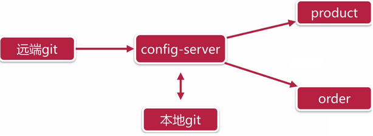

Spring Cloud Config 为分布式系统中的外部配置提供服务器和客户端支持。使用Config Server，可以为所有环境中的应用程序管理其外部属性。它非常适合Spring应用，也可以使用在其他语言的应用上。

随着应用程序通过从开发到测试和生产的部署流程，可以管理这些环境之间的配置，并确定应用程序具有迁移时需要运行的一切。服务器存储后端的默认实现使用git，因此它轻松支持标签版本的配置环境，以及可以访问用于管理内容的各种工具

### 2.1. Spring Cloud Config 服务端特性

- 以HTTP的方式，为外部配置提供基于资源的API（键值对，或者等价的YAML内容）
- 属性值的加密和解密（对称加密和非对称加密）
- 通过使用`@EnableConfigServer`注解，在Spring boot应用中非常简单的嵌入

### 2.2. Spring Cloud Config 客户端特性（特指Spring应用）

- 绑定Config服务端，并使用远程的属性源初始化Spring环境
- 属性值的加密和解密（对称加密和非对称加密）

## 3. Spring Cloud Config 入门案例

### 3.1. 案例准备工作

#### 3.1.1. 基础项目准备

1. 创建聚合项目`16-springcloud-config`
2. 创建`server-eureka`与`service-product`
    - > 参考以前做的Spring Cloud的示例项目《spring-cloud-note\spring-cloud-greenwich-sample\》，复制`eureka`与`product`的工程做为测试示例的工程即可，实体类等公共的资源依赖`shop-service-common`工程

基础项目准备效果如下：

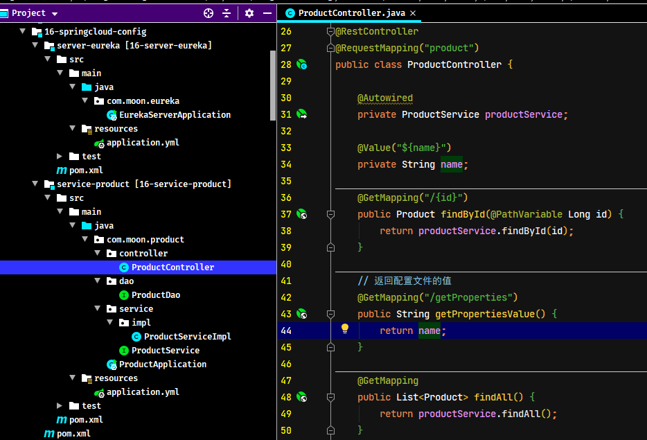

启动eureka服务与product商品服务，测试请求是否正常

#### 3.1.2. 准备远程仓库

Config Server 是一个可横向扩展、集中式的配置服务器，它用于集中管理应用程序各个环境下的配置，默认使用Git存储配置文件内容，也可以使用SVN存储，或者是本地文件存储。此示例使用git作为存储环境（因为国内的原因，案例使用gitee做为远程仓库）

1. 登陆gitee.com，创建一个用于测试的公共仓库`springcloud-config-sample-repo`

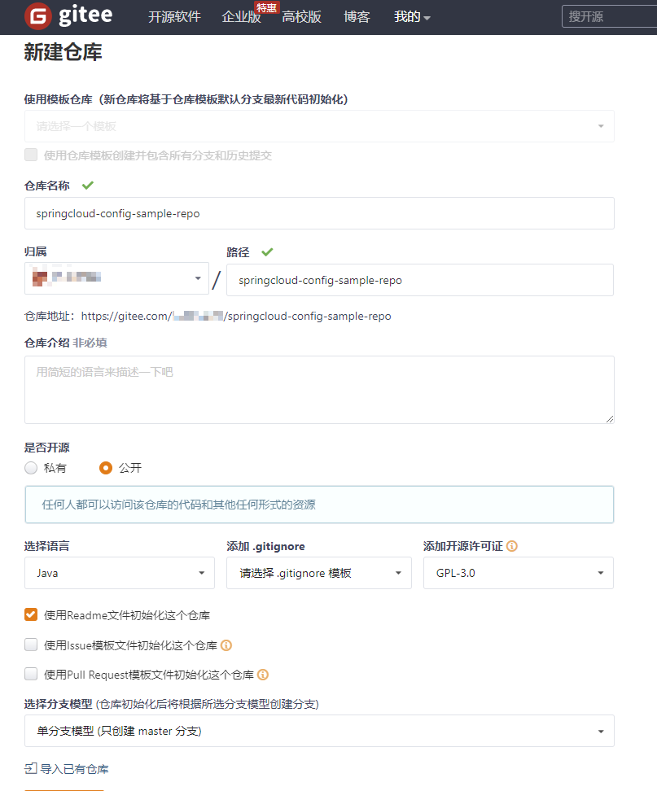

2. 上传配置文件，将product_service工程的`application.yml`改名为`product-dev.yml`后上传

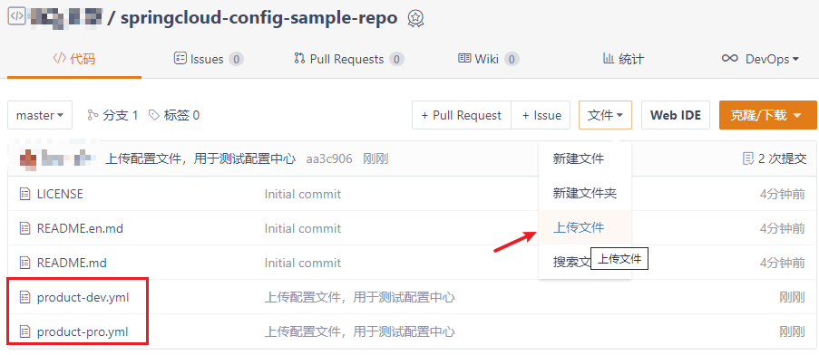

**注意，一般配置文件命名规则如下：**

- `{application}-{profile}.yml`或者`{application}-{profile}.properties`
- 其中`application`为应用名称，`profile`指的开发环境（用于区分开发环境，测试环境、生产环境等）

### 3.2. 搭建 Config 服务端程序

#### 3.2.1. 引入依赖

创建`server-config`工程，并引入Spring Cloud Config的依赖

```xml
<!--
    Spring Cloud Config Server 依赖
    编写示例测试的过程发现 spring-cloud-starter-config 包是不包含 spring-cloud-config-server
-->
<dependency>
    <groupId>org.springframework.cloud</groupId>
    <artifactId>spring-cloud-config-server</artifactId>
</dependency>
```

<font color=red>**编写测试示例的时候遇到的问题**</font>：

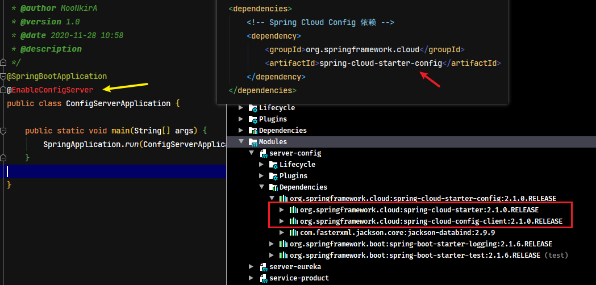

如果只引入`spring-cloud-starter-config`的依赖，是没有`spring-cloud-config-server`的依赖，但官网文档中的快速入门示例也是只依赖`spring-cloud-starter-config`包即可，但本地测试时却不行？这个问题待日后研究，目前的解决方法是直接引入`spring-cloud-config-server`的依赖

#### 3.2.2. 配置启动类

```java
@SpringBootApplication
@EnableConfigServer // 开启注册中心服务端功能
public class ConfigServerApplication {
    public static void main(String[] args) {
        SpringApplication.run(ConfigServerApplication.class, args);
    }
}
```

`@EnableConfigServer`注解表示开启注册中心服务端功能

#### 3.2.3. 配置 application.yml

```yml
server:
  port: 10000 # 服务端口
spring:
  application:
    name: server-config # 指定服务名
  cloud:
    config: # config 相关配置
      server:
        git:
          uri: https://gitee.com/xxxx/springcloud-config-sample-repo.git # 指定包含YAML或properties文件git仓库的地址
```

配置项说明：

- `spring.cloud.config.server.git.uri`：配置git服务地址
- `spring.cloud.config.server.git.username`：配置git用户名
- `spring.cloud.config.server.git.password`：配置git密码

> 在Windows系统上，如果文件URL是带驱动器前缀的绝对路径，则在文件URL中需要一个额外的“`/`”（例如：`file:///${user.home}/config-repo`）

#### 3.2.4. 测试

启动此微服务，可以在浏览器上通过server端访问到git服务器上的文件。示例访问的地址：`http://127.0.0.1:10000/product-pro.yml`

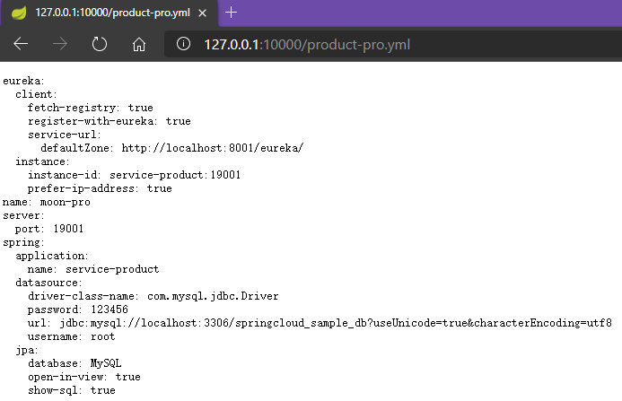

### 3.3. 修改客户端程序

#### 3.3.1. 引入依赖

修改`service-product`工程，引入`spring-cloud-starter-config`的依赖

```xml
<!-- Spring Cloud Config 依赖 -->
<dependency>
    <groupId>org.springframework.cloud</groupId>
    <artifactId>spring-cloud-starter-config</artifactId>
</dependency>
```

#### 3.3.2. 创建高级别 bootstrap.yml 配置文件

因为商品服务会从`server-config`中获取相应的配置文件，所以此时可以删除原来的`application.yml`文件

此时使用加载级别更高的 `bootstrap.yml` 文件进行相关获取配置信息的配置。启动应用时会检查此配置文件，在此文件中指定配置中心的服务地址，从而会自动的拉取所有应用配置并启用

```yml
spring:
  cloud:
    config:
      name: product # 应用名称，需要对应git中配置文件名称的前半部分
      profile: dev # 相应环境的配置名称（后缀）。如此示例读取 product-dev.yml
      label: master # 配置中心git服务的分支名称
      uri: http://127.0.0.1:10000/ # server-config服务的请求地址
```

配置项说明：

- `spring.cloud.config.name`：配置读取配置中心的相应文件名称的前缀部分，如：`{application}-{profile}.yml`，此时配置为`{application}`
- `spring.cloud.config.profile`：配置读取的文件相应的环境名称（后缀部分），如：`{application}-{profile}.yml`，此时配置为`{profile}`
- `spring.cloud.config.label`：配置中心git仓库的分支名称
- `spring.cloud.config.uri`：配置中心请求地址

#### 3.3.3. 测试

启动商品服务，请求可以获取到相应环境（dev）的配置文件里设置值。

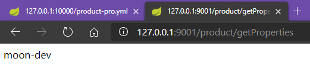

修改配置文件中的`profile`属性为`pro`，重启服务，此时发现商品服务的端口号与返回的值都变成生产的配置

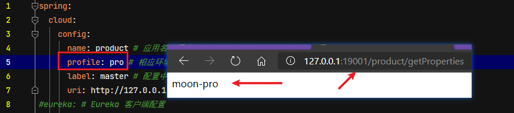

### 3.4. 手动刷新配置

以上示例已经可以在客户端取到了配置中心的值，但当有时在修改Git库上面配置的值时，服务端（Config Server）能实时获取最新的值，但客户端（Config Client）读的是缓存，是无法实时获取最新值。

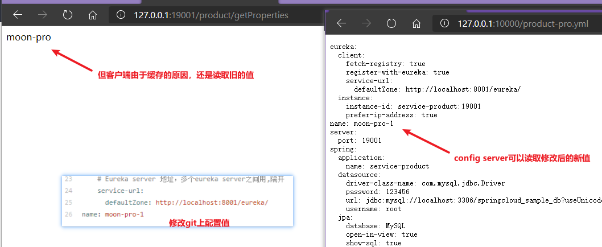

对于此问题，Spring Cloud 已提供相应的解决方案，就是客户端（Config Client）使用post请求去触发refresh数据，从而获取最新数据，需要依赖spring-boot-starter-actuator

#### 3.4.1. 引入依赖

要实现手动刷新配置，需要配置Config Client(商品服务)引入`spring-boot-starter-actuator`依赖

```xml
<!-- spring boot actuator 监控管理组件 -->
<dependency>
    <groupId>org.springframework.boot</groupId>
    <artifactId>spring-boot-starter-actuator</artifactId>
</dependency>
```

#### 3.4.2. 标识动态刷新

在需要刷新数据的类上加上`@RefreshScope`注解，代表此类需要动态刷新。修改商品服务`ProductController`加上注解

```java
@RestController
@RequestMapping("product")
@RefreshScope // 标记当前类需要开启动态刷新
public class ProductController {
    ....
    @Value("${name}")
    private String name;
    ....
}
```

#### 3.4.3. 配置开启动态刷新

修改商品服务的`bootstrap.yml`配置文件，开启动态刷新触发请求端点（POST请求）

```yml
spring:
  cloud:
    config:
      name: product # 应用名称，需要对应git中配置文件名称的前半部分，如此示例读取 product-*.yml
      profile: pro # 相应环境的配置名称（后缀）。如此示例读取 product-dev.yml
      label: master # 配置中心git服务的分支名称
      uri: http://127.0.0.1:10000/ # server-config服务的请求地址
# 配置开启动态刷新的请求路径端点
management:
  endpoints:
    web:
      exposure:
        include: refresh # 配置开放的请求刷新的url路径
```

#### 3.4.4. 测试

使用Postman工具发起POST请求：`http://localhost:19001/actuator/refresh`，此时商品再次请求查看数据已经可以获取到最新的数据

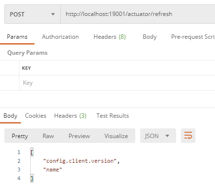


## 4. 配置中心的高可用

在此前的示例中，客户端都是直接调用配置中心的Server端来获取配置文件信息。此时就存在了一个问题，Config Client(客户端)和Config Server(服务端)的耦合性太高，如果Config Server要做集群，那么Config Client只能通过原始的方式来配置路由，当Config Server改变IP地址的时候，Config Client也相应需要修改配置，这就不符合SpringCloud服务治理的理念。

SpringCloud 提供了相应的解决方案，只需要将Config Server端当做一个服务注册到eureka中，Config Client端再从eureka中去获取配置中心Config Server端的服务地址即可

### 4.1. Config Server（服务端）改造

#### 4.1.1. 引入eureka依赖

修改`server-config`工程，引入eureka客户端依赖

```xml
<dependency>
    <groupId>org.springframework.cloud</groupId>
    <artifactId>spring-cloud-starter-netflix-eureka-client</artifactId>
</dependency>
```

#### 4.1.2. 配置服务注册

修改`server-config`工程的`application.yml`配置文件，增加注册中心信息部分的配置，并将端口修改为动态参数的形式（*用于后面模拟多个config服务*）

```yml
server:
  port: ${PROT:10000} # 服务端口
spring:
  application:
    name: server-config # 指定服务名
  cloud:
    config: # config 相关配置
      server:
        git:
          uri: https://gitee.com/xxx/springcloud-config-sample-repo.git # 指定配置文件所在服务的地址（可以是本地存储）
eureka: # Eureka 客户端配置
  instance:
    prefer-ip-address: true
    instance-id: ${spring.cloud.client.ip-address}:${server.port}
  client:
    service-url:
      defaultZone: http://localhost:8001/eureka/
```

修改配置后，先启动eureka注册中心，在启动两个Config Server端，在浏览器中访问：`http://localhost:8001/` 就会看到两个Config Server端已注册到注册中心了。

### 4.2. Config Client（客户端）改造

#### 4.2.1. 引入eureka依赖

与`server-config`工程一样，引入eureka客户端依赖即可

#### 4.2.2. 配置服务获取

修改Config Client客户端（`service-product`）获取从注册中获取Config Server的服务地址

<font color=red>**需要注意的是，原来Config Client工程是直接配置了Config Server的请求地址，上面的示例是先从Config Server中读取到相应的配置文件，从而获取到eureka注册中心的地址。但此时因为需要从注册中心获取Config Server的地址，所以配置中必须配置eureka相关信息，不能像之前示例，将eureka配置部分放到config配置中心的文件中。**</font>

```yml
spring:
  cloud:
    config:
      name: product # 应用名称，需要对应git中配置文件名称的前半部分，如此示例读取 product-*.yml
      profile: pro # 相应环境的配置名称（后缀）。如此示例读取 product-dev.yml
      label: master # 配置中心git服务的分支名称
      discovery: # 配置通过注册中心获取 server-config 配置中心服务
        enabled: true # 配置是否开启服务发现，默认值是true
        service-id: server-config # 配置中心服务的id
eureka: # Eureka 客户端配置
  instance:
    prefer-ip-address: true
    instance-id: ${spring.cloud.client.ip-address}:${server.port}
  client:
    service-url:
      defaultZone: http://localhost:8001/eureka/
```

### 4.3. 测试高可用

启动两个`server-config`服务，端口号分别是`10000`和`10001`，此时在eureka注册中心控制台可以看到两个Config Server成功注册。

分别访问：`http://localhost:10000/product-pro.yml`、`http://localhost:10001/product-pro.yml` 均可返回配置信息，此时说明配置中心服务实现了高可用

## 5. 消息总线bus（番外）

在微服务架构中，通常会使用轻量级的消息代理来构建一个共用的消息主题来连接各个微服务实例，它广播的消息会被所有在注册中心的微服务实例监听和消费，也称消息总线。

Spring Cloud 中对应的解决方案是 Spring Cloud Bus，此组件的作用是将分布式的节点用轻量的消息代理连接起来，可以很容易搭建消息总线，配合 Spring Cloud Config 实现微服务应用配置信息的动态更新。

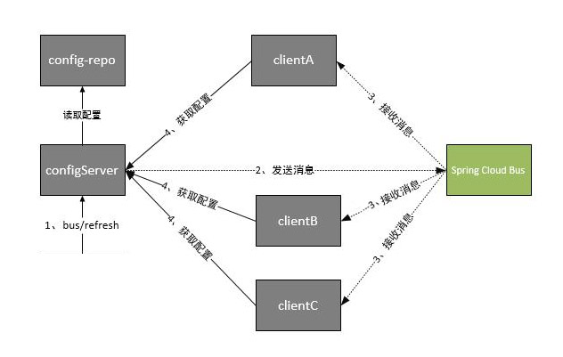

根据此图我们可以看出利用Spring Cloud Bus做配置更新的步骤:

- 提交代码触发post请求给bus/refresh
- Config Server端接收到请求并发送给Spring Cloud Bus
- Spring Cloud bus接到消息并通知给其它Config Client客户端
- 其它客户端接收到通知，请求Config Server端获取最新配置
- 全部客户端均获取到最新的配置

> TODO: 日后使用时再整理详细的专题笔记

## 6. 消息总线整合配置中心

### 6.1. 引入依赖

在`server-config`与`service-product`工程中引入actuator 监控管理组件、bus消息总线组件、rabbitmq等依赖

```xml
<!-- spring boot actuator 监控管理组件 -->
<dependency>
    <groupId>org.springframework.boot</groupId>
    <artifactId>spring-boot-starter-actuator</artifactId>
</dependency>
<!--消息总线的依赖-->
<dependency>
    <groupId>org.springframework.cloud</groupId>
    <artifactId>spring-cloud-bus</artifactId>
</dependency>
<!-- Spring Cloud Stream 支持 RabbitMQ 的依赖 -->
<dependency>
    <groupId>org.springframework.cloud</groupId>
    <artifactId>spring-cloud-stream-binder-rabbit</artifactId>
</dependency>
```

### 6.2. Config Server 服务端配置

修改`server-config`的application.yml配置文件，增加RabbitMQ、动态刷新端点的配置

```yml
server:
  port: 10000 # 服务端口
spring:
  application:
    name: server-config # 指定服务名
  cloud:
    config: # config 相关配置
      server:
        git:
          uri: https://gitee.com/xxxx/springcloud-config-sample-repo.git # 指定配置文件所在服务的地址（可以是本地存储）
  rabbitmq: # RabbitMQ相关配置
    host: 192.168.12.132
    port: 5672
    username: guest
    password: guest
management: # 配置开启动态刷新的请求路径端点
  endpoints:
    web:
      exposure:
        include: bus-refresh # 配置开放的请求刷新的url路径
eureka: # Eureka 客户端配置
  instance:
    prefer-ip-address: true
    instance-id: ${spring.cloud.client.ip-address}:${server.port}
  client:
    service-url:
      defaultZone: http://localhost:8001/eureka/
```

### 6.3. Config Client 客户端配置

修改`service-product`服务的`bootstrap.yml`配置文件，删除开启动态刷新端点的配置部分，因为此部分在配置中心服务中配置了。

```yml
spring:
  cloud:
    config:
      name: product # 应用名称，需要对应git中配置文件名称的前半部分，如此示例读取 product-*.yml
      profile: pro # 相应环境的配置名称（后缀）。如此示例读取 product-dev.yml
      label: master # 配置中心git服务的分支名称
      discovery: # 配置通过注册中心获取 server-config 配置中心服务
        enabled: true # 配置是否开启服务发现，默认值是true
        service-id: server-config # 配置中心服务的id
eureka: # Eureka 客户端配置
  instance:
    prefer-ip-address: true
    instance-id: ${spring.cloud.client.ip-address}:${server.port}
  client:
    service-url:
      defaultZone: http://localhost:8001/eureka/
```

由于Config Client客户端需要通过接收消息才会进行配置刷新，所以在码云对应的配置文件中添加rabbitmq的配置信息

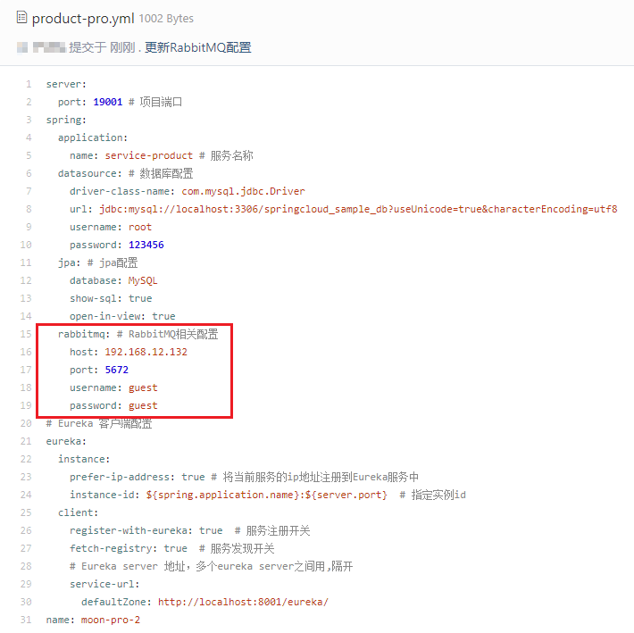

### 6.4. 测试

重新启动对应的`server-eureka`，`server-config`，`service-product`。配置信息刷新后，只需要向配置中心发送对应的POST请求`http://localhost:10001/actuator/bus-refresh`，即可通过bus消息总线组件，发送给rabbitmq消息，然后每个Config Client客户端接收消息后，进行刷新配置

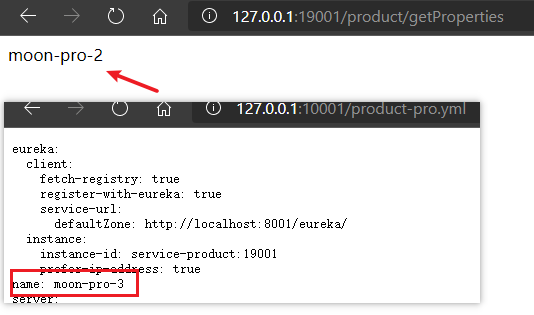

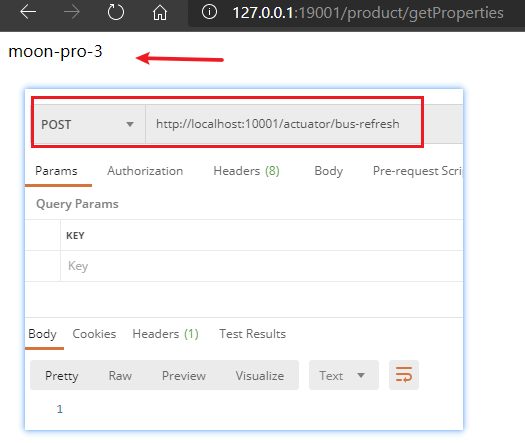

