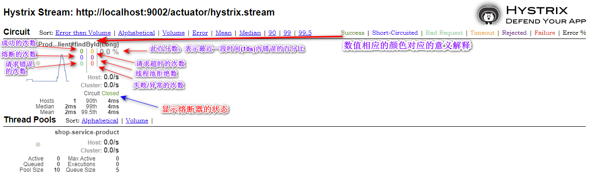

## 1. 微服务容错处理的引入

### 1.1. 微服务架构高并发导致系统负载过高存在的问题分析

在微服务架构中，会将业务拆分成一个个的服务，服务与服务之间可以相互调用，由于网络原因或者自身的原因，服务并不能保证服务的100%可用，如果单个服务出现问题，调用这个服务就会出现网络延迟，此时若有大量的网络涌入，会形成任务累计，导致服务瘫痪。

在 Spring Boot 程序中，默认使用内置 tomcat 作为 web 服务器。单 tomcat 支持最大的并发请求是有限的，如果某一接口阻塞，待执行的任务积压越来越多，那么势必会影响其他接口的调用

### 1.2. 搭建模拟高并发并请求响应过慢的示例

> 复用前面 `microservice-no-springcloud` 项目代码，模拟高并发请求的案例

### 1.3. 模拟服务接口响应慢

1. 修改`shop-service-product`服务的`ProductController`控制类的`findById`方法，令线程睡眠2秒，模拟响应慢

```java
@GetMapping("/{id}")
public Product findById(@PathVariable Long id) {
    // 睡眠2秒，模拟请求响应慢
    try {
        Thread.sleep(2000L);
    } catch (InterruptedException e) {
        e.printStackTrace();
    }
    return productService.findById(id);
}
```

2. 修改`shop-service-order`服务的`application.yml`配置，调小tomcat容器最大连接数，模拟并发请求数量超出web容器可承受最大连接数

```yml
server:
  port: 9002 # 项目端口
  tomcat:
    max-threads: 10 # 修改web容器最大连接数
```

3. 修改`shop-service-order`服务的`OrderController`控制类，增加一个普通的请求方法，用于测试其他请求接口阻塞时，此请求的响应时间

```java
@GetMapping(value = "/{id}")
public String findOrder(@PathVariable Long id) {
    System.out.println(Thread.currentThread().getName());
    return "根据id查询订单";
}
```

4. 启动product与order服务，使用jMeter压力测试工具，创建一个每秒50并发的POST请求一直请求创建订单的接口，然后在浏览器中访问`http://localhost:9002/order/1`查询订单接口，观察此接口响应时间

单独请求的响应时间


开启并发请求创建订单接口后，再次访问此查询接口的响应时间


## 2. 基于线程池的形式实现服务隔离

> 改造`spring-cloud-sample-concurrency-isolation`工程，实现线程池的隔离

### 2.1. 引入依赖

为了方便实现线以线程池的形式完成资源隔离，需要在`shop-service-order`工程中引入如下依赖

```xml
<!-- hystrix 组件的依赖，此示例用于实现基于线程池的形式完成服务的隔离 -->
<dependency>
    <groupId>com.netflix.hystrix</groupId>
    <artifactId>hystrix-metrics-event-stream</artifactId>
    <version>1.5.12</version>
</dependency>
<dependency>
    <groupId>com.netflix.hystrix</groupId>
    <artifactId>hystrix-javanica</artifactId>
    <version>1.5.12</version>
</dependency>
```

### 2.2. 分配线程池

配置`HystrixCommand`接口的实现类，在实现类中可以对线程池资源进行分配

```java
package com.moon.order.command;

import com.moon.entity.Product;
import com.netflix.hystrix.HystrixCommand;
import com.netflix.hystrix.HystrixCommandGroupKey;
import com.netflix.hystrix.HystrixCommandKey;
import com.netflix.hystrix.HystrixCommandProperties;
import com.netflix.hystrix.HystrixThreadPoolKey;
import com.netflix.hystrix.HystrixThreadPoolProperties;
import org.springframework.web.client.RestTemplate;

/**
 * HystrixCommand的原生实现方式，对服务进行服务降级限流
 */
public class OrderCommand extends HystrixCommand<Product> {

    private RestTemplate restTemplate;

    private Long id;

    public OrderCommand(RestTemplate restTemplate, Long id) {
        super(setter());
        this.restTemplate = restTemplate;
        this.id = id;
    }

    private static Setter setter() {

        // 服务分组
        HystrixCommandGroupKey groupKey = HystrixCommandGroupKey.Factory.asKey("order_product");
        // 服务标识
        HystrixCommandKey commandKey = HystrixCommandKey.Factory.asKey("product");
        // 线程池名称
        HystrixThreadPoolKey threadPoolKey = HystrixThreadPoolKey.Factory.asKey("order_product_pool");
        /*
         * 线程池配置
         *     withCoreSize : 线程池大小为10
         *     withKeepAliveTimeMinutes : 线程存活时间15秒
         *     withQueueSizeRejectionThreshold : 队列等待的阈值为100,超过100执行拒绝策略
         */
        // 注：测试案例设置了tomcat最大线程数为10，所以这里设置线程池大小为5，实现此接口的线程数量控制。
        HystrixThreadPoolProperties.Setter threadPoolProperties = HystrixThreadPoolProperties.Setter().withCoreSize(5)
                .withKeepAliveTimeMinutes(15).withQueueSizeRejectionThreshold(100);

        // 命令属性配置Hystrix 开启超时
        HystrixCommandProperties.Setter commandProperties = HystrixCommandProperties.Setter()
                // 采用线程池方式实现服务隔离
                .withExecutionIsolationStrategy(HystrixCommandProperties.ExecutionIsolationStrategy.THREAD)
                // 禁止
                .withExecutionTimeoutEnabled(false);
        return HystrixCommand.Setter.withGroupKey(groupKey).andCommandKey(commandKey).andThreadPoolKey(threadPoolKey)
                .andThreadPoolPropertiesDefaults(threadPoolProperties).andCommandPropertiesDefaults(commandProperties);

    }

    @Override
    protected Product run() throws Exception {
        return restTemplate.getForObject("http://127.0.0.1:9001/product/" + id, Product.class);
    }

    /**
     * 服务降级方法
     *
     * @return
     */
    @Override
    protected Product getFallback() {
        Product product = new Product();
        product.setProductName("服务降级方法返回的数据");
        return product;
    }
}
```

### 2.3. 服务调用的改造

修改`OrderController`，使用自定义的`OrderCommand`完成调用

```java
@PostMapping("/{id}")
public String createOrder(@PathVariable Long id) {
    // 使用OrderCommand调用远程服务
    OrderCommand orderCommand = new OrderCommand(restTemplate, id);
    Product product = orderCommand.execute();
    LOGGER.info("当前下单的商品是: ${}", product);
    return "创建订单成功";
}
```

### 2.4. 测试

按上面案例测试方式，启动product与order服务，使用jMeter压力测试工具，创建一个每秒50并发的POST请求一直请求创建订单的接口，然后在浏览器中访问`http://localhost:9002/order/1`查询订单接口，观察此接口响应时间。因为控制了请求product服务的线程数量，所以此请求响应不会被影响


## 3. Hystrix 介绍

Hystrix 是由 Netflix 开源的一个延迟和容错库，用于隔离访问远程系统、服务或者第三方库，防止级联失败，从而提升系统的可用性与容错性。Hystrix 主要通过以下几点实现延迟和容错。

- **包裹请求**：使用 HystrixCommand 包裹对依赖的调用逻辑，每个命令在独立线程中执行。这使用了设计模式中的“命令模式”。
- **跳闸机制**：当某服务的错误率超过一定的阈值时，Hystrix 可以自动或手动跳闸，停止请求该服务一段时间。
- **资源隔离**：Hystrix 为每个依赖都维护了一个小型的线程池（或者信号量）。如果该线程池已满，发往该依赖的请求就被立即拒绝，而不是排队等待，从而加速失败判定。
- **监控**：Hystrix 可以近乎实时地监控运行指标和配置的变化，例如成功、失败、超时、以及被拒绝的请求等。
- **回退机制**：当请求失败、超时、被拒绝，或当断路器打开时，执行回退逻辑。回退逻辑由开发人员自行提供，例如返回一个缺省值。
- **自我修复**：断路器打开一段时间后，会自动进入“半开”状态。

## 4. Hystrix 对 RestTemplate 实现服务的熔断

### 4.1. 示例项目搭建

复用`spring-cloud-sample-ribbon`工程的代码，创建新的工程`spring-cloud-sample-hystrix-resttemplate`。整理删除一些无用的依赖与代码

### 4.2. 配置 hystrix 依赖

在 `shop-service-order` 模块中添加 Hystrix 的相关依赖

```xml
<!--引入hystrix依赖-->
<dependency>
    <groupId>org.springframework.cloud</groupId>
    <artifactId>spring-cloud-starter-netflix-hystrix</artifactId>
</dependency>
```

### 4.3. 开启熔断支持

在`shop-service-order`工程中，在`OrderApplication`启动类中添加`@EnableCircuitBreaker`注解，代表开启对熔断的支持

```java
@SpringBootApplication(scanBasePackages = "com.moon.order")
@EntityScan("com.moon.entity") // 指定扫描实体类的包路径
@EnableCircuitBreaker // 开启hystrix熔断支持
public class OrderApplication {
    public static void main(String[] args) {
        SpringApplication.run(OrderApplication.class, args);
    }
}
```

注：随着功能的增多，微服务的启动类中的注解也越来越多。所以<font color=red>**SpringCloud提供了一个组合注解注解：`@SpringCloudApplication`。此注解相关于`@SpringBootApplication` + `@EnableDiscoveryClient` + `@EnableCircuitBreaker`**</font>，注解源码如下：

```java
@Target(ElementType.TYPE)
@Retention(RetentionPolicy.RUNTIME)
@Documented
@Inherited
@SpringBootApplication
@EnableDiscoveryClient
@EnableCircuitBreaker
public @interface SpringCloudApplication {
}
```

对工程的启动类进行以下的改造，其效果以上面配置一致

```java
@EntityScan("com.moon.entity") // 指定扫描实体类的包路径
@SpringCloudApplication // 此组合注解相当于 @SpringBootApplication + @EnableDiscoveryClient + @EnableCircuitBreaker
public class OrderApplication {
}
```

### 4.4. 配置熔断降级业务逻辑

改造`shop-service-order`工程的`OrderController`控制类，增加熔断部分的逻辑

#### 4.4.1. 开启熔断与配置单个降级方法

1. 编写一个服务降级（回退）方法`orderFallBack`方法。有以下注意点
    - 此降级方法要与相应的熔断方法具有相同的参数列表
    - 此降级方法要与相应的熔断方法具有相同的返回值类型
2. 需要熔断的方法上，标识注解`@HystrixCommand`，代表此方法需要熔断，然后在注解的`fallbackMethod`属性，指定熔断触发的降级方法名称

```java
@RestController
@RequestMapping("order")
public class OrderController {
    /* 日志对象 */
    private static final Logger LOGGER = LoggerFactory.getLogger(OrderController.class);

    // 注入HTTP请求工具类RestTemplate
    @Autowired
    private RestTemplate restTemplate;

    /*
     * 标识 @HystrixCommand 注解代表此方法配置熔断保护
     *      fallbackMethod属性：指定熔断之后的降级方法
     */
    @HystrixCommand(fallbackMethod = "orderFallBack")
    @PostMapping("/{id}")
    public String createOrder(@PathVariable Long id) {
        // 调用服务
        Product product = restTemplate.getForObject("http://shop-service-product/product/" + id, Product.class);
        LOGGER.info("当前下单的商品是: ${}", product);
        return "创建订单成功";
    }

    /*
     * 降级方法
     *  和需要收到保护的方法的返回值一致
     *  方法参数一致
     */
    public String orderFallBack(Long id) {
        LOGGER.info("当前下单商品的id是: " + id + "，触发createOrder熔断的降级方法");
        return "当前下单商品的id是: " + id + "，触发createOrder熔断的降级方法";
    }
}
```

3. 测试，当`shop-service-product`微服务正常时，浏览器访问`http://127.0.0.1:9002/order/1`可以正常调用服务提供者获取数据。当将商品微服务停止时继续访问，


#### 4.4.2. 开启熔断与配置统一降级方法

如果当前类中每个方法的降级方法逻辑都一样，可以在当前类上标识`@DefaultProperties`注解，并在`defaultFallback`属性中指定公共的降级方法名称。

注：如果过在`@DefaultProperties`指定了公共的降级方法，则相应配置`@HystrixCommand`熔断保护的方法不需要单独指定了降级方法

```java
@RestController
@RequestMapping("order")
/*
 * @DefaultProperties注解用于指定此接口中公共的熔断设置，
 *  defaultFallback属性：用于公共的降级方法名称
 *  如果过在@DefaultProperties指定了公共的降级方法，在相应的熔断保护@HystrixCommand中不需要单独指定降级方法
 */
@DefaultProperties(defaultFallback = "defaultFallBack")
public class OrderController {
    /* 日志对象 */
    private static final Logger LOGGER = LoggerFactory.getLogger(OrderController.class);

    // 注入HTTP请求工具类RestTemplate
    @Autowired
    private RestTemplate restTemplate;

    /*
     * 标识 @HystrixCommand 注解代表此方法配置熔断保护
     *      fallbackMethod属性：指定熔断之后的降级方法
     */
    @HystrixCommand // 使用统一降级方法，则不需要再指定fallbackMethod属性
    @PostMapping("/{id}")
    public String createOrder(@PathVariable Long id) {
        // 调用服务
        Product product = restTemplate.getForObject("http://shop-service-product/product/" + id, Product.class);
        LOGGER.info("当前下单的商品是: ${}", product);
        return "创建订单成功";
    }

    /*
     * 公共的降级方法
     *  注意: 1.此方法不能有形参
     *       2.如果使用统一的降级方法，则最好统一所有需要熔断保护的方法的返回类型
     */
    public String defaultFallBack() {
        LOGGER.info("触发熔断公共降级方法");
        return "触发熔断公共降级方法";
    }
}
```


### 4.5. 超时设置

使用Hystrix组件，请求在超过规定的时间没有获取到微服务的数据，此时会自动触发熔断降级方法，默认值是1000（1秒）。可以在`application.yml`项目配置文件中，修改`timeoutInMilliseconds`属性来设置地超时处理时长

```yml
# hystrix 配置
hystrix:
  command:
    default:
      execution:
        isolation:
          thread:
            timeoutInMilliseconds: 3000 # 配置连接超时时长，默认的连接超时时间1秒，即若1秒没有返回数据，自动的触发降级逻辑
```

## 5. Hystrix 对 Feign 实现服务的熔断

SpringCloud Fegin 默认已整合了 hystrix，所以添加Feign依赖后就不用在添加hystrix依赖

### 5.1. 示例项目搭建

复用`06-springcloud-feign`工程的代码，创建新的工程`09-springcloud-hystrix-feign`。整理删除一些无用的依赖与代码

### 5.2. 开启 hystrix

在 Feign 中已经内置了 hystrix，但是默认是关闭的。修改项目的 application.yml 配置文件开启对 hystrix 的支持

```yml
feign:
  hystrix:
    enabled: true # 开启对hystrix的支持，默认值是false（关闭）
```

### 5.3. 配置 FeignClient 接口的实现类

基于Feign实现熔断降级，需要创建`FeignClient`接口的实现类，在实现类中定义降级方法

```java
/**
 * ProductFeignClient接口实现，此类中实现的方法为相应的降级方法
 */
// Hystrix组件会在spring容器中查找FeignClient相应的实现类，调用其降级方法，所在需要标识注解注册到spring容器中
@Component
public class ProductFeignClientCallBack implements ProductFeignClient {
    /* 日志对象 */
    private static final Logger LOGGER = LoggerFactory.getLogger(ProductFeignClientCallBack.class);

    /**
     * 此方法为ProductFeignClient接口中相应方法的降级实现
     */
    @Override
    public Product findById(Long id) {
        LOGGER.info("当前下单商品的id是: " + id + "，触发ProductFeignClientCallBack类中熔断的findById降级方法");
        Product product = new Product();
        product.setProductName("feign调用触发熔断降级方法");
        return product;
    }
}
```

### 5.4. FeignClient 接口指定 hystrix 熔断方法

在接口上的`@FeignClient`注解，添加`fallback`属性，声明降级方法（接口的实现类）

```java
/*
 * @FeignClient 注解，用于标识当前接口为Feign调用微服务的核心接口
 *  value/name属性：指定需要调用的服务提供者的名称
 *  fallback属性：配置熔断时降级方法（实现类）
 */
@FeignClient(name = "shop-service-product", fallback = ProductFeignClientCallBack.class)
public interface ProductFeignClient {
    @GetMapping("/product/{id}")
    Product findById(@PathVariable("id") Long id);
}
```

## 6. Hystrix 的监控平台

### 6.1. Hystrix 的设置实时监控

**注意细节**：当请求失败，被拒绝，超时的时候，都会进入到降级方法中。但进入降级方法并不意味着断路器已经被打开。

除了实现容错功能，Hystrix 还提供了近乎实时的监控，`HystrixCommand` 和 `HystrixObservableCommand` 在执行时，会生成执行结果和运行指标。比如每秒的请求数量，成功数量等。

这些状态会暴露在 `Actuator` 提供的 `/health` 端点中。只需为项目添加 `spring-boot-actuator` 依赖，重启项目，访问 `http://localhost:9002/actuator/hystrix.stream`，即可看到实时的监控数据。

#### 6.1.1. 引入依赖

在 `09-springcloud-hystrix-feign` 示例中，修改 `shop-service-order` 工程 maven 依赖

```xml
<!-- 引入hystrix的监控信息 -->
<dependency>
    <groupId>org.springframework.boot</groupId>
    <artifactId>spring-boot-starter-actuator</artifactId>
</dependency>
<!-- hystrix 核心依赖 -->
<dependency>
    <groupId>org.springframework.cloud</groupId>
    <artifactId>spring-cloud-starter-netflix-hystrix</artifactId>
</dependency>
```

#### 6.1.2. 配置开启 Hystrix 支持

在 `shop-service-order` 工程启动类中，标识 `@EnableCircuitBreaker` 开启 Hystrix 支持

```javas
@SpringBootApplication(scanBasePackages = "com.moon.order")
@EntityScan("com.moon.entity") // 指定扫描实体类的包路径
@EnableFeignClients // 开启Feign的支持
@EnableCircuitBreaker // 开启Hystrix支持
public class OrderApplication {
    // ....省略
}
```

> **注：想开启Hystrix实现监控的功能，必须标识`@EnableCircuitBreaker`注解**

#### 6.1.3. 设置暴露所有监控接口

默认Hystrix只暴露Actuator部分接口，访问`http://localhost:9001/actuator`可以查询到默认暴露的接口


配置暴露所有Actuator监控端点，需要修改项目的`application.yml`文件，添加以下配置

```yml
# 配置暴露所有Actuator监控端点
management:
  endpoints:
    web:
      exposure:
        include: '*'
```

#### 6.1.4. 访问实时监控页面

启动项目，访问`http://localhost:9002/actuator/hystrix.stream`，可以看到实时的监控数据。

### 6.2. Hystrix DashBoard 监控平台

Hystrix 的实时监控，访问`/hystrix.stream`接口获取的都是已文字形式展示的信息。但通过文字的方式很难直观的展示系统的运行状态，所以Hystrix官方还提供了基于图形化的DashBoard（仪表板）监控平台。Hystrix仪表板可以显示每个断路器（被`@HystrixCommand`注解的方法）的状态。

#### 6.2.1. 引入依赖

搭建Hystrix DashBoard监控，配置工程的maven引入相关依赖

```xml
<!-- 引入hystrix的监控信息 -->
<dependency>
    <groupId>org.springframework.boot</groupId>
    <artifactId>spring-boot-starter-actuator</artifactId>
</dependency>
<!-- hystrix 核心依赖 -->
<dependency>
    <groupId>org.springframework.cloud</groupId>
    <artifactId>spring-cloud-starter-netflix-hystrix</artifactId>
</dependency>
<!-- Hystrix DashBoard 监控平台依赖 -->
<dependency>
    <groupId>org.springframework.cloud</groupId>
    <artifactId>spring-cloud-starter-netflix-hystrix-dashboard</artifactId>
</dependency>
```

#### 6.2.2. 开启监控平台

在项目的启动类中添加`@EnableHystrixDashboard`注解，表示激活监控平台（仪表盘）

```java
@SpringBootApplication(scanBasePackages = "com.moon.order")
@EntityScan("com.moon.entity") // 指定扫描实体类的包路径
@EnableFeignClients // 开启Feign的支持
@EnableCircuitBreaker // 开启Hystrix支持
@EnableHystrixDashboard // 激活监控平台（仪表盘）
public class OrderApplication {
}
```

#### 6.2.3. 测试访问监控平台

访问相应项目的url，`http://localhost:9002/hystrix`，进去平台初始化页面。


输入实时监控断点url：`http://localhost:9002/actuator/hystrix.stream`，以图形化方式展示监控的详细数据



### 6.3. 断路器聚合监控 Turbine

在微服务架构体系中，每个服务都需要配置Hystrix DashBoard监控。如果每次只能查看单个实例的监控数据，就需要不断切换监控地址，这显然很不方便。要想看这个系统的 Hystrix Dashboard 数据就需要用到 Hystrix Turbine。Turbine 是一个聚合 Hystrix 监控数据的工具，他可以将所有相关微服务的 Hystrix 监控数据聚合到一起，方便使用。引入 Turbine 后，整个监控系统架构如下：


> <font color=red>**注：每个需要监控的微服务，都需要配置相应Hystrix DashBoard监控。只是访问时通过聚合监控项目可以查询所有节点的情况**</font>

#### 6.3.1. 搭建聚合监控工程

创建工程`shop-server-hystrix-turbine`，引入相关依赖坐标

```xml
<!-- Hystrix Turbine 聚合监控核心依赖 -->
<dependency>
    <groupId>org.springframework.cloud</groupId>
    <artifactId>spring-cloud-starter-netflix-turbine</artifactId>
</dependency>
<dependency>
    <groupId>org.springframework.cloud</groupId>
    <artifactId>spring-cloud-starter-netflix-hystrix</artifactId>
</dependency>
<dependency>
    <groupId>org.springframework.cloud</groupId>
    <artifactId>spring-cloud-starter-netflix-hystrix-dashboard</artifactId>
</dependency>
```

#### 6.3.2. 配置多个微服务的hystrix监控

修改项目的`application.yml`配置文件，开启turbine并进行相关配置

```yml
server:
  port: 8031
spring:
  application:
    name: shop-server-hystrix-turbine
# 配置eureka服务，用于获取相关监控的微服务地址列表
eureka:
  client:
    service-url:
      defaultZone: http://127.0.0.1:8001/eureka/
  instance:
    prefer-ip-address: true
# hystrix turbine 配置
turbine:
  # 配置需要监控的微服务列表，多个服务之前使用,分隔
  appConfig: shop-service-order
  clusterNameExpression: "'default'"
```

- eureka相关配置：指定注册中心地址
- turbine相关配置：指定需要监控的微服务列表

turbine会自动的从注册中心中获取需要监控的微服务，并聚合所有微服务中的 `/hystrix.stream` 数据

#### 6.3.3. 配置启动类

作为一个独立的监控项目，需要配置启动类，使用`@EnableHystrixDashboard`注解开启Hystrix Dashboard监控平台；并使用`@EnableTurbine`注解激活Turbine

```java
@SpringBootApplication
@EnableTurbine // 开启 Turbine
@EnableHystrixDashboard // 开启Hystrix Dashboard监控平台
public class TurbineServerApplication {
    public static void main(String[] args) {
        SpringApplication.run(TurbineServerApplication.class, args);
    }
}
```

#### 6.3.4. 测试访问

浏览器访问`http://localhost:8031/hystrix`展示Hystrix Dashboard。并在url位置输入 `http://localhost:8031/turbine.stream`，动态根据turbine.stream数据展示多个微服务的监控数据

## 7. 熔断器的状态

### 7.1. 简介

熔断器有三个状态：`CLOSED`、`OPEN`、`HALF_OPEN`，熔断器默认是关闭状态。

当触发熔断后状态变更为 `OPEN`，在等待到指定的时间，Hystrix 会放开部分请求用于检测服务是否开启，这期间熔断器会变为 `HALF_OPEN` 半开启状态，当熔断探测服务可用时，则会将状态变更为 `CLOSED`，关闭熔断器


- `Closed`：关闭状态（断路器关闭），所有请求都正常访问。代理类维护了最近调用失败的次数，如果某次调用失败，则使失败次数加1。如果最近失败次数超过了在给定时间内允许失败的阈值，则代理类切换到断开(Open)状态。此时代理开启了一个超时时钟，当该时钟超过了该时间，则切换到半断开（Half-Open）状态。该超时时间的设定是给了系统一次机会来修正导致调用失败的错误。
- `Open`：打开状态（断路器打开），所有请求都会被降级。Hystix会对请求情况计数，当一定时间内失败请求百分比达到阈值，则触发熔断，断路器会完全关闭。默认失败比例的阈值是50%，10秒内请求次数最少不低于20次。
- `Half Open`：半开状态，open 状态不是永久的，打开后会进入休眠时间（默认是5s）。随后断路器会自动进入半开状态。此时会释放1次请求通过，若这个请求是健康的，则会关闭断路器，否则继续保持打开，再次进行5秒休眠计时。

### 7.2. 状态的测试

在`spring-cloud-sample-hystrix-resttemplate`示例工程中进行熔断状态的测试。

#### 7.2.1. 测试的准备

为了能够精确控制请求的成功或失败，在`shop-service-product`工程的`ProductController`类的`findById`方法中调用业务中加入一段逻辑：

```java
@GetMapping("/{id}")
public Product findById(@PathVariable Long id) {
    // 为了能够精确控制请求的成功或失败，当id不为1时，抛出异常
    if (id != 1) {
        throw new RuntimeException("服务器异常");
    }
    // ....省略
}
```

当id为1时，正常请求；id不为1时，请求异常

为了更好观察测试结果，在`shop-service-order`引入 Hystrix DashBoard 监控平台，修改项目配置文件`application.yml`，修改熔断器相应的默认配置：

```yml
# hystrix 配置
hystrix:
  command:
    default:
      execution:
        isolation:
          thread:
            timeoutInMilliseconds: 3000 # 配置连接超时时长，默认的连接超时时间1秒，即若1秒没有返回数据，自动的触发降级逻辑
      circuitBreaker:
        requestVolumeThreshold: 5 # 配置触发熔断的最小请求次数，默认20
        sleepWindowInMilliseconds: 10000 # 配置熔断多少秒后去尝试请求 默认5秒   打开状态的时间
        errorThresholdPercentage: 50 # 触发熔断的失败请求最小占比，默认50%
```

配置说明：

- `requestVolumeThreshold`：触发熔断的最小请求次数，默认20
- `errorThresholdPercentage`：触发熔断的失败请求最小占比，默认50%
- `sleepWindowInMilliseconds`：熔断多少秒后去尝试请求，默认5秒


#### 7.2.2. 测试结果分析

当连续访问id为2的请求时（超过10次），就会触发熔断。断路器会端口，一切请求都会被降级处理。此时访问id为1的请求，会发现返回的也是失败，而且失败时间很短，只有20毫秒左右：


## 8. 熔断器的隔离策略

### 8.1. 两种隔离策略

微服务使用 Hystrix 熔断器实现了服务的自动降级，让微服务具备自我保护的能力，提升了系统的稳定性，也较好的解决雪崩效应。**其使用方式目前支持两种策略**：

- **线程池隔离策略**：使用一个线程池来存储当前的请求，线程池对请求作处理，设置任务返回处理超时时间，堆积的请求堆积入线程池队列。这种方式需要为每个依赖的服务申请线程池，有一定的资源消耗，好处是可以应对突发流量（流量洪峰来临时，处理不完可将数据存储到线程池队里慢慢处理）
- **信号量隔离策略**：使用一个原子计数器（或信号量）来记录当前有多少个线程在运行，请求来先判断计数器的数值，若超过设置的最大线程个数则丢弃改类型的新请求，若不超过则执行计数操作请求来计数器+1，请求返回计数器-1。这种方式是严格的控制线程且立即返回模式，无法应对突发流量（流量洪峰来临时，处理的线程超过数量，其他的请求会直接返回，不继续去请求依赖的服务）

### 8.2. 线程池和型号量两种策略功能支持对比


### 8.3. 切换不同策略的配置

- `hystrix.command.default.execution.isolation.strategy`：配置隔离策略
    - `ExecutionIsolationStrategy.SEMAPHORE`：信号量隔离
    - `ExecutionIsolationStrategy.THREAD`：线程池隔离
- `hystrix.command.default.execution.isolation.maxConcurrentRequests`：最大信号量上限

```yml
hystrix:
  command:
    default:
      execution:
        isolation:
          # 配置隔离策略，取值：ExecutionIsolationStrategy.SEMAPHORE（信号量隔离）、ExecutionIsolationStrategy.THREAD（线程池隔离）
          strategy: ExecutionIsolationStrategy.SEMAPHORE # 信号量隔离
          maxConcurrentRequests: 20 # 配置最大信号量上限
```

## 9. Hystrix 核心源码分析

Hystrix 底层基于 RxJava，RxJava 是响应式编程开发库，因此 Hystrix 的整个实现策略简单说即：把一个 `HystrixCommand` 封装成一个 `Observable`（待观察者），针对自身要实现的核心功能，对 `Observable` 进行各种装饰，并在订阅各步装饰的 `Observable`，以便在指定事件到达时，添加自己的业务。


### 9.1. Hystrix主要有4种调用方式

- `toObservable()`：未做订阅，只是返回一个 Observable
- `observe()`：调用 `toObservable()` 方法，并向 `Observable` 注册 `rx.subjects.ReplaySubject` 发起订阅
- `queue()`：调用 `toObservable()` 方法的基础上，调用：`Observable.toBlocking()` 和 `BlockingObservable.toFuture()` 返回 `Future` 对象
- `execute()`：调用 `queue()` 方法的基础上，调用 `Future.get()` 方法，同步返回 `run()` 方法的执行结果。

### 9.2. 主要的执行逻辑

1. 每次调用创建一个新的 `HystrixCommand`，把依赖调用封装在`run()`方法中
2. 执行`execute()`/`queue()`做同步或异步调用.
3. 判断熔断器(circuit-breaker)是否打开，如果打开跳到步骤8，进行降级策略，如果关闭进入步骤
4. 判断线程池/队列/信号量是否跑满，如果跑满进入降级步骤8，否则继续后续步骤
5. 调用`HystrixCommand`的`run`方法。运行依赖逻辑，依赖逻辑调用超时，进入步骤8
6. 判断逻辑是否调用成功。返回成功调用结果；调用出错，进入步骤8
7. 计算熔断器状态，所有的运行状态(成功，失败，拒绝，超时)上报给熔断器，用于统计从而判断熔断器状态
8. `getFallback()`降级逻辑。以下四种情况将触发`getFallback`的调用：
    1. `run()`方法抛出非`HystrixBadRequestException`异常
    2. `run()`方法调用超时
    3. 熔断器开启拦截调用
    4. 线程池/队列/信号量是否跑满
    5. 没有实现`getFallback`的`Command`将直接抛出异常，`fallback`降级逻辑调用成功直接返回，降级逻辑调用失败抛出异常
9. 返回执行成功结果

### 9.3. HystrixCommand 注解

通过 `@HystrixCommand` 注解能够更加简单快速的实现 Hystrix 的应用，查看 `@HystrixCommand` 注解源码，其中包含了诸多参数配置，如执行隔离策略，线程池定义等

```java
@Target({ElementType.METHOD})
@Retention(RetentionPolicy.RUNTIME)
@Inherited
@Documented
public @interface HystrixCommand {
    String groupKey() default "";

    String commandKey() default "";

    String threadPoolKey() default "";

    String fallbackMethod() default "";

    HystrixProperty[] commandProperties() default {};

    HystrixProperty[] threadPoolProperties() default {};

    Class<? extends Throwable>[] ignoreExceptions() default {};

    ObservableExecutionMode observableExecutionMode() default ObservableExecutionMode.EAGER;

    HystrixException[] raiseHystrixExceptions() default {};

    String defaultFallback() default "";
}
```

其定义了 `fallbackMethod` 属性，其作用是提供了一个定义回退方法映射，在异常触发时此方法名对应的 method 将被触发执行，从而实现服务的降级。被 `@HystrixCommand` 注解的方法将会执行切面处理。其切面类是 `HystrixCommandAspect.java`，其切点定义如下

```java
@Aspect
public class HystrixCommandAspect {
    private static final Map<HystrixPointcutType, MetaHolderFactory> META_HOLDER_FACTORY_MAP;

    static {
        META_HOLDER_FACTORY_MAP = ImmutableMap.<HystrixPointcutType, MetaHolderFactory>builder()
                .put(HystrixPointcutType.COMMAND, new CommandMetaHolderFactory())
                .put(HystrixPointcutType.COLLAPSER, new CollapserMetaHolderFactory())
                .build();
    }

    @Pointcut("@annotation(com.netflix.hystrix.contrib.javanica.annotation.HystrixCommand)")
    public void hystrixCommandAnnotationPointcut() {}

    @Pointcut("@annotation(com.netflix.hystrix.contrib.javanica.annotation.HystrixCollapser)")
    public void hystrixCollapserAnnotationPointcut() {}

    @Around("hystrixCommandAnnotationPointcut() || hystrixCollapserAnnotationPointcut()")
    public Object methodsAnnotatedWithHystrixCommand(final ProceedingJoinPoint joinPoint) throws Throwable {
        Method method = getMethodFromTarget(joinPoint);
        Validate.notNull(method, "failed to get method from joinPoint: %s", joinPoint);
        if (method.isAnnotationPresent(HystrixCommand.class) && method.isAnnotationPresent(HystrixCollapser.class)) {
            throw new IllegalStateException("method cannot be annotated with HystrixCommand and HystrixCollapser " +
                    "annotations at the same time");
        }
        MetaHolderFactory metaHolderFactory = META_HOLDER_FACTORY_MAP.get(HystrixPointcutType.of(method));
        MetaHolder metaHolder = metaHolderFactory.create(joinPoint);
        HystrixInvokable invokable = HystrixCommandFactory.getInstance().create(metaHolder);
        ExecutionType executionType = metaHolder.isCollapserAnnotationPresent() ?
                metaHolder.getCollapserExecutionType() : metaHolder.getExecutionType();

        Object result;
        try {
            if (!metaHolder.isObservable()) {
                result = CommandExecutor.execute(invokable, executionType, metaHolder);
            } else {
                result = executeObservable(invokable, executionType, metaHolder);
            }
        } catch (HystrixBadRequestException e) {
            throw e.getCause();
        } catch (HystrixRuntimeException e) {
            throw hystrixRuntimeExceptionToThrowable(metaHolder, e);
        }
        return result;
    }
    // ....省略
}
```

在`HystrixCommandAspect`的`methodsAnnotatedWithHystrixCommand`方法，此方法通过环绕通知的形式对目标方法进行增强，主要作用如下：

- `HystrixInvokable`：定义了后续真正执行`HystrixCommand`的`GenericCommand`实例
- 定义`metaHolder`，包含了当前被注解方法的所有相关有效信息
- 执行方法：在进入执行体前，其有一个判断条件，判断其是否是一个`Observable`模式（在Hystrix中，其实现大量依赖RXJAVA，会无处不在的看到`Observable`，其是一种观察者模式的实现，具体可以到RxJava项目官方做更多了解）

## 10. Hystrix 服务熔断的替换方案

18年底 Netflix 官方宣布 Hystrix 已经足够稳定并且不再开发，该项目将处于维护模式。就目前来看 Hystrix 是比较稳定的，并且 Hystrix 只是停止开发新的版本，并不是完全停止维护，出现 bug 问题依然会维护的。因此短期内，Hystrix 依然是继续使用的。但从长远来看，Hystrix 总会达到它的生命周期，那么 Spring Cloud 生态中是否有替代产品呢？

### 10.1. 替换方案介绍

**Alibaba Sentinel**

Sentinel 是阿里巴巴开源的一款断路器实现，目前在 Spring Cloud 的孵化器项目 Spring Cloud Alibaba 中的一员 Sentinel 本身在阿里内部已经被大规模采用，非常稳定。因此可以作为一个较好的替代品

**Resilience4J**

Resilicence4J 一款非常轻量、简单，并且文档非常清晰、丰富的熔断工具，这也是 Hystrix 官方推荐的替代产品。不仅如此，Resilicence4j 还原生支持 Spring Boot 1.x/2.x，而且监控也不像 Hystrix 一样弄 Dashboard/Hystrix 等一堆轮子，而是支持和 Micrometer（Pivotal 开源的监控门面，Spring Boot 2.x 中的 Actuator 就是基于 Micrometer）、prometheus（开源监控系统，来自谷歌的论文）、以及 Dropwizard metrics（Spring Boot 曾经的模仿对象）进行整合

### 10.2. Spring Cloud Alibaba Sentinel

Spring Cloud Alibaba Sentinel 组件详细介绍与使用，详见[《Spring Cloud Alibaba Sentinel》笔记](/分布式微服务/SpringCloud/Spring-Cloud-Alibaba-Sentinel)

### 10.3. Resilience4J（待学习与整理）

*待学习与整理！*
