## 1. Ribbon 概述

当启动某个服务的时候，可以通过HTTP的形式将信息注册到注册中心，并且可以通过SpringCloud提供的工具获取注册中心的服务列表。但是还存在很多的问题，如服务之间的如何调用，多个微服务的提供者如何选择，如何负载均衡等。Spring Cloud提供了Ribbon组件的解决方案

### 1.1. Ribbon 是什么

Ribbon 组件是 Netflixfa 发布的一个负载均衡器，有助于控制 HTTP 和 TCP 客户端行为。在Spring Cloud中推荐使用Ribbon来实现负载均衡。即使用客户端根据服务的负载情况去选择空闲或者访问压力小的服务

负载均衡分为**服务端负载均衡**和**客户端负载均衡**，<font color=red>**SpringCloud Ribbon是基于客户端的负载均衡工具**</font>

在 SpringCloud 中，Eureka一般配合Ribbon进行使用，Ribbon提供了客户端负载均衡的功能，Ribbon自动的从注册中心（如Eureka）中获取服务提供者的列表信息，在调用服务节点提供的服务时，并提供客户端的软件负载均衡算法，如轮询、随机等，会合理的进行负载请求服务。

Ribbon客户端组件提供一系列完善的配置项如连接超时，重试等。也可为Ribbon实现自定义的负载均衡算法

### 1.2. Ribbon 的主要作用

#### 1.2.1. 服务调用

基于Ribbon实现服务调用，是通过拉取到的所有服务列表组成（服务名-请求路径的）映射关系。借助estTemplate 最终进行调用

#### 1.2.2. 负载均衡

当有多个服务提供者时，Ribbon可以根据负载均衡的算法自动的选择需要调用的服务地址

### 1.3. Ribbon 架构

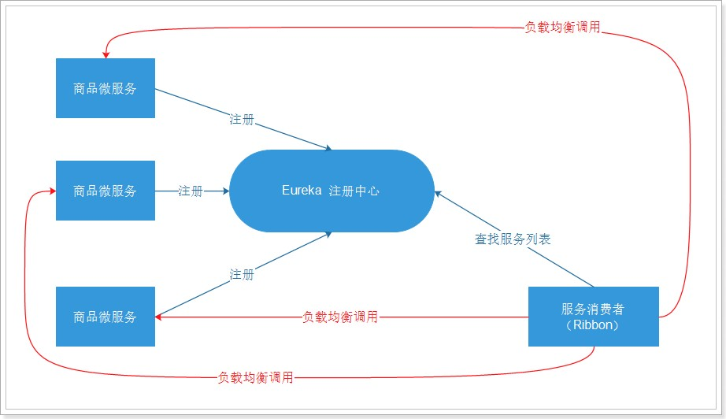

## 2. Ribbon 基础使用示例

需求：改造上面Eureka注册中心（单机版）示例，基于Ribbon组件实现订单调用商品服务

> 复制上面`02-springcloud-eureka`工程的代码，在原有基础进行修改。改造后示例源代码详见：`spring-cloud-note\spring-cloud-greenwich-sample\04-springcloud-ribbon\`

### 2.1. Ribbon 的依赖

在SpringCloud提供的服务工程，主要引入eureka组件，无论是服务端还是客户端，其jar都已经包含了Ribbon的依赖。所以使用Ribbon组件不需要导入任何额外的坐标

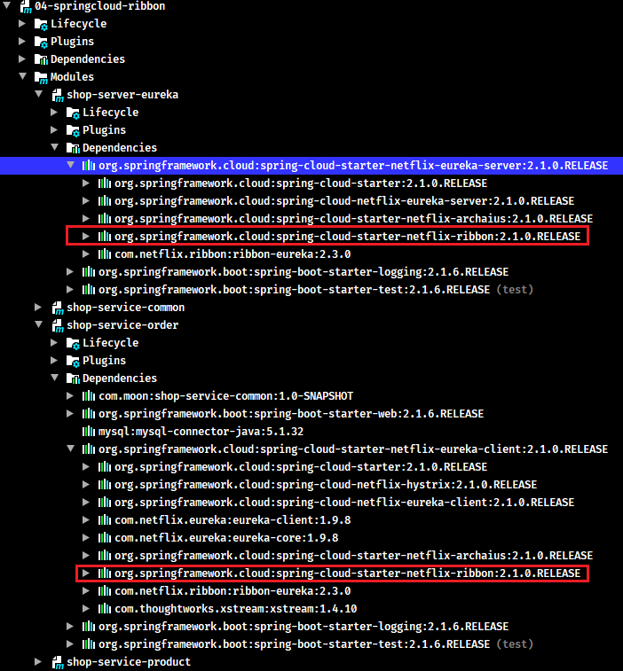

### 2.2. 服务项目使用Ribbon组件

#### 2.2.1. 改造步骤

1. 在创建`RestTemplate`实例的时候，声明Ribbon组件的`@LoadBalanced`注解
2. 在使用`RestTemplate`调用远程微服务接口时，不需要手动拉普拉斯微服务的url，只需要将指定待请求的服务名称即可

#### 2.2.2. 服务提供者

修改`shop-service-product`工程中`ProductController`控制器的`findById()`方法，在返回数据中增加当时服务的ip与端口号（这里用于后面测试Ribbon负载均衡调用测试）

```java
@RestController
@RequestMapping("product")
public class ProductController {
    // ....省略部分代码
    // 注入配置文件中当前服务的端口号
    @Value("${server.port}")
    private String port;
    /*
     * 注解当前服务的ip地址
     *  使用el表达式：spring.cloud.client.ip-address
     *  spring cloud 自动的获取当前应用的ip地址
     */
    @Value("${spring.cloud.client.ip-address}")
    private String ip;

    @GetMapping("/{id}")
    public Product findById(@PathVariable Long id) {
        Product product = productService.findById(id);
        /* 设置当前被调用的服务的ip与端口，用于测试ribbon的负载均衡 */
        product.setProductDesc(product.getProductDesc() + "===当前被调用的product服务的ip: " + ip + " ,端口: " + port);
        return product;
    }
    // ....省略部分代码
}
```

#### 2.2.3. 服务消费者

修改服务消费者`shop_service_order`工程配置类`HttpConfig`，在创建`RestTemplate`方法上添加 `@LoadBalanced` 注解

```java
@LoadBalanced // 是Ribbon组件提供的负载均衡的注解，声明此注解后就可以基于Ribbon的服务调用与负载均衡
@Bean("restTemplate")
public RestTemplate createRestTemplate() {
    return new RestTemplate();
}
```

修改`OrderController`中的`createOrder`方法，将原来的ip地址改相应的服务名称，`RestTemplate`完成调用服务

```java
@RestController
@RequestMapping("order")
public class OrderController {
    /* 日志对象 */
    private static final Logger LOGGER = LoggerFactory.getLogger(OrderController.class);

    // 注入HTTP请求工具类RestTemplate
    @Autowired
    private RestTemplate restTemplate;

    /**
     * 根据商品id创建订单
     */
    @PostMapping("/{id}")
    public String createOrder(@PathVariable Long id) {
        /*
         * 通过http请求，获取商品数据
         * 拼接请求url，将原来使用ip+端口调用的方式，改成要调用的服务对应的名称即可
         * 服务提供者名称在其项目配置文件的spring.application.name属性中定义
         */
        Product product = restTemplate.getForObject("http://shop-service-product/product/" + id, Product.class);
        LOGGER.info("当前下单的商品是: ${}", product);
        return "创建订单成功";
    }
}
```

#### 2.2.4. 代码测试

发起post请求`http://127.0.0.1:9002/order/1`，查看后端日志输出，已经可以在订单微服务中以服务名称的形式调用商品微服务获取数据

## 3. Ribbon 的负载均衡

### 3.1. 负载均衡的定义

负载均衡是一种基础的网络服务，其原理是通过运行在前面的负载均衡服务，按照指定的负载均衡算法，将流量分配到后端服务集群上，从而为系统提供并行扩展的能力

负载均衡的应用场景包括流量包、转发规则以及后端服务，由于该服务有内外网个例、健康检查等功能，能够有效提供系统的安全性和可用性

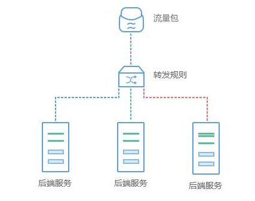

### 3.2. 客户端负载均衡与服务端负载均衡

#### 3.2.1. 服务端负载均衡

先发送请求到负载均衡服务器或者软件，然后通过负载均衡算法，在多个服务器之间选择一个进行访问。即在服务器端再进行负载均衡算法分配

#### 3.2.2. 客户端负载均衡

客户端会有一个服务器地址列表，在发送请求前通过负载均衡算法选择一个服务器，然后进行访问，这是客户端负载均衡。即在客户端就进行负载均衡算法分配

### 3.3. 基于Ribbon实现服务负载均衡的示例

#### 3.3.1. 搭建多服务实例

修改 `shop-service-product` 的 `application.yml` 配置文件，将端口号设置为变量，在启动应用时指定变量值，从而实现模拟多实例

```yml
server:
  port: ${PORT:9001} # 项目端口，设置为变量，指定默认值为9001
# ....以下部分省略
```

启动服务时，指定端口号

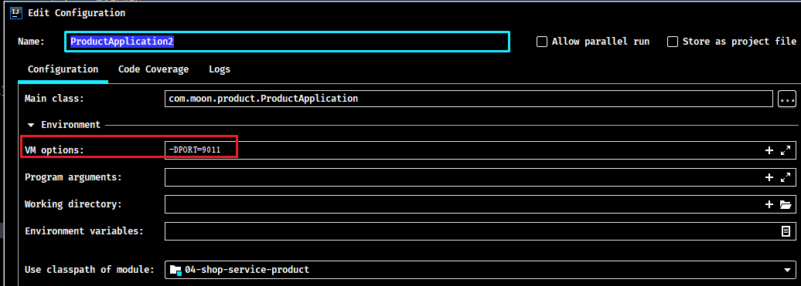

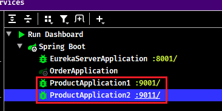

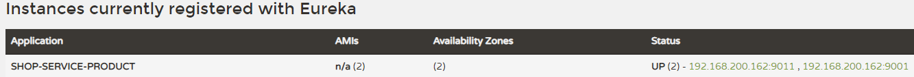

ribbon默认的负载均衡策略是轮询，所以使用order服务去调用商品服务，观察后端日志输出的端口，每次访问换一台服务器

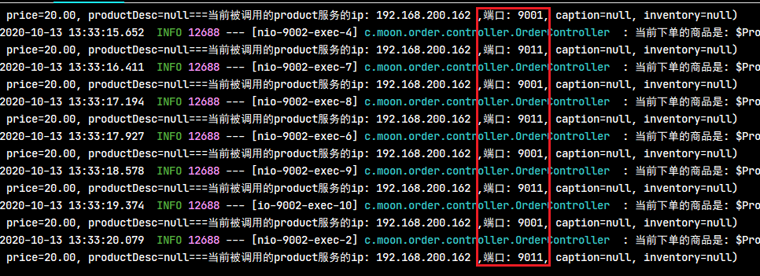

#### 3.3.2. 负载均衡策略配置

Ribbon内置了多种负载均衡策略，内部负责复杂均衡的顶级接口为`com.netflix.loadbalancer.IRule`，有以下的实现类：

- `com.netflix.loadbalancer.RoundRobinRule`：以轮询的方式进行负载均衡【默认】
- `com.netflix.loadbalancer.RandomRule`：随机策略
- `com.netflix.loadbalancer.RetryRule`：重试策略
- `com.netflix.loadbalancer.WeightedResponseTimeRule`：权重策略。会计算每个服务的权重，越高的被调用的可能性越大
- `com.netflix.loadbalancer.BestAvailableRule`：最佳策略。遍历所有的服务实例，过滤掉故障实例，并返回请求数最小的实例返回
- `com.netflix.loadbalancer.AvailabilityFilteringRule`：可用过滤策略。过滤掉故障和请求数超过阈值的服务实例，再从剩下的实力中轮询调用

**策略选择：**

1. 如果服务部署的每个机器配置性能差不多，则建议不修改策略，让每台服务器平均分担压力 (推荐)
2. 如果部分机器配置强，则可以改为 `WeightedResponseTimeRule` 权重策略，让性能高的服务器承担更多的请求

在服务消费者的`application.yml`配置文件中修改负载均衡策略即可，增加以下配置：

格式：`服务名.ribbon.NFLoadBalancerRuleClassName: 策略全限定名`

```yml
# Ribbon配置
shop-service-product:
  ribbon:
    NFLoadBalancerRuleClassName: com.netflix.loadbalancer.RandomRule # 修改策略为随机
```

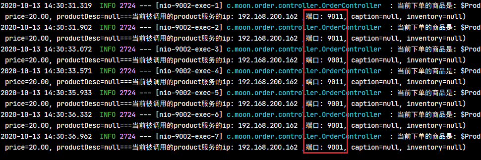

#### 3.3.3. 请求重试配置

请求重试的机制是：当服务消费者去请求多个服务提供者时，如果当前请求的服务A出现网络的波动或者宕机的情况，此时，请求就会出现报错或者请求不到数据。请求重试就是根据当前用户设置的参数（如：请求连接超时时间、获取数据返回超时时间等），如果超出了用户设置的限制，就会直接重新发起新的请求到另一台服务。

Ribbon配置的请求重试的步骤如下：

1. 在服务消费者工程引入spring的重试组件，以订单服务（`shop-service-order`）为例：

```xml
<!-- Spring 框架的重试组件 -->
<dependency>
    <groupId>org.springframework.retry</groupId>
    <artifactId>spring-retry</artifactId>
</dependency>
```

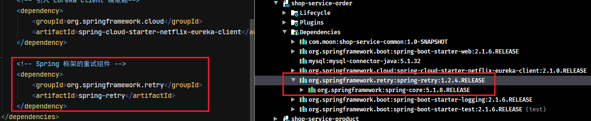

2. 修改消费者工程的配置文件

```yml
# 配置日志级别，用于观察请求重试时输出的日志
logging:
  level:
    root: debug
# Ribbon配置
shop-service-product:
  ribbon:
    ConnectTimeout: 250 # Ribbon的连接超时时间
    ReadTimeout: 1000 # Ribbon的数据读取超时时间
    OkToRetryOnAllOperations: true # 是否对所有操作都进行重试
    MaxAutoRetriesNextServer: 1 # 切换实例的重试次数
    MaxAutoRetries: 1 # 对当前实例的重试次数
```

3. 测试，启动两个服务提供者，正常请求消费后再停用其中一个服务，再请求后观察后台日志

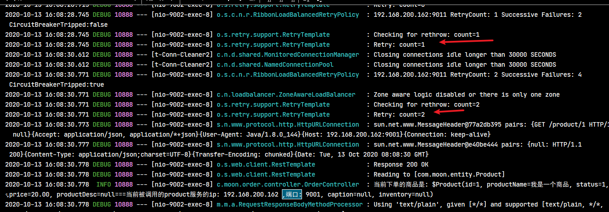

## 4. Ribbon 的负载均衡源码解析

### 4.1. Ribbon中的关键组件

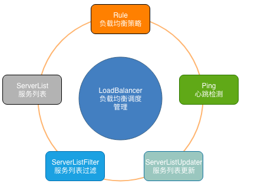

- `ServerList`：可以响应客户端的特定服务的服务器列表
- `ServerListFilter`：可以动态获得的具有所需特征的候选服务器列表的过滤器
- `ServerListUpdater`：用于执行动态服务器列表更新
- `Rule`：负载均衡策略，用于确定从服务器列表返回哪个服务器
- `Ping`：客户端用于快速检查服务器当时是否处于活动状态
- `LoadBalancer`：负载均衡器，负责负载均衡调度的管理

### 4.2. @LoadBalanced 注解

```java
/**
 * Annotation to mark a RestTemplate bean to be configured to use a LoadBalancerClient.
 * @author Spencer Gibb
 */
@Target({ ElementType.FIELD, ElementType.PARAMETER, ElementType.METHOD })
@Retention(RetentionPolicy.RUNTIME)
@Documented
@Inherited
@Qualifier
public @interface LoadBalanced {
}
```

通过注释可以知道，`@LoadBalanced`注解是给`RestTemplate`做标记，方便对`RestTemplate`对象添加一个`LoadBalancerClient`，以实现客户端负载均衡。

所以使用Ribbon完成客户端负载均衡就是直接给创建`RestTemplate`方法标识上该注解即可

```java
@LoadBalanced // 是Ribbon组件提供的负载均衡的注解，声明此注解后就可以基于Ribbon的服务调用与负载均衡
@Bean("restTemplate")
public RestTemplate createRestTemplate() {
    return new RestTemplate();
}
```

### 4.3. 自动装配

根据SpringBoot中的自动装配规则，在 `spring-cloud-netflix-ribbon-2.1.0.RELEASE.jar` 中找到 `META-INF\spring.factories`文件，自动初始化`RibbonAutoConfiguration`自动装配类

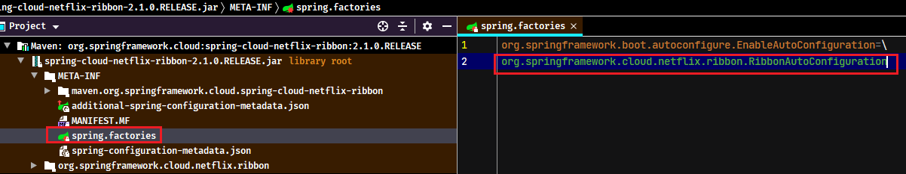

在 `RibbonAutoConfiguration` 类中，通过`@AutoConfigureBefore`注解会在自动装配前引入 `LoadBalancerAutoConfiguration` 配置类到spring容器中

```java
@Configuration
@Conditional(RibbonAutoConfiguration.RibbonClassesConditions.class)
@RibbonClients
@AutoConfigureAfter(name = "org.springframework.cloud.netflix.eureka.EurekaClientAutoConfiguration")
@AutoConfigureBefore({LoadBalancerAutoConfiguration.class, AsyncLoadBalancerAutoConfiguration.class})
@EnableConfigurationProperties({RibbonEagerLoadProperties.class, ServerIntrospectorProperties.class})
public class RibbonAutoConfiguration {
    // ....省略部分代码
    @Bean
	public SpringClientFactory springClientFactory() {
		SpringClientFactory factory = new SpringClientFactory();
		factory.setConfigurations(this.configurations);
		return factory;
	}

	@Bean
	@ConditionalOnMissingBean(LoadBalancerClient.class)
	public LoadBalancerClient loadBalancerClient() {
		return new RibbonLoadBalancerClient(springClientFactory());
	}
    // ....省略部分代码
}
```

### 4.4. 负载均衡的实现

#### 4.4.1. LoadBalancerAutoConfiguration 自动配置类

`LoadBalancerAutoConfiguration`类是负载均衡的自动化配置类。

```java
@Configuration
@ConditionalOnClass(RestTemplate.class)
@ConditionalOnBean(LoadBalancerClient.class)
@EnableConfigurationProperties(LoadBalancerRetryProperties.class)
public class LoadBalancerAutoConfiguration {
    // ....省略部分代码
    @Configuration
	@ConditionalOnMissingClass("org.springframework.retry.support.RetryTemplate")
	static class LoadBalancerInterceptorConfig {
		@Bean
		public LoadBalancerInterceptor ribbonInterceptor(
				LoadBalancerClient loadBalancerClient,
				LoadBalancerRequestFactory requestFactory) {
			return new LoadBalancerInterceptor(loadBalancerClient, requestFactory);
		}

		@Bean
		@ConditionalOnMissingBean
		public RestTemplateCustomizer restTemplateCustomizer(
				final LoadBalancerInterceptor loadBalancerInterceptor) { // LoadBalancerInterceptor拦截器用于实现对客户端发起请求时进行拦截，以实现客户端负载均衡
			// 创建RestTemplateCustomizer类，该类是函数式接口，主要处理的逻辑是给 RestTemplate 增加 LoadBalancerInterceptor 拦截器
			return restTemplate -> {
                List<ClientHttpRequestInterceptor> list = new ArrayList<>(
                        restTemplate.getInterceptors());
                list.add(loadBalancerInterceptor);
                restTemplate.setInterceptors(list);
            };
		}
	}
	// ....省略部分代码
}
```

主要实现以下逻辑：

- 创建了一个 `LoadBalancerInterceptor` 的Bean，用于实现对客户端发起请求时进行拦截，以实现客户端负载均衡。
- 创建了一个 `RestTemplateCustomizer` 的Bean，用于给 `RestTemplate` 增加 `LoadBalancerInterceptor` 拦截器。
- 维护了一个被 `@LoadBalanced` 注解修饰的 `RestTemplate` 对象列表，并在这里进行初始化，通过调用 `RestTemplateCustomizer` 的实例来给需要客户端负载均衡的 `RestTemplate` 增加 `LoadBalancerInterceptor` 拦截器

#### 4.4.2. LoadBalancerInterceptor 负载均衡拦截器

```java
public class LoadBalancerInterceptor implements ClientHttpRequestInterceptor {

	private LoadBalancerClient loadBalancer;
	private LoadBalancerRequestFactory requestFactory;

	public LoadBalancerInterceptor(LoadBalancerClient loadBalancer, LoadBalancerRequestFactory requestFactory) {
		this.loadBalancer = loadBalancer;
		this.requestFactory = requestFactory;
	}

	public LoadBalancerInterceptor(LoadBalancerClient loadBalancer) {
		// for backwards compatibility
		this(loadBalancer, new LoadBalancerRequestFactory(loadBalancer));
	}

	@Override
	public ClientHttpResponse intercept(final HttpRequest request, final byte[] body,
			final ClientHttpRequestExecution execution) throws IOException {
		// 获取URI实例
		final URI originalUri = request.getURI();
		// 获取host主机服务（使用ribbon调用时，host名称是相应服务提供者的名称）
		String serviceName = originalUri.getHost();
		Assert.state(serviceName != null, "Request URI does not contain a valid hostname: " + originalUri);
		return this.loadBalancer.execute(serviceName, requestFactory.createRequest(request, body, execution));
	}
}
```

在之前的`LoadBalancerAutoConfiguration`自动化配置类中，给`RestTemplate`对象增加了`LoadBalancerInterceptor`拦截器，在拦截器中注入了 `LoadBalancerClient` 的实现。

当一个被 `@LoadBalanced` 注解修饰的 `RestTemplate` 对象向外发起HTTP请求时，会被 `LoadBalancerInterceptor` 类的 `intercept` 函数所拦截。由于在使用`RestTemplate`时候采用了服务名作为host，所以直接从 `HttpRequest` 的URI对象中通过`getHost()`方法就可以拿到服务名，然后调用 `execute` 函数去根据服务名来选择实例并发起实际的请求

#### 4.4.3. LoadBalancerClient 负载均衡具体逻辑接口

`LoadBalancerClient` 是负载均衡器的抽象接口，其实现类是`org.springframework.cloud.netflix.ribbon.RibbonLoadBalancerClient`

```java
public class RibbonLoadBalancerClient implements LoadBalancerClient {
    // ....省略部分代码
    /**
	 * New: Select a server using a 'key'.
	 */
	public ServiceInstance choose(String serviceId, Object hint) {
		Server server = getServer(getLoadBalancer(serviceId), hint);
		if (server == null) {
			return null;
		}
		return new RibbonServer(serviceId, server, isSecure(server, serviceId),
				serverIntrospector(serviceId).getMetadata(server));
	}

    /**
	 * New: Execute a request by selecting server using a 'key'.
	 * The hint will have to be the last parameter to not mess with the `execute(serviceId, ServiceInstance, request)`
	 * method. This somewhat breaks the fluent coding style when using a lambda to define the LoadBalancerRequest.
	 */
	public <T> T execute(String serviceId, LoadBalancerRequest<T> request, Object hint) throws IOException {
		ILoadBalancer loadBalancer = getLoadBalancer(serviceId);
		Server server = getServer(loadBalancer, hint);
		if (server == null) {
			throw new IllegalStateException("No instances available for " + serviceId);
		}
		RibbonServer ribbonServer = new RibbonServer(serviceId, server, isSecure(server,
				serviceId), serverIntrospector(serviceId).getMetadata(server));

		return execute(serviceId, ribbonServer, request);
	}

    /**
	 * Note: This method could be removed?
	 */
	protected Server getServer(String serviceId) {
		return getServer(getLoadBalancer(serviceId), null);
	}

	protected Server getServer(ILoadBalancer loadBalancer) {
	    return getServer(loadBalancer, null);
	}

	protected Server getServer(ILoadBalancer loadBalancer, Object hint) {
		if (loadBalancer == null) {
			return null;
		}
		// Use 'default' on a null hint, or just pass it on?
		return loadBalancer.chooseServer(hint != null ? hint : "default");
	}

	protected ILoadBalancer getLoadBalancer(String serviceId) {
		return this.clientFactory.getLoadBalancer(serviceId);
	}
	// ....省略部分代码
}
```

- `ServiceInstance choose(String serviceId)`：根据传入的服务id，从负载均衡器中为指定的服务选择一个服务实例
- `T execute(String serviceId, LoadBalancerRequest request)`：根据传入的服务id，指定的负载均衡器中的服务实例执行请求
- `T execute(String serviceId, ServiceInstance serviceInstance, LoadBalancerRequest request)`：根据传入的服务实例，执行请求。

通过`RibbonLoadBalancerClient`的源码分析可知，实际负载均衡的是通过 `ILoadBalancer` 来实现的

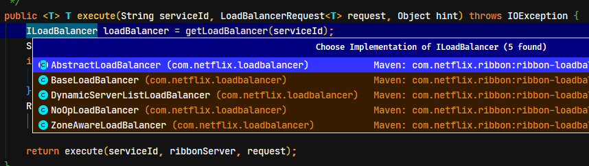

```java
@Configuration
@EnableConfigurationProperties
@Import({HttpClientConfiguration.class, OkHttpRibbonConfiguration.class, RestClientRibbonConfiguration.class, HttpClientRibbonConfiguration.class})
public class RibbonClientConfiguration {
    // ....省略部分代码
    @Bean
	@ConditionalOnMissingBean
	public ILoadBalancer ribbonLoadBalancer(IClientConfig config,
			ServerList<Server> serverList, ServerListFilter<Server> serverListFilter,
			IRule rule, IPing ping, ServerListUpdater serverListUpdater) {
		if (this.propertiesFactory.isSet(ILoadBalancer.class, name)) {
			return this.propertiesFactory.get(ILoadBalancer.class, config, name);
		}
		return new ZoneAwareLoadBalancer<>(config, rule, ping, serverList,
				serverListFilter, serverListUpdater);
	}
    // ....省略部分代码
}
```

### 4.5. 总结

Ribbon 的负载均衡主要是通 `LoadBalancerClient` 来实现，而 `LoadBalancerClient` 具体是交给 `ILoadBalancer` 来处理，`ILoadBalancer` 通过配置 `IRule`、`IPing` 等，向 `EurekaClient` 获取注册列表信息，默认每10秒向 `EurekaClient` 发送一次“ping” 请求，用于检查是否需要更新服务的注册列表信息。最后，在得到服务注册列表令牌后，`ILoadBalancer` 根据 `IRule` 的策略进行负载均衡。

在 `RestTemplate` 加上 `@LoadBalanced` 注解后，在远程调度时能够负载均衡，主要是维护了一个被 `@LoadBalanced` 注解的 `RestTemplate` 列表，并给该列表中的 `RestTemplate` 对象添加了拦截器。在拦截器的方法中，将远程调度方法交给了 Ribbon 的负载均衡器 `LoadBalancerClient` 去处理，从而达到了负载均衡的目的。
