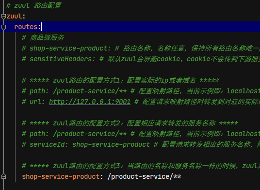
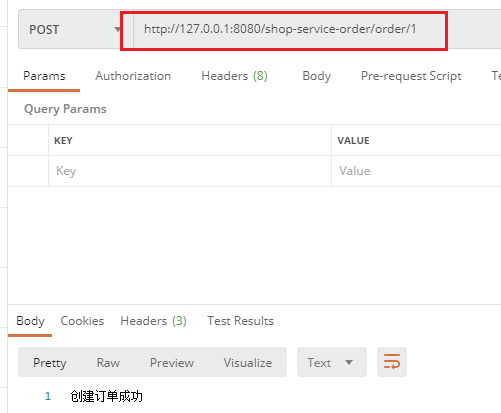
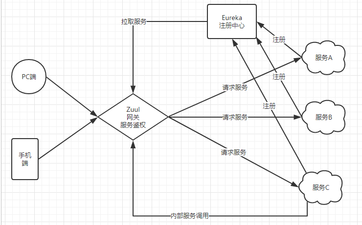
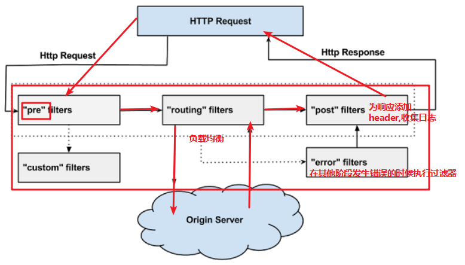
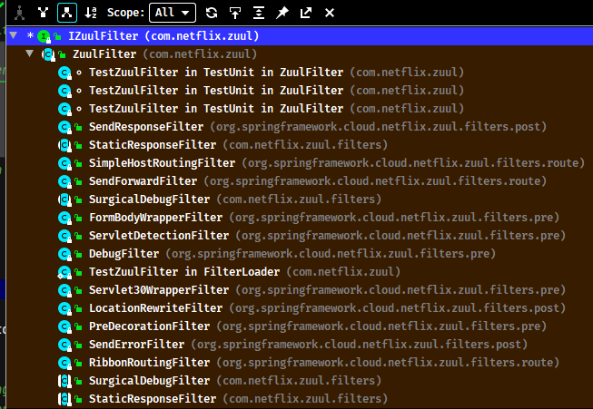
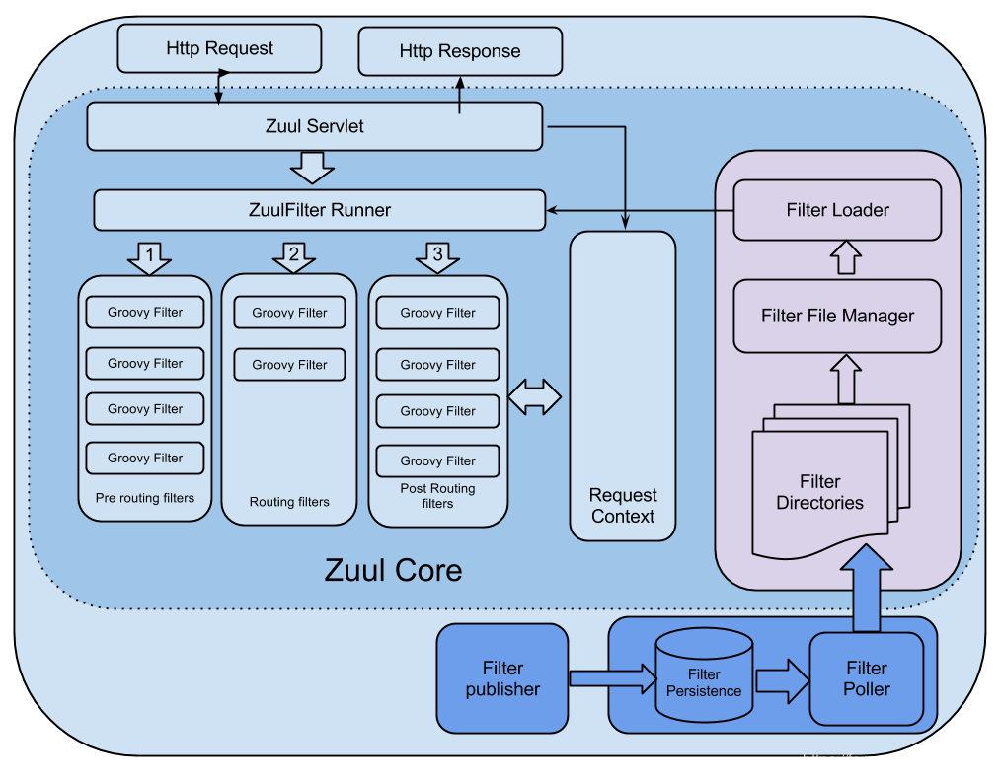
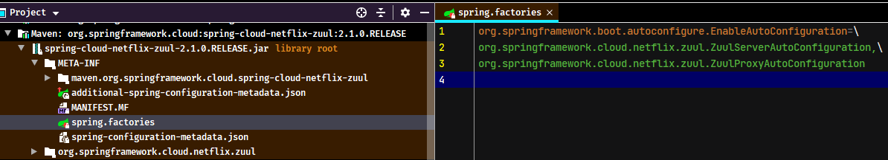
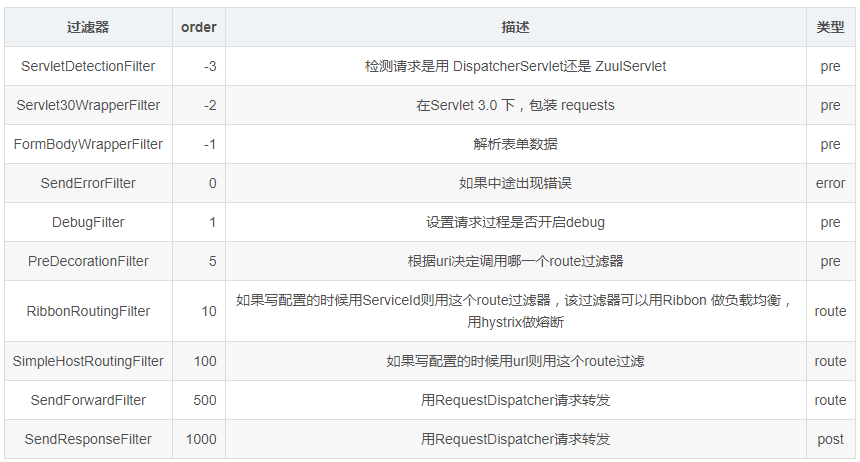

## 1. Zuul简介

Zuul 是 Netflix 开源的微服务网关，它可以和 Eureka、Ribbon、Hystrix 等组件配合使用，Zuul 组件的核心是一系列的过滤器，这些过滤器可以完成以下功能：

- 动态路由：动态将请求路由到不同后端集群
- 压力测试：逐渐增加指向集群的流量，以了解性能
- 负载分配：为每一种负载类型分配对应容量，并弃用超出限定值的请求
- 静态响应处理：边缘位置进行响应，避免转发到内部集群
- 身份认证和安全：识别每一个资源的验证要求，并拒绝那些不符的请求。Spring Cloud对Zuul进行了整合和增强。

## 2. Zuul 网关服务器搭建准备

创建Zuul组件的示例工程`11-springcloud-zuul`，复用之前`06-springcloud-feign`工程的代码，删除一些无用的内容

### 2.1. 创建zuul服务引入依赖

创建zuul网关工程 `shop-server-zuul` ，并添加zuul组件的依赖

```xml
<!-- spring cloud netflix zuul 组件核心依赖 -->
<dependency>
    <groupId>org.springframework.cloud</groupId>
    <artifactId>spring-cloud-starter-netflix-zuul</artifactId>
</dependency>
```

### 2.2. 开启zuul网关功能

创建启动类 `ZuulServerApplication`，在启动类上标识`@EnableZuulProxy`注解开启zuul网关功能

```java
@SpringBootApplication
@EnableZuulProxy // 开启zuul网关功能
public class ZuulServerApplication {
    public static void main(String[] args) {
        SpringApplication.run(ZuulServerApplication.class, args);
    }
}
```

### 2.3. 项目配置

创建工程的配置文件`application.yml`，并添加基础配置

```yml
server:
  port: 8080 # 项目端口
spring:
  application:
    name: shop-server-zuul # 服务名称
```

## 3. Zuul 的路由转发

**路由转发**是指根据请求URL，将请求分配到对应的处理程序。在微服务体系中，Zuul负责接收所有的请求。根据不同的URL匹配规则，将不同的请求转发到不同的微服务处理。

### 3.1. 基础配置

修改工程的`application.yml`配置文件，配置路由规则

```yml
# zuul 路由配置
zuul:
  routes:
    # 商品微服务
    shop-service-product: # 路由名称，名称任意，保持所有路由名称唯一即可
      path: /product-service/** # 配置映射路径，当前示例即：localhost:8080/product-service/xxxx/xx
      url: http://127.0.0.1:9001 # 配置请求映射路径时转发到对应的实际微服务url地址，可以是实际ip或者域名
      sensitiveHeaders: # 默认zuul会屏蔽cookie，cookie不会传到下游服务，这里设置为空则取消默认的黑名单，如果设置了具体的头信息则不会传到下游服务
```

配置项说明：

- `shop-service-product`：配置路由id，可以随意取名，只要保持配置中所有路由id唯一即可
- `path`：配置映射路径，上面示例代表所有前缀为`/product-service`的请求，都会转发到`http://127.0.0.1:9001`
- `url`：映射路径对应的实际url地址

Zuul路由配置后，启动服务，在浏览器中输入`http://localhost:8080/product-service/product/1`，即可访问到商品微服务

### 3.2. 通过注册中心方式的路由配置

对于一个URL请求，最终会确认一个服务实例进行处理。在实际项目众多微服务情况下，如果对每个服务实例手动指定一个唯一访问地址，然后根据URL去手动实现请求匹配，显然不可能的。

Zuul支持与Eureka整合开发，根据`ServiceID`自动的从注册中心中获取服务地址并转发请求，此配置方式不仅可以通过单个端点来访问应用的所有服务，而且在添加或移除服务实例的时候不用修改Zuul的路由配置

1. 修改网关服务，添加注册中心Eureka客户端的依赖

```xml
<dependency>
    <groupId>org.springframework.cloud</groupId>
    <artifactId>spring-cloud-starter-netflix-eureka-client</artifactId>
</dependency>
```

2. 开启Eureka客户端发现功能。在启动类中标识`@EnableDiscoveryClient`。*注：从Spring Cloud Edgware版本开始，开启服务发现的注解可以省略不写。只需加上相关依赖与相应配置，即可注册服务*
3. 在`application.yml`中添加Eureka配置，获取服务信息

```yml
# Eureka 客户端配置
eureka:
  instance:
    prefer-ip-address: true # 将当前服务的ip地址注册到Eureka服务中
    instance-id: ${spring.cloud.client.ip-address}:${server.port}  # 指定实例id
  client:
    service-url:
      defaultZone: http://localhost:8001/eureka/ # Eureka server 地址，多个eureka server之间用,隔开
      registry-fetch-interval-seconds: 5 # 配置获取服务列表的周期为5s，默认值是30s
```

4. 修改zuul的映射配置，通过服务名称获取。引入Eureka客户端后，可以从Eureka获取服务的地址信息，因此映射时无需指定IP地址，而是通过服务名称来访问，而且Zuul已经集成了Ribbon的负载均衡功能

```yml
zuul:
  routes:
    # 商品微服务
    shop-service-product: # 路由名称，名称任意，保持所有路由名称唯一即可
      path: /product-service/** # 配置映射路径，当前示例即：localhost:8080/product-service/xxxx/xx
      serviceId: shop-service-product # 配置请求转发相应的服务名称，网关会从eureka中获取该服务名称下的服务实例的地址
      sensitiveHeaders: # 默认zuul会屏蔽cookie，cookie不会传到下游服务，这里设置为空则取消默认的黑名单，如果设置了具体的头信息则不会传到下游服务
```

配置项说明：

- `serviceId`：指定请求需要转发的微服务实例名称（服务注册到eureka的名称）

依次启动Eureka，商品微服务，API网关，在浏览器上通过访问 http://localhost:8080/product-service/product/1 查看最终效果。

### 3.3. 路由配置的简化方式

传统面向服务的路由配置规则是：

- `zuul.routes.<route>.path=/xxx/**`：来指定映射路径。`<route>`是自定义的路由名
- `zuul.routes.<route>.serviceId=/product-service`：来指定服务名

有一种特殊的情况：如果当`<route>`路由名称和服务名定义一样的时候，Zuul提供了一种简化的配置语法：`zuul.routes.<serviceId>=<path>`。上面示例的配置简化后如下：

```yml
zuul:
  routes:
    # 当路由的名称和服务名称一样的时候，zuul路由配置可简化成 zuul.routes.<serviceId>=<path>
    shop-service-product: /product-service/**
```

### 3.4. 默认的路由规则

Zuul不单单提供的路由的简化配置，zuul还有默认的路由规则。<font color=red>**默认的路由规则是：一切服务的映射路径就是服务的名称**</font>

例如：服务的名称为`shop-service-order`，则默认的映射路径就是`shop-service-order/**`。所以示例工程不需要配置order服务，zuul也可以成功转发请求





### 3.5. 通过注册中心方式配置zuul路由的架构图



## 4. Zuul 的过滤器

<font color=red>**Zuul组件包含了两个核心功能：对请求的路由和过滤**</font>。

- **路由功能**负责将外部请求转发到具体的微服务实例上，是实现外部访问统一入口的基础
- **过滤器功能**负责对请求的处理过程进行干预，是实现请求校验、服务聚合等功能的基础

其实路由功能在真正运行时，它的路由映射和请求转发同样也由几个不同的过滤器完成的。所以**过滤器可以说是Zuul实现API网关功能最为核心的部件**，每一个进入Zuul的HTTP请求都会经过一系列的过滤器处理链得到请求响应并返回给客户端。

### 4.1. ZuulFilter 简介

Zuul中的过滤器跟Servlet使用的`javax.servlet.Filter`不一样，`javax.servlet.Filter`只有一种类型，可以通过配置 `urlPatterns` 来拦截对应的请求。而Zuul中的过滤器总共有4种类型，且每种类型都有对应的使用场景。

1. `PRE`：此过滤器在请求被路由之前调用。可利用这种过滤器实现身份验证、在集群中选择请求的微服务、记录调试信息等。
2. `ROUTING`：此过滤器将请求路由到微服务。这种过滤器用于构建发送给微服务的请求，并使用Apache HttpClient或Netfilx Ribbon请求微服务。
3. `POST`：此过滤器在路由到微服务以后执行。这种过滤器可用来为响应添加标准的HTTPHeader、收集统计信息和指标、将响应从微服务发送给客户端等。
4. `ERROR`：在其他阶段发生错误时执行该过滤器。

### 4.2. 过滤器的生命周期


**正常流程**：

- 请求到达首先会经过pre类型过滤器，而后到达routing类型，进行路由，请求就到达真正的服务提供者，执行请求，返回结果后，会到达post过滤器。而后返回响应

**异常流程**：

- 整个过程中，pre或者routing过滤器出现异常，都会直接进入error过滤器，再error处理完毕后，会将请求交给POST过滤器，最后返回给用户。
- 如果是error过滤器自己出现异常，最终也会进入POST过滤器，而后返回。
- 如果是POST过滤器出现异常，会跳转到error过滤器，但是与pre和routing不同的时，请求不会再到达POST过滤器了

**不同过滤器的场景**：

- 请求鉴权：一般放在pre类型，如果发现没有访问权限，直接就拦截了
- 异常处理：一般会在error类型和post类型过滤器中结合来处理
- 服务调用时长统计：pre和post结合使用。



### 4.3. zuul内置过滤器



### 4.4. 自定义zuul过滤器

#### 4.4.1. 基础用法

Zuul提供了自定义过滤器的功能，只需要编写一个类去实现zuul提供的`ZuulFilter`接口即可。

`ZuulFilter`是过滤器的顶级父类，其中定义的4个最重要的方法如下：

```java
public abstract class ZuulFilter implements IZuulFilter, Comparable<ZuulFilter> {

    boolean shouldFilter(); // 继承于IZuulFilter接口

    Object run() throws ZuulException; // 继承于IZuulFilter接口

    abstract public String filterType();

    abstract public int filterOrder();
}
```

- `shouldFilter()`：返回一个 Boolean 值，判断该过滤器是否需要执行。返回true执行，返回false 不执行
- `run()`：过滤器的具体业务逻辑
- `filterType()`：返回字符串，代表过滤器的类型。包含以下4种：
    - `pre`：请求在被路由之前执行
    - `routing`：在路由请求时调用
    - `post`：在`routing`和`errror`过滤器之后调用
    - `error`：处理请求时发生错误调用
- `filterOrder()`：通过返回`int`类型的值来定义过滤器的执行顺序，数字越小优先级越高

#### 4.4.2. 自定义过滤器示例

示例需求：自定义一个过滤器，模拟一个登录的校验。基本逻辑：如果请求头中有`access-token`参数，则认为请求有效，放行。

在`shop-server-zuul`工程中创建`LoginFilter`类，实现`ZuulFilter`接口，编写请求被路由前的业务逻辑

```java
package com.moon.zuul.filter;

import com.netflix.zuul.ZuulFilter;
import com.netflix.zuul.context.RequestContext;
import com.netflix.zuul.exception.ZuulException;
import org.springframework.http.HttpStatus;
import org.springframework.stereotype.Component;
import org.springframework.util.StringUtils;

import javax.servlet.http.HttpServletRequest;
import javax.servlet.http.HttpServletResponse;

/**
 * zuul自定义过滤器示例 - 请求登陆校验过滤
 */
@Component // 自定义zuul过滤器，需要使用@Component标识该bean给spring容器管理
// 自定义zuul过滤器需要继承抽象父类ZuulFilter
public class LoginFilter extends ZuulFilter {
    /**
     * 设置过滤器类型
     * pre：请求在被路由之前执行
     * routing：在路由请求时调用
     * post：在routing和errror过滤器之后调用
     * error：处理请求时发生错误调用
     *
     * @return 过滤器的类型字符串
     */
    @Override
    public String filterType() {
        // 登录校验，设置为请求路由之前拦截
        return "pre";
    }

    /**
     * 指定过滤器的执行顺序，返回值越小越被优先执行
     */
    @Override
    public int filterOrder() {
        return 0;
    }

    /**
     * 过滤器是否需要执行
     *
     * @return true: 执行此过滤器，false: 不执行
     */
    @Override
    public boolean shouldFilter() {
        return true;
    }

    /**
     * 过滤器的业务逻辑方法
     * <p>
     * 此示例完成身份认证:
     * 1.所有的请求需要携带一个参数: access-token
     * 2.获取request请求头"access-token"
     * 3.判断token是否为空
     * 4.1 token==null : 身份验证失败
     * 4.2 token!=null : 执行后续操作
     *
     * @return
     * @throws ZuulException
     */
    @Override
    public Object run() throws ZuulException {
        // 在zuul网关中，通过RequestContext的上下文对象，可以获取HttpServletRequest和HttpServletResponse对象
        RequestContext context = RequestContext.getCurrentContext();
        HttpServletRequest request = context.getRequest();
        HttpServletResponse response = context.getResponse();

        // 获取请求头中access-token字段
        String token = request.getHeader("access-token");

        if (StringUtils.isEmpty(token)) {
            // 如果请求头不包含Authorization，则拒绝访问
            context.setSendZuulResponse(false);
            // 设置响应状态码
            context.setResponseStatusCode(HttpStatus.UNAUTHORIZED.value());
            // 设置JSON格式的响应信息
            context.setResponseBody("{\"code\": \"-1\", \"retMsg\": \"此操作需要登陆系统！\"}");
            // 设置contentType为json类型
            response.setContentType("application/json;charset=UTF-8");
            // 还可以进行其他的操作
        }
        // 校验通过，返回继续向后执行。（也可以考虑把用户信息放入上下文）
        return null;
    }
}
```

上面示例的`RequestContext`是zuul用于在过滤器之间传递消息。它的数据保存在每个请求的`ThreadLocal`中。它用于存储请求路由到哪里、错误、`HttpServletRequest`、`HttpServletResponse`都存储在`RequestContext`中。`RequestContext`扩展了`ConcurrentHashMap`，所以，任何数据都可以存储在上下文中

启动服务进行测试：


## 5. 服务网关Zuul的核心源码解析

### 5.1. Zuul 网关处理请求的流程



在Zuul中，整个请求的过程是：

1. 首先将请求给`ZuulServlet`处理，`ZuulServlet`中有一个`ZuulRunner`对象，该对象中初始化了`RequestContext`，作为存储整个请求的一些数据，并被所有的`ZuulFilter`共享。
2. `ZuulRunner`中还有`FilterProcessor`，`FilterProcessor`作为执行所有的`ZuulFilter`的管理器。`FilterProcessor`从`FilterLoader`中获取`ZuulFilter`，而`ZuulFilter`是被`FilterFileManager`所加载，并支持groovy热加载，采用了轮询的方式热加载。
3. 有了这些filter之后，`ZuulServlet`首先执行的Pre类型的过滤器，再执行route类型的过滤器，最后执行的是post类型的过滤器，如果在执行这些过滤器有错误的时候则会执行error类型的过滤器。
4. 执行完这些过滤器，最终将请求的结果返回给客户端

### 5.2. zuul 的初始化

SpringCloud 对 Zuul 的封装使得发布一个`ZuulServer`，根据自动装载原则可以在 `spring-cloud-netflix-zuul-2.1.0.RELEASE.jar` 下找到 `spring.factories` 文件



项目启动时会加载`ZuulServerAutoConfiguration`和`ZuulProxyAutoConfiguration`类，这两个类是Zuul服务端的自动配置类。其中`ZuulProxyAutoConfiguration`继承了`ZuulServerAutoConfiguration`

```java
@Configuration
@Import({ RibbonCommandFactoryConfiguration.RestClientRibbonConfiguration.class,
		RibbonCommandFactoryConfiguration.OkHttpRibbonConfiguration.class,
		RibbonCommandFactoryConfiguration.HttpClientRibbonConfiguration.class,
		HttpClientConfiguration.class })
@ConditionalOnBean(ZuulProxyMarkerConfiguration.Marker.class)
public class ZuulProxyAutoConfiguration extends ZuulServerAutoConfiguration {
    ....
}
```

查看`ZuulServerAutoConfiguration`源码，里面创建了几个zuul服务的核心类

```java
@Configuration
@EnableConfigurationProperties({ ZuulProperties.class })
@ConditionalOnClass({ZuulServlet.class, ZuulServletFilter.class})
@ConditionalOnBean(ZuulServerMarkerConfiguration.Marker.class)
public class ZuulServerAutoConfiguration {
    ....
    @Bean
	@Primary
	public CompositeRouteLocator primaryRouteLocator(
			Collection<RouteLocator> routeLocators) {
		return new CompositeRouteLocator(routeLocators);
	}

	@Bean
	@ConditionalOnMissingBean(SimpleRouteLocator.class)
	public SimpleRouteLocator simpleRouteLocator() {
		return new SimpleRouteLocator(this.server.getServlet().getContextPath(),
				this.zuulProperties);
	}

	@Bean
	public ZuulController zuulController() {
		return new ZuulController();
	}
	....
	@Configuration
	protected static class ZuulFilterConfiguration {

		@Autowired
		private Map<String, ZuulFilter> filters;

		@Bean
		public ZuulFilterInitializer zuulFilterInitializer(
				CounterFactory counterFactory, TracerFactory tracerFactory) {
			FilterLoader filterLoader = FilterLoader.getInstance();
			FilterRegistry filterRegistry = FilterRegistry.instance();
			return new ZuulFilterInitializer(this.filters, counterFactory, tracerFactory, filterLoader, filterRegistry);
		}
	}
	....
}
```

- `CompositeRouteLocator`：组合路由定位器，看入参就知道应该是会保存好多个`RouteLocator`，构造过程中其实仅包括一个`DiscoveryClientRouteLocator`实例
- `SimpleRouteLocator`：默认的路由定位器，主要负责维护配置文件中的路由配置。
- `ZuulController`：Zuul创建的一个Controller，用于将请求交由`ZuulServlet`处理。
- `ZuulHandlerMapping`：此类会添加到SpringMVC的`HandlerMapping`链中，只有选择了`ZuulHandlerMapping`的请求才能出发到Zuul的后续流程。
- `ZuulFilterInitializer`：在内部类`ZuulFilterConfiguration`中，注册`ZuulFilterInitializer`实例，通过`FilterLoader`加载应用中所有的过滤器并将过滤器注册到`FilterRegistry`

以下就是`ZuulFilterInitializer`是如何将过滤器加载到应用中的源码

```java
public class ZuulFilterInitializer {

	private static final Log log = LogFactory.getLog(ZuulFilterInitializer.class);

	private final Map<String, ZuulFilter> filters;
	private final CounterFactory counterFactory;
	private final TracerFactory tracerFactory;
	private final FilterLoader filterLoader;
	private final FilterRegistry filterRegistry;

	public ZuulFilterInitializer(Map<String, ZuulFilter> filters,
								 CounterFactory counterFactory,
								 TracerFactory tracerFactory,
								 FilterLoader filterLoader,
								 FilterRegistry filterRegistry) {
		this.filters = filters;
		this.counterFactory = counterFactory;
		this.tracerFactory = tracerFactory;
		this.filterLoader = filterLoader;
		this.filterRegistry = filterRegistry;
	}

	@PostConstruct
	public void contextInitialized() {
		log.info("Starting filter initializer");

		TracerFactory.initialize(tracerFactory);
		CounterFactory.initialize(counterFactory);

		for (Map.Entry<String, ZuulFilter> entry : this.filters.entrySet()) {
			filterRegistry.put(entry.getKey(), entry.getValue());
		}
	}

	@PreDestroy
	public void contextDestroyed() {
		log.info("Stopping filter initializer");
		for (Map.Entry<String, ZuulFilter> entry : this.filters.entrySet()) {
			filterRegistry.remove(entry.getKey());
		}
		clearLoaderCache();

		TracerFactory.initialize(null);
		CounterFactory.initialize(null);
	}

	private void clearLoaderCache() {
		Field field = ReflectionUtils.findField(FilterLoader.class, "hashFiltersByType");
		ReflectionUtils.makeAccessible(field);
		@SuppressWarnings("rawtypes")
		Map cache = (Map) ReflectionUtils.getField(field, filterLoader);
		cache.clear();
	}
}
```

### 5.3. zuul 处理请求的转发

在Zuul的`ZuulServerAutoConfiguration`自动配置类中，创建了`ZuulHandlerMapping`实例，此类为SpringMVC中`HandlerMapping`的拓展实现，会自动的添加到`HandlerMapping`链中。

```java
public class ZuulHandlerMapping extends AbstractUrlHandlerMapping {

	private final RouteLocator routeLocator;
	private final ZuulController zuul;
	private ErrorController errorController;
	private PathMatcher pathMatcher = new AntPathMatcher();
	private volatile boolean dirty = true;

	public ZuulHandlerMapping(RouteLocator routeLocator, ZuulController zuul) {
		this.routeLocator = routeLocator;
		this.zuul = zuul;
		setOrder(-200);
	}
    // ....省略
	private void registerHandlers() {
		Collection<Route> routes = this.routeLocator.getRoutes();
		if (routes.isEmpty()) {
			this.logger.warn("No routes found from RouteLocator");
		}
		else {
			for (Route route : routes) {
				registerHandler(route.getFullPath(), this.zuul);
			}
		}
	}
}
```

`ZuulHandlerMapping`其主要目的就是把所有请求路径导入到`ZuulController`中。另外的功能是当觉察`RouteLocator`路由表变更，则更新自己`dirty`状态，重新注册所有`Route`到`ZuulController`

```java
public class ZuulController extends ServletWrappingController {

	public ZuulController() {
	    // 在这里已经设置了ZuulServlet
		setServletClass(ZuulServlet.class);
		setServletName("zuul");
		setSupportedMethods((String[]) null); // Allow all
	}

	@Override
	public ModelAndView handleRequest(HttpServletRequest request, HttpServletResponse response) throws Exception {
		try {
			// We don't care about the other features of the base class, just want to handle the request
			// 在这里面会调用ZuulServlet的service方法
			return super.handleRequestInternal(request, response);
		}
		finally {
			RequestContext.getCurrentContext().unset();
		}
	}
}
```

在 `ZuulController` 中的 `handleRequest` 方法，会调用已经注册的 `ZuulServlet` 完成业务请求

```java
public class ZuulServlet extends HttpServlet {
    // ....省略
    @Override
    public void service(javax.servlet.ServletRequest servletRequest, javax.servlet.ServletResponse servletResponse) throws ServletException, IOException {
        try {
            init((HttpServletRequest) servletRequest, (HttpServletResponse) servletResponse);

            // Marks this request as having passed through the "Zuul engine", as opposed to servlets
            // explicitly bound in web.xml, for which requests will not have the same data attached
            RequestContext context = RequestContext.getCurrentContext();
            context.setZuulEngineRan();

            try {
                preRoute();
            } catch (ZuulException e) {
                error(e);
                postRoute();
                return;
            }
            try {
                route();
            } catch (ZuulException e) {
                error(e);
                postRoute();
                return;
            }
            try {
                postRoute();
            } catch (ZuulException e) {
                error(e);
                return;
            }

        } catch (Throwable e) {
            error(new ZuulException(e, 500, "UNHANDLED_EXCEPTION_" + e.getClass().getName()));
        } finally {
            RequestContext.getCurrentContext().unset();
        }
    }
    // ....省略
}
```

### 5.4. zuul 内置的过滤器

Zuul默认注入的过滤器可以在 `spring-cloud-netflix-core.jar` 中找到



## 6. Zuul网关的替换方案

### 6.1. Zuul网关存在的问题

- **性能问题**

Zuul 1.x版本本质上就是一个同步Servlet，采用多线程阻塞模型进行请求转发。即每来一个请求，Servlet容器要为该请求分配一个线程专门负责处理这个请求，直到响应返回客户端这个线程才会被释放返回容器线程池。如果后台服务调用比较耗时，那么这个线程就会被阻塞，阻塞期间线程资源被占用，不能干其它事情。而Servlet容器线程池的大小是有限制的，当前端请求量大，而后台慢服务比较多时，很容易耗尽容器线程池内的线程，造成容器无法接受新的请求

- **不支持任何长连接**，如`WebSocket`

### 6.2. 替换方案 - Zuul2.x版本

Zuul2.x 版本是对 zuul 的升级版，但并没有被 Spring Cloud 收录

### 6.3. 替换方案 - Spring Cloud Gateway

Spring Cloud Gateway 是 Spring Cloud 单独推出的微服务网关组件，比 Zuul 1.x 系列的性能和功能整体要好

> Spring Cloud Gateway 详细的说明与使用详见[《Spring Cloud Gateway 服务网关》笔记](/分布式微服务/SpringCloud/Spring-Cloud-Gateway)
