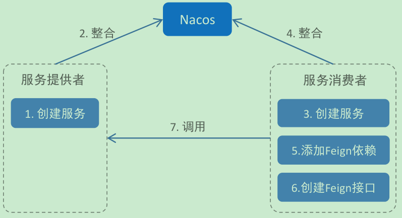
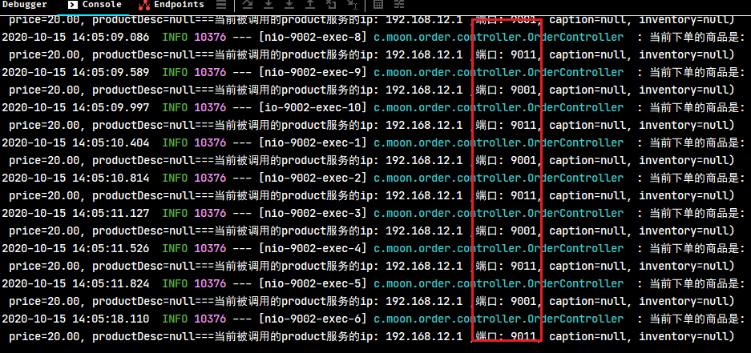
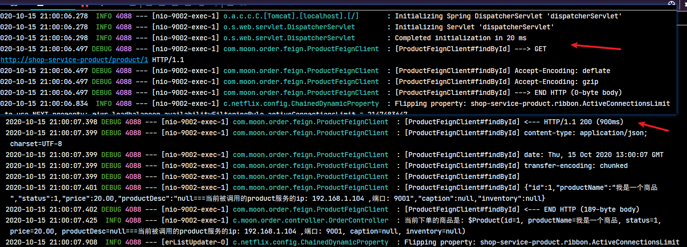

## 1. Feign 简介

Feign 是 Netflix 开发的声明式，模板化的 HTTP 客户端，其灵感来自 Retrofit，JAXRS-2.0 以及 WebSocket

- Feign 可更加便捷，优雅的调用 HTTP API
- 在 Spring Cloud 中，使用 Feign 非常简单。创建一个接口，并在接口上添加一些注解，代码就完成了
- Feign 支持多种注解，例如 Feign 自带的注解或者 JAX-RS 注解等
- Spring Cloud 对 Feign 进行了增强，使 Feign 支持了 SpringMVC 注解，并整合了 Ribbon 和 Eureka，从而让 Feign 的使用更加方便

## 2. 基于 eureka 的 Feign 服务调用示例

### 2.1. 示例工程准备

复用之前eureka单机版的示例项目`02-springcloud-eureka`，命名为`06-springcloud-feign`

### 2.2. 引入 Feign 依赖

在服务消费者 `shop-service-order` 工程添加 Feign 依赖

```xml
<!-- SpringCloud整合的openFeign -->
<dependency>
    <groupId>org.springframework.cloud</groupId>
    <artifactId>spring-cloud-starter-openfeign</artifactId>
</dependency>
```

### 2.3. 开启 Feign 的支持

在服务消费者的启动类上，通过`@EnableFeignClients`注解开启 Spring Cloud Feign 的支持功能

```java
@SpringBootApplication(scanBasePackages = "com.moon.order")
@EntityScan("com.moon.entity") // 指定扫描实体类的包路径
@EnableFeignClients // 开启Feign的支持
public class OrderApplication {
    public static void main(String[] args) {
        SpringApplication.run(OrderApplication.class, args);
    }
}
```

### 2.4. 创建 Feign 服务调用的接口

#### 2.4.1. 基础使用步骤

在服务消费者 `shop-service-order` 创建一个 Feign 接口，此接口是在 Feign 中调用微服务的核心接口。

```java
/*
 * @FeignClient 注解，用于标识当前接口为Feign调用微服务的核心接口
 *  value/name属性：指定需要调用的服务提供者的名称
 */
@FeignClient("shop-service-product") // 或者：@FeignClient(name = "shop-service-product")
public interface ProductFeignClient {

    /*
     * 创建需要调用的微服务接口方法，SpringCloud 对 Feign 进行了增强兼容了 SpringMVC 的注解
     *  在使用的两个注意点：
     *  1. FeignClient 接口有参数时，必须在参数加@PathVariable("XXX")和@RequestParam("XXX")注解，并且必须要指定对应的参数值（原来SpringMVC是可以省略）
     *  2. feignClient 返回值为复杂对象时，其对象类型必须有无参构造函数
     *  3. 方法的名称不需要与被调用的服务接口名称一致
     */
    @GetMapping("/product/{id}")
    Product findById(@PathVariable("id") Long id);

}
```

#### 2.4.2. 基础使用步骤总结

1. 启动类添加`@EnableFeignClients`注解，表示开启对Feign的支持，Spring会扫描标记了`@FeignClient`注解的接口，并生成此接口的代理对象
2. `@FeignClient`注解通过`name/value`属性指定需要调用的微服务的名称，用于创建Ribbon的负载均衡器。所以Ribbon从注册中心中获取服务列表，并通过负载均衡算法调用相应名称的服务。如：`@FeignClient("service-xxx")`即指定了服务提供者的名称`service-xxx`，Feign会从注册中心获取服务列表，并通过负载均衡算法进行服务调用名为`service-xxx`的服务
3. 在接口方法中使用`@GetMapping("/xxxx")`等SpringMVC的注解，指定调用的url，Feign将根据url进行远程调用

#### 2.4.3. Feign组件使用注意事项

- 定义接口方法对于形参绑定时，`@PathVariable`、`@RequestParam`、`@RequestHeader`等可以指定参数属性，在Feign中绑定参数必须通过`value`属性来指明具体的参数名，不然会抛出异常
- `FeignClient` 返回值为复杂对象时，其对象类型必须有无参构造函数

### 2.5. 配置消费者调用服务接口

修改消费者`shop-service-order`的`OrderController`控制类，注入`ProductFeignClient`接口实例，并在相应的方法中使用`ProductFeignClient`实例方法完成微服务调用即可

```java
@RestController
@RequestMapping("order")
public class OrderController {
    /* 日志对象 */
    private static final Logger LOGGER = LoggerFactory.getLogger(OrderController.class);

    // 注入FeignClient服务调用接口
    @Autowired
    private ProductFeignClient productFeignClient;

    /**
     * 根据商品id创建订单
     *
     * @param id 商品的id
     * @return
     */
    @PostMapping("/{id}")
    public String createOrder(@PathVariable Long id) {
        // 使用Feign组件实现服务远程调用，直接调用FeignClient的接口定义的相应方法即可
        Product product = productFeignClient.findById(id);
        LOGGER.info("当前下单的商品是: ${}", product);
        return "创建订单成功";
    }
}
```

启动相应的服务，进行测试

## 3. 基于 Nacos 的 Feign 服务调用示例

### 3.1. 实践步骤



1. 创建一个服务提供者，整合 Nacos
2. 创建一个服务消费者，整合 Nacos
3. 服务消费者添加 Feign 依赖
4. 服务消费者创建 Feign 客户端接口
5. 服务消费者使用 Feign 接口调用服务提供者
6. 启动并测试

### 3.2. 服务提供者

创建 feign-nacos-provider 工程，添加 Nacos 依赖：

```xml
<dependencies>
    <dependency>
        <groupId>org.springframework.boot</groupId>
        <artifactId>spring-boot-starter-web</artifactId>
    </dependency>

    <dependency>
        <groupId>com.alibaba.cloud</groupId>
        <artifactId>spring-cloud-starter-alibaba-nacos-discovery</artifactId>
    </dependency>
</dependencies>

<dependencyManagement>
    <dependencies>
        <!-- spring boot 依赖 -->
        <dependency>
            <groupId>org.springframework.boot</groupId>
            <artifactId>spring-boot-dependencies</artifactId>
            <version>2.1.13.RELEASE</version>
            <type>pom</type>
            <scope>import</scope>
        </dependency>
        <!-- spring cloud alibaba 依赖 -->
        <dependency>
            <groupId>com.alibaba.cloud</groupId>
            <artifactId>spring-cloud-alibaba-dependencies</artifactId>
            <version>2.1.4.RELEASE</version>
            <type>pom</type>
            <scope>import</scope>
        </dependency>
    </dependencies>
</dependencyManagement>
```

在启动类或者配置类上，添加 `@EnableDiscoveryClient` 注解开启服务发现

```java
@SpringBootApplication
@EnableDiscoveryClient
public class FeignNacosProviderApp {
    public static void main(String[] args) {
        SpringApplication.run(FeignNacosProviderApp.class, args);
    }
}
```

修改项目配置文件，添加 nacos 地址

```yml
server:
  port: 8081
spring:
  application:
    name: service-provider
  cloud:
    nacos:
      discovery:
        server-addr: localhost:8848
```

创建测试的接口

```java
@RestController
public class TestController {

    @GetMapping("/hi")
    public String hi() {
        return "hi";
    }

    @GetMapping("/hello")
    public String hello(@RequestParam String name) {
        return "hello " + name + "!";
    }
}
```

### 3.3. 服务消费者

创建 feign-nacos-consumer 工程，添加 Nacos 与 feign 依赖：

```xml
<dependencies>
    <dependency>
        <groupId>org.springframework.boot</groupId>
        <artifactId>spring-boot-starter-web</artifactId>
    </dependency>

    <dependency>
        <groupId>com.alibaba.cloud</groupId>
        <artifactId>spring-cloud-starter-alibaba-nacos-discovery</artifactId>
    </dependency>

    <dependency>
        <groupId>org.springframework.cloud</groupId>
        <artifactId>spring-cloud-starter-openfeign</artifactId>
    </dependency>
</dependencies>

<dependencyManagement>
    <dependencies>
        <!-- spring boot 依赖 -->
        <dependency>
            <groupId>org.springframework.boot</groupId>
            <artifactId>spring-boot-dependencies</artifactId>
            <version>2.1.13.RELEASE</version>
            <type>pom</type>
            <scope>import</scope>
        </dependency>
        <!-- spring cloud 依赖 -->
        <dependency>
            <groupId>org.springframework.cloud</groupId>
            <artifactId>spring-cloud-dependencies</artifactId>
            <version>Greenwich.SR6</version>
            <type>pom</type>
            <scope>import</scope>
        </dependency>
        <!-- spring cloud alibaba 依赖 -->
        <dependency>
            <groupId>com.alibaba.cloud</groupId>
            <artifactId>spring-cloud-alibaba-dependencies</artifactId>
            <version>2.1.4.RELEASE</version>
            <type>pom</type>
            <scope>import</scope>
        </dependency>
    </dependencies>
</dependencyManagement>
```

在启动类或者配置类上，添加 `@EnableDiscoveryClient` 注解开启服务发现、`@EnableFeignClients` 注解开启 Feign 支持

```java
@SpringBootApplication
@EnableDiscoveryClient
@EnableFeignClients
public class FeignNacosConsumer {
    public static void main(String[] args) {
        SpringApplication.run(FeignNacosConsumer.class, args);
    }
}
```

创建 feign 代理接口

```java
@FeignClient(name = "service-provider")
public interface FeignClientDemo {

    @GetMapping("/hello")
    String hello(@RequestParam("name") String name);
}
```

创建请求接口，通过 feign 代理接口调用服务提供者

## 4. Feign 和 Ribbon 的联系

- Ribbon 是一个基于 HTTP 和 TCP 客户端的负载均衡的工具。它可以在客户端配置`RibbonServerList`（服务端列表），使用 `HttpClient` 或 `RestTemplate` 模拟http请求，步骤比较繁琐
- Feign 是在 Ribbon 的基础上进行了一次改进，是一个使用起来更加方便的 HTTP 客户端。采用接口的方式，只需要创建一个接口，然后在上面添加注解即可，将需要调用的其他服务的方法定义成抽象方法即可，不需要自己构建http请求。然后就像是调用自身工程的方法调用，而感觉不到是调用远程方法，使得编写客户端变得非常容易

## 5. Feign 的负载均衡

Feign 本身已经集成了 Ribbon 依赖和自动配置，因此不需要额外引入依赖，也不需要再注册 `RestTemplate` 对象。

配置负载均衡的方式与使用 Ribbon 的配置方式一致，即也可以通过修改项目配置文件中 `ribbon.xx` 来进行全局配置。也可以通过`服务名.ribbon.xx` 来对指定服务配置

启动两个`shop-service-product`服务，重新测试可以发现使用 Ribbon 的轮询策略进行负载均衡



## 6. Feign 相关配置

### 6.1. Feign 可配置项说明

从 Spring Cloud Edgware 版本开始，Feign 支持使用属性自定义 Feign。对于一个指定名称的 Feign Client（例如该 Feign Client 的名称为 feignName ），Feign支持如下配置项：

```yml
# Feign 属性配置
feign:
  client:
    config:
      shop-service-product:  # 需要调用的服务名称
        connectTimeout: 5000 # 相当于Request.Options
        readTimeout: 5000 # 相当于Request.Options
        loggerLevel: full # 配置Feign的日志级别，相当于代码配置方式中的Logger
        errorDecoder: com.example.SimpleErrorDecoder # Feign的错误解码器，相当于代码配置方式中的ErrorDecoder
        retryer: com.example.SimpleRetryer # 配置重试，相当于代码配置方式中的Retryer
        requestInterceptors: # 配置拦截器，相当于代码配置方式中的RequestInterceptor
          - com.example.FooRequestInterceptor
          - com.example.BarRequestInterceptor
        decode404: false
```

部分属性配置说明：

- `feignName`：FeignClient 的名称，即上面例子的`shop-service-product`
- `connectTimeout`：建立链接的超时时长
- `readTimeout`：读取超时时长
- `loggerLevel`：Feign 的日志级别
- `errorDecoder`：Feign 的错误解码器
- `retryer`：配置重试
- `requestInterceptors`：添加请求拦截器
- `decode404`：配置熔断不处理404异常

### 6.2. 请求压缩配置

Spring Cloud Feign 支持对请求和响应进行GZIP压缩，以减少通信过程中的性能损耗。通过下面的参数即可开启请求与响应的压缩功能：

```yml
feign:
  compression: # Feign 请求压缩配置
    request:
      enabled: true # 开启请求压缩
    response:
      enabled: true # 开启响应压缩
```

也可以对请求的数据类型，以及触发压缩的大小下限进行设置：

```yml
feign:
  compression: # Feign 请求压缩配置
    request:
      enabled: true # 开启请求压缩
      mime-types: text/html,application/xml,application/json # 设置压缩的数据类型
      min-request-size: 2048 # 设置触发压缩的大小下限
```

> 注：上面的数据类型、压缩大小下限均为默认值。

### 6.3. 日志级别

如果在开发或者运行阶段希望看到Feign请求过程的日志记录，默认情况下Feign的日志是没有开启的。要想用属性配置方式来达到日志效果，只需在 `application.yml` 中添加如下内容即可：

```yml
# 配置feign日志的输出
feign:
  client:
    config:
      shop-service-product:  # 需要调用的服务名称
        loggerLevel: full # 配置Feign的日志级别，相当于代码配置方式中的Logger
# 日志配置
logging:
  level:
    # 配置只输出ProductFeignClient接口的日志
    com.moon.order.feign.ProductFeignClient: debug
```

配置参数说明：

- `logging.level.xx: debug`：配置Feign只会对日志级别为debug的做出响应
- `feign.client.config.服务名称.loggerLevel`： 配置Feign的日志级别，其中Feign有以下四种日志级别：
    - `NONE`【性能最佳，适用于生产】：不记录任何日志（默认值）
    - `BASIC`【适用于生产环境追踪问题】：仅记录请求方法、URL、响应状态代码以及执行时间
    - `HEADERS`：记录BASIC级别的基础上，记录请求和响应的header。
    - `FULL`【比较适用于开发及测试环境定位问题】：记录请求和响应的header、body和元数据。



## 7. Feign 源码分析

通过使用过程可知，`@EnableFeignClients`和`@FeignClient`两个注解就实现了Feign的功能，所以从`@EnableFeignClients`注解开始分析Feign的源码

### 7.1. @EnableFeignClients 注解

```java
@Retention(RetentionPolicy.RUNTIME)
@Target(ElementType.TYPE)
@Documented
@Import(FeignClientsRegistrar.class)
public @interface EnableFeignClients {
    // ....省略代码
}
```

通过 `@EnableFeignClients` 引入了`FeignClientsRegistrar`客户端注册类

### 7.2. FeignClientsRegistrar 客户端注册类

```java
class FeignClientsRegistrar implements ImportBeanDefinitionRegistrar,
		ResourceLoaderAware, EnvironmentAware {
    // ....省略代码
    @Override
	public void registerBeanDefinitions(AnnotationMetadata metadata,
			BeanDefinitionRegistry registry) {
	    // 注册默认配置
		registerDefaultConfiguration(metadata, registry);
		registerFeignClients(metadata, registry);
	}
    // ....省略代码
}
```

根据源码可知，`FeignClientsRegistrar`类实现了`ImportBeanDefinitionRegistrar`接口，在实现的`registerBeanDefinitions()`里就会解析和注册BeanDefinition，主要注册的对象类型有两种：

1. 注册缺省配置的配置信息

```java
private void registerDefaultConfiguration(AnnotationMetadata metadata,
		BeanDefinitionRegistry registry) {
	Map<String, Object> defaultAttrs = metadata
			.getAnnotationAttributes(EnableFeignClients.class.getName(), true);

	if (defaultAttrs != null && defaultAttrs.containsKey("defaultConfiguration")) {
		String name;
		if (metadata.hasEnclosingClass()) {
			name = "default." + metadata.getEnclosingClassName();
		}
		else {
			name = "default." + metadata.getClassName();
		}
		registerClientConfiguration(registry, name,
				defaultAttrs.get("defaultConfiguration"));
	}
}
```

2. 注册添加了标识`@FeignClient`注解的类或接口

```java
public void registerFeignClients(AnnotationMetadata metadata,
		BeanDefinitionRegistry registry) {
	ClassPathScanningCandidateComponentProvider scanner = getScanner();
	scanner.setResourceLoader(this.resourceLoader);

	Set<String> basePackages;

	Map<String, Object> attrs = metadata
			.getAnnotationAttributes(EnableFeignClients.class.getName());
	AnnotationTypeFilter annotationTypeFilter = new AnnotationTypeFilter(
			FeignClient.class);
	final Class<?>[] clients = attrs == null ? null
			: (Class<?>[]) attrs.get("clients");
	if (clients == null || clients.length == 0) {
		scanner.addIncludeFilter(annotationTypeFilter);
		basePackages = getBasePackages(metadata);
	}
	else {
		final Set<String> clientClasses = new HashSet<>();
		basePackages = new HashSet<>();
		for (Class<?> clazz : clients) {
			basePackages.add(ClassUtils.getPackageName(clazz));
			clientClasses.add(clazz.getCanonicalName());
		}
		AbstractClassTestingTypeFilter filter = new AbstractClassTestingTypeFilter() {
			@Override
			protected boolean match(ClassMetadata metadata) {
				String cleaned = metadata.getClassName().replaceAll("\\$", ".");
				return clientClasses.contains(cleaned);
			}
		};
		scanner.addIncludeFilter(
				new AllTypeFilter(Arrays.asList(filter, annotationTypeFilter)));
	}

	for (String basePackage : basePackages) {
		Set<BeanDefinition> candidateComponents = scanner
				.findCandidateComponents(basePackage);
		for (BeanDefinition candidateComponent : candidateComponents) {
			if (candidateComponent instanceof AnnotatedBeanDefinition) {
				// verify annotated class is an interface
				AnnotatedBeanDefinition beanDefinition = (AnnotatedBeanDefinition) candidateComponent;
				AnnotationMetadata annotationMetadata = beanDefinition.getMetadata();
				Assert.isTrue(annotationMetadata.isInterface(),
						"@FeignClient can only be specified on an interface");

				Map<String, Object> attributes = annotationMetadata
						.getAnnotationAttributes(
								FeignClient.class.getCanonicalName());

				String name = getClientName(attributes);
				registerClientConfiguration(registry, name,
						attributes.get("configuration"));

				registerFeignClient(registry, annotationMetadata, attributes);
			}
		}
	}
}
```

`registerFeignClients()`方法主要是扫描类路径，对所有的FeignClient生成对应的`BeanDefinition`。同时又调用了 `registerClientConfiguration` 注册配置的方法。这里是第二次调用，主要是将扫描的目录下，每个项目的配置类加载的容器当中。调用 `registerFeignClient` 注册对象

### 7.3. FeignClient 对象的注册

在上一步中，获取`@FeignClient`注解的数据封装到一个map集合后，调用`registerFeignClient(registry, annotationMetadata, attributes);`方法，往spring容器中注册`BeanDefinition`对象

```java
private void registerFeignClient(BeanDefinitionRegistry registry,
		AnnotationMetadata annotationMetadata, Map<String, Object> attributes) {
	// 1. 获取类名称，也就是本例中的FeignService接口
	String className = annotationMetadata.getClassName();
	/*
     * 2. BeanDefinitionBuilder的主要作用就是构建一个AbstractBeanDefinition
     *  AbstractBeanDefinition类最终被构建成一个BeanDefinitionHolder然后注册到Spring容器中
     *  注意：beanDefinition类为FeignClientFactoryBean，所以在Spring获取类的时候实际返回的是FeignClientFactoryBean类
     */
	BeanDefinitionBuilder definition = BeanDefinitionBuilder
			.genericBeanDefinition(FeignClientFactoryBean.class);
	validate(attributes);
	// 3. 添加FeignClientFactoryBean的属性，这些属性都是在@FeignClient中定义的属性
	definition.addPropertyValue("url", getUrl(attributes));
	definition.addPropertyValue("path", getPath(attributes));
	String name = getName(attributes);
	definition.addPropertyValue("name", name);
	String contextId = getContextId(attributes);
	definition.addPropertyValue("contextId", contextId);
	definition.addPropertyValue("type", className);
	definition.addPropertyValue("decode404", attributes.get("decode404"));
	definition.addPropertyValue("fallback", attributes.get("fallback"));
	definition.addPropertyValue("fallbackFactory", attributes.get("fallbackFactory"));
	definition.setAutowireMode(AbstractBeanDefinition.AUTOWIRE_BY_TYPE);

    // 4. 设置别名 name就是我们在@FeignClient中定义的name属性
	String alias = contextId + "FeignClient";
	AbstractBeanDefinition beanDefinition = definition.getBeanDefinition();

	boolean primary = (Boolean)attributes.get("primary"); // has a default, won't be null

	beanDefinition.setPrimary(primary);

	String qualifier = getQualifier(attributes);
	if (StringUtils.hasText(qualifier)) {
		alias = qualifier;
	}

    // 5. 定义BeanDefinitionHolder，在本例中名称为FeignService，类为FeignClientFactoryBean
	BeanDefinitionHolder holder = new BeanDefinitionHolder(beanDefinition, className,
			new String[] { alias });
	BeanDefinitionReaderUtils.registerBeanDefinition(holder, registry);
}
```

通过源分析可知：最终是向Spring中注册了一个bean，bean的名称就是类或接口的名称（也就是本例中的FeignService），bean的实现类是`FeignClientFactoryBean`，其属性设置就是在`@FeignClient`中定义的属性。那么下面在Controller中对`FeignService`的的引入，实际就是引入了`FeignClientFactoryBean`类

### 7.4. FeignClientFactoryBean 类

对`@EnableFeignClients`注解的源码进行了分析，了解到其主要作用就是把带有`@FeignClient`注解的类或接口用`FeignClientFactoryBean`类注册到Spring容器中。

```java
class FeignClientFactoryBean implements FactoryBean<Object>, InitializingBean,
		ApplicationContextAware {
    // ....省略代码
    @Override
	public Object getObject() throws Exception {
		return getTarget();
	}
    // ....省略代码
}
```

通过 `FeignClientFactoryBean` 类结构可以发现其实现了`FactoryBean<T>`类，那么当从ApplicationContext中获取该bean的时候，实际调用的是其`getObject()`方法。方法中返回是调用`getTarget()`方法

```java
<T> T getTarget() {
	FeignContext context = applicationContext.getBean(FeignContext.class);
	Feign.Builder builder = feign(context);

	if (!StringUtils.hasText(this.url)) {
		if (!this.name.startsWith("http")) {
			url = "http://" + this.name;
		}
		else {
			url = this.name;
		}
		url += cleanPath();
		return (T) loadBalance(builder, context, new HardCodedTarget<>(this.type,
				this.name, url));
	}
	if (StringUtils.hasText(this.url) && !this.url.startsWith("http")) {
		this.url = "http://" + this.url;
	}
	String url = this.url + cleanPath();
	Client client = getOptional(context, Client.class);
	if (client != null) {
		if (client instanceof LoadBalancerFeignClient) {
			// not load balancing because we have a url,
			// but ribbon is on the classpath, so unwrap
			client = ((LoadBalancerFeignClient)client).getDelegate();
		}
		builder.client(client);
	}
	Targeter targeter = get(context, Targeter.class);
	return (T) targeter.target(this, builder, context, new HardCodedTarget<>(
			this.type, this.name, url));
}
```

代码流程说明：

- `FeignClientFactoryBean`类实现三个接口，分别是：
    - `FactoryBean`接口的`getObject`、`getObjectType`、`isSingleton`方法；
    - 实现了`InitializingBean`接口的`afterPropertiesSet`方法；
    - 实现了`ApplicationContextAware`接口的`setApplicationContext`方法
- `getObject()`方法中调用的是`getTarget()`方法，它从applicationContext取出FeignContext，然后构造`Feign.Builder`并设置了logger、encoder、decoder、contract，之后通过configureFeign根据`FeignClientProperties`来进一步配置`Feign.Builder`的retryer、errorDecoder、request.Options、requestInterceptors、queryMapEncoder、decode404
- 初步配置完`Feign.Builder`之后再判断是否需要loadBalance，如果需要则通过loadBalance方法来设置，不需要则在Client是`LoadBalancerFeignClient`的时候进行unwrap

### 7.5. 发送请求的实现

从上面的源码分析可知，`FeignClientFactoryBean.getObject()`具体返回的是一个代理类，具体为`FeignInvocationHandler`

```java
public class ReflectiveFeign extends Feign {
    // ....省略代码
    static class FeignInvocationHandler implements InvocationHandler {

    private final Target target;
    private final Map<Method, MethodHandler> dispatch;

    FeignInvocationHandler(Target target, Map<Method, MethodHandler> dispatch) {
      this.target = checkNotNull(target, "target");
      this.dispatch = checkNotNull(dispatch, "dispatch for %s", target);
    }

    @Override
    public Object invoke(Object proxy, Method method, Object[] args) throws Throwable {
      if ("equals".equals(method.getName())) {
        try {
          Object otherHandler =
              args.length > 0 && args[0] != null ? Proxy.getInvocationHandler(args[0]) : null;
          return equals(otherHandler);
        } catch (IllegalArgumentException e) {
          return false;
        }
      } else if ("hashCode".equals(method.getName())) {
        return hashCode();
      } else if ("toString".equals(method.getName())) {
        return toString();
      }

      return dispatch.get(method).invoke(args);
    }

    @Override
    public boolean equals(Object obj) {
      if (obj instanceof FeignInvocationHandler) {
        FeignInvocationHandler other = (FeignInvocationHandler) obj;
        return target.equals(other.target);
      }
      return false;
    }

    @Override
    public int hashCode() {
      return target.hashCode();
    }

    @Override
    public String toString() {
      return target.toString();
    }
  }
    // ....省略代码
}
```

`FeignInvocationHandler`类说明：

- `FeignInvocationHandler`实现了`InvocationHandler`接口，是动态代理的代理类。
- 当执行非`Object`方法时进入到`this.dispatch.get(method)).invoke(args)`
- dispatch是一个map集合，根据方法名称获取`MethodHandler`。具体实现类为`SynchronousMethodHandler`

```java
final class SynchronousMethodHandler implements MethodHandler {
  // ....省略代码
  @Override
  public Object invoke(Object[] argv) throws Throwable {
    RequestTemplate template = buildTemplateFromArgs.create(argv);
    Retryer retryer = this.retryer.clone();
    while (true) {
      try {
        return executeAndDecode(template);
      } catch (RetryableException e) {
        // ....省略代码
      }
    }
  }

  Object executeAndDecode(RequestTemplate template) throws Throwable {
    Request request = targetRequest(template);

    if (logLevel != Logger.Level.NONE) {
      logger.logRequest(metadata.configKey(), logLevel, request);
    }

    Response response;
    long start = System.nanoTime();
    try {
      response = client.execute(request, options);
    } catch (IOException e) {
      if (logLevel != Logger.Level.NONE) {
        logger.logIOException(metadata.configKey(), logLevel, e, elapsedTime(start));
      }
      throw errorExecuting(request, e);
    }
    // ....省略代码
  }
  // ....省略代码
}
```

- `SynchronousMethodHandler`内部创建了一个`RequestTemplate`对象，是Feign中的请求模板对象。内部封装了一次请求的所有元数据。
- `retryer`中定义了用户的重试策略。
- 调用`executeAndDecode`方法通过client完成请求处理，client的实现类是`LoadBalancerFeignClient`
