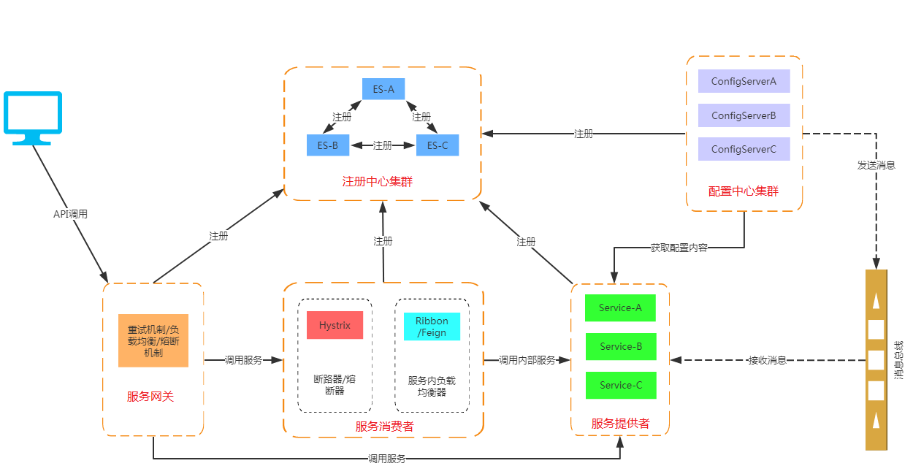
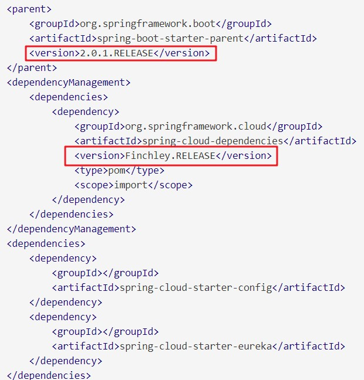
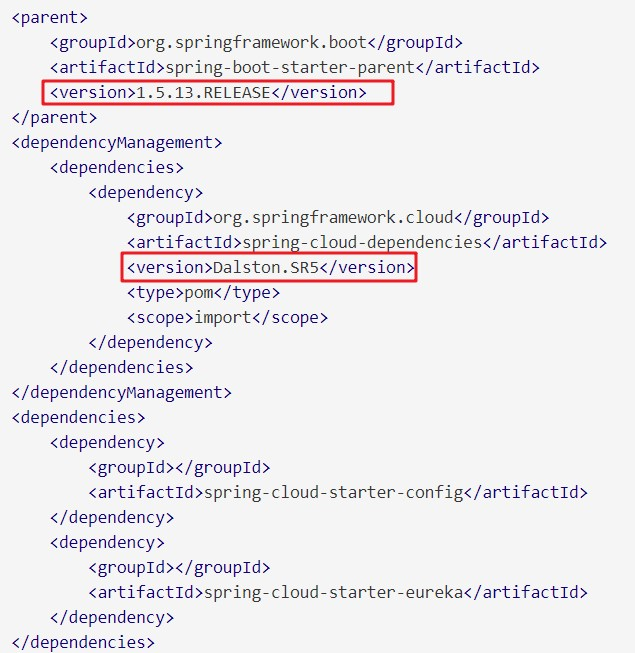
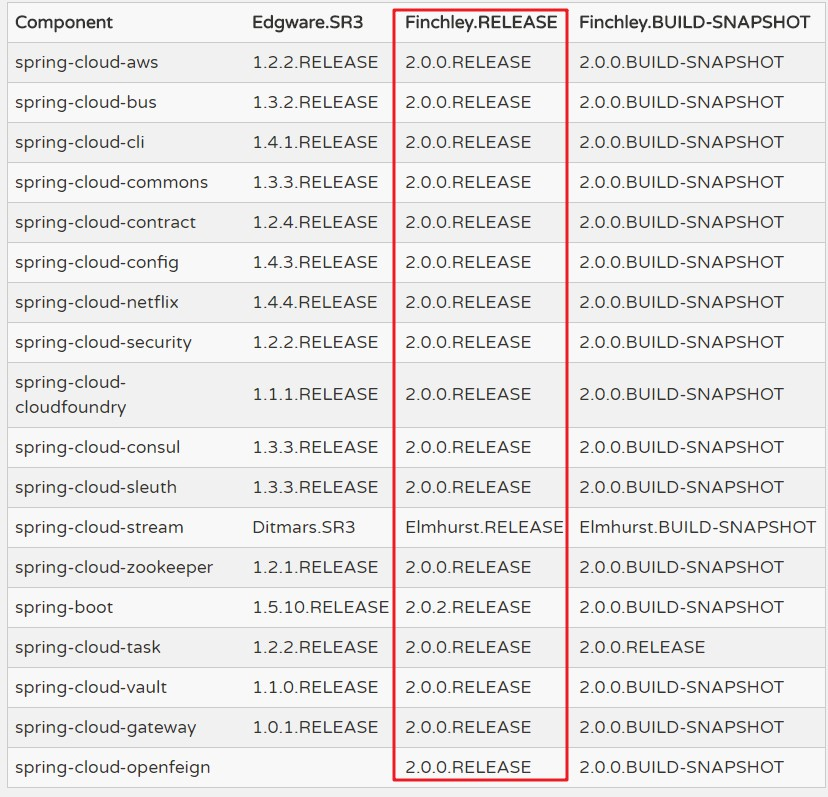
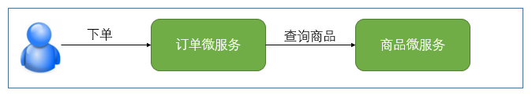
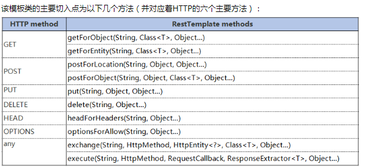

## 1. Spring Cloud 概述

微服务架构的系统是一个分布式系统，按业务领域划分为独立的服务单元，有自动化运维容错、快速演进的特点，它能够解决传统单体架构系统的痛点，同时也能满足复杂的业务需求。

Spring Cloud 是 Java 语言的微服务框架，依赖于 Spring boot。

### 1.1. Spring Cloud 框架的特点

- 约定优于配置
- 适用于各种环境。开发、部署在 PC Server 或各种云环境（如阿里云、AWS等）
- 隐藏了组件的复杂性，并提供声明式、无 xml 的配置方式
- 开箱即用，快速启动
- 轻量级的组件。Spring Cloud 整合的组件大多比较轻量。如：Eureka、Zuul 等等，都是各自领域轻量级的实现
- 组件丰富，功能齐全。Spring Cloud 为微服务架构提供了非常完整的支持，如：配置管理、服务发现、熔断器、微服务网关等
- 选型中立、丰富。支持使用 Eureka、Zookeeper 或 Consul 实现服务发现
- 灵活。Spring Cloud 的组成部分是解耦的

### 1.2. Spring Cloud 和 Spring Boot 的关系

- Spring boot 是 Spring 的一套快速配置脚手架，可以基于spring boot 快速开发单个微服务，Spring Cloud是一个基于Spring Boot实现的云应用开发工具；
- Spring boot专注于快速、方便集成的单个个体，Spring Cloud是关注全局的服务治理框架；
- Spring boot使用了默认大于配置的理念，很多集成方案已经帮你选择好了，能不配置就不配置，Spring Cloud很大的一部分是基于Spring boot来实现，可以不基于Spring boot吗？不可以。
- Spring boot可以离开Spring Cloud独立使用开发项目，但是Spring Cloud离不开Spring boot，属于依赖的关系。
- spring -> spring booot -> spring cloud 这样的关系。

## 2. Spring Cloud 核心组件

Spring Cloud 的本质是在 Spring Boot 的基础上，增加了一堆微服务相关的规范，并对应用上下文（Application Context）进行了功能增强。目前 Spring Cloud 规范已有 Spring 官方，Spring Cloud Netflix，Spring Cloud Alibaba等实现。通过组件化的方式，Spring Cloud 将这些实现整合到一起构成全家桶式的微服务技术栈。主要组件如下：

- **Spring Cloud Config**：分布式配置中心组件，用于将配置文件存储到服务器中进行集中化管理，支持本地存储、Git 和 Subversion 等 3 种存储方式。配置资源直接映射到项目环境。*还有 Apollo 配置中心和基于ZooKeeper 等方式实现的配置中心*。
- **Spring Cloud Netflix**：整合 Netflix OSS 的组件，包含 Eureka、Hystrix、Zuul、Archaius 等
    - **Eureka**：服务注册中心组件，用于服务注册和发现组件。集群中各个服务以 REST 的方式将服务注册到注册中心，并与注册中心保持心跳连接，主要用于服务发现和自动故障转移。
    - **Ribbon**：用于分布式系统客户端 API 调用负载均衡的组件，提供随机负载、轮询负载等多种负载均衡策略，常配合服务发现和断路器使用
    - **Feign**：声明式、模板化 HTTP 服务调用
    - **Hystrix**：服务熔断器组件，主要提供了服务负载过高或服务故障时的容错保护处理机制，以便集群在出现故障时依然能够对外提供服务，防止服务雪崩
    - **Zuul**：API服务集群网关组件，提供通用网关的功能，前端服务访问后端服务均需要通过 Zuul 的动态路由来实现。同时可以在 Zuul 上实现服务的弹性扩展、安全监测、统一权限认证等功能
    - **Archaius**：配置管理库组件，用于实现动态化属性配置和验证、线程安全配置操作、轮询框架、问调机制等功能
    - **Turbine**：实时消息或事件流的聚合工具，常用来监控集群下 Hystrix 的健康指标数据
- **Spring Cloud Bus**：事件消息总线组件，用于监听和传播集群中事件的状态的变化，例如集群中配置的变化检测、广播等
- **Spring Cloud Cloudfoundry**：提供了一个服务发现的实现，将 Pivotal 通过 OAuth 2.0 协议绑定服务到 Cloud Foundry，实现 SSO 和 OAuth2 保护资源。（Cloud Foundry 是 VMware 推出的开源 PaaS 云平台）
- **Spring Cloud Open Service Broker**：为构建一个实现开放服务代理API的服务代理提供了一个起点
- **Spring Cloud Cluster**：提供领导选举（LeaderShip）功能，对 Zookeeper、Redis、Hazelcast、Consul 等常见的有状态模式进行了抽象和实现
- **Spring Cloud Consul**：服务注册中心与配置管理组件，基于 Golang 开发的一个服务注册、发现和配置工具，其功能与 Eureka 类似
- **Spring Cloud Security**：基于 Spring Security 工具包实现的安全管理组件。对服务单元用户验证和权限认证，在 Zuul 代理中提供对负载平衡的 OAuth2 rest 客户端和认证头转发的支持。
- **Spring Cloud Sleuth**：分布式链路追踪组件，基于日志（如ELK）的跟踪，封装了 Dapper 和 Log-based 追踪及 Zipkin、HTrace 操作。
- **Spring Cloud Data Flow**：一个混合计算模型，结合了流式数据与批量数据的处理方式，更便于处理大数据。为现代运行时上的可组合微服务应用提供云原生协调服务。易于使用的DSL、拖放式GUI和REST-APIs共同简化了基于数据管道的微服务的整体协调工作。
- **Spring Cloud Stream**：一个轻量级的事件驱动的微服务框架，可以快速构建可以连接到外部系统的应用程序。让 Apache Kafka、RabbitMQ、Kafa 等在 Spring Boot 应用程序之间发送和接收消息。流式数据处理工具，可以快速实现流式数据分析功能。
- **Spring Cloud Stream Applications**：开箱即用的 Spring Boot 应用，使用 Spring Cloud Stream 中的绑定器抽象，提供与外部中间件系统的集成，如 Apache Kafka、RabbitMQ 等。
- **Spring Cloud Task**：分布式环挠下集群任务的统一管理和调度工具。
- **Spring Cloud Task App Starters**：是 Spring Boot 应用程序，可以是任何进程，包括 Spring Batch 作业，不会永远运行，它们在有限的数据处理期后结束/停止。
- **Spring Cloud Zookeeper**：封装了操作 Apache ZooKeeper 的 API，更便利地使用 Zookeeper 进行服务发现和配置管理
- **Spring Cloud Connectors**：使得各种平台中的 PaaS 应用能够轻松连接到数据库和消息代理等后端服务（该项目以前称为 "Spring Cloud"）。
- **Spring Cloud Starters**：Spring Boot 式的启动项目，为 Spring Cloud 提供开箱即用的依赖管理
- **Spring Cloud CLI**：基于 Spring Boot CLI 插件，用于在 Groovy 中快速创建 Spring Cloud 组件应用程序。
- **Spring Cloud Contract**：总括性项目，包含了帮助用户成功实施消费者驱动合同方法的解决方案。
- **Spring Cloud Gateway**：API服务网关。基于 Project Reactor 的智能和可编程的路由器。
- **Spring Cloud OpenFeign**：声明式，模板化的 HTTP 客户端
- **Spring Cloud Pipelines**：实现以零停机时间的方式进行部署，并且在出现问题时可以轻松回滚。
- **Spring Cloud Function**：通过函数实现业务逻辑。它支持跨无服务器提供商的统一编程模型，以及独立运行的能力（本地或PaaS）

**Spring Cloud Alibaba 组件**：

- Nacos：服务注册中心
- Sentinel：客户端容错保护

## 3. Spring Cloud 体系结构图



Spring Cloud各个组件相互配合，合作支持了一套完整的微服务架构。

- **注册中心**负责服务的注册与发现，很好将各服务连接起来
- **断路器**负责监控服务之间的调用情况，连续多次失败进行熔断保护。
- **API网关**负责转发所有对外的请求和服务
- **配置中心**提供了统一的配置信息管理服务，可以实时的通知各个服务获取最新的配置信息
- **链路追踪**技术可以将所有的请求数据记录下来，方便进行后续分析
- 各个组件又提供了功能完善的**dashboard监控平台**,可以方便的监控各组件的运行状况

## 4. Spring Cloud 版本说明

### 4.1. 版本命名说明

- 多数Spring项目都是以【`主版本号.次版本号.增量版本号.里程碑版本号`】的形式命名版本号的。如：Spring Framework稳定版本4.3.5.RELEASE、里程碑版本5.0.0.M4等
- 其中，主版本号表示项目的重大重构；次版本号表示新特性的添加和变化；增量版本号一般表示bug修复；里程碑版本号表示某版本号的里程碑
- 而Spring Cloud采用了伦敦地铁站的名字，根据字母表的顺序来对应版本时间顺序。以此方式的命名，为了**避免与子项目版本号的重名误解**

### 4.2. Spring Cloud 与 Spring Boot 版本选择示例

- 在选择了 Spring Cloud 版本后，需要在官网上选择对应的子项目的版本。pom.xml 的依赖配置案例如下：
  - Spring Cloud 版本 Finchley.RELEASE 对应 Spring Boot 版本为 2.0.1.RELEASE
  - Spring Cloud 版本 Dalston.SR5 对应 Spring Boot 版本为 1.5.1.RELEASE





### 4.3. Spring Cloud 对应的子项目版本

官网截图（2018.6.24）：https://projects.spring.io/spring-cloud/#quick-start



对应子项目的说明，红色部门是重点掌握

|         Component         | 备注                                                                                        |
| :-----------------------: | :----------------------------------------------------------------------------------------- |
|     spring-cloud-aws      | 用于简化整合Amazon Web Service的组件                                                          |
|     spring-cloud-bus      | 事件、消息总线，用于传播集群中的状态变化或事件。                                                   |
|     spring-cloud-cli      | 用于在Groovy平台创建Spring Cloud应用。                                                         |
|   spring-cloud-commons    | 服务发现、负载均衡、熔断机制这种模式为Spring Cloud客户端提供了一个通用的抽象层。                       |
|   spring-cloud-contract   |                                                                                            |
|  **spring-cloud-config**  | **配置管理工具，支持使用git、svn等存储配置文件。并在支持客户端配置信息的刷新，加密解密配置内容等。** |
| **spring-cloud-netflix**  | **核心组件，对多个Netflix OSS开源套件进行整合。**                                              |
|   spring-cloud-security   | 安全工具包。                                                                                 |
| spring-cloud-cloudfoundry | 整合Pivotal Cloudfoundry（Vmware推出的业界第一个开源PaaS云平台）支持。                            |
|    spring-cloud-consul    | 服务发现与配置管理工具                                                                         |
|  **spring-cloud-sleuth**  | **Spring Cloud应用的分布式跟踪实现。**                                                        |
|  **spring-cloud-stream**  | **通过Redis、RabbitMQ、Kafka实现的消息微服务。**                                              |
|  spring-cloud-zookeeper   | 基于ZooKeeper的服务发现与配置管理组件。                                                         |
|      **spring-boot**      |                                                                                            |
|     spring-cloud-task     | 用于快速构建数据处理的应用。                                                                    |
|    spring-cloud-vault     |                                                                                            |
|   spring-cloud-gateway    | Spring Cloud网关相关的整合实现。                                                               |

## 5. 微服务案例（不使用SpringCloud）

> **此案例代码地址：`spring-cloud-note\spring-cloud-greenwich-sample\01-microservice-no-springcloud\`**

微服务架构的分布式系统，微服务之间通过网络通信。通过服务提供者与服务消费者来描述微服务间的调用关系

> - 服务提供者：服务的被调用方，提供调用接口的一方
> - 服务消费者：服务的调用方，依赖于其他服务的一方

以电商系统中常见的用户下单为例，用户向订单微服务发起一个购买的请求。在进行保存订单之前需要调用商品微服务查询当前商品库存，单价等信息。在这种场景下，订单微服务就是一个服务消费者，商品微服务就是一个服务提供者



### 5.1. 准备数据库表

创建`springcloud_sample_db`数据库，案例中所涉及的表完整建表语句在项目资料`spring-cloud-note\spring-cloud-greenwich-sample\document\sql`中

用户表：

```sql
CREATE TABLE `tb_user` (
	`id` INT ( 11 ) NOT NULL AUTO_INCREMENT,
	`username` VARCHAR ( 40 ) DEFAULT NULL COMMENT '用户名',
	`password` VARCHAR ( 40 ) DEFAULT NULL COMMENT '密码',
	`age` INT ( 3 ) DEFAULT NULL COMMENT '年龄',
	`balance` DECIMAL ( 10, 2 ) DEFAULT NULL COMMENT '余额',
	`address` VARCHAR ( 80 ) DEFAULT NULL COMMENT '地址',
	PRIMARY KEY ( `id` )
) ENGINE = INNODB DEFAULT CHARSET = utf8;
```

商品表：

```sql
CREATE TABLE `tb_product` (
	`id` INT ( 11 ) NOT NULL AUTO_INCREMENT,
	`product_name` VARCHAR ( 40 ) DEFAULT NULL COMMENT '名称',
	`status` INT ( 2 ) DEFAULT NULL COMMENT '状态',
	`price` DECIMAL ( 10, 2 ) DEFAULT NULL COMMENT '单价',
	`product_desc` VARCHAR ( 255 ) DEFAULT NULL COMMENT '描述',
	`caption` VARCHAR ( 255 ) DEFAULT NULL COMMENT '标题',
	`inventory` INT ( 11 ) DEFAULT NULL COMMENT '库存',
	PRIMARY KEY ( `id` )
) ENGINE = INNODB AUTO_INCREMENT = 2 DEFAULT CHARSET = utf8;
```

订单表：

```sql
CREATE TABLE `tb_order` (
	`id` INT ( 11 ) NOT NULL AUTO_INCREMENT,
	`user_id` INT ( 11 ) DEFAULT NULL COMMENT '用户id',
	`product_id` INT ( 11 ) DEFAULT NULL COMMENT '商品id',
	`number` INT ( 11 ) DEFAULT NULL COMMENT '数量',
	`price` DECIMAL ( 10, 2 ) DEFAULT NULL COMMENT '单价',
	`amount` DECIMAL ( 10, 2 ) DEFAULT NULL COMMENT '总额',
	`product_name` VARCHAR ( 40 ) DEFAULT NULL COMMENT '商品名',
	`username` VARCHAR ( 40 ) DEFAULT NULL COMMENT '用户名',
PRIMARY KEY ( `id` )
) ENGINE = INNODB DEFAULT CHARSET = utf8;
```

### 5.2. 搭建环境 - 聚合父工程

创建聚合父工程`01-microservice-no-springcloud`，修改pom.xml文件引入相关依赖

```xml
<modelVersion>4.0.0</modelVersion>
<groupId>com.moon</groupId>
<artifactId>01-microservice-no-springcloud</artifactId>
<version>1.0-SNAPSHOT</version>
<name>${project.artifactId}</name>
<packaging>pom</packaging>
<description>不使用Spring Cloud的情况下实现微服务架构，分析此方法存在的问题</description>

<!-- 引入 spring boot 父工程 -->
<parent>
    <groupId>org.springframework.boot</groupId>
    <artifactId>spring-boot-starter-parent</artifactId>
    <version>2.1.6.RELEASE</version>
</parent>

<!-- 子模块 -->
<modules>
    <module>shop-service-common</module>
    <module>shop-service-product</module>
    <module>shop-service-order</module>
</modules>

<properties>
    <project.build.sourceEncoding>UTF-8</project.build.sourceEncoding>
    <project.reporting.outputEncoding>UTF-8</project.reporting.outputEncoding>
    <java.version>1.8</java.version>
    <mysql-connector-java.version>5.1.32</mysql-connector-java.version>
    <lombok.version>1.18.4</lombok.version>
</properties>

<!-- 版本控制 -->
<dependencyManagement>
    <dependencies>
        <dependency>
            <groupId>mysql</groupId>
            <artifactId>mysql-connector-java</artifactId>
            <version>${mysql-connector-java.version}</version>
        </dependency>
        <dependency>
            <groupId>org.projectlombok</groupId>
            <artifactId>lombok</artifactId>
            <version>${lombok.version}</version>
        </dependency>

        <!-- 子模块版本号控制 -->
        <dependency>
            <groupId>com.moon</groupId>
            <artifactId>shop-service-common</artifactId>
            <version>${project.version}</version>
        </dependency>
    </dependencies>
</dependencyManagement>

<!-- 公共依赖 -->
<dependencies>
    <dependency>
        <groupId>org.springframework.boot</groupId>
        <artifactId>spring-boot-starter-logging</artifactId>
    </dependency>
    <dependency>
        <groupId>org.springframework.boot</groupId>
        <artifactId>spring-boot-starter-test</artifactId>
        <scope>test</scope>
    </dependency>
</dependencies>

<!-- 项目构建部分 -->
<build>
    <plugins>
        <plugin>
            <groupId>org.springframework.boot</groupId>
            <artifactId>spring-boot-maven-plugin</artifactId>
        </plugin>
    </plugins>
</build>
```

### 5.3. 搭建公共模块

#### 5.3.1. 引入依赖

创建`shop-service-common`工程模块，用于存放公共的实体类和工具类。*注：后面的order、product、user模块都会依赖common模块*

```xml
<dependencies>
    <!-- lombok 实体工具类库依赖 -->
    <dependency>
        <groupId>org.projectlombok</groupId>
        <artifactId>lombok</artifactId>
        <scope>provided</scope>
    </dependency>
    <!-- springboot jpa 持久层依赖 -->
    <dependency>
        <groupId>org.springframework.boot</groupId>
        <artifactId>spring-boot-starter-data-jpa</artifactId>
    </dependency>
</dependencies>
```

#### 5.3.2. 创建实体类

在`shop-service-common`工程中创建 `Product` 实体类

```java
@Data
@Entity // 标识为jpa实体类
@Table(name = "tb_product") // 建立实体类和表的映射关系
public class Product {
    @Id // 声明当前私有属性为数据库表的主键
    @GeneratedValue(strategy = GenerationType.IDENTITY) // 配置主键的生成策略
    private Long id;
    private String productName;
    private Integer status;
    private BigDecimal price;
    private String productDesc;
    private String caption;
    private Integer inventory;
}
```

### 5.4. 搭建商品微服务模块

#### 5.4.1. 引入依赖

创建商品微服务模块`shop-service-product`，配置相关依赖

```xml
<dependencies>
    <!-- 公共模块依赖 -->
    <dependency>
        <groupId>com.moon</groupId>
        <artifactId>shop-service-common</artifactId>
    </dependency>

    <!-- springboot web 项目依赖 -->
    <dependency>
        <groupId>org.springframework.boot</groupId>
        <artifactId>spring-boot-starter-web</artifactId>
    </dependency>

    <!-- 数据库连接 -->
    <dependency>
        <groupId>mysql</groupId>
        <artifactId>mysql-connector-java</artifactId>
    </dependency>
</dependencies>
```

#### 5.4.2. 编写dao接口

在`shop-service-product`中创建 `ProductDao` 接口

```java
// 继承JPA相关接口，其中JpaSpecificationExecutor是用于复杂动态查询
public interface ProductDao extends JpaRepository<Product, Long>, JpaSpecificationExecutor<Product> { }
```

#### 5.4.3. 编写service层

在`shop-service-product`中创建 `ProductService` 业务接口与其实现

```java
public interface ProductService {
    /**
     * 根据id查询
     */
    Product findById(Long id);

    /**
     * 查询全部
     */
    List<Product> findAll();

    /**
     * 保存
     */
    void save(Product product);

    /**
     * 更新
     */
    void update(Product product);

    /**
     * 删除
     */
    void delete(Long id);
}
```

```java
@Service
public class ProductServiceImpl implements ProductService {
    @Autowired
    private ProductDao productDao;

    @Override
    public Product findById(Long id) {
        return productDao.findById(id).get();
    }

    @Override
    public List<Product> findAll() {
        return productDao.findAll();
    }

    @Override
    public void save(Product product) {
        productDao.save(product);
    }

    @Override
    public void update(Product product) {
        productDao.save(product);
    }

    @Override
    public void delete(Long id) {
        productDao.deleteById(id);
    }
}
```

#### 5.4.4. 编写controller层

在`shop-service-product`中创建 `ProductController` 控制类

```java
@RestController
@RequestMapping("product")
public class ProductController {
    @Autowired
    private ProductService productService;

    @GetMapping("/{id}")
    public Product findById(@PathVariable Long id) {
        return productService.findById(id);
    }

    @GetMapping
    public List<Product> findAll() {
        return productService.findAll();
    }

    @PostMapping
    public String save(@RequestBody Product product) {
        productService.save(product);
        return "保存成功";
    }

    @PutMapping
    public String update(@RequestBody Product product) {
        productService.update(product);
        return "修改成功";
    }

    @DeleteMapping("/{id}")
    public String delete(@PathVariable Long id) {
        productService.delete(id);
        return "删除成功";
    }
}
```

#### 5.4.5. 编写项目配置文件

在`resources`包下创建SpringBoot项目的核心配置文件`application.yml`

```yml
server:
  port: 9001 # 项目端口
spring:
  application:
    name: shop-service-product # 服务名称
  datasource: # 数据库配置
    driver-class-name: com.mysql.jdbc.Driver
    url: jdbc:mysql://localhost:3306/springcloud_sample_db?useUnicode=true&characterEncoding=utf8
    username: root
    password: 123456
  jpa: # jpa配置
    database: MySQL
    show-sql: true
    open-in-view: true
```

#### 5.4.6. 创建项目启动类

在`shop-service-product`中创建 `ProductApplication` 控制类

```java
@SpringBootApplication(scanBasePackages = "com.moon.product")
@EntityScan("com.moon.entity") // 指定扫描实体类的包路径
public class ProductApplication {
    public static void main(String[] args) {
        SpringApplication.run(ProductApplication.class, args);
    }
}
```

### 5.5. 搭建其他微服务

创建订单微服务模块 `shop-service-order` 与用户微服务模块 `shop-service-user`，搭建的步骤与商品微服务模块一致

### 5.6. 服务的调用

多个基础的微服务中，在用户下单时需要调用商品微服务获取商品数据，此时需要调用商品微服务提供的HTTP接口。所以需要使用http请求的相关工具类完成，如常见的`HttpClient`、`OkHttp`、Spring提供的`RestTemplate`

#### 5.6.1. RestTemplate 简介

Spring框架提供的`RestTemplate`类可用于在应用中调用rest服务，它简化了与http服务的通信方式，统一了RESTful的标准，封装了http链接，只需要传入url及返回值类型即可

RestTemplate类的设计原则与许多其他Spring 模板类(例如`JdbcTemplate`、`JmsTemplate`)相同，简化复杂的操作。`RestTemplate`默认依赖JDK提供http连接的能力（`HttpURLConnection`），如果有需要的话也可以通过`setRequestFactory`方法替换为例如 Apache HttpComponents、Netty或OkHttp等其它HTTP library。

RestTemplate类是为调用REST服务而设计的，因此它的主要方法与REST的基础紧密相连。后者是HTTP协议的方法：HEAD、GET、POST、PUT、DELETE和OPTIONS。例如，`RestTemplate`类具有`headForHeaders()`、`getForObject()`、`postForObject()`、`put()`和`delete()`等方法。

#### 5.6.2. RestTemplate 方法介绍



#### 5.6.3. 通过RestTemplate调用微服务

在`shop-service-order`工程，创建`HttpConfig`配置类，创建`RestTemplate`实例并注册到spring容器中

```java
@Configuration
public class HttpConfig {
    @Bean("restTemplate")
    public RestTemplate createRestTemplate() {
        return new RestTemplate();
    }
}
```

在`shop-service-order`工程`OrderController`控制类中，增加创建订单的方法

```java
@RestController
@RequestMapping("order")
public class OrderController {
    /* 日志对象 */
    private static final Logger LOGGER = LoggerFactory.getLogger(OrderController.class);

    // 注入HTTP请求工具类RestTemplate
    @Autowired
    private RestTemplate restTemplate;

    /**
     * 根据商品id创建订单
     */
    @PostMapping("/{id}")
    public String createOrder(@PathVariable Long id) {
        // 通过http请求，获取商品数据
        Product product = restTemplate.getForObject("http://127.0.0.1:9001/product/" + id, Product.class);
        LOGGER.info("当前下单的商品是: ${}", product);
        return "创建订单成功";
    }
}
```

启动商品与订单微服务，测试调用接口

#### 5.6.4. 硬编码存在的问题

上面示例已经可以通过`RestTemplate`调用商品微服务的RESTFul API接口，但把提供者的网络地址（ip，端口）等硬编码到了代码中，这种做法存在许多问题：

- 应用场景有局限
- 无法动态调整

**解决方法：通过注册中心动态的对服务注册和服务发现**

## 6. Spring Cloud 不同组件的注册中心与服务调用对比总结

> **注：详细用法详见本系列中不同的章节笔记**

### 6.1. 注册中心对比

#### 6.1.1. Eureka

**搭建注册中心**

- 引入 `spring-cloud-starter-netflix-eureka-server` 依赖
- 配置 Eureka Server
- 通过 `@EnableEurekaServer` 激活 Eureka Server 端配置

**服务注册**

- 服务提供者引入 `spring-cloud-starter-netflix-eureka-client` 依赖
- 通过 `eureka.client.serviceUrl.defaultZone` 配置注册中心地址

#### 6.1.2. Consul

**搭建注册中心**

- 下载安装 consul
- 启动 consul `consul agent -dev`

**服务注册**

- 服务提供者引入 `spring-cloud-starter-consul-discovery` 依赖
- 通过 `spring.cloud.consul.host` 和 `spring.cloud.consul.port` 指定 Consul Server 的请求地址

### 6.2. 服务调用对比

#### 6.2.1. Ribbon

- 通过 Ribbon 结合 RestTemplate 方式进行服务调用只需要在声明 RestTemplate 的方法上添加注解 `@LoadBalanced` 即可
- 可以通过 `服务名称.ribbon.NFLoadBalancerRuleClassName` 配置负载均衡策略

#### 6.2.2. Feign

- 服务消费者引入 `spring-cloud-starter-openfeign` 依赖
- 通过 `@FeignClient` 声明一个调用远程微服务接口
- 启动类上通过 `@EnableFeignClients` 激活 Feign

## 7. Spring Cloud 学习参考资源

- [Spring Cloud 官网](https://spring.io/projects/spring-cloud)
- [Spring Cloud 中国社区](http://springcloud.cn/)
- [Spring Cloud 中文网](https://springcloud.cc/)
- [方志朋 Spring Cloud 专栏](https://www.fangzhipeng.com/spring-cloud.html)
- [纯洁的微笑 Spring Cloud 系列文章](http://www.ityouknow.com/spring-cloud)
- [江南一点雨 Spring Cloud](https://wangsong.blog.csdn.net/column/info/17373)
