# Spring Cloud Security

- [官方文档](https://spring.io/projects/spring-cloud-security)

## 1. 概述

Spring Cloud Security 为构建安全的应用程序和分布式服务提供了一套解决方案。在 Spring Boot 和 Spring Security OAuth2 的基础上，可以快速创建系统，实现单点登录、令牌中继和令牌交换等常见模式。

## 2. Spring Cloud Security 环境介绍与搭建

Spring Security OAuth 是对 OAuth2.0 协议的一种实现，并且跟 Spring Security 相辅相成，与 Spring Cloud 体系的集成也非常便利，因为使用 Spring Cloud Security 实现分布式认证授权解决方案

### 2.1. OAuth2.0 服务

OAuth2.0 的服务提供方涵盖两个服务，即**授权服务 (Authorization Server，也叫认证服务) **和**资源服务 (Resource Server)**，使用 Spring Security OAuth2 的时候可以选择把它们在同一个应用程序中实现，也可以选择建立使用同一个授权服务的多个资源服务。

**授权服务 (Authorization Server）**应包含对接入端以及登入用户的合法性进行验证并颁发 token 等功能，对令牌的请求端点由 Spring MVC 控制器进行实现，下面是配置一个认证服务必须要实现的 endpoints：

- `AuthorizationEndpoint` 服务于认证请求。默认 URL：`/oauth/authorize`
- `TokenEndpoint` 服务于访问令牌的请求。默认 URL：`/oauth/token`

**资源服务 (Resource Server)**，应包含对资源的保护功能，对非法请求进行拦截，对请求中 token 进行解析鉴权等，下面的过滤器用于实现 OAuth 2.0 资源服务：

- `OAuth2AuthenticationProcessingFilter` 用来对请求给出的身份令牌解析鉴权。

### 2.2. 示例概述

以下示例分别创建 uaa 授权服务（也可叫认证服务）和 order 订单资源服务


认证流程如下：

1. 客户端请求 UAA 授权服务进行认证。
2. 认证通过后由 UAA 颁发令牌。
3. 客户端携带令牌 Token 请求资源服务。
4. 资源服务校验令牌的合法性，合法即返回资源信息。

### 2.3. 环境搭建

#### 2.3.1. 创建父工程

创建 maven 聚合工程 spring-cloud-security-greenwich，添加依赖如下：

```xml
<?xml version="1.0" encoding="UTF-8"?>
<project xmlns="http://maven.apache.org/POM/4.0.0"
         xmlns:xsi="http://www.w3.org/2001/XMLSchema-instance"
         xsi:schemaLocation="http://maven.apache.org/POM/4.0.0 http://maven.apache.org/xsd/maven-4.0.0.xsd">

    <parent>
        <artifactId>spring-security-sample</artifactId>
        <groupId>com.moon</groupId>
        <version>1.0-SNAPSHOT</version>
    </parent>

    <modelVersion>4.0.0</modelVersion>
    <artifactId>spring-cloud-security-greenwich</artifactId>
    <packaging>pom</packaging>
    <description>
        Spring Cloud Security 示例工程聚合项目
    </description>

    <properties>
        <project.build.sourceEncoding>UTF-8</project.build.sourceEncoding>
        <maven.compiler.source>8</maven.compiler.source>
        <maven.compiler.target>8</maven.compiler.target>
    </properties>

    <dependencyManagement>
        <dependencies>
            <!-- spring cloud 依赖 -->
            <dependency>
                <groupId>org.springframework.cloud</groupId>
                <artifactId>spring-cloud-dependencies</artifactId>
                <version>Greenwich.RELEASE</version>
                <type>pom</type>
                <scope>import</scope>
            </dependency>

            <!-- spring boot 依赖 -->
            <dependency>
                <groupId>org.springframework.boot</groupId>
                <artifactId>spring-boot-dependencies</artifactId>
                <version>2.1.3.RELEASE</version>
                <type>pom</type>
                <scope>import</scope>
            </dependency>

            <dependency>
                <groupId>javax.servlet</groupId>
                <artifactId>javax.servlet-api</artifactId>
                <version>3.1.0</version>
                <scope>provided</scope>
            </dependency>

            <dependency>
                <groupId>javax.interceptor</groupId>
                <artifactId>javax.interceptor-api</artifactId>
                <version>1.2</version>
            </dependency>

            <dependency>
                <groupId>com.alibaba</groupId>
                <artifactId>fastjson</artifactId>
                <version>1.2.47</version>
            </dependency>

            <dependency>
                <groupId>org.projectlombok</groupId>
                <artifactId>lombok</artifactId>
                <version>1.18.22</version>
            </dependency>

            <dependency>
                <groupId>mysql</groupId>
                <artifactId>mysql-connector-java</artifactId>
                <version>5.1.48</version>
            </dependency>

            <!-- jwt 依赖 -->
            <dependency>
                <groupId>org.springframework.security</groupId>
                <artifactId>spring-security-jwt</artifactId>
                <version>1.0.10.RELEASE</version>
            </dependency>

            <!-- oauth2 相关依赖 -->
            <dependency>
                <groupId>org.springframework.security.oauth.boot</groupId>
                <artifactId>spring-security-oauth2-autoconfigure</artifactId>
                <version>2.1.3.RELEASE</version>
            </dependency>
        </dependencies>
    </dependencyManagement>

    <build>
        <finalName>${project.name}</finalName>
        <resources>
            <resource>
                <directory>src/main/resources</directory>
                <filtering>true</filtering>
                <includes>
                    <include>**/*</include>
                </includes>
            </resource>
            <resource>
                <directory>src/main/java</directory>
                <includes>
                    <include>**/*.xml</include>
                </includes>
            </resource>
        </resources>
        <plugins>
            <!--<plugin>
                <groupId>org.springframework.boot</groupId>
                <artifactId>spring-boot-maven-plugin</artifactId>
            </plugin>-->

            <plugin>
                <groupId>org.apache.maven.plugins</groupId>
                <artifactId>maven-compiler-plugin</artifactId>
                <configuration>
                    <source>1.8</source>
                    <target>1.8</target>
                </configuration>
            </plugin>

            <plugin>
                <artifactId>maven-resources-plugin</artifactId>
                <configuration>
                    <encoding>utf-8</encoding>
                    <useDefaultDelimiters>true</useDefaultDelimiters>
                </configuration>
            </plugin>
        </plugins>
    </build>
</project>
```

#### 2.3.2. 创建 UAA 授权服务工程

- 创建授权服务工程 spring-security-uaa，添加如下依赖：

```xml
<?xml version="1.0" encoding="UTF-8"?>
<project xmlns="http://maven.apache.org/POM/4.0.0"
         xmlns:xsi="http://www.w3.org/2001/XMLSchema-instance"
         xsi:schemaLocation="http://maven.apache.org/POM/4.0.0 http://maven.apache.org/xsd/maven-4.0.0.xsd">
    <parent>
        <artifactId>spring-cloud-security-greenwich</artifactId>
        <groupId>com.moon</groupId>
        <version>1.0-SNAPSHOT</version>
    </parent>

    <modelVersion>4.0.0</modelVersion>
    <artifactId>spring-security-uaa</artifactId>
    <description>spring cloud security 授权认证服务</description>

    <dependencies>
        <!--<dependency>
            <groupId>org.springframework.cloud</groupId>
            <artifactId>spring-cloud-starter-netflix-eureka-client</artifactId>
        </dependency>-->

        <dependency>
            <groupId>org.springframework.cloud</groupId>
            <artifactId>spring-cloud-starter-netflix-hystrix</artifactId>
        </dependency>

        <dependency>
            <groupId>org.springframework.cloud</groupId>
            <artifactId>spring-cloud-starter-netflix-ribbon</artifactId>
        </dependency>

        <dependency>
            <groupId>org.springframework.cloud</groupId>
            <artifactId>spring-cloud-starter-openfeign</artifactId>
        </dependency>

        <dependency>
            <groupId>com.netflix.hystrix</groupId>
            <artifactId>hystrix-javanica</artifactId>
        </dependency>

        <dependency>
            <groupId>org.springframework.retry</groupId>
            <artifactId>spring-retry</artifactId>
        </dependency>

        <dependency>
            <groupId>org.springframework.boot</groupId>
            <artifactId>spring-boot-starter-actuator</artifactId>
        </dependency>

        <dependency>
            <groupId>org.springframework.boot</groupId>
            <artifactId>spring-boot-starter-web</artifactId>
        </dependency>

        <dependency>
            <groupId>org.springframework.boot</groupId>
            <artifactId>spring-boot-starter-freemarker</artifactId>
        </dependency>

        <dependency>
            <groupId>org.springframework.data</groupId>
            <artifactId>spring-data-commons</artifactId>
        </dependency>

        <!-- Spring Security 依赖 -->
        <dependency>
            <groupId>org.springframework.cloud</groupId>
            <artifactId>spring-cloud-starter-security</artifactId>
        </dependency>
        <!-- Spring Security OAuth 依赖 -->
        <dependency>
            <groupId>org.springframework.cloud</groupId>
            <artifactId>spring-cloud-starter-oauth2</artifactId>
        </dependency>
        <!-- Spring Security JWT 依赖 -->
        <dependency>
            <groupId>org.springframework.security</groupId>
            <artifactId>spring-security-jwt</artifactId>
        </dependency>

        <dependency>
            <groupId>javax.interceptor</groupId>
            <artifactId>javax.interceptor-api</artifactId>
        </dependency>

        <dependency>
            <groupId>mysql</groupId>
            <artifactId>mysql-connector-java</artifactId>
        </dependency>
        <dependency>
            <groupId>org.springframework.boot</groupId>
            <artifactId>spring-boot-starter-jdbc</artifactId>
        </dependency>

        <dependency>
            <groupId>com.alibaba</groupId>
            <artifactId>fastjson</artifactId>
        </dependency>

        <dependency>
            <groupId>org.projectlombok</groupId>
            <artifactId>lombok</artifactId>
        </dependency>
    </dependencies>

</project>
```

- 创建工程启动类，使用注解开启 eureka、hystrix、feign

```java
@SpringBootApplication
// @EnableDiscoveryClient
@EnableHystrix
@EnableFeignClients(basePackages = {"com.moon.springcloud.security.uaa"})
public class UAAServer {
    public static void main(String[] args) {
        SpringApplication.run(UAAServer.class, args);
    }
}
```

- 在 resource 目录创建项目配置文件 application.yml

```yml
server:
  port: 53020
  servlet:
    context-path: /uaa
  tomcat:
    protocol_header: x-forwarded-proto
    remote_ip_header: x-forwarded-for
  use-forward-headers: true

spring:
  application:
    name: uaa-service
  datasource:
    driver-class-name: com.mysql.jdbc.Driver
    url: jdbc:mysql://localhost:3306/user_db?useUnicode=true&useSSL=false&characterEncoding=UTF-8
    username: root
    password: 123456
  freemarker:
    charset: UTF-8
    content-type: text/html
    enabled: true
    request-context-attribute: rc
    suffix: .html
  http:
    encoding:
      charset: UTF-8
      enabled: true
      force: true
  main:
    allow-bean-definition-overriding: true
  mvc:
    throw-exception-if-no-handler-found: true
  resources:
    add-mappings: false

#eureka:
#  client:
#    serviceUrl:
#      defaultZone: http://localhost:53000/eureka/
#  instance:
#    instance-id: ${spring.application.name}:${spring.cloud.client.ip-address}:${spring.application.instance_id:${server.port}}
#    preferIpAddress: true

feign:
  compression:
    request:
      enabled: true
      mime-types:
        - text/xml
        - application/xml
        - application/json
      min-request-size: 2048
    response:
      enabled: true
  hystrix:
    enabled: true

logging:
  level:
    org:
      springframework:
        web: info
    root: debug

management:
  endpoints:
    web:
      exposure:
        include: refresh,health,info,env
```

创建相关包，最终工程结构如下：


#### 2.3.3. 创建 Order 资源服务工程

本工程为 Order 订单服务工程，访问本工程的资源需要认证通过。此工程的目的主要是测试认证授权的功能，所以不涉及订单管理相关业务。

- 创建 Order 资源服务工程 spring-security-order，添加如下依赖：

```xml
<?xml version="1.0" encoding="UTF-8"?>
<project xmlns="http://maven.apache.org/POM/4.0.0"
         xmlns:xsi="http://www.w3.org/2001/XMLSchema-instance"
         xsi:schemaLocation="http://maven.apache.org/POM/4.0.0 http://maven.apache.org/xsd/maven-4.0.0.xsd">
    <parent>
        <artifactId>spring-cloud-security-greenwich</artifactId>
        <groupId>com.moon</groupId>
        <version>1.0-SNAPSHOT</version>
    </parent>

    <modelVersion>4.0.0</modelVersion>
    <artifactId>spring-security-order</artifactId>
    <description>
        Spring Security 资源服务示例工程。
        此工程的目的主要是测试认证授权的功能，所以不涉及订单管理相关业务。
    </description>

    <dependencies>
        <!--<dependency>
            <groupId>org.springframework.cloud</groupId>
            <artifactId>spring-cloud-starter-netflix-eureka-client</artifactId>
        </dependency>-->

        <dependency>
            <groupId>org.springframework.boot</groupId>
            <artifactId>spring-boot-starter-actuator</artifactId>
        </dependency>

        <dependency>
            <groupId>org.springframework.boot</groupId>
            <artifactId>spring-boot-starter-web</artifactId>
        </dependency>

        <!-- Spring Security 依赖 -->
        <dependency>
            <groupId>org.springframework.cloud</groupId>
            <artifactId>spring-cloud-starter-security</artifactId>
        </dependency>
        <!-- Spring Security OAuth 依赖 -->
        <dependency>
            <groupId>org.springframework.cloud</groupId>
            <artifactId>spring-cloud-starter-oauth2</artifactId>
        </dependency>
        <dependency>
            <groupId>javax.interceptor</groupId>
            <artifactId>javax.interceptor-api</artifactId>
        </dependency>

        <dependency>
            <groupId>com.alibaba</groupId>
            <artifactId>fastjson</artifactId>
        </dependency>

        <dependency>
            <groupId>org.projectlombok</groupId>
            <artifactId>lombok</artifactId>
        </dependency>
    </dependencies>

</project>
```

- 在 resource 目录创建项目配置文件 application.yml

```xml
server:
  port: 53021
  servlet:
    context-path: /order
  tomcat:
    protocol_header: x-forwarded-proto
    remote_ip_header: x-forwarded-for
  use-forward-headers: true

spring:
  application:
    name: order-service
  freemarker:
    charset: UTF-8
    content-type: text/html
    enabled: true
    request-context-attribute: rc
    suffix: .html
  http:
    encoding:
      charset: UTF-8
      enabled: true
      force: true
  main:
    allow-bean-definition-overriding: true
  mvc:
    throw-exception-if-no-handler-found: true
  resources:
    add-mappings: false

#eureka:
#  client:
#    serviceUrl:
#      defaultZone: http://localhost:53000/eureka/
#  instance:
#    instance-id: ${spring.application.name}:${spring.cloud.client.ip-address}:${spring.application.instance_id:${server.port}}
#    preferIpAddress: true

feign:
  compression:
    request:
      enabled: true
      mime-types:
        - text/xml
        - application/xml
        - application/json
      min-request-size: 2048
    response:
      enabled: true
  hystrix:
    enabled: true

logging:
  level:
    org:
      springframework:
        web: info
    root: debug

management:
  endpoints:
    web:
      exposure:
        include: refresh,health,info,env
```

- 创建工程启动类，使用注解开启 eureka、hystrix、feign

```java
@SpringBootApplication
// @EnableDiscoveryClient
public class OrderServer {
    public static void main(String[] args) {
        SpringApplication.run(OrderServer.class, args);
    }
}
```

创建相关包，最终工程结构如下：

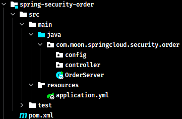

## 3. 授权服务器配置

### 3.1. @EnableAuthorizationServer

在授权服务工程中，使用 `@EnableAuthorizationServer` 注解并继承 `AuthorizationServerConfigurerAdapter` 来配置 OAuth2.0 授权服务器。

在 uaa 工程中的 config 包下，创建 `AuthorizationServerConfig` 授权配置类。

```java
@Configuration
@EnableAuthorizationServer
public class AuthorizationServerConfig extends AuthorizationServerConfigurerAdapter {
}
```

### 3.2. AuthorizationServerConfigurerAdapter

查看 `AuthorizationServerConfigurerAdapter` 源码，发现里面重写的方法都是没有任何逻辑，这就需要使用者按要求配置以下方法形参的几个类，这几个类是由 Spring 创建的独立的配置对象，它们会被 Spring 传入 `AuthorizationServerConfigurer` 中进行配置。

```java
public class AuthorizationServerConfigurerAdapter implements AuthorizationServerConfigurer {

	@Override
	public void configure(AuthorizationServerSecurityConfigurer security) throws Exception {
	}

	@Override
	public void configure(ClientDetailsServiceConfigurer clients) throws Exception {
	}

	@Override
	public void configure(AuthorizationServerEndpointsConfigurer endpoints) throws Exception {
	}

}
```

`AuthorizationServerConfigurerAdapter` 类中配置对象详解如下：

- `ClientDetailsServiceConfigurer`：用来配置客户端详情服务（ClientDetailsService），客户端详情信息在此方法中进行初始化，能够把客户端详情信息使用硬编码或者是通过数据库来存储调取详情信息
- `AuthorizationServerEndpointsConfigurer`：用来配置令牌（token）的访问端点和令牌服务(token services)
- `AuthorizationServerSecurityConfigurer`：用来配置令牌端点的安全约束

### 3.3. 配置客户端详细信息（ClientDetailsServiceConfigurer）

`ClientDetailsServiceConfigurer` 类能够使用内存或者 JDBC 来实现客户端详情服务（`ClientDetailsService`），`ClientDetailsService` 负责查找 `ClientDetails`，而 `ClientDetails` 有几个重要的属性如下列表：

|         属性名         | 描述                                                                         |
| :--------------------: | ---------------------------------------------------------------------------- |
|       `clientId`       | （必须的）用来标识客户的 Id                                                  |
|        `secret`        | （需要值得信任的客户端）客户端安全码，如果有的话                             |
|        `scope`         | 用来限制客户端的访问范围，如果为空（默认）的话，那么客户端拥有全部的访问范围 |
| `authorizedGrantTypes` | 此客户端可以使用的授权类型，默认为空                                         |
|     `authorities`      | 此客户端可以使用的权限（基于 Spring Security authorities）                   |

客户端详情（Client Details）能够在应用程序运行的时候进行更新，可以通过访问底层的存储服务（例如将客户端详情存储在一个关系数据库的表中，就可以使用 `JdbcClientDetailsService`）或者通过自定义实现 `ClientRegistrationService` 接口（同时也可以实现 `ClientDetailsService` 接口）来进行管理。

暂时使用内存方式存储客户端详情信息（实际项目会将客户端信息存入在数据库中进行管理），配置如下:

```java
@Configuration
@EnableAuthorizationServer
public class AuthorizationServerConfig extends AuthorizationServerConfigurerAdapter {
    /**
     * 用来配置客户端详情服务 ClientDetailsService，客户端详情信息在此方法中进行初始化，
     * 这里能够把客户端详情信息使用硬编码或者是通过数据库来存储调取详情信息
     * <p>
     * 此示例目前暂时使用内存的方式存储客户端详情信息
     */
    @Override
    public void configure(ClientDetailsServiceConfigurer clients) throws Exception {
        clients.inMemory() // 使用in‐memory存储
                .withClient("c1") // client_id
                .secret(new BCryptPasswordEncoder().encode("secret")) // 客户端密钥
                .resourceIds("res1") // 资源列表
                .authorizedGrantTypes("authorization_code", "password", "client_credentials", "implicit", "refresh_token") // 该client允许的授权类型
                .scopes("all") // 允许的授权范围
                .autoApprove(false) // 发放令牌时，是否跳转授权页面，true-代表不跳转，false-代表跳转
                .redirectUris("http://www.baidu.com"); // 验证回调地址
    }
}
```

### 3.4. 管理令牌（AuthorizationServerTokenServices）

`AuthorizationServerTokenServices` 接口定义了一些操作方法，可以对令牌进行一些必要的管理，令牌可以被用来加载身份信息，里面包含了这个令牌的相关权限。

```java
public interface AuthorizationServerTokenServices {
	/**
	 * Create an access token associated with the specified credentials.
	 * @param authentication The credentials associated with the access token.
	 * @return The access token.
	 * @throws AuthenticationException If the credentials are inadequate.
	 */
	OAuth2AccessToken createAccessToken(OAuth2Authentication authentication) throws AuthenticationException;

	/**
	 * Refresh an access token. The authorization request should be used for 2 things (at least): to validate that the
	 * client id of the original access token is the same as the one requesting the refresh, and to narrow the scopes
	 * (if provided).
	 *
	 * @param refreshToken The details about the refresh token.
	 * @param tokenRequest The incoming token request.
	 * @return The (new) access token.
	 * @throws AuthenticationException If the refresh token is invalid or expired.
	 */
	OAuth2AccessToken refreshAccessToken(String refreshToken, TokenRequest tokenRequest)
			throws AuthenticationException;

	/**
	 * Retrieve an access token stored against the provided authentication key, if it exists.
	 *
	 * @param authentication the authentication key for the access token
	 *
	 * @return the access token or null if there was none
	 */
	OAuth2AccessToken getAccessToken(OAuth2Authentication authentication);

}
```

#### 3.4.1. DefaultTokenServices 抽象实现类

可以自定义创建 `AuthorizationServerTokenServices` 接口的实现，通常都需要继承 `DefaultTokenServices` 抽象类。此类中包含了一些有用方法实现，可以使用它来修改令牌的格式和令牌的存储。默认的，当它尝试创建一个令牌的时候，是使用随机值来进行填充的，除了持久化令牌是委托一个 `TokenStore` 接口来实现以外，这个类几乎完成了所有的事情。

```java
public class DefaultTokenServices implements AuthorizationServerTokenServices, ResourceServerTokenServices,
		ConsumerTokenServices, InitializingBean {
}
```

#### 3.4.2. TokenStore 接口

`TokenStore` 接口主要是用于持久化令牌，该接口有一个默认的实现是 `InMemoryTokenStore`，此实现的所有令牌是被保存在了内存中。除了使用这个实现类以外，还可以使用一些其他的框架提供的实现类，以下是默认提供的 `TokenStore` 接口实现：


- `InMemoryTokenStore`：这个版本的实现是被默认采用的，它可以完美的工作在单服务器上（即访问并发量压力不大的情况下，并且它在失败的时候不会进行备份），大多数的项目都可以使用这个版本的实现来进行尝试，可以在开发的时候使用它来进行管理，因为不会被保存到磁盘中，所以更易于调试
- `JdbcTokenStore`：这是一个基于 JDBC 的实现版本，令牌会被保存进关系型数据库。使用这个版本的实现时，可以在不同的服务器之间共享令牌信息，使用这个版本的时候请注意把"spring-jdbc"依赖加入到项目中
- `JwtTokenStore`：这个版本的全称是 JSON Web Token（JWT），它可以把令牌相关的数据进行编码（因此对于后端服务来说，它不需要进行存储，这将是一个重大优势），但是它有一个缺点，那就是撤销一个已经授权令牌将会非常困难，所以它通常用来处理一个生命周期较短的令牌以及撤销刷新令牌（refresh_token）。另外一个缺点就是这个令牌占用的空间会比较大，如果加入了比较多用户凭证信息。`JwtTokenStore` 不会保存任何数据，但是它在转换令牌值以及授权信息方面与 `DefaultTokenServices` 所扮演的角色是一样的

#### 3.4.3. 令牌管理配置类

在 uaa 授权服务工程的 config 包下创建令牌专用的配置类 `TokenConfig`，目前暂时先使用 `InMemoryTokenStore`，生成一个普通的令牌。

```java
@Configuration
public class TokenConfig {
    /**
     * 创建令牌的存储策略实例
     */
    @Bean
    public TokenStore tokenStore() {
        // 使用内存存储令牌（普通令牌）
        return new InMemoryTokenStore();
    }
}
```

修改授权服务配置类 `AuthorizationServerConfig`，注入 `TokenStore` 和 `ClientDetailsService` 实例，创建创建 `AuthorizationServerTokenServices` 令牌管理服务实例

```java
@Configuration
@EnableAuthorizationServer
public class AuthorizationServerConfig extends AuthorizationServerConfigurerAdapter {

    @Autowired
    private TokenStore tokenStore;

    @Autowired
    private ClientDetailsService clientDetailsService;

    /**
     * 创建令牌管理服务对象
     *
     * @return
     */
    @Bean
    public AuthorizationServerTokenServices tokenService() {
        DefaultTokenServices service = new DefaultTokenServices();
        service.setClientDetailsService(clientDetailsService); // 客户端详情服务
        service.setSupportRefreshToken(true); // 支持刷新令牌
        service.setTokenStore(tokenStore); // 令牌存储策略
        service.setAccessTokenValiditySeconds(7200); // 令牌默认有效期2小时
        service.setRefreshTokenValiditySeconds(259200); // 刷新令牌默认有效期3天
        return service;
    }
    ....
}
```

### 3.5. 令牌访问端点配置（AuthorizationServerEndpointsConfigurer）

`AuthorizationServerEndpointsConfigurer` 这个对象的实例可以完成令牌服务以及令牌 endpoint (端点)配置。

#### 3.5.1. 配置授权类型（Grant Types）

`AuthorizationServerEndpointsConfigurer` 通过设定以下属性决定支持的授权类型（Grant Types）：

- `authenticationManager`：认证管理器，当选择了资源所有者密码（password）授权类型的时候，请设置这个属性注入一个 `AuthenticationManager` 对象。
- `userDetailsService`：如果设置了这个属性的话，那说明有一个自定义的 `UserDetailsService` 接口的实现，或者可以把这个东西设置到全局域上面去（例如 `GlobalAuthenticationManagerConfigurer` 这个配置对象），当设置了这个之后，那么 "`refresh_token`" 即刷新令牌授权类型模式的流程中就会包含一个检查，用来确保这个账号是否仍然有效，假如说禁用了这个账户的话。
- `authorizationCodeServices`：这个属性是用来设置授权码服务的（即 `AuthorizationCodeServices` 的实例对象），主要用于 "`authorization_code`" 授权码类型模式。
- `implicitGrantService`：这个属性用于设置隐式授权模式，用来管理隐式授权模式的状态。
- `tokenGranter`：当设置了这个东西（即 TokenGranter 接口实现），那么授权将会交由使用者来完全掌控，并且会忽略掉上面的这几个属性，这个属性一般是用作拓展用途的，即标准的四种授权模式已经满足不了需求的时候，才会考虑使用这个。

#### 3.5.2. 配置授权端点的 URL（Endpoint URLs）

`AuthorizationServerEndpointsConfigurer` 这个配置类中，`pathMapping()` 方法用来配置端点 URL 链接，它有两个参数：

```java
public AuthorizationServerEndpointsConfigurer pathMapping(String defaultPath, String customPath) {
	this.patternMap.put(defaultPath, customPath);
	return this;
}
```

- `String defaultPath`：这个端点 URL 的默认链接
- `String customPath`：要进行替代的 URL 链接

以上的参数值均以 "`/`" 字符为开始的字符串，框架的默认 URL 链接如下列表，可以作为这个 `pathMapping()` 方法的第一个参数：

- `/oauth/authorize`：授权端点
- `/oauth/token`：令牌端点
- `/oauth/confirm_access`：用户确认授权提交端点
- `/oauth/error`：授权服务错误信息端点
- `/oauth/check_token`：用于资源服务访问的令牌解析端点
- `/oauth/token_key`：提供公有密匙的端点，如果使用 JWT 令牌的话

<font color=red>**需要注意的是，授权端点这个 URL 应该被 Spring Security 保护起来只供授权用户访问**</font>

#### 3.5.3. 配置令牌访问端点

修改授权服务配置类 `AuthorizationServerConfig`，配置令牌访问端点

```java
@Autowired
private AuthorizationCodeServices authorizationCodeServices;

@Autowired
private AuthenticationManager authenticationManager;

/**
 * 配置令牌访问端点
 */
@Override
public void configure(AuthorizationServerEndpointsConfigurer endpoints) {
    endpoints
            .authenticationManager(authenticationManager) // 认证管理器
            .authorizationCodeServices(authorizationCodeServices) // 授权码服务
            .tokenServices(tokenService()) // 令牌管理服务
            .allowedTokenEndpointRequestMethods(HttpMethod.POST);
}

/**
 * 设置授权码模式的授权码如何存取
 */
@Bean
public AuthorizationCodeServices authorizationCodeServices() {
    return new InMemoryAuthorizationCodeServices(); // 暂时采用内存方式
}
```

### 3.6. 令牌端点的安全约束

`AuthorizationServerSecurityConfigurer` 用来配置令牌端点(Token Endpoint)的安全约束

修改授权服务配置类 `AuthorizationServerConfig`，增加如下配置：

```java
/**
 * 配置令牌端点(Token Endpoint)的安全约束
 */
@Override
public void configure(AuthorizationServerSecurityConfigurer security) throws Exception {
    security.tokenKeyAccess("permitAll()") // oauth/token_key是公开
            .checkTokenAccess("permitAll()") // oauth/check_token公开
            .allowFormAuthenticationForClients(); // 表单认证（申请令牌）
}
```

- `tokenKeyAccess("permitAll()")`：表示 `oauth/token_key` 这个 endpoint 当使用 JwtToken 且使用非对称加密时，资源服务用于获取公钥而开放的，这里指这个 endpoint 完全公开。
- `checkTokenAccess("permitAll()")`：表示 `oauth/check_token` 这个 endpoint 完全公开
- `allowFormAuthenticationForClients()`：允许表单认证

### 3.7. Spring Security 安全配置

在 uaa 工程中，创建 Spring Security 安全配置类 `WebSecurityConfig`，继承 `WebSecurityConfigurerAdapter` 类。配置创建认证管理器、密码编码器、安全拦截机制

```java
@Configuration
public class WebSecurityConfig extends WebSecurityConfigurerAdapter {

    /**
     * 创建认证管理器实例
     */
    @Bean
    public AuthenticationManager authenticationManagerBean() throws Exception {
        return super.authenticationManagerBean();
    }

    /**
     * 密码编码器，即设置登陆时密码的校验
     */
    @Bean
    public PasswordEncoder passwordEncoder() {
        return new BCryptPasswordEncoder();
    }

    /**
     * 安全拦截机制（最重要）
     */
    @Override
    protected void configure(HttpSecurity http) throws Exception {
        http.csrf().disable() // 屏蔽 CSRF（Cross-site request forgery跨站请求伪造）控制
                .authorizeRequests()
                .antMatchers("/check/p1").hasAuthority("p1") // 设置拥有p1权限访问的url
                .antMatchers("/check/p2").hasAuthority("p2") // 设置拥有p2权限访问的url
                .antMatchers("/login*").permitAll() // 设置所有 /login 开头的请求均可以访问
                .anyRequest().authenticated()  // 设置除了上面配置的url，其它的请求可以访问
                .and()
                .formLogin(); // 允许表单登录
    }
}
```

> 上面配置令牌访问端点的 `AuthenticationManager` 认证管理器，是在此安全配置类中初始化。因为为了使用 `WebSecurityConfigurerAdapter` 父类的 `authenticationManagerBean` 方法，所以配置在此类中。

### 3.8. 自定义连接数据库认证 UserDetailService 接口实现

授权服务需要

此部分参考[《Spring Security》笔记的《自定义连接数据库认证》章节](/后端框架/Authorization-Certification/Spring-Security?id=_42-自定义连接数据库认证)

> 将 `spring-security-boot-2.1.x` 项目中的 dao、model、service 的代码复制到 uaa 项目中

### 3.9. 授权服务配置总结

授权服务配置分成三大块，可以关联记忆。

- 要完成认证，它首先得知道客户端信息从哪儿读取，因此要进行客户端详情配置。
- 要颁发 token，那必须得定义 token 的相关 endpoint，以及 token 如何存取，以及客户端支持哪些类型的 token。
- 暴露除了一些 endpoint，那对这些 endpoint 可以定义一些安全上的约束等。

至此，授权服务器已经搭建完成。

## 4. OAuth2.0 支持的授权模式种类

OAuth2.0 提供了 4 种授权模式，分别是：

- 授权码模式（Authorization Code）
- 隐式授权模式（Implicit）
- 密码模式（Resource Owner Password Credentials）
- 客户端模式（Client Credentials）

> 其中**授权码模式**和**密码模式**应用较多，本次暂时使用授权码模式

### 4.1. 授权码模式

#### 4.1.1. 授权码模式交互图

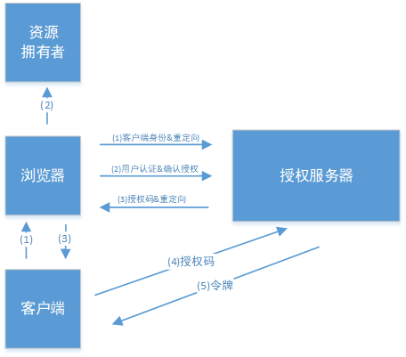

#### 4.1.2. 授权码授权流程

1. **资源拥有者打开客户端，客户端要求资源拥有者给予授权，它将浏览器被重定向到授权服务器，重定向时会附加客户端的身份信息**。请求认证服务获取授权码(GET 请求)，如上示例：

```
http://授权服务地址/uaa/oauth/authorize?client_id=客户端准入id&response_type=code&scope=客户端权限范围&redirect_uri=授权码申请成功后会跳转地址
```

参数列表如下：

- `client_id`：客户端准入 id，和授权配置类（_示例中的`AuthorizationServerConfig`_）中设置的客户端 id 一致。
- `response_type`：授权码模式固定为 code
- `scop`：客户端权限范围，和授权配置类（_示例中的`AuthorizationServerConfig`_）中设置的 `scop` 一致。
- `redirect_uri`：跳转 uri，当授权码申请成功后会跳转到此地址，并在后边带上 code 参数（授权码）

2. **登陆成功后，浏览器会出现向授权服务器授权页面，之后将用户同意授权**。
3. **点击“Authorize”按钮后，授权服务器将授权码（AuthorizationCode）转经浏览器发送给 client (通过 redirect_uri)，url 后边会带上 code 参数（授权码）**。
4. **客户端拿着授权码向授权服务器索要访问 access_token 令牌**，post 请求如下：

```
http://授权服务地址/uaa/oauth/token
```

请求参数列表如下

- `client_id`：客户端准入标识。
- `client_secret`：客户端秘钥，和授权配置类（_示例中的`AuthorizationServerConfig`_）中设置的 `secret` 一致。
- `grant_type`：授权类型，填写 `authorization_code`，表示授权码模式
- `code`：授权码，就是刚刚上一步获取的授权码，<font color=red>**注意：授权码只使用一次就无效了，需要重新申请**</font>
- `redirect_uri`：申请授权码时的跳转 url，<font color=red>**一定和申请授权码时用的 redirect_uri 一致**</font>

5. **授权服务器返回令牌(access_token)**

#### 4.1.3. 适用场景

这种模式是四种模式中最安全的一种模式。一般用于 client 是 Web 服务器端应用或第三方的原生 App 调用资源服务的时候。因为在这种模式中 access_token 不会经过浏览器或移动端的 App，而是直接从服务端去交换，这样就最大限度的减小了令牌泄漏的风险。

#### 4.1.4. 测试

浏览器访问认证页面：

```
http://127.0.0.1:53020/uaa/oauth/authorize?client_id=c1&response_type=code&scope=all&redirect_uri=http://www.baidu.com
```

然后输入模拟的账号和密码点登陆之后进入授权页面：

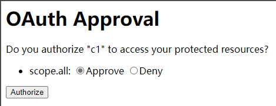

确认授权后，浏览器会重定向到指定路径（如果连接数据库的话，会是 oauth_client_details 表中的 web_server_redirect_uri）并附加验证码 `?code=SvCnr4`（每次登陆都不一样），最后使用该验证码获取 token。

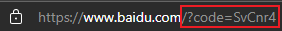

使用 postman 发送 post 请求

```
POST http://localhost:53020/uaa/oauth/token
```

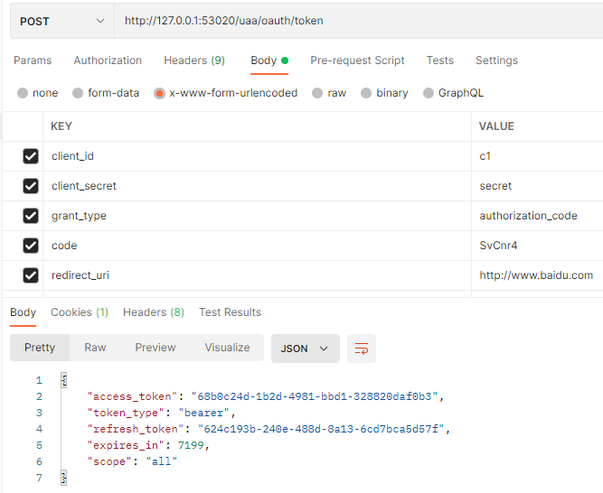

响应数据示例如下：

```json
{
  "access_token": "68b0c24d-1b2d-4981-bbd1-328820daf0b3",
  "token_type": "bearer",
  "refresh_token": "624c193b-240e-488d-8a13-6cd7bca5d57f",
  "expires_in": 7199,
  "scope": "all"
}
```

### 4.2. 简化模式

#### 4.2.1. 简化模式交互图

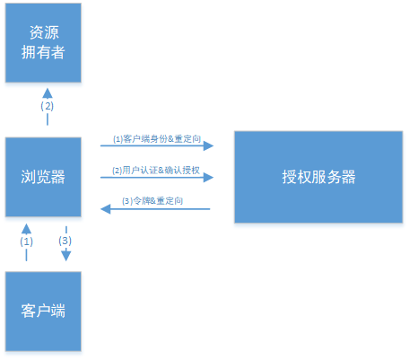

#### 4.2.2. 简化模式授权流程

1. **资源拥有者打开客户端，客户端要求资源拥有者给予授权，它将浏览器被重定向到授权服务器，重定向时会附加客户端的身份信息**

```
http://授权服务地址/uaa/oauth/authorize?client_id=客户端准入id&response_type=token&scope=客户端权限范围&redirect_uri=授权码申请成功后会跳转地址
```

> 参数描述同授权码模式 ，注意`response_type=token`，说明是简化模式。

2. **登陆成功后，浏览器出现向授权服务器授权页面，之后将用户同意授权**
3. **授权服务器将授权码将令牌（access_token）以 Hash 的形式存放在重定向 uri 的 fargment 中发送给浏览器**

> 注：fragment 主要是用来标识 URI 所标识资源里的某个资源，在 URI 的末尾通过 （`#`）作为 fragment 的开头，其中 `#` 不属于 fragment 的值。如 `https://domain/index#L18` 这个 URI 中 `L18` 就是 fragment 的值。使用者只需要知道 js 通过响应浏览器地址栏变化的方式能获取到 fragment 就行了。

#### 4.2.3. 适用场景

一般来说，简化模式用于没有服务器端的第三方单页面应用，因为没有服务器端就无法接收授权码。

#### 4.2.4. 测试

浏览器访问认证页面：

```
http://127.0.0.1:53020/uaa/oauth/authorize?client_id=c1&response_type=token&scope=all&redirect_uri=http://www.baidu.com
```

然后输入模拟的账号和密码点登陆之后进入授权页面。

确认授权后，浏览器会重定向到指定路径（oauth_client_details 表中的 web_server_redirect_uri）并以 Hash 的形式存放在重定向 uri 的 fargment 中,如：

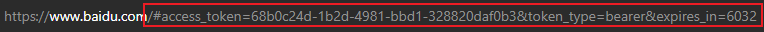

### 4.3. 密码模式

#### 4.3.1. 密码模式交互图

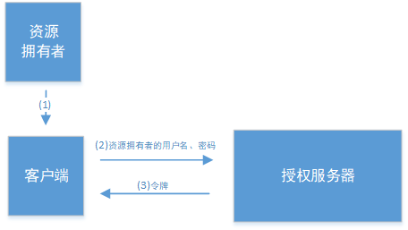

#### 4.3.2. 密码模式授权流程

1. **资源拥有者将用户名、密码发送给客户端**
2. **客户端拿着资源拥有者的用户名、密码向授权服务器请求令牌（access_token）**，post 请求请求如下：

```
http://授权服务地址/uaa/oauth/token
```

请求 body 参数列表如下：

- `client_id`：客户端准入标识
- `client_secret`：客户端秘钥。和授权配置类（_示例中的`AuthorizationServerConfig`_）中设置的 `secret` 一致
- `grant_type`：授权类型，填写 `password` 表示密码模式
- `username`：资源拥有者用户名
- `password`：资源拥有者密码

3. **授权服务器将令牌（access_token）发送给 client**

#### 4.3.3. 适用场景

这种模式十分简单，但是却意味着直接将用户敏感信息泄漏给了 client 端，因此密码模式一般用于自己开发的 client 端，第一方原生 App 或第一方单页面应用。

#### 4.3.4. 测试

使用 postman 发送 post 请求

```
POST http://127.0.0.1:53020/uaa/oauth/token
```

请求参数与响应结果：

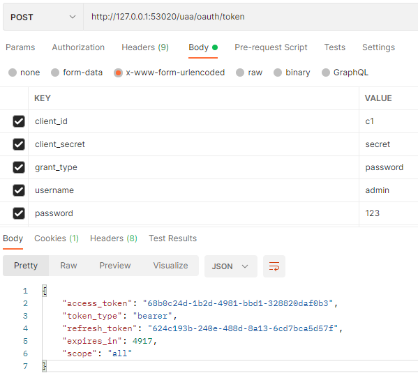

### 4.4. 客户端模式

#### 4.4.1. 客户端模式交互图

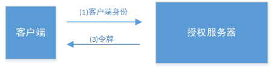

#### 4.4.2. 客户端模式授权流程

1. **客户端向授权服务器发送自己的身份信息，并请求令牌（access_token）**
2. **确认客户端身份无误后，将令牌（access_token）发送给 client**，请求如下：

```
http://授权服务地址/uaa/oauth/token
```

请求 body 参数列表如下：

- `client_id`：客户端准入标识。
- `client_secret`：客户端秘钥。
- `grant_type`：授权类型，填写 `client_credentials` 表示客户端模式

#### 4.4.3. 适用场景

这种模式是最方便但最不安全的模式。因此这就要求对 client 完全的信任，而 client 本身也是安全的。因此这种模式一般用来提供给完全信任的服务器端服务。比如，合作方系统对接，拉取一组用户信息。

#### 4.4.4. 测试

使用 postman 发送 post 请求

```
POST http://127.0.0.1:53020/uaa/oauth/token
```

请求参数与响应结果：


## 5. 资源服务接入授权

> 此示例的资源服务是指 order 服务工程

### 5.1. 资源服务器配置

在 `spring-security-order` 工程中的 config 包下，创建资源服务的配置类

#### 5.1.1. @EnableResourceServer 注解

使用 `@EnableResourceServer` 注解标识在有 `@Configuration` 的配置类上，并且必须实现 `ResourceServerConfigurer` 接口来进行资源服务的配置，也可以选择继承自 `ResourceServerConfigurerAdapter` 抽象类，然后重写其中接口的方法，参数就是这个对象的实例

```java
@Configuration
@EnableResourceServer
public class ResouceServerConfig extends ResourceServerConfigurerAdapter {
}
```

#### 5.1.2. ResourceServerConfigurer 接口

此接口是定义了资源服务的配置文件，源码如下：

```java
public interface ResourceServerConfigurer {
	/**
	 * Add resource-server specific properties (like a resource id). The defaults should work for many applications, but
	 * you might want to change at least the resource id.
	 *
	 * @param resources configurer for the resource server
	 * @throws Exception if there is a problem
	 */
	void configure(ResourceServerSecurityConfigurer resources) throws Exception;

	/**
	 * Use this to configure the access rules for secure resources. By default all resources <i>not</i> in "/oauth/**"
	 * are protected (but no specific rules about scopes are given, for instance). You also get an
	 * {@link OAuth2WebSecurityExpressionHandler} by default.
	 *
	 * @param http the current http filter configuration
	 * @throws Exception if there is a problem
	 */
	void configure(HttpSecurity http) throws Exception;
}
```

#### 5.1.3. ResourceServerConfigurerAdapter 抽象实现类

此抽象类实现了 `ResourceServerConfigurer` 接口，通常资源服务的配置类都可以选择继承此抽象类

```java
public class ResourceServerConfigurerAdapter implements ResourceServerConfigurer {
	@Override
	public void configure(ResourceServerSecurityConfigurer resources) throws Exception {
	}

	@Override
	public void configure(HttpSecurity http) throws Exception {
		http.authorizeRequests().anyRequest().authenticated();
	}
}
```

#### 5.1.4. 资源服务相关配置

`ResourceServerSecurityConfigurer` 对象可以配置的属性：

- `tokenServices`：`ResourceServerTokenServices` 类的实例，用来实现令牌服务。
- `tokenStore`：`TokenStore` 类的实例，指定令牌如何访问，与 `tokenServices` 配置可选
- `resourceId`：这个资源服务的 ID，这个属性是可选的，但是推荐设置并在授权服务中进行验证。
- 其他的拓展属性例如 `tokenExtractor` 令牌提取器用来提取请求中的令牌。

`HttpSecurity` 配置与 Spring Security 类似：

- 请求匹配器，用来设置需要进行保护的资源路径，默认的情况下是保护资源服务的全部路径。
- 通过 `http.authorizeRequests()` 来设置受保护资源的访问规则
- 其他的自定义权限保护规则通过 `HttpSecurity` 来进行配置。

```java
@Configuration
@EnableResourceServer
public class ResouceServerConfig extends ResourceServerConfigurerAdapter {
    /**
     * 服务资源id，与授权服务器中配置类的 clients.resourceIds("res1") 值一致
     */
    public static final String RESOURCE_ID = "res1";

    @Override
    public void configure(ResourceServerSecurityConfigurer resources) throws Exception {
        resources.resourceId(RESOURCE_ID) // 配置资源id
                .tokenServices(tokenService()) // 验证令牌的服务
                .stateless(true);
    }

    @Override
    public void configure(HttpSecurity http) throws Exception {
        http.authorizeRequests()
                .antMatchers("/**").access("#oauth2.hasScope('all')") // 配置访问的限制规则
                .and()
                .csrf().disable() // 设置不再限制 CSRF
                .sessionManagement().sessionCreationPolicy(SessionCreationPolicy.STATELESS); // 配置不生成本地 session
    }

    /**
     * 资源服务令牌解析服务
     *
     * @return
     */
    @Bean
    public ResourceServerTokenServices tokenService() {
        //使 用远程服务请求授权服务器校验token,必须指定校验token 的url、client_id，client_secret
        RemoteTokenServices service = new RemoteTokenServices();
        service.setCheckTokenEndpointUrl("http://localhost:53020/uaa/oauth/check_token");
        service.setClientId("c1");
        service.setClientSecret("secret");
        return service;
    }
}
```

> _其中 `ResourceServerTokenServices` 对象的配置说明详见下节_

### 5.2. 验证 token

`ResourceServerTokenServices` 是组成授权服务的另一半，如果授权服务和资源服务在同一个应用程序上的话，可以直接使用 `DefaultTokenServices`，这样的话，就不用考虑关于实现所有必要的接口的一致性问题。但如果资源服务器是分离开的，那么就必须要确保能够有匹配授权服务提供的 `ResourceServerTokenServices`，它知道如何对令牌进行解码。

令牌解析方法：使用 `DefaultTokenServices` 在资源服务器本地配置令牌存储、解码、解析方式 使用 `RemoteTokenServices` 资源服务器通过 HTTP 请求来解码令牌，每次都请求授权服务器端点 `/oauth/check_token`

使用授权服务的 `/oauth/check_token` 端点需要在授权服务将这个端点暴露出去，以便资源服务可以进行访问，这个已经在示例的授权服务中配置。在示例中，授权服务中配置了 `/oauth/check_token` 和 `/oauth/token_key` 这两个端点：

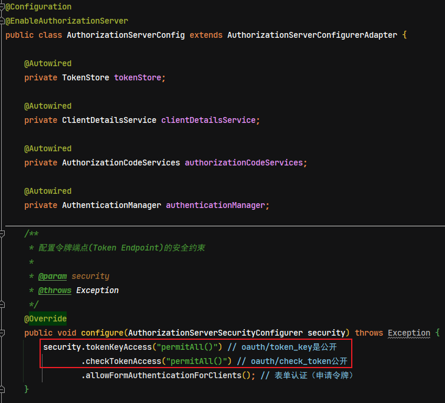

所以在资源服务中配置 `RemoteTokenServices`，相应的 `ResouceServerConfig` 中配置如下：

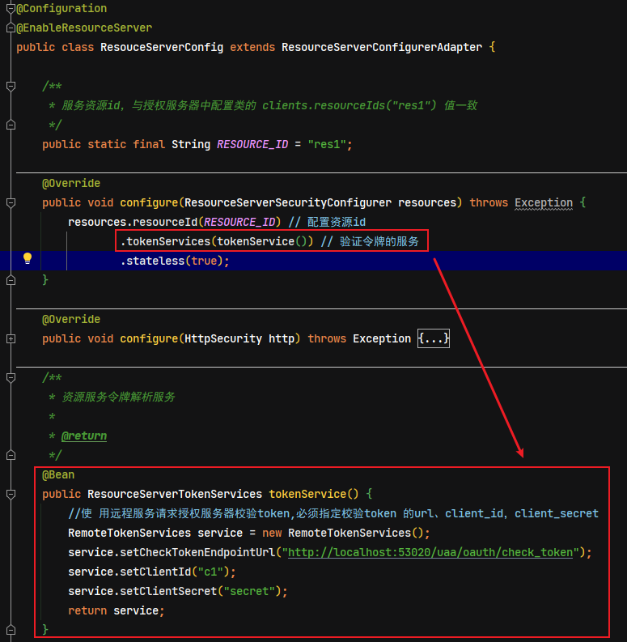

### 5.3. 编写资源

在 controller 包下编写 `OrderController` 类，此类表示订单资源的访问类：

```java
@RestController
public class OrderController {
    @GetMapping(value = "/check/p1")
    @PreAuthorize("hasAuthority('p1')") // 使用方法授权配置，拥有 p1 权限方可访问此url
    public String p1() {
        return "访问资源1";
    }
}
```

### 5.4. 添加安全访问控制

在 config 包下创建 Spring Security 的安全配置类 `WebSecurityConfig`，添加如下配置：

```java
@Configuration
@EnableGlobalMethodSecurity(prePostEnabled = true)
public class WebSecurityConfig extends WebSecurityConfigurerAdapter {
    /**
     * 安全拦截机制（最重要）
     *
     * @param http
     * @throws Exception
     */
    @Override
    protected void configure(HttpSecurity http) throws Exception {
        http.csrf().disable() // 屏蔽 CSRF（Cross-site request forgery跨站请求伪造）控制
                .authorizeRequests()
                .antMatchers("/check/**").authenticated() // 设置所有 /check/** 的请求必须认证通过
                .anyRequest().permitAll();  // 设置除了上面配置的 /check/**，其它的请求可以访问
    }
}
```

> _注：此安全配置类可以参考授权服务的配置_

### 5.5. 测试

启动 uaa 授权服务与 order 资源服务

#### 5.5.1. 申请令牌

本测试使用密码模式申请令牌。发送 post 请求

```
http://127.0.0.1:53020/uaa/oauth/token
```

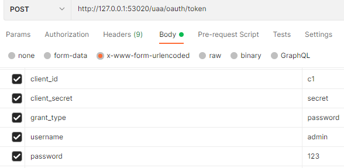

响应的结果是：

```json
{
  "access_token": "2304c571-60ce-4461-8686-e995373d5fbb",
  "token_type": "bearer",
  "refresh_token": "091f4a41-52d4-4a56-85f4-6a1979c73f72",
  "expires_in": 7199,
  "scope": "all"
}
```

#### 5.5.2. 请求资源

按照 oauth2.0 协议要求，请求资源需要携带 token，请求 url 如下：

```
http://127.0.0.1:53021/order/check/p1
```

如果不携带 token 或者 token 错误的，就请求授权失败，如下：

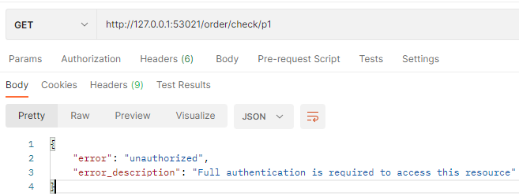

在请求的 Headers 中设置，token 的参数名称为：`Authorization`，值为：`Bearer token值`。（_注：Bearer 与 token 值之间使用空格隔开_）。此时请求成功。

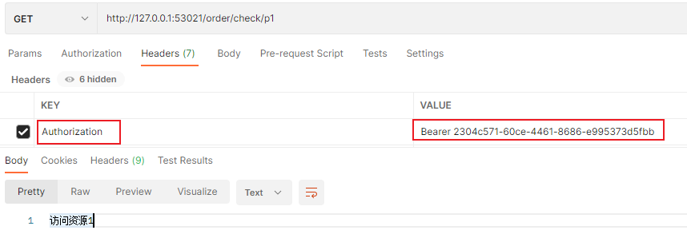

## 6. JWT 令牌

通过前面的测试可发现，当资源服务和授权服务不在一起时，资源服务使用 `RemoteTokenServices` 远程请求授权服务验证 token，如果访问量较大将会影响系统的性能 。

上面问题的解决方法：

令牌可以采用 JWT 格式即可解决前面的问题，用户认证通过会得到一个 JWT 令牌，JWT 令牌中已经包括了用户相关的信息，客户端只需要携带 JWT 访问资源服务，资源服务根据事先约定的算法自行完成令牌校验，无需每次都请求认证服务完成授权。

### 6.1. 配置 JWT 令牌服务

在 uaa 工程中配置 jwt 令牌服务，即可实现生成 jwt 格式的令牌。

- 修改 token 配置类 `TokenConfig`，创建 JWT 令牌存储方式

```java
@Configuration
public class TokenConfig {
    // 定义生成 token 的秘钥
    private final String SIGNING_KEY = "uaa123";

    /**
     * 创建令牌的存储策略实例
     */
    @Bean
    public TokenStore tokenStore() {
        // 使用 JWT 令牌存储方案
        return new JwtTokenStore(accessTokenConverter());
    }

    @Bean
    public JwtAccessTokenConverter accessTokenConverter() {
        JwtAccessTokenConverter converter = new JwtAccessTokenConverter();
        converter.setSigningKey(SIGNING_KEY); // 对称秘钥，资源服务器也使用该秘钥来验证
        return converter;
    }
}
```

- 修改授权服务配置类 `AuthorizationServerConfig`，修改创建令牌管理服务对象的方法，增加 JWT 令牌增强部分

```java
@Autowired
private JwtAccessTokenConverter jwtAccessTokenConverter;

@Bean
public AuthorizationServerTokenServices tokenService() {
    DefaultTokenServices service = new DefaultTokenServices();
    service.setClientDetailsService(clientDetailsService); // 客户端详情服务
    service.setSupportRefreshToken(true); // 支持刷新令牌
    service.setTokenStore(tokenStore); // 令牌存储策略

    /* JWT 令牌增强 */
    TokenEnhancerChain tokenEnhancerChain = new TokenEnhancerChain();
    tokenEnhancerChain.setTokenEnhancers(Arrays.asList(jwtAccessTokenConverter));
    service.setTokenEnhancer(tokenEnhancerChain);

    service.setAccessTokenValiditySeconds(7200); // 令牌默认有效期2小时
    service.setRefreshTokenValiditySeconds(259200); // 刷新令牌默认有效期3天
    return service;
}
```

### 6.2. 生成 jwt 令牌测试

启动 uaa 授权服务，使用密码模式请求测试生成 jwt 令牌

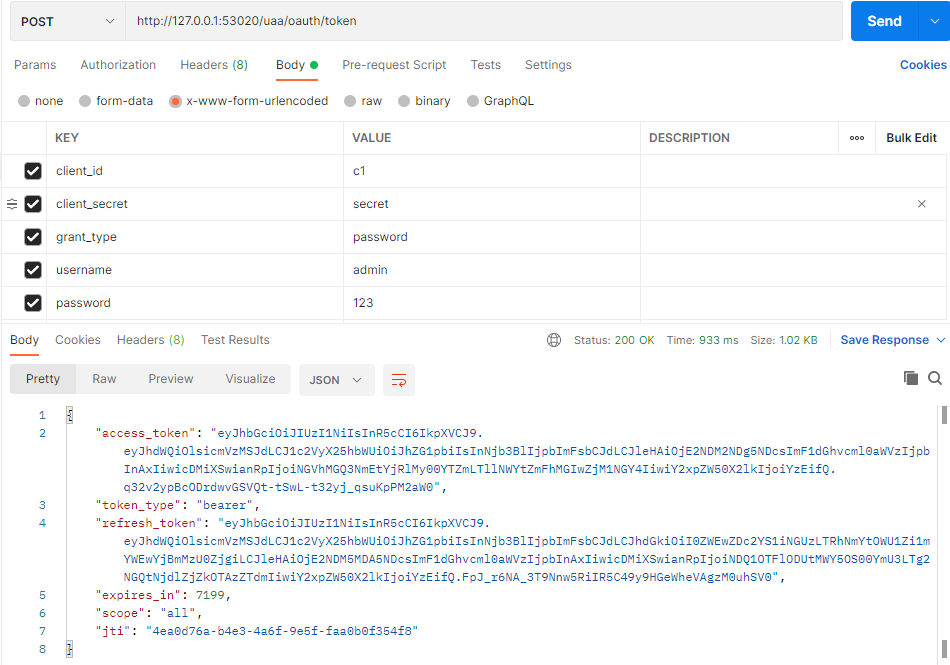

生成的令牌与前面的示例不一样

### 6.3. 校验 jwt 令牌

资源服务需要和授权服务拥有一致的签字、令牌服务等：

- 将 uaa 授权服务中的 token 配置类 `TokenConfig` 拷贝到 order 资源服务中
- 删除资源服务配置中原来的远程令牌服务类，注入本地令牌的存储实例，修改为使用本地验证令牌的服务

```java
@Configuration
@EnableResourceServer
public class ResouceServerConfig extends ResourceServerConfigurerAdapter {
    /**
     * 服务资源id，与授权服务器中配置类的 clients.resourceIds("res1") 值一致
     */
    public static final String RESOURCE_ID = "res1";

    // 令牌的存储策略实例
    @Autowired
    private TokenStore tokenStore;

    @Override
    public void configure(ResourceServerSecurityConfigurer resources) throws Exception {
        resources.resourceId(RESOURCE_ID) // 配置资源id
                // .tokenServices(tokenService()) // 验证令牌的服务(远程请求)
                .tokenStore(tokenStore) // 验证令牌的服务（本地验证）
                .stateless(true);
    }

    @Override
    public void configure(HttpSecurity http) throws Exception {
        http.authorizeRequests()
                .antMatchers("/**").access("#oauth2.hasScope('all')") // 配置访问的限制规则
                .and()
                .csrf().disable() // 设置不再限制 CSRF
                .sessionManagement().sessionCreationPolicy(SessionCreationPolicy.STATELESS); // 配置不生成本地 session
    }

}
```

- 测试

本测试使用密码模式申请令牌。发送 post 请求

```
http://127.0.0.1:53020/uaa/oauth/token
```

使用 jwt 令牌请求资源

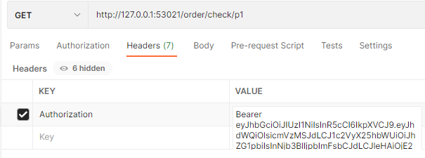

番外：令牌申请成功可以请求 `/uaa/oauth/check_token` 来校验令牌的有效性（_GET 与 POST 均可_），并查询令牌的内容，例子如下：

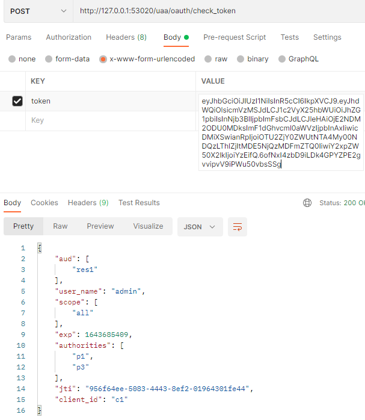

## 7. 客户端信息存储到数据库

上面的示例中，客户端信息和授权码都是存储在内存中，现实项目生产环境中通常都会存储在数据库中，通过程序去配置与修改客户端信息和授权码等，下面来改造完善环境的配置：

### 7.1. 创建授权认证相关的表

在 user_db 数据库中创建客户端信息表 `oauth_client_details`

```sql
DROP TABLE IF EXISTS `oauth_client_details`;
CREATE TABLE `oauth_client_details` (
	`client_id` VARCHAR ( 255 ) CHARACTER SET utf8 COLLATE utf8_general_ci NOT NULL COMMENT '客户端标识',
	`resource_ids` VARCHAR ( 255 ) CHARACTER SET utf8 COLLATE utf8_general_ci NULL DEFAULT NULL COMMENT '接入资源列表',
	`client_secret` VARCHAR ( 255 ) CHARACTER SET utf8 COLLATE utf8_general_ci NULL DEFAULT NULL COMMENT '客户端秘钥',
	`scope` VARCHAR ( 255 ) CHARACTER SET utf8 COLLATE utf8_general_ci NULL DEFAULT NULL,
	`authorized_grant_types` VARCHAR ( 255 ) CHARACTER SET utf8 COLLATE utf8_general_ci NULL DEFAULT NULL,
	`web_server_redirect_uri` VARCHAR ( 255 ) CHARACTER SET utf8 COLLATE utf8_general_ci NULL DEFAULT NULL,
	`authorities` VARCHAR ( 255 ) CHARACTER SET utf8 COLLATE utf8_general_ci NULL DEFAULT NULL,
	`access_token_validity` INT ( 11 ) NULL DEFAULT NULL,
	`refresh_token_validity` INT ( 11 ) NULL DEFAULT NULL,
	`additional_information` LONGTEXT CHARACTER SET utf8 COLLATE utf8_general_ci NULL,
	`create_time` TIMESTAMP ( 0 ) NOT NULL DEFAULT CURRENT_TIMESTAMP ( 0 ) ON UPDATE CURRENT_TIMESTAMP ( 0 ),
	`archived` TINYINT ( 4 ) NULL DEFAULT NULL,
	`trusted` TINYINT ( 4 ) NULL DEFAULT NULL,
	`autoapprove` VARCHAR ( 255 ) CHARACTER SET utf8 COLLATE utf8_general_ci NULL DEFAULT NULL,
	PRIMARY KEY ( `client_id` ) USING BTREE
) ENGINE = INNODB CHARACTER SET = utf8 COLLATE = utf8_general_ci COMMENT = '接入客户端信息' ROW_FORMAT = Dynamic;

INSERT INTO `oauth_client_details` VALUES ('c1', 'res1', '$2a$10$jq8jJKV/tz0b8k7vodrmPO.WGmhGe1lEjVhoS8DUSY185Puhil9IS', 'ROLE_ADMIN,ROLE_USER,ROLE_API', 'client_credentials,password,authorization_code,implicit,refresh_token', 'http://www.baidu.com', NULL, 7200, 259200, NULL, NOW(), 0, 0, 'false');
INSERT INTO `oauth_client_details` VALUES ('c2', 'res2', '$2a$10$jq8jJKV/tz0b8k7vodrmPO.WGmhGe1lEjVhoS8DUSY185Puhil9IS', 'ROLE_API', 'client_credentials,password,authorization_code,implicit,refresh_token', 'http://www.baidu.com', NULL, 31536000, 2592000, NULL, NOW(), 0, 0, 'false');
```

> 注：此示例项目的 `client_secret` 字段通过 BCrypt 加密后，示例的 `client_secret` 原值是：`secret`。如果修改客户端密钥，则此字段需要相应修改

创建 oauth_code 表，Spring Security OAuth2 使用，用来存储授权码：

```sql
DROP TABLE IF	EXISTS `oauth_code`;
CREATE TABLE `oauth_code` (
	`create_time` TIMESTAMP ( 0 ) NOT NULL DEFAULT CURRENT_TIMESTAMP,
	`code` VARCHAR ( 255 ) CHARACTER SET utf8 COLLATE utf8_general_ci NULL DEFAULT NULL,
	`authentication` BLOB NULL,
	INDEX `code_index` ( `code` ) USING BTREE
) ENGINE = INNODB CHARACTER SET = utf8 COLLATE = utf8_general_ci ROW_FORMAT = Compact;
```

### 7.2. 配置授权服务

修改授权服务工程的配置类 `AuthorizationServerConfig`，`ClientDetailsService` 和 `AuthorizationCodeServices` 从数据库读取数据

```java
@Configuration
@EnableAuthorizationServer
public class AuthorizationServerConfig extends AuthorizationServerConfigurerAdapter {
    ....
    // 注入密码编码器实例（此实例在 WebSecurityConfig 中配置）
    @Autowired
    private PasswordEncoder passwordEncoder;

    /**
     * 将客户端信息存储到数据库
     *
     * @param dataSource
     * @return
     */
    @Bean
    public ClientDetailsService clientDetailsService(DataSource dataSource) {
        ClientDetailsService clientDetailsService = new JdbcClientDetailsService(dataSource);
        ((JdbcClientDetailsService) clientDetailsService).setPasswordEncoder(passwordEncoder);
        return clientDetailsService;
    }

    /**
     * 用来配置客户端详情服务 ClientDetailsService，客户端详情信息在此方法中进行初始化，
     * 这里能够把客户端详情信息使用硬编码或者是通过数据库来存储调取详情信息
     * <p>
     * 此示例目前暂时使用内存的方式存储客户端详情信息
     * </p>
     * <p>
     * 后面改造成使用数据库存储客户端、授权等信息
     * </p>
     *
     * @param clients
     * @throws Exception
     */
    @Override
    public void configure(ClientDetailsServiceConfigurer clients) throws Exception {
        // 客户端详情信息使用数据库方式存储
        clients.withClientDetails(clientDetailsService);

        /* 使用in‐memory存储 */
        /*clients.inMemory()
                .withClient("c1") // client_id
                .secret(new BCryptPasswordEncoder().encode("secret")) // 客户端密钥
                .resourceIds("res1") // 资源列表
                .authorizedGrantTypes("authorization_code", "password", "client_credentials", "implicit", "refresh_token") // 该client允许的授权类型
                .scopes("all") // 允许的授权范围
                .autoApprove(false) // 发放令牌时，是否跳转授权页面，true-代表不跳转，false-代表跳转
                .redirectUris("http://www.baidu.com"); // 验证回调地址*/
    }
    ....

    /**
     * 设置授权码模式的授权码如何存取
     *
     * @return
     */
    @Bean
    public AuthorizationCodeServices authorizationCodeServices(DataSource dataSource) {
        // 采用数据库存储方式来存取授权码
        return new JdbcAuthorizationCodeServices(dataSource);

        // return new InMemoryAuthorizationCodeServices(); // 暂时采用内存方式
    }
    ....
}
```

### 7.3. 测试

#### 7.3.1. 测试申请令牌

使用密码模式申请令牌，观察客户端信息需要和数据库中的信息一致。


`scope` 字段值已经与数据库表中一致

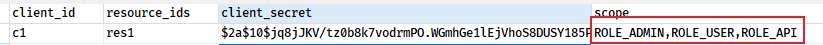

#### 7.3.2. 测试授权码模式

浏览器访问认证页面：

```
http://127.0.0.1:53020/uaa/oauth/authorize?client_id=c1&response_type=code&scope=ROLE_ADMIN&redirect_uri=http://www.baidu.com
```

> 注：`client_id` 与 `scope` 字段需要与数据库表的值一致

点击授权后，跳转并带上授权码，观察授权码是否记录到数据库表

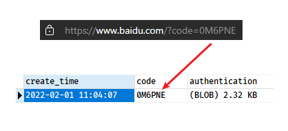

## 8. Spring Security 实现分布式系统授权

### 8.1. 回顾分布式系统授权技术方案


1. UAA 认证服务负责认证授权。
2. 所有请求经过 网关到达微服务
3. 网关负责鉴权客户端以及请求转发
4. 网关将 token 解析后传给微服务，微服务进行授权。

### 8.2. 服务注册中心

所有微服务的请求都经过网关，网关从注册中心读取微服务的地址，将请求转发至微服务。本示例注册中心采用 Eureka

- 创建 maven 工程 `spring-security-discovery`。添加相关依赖：

```xml
<dependency>
    <groupId>org.springframework.cloud</groupId>
    <artifactId>spring-cloud-starter-netflix-eureka-server</artifactId>
</dependency>
<dependency>
    <groupId>org.springframework.boot</groupId>
    <artifactId>spring-boot-starter-actuator</artifactId>
</dependency>
```

- 在 resources 目录下创建项目配置文件 application.yml

```yml
spring:
  application:
    name: discovery-service

server:
  port: 53000 # 项目端口

eureka:
  server:
    enable-self-preservation: false # 关闭服务器自我保护，客户端心跳检测15分钟内错误达到80%服务会保护，导致别人还认为是好用的服务
    eviction-interval-timer-in-ms: 10000 # 清理间隔（单位毫秒，默认是60*1000）5秒将客户端剔除的服务在服务注册列表中剔除#
    shouldUseReadOnlyResponseCache: true # eureka是CAP理论种基于AP策略，为了保证强一致性关闭此切换CP 默认不关闭 false关闭
  client:
    register-with-eureka: false # false: 不作为一个客户端注册到注册中心
    fetch-registry: false # 为true时，可以启动，但报异常：Cannot execute request on any known server
    instance-info-replication-interval-seconds: 10
    serviceUrl:
      defaultZone: http://localhost:${server.port}/eureka/
  instance:
    hostname: ${spring.cloud.client.ip-address}
    prefer-ip-address: true
    instance-id: ${spring.application.name}:${spring.cloud.client.ip-address}:${spring.application.instance_id:${server.port}}
```

- 创建启动类

```java
@SpringBootApplication
@EnableEurekaServer
public class DiscoveryServer {
    public static void main(String[] args) {
        SpringApplication.run(DiscoveryServer.class, args);
    }
}
```

### 8.3. 网关服务

网关整合 OAuth2.0 有两种思路：

- 一种是认证服务器生成 jwt 令牌, 所有请求统一在网关层验证，判断权限等操作；
- 另一种是由各资源服务处理，网关只做请求转发。

本示例使用第一种方式，把 API 网关作为 OAuth2.0 的资源服务器角色，实现接入客户端权限拦截、令牌解析并转发当前登录用户信息(jsonToken)给微服务，这样下游微服务就不需要关心令牌格式解析以及 OAuth2.0 相关机制了。

API 网关在认证授权体系里主要负责：

1. 作为 OAuth2.0 的资源服务器角色，实现接入方权限拦截。
2. 令牌解析并转发当前登录用户信息（明文 token）给微服务

微服务拿到明文 token(明文 token 中包含登录用户的身份和权限信息)后也需要实现的内容：

1. 用户授权拦截（看当前用户是否有权访问该资源）
2. 将用户信息存储进当前线程上下文（有利于后续业务逻辑随时获取当前用户信息）

#### 8.3.1. 创建工程

- 创建 maven 项目 `spring-security-gateway`，添加相关的依赖：

```xml
<dependencies>
    <dependency>
        <groupId>org.springframework.cloud</groupId>
        <artifactId>spring-cloud-starter-netflix-eureka-client</artifactId>
    </dependency>

    <dependency>
        <groupId>org.springframework.cloud</groupId>
        <artifactId>spring-cloud-starter-netflix-hystrix</artifactId>
    </dependency>

    <dependency>
        <groupId>org.springframework.cloud</groupId>
        <artifactId>spring-cloud-starter-netflix-ribbon</artifactId>
    </dependency>

    <dependency>
        <groupId>org.springframework.cloud</groupId>
        <artifactId>spring-cloud-starter-openfeign</artifactId>
    </dependency>

    <dependency>
        <groupId>com.netflix.hystrix</groupId>
        <artifactId>hystrix-javanica</artifactId>
    </dependency>

    <dependency>
        <groupId>org.springframework.retry</groupId>
        <artifactId>spring-retry</artifactId>
    </dependency>

    <dependency>
        <groupId>org.springframework.boot</groupId>
        <artifactId>spring-boot-starter-actuator</artifactId>
    </dependency>

    <dependency>
        <groupId>org.springframework.boot</groupId>
        <artifactId>spring-boot-starter-web</artifactId>
    </dependency>

    <dependency>
        <groupId>org.springframework.cloud</groupId>
        <artifactId>spring-cloud-starter-netflix-zuul</artifactId>
    </dependency>

    <!-- Spring Security 依赖 -->
    <dependency>
        <groupId>org.springframework.cloud</groupId>
        <artifactId>spring-cloud-starter-security</artifactId>
    </dependency>
    <!-- Spring Security OAuth 依赖 -->
    <dependency>
        <groupId>org.springframework.cloud</groupId>
        <artifactId>spring-cloud-starter-oauth2</artifactId>
    </dependency>
    <!-- Spring Security JWT 依赖 -->
    <dependency>
        <groupId>org.springframework.security</groupId>
        <artifactId>spring-security-jwt</artifactId>
    </dependency>

    <dependency>
        <groupId>javax.interceptor</groupId>
        <artifactId>javax.interceptor-api</artifactId>
    </dependency>

    <dependency>
        <groupId>com.alibaba</groupId>
        <artifactId>fastjson</artifactId>
    </dependency>
    <dependency>
        <groupId>org.projectlombok</groupId>
        <artifactId>lombok</artifactId>
    </dependency>
</dependencies>
```

- 在 resources 目录下创建项目配置文件 application.yml

```yml
server:
  port: 53010

spring:
  application:
    name: gateway-server
  main:
    allow-bean-definition-overriding: true

eureka:
  client:
    serviceUrl:
      defaultZone: http://localhost:53000/eureka/
  instance:
    instance-id: ${spring.application.name}:${spring.cloud.client.ip-address}:${spring.application.instance_id:${server.port}}
    preferIpAddress: true

feign:
  compression:
    request:
      enabled: true
      mime-types:
        - text/xml
        - application/xml
        - application/json
      min-request-size: 2048
    response:
      enabled: true
  hystrix:
    enabled: true

zuul:
  add-host-header: true
  ignoredServices: '*'
  retryable: true
  # 统一认证服务（UAA）与统一订单服务都是网关下微服务，需要在网关上新增路由配置
  routes:
    order-service:
      path: /order/**
      stripPrefix: false
    uaa-service:
      path: /uaa/**
      stripPrefix: false
  sensitiveHeaders: '*'

logging:
  level:
    org:
      springframework: info
    root: info

management:
  endpoints:
    web:
      exposure:
        include: refresh,health,info,env
```

> 上面配置了网关接收的请求 url 若符合 `/order/**` 表达式，将被转发至 order-service (统一订单服务)。

- 创建启动类

```java
@SpringBootApplication
@EnableZuulProxy
@EnableDiscoveryClient
public class GatewayServer {
    public static void main(String[] args) {
        SpringApplication.run(GatewayServer.class, args);
    }
}
```

#### 8.3.2. token 配置类

资源服务器由于需要验证并解析令牌，往往可以通过在授权服务器暴露 check_token 的 Endpoint 来完成，而在授权服务器使用的是对称加密的 jwt，因此知道密钥即可，资源服务与授权服务本就是对称设计，那把授权服务的 `TokenConfig` 两个类拷贝过来就行 。

```java
@Configuration
public class TokenConfig {
    // 定义生成 token 的秘钥
    private final String SIGNING_KEY = "uaa123";

    /**
     * 创建令牌的存储策略实例
     *
     * @return
     */
    @Bean
    public TokenStore tokenStore() {
        // 使用 JWT 令牌存储方案
        return new JwtTokenStore(accessTokenConverter());
    }

    @Bean
    public JwtAccessTokenConverter accessTokenConverter() {
        JwtAccessTokenConverter converter = new JwtAccessTokenConverter();
        converter.setSigningKey(SIGNING_KEY); // 对称秘钥，授权服务器也使用该秘钥来验证
        return converter;
    }
}
```

#### 8.3.3. 配置资源服务

创建资源服务配置类 `ResouceServerConfig`，主要配置的内容就是定义一些匹配规则，描述某个接入客户端需要什么样的权限才能访问某个微服务。

```java
@Configuration
public class ResouceServerConfig {
    /**
     * 服务资源id，与授权服务器中配置类的 clients.resourceIds("res1") 值一致
     */
    public static final String RESOURCE_ID = "res1";

    // uaa 资源服务配置
    @Configuration
    @EnableResourceServer
    public class UAAServerConfig extends ResourceServerConfigurerAdapter {
        @Autowired
        private TokenStore tokenStore;

        @Override
        public void configure(ResourceServerSecurityConfigurer resources) {
            resources.tokenStore(tokenStore) // 验证令牌的服务（本地验证）
                    .resourceId(RESOURCE_ID) // 配置资源id
                    .stateless(true);
        }

        @Override
        public void configure(HttpSecurity http) throws Exception {
            http.authorizeRequests()
                    .antMatchers("/uaa/**").permitAll();  // 配置访问的限制规则
        }
    }

    // order 资源服务配置
    @Configuration
    @EnableResourceServer
    public class OrderServerConfig extends ResourceServerConfigurerAdapter {
        @Autowired
        private TokenStore tokenStore;

        @Override
        public void configure(ResourceServerSecurityConfigurer resources) {
            resources.tokenStore(tokenStore) // 验证令牌的服务（本地验证）
                    .resourceId(RESOURCE_ID) // 配置资源id
                    .stateless(true);
        }

        @Override
        public void configure(HttpSecurity http) throws Exception {
            http.authorizeRequests()
                    .antMatchers("/order/**").access("#oauth2.hasScope('ROLE_API')");  // 配置访问的限制规则
        }
    }

    // 配置其它的资源服务...
}
```

上面定义了两个微服务的资源，其中：

- `UAAServerConfig` 指定了若请求匹配 `/uaa/**` 网关不进行拦截。
- `OrderServerConfig` 指定了若请求匹配 `/order/**`，也就是访问统一用户服务，接入客户端需要有 scope 中包含 read，并且 authorities (权限)中需要包含 ROLE_USER。

由于 res1 这个接入客户端，read 包括 ROLE_ADMIN,ROLE_USER,ROLE_API 三个权限。

#### 8.3.4. Spring Security 安全配置

配置放行所有请求，关闭跨域限制

```java
@Configuration
public class WebSecurityConfig extends WebSecurityConfigurerAdapter {
    @Override
    protected void configure(HttpSecurity http) throws Exception {
        http.authorizeRequests()
                .antMatchers("/**").permitAll()
                .and().csrf().disable();
    }
}
```

### 8.4. zuul 过滤器

通过 Zuul 过滤器的方式实现，目的是让下游微服务能够很方便的获取到当前的登录用户信息（明文 token）

#### 8.4.1. 实现获取用户信息转发至微服务

创建 `AuthFilter` 实现 Zuul 前置过滤器，完成当前登录用户信息提取，并放入转发微服务的 request 中

```java
public class AuthFilter extends ZuulFilter {
    /* 过滤器类型 */
    @Override
    public String filterType() {
        return "pre"; // 前置过滤器
    }

    /* 过滤器加载顺序 */
    @Override
    public int filterOrder() {
        return 0;
    }

    /* 是否加载过滤器 */
    @Override
    public boolean shouldFilter() {
        return true;
    }

    @Override
    public Object run() throws ZuulException {
        RequestContext ctx = RequestContext.getCurrentContext();

        // 从安全上下文中获取用户身份对象
        Authentication authentication = SecurityContextHolder.getContext().getAuthentication();
        if (!(authentication instanceof OAuth2Authentication)) {
            return null;
        }
        OAuth2Authentication oAuth2Authentication = (OAuth2Authentication) authentication;
        Authentication userAuthentication = oAuth2Authentication.getUserAuthentication();
        // 取出用户身份信息
        String principal = userAuthentication.getName();

        // 取出用户权限
        List<String> authorities = new ArrayList<>();
        // 从 userAuthentication 取出权限，放在 authorities
        userAuthentication.getAuthorities().stream().forEach(c -> authorities.add(((GrantedAuthority) c).getAuthority()));

        OAuth2Request oAuth2Request = oAuth2Authentication.getOAuth2Request();
        Map<String, String> requestParameters = oAuth2Request.getRequestParameters();
        Map<String, Object> jsonToken = new HashMap<>(requestParameters);
        if (userAuthentication != null) {
            jsonToken.put("principal", principal);
            jsonToken.put("authorities", authorities);
        }

        // 把身份信息和权限信息放在 json 中，加入 http 的 header 中,转发给微服务
        ctx.addZuulRequestHeader("json-token", EncryptUtil.encodeUTF8StringBase64(JSON.toJSONString(jsonToken)));

        return null;
    }
}
```

#### 8.4.2. zuul 网关配置类

创建网关配置类 `ZuulConfig`，在此配置中将自定义 filter 加入到 spring 容器

```java
@Configuration
public class ZuulConfig {
    /* 实例化前置过滤器 */
    @Bean
    public AuthFilter preFileter() {
        return new AuthFilter();
    }

    @Bean
    public FilterRegistrationBean corsFilter() {
        final UrlBasedCorsConfigurationSource source = new UrlBasedCorsConfigurationSource();
        final CorsConfiguration config = new CorsConfiguration();
        config.setAllowCredentials(true);
        config.addAllowedOrigin("*");
        config.addAllowedHeader("*");
        config.addAllowedMethod("*");
        config.setMaxAge(18000L);
        source.registerCorsConfiguration("/**", config);
        CorsFilter corsFilter = new CorsFilter(source);
        FilterRegistrationBean bean = new FilterRegistrationBean(corsFilter);
        bean.setOrder(Ordered.HIGHEST_PRECEDENCE);
        return bean;
    }
}
```

### 8.5. 微服务用户鉴权拦截

当微服务收到明文 token 时，需要自定义实现一个过滤器，用于解析明文的 token，增加微服务用户鉴权拦截功能

#### 8.5.1. Spring Security 资源配置

修改 `ResouceServerConfig` 配置类，开启方法保护，并增加 Spring 配置策略，除了 `/login` 方法不受保护(统一认证要调用)，其他资源全部需要认证才能访问。

```java
Override
public void configure(HttpSecurity http) throws Exception {
    http.authorizeRequests()
            .antMatchers("/**").access("#oauth2.hasScope('ROLE_ADMIN')") // 配置访问的限制规则
            .and()
            .csrf().disable() // 设置不再限制 CSRF
            .sessionManagement().sessionCreationPolicy(SessionCreationPolicy.STATELESS); // 配置不生成本地 session
}
```

#### 8.5.2. 自定义过滤器拦截 token

自定义 filter 拦截器，用于增加解析 token 对象，并填充用户身份到 token 对象，设置到 Spring Security 的 `Authentication` 对象

```java
@Component
public class TokenAuthenticationFilter extends OncePerRequestFilter {

    @Override
    protected void doFilterInternal(HttpServletRequest httpServletRequest, HttpServletResponse httpServletResponse, FilterChain filterChain) throws ServletException, IOException {
        // 从请求头(header)中获取 token
        String token = httpServletRequest.getHeader("json-token");
        if (token != null) {
            // 解析 token
            String json = EncryptUtil.decodeUTF8StringBase64(token);
            // 将token转成json对象
            JSONObject jsonObject = JSON.parseObject(json);
            // 创建自定义的用户身份信息实例
            UserDTO userDTO = new UserDTO();
            String principal = jsonObject.getString("principal");
            userDTO.setUsername(principal);

            // 用户权限
            JSONArray authoritiesArray = jsonObject.getJSONArray("authorities");
            String[] authorities = authoritiesArray.toArray(new String[authoritiesArray.size()]);
            // 新建并将用户信息和权限填充到用户身份token对象中
            UsernamePasswordAuthenticationToken authenticationToken
                    = new UsernamePasswordAuthenticationToken(userDTO, null, AuthorityUtils.createAuthorityList(authorities));
            authenticationToken.setDetails(new WebAuthenticationDetailsSource().buildDetails(httpServletRequest));
            // 将authenticationToken填充到安全上下文
            SecurityContextHolder.getContext().setAuthentication(authenticationToken);
        }
        // 让过滤器链继续执行
        filterChain.doFilter(httpServletRequest, httpServletResponse);
    }

}
```

经过上边的过滤器后，资源服务中就可以方便到的获取用户的身份信息：

```java
UserDTO user = (UserDTO) SecurityContextHolder.getContext().getAuthentication().getPrincipal();
```

#### 8.5.3. 增加测试资源

- OrderController 增加以下 endpoint

```java
@RestController
public class OrderController {
    @GetMapping(value = "/check/p1")
    @PreAuthorize("hasAuthority('p1')") // 使用方法授权配置，拥有 p1 权限方可访问此url
    public String p1() {
        return "访问资源1";
    }

    @GetMapping(value = "/check/p2")
    @PreAuthorize("hasAuthority('p2')") // 使用方法授权配置，拥有 p1 权限方可访问此url
    public String p2() {
        return "访问资源2";
    }
}
```

### 8.6. 微服务集成测试

本案例测试过程描述：

1. 采用 OAuth2.0 的密码模式通过网关从 UAA 获取 token
2. 使用该 token 通过网关访问订单服务的测试资源

- 通过网关访问 uaa 的授权及获取令牌，获取 token。注意端口是 53010，网关的端口。

```
POST http://127.0.0.1:53010/uaa/oauth/token
```

获取 jwt 令牌后，用于请求订单资源服务

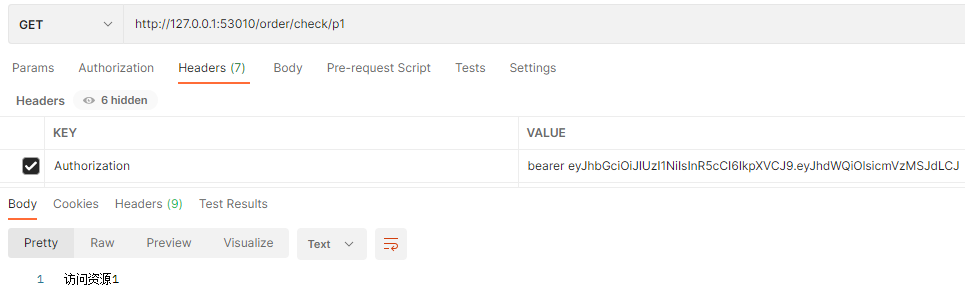

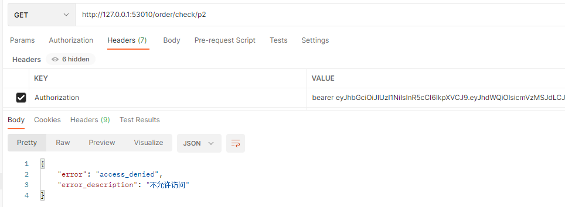

- 无 token 测试返回内容：

```json
{
  "error": "unauthorized",
  "error_description": "Full authentication is required to access this resource"
}
```

- 破坏 token 测试返回内容：

```json
{
  "error": "invalid_token",
  "error_description": "Cannot convert access token to JSON"
}
```

### 8.7. 扩展用户信息

上面示例 jwt 令牌存储了用户的身份信息、权限信息，网关将 token 明文化转发给微服务使用，目前用户身份信息仅包括了用户的账号，但实现项目中，可能还需要用户的其他重要信息，如用户的 ID、手机号等。

本案例将提供扩展用户信息的思路和方法，满足微服务使用用户信息的需求。

在认证阶段 `DaoAuthenticationProvider` 会调用 `UserDetailService` 查询用户的信息，这里是可以获取到完整的用户信息。由于 JWT 令牌中用户身份信息来源于 `UserDetails`，`UserDetails` 中仅定义了 `username` 为用户的身份信息，因此有两种思路方案来让 JWT 令牌中扩展用户信息：

1. 可以继承 `UserDetails` 类，从而扩展让其包括更多的自定义属性
2. 可以扩展 `username` 属性的内容，比如存入 json 数据内容作为 `username` 的内容。

相比较而言，方案二比较简单并不用破坏 `UserDetails` 的结构，因此采用方案二。

#### 8.7.1. 修改自定义 UserDetailService 接口实现

修改 uaa 工程中的 `CustomUserDetailsService.loadUserByUsername` 方法，将原来从数据库查询到用户的信息后，将整个用户对象转成 json 存入 `UserDetails` 对象。

```java
@Override
public UserDetails loadUserByUsername(String username) throws UsernameNotFoundException {
    // 根据账号查询数据库
    UserDO user = userDao.getUserByUsername(username);
    ....
    // 将用户对象转成json字符串，设置到 username 属性中
    String principal = JSON.toJSONString(user);

    return User.withUsername(principal) // 设置用户对象的 json 字符串
            .password(user.getPassword()) // 设置密码
            .authorities(permissionArray) // 设置权限
            .build();
}
```

#### 8.7.2. 修改资源服务过滤器

修改 order 资源服务的过滤器 `TokenAuthenticationFilter`。资源服务中的过滤器负责从 header 中解析 json-token，即可拿到网关放入的用户身份信息

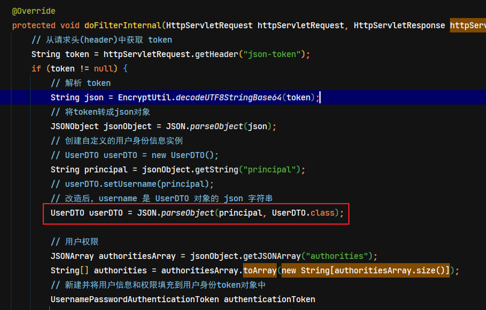
