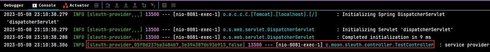

## 1. Spring Cloud Sleuth 概述

> sleuth （英）/sluːθ/ （美）/sluːθ/ n. 侦探；警犬；vi. 做侦探；侦查

Spring Cloud Sleuth 主要功能就是在分布式系统中提供调用链追踪的解决方案，Sleuth 对用户透明，服务调用的交互信息都能被<font color=red>**自动采集**</font>，可以通过日志文件获取服务调用的链路数据，也可以将数据发送给远程服务统一收集分析。

Spring Cloud Sleuth 兼容支持 Zipkin，HTrace 和基于日志的（例如ELK）跟踪等。它大量借用了 Google Dapper 的设计，只需要在 pom 文件中引入相应的依赖即可。

### 1.1. Sleuth 中的术语和相关概念

- **Span**：代表一组基本工作单元，为了统计各处理单元的延迟，当请求到达各个服务组件的时候，也通过一个唯一标识（SpanId）来标记它的开始、具体过程和结束。通过 SpanId 的开始和结束时间戳，就能统计该 span 的调用时间，除此之外，还可以获取如事件的名称、请求信息等元数据。
- **Trace**：由一组 TraceId 相同的 Span 串联形成一个树状结构。为了实现请求跟踪，当请求到达分布式系统的入口端点时，只需要服务跟踪框架为该请求创建一个唯一的标识（即 TraceId），同时在分布式系统内部流转的时候，框架始终保持传递该唯一值，直到整个请求的返回。那么我们就可以使用该唯一标识将所有的请求串联起来，形成一条完整的请求链路。例如，如果正在跑一个分布式大数据工程，可能需要创建一个 trace。
> 例如，在一个新建的 span 中发送一个 RPC 等同于发送一个回应请求给 RPC，span 通过一个 64 位 ID 唯一标识，trace 以另一个 64 位 ID 表示，span 还有其他数据信息，比如摘要、时间戳事件、关键值注释(tags)、span 的 ID、以及进度 ID(通常是IP地址) span 在不断的启动和停止，同时记录了时间信息，当创建了一个 span，必须在未来的某个时刻停止它。
- **Annotation**：用来及时记录一个事件的存在，一些核心 annotations 用来定义一个请求的开始和结束，内部使用的重要注释：
    - cs - Client Sent：客户端发起一个请求，这个 annotion 描述了这个 span 的开始
    - sr - Server Received：服务端获得请求并准备开始处理它，如果将其 sr 减去 cs 时间戳便可得到网络延迟
    - ss - Server Sent：注解表明请求处理的完成(当请求返回客户端)，如果 ss 减去 sr 时间戳便可得到服务端需要的处理请求时间
    - cr - Client Received：表明 span 的结束，客户端成功接收到服务端的回复，如果 cr 减去 cs 时间戳便可得到客户端从服务端获取回复的所有所需时间


### 1.2. 调用链跟踪原理

一个最简单的服务调用，主要涉及以下关键点：

1. Client 发起调用（Client Send）
2. Server 接收请求（Server Receive）
3. Server 发送响应（Server Send）
4. Client 接收响应（Client Receive）


- **调用链跟踪解决异常问题思路**：一次完整的请求包含以上4个关键点，因此只需要<font color=red>跟踪每个关键点</font>，便可知调用是否正常。缺少了哪个阶段的跟踪记录，就说明这个阶段异常了。
- **调用链跟踪解决性能问题思路**：<font color=red>记录每个关键阶段的时间戳</font>，就可以计算任意阶段的耗时。


## 2. 链路追踪 Sleuth 基础入门示例

### 2.1. 项目搭建

创建`14-springcloud-sleuth`工程，复用之前Spring Cloud Gateway示例项目`12-springcloud-gateway`的代码，移除相关限流的代码；增加order服务的路由部分的配置

```yml
server:
  port: 8080 # 项目端口
spring:
  application:
    name: shop-server-gateway # 服务名称
  cloud:
    gateway:
      routes:
        - id: shop-service-product # 路由id
          uri: lb://shop-service-product # 根据微服务名称从注册中心拉取服务的地址与端口，格式： lb://服务名称（服务在注册中心上注册的名称）
          predicates:
            - Path=/shop-service-product/**
          filters: # 配置路由过滤器
            - RewritePath=/shop-service-product/(?<segment>.*), /$\{segment}
        - id: shop-service-order
          uri: lb://shop-service-order
          predicates:
            - Path=/shop-service-order/**
          filters:
            - RewritePath=/shop-service-order/(?<segment>.*), /$\{segment}
```

### 2.2. 引入依赖

修改网关、订单、商品微服务工程，各自引入 Sleuth 依赖。

```xml
<!-- sleuth链路追踪依赖 -->
<dependency>
    <groupId>org.springframework.cloud</groupId>
    <artifactId>spring-cloud-starter-sleuth</artifactId>
</dependency>
```

> 注：在需要进行链路追踪的所有微服务上都要加上 Sleuth 的依赖

### 2.3. 添加日志配置

修改网关、订单、商品微服务工程的 application.yml 配置文件，添加日志级别

```yml
logging:
  level:
    root: info
    org.springframework.web.servlet.DispatcherServlet: DEBUG
    org.springframework.cloud.sleuth: DEBUG
```

> 注：在需要进行链路追踪的所有微服务上都要加上日志级别的配置

### 2.4. 测试结果

启动微服务，调用之后，我们可以在控制台观察到 sleuth 的日志输出。


其中 `eb73eff57266ff20` 是 TraceId，后面跟着的是 SpanId，依次调用有一个全局的 TraceId，将调用链路串起来，调用过程的每个步骤有不同的 SpanId。仔细分析每个微服务的日志，不难看出请求的具体过程。

查看日志文件并不是一个很好的方法，当微服务越来越多日志文件也会越来越多，通过 Zipkin 可以将日志聚合，并进行可视化展示和全文检索。

### 2.5. Sleuth 日志格式解析


从上面日志输出可知，Sleuth 的日志的格式为：`[applicationName, traceId, spanId, export]`

- `applicationName`：应用的名称，也就是 `application.properties` 配置文件中的 `spring.application.name` 属性的值。
- `traceId`：一个请求分配的 ID 号，用来标识一条请求链路。
- `spanId`：表示一个基本的工作单元，一个请求可以包含多个步骤，每个步骤都拥有自己的 spanId。
- `export`：布尔类型。表示是否要将该信息输出到类似 Zipkin 这样的追踪服务端进行收集和展示。

## 3. Sleuth 对各种服务调用方式的支持

RestTemplate 与 Feign 都是服务调用的常用方式，还有多线程调用等。创建2个工程：服务提供方、服务调用方，均集成 Sleuth，在服务调用方中分别使用 RestTemplate 和 Feign、多线程的方式调用服务提供方的接口，查看调用各种调用方式是否整合跟踪。

> 示例源码：`spring-cloud-note\spring-cloud-sample-sleuth-calling-support`

### 3.1. 创建基础示例工程

#### 3.1.1. 聚合项目

创建测试聚合项目，引入依赖管理

```xml
<dependencyManagement>
    <dependencies>
        <!-- spring boot 依赖 -->
        <dependency>
            <groupId>org.springframework.boot</groupId>
            <artifactId>spring-boot-dependencies</artifactId>
            <version>${spring-boot.version}</version>
            <type>pom</type>
            <scope>import</scope>
        </dependency>
        <!-- spring cloud 依赖 -->
        <dependency>
            <groupId>org.springframework.cloud</groupId>
            <artifactId>spring-cloud-dependencies</artifactId>
            <version>${spring-cloud.version}</version>
            <type>pom</type>
            <scope>import</scope>
        </dependency>
    </dependencies>
</dependencyManagement>

<!-- 项目构建部分 -->
<build>
    <plugins>
        <plugin>
            <groupId>org.springframework.boot</groupId>
            <artifactId>spring-boot-maven-plugin</artifactId>
        </plugin>
    </plugins>
</build>
```

#### 3.1.2. 服务提供者

创建服务提供方工程，引入依赖

```xml
<dependencies>
    <dependency>
        <groupId>org.springframework.boot</groupId>
        <artifactId>spring-boot-starter-web</artifactId>
    </dependency>
    <dependency>
        <groupId>org.springframework.cloud</groupId>
        <artifactId>spring-cloud-starter-sleuth</artifactId>
    </dependency>
    <dependency>
        <groupId>org.projectlombok</groupId>
        <artifactId>lombok</artifactId>
    </dependency>
</dependencies>
```

创建项目核心配置文件

```yml
server:
  port: 8081
spring:
  application:
    name: sleuth-provider
```

创建启动类与测试接口

```java
@Slf4j
@RestController
public class TestController {
    @GetMapping("/hello")
    public String hello() {
        log.info("service provider");
        return "hello !";
    }
}
```

#### 3.1.3. 服务调用者

创建服务提供方工程，引入依赖

```xml
<dependencies>
    <dependency>
        <groupId>org.springframework.boot</groupId>
        <artifactId>spring-boot-starter-web</artifactId>
    </dependency>

    <dependency>
        <groupId>org.springframework.cloud</groupId>
        <artifactId>spring-cloud-starter-sleuth</artifactId>
    </dependency>
    <dependency>
        <groupId>org.springframework.cloud</groupId>
        <artifactId>spring-cloud-starter-openfeign</artifactId>
    </dependency>

    <dependency>
        <groupId>org.projectlombok</groupId>
        <artifactId>lombok</artifactId>
    </dependency>
</dependencies>
```

创建项目核心配置文件

```yml
server:
  port: 8080
spring:
  application:
    name: sleuth-consumer
```

创建启动类

### 3.2. RestTemplate 服务调用方式跟踪

#### 3.2.1. 代码实现

1. 在配置类中创建 RestTemplate Bean

```java
@Configuration
public class ConsumerConfig {

    // 创建 RestTemplate
    @Bean
    public RestTemplate restTemplate() {
        return new RestTemplate();
    }
}
```

2. 创建测试接口，通过 RestTemplate 调用接口

```java
@Slf4j
@RestController
public class RestTemplateController {
    // 引入 RestTemplate
    @Autowired
    private RestTemplate restTemplate;

    @GetMapping("/testByRestTemplate")
    public String testByRestTemplate() {
        // 使用 RestTemplate 服务调用
        String result = restTemplate.getForObject("http://localhost:8081/hello", String.class);
        // 输出日志
        log.info("testByRestTemplate result: {}", result);
        return result;
    }
}
```

#### 3.2.2. 测试

启动服务，访问服务调用者的接口 `http://127.0.0.1:8080/testByRestTemplate`

服务提供者日志输出：


服务调用者日志输出：


验证结果：consumer 与 provider 都输出 sleuth 结构的日志，Sleuth 可以正常跟踪 RestTemplate。

### 3.3. Feign 服务调用方式跟踪

#### 3.3.1. 代码实现

1. 在配置类或者启动类中使用 `@EnableFeignClients` 注解开启 Feign 支持
2. 创建 FeignClient 接口

```java
@FeignClient(name = "sleuth-provider", url = "localhost:8081")
public interface HelloService {
    @RequestMapping("/hello")
    String hello();
}
```

3. 创建测试接口，通过 Feign 调用接口

```java
@Slf4j
@RestController
public class FeignController {
    // 引入 FeignClient 接口
    @Autowired
    private HelloService helloService;

    @GetMapping("/testByFeign")
    public String testByFeign() {
        // Feign 服务调用
        String result = helloService.hello();
        // 输出日志
        log.info("testByFeign result: {}", result);
        return result;
    }
}
```

#### 3.3.2. 测试

启动服务，访问服务调用者的接口 `http://127.0.0.1:8080/testByFeign`

服务提供者日志输出：



服务调用者日志输出：


验证结果：consumer 与 provider 都输出 sleuth 结构的日志，Sleuth 可以正常跟踪 Feign 调用方式。

### 3.4. 多线程调用方式跟踪

#### 3.4.1. 代码实现

通过线程池开启线程，在线程任务中通过 Feign 进行远程调用。

```java
@Slf4j
@RestController
public class ThreadController {

    @Autowired
    private HelloService helloService;

    // 创建线程池
    private final ExecutorService executorService = Executors.newFixedThreadPool(1);

    @GetMapping("/testByThread")
    public String testByThread() throws ExecutionException, InterruptedException {
        Future<String> future = executorService.submit(() -> {
            log.info("in thread");
            return helloService.hello();
        });
        // 获取结果
        String result = future.get();
        log.info("thread result: {}", result);
        return result;
    }
}
```

#### 3.4.2. 测试

启动服务，访问服务调用者的接口 `http://localhost:8080/testByThread`

服务调用者日志输出：


验证结果：consumer 线程内输出无 sleuth 结构的日志，Sleuth 不能正常跟踪 Thread 线程内调用服务的方式！

#### 3.4.3. 正常跟踪线程内调用服务的解决方法

使用 Sleuth 提供的可跟踪的线程池服务 `org.springframework.cloud.sleuth.instrument.async.TraceableExecutorService`。对上面示例进行改造：

在配置类中，定义可跟踪的线程服务

```java
@Configuration
public class ConsumerConfig {

    @Autowired
    private BeanFactory beanFactory;

    // 定义可跟踪的线程服务
    @Bean
    public ExecutorService executorService(){
        ExecutorService executorService = Executors.newFixedThreadPool(1);
        return new TraceableExecutorService(this.beanFactory, executorService);
    }
}
```

修改测试接口类，注入 sleuth 可跟踪的线程池服务即可

```java
@Autowired
private ExecutorService executorService;
```

启动服务进行测试，结果如下：


线程内的日志也正常输出 sleuth 结构的日志，说明能正常跟踪。

## 4. Sleuth 进阶用法

### 4.1. Sleuth TraceFilter

#### 4.1.1. 简介

Sleuth 对服务的调用链进行跟踪时，会在服务间传递跟踪数据，例如 Span 信息。而通过 tracefilter（过滤拦截 Span 信息） 和 baggage（包裹，key/value 对） 可以实现传递一些自定义的信息。

整体流程图：


#### 4.1.2. 基础使用步骤

1. 服务消费者创建 filter 继承 `org.springframework.web.filter.GenericFilterBean` 重写 `doFilter` 方法，在过滤方法中使用 `ExtraFieldPropagation` 工具方法封装包裹（信息）。

```java
@Component
public class MyTraceFilter extends GenericFilterBean {
    // 过滤方法
    @Override
    public void doFilter(ServletRequest servletRequest, ServletResponse servletResponse, FilterChain chain) throws IOException, ServletException {
        // 1. 从 request 中取出 header
        HttpServletRequest request = (HttpServletRequest) servletRequest;
        String baggageId = request.getHeader("BaggageId");
        // 2. 封装包裹
        ExtraFieldPropagation.set("BaggageId", baggageId);
        // 3. 放行
        chain.doFilter(servletRequest, servletResponse);
    }
}
```

2. 服务提供者编写测试接口，使用 `ExtraFieldPropagation` 工具方法拆开获取包裹（信息）

```java
@GetMapping("/testTraceFilter")
public String testTraceFilter() {
    // 在 Sleuth 中取出包裹
    return "hi " + ExtraFieldPropagation.get("BaggageId");
}
```

3. 服务消费者与提供者均配置传递的包裹 ID。注意消费者与提供者的包裹ID要一致。

```yml
spring:
  application:
    name: xxx # 服务名称
  sleuth:
    baggage-keys: # 配置 Sleuth TraceFilter 传递的包裹ID
      - BaggageId
```

4. 服务消费者远程调用服务接口（通过 Feign 调用，在 FeignClient 接口新增相应的方法即可）

```java
@GetMapping("/testTraceFilter")
public String testTraceFilter() {
    return productFeignClient.testTraceFilter();
}
```

测试结果：


## 5. 客户端 Zipkin + Sleuth 整合（基于http方式收集数据）

Sleuth 是做调用链信息采集的，可以结合 zipkin 用来收集系统的时序数据，可以很直观地显示微服务之间的调用关系。ZipKin 客户端和 Sleuth 的集成非常简单，只需要在微服务中添加其依赖和配置即可。

> Zipkin 的部署安装与使用详见[《Zipkin 笔记》](/分布式微服务/分布式链路追踪/Zipkin)

### 5.1. 客户端添加依赖

客户端指的是需要被追踪的微服务。*所以示例项目的网关、订单、商品服务都需要添加客户端的依赖*

```xml
<!-- zipkin 依赖 -->
<dependency>
    <groupId>org.springframework.cloud</groupId>
    <artifactId>spring-cloud-starter-zipkin</artifactId>
</dependency>
```

> Tips: 整合 zipkin 依赖 spring-cloud-starter-zipkin 已包含基础示例依赖 spring-cloud-starter-sleuth，可以移除。

### 5.2. 修改客户端配置文件

修改需要被追踪的微服务的 application.yml 配置文件。*所有示例项目的网关、订单、商品服务都需要修改配置文件*

```yml
spring:
  ....
  # 配置 zipkin
  zipkin:
    base-url: http://127.0.0.1:9411/ # 设置 zipkin server的请求地址
    discoveryClientEnabled: false # 让nacos把它当成一个URL，而不要当做服务名
    sender:
      type: web # 设置数据的传输方式 , 以 http 的形式向 server 端发送数据
  sleuth:
    sampler:
      probability: 1 # 配置采样的百分比，默认是 0.1（即10%）
```

配置说明：

- `spring.zipkin.base-url`：指定了zipkin server的地址
- `spring.zipkin.sender.type`：用于设置采样的数据传输方式，上面示例是使用http形式向server端发送数据
- `spring.sleuth.sampler.probability`：制定需采样的百分比，默认为0.1，即10%，此示例配置1，是记录全部的sleuth信息，是为了收集到更多的数据（仅供测试用）。在分布式系统中，过于频繁的采样会影响系统性能，所以这里配置需要采用一个合适的值。

### 5.3. 测试

启动 Zipkin Service，并启动每个微服务。通过浏览器发送一次微服务请求。打开 Zipkin Service 控制台，我们可以根据条件追踪每次请求调用过程


点击“SHOW”可以看到请求更多的细节


### 5.4. 默认 Zipkin 数据采集方式存在的问题

在默认情况下，zipkin 数据采集有如下特点：

1. zipkin 采集到的数据是保存在内存中
2. Zipkin 客户端和 Server 之间是使用 HTTP 请求的方式进行通信（即同步的请求方式，会拖慢核心业务的处理时间）

存在的问题：

1. 当服务出现异常或者宕机的情况，存储在内存的数据就会出现丢失
2. 在出现网络波动时，Server 端异常等情况下可能存在信息收集不及时的问题。

## 6. Zipkin 跟踪数据的存储

Zipkin 支持的数据存储方式：

1. In-Memory 默认追踪数据信息保存到内存，这种方式不适合生产环境。因为一旦 Service 关闭重启或者服务崩溃，就会导致历史数据消失。
2. Cassandra（熟悉度低）
3. Elasticsearch（熟悉度高，分布式，高性能，适合）
4. MySQL（熟悉度高，性能不高）

### 6.1. 追踪数据存储到 MySQL 数据库

#### 6.1.1. 准备存储跟踪数据的数据库

创建 zipkin 持久化相应数据库表 sql 脚本位置：`spring-cloud-note\document\sql\zipkin_db.sql`

> 可以从官网找到 Zipkin Server 持久 mysql 的数据库脚本。脚本地址：https://github.com/openzipkin/zipkin/blob/master/zipkin-storage/mysql-v1/src/main/resources/mysql.sql

```sql
--
-- Copyright 2015-2019 The OpenZipkin Authors
--
-- Licensed under the Apache License, Version 2.0 (the "License"); you may not use this file except
-- in compliance with the License. You may obtain a copy of the License at
--
-- http://www.apache.org/licenses/LICENSE-2.0
--
-- Unless required by applicable law or agreed to in writing, software distributed under the License
-- is distributed on an "AS IS" BASIS, WITHOUT WARRANTIES OR CONDITIONS OF ANY KIND, either express
-- or implied. See the License for the specific language governing permissions and limitations under
-- the License.
--

CREATE TABLE IF NOT EXISTS zipkin_spans (
  `trace_id_high` BIGINT NOT NULL DEFAULT 0 COMMENT 'If non zero, this means the trace uses 128 bit traceIds instead of 64 bit',
  `trace_id` BIGINT NOT NULL,
  `id` BIGINT NOT NULL,
  `name` VARCHAR(255) NOT NULL,
  `remote_service_name` VARCHAR(255),
  `parent_id` BIGINT,
  `debug` BIT(1),
  `start_ts` BIGINT COMMENT 'Span.timestamp(): epoch micros used for endTs query and to implement TTL',
  `duration` BIGINT COMMENT 'Span.duration(): micros used for minDuration and maxDuration query',
  PRIMARY KEY (`trace_id_high`, `trace_id`, `id`)
) ENGINE=InnoDB ROW_FORMAT=COMPRESSED CHARACTER SET=utf8 COLLATE utf8_general_ci;

ALTER TABLE zipkin_spans ADD INDEX(`trace_id_high`, `trace_id`) COMMENT 'for getTracesByIds';
ALTER TABLE zipkin_spans ADD INDEX(`name`) COMMENT 'for getTraces and getSpanNames';
ALTER TABLE zipkin_spans ADD INDEX(`remote_service_name`) COMMENT 'for getTraces and getRemoteServiceNames';
ALTER TABLE zipkin_spans ADD INDEX(`start_ts`) COMMENT 'for getTraces ordering and range';

CREATE TABLE IF NOT EXISTS zipkin_annotations (
  `trace_id_high` BIGINT NOT NULL DEFAULT 0 COMMENT 'If non zero, this means the trace uses 128 bit traceIds instead of 64 bit',
  `trace_id` BIGINT NOT NULL COMMENT 'coincides with zipkin_spans.trace_id',
  `span_id` BIGINT NOT NULL COMMENT 'coincides with zipkin_spans.id',
  `a_key` VARCHAR(255) NOT NULL COMMENT 'BinaryAnnotation.key or Annotation.value if type == -1',
  `a_value` BLOB COMMENT 'BinaryAnnotation.value(), which must be smaller than 64KB',
  `a_type` INT NOT NULL COMMENT 'BinaryAnnotation.type() or -1 if Annotation',
  `a_timestamp` BIGINT COMMENT 'Used to implement TTL; Annotation.timestamp or zipkin_spans.timestamp',
  `endpoint_ipv4` INT COMMENT 'Null when Binary/Annotation.endpoint is null',
  `endpoint_ipv6` BINARY(16) COMMENT 'Null when Binary/Annotation.endpoint is null, or no IPv6 address',
  `endpoint_port` SMALLINT COMMENT 'Null when Binary/Annotation.endpoint is null',
  `endpoint_service_name` VARCHAR(255) COMMENT 'Null when Binary/Annotation.endpoint is null'
) ENGINE=InnoDB ROW_FORMAT=COMPRESSED CHARACTER SET=utf8 COLLATE utf8_general_ci;

ALTER TABLE zipkin_annotations ADD UNIQUE KEY(`trace_id_high`, `trace_id`, `span_id`, `a_key`, `a_timestamp`) COMMENT 'Ignore insert on duplicate';
ALTER TABLE zipkin_annotations ADD INDEX(`trace_id_high`, `trace_id`, `span_id`) COMMENT 'for joining with zipkin_spans';
ALTER TABLE zipkin_annotations ADD INDEX(`trace_id_high`, `trace_id`) COMMENT 'for getTraces/ByIds';
ALTER TABLE zipkin_annotations ADD INDEX(`endpoint_service_name`) COMMENT 'for getTraces and getServiceNames';
ALTER TABLE zipkin_annotations ADD INDEX(`a_type`) COMMENT 'for getTraces and autocomplete values';
ALTER TABLE zipkin_annotations ADD INDEX(`a_key`) COMMENT 'for getTraces and autocomplete values';
ALTER TABLE zipkin_annotations ADD INDEX(`trace_id`, `span_id`, `a_key`) COMMENT 'for dependencies job';

CREATE TABLE IF NOT EXISTS zipkin_dependencies (
  `day` DATE NOT NULL,
  `parent` VARCHAR(255) NOT NULL,
  `child` VARCHAR(255) NOT NULL,
  `call_count` BIGINT,
  `error_count` BIGINT,
  PRIMARY KEY (`day`, `parent`, `child`)
) ENGINE=InnoDB ROW_FORMAT=COMPRESSED CHARACTER SET=utf8 COLLATE utf8_general_ci;
```

#### 6.1.2. 配置启动服务端

在启动zipkin服务端时增加相关数据库参数即可，启动脚本如下：

```bash
java -jar zipkin-server-2.22.0-exec.jar --STORAGE_TYPE=mysql --MYSQL_HOST=127.0.0.1 --MYSQL_TCP_PORT=3306 --MYSQL_DB=tempdb --MYSQL_USER=root --MYSQL_PASS=123456
```

启动参数说明：

- `STORAGE_TYPE`：存储类型
- `MYSQL_HOST`：mysql主机地址
- `MYSQL_TCP_PORT`：mysql端口
- `MYSQL_DB`：mysql数据库名称
- `MYSQL_USER`：mysql用户名
- `MYSQL_PASS`：mysql密码

> 相关的参数可以参考官方提供的`zipkin-server-shared.yml`
>
> 配置文件地址：https://github.com/openzipkin/zipkin/blob/master/zipkin-server/src/main/resources/zipkin-server-shared.yml

配置好服务端之后，可以在浏览器请求几次。在数据库查看会发现数据已经持久化到mysql中

### 6.2. 追踪数据存储到 ElasticSearch

1. 下载 elasticsearch。[下载地址](https://www.elastic.co/cn/downloads/past-releases/elasticsearch-6-8-4)
2. 启动 elasticsearch


3. 在启动 ZipKin Server 的时候，指定数据保存的 elasticsearch 的信息

```bash
java -jar zipkin-server-2.23.16-exec.jar --STORAGE_TYPE=elasticsearch --ES_HOST=http://localhost:9200
```

参数说明：

- `STORAGE_TYPE`：指定存储类型
- `ES_HOSTS`：指定 Elasticsearch 的地址，多个地址用 `,` 分隔

4. 发送请求测试后，通过 head 界面观察是否产生相关索引


  
### 6.3. 依赖分析

在 zipkin 图形化界面，点击下图中的【依赖】菜单，即可让 Zipkin 以图形化方式进行微服务之间的依赖关系分析。


但是当把追踪日志存储到ES（或者其他存储源）中后，依赖分析功能就无法使用了，因为它默认是从内存中读取数据并进行依赖分析的，而如果数据被存储到了ES中。此时需要通过 zipkin-dependencies 工具包，从数据源(例如：ES)读取数据，然后进行依赖分析。

zipkin-dependencies 下载地址：https://github.com/openzipkin/zipkin-dependencies/releases

通过如下命令运行 zipkin-dependencies：

```bash
java -DSTORAGE_TYPE=elasticsearch -DES_HOSTS=http://localhost:9200 -jar zipkin-dependencies-x.x.x.jar
```

**值得注意的是：zipkin-dependencies 不是服务而是一个程序，不会持续运行，运行一次即结束。若想让它能够持续运行，需要自己编写定时脚本或定时任务实现**。每次启动分析一次分析的粒度为天，如不指定日期，默认为当天，指定日期运行

```bash
STORAGE_TYPE=elasticsearch ES_HOSTS=localhost:9200 java -jar zipkin-dependencies-x.jar 2020-06-01
```

## 7. 基于消息中间件收集数据

Zipkin 支持与 rabbitMQ 整合完成异步消息传输。加了 MQ 之后，通信过程如下图所示：


### 7.1. RabbitMQ 的安装与启动

要使用消息中间件实现收集数据传输，需要准备MQ的服务。*此示例使用RabbitMQ*

> 更多 RabbitMQ 的内容详见：[《RabbitMQ》笔记](/分布式微服务/分布式消息中件间/RabbitMQ)

### 7.2. 服务端启动

在启动zipkin服务端时增加相关RabbitMQ的参数即可，启动脚本如下：

```bash
java -jar zipkin-server-2.22.0-exec.jar --RABBIT_ADDRESSES=192.168.12.132:5672
```

启动参数说明：

- `RABBIT_ADDRESSES`：指定RabbitMQ地址
- `RABBIT_USER`：用户名（默认guest，如使用默认值，则启动时不需要指定）
- `RABBIT_PASSWORD` ：密码（默认guest，如使用默认值，则启动时不需要指定）

> 相关的参数可以参考官方提供的`zipkin-server-shared.yml`

启动Zipkin Server之后，通过RabbitMQ的控制台可以看到多了一个Queue，其中 `zipkin` 就是zipkin服务自动创建的Queue队列


### 7.3. 客户端配置

#### 7.3.1. 配置依赖

修改需要被追踪的微服务添加zipkin整合sleuth、rabbitmq的依赖。*所以示例项目的网关、订单、商品服务都需要添加依赖*

```xml
<!-- zipkin 整合 sleuth 依赖
    spring-cloud-starter-zipkin 依赖已包含 spring-cloud-starter-sleuth 与 spring-cloud-sleuth-zipkin
-->
<dependency>
    <groupId>org.springframework.cloud</groupId>
    <artifactId>spring-cloud-starter-zipkin</artifactId>
</dependency>
<!-- RabbitMQ 依赖 -->
<dependency>
    <groupId>org.springframework.amqp</groupId>
    <artifactId>spring-rabbit</artifactId>
</dependency>
```

导入 `spring-rabbit` 依赖，是Spring提供的对RabbitMQ的封装，客户端会根据配置自动的生产消息并发送到目标队列中

#### 7.3.2. 配置消息中间件地址等信息

修改需要被追踪的微服务的application.yml配置文件（*所以示例项目的网关、订单、商品服务都需要修改配置文件*）。修改要求如下：

- 修改采集的数据发送方式为`rabbit`
- 增加RabbitMQ的相关信息配置

```yml
spring:
  # 配置 zipkin
  zipkin:
    sender:
      type: rabbit # 设置数据的传输方式 , 以向 RabbitMQ 发送消息的方式采集数据
  sleuth:
    sampler:
      probability: 1 # 配置采样的百分比，默认是 0.1（即10%）
  # 配置 RabbitMQ
  rabbitmq:
    host: 192.168.12.132
    port: 5672
    username: guest
    password: guest
    listener: # 配置重试策略
      direct:
        retry:
          enabled: true
      simple:
        retry:
          enabled: true
```

### 7.4. 测试

启动所有微服务，关闭Zipkin Server，并发起几个请求连接。打开rabbitmq管理后台可以看到，消息已经推送到rabbitmq。


当Zipkin Server启动时，会自动的从rabbitmq获取消息并消费，展示追踪数据


可以看到如下效果：

- 请求的耗时时间不会出现突然耗时特长的情况
- 当Zipkin Server不可用时（比如关闭、网络不通等），追踪信息不会丢失，因为这些信息会保存在Rabbitmq服务器上，直到Zipkin服务器可用时，再从Rabbitmq中取出这段时间的信息
