## 1. Spring Cloud Stream 概述

> Spring Cloud Stream 官网：https://spring.io/projects/spring-cloud-stream

### 1.1. 简介

在实际的企业开发中，消息中间件是至关重要的组件之一。消息中间件主要解决应用解耦，异步消息，流量削锋等问题，实现高性能，高可用，可伸缩和最终一致性架构。

但不同的中间件其实现方式，内部结构是不一样的。如常见的 RabbitMQ 和 Kafka，由于这两个消息中间件的架构上的不同，像 RabbitMQ 有 exchange，kafka 有 Topic、partitions 分区，这些中间件的差异性导致在实际项目开发给开发人员造成了一定的困扰，如果用了两个消息队列的其中一种，后面的业务需求，想往另外一种消息队列进行迁移，这时候无疑就是一个灾难性的，一大堆东西都要重新推倒重新做，因为它跟项目系统耦合了

Spring Cloud 提供了一套用于消息中间件与系统应用解耦合的解决方案：Spring Cloud Stream。它由一个中间件中立的核组成，对 MQ 的操作做了**高度抽象**，使开发时可以对底层的 MQ **无感知**。更换其他类型的 MQ 中间件时只需要更换相应的 Binder 即可。

### 1.2. 核心概念

#### 1.2.1. Binder 绑定器

**Binder 绑定器**是 Spring Cloud Stream 中一个非常重要的概念。在没有绑定器这个概念的情况下，Spring Boot 应用要直接与消息中间件进行信息交互的时候，由于各消息中间件构建的初衷不同，它们的实现细节上会有较大的差异性，这使得实现的消息交互逻辑就会非常笨重，因为对具体的中间件实现细节有太重的依赖，当中间件有较大的变动升级、或是更换中间件的时候，就需要付出非常大的代价来实施。

通过定义绑定器作为中间层，实现了应用程序与消息中间件(Middleware)细节之间的隔离。通过向应用程序暴露统一的 Channel 通过，使得应用程序不需要再考虑各种不同的消息中间件的实现。当需要升级消息中间件，或者是更换其他消息中间件产品时，需要做的就是更换对应的Binder绑定器而不需要修改任何应用逻辑，甚至可以任意的改变中间件的类型而不需要修改一行代码。

Spring Cloud Stream 支持各种 binder 实现，*下面包含GitHub项目的链接*。

- [RabbitMQ](https://github.com/spring-cloud/spring-cloud-stream-binder-rabbit)
- [Apache Kafka](https://github.com/spring-cloud/spring-cloud-stream-binder-kafka)
- [Kafka Streams](https://github.com/spring-cloud/spring-cloud-stream-binder-kafka/tree/master/spring-cloud-stream-binder-kafka-streams)
- [Amazon Kinesis](https://github.com/spring-cloud/spring-cloud-stream-binder-aws-kinesis)
- [Google PubSub (partner maintained)](https://github.com/spring-cloud/spring-cloud-gcp/tree/master/spring-cloud-gcp-pubsub-stream-binder)
- [Solace PubSub+ (partner maintained)](https://github.com/SolaceProducts/spring-cloud-stream-binder-solace)
- [Azure Event Hubs (partner maintained)](https://github.com/microsoft/spring-cloud-azure/tree/master/spring-cloud-azure-stream-binder/spring-cloud-azure-eventhubs-stream-binder)
- [Apache RocketMQ (partner maintained)](https://github.com/alibaba/spring-cloud-alibaba/wiki/RocketMQ)

通过配置把应用和 Spring Cloud Stream 的 binder 绑定在一起，之后只需要修改 binder 的配置来达到动态修改 topic、exchange、type 等一系列信息而不需要修改一行代码。

#### 1.2.2. 发布/订阅模型

在 Spring Cloud Stream 中的消息通信方式遵循了**发布-订阅模式**，当一条消息被投递到消息中间件之后，它会通过共享的 `Topic` 主题进行广播，消息消费者在订阅的主题中收到它并触发自身的业务逻辑处理。

这里所提到的 `Topic` 主题是 Spring Cloud Stream 中的一个抽象概念，用来代表发布共享消息给消费者的地方。在不同的消息中间件中，`Topic` 可能对应着不同的概念，比如：在RabbitMQ中的它对应了`Exchange`、而在Kakfa中则对应了Kafka中的`Topic`。

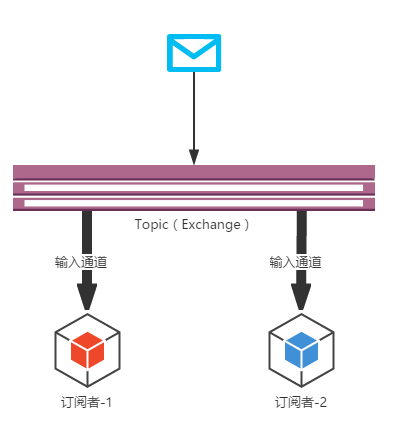

### 1.3. Spring Cloud Stream 应用模型

应用通过集成 Spring Cloud Stream 插入的 input(相当于消费者 consumer，它是从队列中接收消息的)和 output(相当于生产者 producer，它是从队列中发送消息的)通道与外界交流，通道（input、output）通过指定中间件的 Binder 实现与外部代理连接（消息中间件）。因此业务开发者不再关注具体消息中间件，只需关注 Binder 对应用程序提供的抽象概念来使用消息中间件实现业务即可。

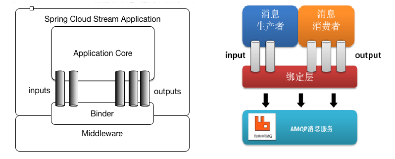

> 说明：最底层是消息服务，中间层是绑定层，绑定层和底层的消息服务进行绑定，顶层是消息生产者和消息消费者，顶层可以向绑定层生产消息和和获取消息消费

### 1.4. Spring Cloud Stream 开发模型

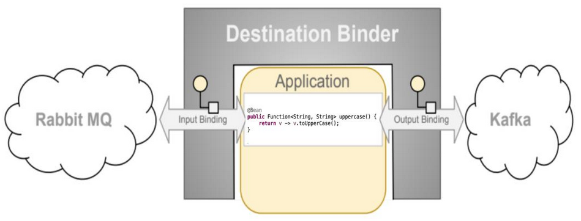

- Destination Binder：目标绑定器，与消息中间件通信的组件。
- Destination Binding：目标绑定，是连接应用和消息中间件的桥梁，用于消息的消费和生产，由 Binder 创建。
- Message 消息：用于 Producer、Consumer 通过 Binder 沟通的规范数据。

### 1.5. 版本关系（更新于2020.11.13）

| Spring Cloud Stream | Spring Boot | Spring Cloud |
| ------------------- | ----------- | ------------ |
| Horsham [3.0.x]     | 2.2.x       | Hoxton       |
| Germantown [2.2.x]  | 2.1.x       | Greenwich    |
| Fishtown [2.1.x]    | 2.1.x       | Greenwich    |
| Elmhurst [2.0.x]    | 2.0.x       | Finchley     |

## 2. 快速入门案例（整合 RabbitMQ）

### 2.1. 案例准备

本次 Spring Cloud Stream 案例是通过 RabbitMQ 作为消息中间件，需要先准备 RabbitMQ 的环境

> 更多 RabbitMQ 的内容详见：[《RabbitMQ 笔记》](/分布式微服务/分布式消息中件间/RabbitMQ)

创建`spring-cloud-sample-stream`聚合工程，引入SpringBoot父工程与SpringCloud版本控制

```xml
<?xml version="1.0" encoding="UTF-8"?>
<project xmlns="http://maven.apache.org/POM/4.0.0"
         xmlns:xsi="http://www.w3.org/2001/XMLSchema-instance"
         xsi:schemaLocation="http://maven.apache.org/POM/4.0.0 http://maven.apache.org/xsd/maven-4.0.0.xsd">

    <modelVersion>4.0.0</modelVersion>
    <groupId>org.example</groupId>
    <artifactId>spring-cloud-sample-stream</artifactId>
    <version>1.0-SNAPSHOT</version>
    <name>${project.artifactId}</name>
    <packaging>pom</packaging>
    <description>Spring Cloud Stream 消息发送组件基础使用示例项目</description>

    <!-- 引入 spring boot 父工程 -->
    <parent>
        <groupId>org.springframework.boot</groupId>
        <artifactId>spring-boot-starter-parent</artifactId>
        <version>2.1.6.RELEASE</version>
    </parent>

    <!-- 版本控制 -->
    <dependencyManagement>
        <dependencies>
            <!-- Spring Cloud Greenwich 版本的依赖 -->
            <dependency>
                <groupId>org.springframework.cloud</groupId>
                <artifactId>spring-cloud-dependencies</artifactId>
                <version>Greenwich.RELEASE</version>
                <type>pom</type>
                <scope>import</scope>
            </dependency>
        </dependencies>
    </dependencyManagement>

    <!-- 项目构建部分 -->
    <build>
        <plugins>
            <plugin>
                <groupId>org.springframework.boot</groupId>
                <artifactId>spring-boot-maven-plugin</artifactId>
            </plugin>
        </plugins>
    </build>
</project>
```

### 2.2. 消息生产者

#### 2.2.1. 创建工程引入依赖

创建消息生产者子模块`stream-producer`，引入Spring Cloud Stream对于支持绑定RabbitMQ的依赖

```xml
<!-- Spring Cloud Stream 支持绑定 RabbitMQ 的依赖 -->
<dependency>
    <groupId>org.springframework.cloud</groupId>
    <artifactId>spring-cloud-starter-stream-rabbit</artifactId>
</dependency>
```

#### 2.2.2. 定义 binding 消息绑定器

Spring Cloud Stream 发送消息时需要定义一个接口，此接口方法的返回对象是`MessageChannel`。此示例直接使用Spring Cloud Stream内置的接口`Source`：

```java
package org.springframework.cloud.stream.messaging;

import org.springframework.cloud.stream.annotation.Output;
import org.springframework.messaging.MessageChannel;

/**
 * Bindable interface with one output channel.
 */
public interface Source {

	String OUTPUT = "output";

	@Output(Source.OUTPUT)
	MessageChannel output();
}
```

这就接口声明了一个 binding 命名为 `output`。这个binding声明了一个消息输出流，也就是消息的生产者。

#### 2.2.3. 修改项目配置

修改application.yml配置文件，配置项目的基本信息、RabbitMQ、Spring Cloud Stream的消息发送的绑定器

```yml
server:
  port: 7001 # 服务端口
spring:
  application:
    name: stream-producer # 指定服务名
  rabbitmq:
    addresses: 192.168.12.132
    username: guest
    password: guest
  cloud:
    stream: # Spring Cloud Stream 配置
      bindings:
        output: # Spring Cloud Stream内置的发送消息的通道（名称为output）
          destination: stream-sample-default  # 指定消息发送的目的地，在RabbitMQ中，发送到一个stream-sample-default的exchange中
          contentType: text/plain # 用于指定消息的类型
      binders:  # 配置绑定器
        defaultRabbit:
          type: rabbit # 指定绑定消息中间件的类型
```

配置说明：

- `spring.cloud.stream.bindings.消息输出流名称.contentType`：用于指定消息的类型。具体可以参考 [spring cloud stream docs](https://cloud.spring.io/spring-cloud-static/spring-cloud-stream/2.2.1.RELEASE/spring-cloud-stream.html#_common_binding_properties)
- `spring.cloud.stream.bindings.消息输出流名称.destination`：指定了消息发送的目的地，对应 RabbitMQ，会发送到 exchange 是 `stream-sample-default` 的所有消息队列中。

#### 2.2.4. 创建消息发送工具类

```java
package com.moon.stream.message;

import org.springframework.beans.factory.annotation.Autowired;
import org.springframework.beans.factory.annotation.Qualifier;
import org.springframework.cloud.stream.annotation.EnableBinding;
import org.springframework.cloud.stream.messaging.Source;
import org.springframework.messaging.MessageChannel;
import org.springframework.messaging.support.MessageBuilder;
import org.springframework.stereotype.Component;

/**
 * 消息发送工具类，用于负责向消息中间件发送消息
 */
@Component // 注册到spring容器中
@EnableBinding(Source.class) // 绑定消息通道，此示例绑定的是Spring Cloud Stream内置的Source接口
public class MessageSender {
    /* 注入消息通道对象 */
    @Autowired
    /*
     * 此处需要指定注入bean的名称，否则会报错：
     *  org.springframework.beans.factory.NoUniqueBeanDefinitionException: No qualifying bean of type 'org.springframework.messaging.MessageChannel' available:
     *  expected single matching bean but found 3: output,nullChannel,errorChannel
     */
    @Qualifier("output")
    private MessageChannel messageChannel;

    /**
     * 发送消息
     *
     * @param obj 发送的内容
     */
    public void send(Object obj) {
        // 通过消息通过对象，发送MQ消息
        messageChannel.send(MessageBuilder.withPayload(obj).build());
    }
}
```

> <font color=red>**注：`@EnableBinding`注解绑定消息发送通道。可以标识在Spring容器管理的配置bean或者入口类上，但一般建议标识在消息发送相关的类上。**</font>

#### 2.2.5. 测试发送消息

- 创建消息生产者项目启动类

```java
package com.moon.stream;

import org.springframework.boot.SpringApplication;
import org.springframework.boot.autoconfigure.SpringBootApplication;

/**
 * Spring Cloud Stream 消息生产者（producer）启动类
 * <p>
 * Spring Cloud Stream 消息生产者的实现步骤：
 * 1. 引入Spring Cloud Stream的依赖
 * 2. 修改application.yml配置消息中间件与stream的相关配置
 * 3. 定义一个通道接口，通过接口中内置的messagechannel
 * 4. 标识@EnableBinding注解绑定对应通道
 * 5. 通过绑定的接口（或内置的Source接口）获取MessageChannel示例，再发送消息
 */
@SpringBootApplication
public class ProducerApplication {
    public static void main(String[] args) {
        SpringApplication.run(ProducerApplication.class, args);
    }
}
```

- 编写测试方法

```java
package com.moon.stream.test;

import com.moon.stream.message.MessageSender;
import org.junit.Test;
import org.junit.runner.RunWith;
import org.springframework.beans.factory.annotation.Autowired;
import org.springframework.boot.test.context.SpringBootTest;
import org.springframework.test.context.junit4.SpringRunner;

/**
 * 消息生产者测试类
 */
@RunWith(SpringRunner.class)
@SpringBootTest
public class ProducerTest {
    @Autowired
    private MessageSender messageSender;

    /* 测试发送消息 */
    @Test
    public void sendMessage() {
        messageSender.send("Hello, Spring Cloud Stream Producer!");
    }
}
```

#### 2.2.6. 番外：不编写工具类，直接在启动类完成消息的发送

```java
package com.moon.stream;

import org.springframework.beans.factory.annotation.Autowired;
import org.springframework.boot.CommandLineRunner;
import org.springframework.boot.SpringApplication;
import org.springframework.boot.autoconfigure.SpringBootApplication;
import org.springframework.cloud.stream.annotation.EnableBinding;
import org.springframework.cloud.stream.messaging.Source;
import org.springframework.messaging.MessageChannel;
import org.springframework.messaging.support.MessageBuilder;

/**
 * Spring Cloud Stream 消息生产者（producer）启动类
 */
@SpringBootApplication
@EnableBinding(Source.class) // 绑定消息通道，此示例绑定的是Spring Cloud Stream内置的Source接口
public class ProducerApplication implements CommandLineRunner {
    /* 注入消息通道对象 */
    @Autowired
    @Qualifier("output") // 此处需要指定注入bean的名称，否则会报错：Field messageChannel in com.moon.stream.ProducerApplication required a single bean, but 3 were found
    private MessageChannel messageChannel;

    public static void main(String[] args) {
        SpringApplication.run(ProducerApplication.class, args);
    }

    /**
     * Callback used to run the bean.
     */
    @Override
    public void run(String... args) throws Exception {
        // 通过消息通过对象，发送MQ消息
        messageChannel.send(MessageBuilder.withPayload("Hello, Spring Cloud Stream Producer!").build());
    }
}
```

> 注：实现了`CommandLineRunner`接口的`run()`方法会在所有的 Spring Beans 都初始化之后，`SpringApplication.run()`之前执行，适合应用程序启动之初的数据初始化工作。

### 2.3. 消息消费者

#### 2.3.1. 创建工程引入依赖

创建消息消费者子模块`stream-consumer`，引入Spring Cloud Stream对于支持绑定RabbitMQ的依赖。*与消费生产者依赖一样*

```xml
<!-- Spring Cloud Stream 支持绑定 RabbitMQ 的依赖 -->
<dependency>
    <groupId>org.springframework.cloud</groupId>
    <artifactId>spring-cloud-starter-stream-rabbit</artifactId>
</dependency>
```

#### 2.3.2. 定义 binding 消息绑定器

Spring Cloud Stream 接收消息与发送消息一致，也需要定义一个接口，此接口方法的返回对象是`SubscribableChannel`。此示例直接使用Spring Cloud Stream内置的接口`Sink`：

```java
package org.springframework.cloud.stream.messaging;

import org.springframework.cloud.stream.annotation.Input;
import org.springframework.messaging.SubscribableChannel;

/**
 * Bindable interface with one input channel.
 */
public interface Sink {

	String INPUT = "input";

	@Input(Sink.INPUT)
	SubscribableChannel input();
}
```

`@Input` 注解对应的方法，需要返回 `SubscribableChannel` 实例，并且指定一个参数值。这就接口声明了一个 binding 命名为 `input`

#### 2.3.3. 修改项目配置

修改application.yml配置文件，配置项目的基本信息、RabbitMQ、Spring Cloud Stream的消息获取的绑定器

```yml
server:
  port: 7002 # 服务端口
spring:
  application:
    name: stream-consumer # 指定服务名
  rabbitmq:
    addresses: 192.168.12.132
    username: guest
    password: guest
  cloud:
    stream: # Spring Cloud Stream 配置
      bindings:
        input: # Spring Cloud Stream内置的获取消息的通道（名称为input）
          destination: stream-sample-default # 指定消息获取的目的地，在RabbitMQ中，从一个stream-sample-default的exchange中获取消息
      binders:  # 配置绑定器
        defaultRabbit:
          type: rabbit # 指定绑定消息中间件的类型
```

#### 2.3.4. 创建消息监听类

```java
package com.moon.stream.listener;

import org.springframework.cloud.stream.annotation.EnableBinding;
import org.springframework.cloud.stream.annotation.StreamListener;
import org.springframework.cloud.stream.messaging.Sink;
import org.springframework.stereotype.Component;

/**
 * 消息监听类
 */
@Component // 注册到spring容器中
@EnableBinding(Sink.class)  // 绑定消息通道，此示例绑定的是Spring Cloud Stream内置的Sink接口
public class MessageListener {
    /**
     * 监听binding中的消息，通过@StreamListener注解指定绑定的名称，
     * 这里使用Spring Cloud Stream内置的Sink接口，名称为“input”
     * (ps. 方法名称随意)
     *
     * @param message
     */
    @StreamListener(Sink.INPUT)
    public void input(String message) {
        System.out.println("获取的消息：" + message);
    }
}
```

在消息监听类上添加注解`@EnableBinding(Sink.class)`，其中 `Sink` 就是上述Spring Cloud Stream内置的接口。同时定义一个方法（此处是 input，方法名随意）标明注解为`@StreamListener(Sink.INPUT)`，表示绑定的消息名称，方法参数`String message`为监听接收到的消息内容。

#### 2.3.5. 测试接收消息

- 创建启动类

```java
/**
 * Spring Cloud Stream 消息消费者（Consumer）启动类
 * <p>
 * Spring Cloud Stream 消息消费者的实现步骤：
 * 1. 引入Spring Cloud Stream的依赖
 * 2. 修改application.yml配置消息中间件与stream的相关配置
 * 3. 定义一个通道接口，通过接口中内置的通道。此示例使用Spring Cloud Stream内置的Sink接口
 * 4. 标识@EnableBinding注解绑定对应通道
 * 5. 配置一个监听方法：当程序从中间件获取数据之后，执行的业务逻辑方法，需要在监听方法上标识 @StreamListener 注解
 */
@SpringBootApplication
public class ConsumerApplication {
    public static void main(String[] args) {
        SpringApplication.run(ConsumerApplication.class, args);
    }
}
```

工程启动后，默认是会创建一个临时队列，临时队列绑定的exchange为`stream-sample-default`，routing key为“`#`”。所有发送exchange为`stream-sample-default`的MQ消息都会被投递到这个临时队列，并且触发上述的方法。

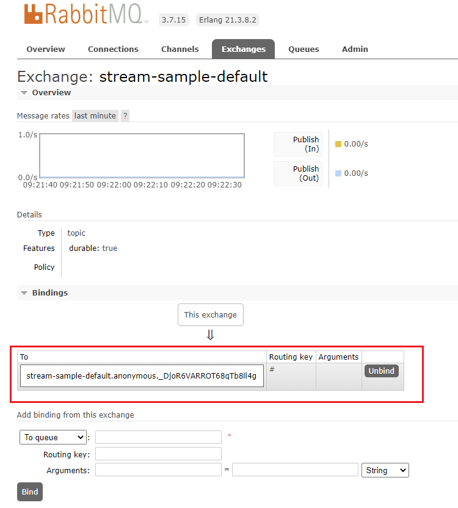

- 启动消息生的消费者，再运行消息发送测试程序，观察是否接收到消息

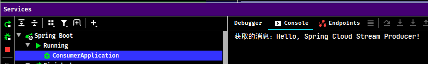

## 3. (暂有问题)Spring Cloud Stream 整合 RocketMQ

### 3.1. 案例准备

此案例为 Spring Cloud Stream 整合 RocketMQ 作为消息中间件，需要先准备 RocketMQ 的环境。*示例沿用前面整合 RabbitMQ 的工程 `spring-cloud-sample-stream`*

> 更多 RocketMQ 的内容详见：[《RocketMQ 笔记》](/分布式微服务/分布式消息中件间/RocketMQ)

### 3.2. 消息生产者开发步骤

消息生产者开发流程

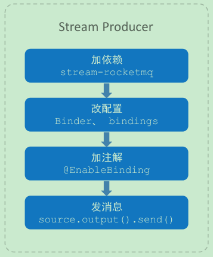

1. 添加 stream-rocketmq 依赖

```xml
<!-- Spring Cloud Stream 支持绑定 RocketMQ 的依赖 -->
<dependency>
    <groupId>com.alibaba.cloud</groupId>
    <artifactId>spring-cloud-starter-stream-rocketmq</artifactId>
</dependency>
```

2. 修改项目配置，增加 rocketmq binder、binding destination 属性配置

```yml
spring:
  cloud:
    stream:
      rocketmq.: # RocketMQ 支持
        binder:
          name-server: 127.0.0.1:9876
      bindings:
        output: # Spring Cloud Stream 内置的发送消息的通道（名称为output）
          destination: topic-test-stream  #  RocketMQ 中会发送到一个主题上
          group: stream-consumer-group
```

3. 在配置类（或者任意 Spring 管理的类）上使用 `@EnableBinding` 注解开启绑定消息通道，此示例绑定的是 Spring Cloud Stream 内置的 Source 接口

```java
@Component // 注册到spring容器中
@EnableBinding(Source.class) // 绑定消息通道，此示例绑定的是Spring Cloud Stream内置的Source接口
public class MessageSender {
    ...
}
```

4. 在消息发送类 `MessageSender` 中导入绑定输出通道对象 `Source`，通过 `source.output()` 方法同样得到与 RabbitMQ 案例中同样的 `MessageChannel` 对象

```java
@Autowired
private Source source;

public void sendRocketMQMessage(Object obj) {
    source.output().send(MessageBuilder.withPayload(obj).build());
}
```

5. 测试发送消息

```java
@RunWith(SpringRunner.class)
@SpringBootTest
public class ProducerTest {

    @Autowired
    private MessageSender messageSender;

    /* 测试基于 RocketMQ 发送消息 */
    @Test
    public void testSendRocketMQMessage() {
        messageSender.sendRocketMQMessage("Spring Cloud Stream Producer use RocketMQ!");
    }
}
```

### 3.3. 消息消费者开发步骤

消息消费者开发流程

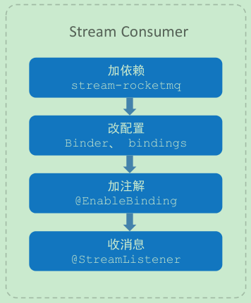

1. 添加 stream-rocketmq 依赖

```xml
<!-- Spring Cloud Stream 支持绑定 RocketMQ 的依赖 -->
<dependency>
    <groupId>com.alibaba.cloud</groupId>
    <artifactId>spring-cloud-starter-stream-rocketmq</artifactId>
</dependency>
```

2. 修改项目配置，增加 rocketmq binder、binding destination 属性配置

```yml
spring:
  cloud:
    stream:
      rocketmq: # RocketMQ 支持
        binder:
          name-server: 127.0.0.1:9876
      bindings:
        input: # Spring Cloud Stream 内置的接收消息的通道（名称为input）
          destination: topic-test-stream  #  RocketMQ 中会发送到一个主题上
          group: stream-consumer-group
```

3. 在自定义的消息监听类中（或者任意 Spring 管理的类）上使用 `@EnableBinding` 注解开启绑定消息通道。`@StreamListener` 指定 `Sink` 接口

```java
@Component // 注册到spring容器中
@EnableBinding(Sink.class)  // 绑定消息通道，此示例绑定的是Spring Cloud Stream内置的Sink接口
public class MessageListener {
    /**
     * 监听binding中的消息，通过@StreamListener注解指定绑定的名称，
     * 这里使用Spring Cloud Stream内置的Sink接口，名称为“input”
     * (ps. 方法名称随意)
     */
    @StreamListener(Sink.INPUT)
    public void input(String message) {
        System.out.println("获取的消息：" + message);
    }
}
```

4. 启动消息生产者与接收者进行测试。

## 4. 消息过滤

对于消息消费者，可能只希望处理具有某些特征的消息，这就需要对消息进行过滤。

为了简化开发，Spring Cloud Stream 提供了消息过滤的方式，在 `@StreamListener` 注解中添加 `condition` 属性，其值编写相应的过滤条件表达式即可。如：

```java
@StreamListener(
        value = Sink.INPUT,
        condition = "headers['test-header']=='my test'"
)
public void input(String message) {
    System.out.println("获取的消息：" + message);
}
```

## 5. 自定义消息通道

Spring Cloud Stream 内置了两种接口，分别定义了 binding 为 `input` 的输入流和 `output` 的输出流，而在实际使用中，往往是需要自定义各种输入输出流。

### 5.1. 创建自定义消息binding接口

参考 Spring Cloud Stream 内置的 binding 接口，创建一个自定义的消息 binding 接口。接口主要包含的内容是：

1. 定义输入（输出）通道的名称
2. 使用`@Input`注解标识输入流方法（*方法名随意*）方法的返回值为`SubscribableChannel`；使用`@Output`注解标识输出流方法（*方法名随意*）方法的返回值为`MessageChannel`

一个接口中，可以定义无数个输入输出流，可以根据实际业务情况划分。以下示例的接口，定义了一个输入和输出两个 binding。

```java
package com.moon.stream.channel;

import org.springframework.cloud.stream.annotation.Input;
import org.springframework.cloud.stream.annotation.Output;
import org.springframework.messaging.MessageChannel;
import org.springframework.messaging.SubscribableChannel;

/**
 * 自定义的消息通道
 * 1. 定义消息通道的名称（输入/输出）
 * 2. 使用@Input与@Output注解修饰消息消费与生产的方法（方法名随意
 */
public interface CustomProcessor {
    /* 定义输入通道名称 */
    String INPUT = "customInput";

    /* 定义输出通道名称 */
    String OUTPUT = "customOutput";

    /* 定义消息消费者的配置 */
    @Input(CustomProcessor.INPUT)
    SubscribableChannel input();

    /* 定义消息生产者的配置 */
    @Output(CustomProcessor.OUTPUT)
    MessageChannel output();
}
```

> *使用上面快速入门的示例代码，因为将输入与输出两个binding定义在一个接口中，而消息的生产者与消费者工程都用到，所以抽取此消息binding接口到一个工程中，并将Spring Cloud Stream的依赖抽取到此公共工程中，详见《spring-cloud-note\spring-cloud-greenwich-sample\15-springcloud-stream》*

### 5.2. 修改消费者与生产者项目配置

- 修改生产者工程配置，增加自定义消息通道的配置

```yml
spring:
  cloud:
    stream: # Spring Cloud Stream 配置
      bindings:
        output: # Spring Cloud Stream内置的发送消息的通道（名称为output）
          destination: stream-sample-default  # 指定消息发送的目的地，在RabbitMQ中，发送到一个stream-sample-default的exchange中
          contentType: text/plain # 用于指定消息的类型
        customOutput: # 自定义的发送消息的通道（在CustomProcessor接口中定义的）
          destination: stream-sample-custom
      binders:  # 配置绑定器
        defaultRabbit:
          type: rabbit # 指定绑定消息中间件的类型
```

- 修改消费者项目的配置，与生产者一样，增加自定义消息通道的配置

```yml
spring:
  cloud:
    stream: # Spring Cloud Stream 配置
      bindings:
        input: # Spring Cloud Stream内置的获取消息的通道（名称为input）
          destination: stream-sample-default # 指定消息获取的目的地，在RabbitMQ中，从一个stream-sample-default的exchange中获取消息
        customInput: # 自定义的获取消息的通道（在CustomProcessor接口中定义的）
          destination: stream-sample-custom
      binders:  # 配置绑定器
        defaultRabbit:
          type: rabbit # 指定绑定消息中间件的类型
```

### 5.3. 创建消息发送工具类与消息监听类

- 创建`CustomMessageSender`消息发送工具类，绑定自定义消息通道

```java
/**
 * 自定义消息通道绑定与消息发送工具类 */
@Component
@EnableBinding(CustomProcessor.class) // 绑定自定义消息通道接口
public class CustomMessageSender {
    /* 注入自定义消息通道对象 */
    @Autowired
    // @Qualifier(CustomProcessor.OUTPUT) // 指定spring容器中MessageChannel的名称，或者注入的属性名称与容器中beanName一致也可以
    private MessageChannel customOutput;

    /**
     * 发送消息
     *
     * @param obj 发送的内容
     */
    public void send(Object obj) {
        // 通过消息通过对象，发送MQ消息
        customOutput.send(MessageBuilder.withPayload(obj).build());
    }
}
```

- 创建`CustomMessageListener`消息监听类，监听自定义消息通道

```java
/**
 * 自定义消息通道的消息监听类
 */
@Component
@EnableBinding(CustomProcessor.class) // 绑定自定义消息通道
public class CustomMessageListener {
    /**
     * 监听自定义消息通道（CustomProcessor.INPUT）的消息(ps. 方法名称随意)
     */
    @StreamListener(CustomProcessor.INPUT)
    public void input(String message) {
        System.out.println("监听自定义消费通道获取的消息：" + message);
    }
}
```

### 5.4. 测试发送与接收消息

- 创建生产者的发送消息的

```java
@Autowired
private CustomMessageSender customMessageSender;

/* 测试自定义消息通道发送消息 */
@Test
public void sendMessageByCustomChannel() {
    customMessageSender.send("Hello, send message from custom channel!");
}
```

启动消费者工程，通过测试方法发送消息到自定义消息通道

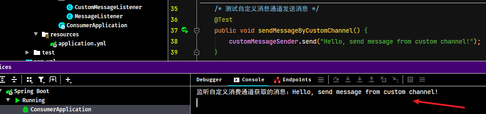

## 6. 消息分组

通常在生产环境，每个服务都不会以单节点的方式运行在生产环境，当同一个服务启动多个实例的时候，这些实例都会绑定到同一个消息通道的目标主题（Topic）上。默认情况下，当生产者发出一条消息到绑定通道上，这条消息会产生多个副本被每个消费者实例接收和处理，会造成**重复消费**。但是有些业务场景之下，只希望生产者产生的消息只被其中一个实例消费，此时就需要为这些消费者设置消费组来实现这样的功能。

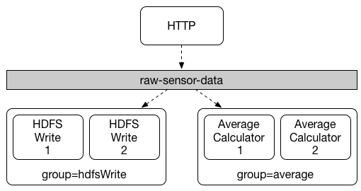

实现此需求只需要在服务消费者端设置`spring.cloud.stream.bindings.输入通道名称.group` 属性即可，<font color=red>**在同一个 group 中的多个消费者只有一个可以获取到消息并消费**</font>。配置如下：

```yml
spring:
  cloud:
    stream: # Spring Cloud Stream 配置
      bindings:
        input: # Spring Cloud Stream内置的获取消息的通道（名称为input）
          destination: stream-sample-default # 指定消息获取的目的地，在RabbitMQ中，从一个stream-sample-default的exchange中获取消息
        customInput: # 自定义的获取消息的通道（在CustomProcessor接口中定义的）
          destination: stream-sample-custom
          group: group-1 # 设置此消息目的地所属分组的名称，同名分组中的多个消息者，只有一个实例去获取消息并消费
      binders:  # 配置绑定器
        defaultRabbit:
          type: rabbit # 指定绑定消息中间件的类型
```

> 复制上面示例消息者工程创建新的副本工程，将端口号改成`7003`即可用于测试

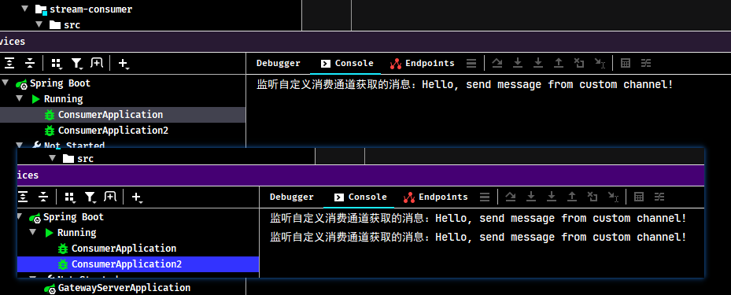

<font color=red>经测试，同一个分组的多个消费者默认是以**轮询**（非绝对，只确保同一个组内多个消费不重复消费而已）的方法进行消费</font>

## 7. 消息分区

有一些场景需要满足，同一个特征的数据被同一个实例消费，比如同一个id的传感器监测数据必须被同一个实例统计计算分析，否则可能无法获取全部的数据。又比如部分异步任务，首次请求启动task，二次请求取消task，此场景就必须保证两次请求至同一实例。

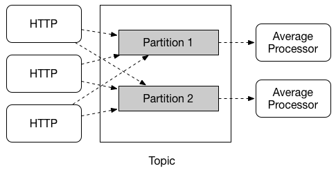

> Notes: 因为 RocketMQ 对消息分区的支持不够好，所以示例使用了 RabbitMQ

### 7.1. 消息生产者配置

修改生产者工程的`application.yml`配置文件，增加分区相关配置

```yml
spring:
  application:
    name: stream-producer # 指定服务名
  rabbitmq:
    addresses: 192.168.12.132
    username: guest
    password: guest
  cloud:
    stream: # Spring Cloud Stream 配置
      bindings:
        output: # Spring Cloud Stream内置的发送消息的通道（名称为output）
          destination: stream-sample-default  # 指定消息发送的目的地，在RabbitMQ中，发送到一个stream-sample-default的exchange中
          contentType: text/plain # 用于指定消息的类型
        customOutput: # 自定义的发送消息的通道（在CustomProcessor接口中定义的）
          destination: stream-sample-custom
          producer:
            partitionKeyExpression: payload # 指定分区键（关键字）的表达式规则。可以使用SpEL表达式配置。注：属性名也可以使用中划线间隔方式，如，partition-key-expression
            partitionCount: 2 # 指定消息分区的数量
```

**配置说明**

- `spring.cloud.stream.bindings.消息通道名称.producer.partitionKeyExpression`：通过该参数指定了分区键的表达式规则，可以根据实际的输出消息规则来配置SpEL来生成合适的分区键
- `spring.cloud.stream.bindings.消息通道名称.producer.partitionCount`：该参数指定了消息分区的数量

[点击查看官网更多生产者详细配置项](https://cloud.spring.io/spring-cloud-static/spring-cloud-stream/2.2.1.RELEASE/spring-cloud-stream.html#_producer_properties)

### 7.2. 消息消费者配置

修改消费者工程的`application.yml`配置文件，增加分区相关配置

```yml
spring:
  application:
    name: stream-consumer # 指定服务名
  rabbitmq:
    addresses: 192.168.12.132
    username: guest
    password: guest
  cloud:
    stream: # Spring Cloud Stream 配置
      instanceCount: 2  # 指定消费者实例总数 注：属性名也可以使用中划线间隔方式，如，instance-count
      instanceIndex: 0  # 当前消费者实例的索引，从0开始，最大值为 “instanceCount参数值-1”
      bindings:
        input: # Spring Cloud Stream内置的获取消息的通道（名称为input）
          destination: stream-sample-default # 指定消息获取的目的地，在RabbitMQ中，从一个stream-sample-default的exchange中获取消息
        customInput: # 自定义的获取消息的通道（在CustomProcessor接口中定义的）
          destination: stream-sample-custom
          group: group-1 # 设置此消息目的地所属分组的名称，同名分组中的多个消息者，只有一个实例去获取消息并消费
          consumer:
            partitioned: true  # 开启消费者分区支持
      binders:  # 配置绑定器
        defaultRabbit:
          type: rabbit # 指定绑定消息中间件的类型
```

**配置说明**

- `spring.cloud.stream.instanceCount`：该参数指定了当前消费者的总实例数量
- `spring.cloud.stream.instanceIndex`：该参数设置当前实例的索引号，从0开始，最大值为 “`spring.cloud.stream.instanceCount`参数值 - 1”。*测试时也可以通过运行参数的方式启动多个实例，从而设置不同的索引值*
- `spring.cloud.stream.bindings.消息通道名称.consumer.partitioned`：通过该参数开启消费者分区功能

[点击查看官网更多消费者详细配置项](https://cloud.spring.io/spring-cloud-static/spring-cloud-stream/2.2.1.RELEASE/spring-cloud-stream.html#_consumer_properties)

### 7.3. 测试

编写生产的测试方法，发送多次消息

```java
/* 测试消息分区支持功能 */
@Test
public void testMessagePartitioningSupport() {
    for (int i = 0; i < 5; i++) {
        customMessageSender.send(0);
    }
}
```

以上示例的消息分区配置就完成了，可以再次启动这两个应用，同时消费者启动多个，但需要注意的是要为消费者指定不同的实例索引号，这样当同一个消息被发给消费组时，可以发现只有一个消费实例在接收和处理这些相同的消息。

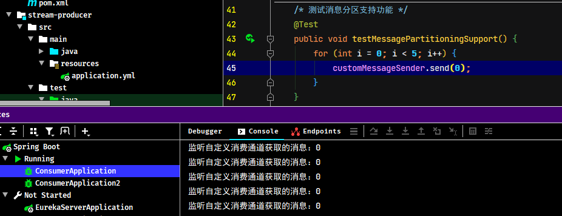

## 8. 消费异常处理

### 8.1. 概述

消费者在接收消息时，可能会发生异常，需要采取一些策略来处理异常，通常可以分为：

1. 应用级处理：通用，与底层 MQ 无关
2. 系统级处理：根据不同的 MQ 特性进行处理，例如 RabbitMQ 可以放入死信队列
3. 重试 RetryTemplate：配置消费失败后如何重试

Spring Cloud Steam 提供了应用级处理策略：

- 局部处理方式
- 全局处理方式

### 8.2. 局部消费异常处理

在消费者应用中，定义一个异常处理方法，并在方法上标识 `@ServiceActivator` 注解，在 `inputChannel` 属性上指定要处理异常相应的主题，方法的参数是 `org.springframework.messaging.support.ErrorMessage`。语法格式如下：

```java
@ServiceActivator(
    inputChannel = "主题.消费者组.errors"
)
public void handleError(ErrorMessage errorMessage) {
    // 异常处理逻辑
}
```

### 8.3. 全局消费异常处理

全局消费异常处理，使用 `@StreamListener` 注解标识异常处理方法，并指定相应内置接口名称 `errorChannel` 即可。语法格式如下：

```java
@StreamListener("errorChannel")
public void handleGlobalError(ErrorMessage errorMessage) {
    log.error("全局异常. errorMsg: {}", errorMessage);
}
```
