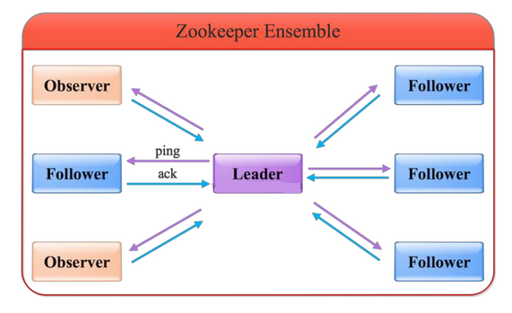
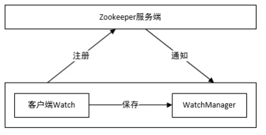
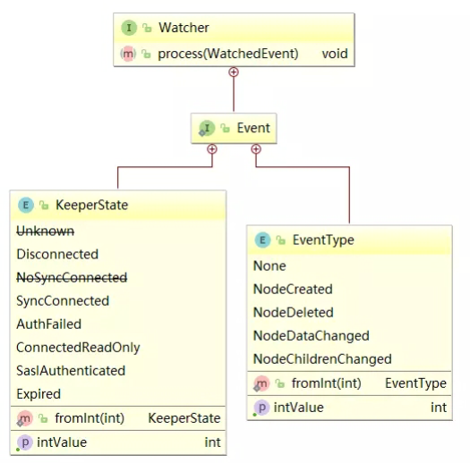

## 1. Zookeeper 概念

**Zookeeper 是一个分布式协调服务，可用于实现数据发布/订阅、负载均衡、命名服务、分布式协调/通知、集群管理、Master 选举、分布式锁和分布式队列等功能**。Zookeeper 提供了一个类似于 Linux 文件系统的树形结构（可认为是轻量级的内存文件系统，但只适合存少量信息，完全不适合存储大量文件或者大文件），同时它集群的管理者，提供了对于每个节点的监控与通知机制。

Zookeeper 实际是一个『文件系统』+『监控通知中心』

### 1.1. Zookeeper 文件系统

#### 1.1.1. 文件系统简介

Zookeeper 提供一个多层级的节点命名空间（节点称为 znode）。与文件系统不同的是，zk 这些节点都可以设置关联的数据，而文件系统中只有文件节点可以存放数据而目录节点不能。

Zookeeper 为了保证高吞吐和低延迟，在内存中维护了这个树状的目录结构，这种特性使得 Zookeeper 不能用于存放大量的数据，每个节点的存放数据上限为 1M。

#### 1.1.2. Znode 四种类型的数据节点

1. **PERSISTENT（持久节点）**：除非手动删除，否则节点一直存在于 Zookeeper 上。
2. **EPHEMERAL（临时节点）**：临时节点的生命周期与客户端会话绑定。即与 Session 有关，一旦客户端 Session 失效（**注：客户端与 Zookeeper 连接断开不一定会话失效**），则这个客户端创建的所有临时节点数据都被销毁。
3. **PERSISTENT_SEQUENTIAL（持久顺序编号节点）**：基本特性同持久节点，只是增加了顺序属性，节点名后边会追加一个由父节点维护的自增整型数字。
4. **EPHEMERAL_SEQUENTIAL（临时顺序编号节点）**：基本特性同临时节点，增加了顺序属性，节点名后边会追加一个由父节点维护的自增整型数字。

### 1.2. Zookeeper 角色

Zookeeper 集群是一个基于主从复制的高可用集群，每个服务器承担如下三种角色中的一种。



#### 1.2.1. Leader

一个 Zookeeper 集群同一时间只会有一个实际工作的 Leader，它会发起并维护与各 Follwer 及 Observer 间的心跳。

**所有的写操作必须要通过 Leader 完成再由 Leader 将写操作广播给其它服务器。只要有超过半数节点（不包括 observeer 节点）写入成功，该写请求就会被提交（类 2PC 协议）**。

#### 1.2.2. Follower

一个 Zookeeper 集群可能同时存在多个 Follower，它会响应 Leader 的心跳。

**Follower 可直接处理并返回客户端的读请求，同时会将写请求转发给 Leader 处理，并且负责在 Leader 处理写请求时对请求进行投票**。

#### 1.2.3. Observer

3.0 版本后引入的角色，与 Follower 类似，但是无投票权。

Zookeeper 需保证高可用和强一致性，为了支持更多的客户端，需要增加更多 Server。但 Server 增多会导致投票阶段延迟增大，影响性能。因此引入 Observer 这个角色，Observer 不参与投票但会接受客户端的连接，并将写请求转发给 leader 节点。所有加入更多 Observer 节点，提高伸缩性，同时不影响吞吐率。

### 1.3. Zookeeper 下 Server 工作状态

服务器具有四种状态，分别是 `LOOKING`、`FOLLOWING`、`LEADING`、`OBSERVING`。

- `LOOKING`：寻找 Leader 状态。当服务器处于该状态时，它会认为当前集群中没有 Leader，因此需要进入 Leader 选举状态。
- `FOLLOWING`：跟随者状态。表明当前服务器角色是 Follower。
- `LEADING`：领导者状态。表明当前服务器角色是 Leader。
- `OBSERVING`：观察者状态。表明当前服务器角色是 Observer。

### 1.4. Zookeeper 保证的分布式特性

Zookeeper 保证了如下分布式的特性：

- 顺序一致性
- 原子性
- 单一视图
- 可靠性
- 实时性（最终一致性）

**实时性（最终一致性）**：客户端的读请求可以被集群中的任意一台机器处理，如果读请求在节点上注册了监听器，这个监听器也是由所连接的 zookeeper 机器来处理。对于写请求，这些请求会同时发给其他 zookeeper 机器并且达成一致后，请求才会返回成功。因此，随着 zookeeper 的集群机器增多，读请求的吞吐会提高但写请求的吞吐会下降。

**顺序一致性**：有序性是 zookeeper 中非常重要的一个特性，所有的更新都是全局有序的，每个更新都有一个唯一的时间戳，这个时间戳称为 zxid（Zookeeper Transaction Id）。而读请求只会相对于更新有序，也就是读请求的返回结果中会带有这个 zookeeper 最新的 zxid。

## 2. Zookeeper 服务端

### 2.1. 安装

#### 2.1.1. 安装包方式

- zookeeper 底层依赖于 jdk，zookeeper 用户登录后，根目录下先进行 jdk 的安装，jdk 使用 jdk-8u131-linux-x64.tar.gz 版本，上传并解压 jdk

```bash
# 解压jdk
tar -xzvf jdk-8u131-linux-x64.tar.gz
```

- 配置jdk环境变量

```bash
# vim打开 .bash_profile文件
vi .bash_profile

# 文件中加入如下内容
JAVA_HOME=/home/zookeeper/jdk1.8.0_131
export JAVA_HOME
​
PATH=$JAVA_HOME/bin:$PATH
export PATH
​
# 使环境变量生效
. .bash_profile

# 检测jdk安装
java -version
```

- zookeeper使用zookeeper-x.x.x.tar.gz，上传并解压

```bash
tar -xzvf zookeeper-3.4.10.tar.gz
```

- 为zookeeper准备配置文件

```bash
# 进入conf目录
cd /home/zookeeper/zookeeper-x.x.x/conf
# 复制配置文件
cp zoo_sample.cfg zoo.cfg
# zookeeper根目录下新建data目录
mkdir data
# vi 修改配置文件中的dataDir
# 此路径用于存储zookeeper中数据的内存快照、及事物日志文件
dataDir=/home/zookeeper/zookeeper-x.x.x/data
```

#### 2.1.2. docker 方式（待整理）

整理中...

### 2.2. 配置

修改 conf 目录的 zoo.cfg 文件，可以设置 zk 相关配置。如下是本人配置参考：

```properties
# The number of milliseconds of each tick
tickTime=2000
# The number of ticks that the initial 
# synchronization phase can take
initLimit=10
# The number of ticks that can pass between 
# sending a request and getting an acknowledgement
syncLimit=5
# the directory where the snapshot is stored.
# do not use /tmp for storage, /tmp here is just 
# example sakes.
dataDir=E:/deployment-environment/apache-zookeeper-3.6.3-bin/data
# the port at which the clients will connect
clientPort=2181
# the maximum number of client connections.
# increase this if you need to handle more clients
#maxClientCnxns=60
#
# Be sure to read the maintenance section of the 
# administrator guide before turning on autopurge.
#
# http://zookeeper.apache.org/doc/current/zookeeperAdmin.html#sc_maintenance
#
# The number of snapshots to retain in dataDir
#autopurge.snapRetainCount=3
# Purge task interval in hours
# Set to "0" to disable auto purge feature
#autopurge.purgeInterval=1
# Zookeeper AdminServer port
admin.serverPort=9999

## Metrics Providers
#
# https://prometheus.io Metrics Exporter
#metricsProvider.className=org.apache.zookeeper.metrics.prometheus.PrometheusMetricsProvider
#metricsProvider.httpPort=7000
#metricsProvider.exportJvmInfo=true
# 日志文件
dataLogDir=E:/deployment-environment/apache-zookeeper-3.6.3-bin/log
```

> 注：Zookeeper3.5的新特性：会启动 Zookeeper AdminServer，默认使用 8080 端口。可以通过配置文件的 `admin.serverPort=8888` 修改 AdminServer 的端口

### 2.3. 启动与停止

修改了相应的配置之后，可以直接通过 zkServer.sh 这个脚本进行服务的相关操作

```bash
# 进入zookeeper的bin目录
cd /home/zookeeper/zookeeper-3.x.x/bin

# 启动 ZK 服务
sh bin/zkServer.sh start
# 查看 ZK 服务状态
sh bin/zkServer.sh status
# 停止 ZK 服务
sh bin/zkServer.sh stop
# 重启 ZK 服务
sh bin/zkServer.sh restart
```

## 3. Zookeeper 常用操作命令

### 3.1. 新增节点

命令格式：

```bash
# 其中-s 为有序节点，-e 临时节点
create [-s] [-e] path data
```

- 创建持久化节点并写入数据。**不带任何参数，默认是新增持久节点**

```bash
create /hadoop "123456"
```

- 创建持久化有序节点，此时创建的节点名为`指定节点名 + 自增序号`

```bash
[zk: localhost:2181(CONNECTED) 2] create -s /a "aaa"
Created /a0000000000
[zk: localhost:2181(CONNECTED) 3] create -s /b "bbb"
Created /b0000000001
[zk: localhost:2181(CONNECTED) 4] create -s /c "ccc"
Created /c0000000002
```

- 创建临时节点，临时节点会在会话过期后被删除

```bash
[zk: localhost:2181(CONNECTED) 5] create -e /tmp "tmp"
Created /tmp
```

- 创建临时有序节点，临时节点会在会话过期后被删除

```bash
[zk: localhost:2181(CONNECTED) 6] create -s -e /aa 'aaa'
Created /aa0000000004
[zk: localhost:2181(CONNECTED) 7] create -s -e /bb 'bbb'
Created /bb0000000005
[zk: localhost:2181(CONNECTED) 8] create -s -e /cc 'ccc'
Created /cc0000000006
```

> 注意：临时节点不能创建子节点

```bash
[zk: localhost:2181(CONNECTED) 19] create /test/test1
Ephemerals cannot have children: /test/test1
```

### 3.2. 更新节点

更新节点的命令是`set`，语法如下：

```bash
set [-s] [-v version] path data
```

可以直接进行修改

```bash
[zk: localhost:2181(CONNECTED) 3] set /hadoop "345"
cZxid = 0x4
ctime = Thu Dec 12 14:55:53 CST 2019
mZxid = 0x5
mtime = Thu Dec 12 15:01:59 CST 2019
pZxid = 0x4
cversion = 0
dataVersion = 1
aclVersion = 0
ephemeralOwner = 0x0
dataLength = 3
numChildren = 0
```

也可以基于版本号进行更改，此时类似于乐观锁机制，当传入的数据版本号 (dataVersion) 和当前节点的数据版本号不符合时，zookeeper 会拒绝本次修改：

```bash
[zk: localhost:2181(CONNECTED) 12] set -v 1 /hadoop "asss"
version No is not valid : /hadoop
```

### 3.3. 删除节点

删除节点的语法：

```bash
# 删除单个节点，该节点下不能有子节点，否则拒绝删除
delete [-v version] path
# 级联删除，包含删除该节点下所有子节点
deleteall path [-b batch size]
```

和更新节点数据一样，也可以传入版本号，当传入的数据版本号 (dataVersion) 和当前节点的数据版本号不符合时，zookeeper 不会执行删除操作。

```bash
[zk: localhost:2181(CONNECTED) 21] delete -v 1 /hadoop
version No is not valid : /hadoop
```

如果某个节点下有子节点，使用`delete`命令无法删除该节点，需要使用`deleteall`命令

```java
[zk: localhost:2181(CONNECTED) 30] delete /moon
Node not empty: /moon
[zk: localhost:2181(CONNECTED) 31] deleteall /moon
```

### 3.4. 查看节点

查看节点语法：

```bash
get [-s] [-w] path
```

- 参数 `-s` 列举出节点详情
- 参数 `-w` 添加一个 watch（监视器）

查询某个节点详细信息

```bash
[zk: localhost:2181(CONNECTED) 4] get -s /hadoop
345
cZxid = 0x6a
ctime = Thu Jun 17 22:37:55 CST 2021
mZxid = 0x6c
mtime = Thu Jun 17 22:38:12 CST 2021
pZxid = 0x6a
cversion = 0
dataVersion = 2
aclVersion = 0
ephemeralOwner = 0x0
dataLength = 3
numChildren = 0
```

节点各个属性如下表。其中一个重要的概念是 Zxid(ZooKeeper Transaction Id)，ZooKeeper 节点的每一次更改都具有唯一的 Zxid，如果 Zxid1 小于 Zxid2，则 Zxid1 的更改发生在 Zxid2 更改之前。

|                状态属性                 |                                        说明                                        |
| -------------------------------------- | --------------------------------------------------------------------------------- |
| cZxid                                  | 数据节点创建时的事务 ID                                                              |
| ctime                                  | 数据节点创建时的时间                                                                 |
| <font color=red>**mZxid**</font>       | 数据节点最后一次更新时的事务 ID                                                      |
| <font color=red>**mtime**</font>       | 数据节点最后一次更新时的时间                                                         |
| pZxid                                  | 数据节点的子节点最后一次被修改时的事务 ID                                              |
| cversion                               | 子节点的更改次数                                                                    |
| <font color=red>**dataVersion**</font> | 节点数据的更改次数                                                                  |
| aclVersion                             | 节点的 ACL 的更改次数                                                               |
| ephemeralOwner                         | 如果节点是临时节点，则表示创建该节点的会话的 SessionID；如果节点是持久节点，则该属性值为 0 |
| dataLength                             | 数据内容的长度                                                                      |
| numChildren                            | 数据节点当前的子节点个数                                                             |

> 注：重点关注红色加粗的属性值

### 3.5. 查看节点状态

查看节点状态语法：

```bash
stat [-w] path
```

- 参数 `-w` 添加一个 watch（监视器）

注：`stat` 命令查看节点状态，它的返回值和 `get` 命令类似，但不会返回节点数据

```bash
[zk: localhost:2181(CONNECTED) 5] stat /hadoop
cZxid = 0x6a
ctime = Thu Jun 17 22:37:55 CST 2021
mZxid = 0x6c
mtime = Thu Jun 17 22:38:12 CST 2021
pZxid = 0x6a
cversion = 0
dataVersion = 2
aclVersion = 0
ephemeralOwner = 0x0
dataLength = 3
numChildren = 0
```

### 3.6. 查看节点列表

查看节点列表语法：

```bash
ls [-s] [-w] [-R] path
```

- 参数 `-s` 列举出节点详情
- 参数 `-w` 添加一个 watch（监视器）
- 参数 `-R` 列举出节点的级联节点（需要注意：参数必须大写）

```bash
[zk: localhost:2181(CONNECTED) 2] ls /
[dubbo, hadoop, moon0000000004, zero0000000005, zookeeper]
```

### 3.7. 监听器

注册的监听器能够在节点内容发生改变的时候，向客户端发出通知。<font color=red>**需要注意的是 zookeeper 的触发器是一次性的 (One-time trigger)，即触发一次后就会立即失效**</font>。

可以注册监听器的操作分别有：查询节点（`get`）、查询节点状态（`stat`）、查询节点列表（`ls`）

#### 3.7.1. 查看节点时注册监听器

使用`get -w path`命令注册的监听器能够在节点内容发生改变的时候，会向客户端发出一次通知

```bash
[zk: localhost:2181(CONNECTED) 4] get -w /hadoop
[zk: localhost:2181(CONNECTED) 5] set /hadoop 888
WATCHER::
WatchedEvent state:SyncConnected type:NodeDataChanged path:/hadoop
```

#### 3.7.2. 查看节点状态时注册监听器

使用`stat -w path`命令注册的监听器能够在节点状态发生改变的时候，会向客户端发出一次通知

```bash
[zk: localhost:2181(CONNECTED) 6] stat -w /hadoop
[zk: localhost:2181(CONNECTED) 7] set /hadoop 2020
WATCHER::
WatchedEvent state:SyncConnected type:NodeDataChanged path:/hadoop
```

#### 3.7.3. 查看节点列表时注册监听器

使用`ls -w path`命令注册的监听器能够<font color=red>**监听该节点下所有子节点的增加和删除等操作**</font>，会向客户端发出一次通知

```bash
[zk: localhost:2181(CONNECTED) 11] ls -R /hadoop
/hadoop
/hadoop/moon
/hadoop/moon/zero
[zk: localhost:2181(CONNECTED) 12] ls -w /hadoop
[moon]
[zk: localhost:2181(CONNECTED) 13] deleteall /hadoop/moon
WATCHER::
WatchedEvent state:SyncConnected type:NodeChildrenChanged path:/hadoop
```

## 4. Zookeeper 的 ACL 权限控制

### 4.1. ACL 概述

UGO（User/Group/Others）：目前在 Linux/Unix 文件系统中使用，也是使用最广泛的权限控制方式，是一种粗粒度的文件系统权限控制模式。

zookeeper 类似文件系统，client 可以创建节点、更新节点、删除节点。Zookeeper 的 ACL（access control list 访问控制列表）就是实现对节点的权限的控制。

### 4.2. ACL 权限控制的基础语法

```
scheme:id:permission
```

主要涵盖3个维度：

- 权限模式（`scheme`）：授权的策略
- 授权对象（`id`）：授权的对象
- 权限（`permission`）：授予的权限

其特性：

- zooKeeper的权限控制是基于每个znode节点的，需要对每个节点设置权限
- 每个znode支持设置多种权限控制方案和多个权限
- 子节点不会继承父节点的权限，客户端无权访问某节点，但可能可以访问它的子节点

示例：

```bash
# 将节点权限设置为IP:192.168.60.130的客户端可以对节点进行增、删、改、查、管理权限
setAcl /test2 ip:192.168.60.130:crwda
```

#### 4.2.1. scheme 权限模式

定义采用何种方式授权

| 方案值  |                                                         描述                                                          |
| :----: | -------------------------------------------------------------------------------------------------------------------- |
|   ip   | 对客户端使用IP地址权限控制                                                                                               |
| digest | 最常用，使用类似于`用户名:密码`的权限标识来进行权限控制                                                                       |
|  auth  | 使用已添加认证的用户认证                                                                                                 |
| world  | 最开放的权限控制方式，是一种特殊的 digest 模式，只有一个权限标识`world:anyone`。只有一个用户：anyone，代表登录zokeeper所有人（默认） |
| Super  | 超级用户                                                                                                               |


#### 4.2.2. id 授权对象

授权对象是指，权限赋予的实体，即指定给谁授予权限。例如：IP 地址或用户。

#### 4.2.3. permission 权限

permission 用于指定授予什么类型的权限。其中 create、delete、read、writer、admin 也就是 增、删、改、查、管理权限，这5种权限简写为`cdrwa`。

|  权限   | ACL简写 |                                  描述                                  |
| :----: | :-----: | --------------------------------------------------------------------- |
| create |    c    | 数据节点创建权限，允许授权对象在该 Znode 下创建子节点                         |
| delete |    d    | 子节点删除权限，允许授权对象删除该数据节点的子节点（仅下一级节点）               |
|  read  |    r    | 数据节点的读取权限，允许授权对象访问该数据节点，并读取其数据内容及其子节点列表等   |
| write  |    w    | 数据节点更新权限，允许授权对象对该数据节点进行更新操作                         |
| admin  |    a    | 数据节点管理权限，允许授权对象对该数据节点进行 ACL (访问控制列表权限)相关设置操作 |

**注意：这5种权限中，delete 是指对子节点的删除权限，其它4种权限指对自身节点的操作权限**

### 4.3. ACL 授权命令

|   命令   |    描述     |
| :-----: | ---------- |
| getAcl  | 读取ACL权限  |
| setAcl  | 设置ACL权限  |
| addauth | 添加认证用户 |

### 4.4. ACL 权限控制示例

#### 4.4.1. world 授权模式

命令

```bash
setAcl <path> world:anyone:<acl>
```

示例

```bash
[zk: localhost:2181(CONNECTED) 1] create /node1 "node1"
Created /node1
[zk: localhost:2181(CONNECTED) 2] getAcl /node1
'world,'anyone   # world方式对所有用户进行授权
: cdrwa          # 增、删、改、查、管理
[zk: localhost:2181(CONNECTED) 3] setAcl /node1 world:anyone:cdrwa
cZxid = 0x2
ctime = Fri Dec 13 22:25:24 CST 2021
mZxid = 0x2
mtime = Fri Dec 13 22:25:24 CST 2021
pZxid = 0x2
cversion = 0
dataVersion = 0
aclVersion = 1
ephemeralOwner = 0x0
dataLength = 5
numChildren = 0
```

#### 4.4.2. IP 授权模式

命令

```bash
setAcl <path> ip:<ip>:<acl>
```

示例

```bash
[zk: localhost:2181(CONNECTED) 18] create /node2 "node2"
Created /node2
​
[zk: localhost:2181(CONNECTED) 23] setAcl /node2 ip:192.168.60.129:cdrwa
cZxid = 0xe
ctime = Fri Dec 13 22:30:29 CST 2021
mZxid = 0x10
mtime = Fri Dec 13 22:33:36 CST 2021
pZxid = 0xe
cversion = 0
dataVersion = 2
aclVersion = 1
ephemeralOwner = 0x0
dataLength = 20
numChildren = 0
​
[zk: localhost:2181(CONNECTED) 25] getAcl /node2
'ip,'192.168.60.129
: cdrwa
​
# 使用IP非 192.168.60.129 的机器
[zk: localhost:2181(CONNECTED) 0] get /node2
Authentication is not valid : /node2 # 提示没有权限
```

> 注意：远程登录zookeeper命令是：`./zkCli.sh -server ip`

#### 4.4.3. Auth授权模式

命令

```bash
addauth digest <user>:<password> # 添加认证用户
setAcl <path> auth:<user>:<acl>
```

示例

```bash
zk: localhost:2181(CONNECTED) 2] create /node3 "node3"
Created /node3
​
# 添加认证用户
[zk: localhost:2181(CONNECTED) 4] addauth digest MooN:123456
[zk: localhost:2181(CONNECTED) 1] setAcl /node3 auth:MooN:cdrwa
cZxid = 0x15
ctime = Fri Dec 13 22:41:04 CST 2021
mZxid = 0x15
mtime = Fri Dec 13 22:41:04 CST 2021
pZxid = 0x15
cversion = 0
dataVersion = 0
aclVersion = 1
ephemeralOwner = 0x0
dataLength = 5
numChildren = 0

[zk: localhost:2181(CONNECTED) 0] getAcl /node3
'digest,'MooN:673OfZhUE8JEFMcu0l64qI8e5ek=
: cdrwa

# 添加认证用户后可以访问
[zk: localhost:2181(CONNECTED) 3] get /node3
node3
cZxid = 0x15
ctime = Fri Dec 13 22:41:04 CST 2021
mZxid = 0x15
mtime = Fri Dec 13 22:41:04 CST 2021
pZxid = 0x15
cversion = 0
dataVersion = 0
aclVersion = 1
ephemeralOwner = 0x0
dataLength = 5
numChildren = 0
```

#### 4.4.4. Digest 授权模式

命令

```bash
setAcl <path> digest:<user>:<password>:<acl>
```

这里密码是经过SHA1及BASE64处理的密文，在SHELL中可以通过以下命令计算：

```bash
echo -n <user>:<password> | openssl dgst -binary -sha1 | openssl base64
```

示例

```bash
[zk: localhost:2181(CONNECTED) 4] create /node4 "node4"
Created /node4

# 使用是上面算好的密文密码添加权限：
[zk: localhost:2181(CONNECTED) 5] setAcl /node4 digest:MooN:qlzQzCLKhBROghkooLvb+Mlwv4A=:cdrwa
cZxid = 0x1c
ctime = Fri Dec 13 22:52:21 CST 2021
mZxid = 0x1c
mtime = Fri Dec 13 22:52:21 CST 2021
pZxid = 0x1c
cversion = 0
dataVersion = 0
aclVersion = 1
ephemeralOwner = 0x0
dataLength = 5
numChildren = 0
​
[zk: localhost:2181(CONNECTED) 6] getAcl /node4
'digest,'MooN:qlzQzCLKhBROghkooLvb+Mlwv4A=
: cdrwa
​
[zk: localhost:2181(CONNECTED) 3] get /node4
Authentication is not valid : /node4 # 没有权限
[zk: localhost:2181(CONNECTED) 4] addauth digest MooN:123456 # 添加认证用户
[zk: localhost:2181(CONNECTED) 5] get /node4
1 # 成功读取数据
cZxid = 0x1c
ctime = Fri Dec 13 22:52:21 CST 2019
mZxid = 0x1c
mtime = Fri Dec 13 22:52:21 CST 2019
pZxid = 0x1c
cversion = 0
dataVersion = 0
aclVersion = 1
ephemeralOwner = 0x0
dataLength = 5
numChildren = 0
```

#### 4.4.5. 多种模式授权

同一个节点可以同时使用多种模式授权

```bash
[zk: localhost:2181(CONNECTED) 0] create /node5 "node5"
Created /node5
[zk: localhost:2181(CONNECTED) 1] addauth digest MooN:123456 # 添加认证用户
[zk: localhost:2181(CONNECTED) 2] setAcl /node5 ip:192.168.60.129:cdra,auth:MooN:cdrwa,digest:MooN:qlzQzCLKhBROghkooLvb+Mlwv4A=:cdrwa
```

### 4.5. ACL 超级管理员

zookeeper的权限管理模式有一种叫做super，该模式提供一个超管可以方便的访问任何权限的节点。通过以下步骤

1. 假设这个超管是：super:admin，需要先为超管生成密码的密文

```bash
echo -n super:admin | openssl dgst -binary -sha1 | openssl base64
```

2. 打开zookeeper目录下的`/bin/zkServer.sh`服务器脚本文件，找到如下一行：

```shell
nohup $JAVA "-Dzookeeper.log.dir=${ZOO_LOG_DIR}" "-Dzookeeper.root.logger=${ZOO_LOG4J_PROP}"
```

该脚本中启动zookeeper的命令，默认只有以上两个配置项，需要加一个超管的配置项

```shell
"-Dzookeeper.DigestAuthenticationProvider.superDigest=super:xQJmxLMiHGwaqBvst5y6rkB6HQs="
```

3. 修改以后这条完整命令变成

```bash
nohup $JAVA "-Dzookeeper.log.dir=${ZOO_LOG_DIR}" "-Dzookeeper.root.logger=${ZOO_LOG4J_PROP}" "-Dzookeeper.DigestAuthenticationProvider.superDigest=super:xQJmxLMiHGwaqBvst5y6rkB6HQs="\ -cp "$CLASSPATH" $JVMFLAGS $ZOOMAIN "$ZOOCFG" > "$_ZOO_DAEMON_OUT" 2>&1 < /dev/null &
```

4. 启动zookeeper服务，输入如下命令添加认证用户权限

```bash
addauth digest super:admin
```

## 5. Zookeeper Watcher（事件监听机制）

### 5.1. Watcher 概述

Zookeeper 提供了数据的发布/订阅功能，多个订阅者可同时监听某一特定主题对象，当该主题对象的自身状态发生变化时(例如节点内容改变、节点下的子节点列表改变等)，会实时、主动通知所有订阅者。

Zookeeper 采用了 Watcher 机制实现数据的发布/订阅功能。该机制允许客户端向服务端的某个 Znode 注册一个 Watcher 监听，当服务端被订阅对象的一些指定事件触发了该 Watcher 时，服务端会向指定客户端异步发送一个事件通知来实现分布式的通知功能，然后客户端根据 Watcher 通知状态和事件类型做出业务上的改变。因此客户端不必在 Watcher 注册后轮询阻塞，从而减轻了客户端压力。

Watcher 机制实际上与观察者模式类似，也可看作是一种观察者模式在分布式场景下的实现方式。

#### 5.1.1. Watcher 特性

1. **一次性**：无论是服务端还是客户端，一个 watcher 一旦被触发就会将其从相应的存储中移除，再次使用时需要重新注册。这样的设计有效的减轻了服务端的压力，不然对于更新非常频繁的节点，服务端会不断的向客户端发送事件通知，无论对于网络还是服务端的压力都非常大。
2. **客户端顺序串行化回调**： watcher 回调是顺序串行化同步执行的过程，只有回调后客户端才能看到最新的数据状态。一个 watcher 回调逻辑不应该太多，以免影响别的 watcher 执行。
3. **轻量级**：WatchEvent 是最小的通信单元，结构上只包含通知状态、事件类型和节点路径，并不会说明数据节点变化前后的具体内容；客户端向服务端注册 Watcher 的时候，也不会把客户端真实的 Watcher 对象实体传递到服务端，仅仅是在客户端请求中使用 boolean 类型属性进行标记。
4. **时效性**：watcher 只有在当前 session 彻底失效时才会无效，若在 session 有效期内快速重连成功，则 watcher 依然存在，仍可接收到通知。

#### 5.1.2. 事件监听注意事项

- <font color=red>**Zookeeper 只能保证最终的一致性，而无法保证强一致性**</font>。watcher 的通知事件从 server 发送到 client 是异步的，不同的客户端和服务器之间通过 socket 进行通信，由于网络延迟或其他因素导致客户端在不通的时刻监听到事件，Zookeeper 本身提供了 ordering guarantee，即客户端监听事件后，才会感知它所监视 znode 发生了变化。所以**使用 Zookeeper 不能期望能够监控到节点每次的变化**。
- 当一个客户端连接到一个新的服务器上时，watch 将会被以任意会话事件触发。当与一个服务器失去连接的时候，是无法接收到 watch 的。而当 client 重新连接时，如果需要的话，所有先前注册过的 watch，都会被重新注册。通常这过程是完全透明的。只有在一个特殊情况下，watch 可能会丢失：对于一个未创建的 znode 的 exist watch，如果在客户端断开连接期间被创建了，并且随后在客户端连接上之前又删除了，这种情况下，这个 watch 事件可能会被丢失。

### 5.2. Watcher 架构

Watcher 实现由三个部分组成：

- Zookeeper 客户端注册 watcher
- Zookeeper 服务端处理 watcher
- 客户端的 ZKWatchManager 对象回调 watcher

客户端首先将`Watcher`注册到服务端，同时将`Watcher`对象保存到客户端的 Watch 管理器中。当 ZooKeeper 服务端监听的数据状态发生变化时，服务端会主动通知客户端，接着客户端的 Watch 管理器会触发相关`Watcher`来回调相应处理逻辑，从而完成整体的数据发布/订阅流程。



### 5.3. Watcher 接口设计

`Watcher`是一个接口，任何实现了`Watcher`接口的类就是一个新的`Watcher`。`Watcher`内部包含了两个枚举类：`KeeperState`、`EventType`



- `Watcher`通知状态(`KeeperState`)

`KeeperState`是客户端与服务端连接状态发生变化时对应的通知类型。路径为`org.apache.zookeeper.Watcher.Event.KeeperState`，是一个枚举类，其枚举属性如下：

|    枚举属性    |          说明          |
| ------------- | --------------------- |
| SyncConnected | 客户端与服务器正常连接时 |
| Disconnected  | 客户端与服务器断开连接时 |
| Expired       | 会话session失效时      |
| AuthFailed    | 身份认证失败时          |

- `Watcher`事件类型(`EventType`)

`EventType`是数据节点(znode)发生变化时对应的通知类型。其路径为`org.apache.zookeeper.Watcher.Event.EventType`，是一个枚举类，`EventType`变化时`KeeperState`永远处于`SyncConnected`通知状态下；当`KeeperState`发生变化时，`EventType`永远为`None`。

枚举属性如下：

|       枚举属性       |                        说明                        |
| ------------------- | ------------------------------------------------- |
| None                | 无                                                 |
| NodeCreated         | Watcher监听的数据节点被创建时                         |
| NodeDeleted         | Watcher监听的数据节点被删除时                         |
| NodeDataChanged     | Watcher监听的数据节点内容发生变更时(无论内容数据是否变化) |
| NodeChildrenChanged | Watcher监听的数据节点的子节点列表发生变更时             |

注：客户端接收到的相关事件通知中只包含状态及类型等信息，不包括节点变化前后的具体内容，变化前的数据需业务自身存储，变化后的数据需调用get等方法重新获取

### 5.4. 捕获相应的事件

|               注册方式               | Created | ChildrenChanged | Changed | Deleted |
| :---------------------------------: | ------- | --------------- | ------- | ------- |
|   `zk.exists("/node-x",watcher)`    | 可监控   |                 | 可监控   | 可监控   |
|   `zk.getData("/node-x",watcher)`   |         |                 | 可监控   | 可监控   |
| `zk.getChildren("/node-x",watcher)` |         | 可监控           |         | 可监控   |

### 5.5. Watcher 基础使用

#### 5.5.1. 客服端与服务器的连接状态监听

KeeperState 通知状态：

- `SyncConnected`：客户端与服务器正常连接时
- `Disconnected`：客户端与服务器断开连接时
- `Expired`：会话session失效时
- `AuthFailed`：身份认证失败时
​
事件类型为:None

示例：

```java
public class ZKConnectionWatcher implements Watcher {

    // 计数器对象
    private final CountDownLatch countDownLatch = new CountDownLatch(1);
    // 连接对象
    private ZooKeeper zooKeeper;

    @Override
    public void process(WatchedEvent event) {
        try {
            // 事件类型
            if (event.getType() == Event.EventType.None) {
                if (event.getState() == Event.KeeperState.SyncConnected) {
                    System.out.println("连接创建成功!");
                    countDownLatch.countDown();
                } else if (event.getState() == Event.KeeperState.Disconnected) {
                    System.out.println("断开连接！");
                } else if (event.getState() == Event.KeeperState.Expired) {
                    System.out.println("会话超时!");
                    zooKeeper = new ZooKeeper(CONNECTION_STR, 5000, new ZKConnectionWatcher());
                } else if (event.getState() == Event.KeeperState.AuthFailed) {
                    System.out.println("认证失败！");
                }
            }
        } catch (Exception ex) {
            ex.printStackTrace();
        }
    }

    @Test
    public void testWatcher() {
        try {
            zooKeeper = new ZooKeeper(CONNECTION_STR, 5000, new ZKConnectionWatcher());
            // 阻塞线程等待连接的创建
            countDownLatch.await();
            // 会话id
            System.out.println(zooKeeper.getSessionId());
            // 添加授权用户
            // zooKeeper.addAuthInfo("digest1", "MooN:123456".getBytes());
            byte[] bs = zooKeeper.getData("/MooN/node1", false, null);
            System.out.println(new String(bs));
            Thread.sleep(50000);
            zooKeeper.close();
            System.out.println("结束");
        } catch (Exception ex) {
            ex.printStackTrace();
        }
    }
}
```

#### 5.5.2. 检查节点是否存在

使用`ZooKeeper`对象的`exists`方法可以指定监听器`Watcher`。可以监听以下状态

- NodeCreated:节点创建
- NodeDeleted:节点删除
- NodeDataChanged:节点内容发生变化

```java
// 使用连接对象的监视器
Stat exists(String path, boolean watch)
// 自定义监视器
Stat exists(final String path, Watcher watcher)
```

- `path`：znode路径。
- `watch`：是否使用连接对象中注册的监视器
- `watcher`：监视器对象

示例：

```java
public class ZKExistsWatcher {

    private ZooKeeper zooKeeper = null;

    @Before
    public void before() throws IOException, InterruptedException {
        CountDownLatch countDownLatch = new CountDownLatch(1);
        // 连接zookeeper客户端
        zooKeeper = new ZooKeeper(CONNECTION_STR, 6000, new Watcher() {
            @Override
            public void process(WatchedEvent event) {
                System.out.println("连接对象的参数!");
                // 连接成功
                if (event.getState() == Event.KeeperState.SyncConnected) {
                    countDownLatch.countDown();
                }
                System.out.println("path=" + event.getPath());
                System.out.println("eventType=" + event.getType());
            }
        });
        countDownLatch.await();
    }

    @After
    public void after() throws InterruptedException {
        zooKeeper.close();
    }

    @Test
    public void watcherExists1() throws KeeperException, InterruptedException {
        /*
         *  使用连接对象的监视器
         *  Stat exists(String path, boolean watch)
         *      参数 path:节点的路径
         *      参数 watch:使用连接对象中的watcher
         */
        zooKeeper.exists("/watcher1", true);
        Thread.sleep(50000);
        System.out.println("结束");
    }


    @Test
    public void watcherExists2() throws KeeperException, InterruptedException {
        /*
         * 使用自定义监视器
         * Stat exists(final String path, Watcher watcher)
         *      参数 path:节点的路径
         *      参数 watcher:自定义watcher对象
         */
        zooKeeper.exists("/watcher1", new Watcher() {
            @Override
            public void process(WatchedEvent event) {
                System.out.println("自定义watcher");
                System.out.println("path=" + event.getPath());
                System.out.println("eventType=" + event.getType());
            }
        });
        Thread.sleep(50000);
        System.out.println("结束");
    }

    @Test
    public void watcherExists3() throws KeeperException, InterruptedException {
        // watcher一次性
        Watcher watcher = new Watcher() {
            @Override
            public void process(WatchedEvent event) {
                try {
                    System.out.println("自定义watcher");
                    System.out.println("path=" + event.getPath());
                    System.out.println("eventType=" + event.getType());
                    zooKeeper.exists("/watcher1", this);
                } catch (Exception ex) {
                    ex.printStackTrace();
                }
            }
        };
        zooKeeper.exists("/watcher1", watcher);
        Thread.sleep(80000);
        System.out.println("结束");
    }


    @Test
    public void watcherExists4() throws KeeperException, InterruptedException {
        // 注册多个监听器对象
        zooKeeper.exists("/watcher1", new Watcher() {
            @Override
            public void process(WatchedEvent event) {
                System.out.println("1");
                System.out.println("path=" + event.getPath());
                System.out.println("eventType=" + event.getType());
            }
        });
        zooKeeper.exists("/watcher1", new Watcher() {
            @Override
            public void process(WatchedEvent event) {
                System.out.println("2");
                System.out.println("path=" + event.getPath());
                System.out.println("eventType=" + event.getType());
            }
        });
        Thread.sleep(80000);
        System.out.println("结束");
    }
}
```

#### 5.5.3. 查看节点

使用`ZooKeeper`对象的`getData`方法可以指定监听器`Watcher`。可以监听以下状态

- NodeDeleted:节点删除
- NodeDataChanged:节点内容发生变化

```java
// 使用连接对象的监视器
byte[] getData(String path, boolean watch, Stat stat)
// 自定义监视器
byte[] getData(final String path, Watcher watcher, Stat stat)
```

- `path`：znode路径。
- `watch`：是否使用连接对象中注册的监视器
- `watcher`：监视器对象
- `Stat`：返回znode的元数据

示例：

```java
public class ZKGetDataWatcher {

    private ZooKeeper zooKeeper = null;

    @Before
    public void before() throws IOException, InterruptedException {
        CountDownLatch countDownLatch = new CountDownLatch(1);
        // 连接zookeeper客户端
        zooKeeper = new ZooKeeper(CONNECTION_STR, 6000, new Watcher() {
            @Override
            public void process(WatchedEvent event) {
                System.out.println("连接对象的参数!");
                // 连接成功
                if (event.getState() == Event.KeeperState.SyncConnected) {
                    countDownLatch.countDown();
                }
                System.out.println("path=" + event.getPath());
                System.out.println("eventType=" + event.getType());
            }
        });
        countDownLatch.await();
    }

    @After
    public void after() throws InterruptedException {
        zooKeeper.close();
    }

    @Test
    public void watcherGetData1() throws KeeperException, InterruptedException {
        /*
         * 使用连接对象的监视器
         * byte[] getData(String path, boolean watch, Stat stat)
         *      参数 path:节点的路径
         *      参数 watch:使用连接对象中的watcher
         */
        zooKeeper.getData("/watcher2", true, null);
        Thread.sleep(50000);
        System.out.println("结束");
    }

    @Test
    public void watcherGetData2() throws KeeperException, InterruptedException {
        /*
         * 自定义监视器
         * byte[] getData(final String path, Watcher watcher, Stat stat)
         *      参数 path:节点的路径
         *      参数 watcher:自定义watcher对象
         */
        zooKeeper.getData("/watcher2", new Watcher() {
            @Override
            public void process(WatchedEvent event) {
                System.out.println("自定义watcher");
                System.out.println("path=" + event.getPath());
                System.out.println("eventType=" + event.getType());
            }
        }, null);
        Thread.sleep(50000);
        System.out.println("结束");
    }

    @Test
    public void watcherGetData3() throws KeeperException, InterruptedException {
        // 一次性
        Watcher watcher = new Watcher() {
            @Override
            public void process(WatchedEvent event) {
                try {
                    System.out.println("自定义watcher");
                    System.out.println("path=" + event.getPath());
                    System.out.println("eventType=" + event.getType());
                    if (event.getType() == Event.EventType.NodeDataChanged) {
                        zooKeeper.getData("/watcher2", this, null);
                    }
                } catch (Exception ex) {
                    ex.printStackTrace();
                }
            }
        };
        zooKeeper.getData("/watcher2", watcher, null);
        Thread.sleep(50000);
        System.out.println("结束");
    }

    @Test
    public void watcherGetData4() throws KeeperException, InterruptedException {
        // 注册多个监听器对象
        zooKeeper.getData("/watcher2", new Watcher() {
            @Override
            public void process(WatchedEvent event) {
                try {
                    System.out.println("1");
                    System.out.println("path=" + event.getPath());
                    System.out.println("eventType=" + event.getType());
                    if (event.getType() == Event.EventType.NodeDataChanged) {
                        zooKeeper.getData("/watcher2", this, null);
                    }
                } catch (Exception ex) {
                    ex.printStackTrace();
                }
            }
        }, null);
        zooKeeper.getData("/watcher2", new Watcher() {
            @Override
            public void process(WatchedEvent event) {
                try {
                    System.out.println("2");
                    System.out.println("path=" + event.getPath());
                    System.out.println("eventType=" + event.getType());
                    if (event.getType() == Event.EventType.NodeDataChanged) {
                        zooKeeper.getData("/watcher2", this, null);
                    }
                } catch (Exception ex) {
                    ex.printStackTrace();
                }
            }
        }, null);
        Thread.sleep(50000);
        System.out.println("结束");
    }
}
```

#### 5.5.4. 查看子节点

使用`ZooKeeper`对象的`getChildren`方法可以指定监听器`Watcher`。可以监听以下状态

- NodeDeleted:节点删除
- NodeChildrenChanged:子节点发生变化

```java
// 使用连接对象的监视器
List<String> getChildren(String path, boolean watch)
// 自定义监视器
List<String> getChildren(final String path, Watcher watcher)
```

- `path`：znode路径。
- `watch`：是否使用连接对象中注册的监视器
- `watcher`：监视器对象
- `Stat`：返回znode的元数据

示例：

```java
public class ZKGetChildWatcher {

    private ZooKeeper zooKeeper = null;

    @Before
    public void before() throws IOException, InterruptedException {
        CountDownLatch connectedSemaphore = new CountDownLatch(1);
        // 连接zookeeper客户端
        zooKeeper = new ZooKeeper(CONNECTION_STR, 6000, new Watcher() {
            @Override
            public void process(WatchedEvent event) {
                System.out.println("连接对象的参数!");
                // 连接成功
                if (event.getState() == Event.KeeperState.SyncConnected) {
                    connectedSemaphore.countDown();
                }
                System.out.println("path=" + event.getPath());
                System.out.println("eventType=" + event.getType());
            }
        });
        connectedSemaphore.await();
    }

    @After
    public void after() throws InterruptedException {
        zooKeeper.close();
    }

    @Test
    public void watcherGetChild1() throws KeeperException, InterruptedException {
        /*
         * 使用连接对象的监视器
         * List<String> getChildren(String path, boolean watch)
         *      参数 path:节点的路径
         *      参数 watch:使用连接对象中的watcher
         */
        zooKeeper.getChildren("/watcher3", true);
        Thread.sleep(50000);
        System.out.println("结束");
    }

    @Test
    public void watcherGetChild2() throws KeeperException, InterruptedException {
        /*
         * 自定义监视器
         * List<String> getChildren(final String path, Watcher watcher)
         *      参数 path:节点的路径
         *      参数 watcher:自定义watcher对象
         */
        zooKeeper.getChildren("/watcher3", new Watcher() {
            @Override
            public void process(WatchedEvent event) {
                System.out.println("自定义watcher");
                System.out.println("path=" + event.getPath());
                System.out.println("eventType=" + event.getType());
            }
        });
        Thread.sleep(50000);
        System.out.println("结束");
    }

    @Test
    public void watcherGetChild3() throws KeeperException, InterruptedException {
        // 一次性
        Watcher watcher = new Watcher() {
            @Override
            public void process(WatchedEvent event) {
                try {
                    System.out.println("自定义watcher");
                    System.out.println("path=" + event.getPath());
                    System.out.println("eventType=" + event.getType());
                    if (event.getType() == Event.EventType.NodeChildrenChanged) {
                        zooKeeper.getChildren("/watcher3", this);
                    }
                } catch (Exception ex) {
                    ex.printStackTrace();
                }
            }
        };
        zooKeeper.getChildren("/watcher3", watcher);
        Thread.sleep(50000);
        System.out.println("结束");
    }

    @Test
    public void watcherGetChild4() throws KeeperException, InterruptedException {
        // 多个监视器对象
        zooKeeper.getChildren("/watcher3", new Watcher() {
            @Override
            public void process(WatchedEvent event) {
                try {
                    System.out.println("1");
                    System.out.println("path=" + event.getPath());
                    System.out.println("eventType=" + event.getType());
                    if (event.getType() == Event.EventType.NodeChildrenChanged) {
                        zooKeeper.getChildren("/watcher3", this);
                    }
                } catch (Exception ex) {
                    ex.printStackTrace();
                }
            }
        });

        zooKeeper.getChildren("/watcher3", new Watcher() {
            @Override
            public void process(WatchedEvent event) {
                try {
                    System.out.println("2");
                    System.out.println("path=" + event.getPath());
                    System.out.println("eventType=" + event.getType());
                    if (event.getType() == Event.EventType.NodeChildrenChanged) {
                        zooKeeper.getChildren("/watcher3", this);
                    }
                } catch (Exception ex) {
                    ex.printStackTrace();
                }
            }
        });
        Thread.sleep(50000);
        System.out.println("结束");
    }
}
```

### 5.6. Watcher 实现流程

#### 5.6.1. 客户端注册 Watcher 实现

1. 调用 `getData()`/`getChildren()`/`exist()` 三个 API，传入 Watcher 对象
2. 标记请求 request，封装 Watcher 到 WatchRegistration
3. 封装成 Packet 对象，发服务端发送 request
4. 收到服务端响应后，将 Watcher 注册到 ZKWatcherManager 中进行管理
5. 请求返回，完成注册。

#### 5.6.2. 服务端处理 Watcher 实现

1. **服务端接收 Watcher 并存储**：接收到客户端请求，处理请求判断是否需要注册 Watcher，需要的话将数据节点的节点路径和 ServerCnxn（ServerCnxn 代表一个客户端和服务端的连接，实现了 Watcher 的 process 接口，此时可以看成一个 Watcher 对象）存储在 WatcherManager 的 WatchTable 和 watch2Paths 中去。
2. **Watcher 触发**：服务端接收到 setData() 事务请求触发 Watcher（下面以触发 NodeDataChanged 事件为例）。
3. **封装 WatchedEvent**：将通知状态（SyncConnected）、事件类型（NodeDataChanged）以及节点路径封装成一个 WatchedEvent 对象。
4. **查询 Watcher**：从 WatchTable 中根据节点路径查找 Watcher 没找到；说明没有客户端在该数据节点上注册过 Watcher 找到；提取并从 WatchTable 和 Watch2Paths 中删除对应 Watcher（从这里可以看出 Watcher 在服务端是一次性的，触发一次就失效了）调用 process 方法来触发 Watcher 这里 process 主要就是通过 ServerCnxn 对应的 TCP 连接发送 Watcher 事件通知。

#### 5.6.3. 客户端回调 Watcher

客户端 SendThread 线程接收事件通知，交由 EventThread 线程回调 Watcher。客户端的 Watcher 机制同样是一次性的，一旦被触发后，该 Watcher 就失效了。

## 6. Zookeeper 工作原理（原子广播）

### 6.1. 原子广播整理流程

1. **Zookeeper 的核心是原子广播**，这个机制保证了各个 server 之间的同步。实现这个机制的协议叫做 Zab 协议。**Zab 协议有两种模式，分别是恢复模式和广播模式。**
2. 当服务启动或者在领导者崩溃后，Zab 就进入了恢复模式，当领导者被选举出来，且大多数 server 的完成了和 leader 的状态同步以后，恢复模式就结束了。
3. 状态同步保证了 leader 和 server 具有相同的系统状态
4. **一旦 leader 已经和多数的 follower 进行了状态同步后，他就可以开始广播消息了，即进入广播状态。**这时候当一个 server 加入 zookeeper 服务中，它会在恢复模式下启动，发现 leader，并和 leader 进行状态同步。待到同步结束，它也参与消息广播。Zookeeper 服务一直维持在 Broadcast 状态，直到 leader 崩溃了或者 leader 失去了大部分的 followers 支持。
5. 广播模式需要保证 proposal 被按顺序处理，因此 zk 采用了递增的事务 id 号(zxid)来保证。所有的提议(proposal)都在被提出的时候加上了 zxid。
6. 实现中 zxid 是一个 64 为的数字，它高 32 位是 epoch 用来标识 leader 关系是否改变，每次一个 leader 被选出来，它都会有一个新的 epoch。低 32 位是个递增计数。
7. 当 leader 崩溃或者 leader 失去大多数的 follower，这时候 zk 进入恢复模式，恢复模式需要重新选举出一个新的 leader，让所有的 server 都恢复到一个正确的状态。

### 6.2. ZAB 协议（了解）

ZAB 协议是为分布式协调服务 Zookeeper 专门设计的一种支持崩溃恢复的原子广播协议。

#### 6.2.1. Zab 协议两种模式及其工程流程

Zab 协议有两种模式，它们分别是**恢复模式（选主，崩溃恢复）和广播模式（同步，消息广播）**。流程如下：

1. 当整个 Zookeeper 集群刚刚启动或者 Leader 服务器宕机、重启或者网络故障导致不存在过半的服务器与 Leader 服务器保持正常通信时，所有进程（服务器）进入 zab 恢复模式。
2. 通过选举产生新的 Leader 服务器，然后集群中 Follower 服务器开始与新的 Leader 服务器进行数据状态同步，从而保证了 leader 和 Server 具有相同的系统状态。
3. 当集群中超过半数机器与该 Leader 服务器完成数据同步之后，退出恢复模式进入消息广播模式，Leader 服务器开始接收客户端的事务请求生成事务提案来进行事务请求处理。

ZAB 提交事务并不像 2PC 一样需要全部 follower 都 ACK，**只需要得到超过半数的节点的 ACK 就可以了**。

#### 6.2.2. epoch

**epoch**：可以理解为当前集群所处的年代或者周期，每个 leader 就像皇帝，都有自己的年号，所以每次改朝换代，leader 变更之后，都会在前一个年代的基础上加 1。**这样就算旧的 leader 崩溃恢复之后，也没有人听他的了，因为 follower 只听从当前年代的 leader 的命令**。

#### 6.2.3. 事务编号 Zxid（事务请求计数器 + epoch）

在 ZAB（ZooKeeper Atomic Broadcast, ZooKeeper 原子消息广播协议） 协议的事务编号 Zxid 设计中，Zxid 是一个 64 位的数字，其中低 32 位是一个简单的单调递增的计数器，**针对客户端每一个事务请求，计数器加 1**；而高 32 位则代表 Leader 周期 epoch 的编号，**每个当选产生一个新的 Leader 服务器，就会从这个 Leader 服务器上取出其本地日志中最大事务的 ZXID，并从中读取 epoch 值，然后加 1，以此作为新的 epoch 值**，并将低 32 位从 0 开始计数。

Zxid（Transaction id）类似于 RDBMS 中的事务 ID，用于标识一次更新操作的 Proposal（提议）ID。为了保证顺序性，该 zkid 必须单调递增。

#### 6.2.4. ZAB 协议 4 阶段

##### 6.2.4.1. Leader election （选举阶段 - 选出准 Leader）

**Leader election（选举阶段）**：节点在一开始都处于选举阶段，只要有一个节点得到超半数节点的票数，它就可以当选准 leader。只有到达 广播阶段（broadcast） 准 leader 才会成为真正的 leader。这一阶段的目的是就是为了选出一个准 leader，然后进入下一个阶段。

##### 6.2.4.2. Discovery （发现阶段 - 接受提议、生成 epoch 、接受 epoch）

**Discovery（发现阶段）**：在这个阶段，followers 跟准 leader 进行通信，同步 followers 最近接收的事务提议。这个一阶段的主要目的是发现当前大多数节点接收的最新提议，并且准 leader 生成新的 epoch，让 followers 接受，更新它们的 accepted Epoch

一个 follower 只会连接一个 leader，如果有一个节点 f 认为另一个 follower p 是 leader，f 在尝试连接 p 时会被拒绝，f 被拒绝之后，就会进入重新选举阶段。

##### 6.2.4.3. Synchronization （同步阶段 - 同步 follower 副本）

**Synchronization（同步阶段）**：同步阶段主要是利用 leader 前一阶段获得的最新提议历史，同步集群中所有的副本。只有当 大多数节点都同步完成，准 leader 才会成为真正的 leader。follower 只会接收 zxid 比自己的 lastZxid 大的提议。

##### 6.2.4.4. Broadcast （广播阶段 -leader 消息广播）

**Broadcast（广播阶段）**：到了这个阶段，Zookeeper 集群才能正式对外提供事务服务，并且 leader 可以进行消息广播。同时如果有新的节点加入，还需要对新节点进行同步。

#### 6.2.5. ZAB 协议 JAVA 实现（ FLE-发现阶段和同步合并为 Recovery Phase（恢复阶段））

协议的 Java 版本实现跟上面的定义有些不同，选举阶段使用的是 Fast Leader Election（FLE），它包含了 选举的发现职责。因为 FLE 会选举拥有最新提议历史的节点作为 leader，这样就省去了发现最新提议的步骤。实际的实现将 发现阶段 和 同步合并为 Recovery Phase（恢复阶段）。所以，ZAB 的实现只有三个阶段：Fast Leader Election；Recovery Phase；Broadcast Phase。

### 6.3. 投票机制（了解）

**每个 sever 首先给自己投票，然后用自己的选票和其他 sever 选票对比，权重大的胜出，使用权重较大的更新自身选票箱**。具体选举过程如下：

1. 每个 Server 启动以后**都询问其它的 Server 它要投票给谁**。对于其他 server 的询问，server 每次根据自己的状态都回复自己推荐的 leader 的 id 和上一次处理事务的 zxid（系统启动时每个 server 都会推荐自己）
2. 收到所有 Server 回复以后，就**计算出 zxid 最大的哪个 Server**，并将这个 Server 相关信息设置成下一次要投票的 Server。
3. 计算这过程中**获得票数最多的的 sever 为获胜者**，如果获胜者的票数超过半数，则改 server 被选为 leader。否则，继续这个过程，直到 leader 被选举出来
4. leader 就会开始等待 server 连接
5. Follower 连接 leader，将最大的 zxid 发送给 leader
6. Leader 根据 follower 的 zxid 确定同步点，至此选举阶段完成。
7. 选举阶段完成 Leader 同步后通知 follower 已经成为 uptodate 状态
8. Follower 收到 uptodate 消息后，又可以重新接受 client 的请求进行服务了

> **举例**：目前有 5 台服务器，每台服务器均没有数据，它们的编号分别是 1,2,3,4,5,按编号依次启动，它们的选择举过程如下：
>
> 1. 服务器 1 启动，给自己投票，然后发投票信息，由于其它机器还没有启动所以它收不到反馈信息，服务器 1 的状态一直属于 Looking。
> 2. 服务器 2 启动，给自己投票，同时与之前启动的服务器 1 交换结果，由于服务器 2 的编号大所以服务器 2 胜出，但此时投票数没有大于半数，所以两个服务器的状态依然是 LOOKING。
> 3. 服务器 3 启动，给自己投票，同时与之前启动的服务器 1,2 交换信息，由于服务器 3 的编号最大所以服务器 3 胜出，此时投票数正好大于半数，所以服务器 3 成为领导者，服务器 1,2 成为小弟。
> 4. 服务器 4 启动，给自己投票，同时与之前启动的服务器 1,2,3 交换信息，尽管服务器 4 的编号大，但之前服务器 3 已经胜出，所以服务器 4 只能成为小弟。
> 5. 服务器 5 启动，后面的逻辑同服务器 4 成为小弟。
