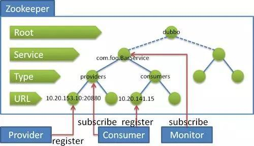

## 1. 分布式锁

分布式锁有多种实现方式，比如通过数据库、redis 都可实现。作为分布式协同工具 ZooKeeper，也有着标准的实现方式。

### 1.1. 独占锁

在 zookeeper 中如何实现独占锁，设计思路如下：

1. 每个zk客户端往Zookeeper中创建临时节点/lock，因为同级目录下，只能创建一个同名的节点，所以N个客户端只有一个客户端可以成功创建节点
2. 成功创建节点的客户端相当于成功获取锁，继续执行相关的业务逻辑
3. 其他创建失败的客户端，进行等待，同时创建`Watcher`，监听临时节点/lock
4. 成功获取锁的客户端在执行完成业务逻辑后，只需要关闭连接，此时临时节点就会被删除，相当于释放锁。其他所有监听该节点的客户端全部开始重新创建临时节点/lock，竞争锁
5. 当某个客户成功竞争到锁后，重复上述的逻辑

### 1.2. 排他锁

在 zookeeper 中如何实现排他锁，设计思路如下：

1. 每个客户端往/Locks下创建临时有序节点/Locks/Lock_，创建成功后/Locks下面会有每个客户端对应的节点，如/Locks/Lock_000000001
2. 客户端取得/Locks下子节点，并进行排序，判断排在最前面的是否为自己，如果自己的锁节点在第一位，代表获取锁成功
3. 如果自己的锁节点不在第一位，则监听自己前一位的锁节点。例如，自己锁节点Lock_000000002，那么则监听Lock_000000001
4. 当前一位锁节点（Lock_000000001）对应的客户端执行完成，释放了锁，将会触发监听客户端（Lock_000000002）的逻辑
5. 监听客户端重新执行第2步逻辑，判断自己是否获得了锁

## 2. 配置中心案例（待整理）

> TODO: 整理中

## 3. 生成分布式唯一 ID（待整理）

> TODO: 整理中

## 4. Dubbo 的注册中心

Dubbo 作为管理业务层的服务接入者和服务提供者的框架，完成服务的调度必须要有一个分布式的注册中心。而 Dubbo 的将注册中心进行抽象，它可以外接不同的存储媒介给注册中心提供服务，有 ZooKeeper，Memcached，Redis 等。而 ZooKeeper 

- 单注册中心的承载能力是有限的，在流量达到一定程度的时候就需要通过负载均衡来分流，ZooKeeper 群配合相应的 Web 应用就可以很容易达到负载均衡
- 节点之间的数据和资源需要同步，ZooKeeper 集群就天然具备有此功能
- 命名服务，将树状结构用于维护全局的服务地址列表，服务提供者在启动的时候，向 ZooKeeper 上的指定节点 `/dubbo/${serviceName}/providers` 目录下写入自己的 URL 地址，从而完成了服务的发布
- 其他特性还有 Mast 选举，分布式锁等。

## 5. Zookeeper 队列管理（待整理）

两种类型的队列：

1. 同步队列，当一个队列的成员都聚齐时，这个队列才可用，否则一直等待所有成员到达。

实现思路：在约定目录下创建临时目录节点，监听节点数目是否是要求的数目。

2. 队列按照 FIFO 方式进行入队和出队操作。

实现思路：和分布式锁服务中的控制时序场景基本原理一致，入列有编号，再按编号出列。在特定的目录下创建 `PERSISTENT_SEQUENTIAL` 节点，创建成功时 Watcher 通知等待的队列，队列删除序列号最小的节点用以消费。此场景下 Zookeeper 的 znode 用于消息存储，znode 存储的数据就是消息队列中的消息内容，SEQUENTIAL 序列号就是消息的编号，按序取出即可。由于创建的节点是持久化的，所以不必担心队列消息的丢失问题。
