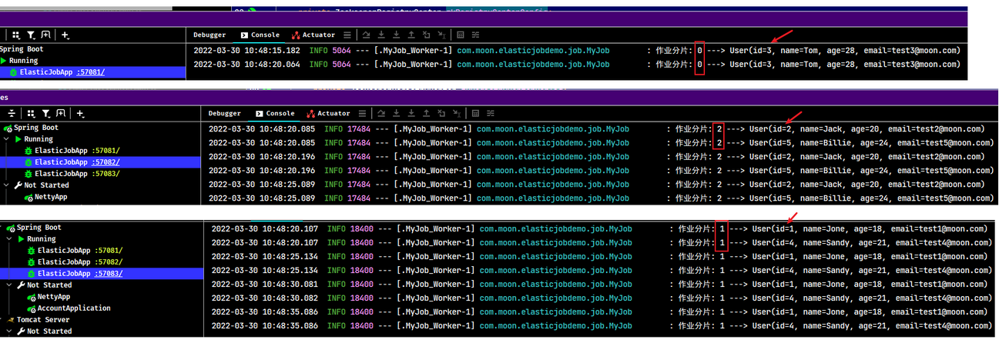

## 1. Elastic-Job 简介

### 1.1. 概述

ElasticJob 是一个分布式调度解决方案，由当当网开源，它由 2 个相互独立的子项目 ElasticJob-Lite 和 ElasticJob-Cloud 组成。

- ElasticJob-Lite 定位为轻量级无中心化解决方案，使用jar的形式提供分布式任务的协调服务
- ElasticJob-Cloud 使用 Mesos 的解决方案，额外提供资源治理、应用分发以及进程隔离等服务

使用 Elastic-Job 可以快速实现分布式任务调度。ElasticJob 的各个产品使用统一的作业 API，开发者仅需要一次开发，即可随意部署。

- 官网：https://shardingsphere.apache.org/elasticjob/index_zh.html
- Elastic-Job 的 github 地址：https://github.com/apache/shardingsphere-elasticjob

### 1.2. 功能列表

- **分布式调度协调**：在分布式环境中，任务能够按指定的调度策略执行，并且能够避免同一任务多实例重复执行。
- **丰富的调度策略**：基于成熟的定时任务作业框架Quartz cron表达式执行定时任务。
- **弹性扩容缩容**：当集群中增加某一个实例，它应当也能够被选举并执行任务；当集群减少一个实例时，它所执行的任务能被转移到别的实例来执行。
- **失效转移**：某实例在任务执行失败后，会被转移到其他实例执行。
- **错过执行作业重触发**：若因某种原因导致作业错过执行，自动记录错过执行的作业，并在上次作业完成后自动触发。
- **支持并行调度**：支持任务分片，任务分片是指将一个任务分为多个小任务项在多个实例同时执行。
- **支持作业生命周期操作**：可以动态对任务进行开启及停止操作。
- **丰富的作业类型**：支持 Simple、DataFlow、Script 三种作业类型。
- **Spring整合以及命名空间支持**：对 Spring 支持良好的整合方式，支持 spring 自定义命名空间，支持占位符。
- **运维平台**：提供运维界面，可以管理作业和注册中心。

### 1.3. 分布式任务调度相关重要概念

#### 1.3.1. 分片

任务的分布式执行，需要将一个任务拆分为多个独立的任务项，然后由分布式的服务器分别执行某一个或几个分片项。

例如：有一个遍历数据库某张表的作业，现有2台服务器。为了快速的执行作业，那么每台服务器应执行作业的50%。为满足此需求，可将作业分成2片，每台服务器执行1片。作业遍历数据的逻辑应为：服务器A遍历ID以奇数结尾的数据；服务器B遍历ID以偶数结尾的数据。

如果分成10片，则作业遍历数据的逻辑应为：每片分到的分片项应为ID%10，而服务器A被分配到分片项0,1,2,3,4；服务器B被分配到分片项5,6,7,8,9，直接的结果就是服务器A遍历ID以0-4结尾的数据；服务器B遍历ID以5-9结尾的数据。

#### 1.3.2. leader 选举

zookeeper 会保证在多台服务器中选举出一个 leader，leader 如果下线会触发重新选举，在选出下个 leader 前所有任务会被阻塞，leader 会以“协调者”角色负责分片。

### 1.4. Elastic-Job 的分片策略

#### 1.4.1. 平均分片策略（默认）

实现类全路径：`com.dangdang.ddframe.job.lite.api.strategy.impl.AverageAllocationJobShardingStrategy`

策略说明：基于平均分配算法的分片策略，也是默认的分片策略。如果分片不能整除，则不能整除的多余分片将依次追加到序号小的服务器。例如：

- 如果有3台服务器，分成9片，则每台服务器分到的分片是：1=[0,1,2], 2=[3,4,5], 3=[6,7,8]
- 如果有3台服务器，分成8片，则每台服务器分到的分片是：1=[0,1,6], 2=[2,3,7], 3=[4,5]
- 如果有3台服务器，分成10片，则每台服务器分到的分片是：1=[0,1,2,9], 2=[3,4,5], 3=[6,7,8]

> 注：此分片策略比较常用

#### 1.4.2. 哈希值升降序分片策略

实现类全路径：`com.dangdang.ddframe.job.lite.api.strategy.impl.OdevitySortByNameJobShardingStrategy`

策略说明：

- 根据作业名的哈希值奇偶数决定IP升降序算法的分片策略。
- 作业名的哈希值为奇数则IP升序。
- 作业名的哈希值为偶数则IP降序。
- 用于不同的作业平均分配负载至不同的服务器。

`AverageAllocationJobShardingStrategy` 的缺点是，一旦分片数小于作业服务器数，作业将永远分配至IP地址靠前的服务器，导致IP地址靠后的服务器空闲。而 `OdevitySortByNameJobShardingStrategy` 则可以根据作业名称重新分配服务器负载。如：

- 如果有3台服务器，分成2片，作业名称的哈希值为奇数，则每台服务器分到的分片是：1=[0], 2=[1], 3=[]
- 如果有3台服务器，分成2片，作业名称的哈希值为偶数，则每台服务器分到的分片是：3=[0], 2=[1], 1=[]

#### 1.4.3. 哈希值轮转分片策略

实现类全路径：`com.dangdang.ddframe.job.lite.api.strategy.impl.RotateServerByNameJobShardingStrategy`

策略说明：

- 根据作业名的哈希值对服务器列表进行轮转的分片策略。

## 2. Elastic-Job 快速入门

### 2.1. 环境搭建

#### 2.1.1. 版本要求

- JDK 要求 1.7 及以上版本
- Maven 要求 3.0.4 及以上版本
- zookeeper 要求采用 3.4.6 及以上版本

#### 2.1.2. Zookeeper 安装与运行

zk 下载地址：https://zookeeper.apache.org/releases.html

下载某版本 Zookeeper，并解压。把 conf 目录下的 zoo_sample.cfg 改为 zoo.cfg。修改相关配置。最后执行解压目录下的 `bin/zkServer.cmd` 启动 zk 服务

#### 2.1.3. 数据库准备

数据库：mysql-5.7.25

创建 elastic_job_demo 数据库与 user 表：

```sql
DROP DATABASE IF EXISTS `elastic_job_demo`;
CREATE DATABASE `elastic_job_demo` CHARACTER SET 'utf8' COLLATE 'utf8_general_ci';

USE `elastic_job_demo`;
SET NAMES utf8mb4;
SET FOREIGN_KEY_CHECKS = 0;

DROP TABLE IF EXISTS `user`;
CREATE TABLE `user`  (
  `id` bigint(20) NOT NULL AUTO_INCREMENT COMMENT '主键ID',
  `name` varchar(30) CHARACTER SET utf8 COLLATE utf8_general_ci NULL DEFAULT NULL COMMENT '姓名',
  `age` int(11) NULL DEFAULT NULL COMMENT '年龄',
  `email` varchar(50) CHARACTER SET utf8 COLLATE utf8_general_ci NULL DEFAULT NULL COMMENT '邮箱',
  PRIMARY KEY (`id`) USING BTREE
) ENGINE = InnoDB CHARACTER SET = utf8 COLLATE = utf8_general_ci ROW_FORMAT = Dynamic;

INSERT INTO `user` VALUES (1, 'Jone', 18, 'test1@moon.com');
INSERT INTO `user` VALUES (2, 'Jack', 20, 'test2@moon.com');
INSERT INTO `user` VALUES (3, 'Tom', 28, 'test3@moon.com');
INSERT INTO `user` VALUES (4, 'Sandy', 21, 'test4@moon.com');
INSERT INTO `user` VALUES (5, 'Billie', 24, 'test5@moon.com');

SET FOREIGN_KEY_CHECKS = 1;
```

### 2.2. Elastic-job 集成 Spring Boot

> 此 Elastic-job 快速入门示例使用 spring boot 集成方式。示例代码位置如下：
>
> - 代码仓库：https://github.com/MooNkirA/java-technology-stack/tree/master/java-stack-elastic-job
> - 本地：\code\java-technology-stack\java-stack-elastic-job\elastic-job-springboot

#### 2.2.1. 导入 maven 依赖

```xml
<parent>
    <groupId>org.springframework.boot</groupId>
    <artifactId>spring-boot-starter-parent</artifactId>
    <version>2.2.2.RELEASE</version>
</parent>

<dependencies>
    <dependency>
        <groupId>org.springframework.boot</groupId>
        <artifactId>spring-boot-starter</artifactId>
    </dependency>

    <dependency>
        <groupId>com.dangdang</groupId>
        <artifactId>elastic-job-lite-spring</artifactId>
        <version>2.1.5</version>
    </dependency>

    <!-- 配置MyBatis启动器 -->
    <dependency>
        <groupId>org.mybatis.spring.boot</groupId>
        <artifactId>mybatis-spring-boot-starter</artifactId>
        <version>2.1.4</version>
    </dependency>

    <dependency>
        <groupId>mysql</groupId>
        <artifactId>mysql-connector-java</artifactId>
        <version>5.1.48</version>
    </dependency>
    
    <dependency>
        <groupId>org.projectlombok</groupId>
        <artifactId>lombok</artifactId>
        <optional>true</optional>
    </dependency>
</dependencies>
```

#### 2.2.2. 编写 spring boot 配置文件及启动类

spring boot 配置文件：

```yml
server:
  port: ${PORT:57081}
spring:
  application:
    name: elastic-job-springboot
  datasource:
    driver-class-name: com.mysql.jdbc.Driver
    url: jdbc:mysql://localhost:3306/elastic_job_demo?useUnicode=true&characterEncoding=utf8&autoReconnect=true&allowMultiQueries=true&useSSL=false
    username: root
    password: 123456

mybatis:
  mapper-locations: classpath*:xml/*.xml
  type-aliases-package: com.moon.elasticjobdemo.pojo
  # 开启驼峰映射
  configuration:
    map-underscore-to-camel-case: true

# zookeeper服务地址
zookeeper:
  server: localhost:2181

myjob:
  # 名称空间
  namespace: elastic-job-example
  # 分片总数
  count: 3
  # cron表达式(定时策略)
  cron: 0/5 * * * * ?

logging:
  level:
    root: info
```

springBoot 启动类：

```java
@MapperScan("com.moon.elasticjobdemo.dao")
@SpringBootApplication
public class ElasticJobApp {
    public static void main(String[] args) {
        SpringApplication.run(ElasticJobApp.class, args);
    }
}
```

#### 2.2.3. 实体类与数据访问层

用户表实体类

```java
@Data
public class User {
    private Long id;
    private String name;
    private Integer age;
    private String email;
}
```

数据访问层接口。注意：此处为了方便测试分片作业，将查询语句进行改造，根据分片数据与当前作业程序编号进行查询，策略是根据用户id与分片数取模，是否为当前作业服务的编号

```java
public interface UserMapper {
    /**
     * 根据分片查询
     *
     * @param shardingTotalCount
     * @param shardingItem
     * @return
     */
    List<User> queryUserById(@Param("shardingTotalCount") int shardingTotalCount, @Param("shardingItem") int shardingItem);
}
```

mapper 映射文件

```xml
<?xml version="1.0" encoding="UTF-8" ?>
<!DOCTYPE mapper PUBLIC "-//mybatis.org//DTD Mapper 3.0//EN" "http://mybatis.org/dtd/mybatis-3-mapper.dtd">
<mapper namespace="com.moon.elasticjobdemo.dao.UserMapper">

    <select id="queryUserById" resultType="com.moon.elasticjobdemo.pojo.User">
        SELECT
            *
        FROM
            `user`
        WHERE
            MOD (id, #{shardingTotalCount})=#{shardingItem}
    </select>

</mapper>
```

#### 2.2.4. Elastic-Job 任务类

编写 Elastic-Job 任务类，需要实现 `com.dangdang.ddframe.job.api.simple.SimpleJob` 接口，其中 `execute` 方法在定时任务被调度时执行

```java
@Component
@Slf4j
public class MyJob implements SimpleJob {

    @Autowired
    private UserMapper userMapper;

    /**
     * 执行作业的主要业务逻辑
     *
     * @param shardingContext 分片上下文
     */
    @Override
    public void execute(ShardingContext shardingContext) {
        // 从 Elastic-Job 分片上下文中，获取分片总数
        int shardingTotalCount = shardingContext.getShardingTotalCount();
        // 获取当前分片项
        int shardingItem = shardingContext.getShardingItem();

        // 查询结果
        List<User> users = userMapper.queryUserById(shardingTotalCount, shardingItem);
        for (User user : users) {
            log.info("作业分片: {} ---> {}", shardingItem, user);
        }
    }
}
```

#### 2.2.5. zookeeper 注册中心配置

在 config 包中，创建 zookeeper 的配置类 `ZKRegistryCenterConfig`。

```java
@Configuration
public class ZKRegistryCenterConfig {

    // 读取配置 zookeeper 服务器地址
    @Value("${zookeeper.server}")
    private String ZOOKEEPER_SERVER;

    // 定时任务的名称空间
    @Value("${myjob.namespace}")
    private String JOB_NAMESPACE;

    /**
     * zk的配置及创建注册中心
     *
     * @return
     */
    @Bean(initMethod = "init")
    public ZookeeperRegistryCenter createRegistryCenter() {
        // zk配置
        ZookeeperConfiguration zookeeperConfiguration = new ZookeeperConfiguration(ZOOKEEPER_SERVER, JOB_NAMESPACE);
        // 创建注册中心
        return new ZookeeperRegistryCenter(zookeeperConfiguration);
    }
}
```

#### 2.2.6. elastic-job 配置类

在 config 包中，创建 elastic-job 配置类，配置任务详细信息，包括：指定任务执行类、任务的执行策略等等

```java
@Configuration
public class ElasticJobConfig {

    @Autowired
    private MyJob myJob;

    @Autowired
    private ZookeeperRegistryCenter zkRegistryCenterConfig;

    // 读取配置文件：分片数量
    @Value("${myjob.count}")
    private int shardingCount;
    // 读取配置文件：cron 表达式(定时策略)
    @Value("${myjob.cron}")
    private String cron;

    @Bean(initMethod = "init")
    public SpringJobScheduler initSimpleElasticJob() {
        // 创建作业核心配置 JobCoreConfiguration.Builder
        JobCoreConfiguration.Builder jobCoreConfigurationBuilder = JobCoreConfiguration.newBuilder(MyJob.class.getName(), cron, shardingCount);
        JobCoreConfiguration jobCoreConfiguration = jobCoreConfigurationBuilder.build();

        // 创建 SIMPLE 类型配置 SimpleJobConfiguration
        SimpleJobConfiguration simpleJobConfiguration = new SimpleJobConfiguration(jobCoreConfiguration, MyJob.class.getCanonicalName());

        // 创建 Lite 作业根配置 LiteJobConfiguration
        LiteJobConfiguration liteJobConfiguration = LiteJobConfiguration
                .newBuilder(simpleJobConfiguration)
                .jobShardingStrategyClass("com.dangdang.ddframe.job.lite.api.strategy.impl.AverageAllocationJobShardingStrategy") // 配置作业分片策略：平均分配策略
                .overwrite(true)
                .build();

        // 创建 SpringJobScheduler 任务调度器，由它来启动执行任务
        return new SpringJobScheduler(myJob, zkRegistryCenterConfig, liteJobConfiguration);
    }
}
```

#### 2.2.7. 功能测试

启动 zookeeper 服务。由于在配置文件中设置的分片数量为3，所以这里启动了三个微服务，各个服务启动过程中会向 zookeeper 进行注册。配置以下 VM options 参数，启动服务，服务的端口是 57081(默认)、57082、57083

```bash
-Dserver.port=57082
```

运行起来后，测试发现三个服务微每隔5秒钟就执行一次数据查询，并且进行了分片(平均分配)。运行效果如下。



## 3. Elastic-Job 工作原理（待整理）

> TODO: 待整理
