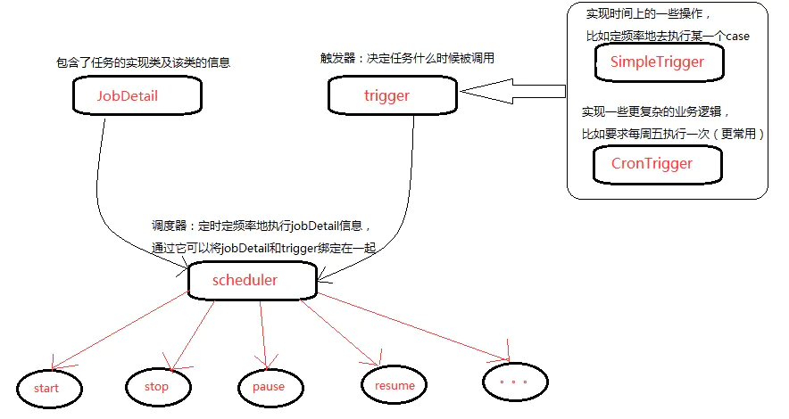

## 1. Quartz 任务调度框架概述

Quartz 是 OpenSymphony 开源组织在 Job scheduling 领域又一个开源项目。

Quartz 框架的核心是调度器。调度器负责管理 Quartz 应用运行时环境。调度器不是靠自己做所有的工作，而是依赖框架内一些非常重要的部件。Quartz 不仅仅是线程和线程管理。为确保可伸缩性，Quartz 采用了基于多线程的架构。启动时，框架初始化一套 worker 线程，这套线程被调度器用来执行预定的作业。这就是 Quartz 怎样能并发运行多个作业的原理。Quartz 依赖一套松耦合的线程池管理部件来管理线程环境。

使用 Quartz 框架，可以按照指定的周期执行特定的任务！**其中核心功能：可以按照日期的方式执行任务！（任务执行表达式）**

### 1.1. 特点

- 纯 java 实现，可以作为独立的应用程序，也可以嵌入在另一个独立式应用程序运行。
- 强大的调度功能，Spring 默认的调度框架，灵活可配置。
- 作业持久化，调度环境持久化机制，可以保存并恢复调度现场。系统关闭数据不会丢失。
- 灵活的应用方式，可以任意定义触发器的调度时间表，支持任务和调度各种组合，组件式监听器、各种插件、线程池等功能，多种存储方式等。
- 分布式和集群能力，可以被实例化，一个 Quartz 集群中的每个节点作为一个独立的 Quartz 使用，通过相同的数据库表来感知到另一个 Quartz 应用。

### 1.2. Quartz 的体系结构

- Job 表示一个工作，要执行的具体内容。
- JobDetail 表示一个具体的可执行的调度程序，Job 是这个可执行程调度程序所要执行的内容，另外 JobDetail 还包含了这个任务调度的方案和策略。
- Trigger 代表一个调度参数的配置，什么时候去调。
- Scheduler 代表一个调度容器，一个调度容器中可以注册多个 JobDetail 和 Trigger。当 Trigger 与 JobDetail 组合，就可以被 Scheduler 容器调度了。

## 2. Quartz 基础使用

Spring Boot 整合 Quartz 调度器基础使用，详见[《Spring Boot 定时任务调度》笔记](/分布式微服务/SpringBoot/Spring-Boot-Task-Scheduling)相关章节

## 3. Quartz Cluster

### 3.1. Quartz 持久化

Quartz 程序配置的任务默认是存储在内存中，当程序突然被中断时，如断电，内存超出时，很有可能造成任务的丢失。可以将调度信息存储到数据库里面，进行持久化，当程序被中断后，再次启动，仍然会保留中断之前的数据，继续执行，而并不是重新开始。

### 3.2. Quartz 存储类型

Quartz 提供两种基本作业存储类型：

- RAMJobStore：在默认情况下 Quartz 将任务调度的运行信息保存在内存中，这种方法提供了最佳的性能，因为内存中数据访问最快。不足之处是缺乏数据的持久性，当程序路途停止或系统崩溃时，所有运行的信息都会丢失。
- JobStoreTX：所有的任务信息都会保存到数据库中，可以控制事物，还有就是如果应用服务器关闭或者重启，任务信息都不会丢失，并且可以恢复因服务器关闭或者重启而导致执行失败的任务。

### 3.3. 基础使用示例（待整理）

> quartz 实现基于数据库的分布式任务管理，和控制 job 生命周期示例。参考：https://www.pdai.tech/md/spring/springboot/springboot-x-task-quartz-cluster-timer.html#%E5%AE%9E%E7%8E%B0%E6%A1%88%E4%BE%8B
