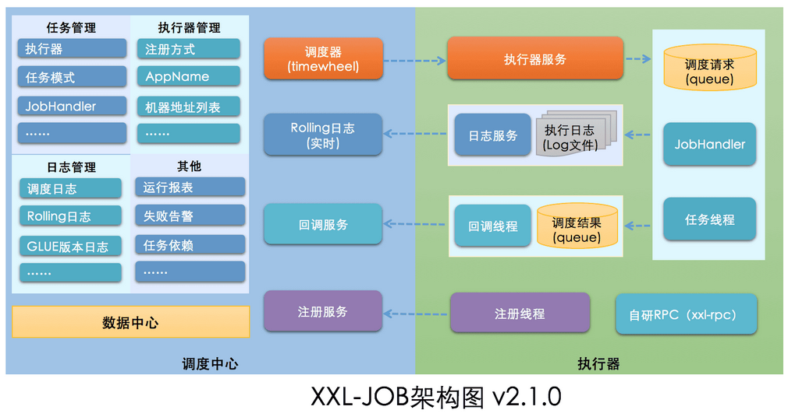

## 1. XXL-JOB 概述

XXL-JOB 是一个分布式任务调度平台，其核心设计目标是开发迅速、学习简单、轻量级、易扩展。现已开放源代码并接入多家公司线上产品线，开箱即用。

> 官网：https://www.xuxueli.com/xxl-job/

### 1.1. 设计思想

- 将调度行为抽象形成"调度中心"公共平台，而平台自身并不承担业务逻辑，“调度中心"负责发起调度请求。
- 将任务抽象成分散的 JobHandler，交由"执行器"统一管理，“执行器"负责接收调度请求并执行对应的 JobHandler 中业务逻辑。

因此，“调度"和"任务"两部分可以相互解耦，提高系统整体稳定性和扩展性.

### 1.2. 系统组成

**调度模块（调度中心）**

- 负责管理调度信息，按照调度配置发出调度请求，自身不承担业务代码。调度系统与任务解耦，提高了系统可用性和稳定性，同时调度系统性能不再受限于任务模块。
- 支持可视化、简单且动态的管理调度信息，包括任务新建，更新，删除，GLUE 开发和任务报警等，所有上述操作都会实时生效，同时支持监控调度结果以及执行日志，支持执行器 Failover。

**执行模块（执行器）**

- 负责接收调度请求并执行任务逻辑。任务模块专注于任务的执行等操作，开发和维护更加简单和高效。
- 接收"调度中心"的执行请求、终止请求和日志请求等。

### 1.3. 架构图

## 2. 基础使用案例（待整理）

> 参考资料：https://www.pdai.tech/md/spring/springboot/springboot-x-task-xxl-job-timer.html#%E5%AE%9E%E7%8E%B0%E6%A1%88%E4%BE%8B
