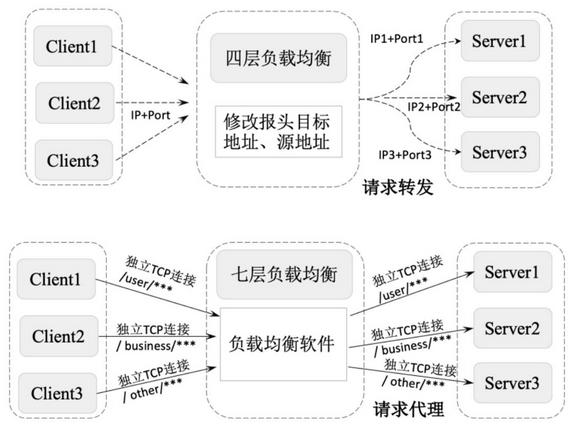
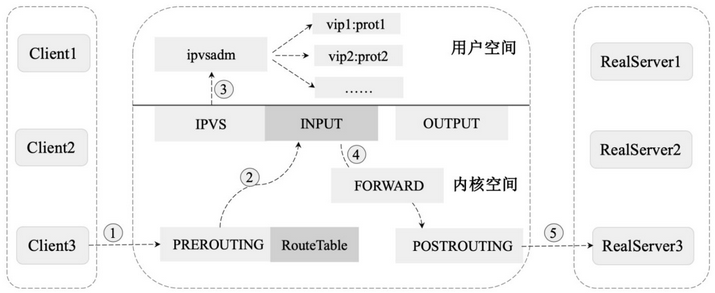
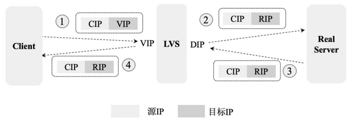
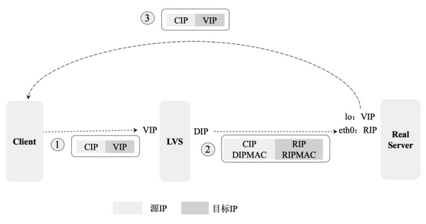
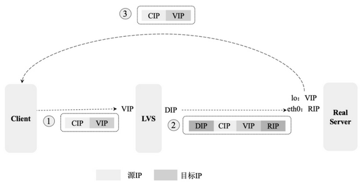
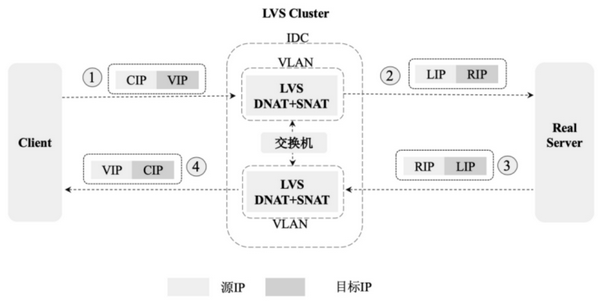

# 分布式微服务相关概念

> 对分布式与微服务架构相关技术概述

## 1. 负载均衡

负载均衡，是指建立在现有网络结构之上，用于扩展网络设备和服务器的带宽，增加了吞吐量，加强了网络数据处理能力，并提高了网络的灵活性和可用性的一套解决方案。项目中常用的负载均衡有**四层负载均衡**和**七层负载均衡**。

### 1.1. 四层负载均衡

四层负载均衡主要通过**修改报文中的目标地址和端口来实现报文的分发和负载均衡**。以 TCP 为例，负载均衡设备在接收到第 1 个来自客户端的 SYN 请求后，会根据负载均衡配置和负载均衡策略选择一个最佳的服务器，并将报文中的目标IP地址修改为该服务器的IP直接转发给该服务器。TCP 连接的建立（即三次握手过程）是在客户端和服务器端之间完成的，负载均衡设备只起到路由器的转发功能。

四层负载均衡常用的软硬件如下：

- F5：硬件负载均衡器，功能完备，价格昂贵。
- LVS：基于 `IP+端口` 实现的四层负载软件，常和 Keepalive 配合使用。
- Nginx：同时实现四层负载和七层负载均衡，带缓存功能，可基于正则表达式灵活转发。

### 1.2. 七层负载均衡

七层负载均衡又叫作“内容负载均衡”，主要通过解析报文中真正有意义的应用层内容，并根据负载均衡配置和负载均衡策略选择一个最佳的服务器响应用户的请求。

七层应用负载可以使整个网络更智能化，七层负载均衡根据不同的数据类型将数据存储在不同的服务器上来提高网络整体的负载能力。比如将客户端的基本信息存储在内存较大的缓存服务器上，将文件信息存储在磁盘空间较大的文件服务器上，将图片视频存储在网络 I/O 能力较强的流媒体服务器上。在接收到不同的客户端的请求时从不同的服务器上获取数据并将其返回给客户端，提高客户端的访问效率

七层负载均衡常用的软件如下：


- HAProxy：支持七层代理、会话保持、标记、路径转移等。
- Nginx：同时实现四层负载和七层负载均衡，在 HTTP 和 Mail 协议上功能比较好，性能与 HAProxy 差不多。
- Apache：使用简单，性能较差。

### 1.3. 四层负载均衡与七层负载均衡的对比

- 四层负载均衡基于IP和端口的方式实现网络的负载均衡，具体实现为对外提供一个虚拟IP和端口接收所有用户的请求，然后根据负载均衡配置和负载均衡策略将请求发送给真实的服务器。
- 七层负载均衡基于URL等资源来实现应用层基于内容的负载均衡，具体实现为通过虚拟的URL或主机名接收所有用户的请求，然后将请求发送给真实的服务器。

四层负载均衡和七层负载均衡的最大差别是：四层负载均衡只能针对 IP 地址和端口上的数据做统一的分发，而七层负载均衡能根据消息的内容做更加详细的有针对性的负载均衡。通常使用 LVS 等技术实现基于 Socket 的四层负载均衡，使用 Nginx 等技术实现基于内容分发的七层负载均衡，比如将以 `/user/***` 开头的 URL 请求负载到单点登录服务器，而将以 `/business/***` 开头的 URL 请求负载到具体的业务服务器，如下图：



### 1.4. 负载均衡算法

常用的负载均衡算法有：轮询均衡（Round Robin）、权重轮询均衡（Weighted Round Robin）、随机均衡（Random）、权重随机均衡（Weighted Random）、响应速度均衡（Response Time）、最少连接数均衡（Least Connection）、处理能力均衡、DNS响应均衡（Flash DNS）、散列算法均衡、IP地址散列、URL散列。不同的负载均衡算法适用于不同的应用场景。

#### 1.4.1. 轮询均衡（Round Robin）

轮询均衡指将客户端请求轮流分配到 1 至 N 台服务器上，每台服务器均被均等地分配一定数量的客户端请求。轮询均衡算法适用于集群中所有服务器都有相同的软硬件配置和服务能力的情况下。

#### 1.4.2. 权重轮询均衡（Weighted Round Robin）

权重轮询均衡指根据每台服务器的不同配置及服务能力，为每台服务器都设置不同的权重值，然后按照设置的权重值轮询地将请求分配到不同的服务器上。

例如，服务器A的权重值被设计成 3，服务器 B 的权重值被设计成 3，服务器 C 的权重值被设计成 4，则服务器 A、B、C 将分别承担 30%、30%、40% 的客户端请求。权重轮询均衡算法主要用于服务器配置不均等的集群中。

#### 1.4.3. 随机均衡（Random）

随机均衡指将来自网络的请求随机分配给内部的多台服务器，不考虑服务器的配置和负载情况。

#### 1.4.4. 权重随机均衡（Weighted Random）

权重随机均衡算法类似于权重轮询算法，只是在分配请求时不再轮询发送，而是随机选择某个权重的服务器发送。

#### 1.4.5. 响应速度均衡（Response Time）

响应速度均衡指根据服务器设备响应速度的不同将客户端请求发送到响应速度最快的服务器上。对响应速度的获取是通过负载均衡设备定时为每台服务都发出一个探测请求（例如Ping）实现的。响应速度均衡能够为当前的每台服务器根据其不同的负载情况分配不同的客户端请求，这有效避免了某台服务器单点负载过高的情况。但需要注意的是，这里探测到的响应速度是负载均衡设备到各个服务器之间的响应速度，并不完全代表客户端到服务器的响应速度，因此存在一定偏差。

#### 1.4.6. 最少连接数均衡（Least Connection）

最少连接数均衡指在负载均衡器内部记录当前每台服务器正在处理的连接数量，在有新的请求时，将该请求分配给连接数最少的服务器。这种均衡算法适用于网络连接和带宽有限、CPU 处理任务简单的请求服务，例如 FTP。

#### 1.4.7. 处理能力均衡

处理能力均衡算法将服务请求分配给内部负荷最轻的服务器，负荷是根据服务器的CPU型号、CPU数量、内存大小及当前连接数等换算而成的。处理能力均衡算法由于考虑到了内部服务器的处理能力及当前网络的运行状况，所以相对来说更加精确，尤其适用于七层负载均衡的场景。

#### 1.4.8. DNS 响应均衡（Flash DNS）

DNS响应均衡算法指在分布在不同中心机房的负载均衡设备都收到同一个客户端的域名解析请求时，所有负载均衡设备均解析此域名并将解析后的服务器IP地址返回给客户端，客户端向收到第一个域名解析后的IP地址发起请求服务，而忽略其他负载均衡设备的响应。这种均衡算法适用于全局负载均衡的场景。

#### 1.4.9. 散列算法均衡

散列算法均衡指通过一致性散列算法和虚拟节点技术将相同参数的请求总是发送到同一台服务器，该服务器将长期、稳定地为某些客户端提供服务。在某个服务器被移除或异常宕机后，该服务器的请求基于虚拟节点技术平摊到其他服务器，而不会影响集群整体的稳定性。

#### 1.4.10. IP 地址散列

IP 地址散列指在负载均衡器内部维护了不同链接上客户端和服务器的 IP 对应关系表，将来自同一客户端的请求统一转发给相同的服务器。该算法能够以会话为单位，保证同一客户端的请求能够一直在同一台服务器上处理，主要适用于客户端和服务器需要保持长连接的场景，比如基于 TCP 长连接的应用。

#### 1.4.11. URL散列

URL 散列指通过管理客户端请求 URL 信息的散列表，将相同 URL 的请求转发给同一台服务器。该算法主要适用于在七层负载中根据用户请求类型的不同将其转发给不同类型的应用服务器。

### 1.5. LVS 的原理及应用

LVS（Linux Virtual Server）是一个虚拟的服务器集群系统，采用 IP 负载均衡技术将请求均衡地转移到不同的服务器上执行，且通过调度器自动屏蔽故障服务器，从而将一组服务器构成一个高性能、高可用的虚拟服务器。整个服务器集群的结构对用户是透明的，无须修改客户端和服务器端的程序，便可实现客户端到服务器的负载均衡。

#### 1.5.1. LVS 技术常用名词


#### 1.5.2. LVS 的原理

LVS由前端的负载均衡器（Load Balancer，LB）和后端的真实服务器（Real Server，RS）群组成，在真实服务器间可通过局域网或广域网连接。LVS 的这种结构对用户是透明的，用户只需要关注作为 LB 的虚拟服务器（Virtual Server），而不需要关注提供服务的真实服务器群。在用户的请求被发送给虚拟服务器后，LB 根据设定的包转发策略和负载均衡调度算法将用户的请求转发给真实服务器，真实服务器再将用户请求的结果返回给用户。

实现 LVS 的核心组件有负载均衡调度器、服务器池和共享存储。

- 负载均衡调度器（Load Balancer/Director）：是整个集群对外提供服务的入口，通过对外提供一个虚拟 IP 来接收客户端请求。在客户端将请求发送到该虚拟 IP 后，负载均衡调度器会负责将请求按照负载均衡策略发送到一组具体的服务器上。
- 服务器池（Server Pool）：服务器池是一组真正处理客户端请求的真实服务器，具体执行的服务有 WEB、MAIL、FTP 和 DNS 等。
- 共享存储（Shared Storage）：为服务器池提供一个共享的存储区，使得服务器池拥有相同的内容，提供相同的服务。

LVS 的 IP 负载均衡技术是通过 IPVS 模块实现的。IPVS 是 LVS 集群系统的核心软件，被安装在 Director Server 上，同时在 Director Server上虚拟出一个 IP 地址。用户通过这个虚拟的 IP 地址访问服务器。这个虚拟的 IP 地址一般被称为 LVS 的 VIP，即 Virtual IP。访问的请求首先经过 VIP 到达负载调度器，然后由负载调度器从真实服务器列表中选取一个服务节点响应用户的请求。

#### 1.5.3. LVS 数据转发

LVS 的数据转发流程是 LVS 设计的核心部分

1. PREROUTING 链接收用户请求：客户端向 PREROUTING 链发送请求。
2. INPUT 链转发：在 PREROUTING 链通过 RouteTable 列表发现请求数据包的目的地址是本机时，将数据包发送给 INPUT 链。
3. IPVS 检查：IPVS 检查 INPUT 链上的数据包，如果数据包中的目的地址和端口不在规则列表中，则将该数据包发送到用户空间的 ipvsadm。ipvsadm主要用于用户定义和管理集群。
4. POSTROUTING 链转发：如果数据包里面的目的地址和端口都在规则里面，那么将该数据包中的目的地址修改为事先定义好的真实服务器地址，通过 FORWARD 将数据发送到 POSTROUTING 链。
5. 真实服务器转发：POSTROUTING 链根据数据包中的目的地址将数据包转发到真实服务器。



#### 1.5.4. LVS NAT 模式

LVS NAT（Network Address Translation）即网络地址转换模式，具体的实现流程如下图：



NAT 模式通过对请求报文和响应报文的地址进行改写完成对数据的转发，具体流程如下：

1. 客户端将请求报文发送到 LVS，请求报文的源地址是 CIP（Client IP Address，客户端IP），目标地址是 VIP（Virtual IP Address，虚拟IP）。
2. LVS 在收到报文后，发现请求的 IP 地址在 LVS 的规则列表中存在，则将客户端请求报文的目标地址 VIP 修改为 RIP（Real-server IP Address，后端服务器的真实 IP），并将报文发送到具体的真实服务器上。
3. 真实服务器在收到报文后，由于报文的目标地址是自己的 IP，所以会响应该请求，并将响应报文返回给 LVS。
4. LVS 在收到数据后将此报文的源地址修改为本机 IP 地址（即 VIP），并将报文发送给客户端。

**NAT 模式的特点**：

- 请求的报文和响应的报文都需要通过 LVS 进行地址改写，因此在并发访问量较大的时候 LVS 存在瓶颈问题，一般适用于节点不是很多的情况下。
- 只需要在 LVS 上配置一个公网 IP 即可。
- 每台内部的真实服务器的网关地址都必须是 LVS 的内网地址。
- NAT 模式支持对 IP 地址和端口进行转换，即用户请求的端口和真实服务器的端口可以不同。

#### 1.5.5. LVS DR 模式

LVS DR（Direct Routing）模式用直接路由技术实现，通过改写请求报文的 MAC 地址将请求发送给真实服务器，具体的实现流程如下图：



LVD DR 模式是局域网中经常被用到的一种模式，其报文转发流程如下：

1. 客户端将请求发送给 LVS，请求报文的源地址是 CIP，目标地址是 VIP。
2. LVS 在收到报文后，发现请求在规则中存在，则将客户端请求报文的源 MAC 地址改为自己的 DIP（Direct IP Address，内部转发 IP）的 MAC 地址，将目标 MAC 改为 RIP 的 MAC 地址，并将此包发送给真实服务器。
3. 真实服务器在收到请求后发现请求报文中的目标 MAC 是自己，就会将此报文接收下来，在处理完请求报文后，将响应报文通过 lo（回环路由）接口发送给 eth0 网卡，并最终发送给客户端。

**DR 模式的特点**：

- 通过 LVS 修改数据包的目的 MAC 地址实现转发。注意，源 IP 地址仍然是 CIP，目标 IP 地址仍然是 VIP 地址。
- 请求的报文均经过 LVS，而真实服务器响应报文时无须经过 LVS，因此在并发访问量大时比 NAT 模式的效率高很多。
- 因为 DR 模式是通过 MAC 地址改写机制实现转发的，因此所有真实服务器节点和 LVS 只能被部署在同一个局域网内。
- 真实服务器主机需要绑定 VIP 地址在 lo 接口（掩码 32 位）上，并且需要配置 ARP 抑制。
- 真实服务器节点的默认网关无须被配置为 LVS 网关，只需要被配置为上级路由的网关，能让真实服务器直接出网即可。
- DR 模式仅做 MAC 地址的改写，不能改写目标端口，即真实服务器端口和 VIP 端口必须相同。

#### 1.5.6. LVS TUN 模式

TUN（IP Tunneling）通过 IP 隧道技术实现，具体的实现流程如下图：



LVS TUN模式常用于跨网段或跨机房的负载均衡，具体的报文转发流程如下：

1. 客户端将请求发送给前端的 LVS，请求报文的源地址是 CIP，目标地址是 VIP。
2. LVS 在收到报文后，发现请求在规则里中存在，则将在客户端请求报文的首部再封装一层 IP 报文，将源地址改为 DIP，将目标地址改为 RIP，并将此包发送给真实服务器。
3. 真实服务器在收到请求报文后会先拆开第 1 层封装，因为发现里面还有一层 IP 首部的目标地址是自己 lo 接口上的 VIP，所以会处理该请求报文，并将响应报文通过 lo 接口发送给 eth0 网卡，并最终发送给客户端。

**TUN 模式的特点**：

- TUNNEL模式需要设置 lo 接口的 VIP 不能在公网上出现。
- TUNNEL模式必须在所有的真实服务器上绑定 VIP 的 IP 地址。
- TUNNEL 模式中 VIP ->  真实服务器的包通信通过 TUNNEL 隧道技术实现，不管是内网还是外网都能通信，所以不需要 LVS 和真实服务器在同一个网段内。
- 在 TUNNEL 模式中，真实服务器会把响应报文直接发送给客户端而不经过 LVS，负载能力较强。
- TUNNEL 模式采用的是隧道模式，使用方法相对复杂，一般用于跨机房 LVS 实现，并且需要所有服务器都支持 IP Tunneling 或 IP Encapsulation 协议。

#### 1.5.7. LVS FULLNAT 模式

无论是 DR 模式还是 NAT 模式，都要求 LVS 和真实服务器在同一个 VLAN 下，否则 LVS 无法作为真实服务器的网关，因此跨 VLAN 的真实服务器无法接入。同时，在流量增大、真实服务器水平扩容时，单点 LVS 会成为瓶颈。

FULLNAT 能够很好地解决 LVS 和真实服务器跨 VLAN 的问题，在跨 VLAN 问题解决后，LVS 和真实服务器不再存在 VLAN 上的从属关系，可以做到多个 LVS 对应多个真实服务器，解决水平扩容的问题。FULLNAT 的原理是在 NAT 的基础上引入 Local Address IP（内网IP地址），将 CIP -> VIP 转换为 LIP -> RIP，而 LIP 和 RIP 均为 IDC 内网 IP，可以通过交换机实现跨 VLAN 通信。FULLNAT 的具体实现流程如下图：



LVS FULLNAT 具体的报文转发流程：

1. 客户端将请求发送给 LVS 的 DNAT，请求报文的源地址是 CIP，目标地址是 VIP。
2. LVS 在收到数据后将源地址 CIP 修改成 LIP（ Local IP Address，LVS 的内网 IP），将目标地址 VIP 修改为 RIP，并将数据发送到真实服务器。多个 LIP 在同一个 IDC 数据中心，可以通过交换机跨 VLAN 通信。
3. 真实服务器在收到数据包并处理完成后，将目标地址修改为 LIP，将源地址修改为 RIP，最终将这个数据包返回给 LVS。
4. LVS 在收到数据包后，将数据包中的目标地址修改为 CIP，将源地址修改为 VIP，并将数据发送给客户端。

### 1.6. Nginx 反向代理的负载均衡

> 详见[《Nginx 基础笔记》](/分布式微服务/Nginx/Nginx-基础)

## 2. 分布式缓存的核心问题

分布式缓存设计的核心问题是**以哪种方式进行缓存预热和缓存更新，以及如何优雅解决缓存雪崩、缓存穿透、缓存降级等问题**。在不同的应用场景下有不同的解决方案。

### 2.1. 缓存预热

缓存预热就是系统上线后，将相关的缓存数据直接加载到缓存系统。从而避免在用户请求的时候，先查询数据库，然后再将数据缓存的问题！用户直接查询事先被预热的缓存数据，以提高系统查询效率！

缓存预热一般有**系统启动加载**、**定时加载**等方式。

### 2.2. 缓存更新

缓存更新，是指在数据发生变化后及时将变化后的数据更新到缓存。除了缓存服务器自带的缓存失效策略之外（Redis 默认的有 6 中策略可供选择），还可以根据具体的业务需求进行自定义的缓存淘汰，常见的策略有以下几种：

1. **定时更新**：定时将底层数据库内的数据更新到缓存中，此方式比较简单，适合需要缓存的数据量不是很大的应用场景。
2. **过期更新**：定时清理缓存中过期的数据，更新为最新数据与缓存的过期时间。
3. **写请求更新**：在用户有写请求时先写数据库同时更新缓存，这适用于用户对缓存数据和数据库的数据有实时强一致性要求的情况。
4. **读请求更新**：在用户有读请求时，先判断该请求数据的缓存是否存在或过期，如果不存在或已过期，则进行底层数据库查询并将查询结果更新到缓存中，同时将查询结果返回给用户。

### 2.3. 缓存淘汰策略

在缓存数据过多时需要使用某种淘汰算法决定淘汰哪些数据。常用的淘汰算法有以下几种：

- FIFO（First In First Out，先进先出）：判断被存储的时间，离目前最远的数据优先被淘汰。
- LRU（Least Recently Used，最近最少使用）：判断缓存最近被使用的时间，距离当前时间最远的数据优先被淘汰。
- LFU（Least Frequently Used，最不经常使用）：在一段时间内，被使用次数最少的缓存优先被淘汰。

### 2.4. 缓存雪崩

缓存雪崩，是指在同一时刻由于大量缓存失效，导致大量原本应该访问缓存的请求都去查询数据库，而对数据库的CPU和内存造成巨大压力，严重的话会导致数据库宕机，从而形成一系列连锁反应，使整个系统崩溃。

- **请求加锁**：对于并发量不是很多的应用，可以使用请求加锁排队的方案防止过多请求数据库。
- **失效更新**：给每一个缓存数据都增加过期标记，记录缓存数据是否失效。如果缓存标记失效，则更新数据缓存。
- **设置不同的失效时间**：给不同的 key 设置不同的缓存失效时间，防止在同一时刻有大量的数据失效。

### 2.5. 缓存穿透

缓存穿透，是指由于缓存系统故障或者用户频繁查询系统中不存在的数据（在系统中不存在，在自然数据库和缓存中都不存在）。就会导致用户查询请求，在缓存中找不到数据后，会穿过缓存不断地发送到数据库（整个过程相当于进行了两次无用的查询），导致数据库过载，进而引发一连串并发问题。请求绕过缓存直接查数据库，也是缓存命中率的问题。

常用的解决缓存穿透问题有以下的方法：

- **布隆过滤器**：将所有可能存在的数据哈希到一个足够大的 Bitmap 中，在接收到请求时，首先经过布隆过滤器的拦截，一些肯定不存在的数据都会被这个 bitmap 拦截掉，从而避免了对底层存储系统的查询压力。
- **cache null 策略**：如果一个查询返回的数据为空（不管是数据不存在，还是系统故障），仍然将这个空结果进行缓存，并设置一个较短的过期时间（最长不超过5分钟）。当再次请求该数据时直接到缓存中返回空值，而不会继续访问数据库。此策略的核心原理是：在缓存中记录一个短暂的（数据过期时间内）数据在系统中是否存在的状态，如果不存在，则直接返回null，不再查询数据库，从而避免缓存穿透到数据库上。

> 番外：布隆过滤器的原理，当一个元素被加入集合时，通过 K 个散列函数将这个元素映射成一个位数组中的 K 个点，把它们置为 1。查询时，将元素通过散列函数映射之后会得到 k 个点，如果这些点有任何一个 0，则被检元素一定不在，直接返回；如果都是 1，则查询元素很可能存在，就会去查询 Redis 和数据库。

### 2.6. 缓存击穿

缓存击穿：大量的请求同时查询一个 key 时，此时这个 key 刚好失效了，就会导致大量的请求都落到数据库。

> Tips: **缓存击穿是查询缓存中失效的 key，而缓存穿透是查询不存在的 key**。

解决方法：加分布式锁，第一个请求的线程可以拿到锁，拿到锁的线程查询到了数据之后设置缓存，其他的线程获取锁失败会等待 50ms 然后重新到缓存取数据，这样便可以避免大量的请求落到数据库。以下实现的伪代码：

```java
public String get(String key) {
    String value = redis.get(key);
    if (value == null) { // 缓存值过期
        String unique_key = systemId + ":" + key;
        // 设置30s的超时
        if (redis.set(unique_key, 1, 'NX', 'PX', 30000) == 1) { // 设置成功
            value = db.get(key);
            redis.set(key, value, expire_secs);
            redis.del(unique_key);
        } else { // 其他线程已经到数据库取值并回写到缓存了，可以重试获取缓存值
            sleep(50);
            get(key); // 重试
        }
    } else {
        return value;
    }
}
```

### 2.7. 缓存降级

缓存降级，指由于访问量剧增导致服务出现问题（如响应时间慢或不响应）或非核心服务影响到核心流程的性能时，为了优先保障核心业务的运行，采取减少或关闭非核心业务对资源的使用。系统可以根据一些关键数据进行自动降级，也可以配置开关实现人工降级。降级的最终目的是保证核心服务可用，即使是有损的。但需要注意的是，有些服务是无法降级的（如加入购物车、结算）。

常见的服务降级策略如下：

- **写降级**：在写请求增大时，可以只对缓存进行更新，然后将数据异步更新到数据库中，保证最终一致性即可。即将写请求从数据库降级为缓存。
- **读降级**：在数据库服务负载过高或数据库系统故障时，可以只对缓存进行读取并将结果返回给用户，在数据库服务正常后再去查询数据库。即将读请求从数据库降级为缓存。这种方式适用于对数据实时性要求不高的场景，保障了在系统发生故障的情况下用户依然能够访问到数据，只是访问到的数据相对有延迟。

进行降级之前要对系统进行梳理，哪些必须保护，哪些可降级。比如可以参考日志级别设置预案：

1. 一般：比如有些服务偶尔因为网络抖动或者服务正在上线而超时，可以自动降级；
2. 警告：有些服务在一段时间内成功率有波动（如在95~100%之间），可以自动降级或人工降级，并发送告警；
3. 错误：比如可用率低于90%，或者数据库连接池被打爆了，或者访问量突然猛增到系统能承受的最大阀值，此时可以根据情况自动降级或者人工降级；
4. 严重错误：比如因为特殊原因数据错误了，此时需要紧急人工降级。
