## 1. 分布式事务基础理论概述

### 1.1. 什么是事务

什么是事务？举个生活中的例子：你去商店买东西就是一个事务的例子，买东西是一个交易，包含“一手交钱，一手交货”两个动作，交钱和交货这两个动作必须全部成功，交易才算成功，其中任何一个动作失败，交易就必须撤销。

事务的定义：**事务可以看做是一次大的活动，它由不同的小活动组成，这些小活动要么全部成功，要么全部失败。**

### 1.2. 本地事务

在软件系统中，通常由关系型数据库来控制事务，这是利用数据库本身的事务特性来实现的，因此叫数据库事务，由于应用主要靠关系数据库来控制事务，而数据库通常和应用在同一个服务器，所以基于关系型数据库的事务又被称为本地事务。以下回顾数据库事务的四大特性 ACID：

- **A（Atomic）**：原子性，构成事务的所有操作，要么都执行成功，要么全部不执行，不可能出现部分成功部分失败的情况。
- **C（Consistency）**：一致性，在事务执行前后，数据库的一致性约束没有被破坏。比如：张三向李四转100元，转账前和转账后的数据是正确状态这叫一致性，如果出现张三转出100元，李四账户没有增加100元这就出现了数据错误，就没有达到一致性。
- **I（Isolation）**：隔离性，数据库中的事务一般都是并发的，隔离性是指并发的两个事务的执行互不干扰，一个事务不能看到其他事务运行过程的中间状态。通过配置事务隔离级别可以避脏读、重复读等问题。
- **D（Durability）**：持久性，事务完成之后，该事务对数据的更改会被持久化到数据库，且不会被回滚。

<u>数据库事务在实现时会将一次事务涉及的所有操作全部纳入到一个不可分割的执行单元，该执行单元中的所有操作要么都成功，要么都失败，只要其中任一操作执行失败，都将导致整个事务的回滚</u>s

### 1.3. 分布式事务

随着互联网的快速发展，软件系统由原来的单体应用转变为分布式应用，下图描述了单体应用向分布式微服务应用的演变：

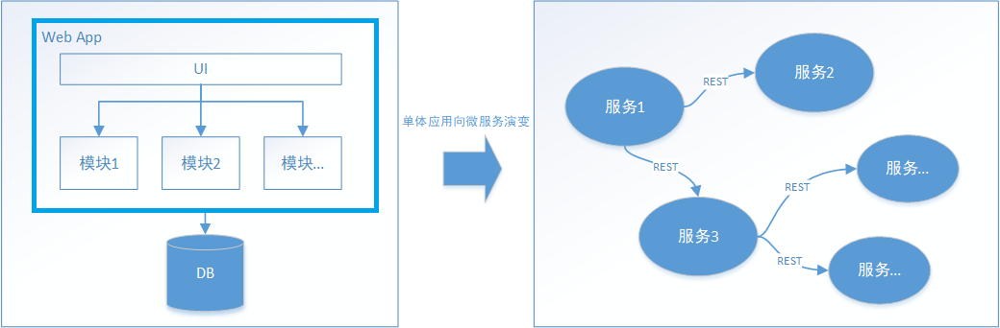

分布式系统会把一个应用系统拆分为可独立部署的多个服务，因此需要服务与服务之间远程协作才能完成事务操作，这种分布式系统环境下的事务机制称之为**分布式事务**。

本地事务依赖数据库本身提供的事务特性来实现，因此以下逻辑是可以实现事务控制：

```sql
begin transaction；
	-- 1.本地数据库操作：张三减少金额
	-- 2.本地数据库操作：李四增加金额
commit transaction;
```

在分布式环境下，就会变成操作不同数据库，因此以下逻辑是不可能实现事务控制：

```sql
begin transaction；
    -- 1.A微服务操作本地数据库A：张三减少金额
    -- 2.A微服务远程调用B微服务，操作数据库B：让李四增加金额
commit transaction;
```

因此在分布式架构的基础上，传统数据库事务就无法使用了，比如上例，张三和李四的账户不在一个数据库中甚至不在一个应用系统里，怎么实现转账事务？也就是说同样一个功能，原来是由一个系统完成的，即使这个功能包含很多个操作，也可以采用数据库事务(本地事务)搞定，而现在这个功能中包含的多个操作可能是由多个系统(微服务)参与完成的，此时数据库事务(本地事务)就无能为力了，这就需要新的分布式事务理论来支撑了。

## 2. 分布式事务基础理论

分布式事务与本地事务不同的是，分布式系统之所以叫分布式，是因为提供服务的各个节点分布在不同机器上，相互之间通过网络交互，那么必然存在出现网络故障的风险，这个网络断开的专业场景称之为网络分区，但不能因为这点网络问题就导致整个系统无法提供服务，网络因素成为了分布式事务的考量标准之一。因此，分布式事务需要更进一步的理论支持，通过分布式事务的基础理论知识指导来确定分布式事务控制的目标，从而理解每个解决方案。

### 2.1. 分布式事务产生的场景

1. 典型的场景就是微服务架构，微服务之间通过远程调用完成事务操作。 比如：订单微服务和库存微服务，下单的同时订单微服务请求库存微服务减库存。 总结：**跨JVM进程产生分布式事务**。

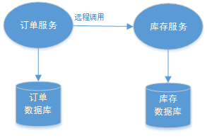

2. 单体系统访问多个数据库实例 当单体系统需要访问多个数据库（实例）时就会产生分布式事务。 比如：用户信息和订单信息分别在两个MySQL实例存储，用户管理系统删除用户信息，需要分别删除用户信息及用户的订单信息，由于数据分布在不同的数据实例，需要通过不同的数据库链接去操作数据，此时产生分布式事务。 总结：**跨数据库实例产生分布式事务**。


3. 多服务访问同一个数据库实例 比如：订单微服务和库存微服务即使访问同一个数据库也会产生分布式事务，原因就是跨JVM进程，两个微服务持有了不同的数据库链接进行数据库操作，此时产生分布式事务。

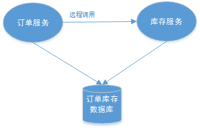

### 2.2. 分布式事务幂等性

#### 2.2.1. 幂等性定义

幂等性指的是：一个业务操作，不管重复执行多少次调用方法或者接口，不会改变业务状态，保证最终产生的效果或返回的结果都和执行一次的结果一致。

#### 2.2.2. 使用幂等性场景

- 用户重复点击(网络波动)
- MQ 消息重复
- 应用使用失败或超时重试机制

#### 2.2.3. HTTP 接口的幂等性

以基于 RESTful API 的角度对部分常见类型请求的幂等性特点进行分析

- GET 请求：查询操作，天然幂等
- POST 请求：新增操作，请求一次与请求多次造成的结果不同，非幂等
- PUT 请求：更新操作，如果是以绝对值更新，则是幂等的；如果是通过增量的方式更新，则非幂等。如下：

```sql
-- 幂等
update t_item set money = 500 where id = 1;
-- 非幂等
update t_item set money = money + 500 where id = 1;
```

- DELETE 请求：删除操作，根据唯一值删除，是幂等的

#### 2.2.4. 实现幂等性的方案

1. 通过数据库唯一索引来实现幂等性，此方案适用于**新增操作**
2. 通过 token + redis 实现幂等性，此方案适用于**新增、修改操作**。实现流程如下：

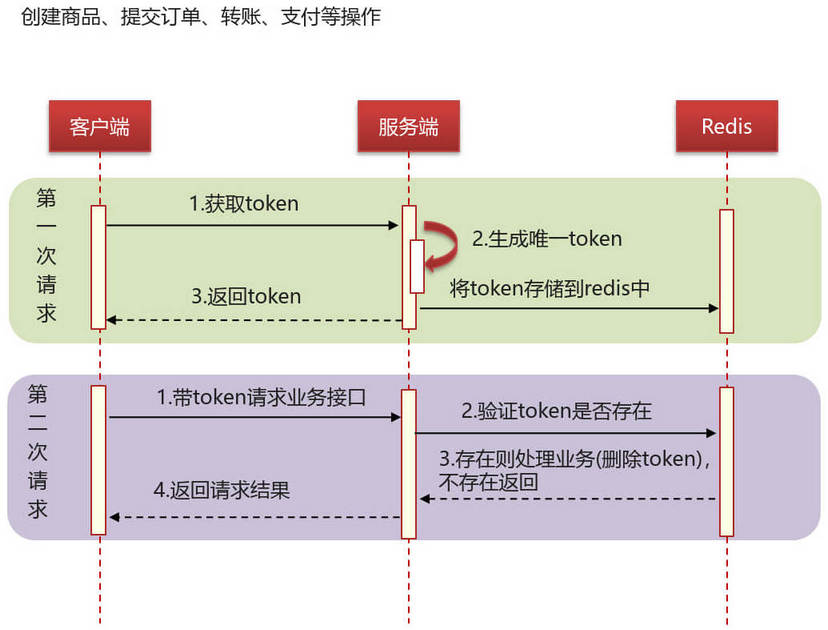

3. 通过分布式锁实现幂等性，此方案适用于**新增、修改操作**。

```java
public void saveOrder(Item item) throws InterruptedException {
	// 获取锁（重入锁），执行锁的名称
	RLock lock = redissonClient.getLock("lock");
	// 尝试获取锁，参数分别是：获取锁的最大等待时间（期间会重试），锁自动释放时间，时间单位
	boolean isLock = lock.tryLock(10, TimeUnit.SECONDS);
	try {
		// 判断是否获取成功
		if (!isLock) {
			log.info("下单操作获取锁失败,order:{}", item);
			throw new RuntimeException("新增或修改失败");
		}
		// 下单操作
	} finally {
		// 释放锁
		lock.unlock();
	}
}
```

### 2.3. XA 协议

XA 协议是一个基于数据库的分布式事务协议，其分为两部分：事务管理器（Transaction Manager）和本地资源管理器（Resource Manager）。事务管理器作为一个全局的调度者，负责对各个本地资源管理器统一提交或者回滚。二阶提交协议（2PC）和三阶提交协议（3PC）就是根据此协议衍生出来而来。主流的诸如 Oracle、MySQL 等数据库均已实现了 XA 接口。

XA 接口是双向的系统接口，在事务管理器（Transaction Manager）以及一个或多个资源管理器（Resource Manager）之间形成通信桥梁。即在基于 XA 的一个事务中，可以针对多个资源进行事务管理。例如一个系统访问多个数据库，或即访问数据库、又访问像消息中间件这样的资源，能够实现在多个数据库和消息中间件直接实现全部提交、或全部取消的事务。

> Tips: XA 规范不是 Java 的规范，而是一种通用的规范。Java 中的规范是 JTA 和 JTS。


### 2.4. 分布式事务的体系

以分布式事务的理论为基础，针对不同的分布式场景业界常见的解决方案有：2PC、TCC、可靠消息最终一致性、最大努力通知这几种。

#### 2.4.1. 刚性事务

刚性事务，基于分布式理论的 CP，遵循 ACID，对数据要求强一致性。

**基于 XA 协议**：

- **二阶提交协议（2PC）**：根据 XA 协议衍生而来，引入一个作为协调者的组件来统一掌控所有参与者的操作结果并最终指示这些节点是否要把操作结果进行真正的提交。参与者将操作成败通知协调者，再由协调者根据所有参与者的反馈情况决定各参与者是否要提交操作还是中止操作。此两个阶段是指：
    - 第一阶段：准备阶段（投票阶段）
    - 第二阶段：提交阶段（执行阶段）
- **三阶提交协议（3PC）**：是对两段提交（2PC）的一种升级优化，3PC 在 2PC 的第一阶段和第二阶段中插入一个准备阶段。保证了在最后提交阶段之前，各参与者节点的状态都一致。同时在协调者和参与者中都引入超时机制，当参与者各种原因未收到协调者的 commit 请求后，会对本地事务进行 commit，不会一直阻塞等待，解决了 2PC 的单点故障问题，但 3PC 还是没能从根本上解决数据一致性的问题。

**基于 Java 事务规范**：

- JTA（Java Transaction API）：Java 事务 API，一个 Java 企业版的应用程序接口，在 Java 环境中，允许完成跨越多个 XA 资源的分布式事务。
- JTS（Java Transaction Service）：Java 事务服务，J2EE 平台提供了分布式事务服务的具体实现规范，j2ee 服务器提供商根据 JTS 规范实现事务并提供 JTA 接口。

#### 2.4.2. 柔性事务

柔性事务，基于分布式理论的 AP，遵循 BASE，允许一定时间内不同节点的数据不一致，但要求最终一致。

**基于业务层**：

- TCC（Try-Confirm-Cancel）：又被称补偿事务，TCC 与 2PC 的思想很相似，事务处理流程也很相似，但 2PC 是应用于在 DB 层面，TCC 则可以理解为在应用层面的 2PC，是需要开发者编写业务逻辑来实现。
- SAGA：是由一系列的本地事务构成。每一个本地事务在更新完数据库之后，会发布一条消息或者一个事件来触发 Saga 中的下一个本地事务的执行。如果一个本地事务因为某些业务规则无法满足而失败，Saga 会执行在这个失败的事务之前成功提交的所有事务的补偿操作。Saga 的实现有很多种方式，其中最流行的两种方式是：基于事件的方式和基于命令的方式。

**最终一致性**：

- **本地消息表**：最初是由 eBay 提出，核心思路是将分布式事务拆分成本地事务进行处理。
- **消息队列**：基于 MQ 的分布式事务方案其实是对本地消息表的封装，将本地消息表基于 MQ 内部，其他方面的协议基本与本地消息表一致。
- **最大努力通知**：最大努力通知也称为定期校对，是对 MQ 事务方案的进一步优化。它在事务主动方增加了消息校对的接口，如果事务被动方没有接收到消息，此时可以调用事务主动方提供的消息校对的接口主动获取。

## 3. 解决方案之 2PC (两阶段提交)（整理中！）

### 3.1. 概述

引入一个作为协调者（coordinator）的组件来统一掌控所有参与者（participant）的操作结果，并最终指示这些节点是否要把操作结果进行真正的提交。即参与者（participant）用于管理资源，协调者（coordinator）用于协调事务状态

#### 3.1.1. 处理流程

两段提交（2PC - Prepare & Commit）是指两个阶段的提交：

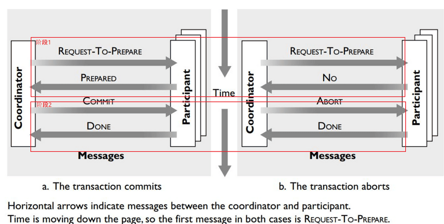

- **第一阶段：准备阶段**
    1. 协调者向所有参与者发送 REQUEST-TO-PREPARE。
    2. 当参与者收到 REQUEST-TO-PREPARE 消息后，它向协调者发送消息 PREPARED 或者 NO，表示事务是否准备好。如果发送的是 NO，那么事务要回滚。
- **第二阶段：提交阶段**
    1. 协调者收集所有参与者的返回消息，如果所有的参与者都回复的是 PREPARED，那么协调者向所有参与者发送 COMMIT 消息；否则，协调者向所有回复 PREPARED 的参与者发送 ABORT 消息。
    2. 参与者如果回复了 PREPARED 消息并且收到协调者发来的 COMMIT 消息，将执行提交；如果收到 ABORT 消息，则执行回滚。最终均向协调者发送 DONE 消息以确认。

#### 3.1.2. 两段提交（2PC）的缺点

二阶段提交看似能够提供原子性的操作，但它存在着严重的缺陷：

- **网络抖动导致的数据不一致**：第二阶段中协调者向参与者发送 commit 命令之后，一旦此时发生网络抖动，导致一部分参与者接收到了 commit 请求并执行，但其他未接到 commit 请求的参与者无法执行事务提交。进而导致整个分布式系统出现了数据不一致。
- **超时导致的同步阻塞问题**：2PC 中的所有的参与者节点都为事务阻塞型，当某一个参与者节点出现通信超时，其余参与者都会被动阻塞占用资源不能释放。
- **单点故障的风险**：由于严重的依赖协调者，一旦协调者发生故障，而此时参与者还都处于锁定资源的状态，无法完成事务 commit 操作。虽然协调者出现故障后，会重新选举一个协调者，可无法解决因前一个协调者宕机导致的参与者处于阻塞状态的问题。

2PC 除本身的算法局限外，还有一个使用上的限制，就是它主要用在两个数据库之间（数据库实现了 XA 协议）。两个系统之间是无法使用 2PC 的，因为不会直接在底层的两个业务数据库之间做一致性，而是在两个服务上面实现一致性。

## 4. 解决方案之 3PC (三阶段提交)（整理中！）

### 4.1. 概述

三段提交（3PC）是对两段提交（2PC）的一种升级优化，**3PC 在 2PC 的第一阶段和第二阶段中插入一个准备阶段**。保证了在最后提交阶段之前，各参与者节点的状态都一致。同时在协调者和参与者中都引入超时机制，当参与者各种原因未收到协调者的 commit 请求后，会对本地事务进行 commit，不会一直阻塞等待，解决了 2PC 的单点故障问题，但 3PC 还是没能从根本上解决数据一致性的问题。

3PC 的三个阶段分别是 CanCommit、PreCommit、DoCommit：

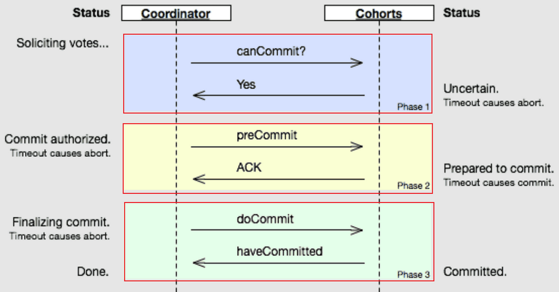

- CanCommit：协调者向所有参与者发送 CanCommit 命令，询问是否可以执行事务提交操作。如果全部响应 YES 则进入下一个阶段。
- PreCommit：协调者向所有参与者发送 PreCommit 命令，询问是否可以进行事务的预提交操作，参与者接收到 PreCommit 请求后，如参与者成功的执行了事务操作，则返回 Yes 响应，进入最终 commit 阶段。一旦参与者中有向协调者发送了 No 响应，或因网络造成超时，协调者没有接到参与者的响应，协调者向所有参与者发送 abort 请求，参与者接受 abort 命令执行事务的中断。
- DoCommit：在前两个阶段中所有参与者的响应反馈均是 YES 后，协调者向参与者发送 DoCommit 命令正式提交事务，如协调者没有接收到参与者发送的 ACK 响应，会向所有参与者发送 abort 请求命令，执行事务的中断。

3PC 存在的问题：工作在同步网络模型上，它假设消息传输时间是有上界的，只存在机器失败而不存在消息失败。但现实的情形是，机器失败是无法完美地检测出来的，消息传输可能因为网络拥堵花费很多时间。同时阻塞是相对，存在协调者和参与者同时失败的情形下，3PC事务依然会阻塞。实际上，很少会有系统实现3PC，多数现实的系统会通过复制状态机解决 2PC 阻塞的问题。比如，如果失败模型不是失败-停止，而是消息失败（消息延迟或网络分区），那样 3PC 会产生不一致的情形。

## 5. 解决方案之 TCC (补偿事务)

### 5.1. TCC 事务概述

TCC(Try/Confirm/Cancel 三个词语的缩写) 编程模式的核心思想是：针对每个分支事务操作，都要向全局事务管理器（TM）发起方注册 Try（预处理）、Confirm（确认）和 Cancel（撤销）三个操作，具体这些操作由开发者根据业务进行实现，然后分为两个阶段去执行：

- TM 首先发起所有的分支事务的 Try 操作，若 Try 操作全部成功，TM 将会发起所有分支事务的 Confirm 操作。其中 Confirm 操作若执行失败，TM会进行重试。

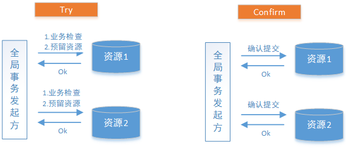

- 若 TM 发起的任何一个分支事务的 Try 操作执行失败，TM 将会发起所有分支事务的 Cancel 操作。其中 Cancel 操作若执行失败，TM会进行重试。

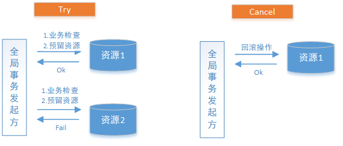

### 5.2. TCC 中涉及的元素

TCC 分为三个阶段：

1. **Try** 阶段主要是做业务检查(一致性)及资源预留(隔离)，此阶段仅是一个初步操作，它和后续的 Confirm 一起才能真正构成一个完整的业务逻辑。
2. **Confirm** 阶段主要是做确认提交，Try 阶段所有分支事务执行成功后开始执行 Confirm。通常情况下，采用 TCC 则认为 Confirm 阶段是不会出错的。即：只要 Try 成功，Confirm 一定成功。若 Confirm 阶段真的出错了，需引入重试机制或人工处理。
3. **Cancel** 阶段主要是在业务执行错误，需要回滚的状态下执行分支事务的业务取消，预留资源释放。通常情况下，采用 TCC 则认为 Cancel 阶段也是一定成功的。若 Cancel 阶段真的出错了，需引入重试机制或人工处理。

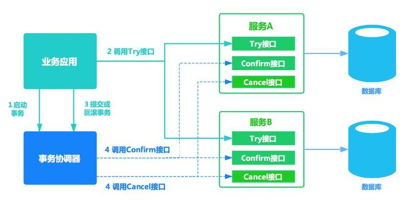

- **TM（事务管理器）**

可以实现为独立的服务，也可以让全局事务发起方充当 TM 的角色，TM 独立出来是为了成为公用组件，是为了考虑系统结构和软件复用。

TM 在发起全局事务时生成全局事务记录，全局事务ID贯穿整个分布式事务调用链条，用来记录事务上下文，追踪和记录状态，由于 Confirm  和 Cancel 失败需进行重试，因此需要实现为幂等，幂等性是指同一个操作无论请求多少次，其结果都相同。

### 5.3. TCC 案例说明

案例1： A转账30元给B，A账户和B账户在不同银行(服务)，当前余额都为100元

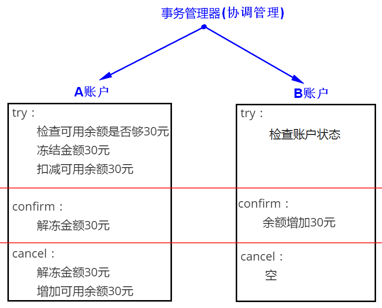

上述案例需要把之前实现的转账的代码拆分成三块，套到 try-confirm-cancel 中，由事务管理器(协调管理)推进AB两个 try 分别执行，在这个过程中，事务管理器会对AB进行监控，一旦任何一方出现了问题，就推进对方执行cancel；如果双方都没有异常，就推进AB执行 Confirm。如果在执行 confirm 或 cancel 过程中出现问题，就引入重试机制或由人工处理。

TCC 解决方案要求每个分支事务实现三个操作 Try/Confirm/Cancel。Try 操作做业务检查及资源预留，Confirm 操作做业务确认操作，Cancel 操作需要实现一个与try相反的操作。TM(事务管理器)首先发起所有的分支事务的 Try 操作，任何一个分支事务的 Try 操作执行失败，TM 将会发起所有分支事务的 Cancel 操作，若 Try 操作全部成功，TM 将会发起所有分支事务的 Confirm 操作，其中 Confirm/Cancel 操作若执行失败，TM 会进行重试，因此需要实现幂等。Try/Confirm/Cancel 这三个操作的具体实现，由开发者根据业务情况灵活掌握。

TCC不足之处：

- 对应用的侵入性强。业务逻辑的每个分支都需要实现 try、confirm、cancel 三个操作，应用侵入性较强，改造成本高。
- 实现难度较大。需要按照网络状态、系统故障等不同的失败原因实现不同的回滚策略。为了满足一致性的要求，confirm 和 cancel 接口必须实现幂等。

### 5.4. TCC 解决方案

目前市面上的 TCC 框架众多比如下面这几种：（以下统计时间截止于 2019年07月11日）

|     框架名称     |                    Gitbub地址                    |
| --------------- | ----------------------------------------------- |
| tcc-transaction | https://github.com/changmingxie/tcc-transaction |
| Hmily           | https://github.com/yu199195/hmily               |
| ByteTCC         | https://github.com/liuyangming/ByteTCC          |
| EasyTransaction | https://github.com/QNJR-GROUP/EasyTransaction   |

- Hmily 框架的使用详见[《Hmily-TCC分布式事务解决方案》笔记](/分布式微服务/分布式事务控制解决方案/Hmily-TCC分布式事务解决方案)

### 5.5. TCC 需要注意三种异常处理

TCC 需要注意三种异常处理分别是**空回滚**、**幂等**、**悬挂**

#### 5.5.1. 空回滚

在没有调用 TCC 资源 Try 方法的情况下，调用了二阶段的 Cancel 方法，Cancel 方法需要识别出这是一个空回滚，然后直接返回成功。

出现原因是当一个分支事务所在服务宕机或网络异常，分支事务调用记录为失败，这个时候其实是没有执行 Try 阶段，当故障恢复后，分布式事务进行回滚则会调用二阶段的 Cancel 方法，从而形成空回滚。

解决思路是关键就是要识别出这个空回滚。思路很简单就是需要知道一阶段是否执行，如果执行了，那就是正常回滚；如果没执行，那就是空回滚。TM 在发起全局事务时生成全局事务记录，全局事务ID贯穿整个分布式事务调用链条。再额外增加一张分支事务记录表，其中有全局事务 ID 和分支事务 ID，第一阶段 Try 方法里会插入一条记录，表示一阶段执行了。Cancel 接口里读取该记录，如果该记录存在，则正常回滚；如果该记录不存在，则是空回滚。

#### 5.5.2. 幂等

为了保证 TCC 二阶段提交重试机制不会引发数据不一致，要求 TCC 的二阶段 Try、Confirm 和 Cancel 接口保证幂等，这样不会重复使用或者释放资源。如果幂等控制没有做好，很有可能导致数据不一致等严重问题。

解决思路在上述“分支事务记录”中增加执行状态，每次执行前都查询该状态。

#### 5.5.3. 悬挂

悬挂就是对于一个分布式事务，其二阶段 Cancel 接口比 Try 接口先执行。

出现原因是在 RPC 调用分支事务 Try 时，先注册分支事务，再执行 RPC 调用，如果此时 RPC 调用的网络发生拥堵，通常 RPC 调用是有超时时间的，RPC 超时以后，TM 就会通知 RM 回滚该分布式事务，可能回滚完成后，RPC 请求才到达参与者真正执行，而一个 Try 方法预留的业务资源，只有该分布式事务才能使用，该分布式事务第一阶段预留的业务资源就再也没有人能够处理了，就称这种情况为悬挂，即业务资源预留后没法继续处理。

解决思路是如果二阶段执行完成，那一阶段就不能再继续执行。在执行一阶段事务时判断在该全局事务下，“分支事务记录”表中是否已经有二阶段事务记录，如果有则不执行 Try

### 5.6. 总结

如果拿 TCC 事务的处理流程与 2PC 两阶段提交做比较，2PC 通常都是在跨库的 DB 层面，而 TCC 则在应用层面的处理，需要通过业务逻辑来实现。这种分布式事务的实现方式的优势在于，可以让应用自己定义数据操作的粒度，使得降低锁冲突、提高吞吐量成为可能。

而不足之处则在于对应用的侵入性非常强，业务逻辑的每个分支都需要实现 try、confirm、cancel 三个操作。此外，其实现难度也比较大，需要按照网络状态、系统故障等不同的失败原因实现不同的回滚策略。

## 6. 解决方案之 Saga 事务

### 6.1. Saga 概述

Saga 是由一系列的本地事务构成。每一个本地事务在更新完数据库之后，会发布一条消息或者一个事件来触发 Saga 中的下一个本地事务的执行。如果一个本地事务因为某些业务规则无法满足而失败，Saga 会执行在这个失败的事务之前成功提交的所有事务的补偿操作。Saga 最流行实现的两种方式是：

- **基于事件的方式**。这种方式没有协调中心，处于当前 Saga 下的各个服务，会产生某类事件，或者监听其它服务产生的事件并决定是否需要针对监听到的事件做出响应。
- **基于命令的方式**。这种方式由协调中心来指挥 Saga 的参与方应该执行哪一个本地事务。

以订单流程为例，假设一个完整的订单流程包含了如下几个服务：

- Order Service：订单服务
- Payment Service：支付服务
- Stock Service：库存服务
- Delivery Service：物流服务

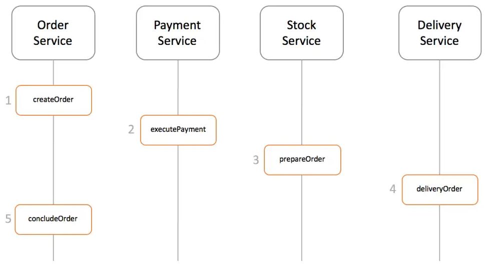

### 6.2. 基于事件的方式

#### 6.2.1. 正常流程

在基于事件的方式中，第一个服务执行完本地事务之后，会产生一个事件。其它服务会监听这个事件，触发该服务本地事务的执行，并产生新的事件。采用基于事件的 saga 模式的订单处理流程如下：

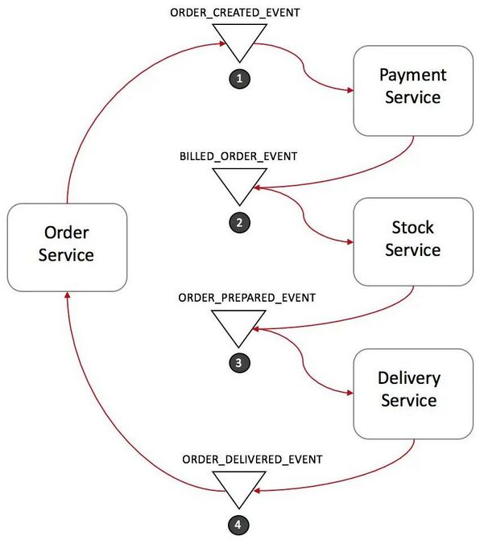

1. 订单服务创建一笔新订单，将订单状态设置为"待处理"，产生事件 ORDER_CREATED_EVENT。
2. 支付服务监听 ORDER_CREATED_EVENT，完成扣款并产生事件 BILLED_ORDER_EVENT。
3. 库存服务监听 BILLED_ORDER_EVENT，完成库存扣减和备货，产生事件 ORDER_PREPARED_EVENT。
4. 物流服务监听 ORDER_PREPARED_EVENT，完成商品配送，产生事件 ORDER_DELIVERED_EVENT。
5. 订单服务监听 ORDER_DELIVERED_EVENT，将订单状态更新为"完成"。

在这个流程中，订单服务很可能还会监听 BILLED_ORDER_EVENT，ORDER_PREPARED_EVENT 来完成订单状态的实时更新。将订单状态分别更新为"已经支付"和"已经出库"等状态来及时反映订单的最新状态。

#### 6.2.2. 回滚流程

为了在异常情况下回滚整个分布式事务，需要为相关服务提供补偿操作接口。假设库存服务由于库存不足没能正确完成备货，可以按照下面的流程来回滚整个 Saga 事务：

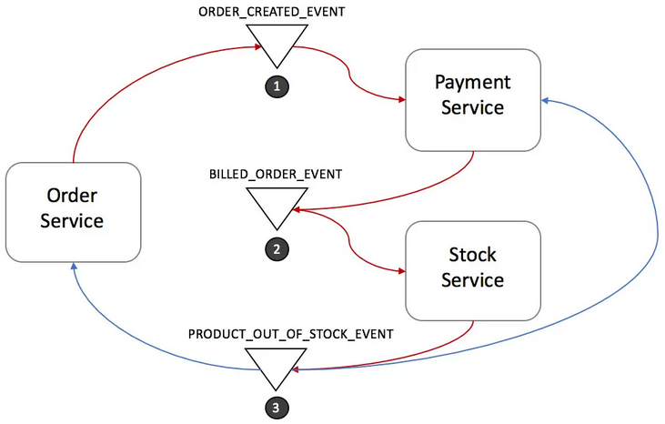

1. 库存服务产生事件 PRODUCT_OUT_OF_STOCK_EVENT。
2. 订单服务和支付服务都会监听该事件并做出响应：
    1. 支付服务完成退款。
    2. 订单服务将订单状态设置为"失败"。

#### 6.2.3. 基于事件方式的优缺点

- **优点**：简单且容易理解。各参与方相互之间无直接沟通，完全解耦。这种方式比较适合整个分布式事务只有2-4个步骤的情形。
- **缺点**：这种方式如果涉及比较多的业务参与方，则比较容易失控。各业务参与方可随意监听对方的消息，以至于最后没人知道到底有哪些系统在监听哪些消息。还有这个模式还可能产生环形监听，也就是两个业务方相互监听对方所产生的事件。

### 6.3. 基于命令的方式

在基于命令的方式中，会定义一个新的服务，这个新服务叫做协调中心。协调中心通过命令/回复的方式来和 Saga 中其它服务进行交互。继续以订单流程为例，下图中的 Order Saga Orchestrator 就是新引入的协调中心。

#### 6.3.1. 正常流程

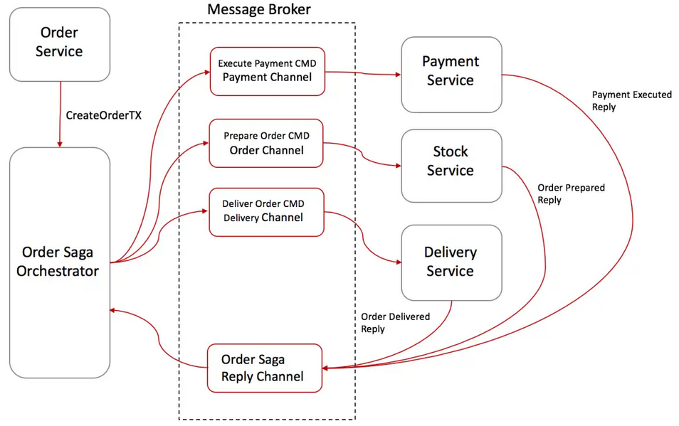

1. 订单服务创建一笔新订单，将订单状态设置为"待处理"，然后让 Order Saga Orchestrator（OSO）开启创建订单事务。
2. OSO 发送一个"支付命令"给支付服务，支付服务完成扣款并回复"支付完成"消息。
3. OSO 发送一个"备货命令"给库存服务，库存服务完成库存扣减和备货，并回复"出库"消息。
4. OSO 发送一个"配送命令"给物流服务，物流服务完成配送，并回复"配送完成"消息。
5. OSO 向订单服务发送"订单结束命令"给订单服务，订单服务将订单状态设置为"完成"。
6. OSO 清楚一个订单处理 Saga 的具体流程，并在出现异常时向相关服务发送补偿命令来回滚整个分布式事务。

实现协调中心的一个比较好的方式是使用状态机(Sate Machine)。

#### 6.3.2. 回滚流程

该模式下的回滚流程如下：

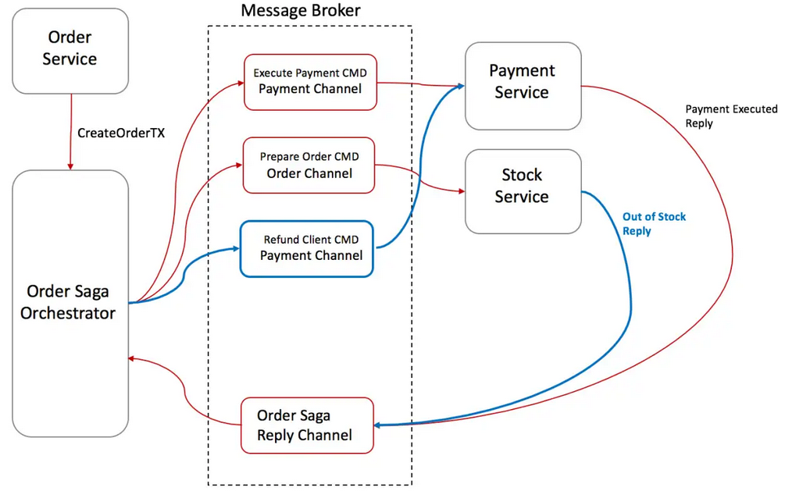

1. 库存服务回复 OSO 一个"库存不足"消息。
2. OSO 意识到该分布式事务失败了，触发回滚流程。
3. OSO 发送"退款命令"给支付服务，支付服务完成退款并回复"退款成功"消息。
4. OSO 向订单服务发送"将订单状态改为失败命令"，订单服务将订单状态更新为"失败"。

#### 6.3.3. 基于命令方式的优缺点

**优点**：

1. 避免了业务方之间的环形依赖。
2. 将分布式事务的管理交由协调中心管理，协调中心对整个逻辑非常清楚。
3. 减少了业务参与方的复杂度。这些业务参与方不再需要监听不同的消息，只是需要响应命令并回复消息。
4. 测试更容易（分布式事务逻辑存在于协调中心，而不是分散在各业务方）。
5. 回滚也更容易。

**缺点**：一个可能的缺点就是需要维护协调中心，而这个协调中心并不属于任何业务方。

### 6.4. Saga 模式建议

1. 给每一个分布式事务创建一个唯一的 Tx_id。这个唯一的 Tx_id 可以用来在各个业务参与方沟通时精确定位哪一笔分布式事务。
2. 对于基于命令的方式，在命令中携带回复地址。这种方式可以让服务同时响应多个协调中心请求。
3. 幂等性。幂等性能够增加系统的容错性，让各个业务参与方服务提供幂等性操作，能够在遇到异常情况下进行重试。
4. 尽量在命令或者消息中携带下游处理需要的业务数据，避免下游处理时需要调用消息产生方接口获取更多数据。减少系统之间的相互依赖。

## 7. 解决方案之可靠消息最终一致性

### 7.1. 可靠消息最终一致性事务概述

可靠消息最终一致性方案是指当事务发起方执行完成本地事务后并发出一条消息，事务参与方(消息消费者)一定能够接收消息并处理事务成功，此方案强调的是只要消息发给事务参与方最终事务要达到一致。此方案是利用消息中间件完成，如下图：


### 7.2. 可靠消息最终一致性方案需解决的问题

事务发起方（消息生产方）将消息发给消息中间件，事务参与方从消息中间件接收消息，事务发起方和消息中间件之间，事务参与方（消息消费方）和消息中间件之间都是通过网络通信，由于网络通信的不确定性会导致分布式事务问题。因此可靠消息最终一致性方案要解决以下几个问题：

#### 7.2.1. 本地事务与消息发送的原子性

本地事务与消息发送的原子性问题即：事务发起方在本地事务执行成功后消息必须发出去，否则就丢弃消息。即实现本地事务和消息发送的原子性，要么都成功，要么都失败。本地事务与消息发送的原子性问题是实现可靠消息最终一致性方案的关键问题。

- 如先发送消息，再操作数据库。这种情况下无法保证数据库操作与发送消息的一致性，因为可能发送消息成功，数据库操作失败。

```java
begin transaction;
    //1.发送MQ
    //2.数据库操作
commit transation;
```

- 如先进行数据库操作，再发送消息。此时如果发送MQ消息失败，就会抛出异常，导致数据库事务回滚；但如果是超时异常，数据库回滚，但MQ其实已经正常发送了，同样会导致不一致。

```java
begin transaction;
    //1.数据库操作
    //2.发送MQ
commit transation;
```

#### 7.2.2. 事务参与方接收消息的可靠性

事务参与方必须能够从消息队列接收到消息，如果接收消息失败可以重复接收消息。

#### 7.2.3. 消息重复消费

由于网络的存在，若某一个消费节点超时但是消费成功，此时消息中间件会重复投递此消息，就导致了消息的重复消费。

要解决消息重复消费的问题就要事务参与方的方法实现幂等性。

### 7.3. 解决方案

#### 7.3.1. 本地消息表方案

本地消息表这个方案最初是 eBay 提出的，此方案的核心是通过本地事务保证数据业务操作和消息的一致性，然后通过定时任务将消息发送至消息中间件，待确认消息发送给消费方成功再将消息删除。

##### 7.3.1.1. 方案流程

方案涉及的两个角色，**事务主动方**和**事务被动方**。通过在事务主动发起方额外新建事务消息表，事务发起方处理业务和记录事务消息在本地事务中完成，轮询事务消息表的数据发送事务消息，事务被动方基于消息中间件消费事务消息表中的事务。这样可以避免以下两种情况导致的数据不一致性：

- 业务处理成功、事务消息发送失败
- 业务处理失败、事务消息发送成功

整体的流程如下图：

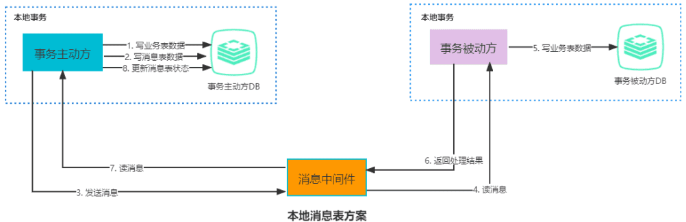

上图中整体的处理步骤如下：

1. 事务主动方在同一个本地事务中处理业务和写消息表操作。
2. 事务主动方通过消息中间件，通知事务被动方处理事务通知事务待消息。消息中间件可以基于 Kafka、RocketMQ 等消息队列，事务主动方主动写消息到消息队列，事务消费方消费并处理消息队列中的消息。
3. 事务被动方通过消息中间件，通知事务主动方事务已处理的消息。
4. 事务主动方接收中间件的消息，更新消息表的状态为已处理。

以上流程还有必要的容错处理，如下：

- 当第1步处理出错，由于还在事务主动方的本地事务中，直接回滚即可。
- 当第2, 3步处理出错，由于事务主动方本地保存了消息，只需要轮询消息重新通过消息中间件发送，事务被动方重新读取消息处理业务即可。
- 如果是业务上处理失败，事务被动方可以发消息给事务主动方回滚事务。
- 如果事务被动方已经消费了消息，事务主动方需要回滚事务的话，需要发消息通知事务主动方进行回滚事务。

##### 7.3.1.2. 方案优缺点

优点：

- 从应用设计开发的角度实现了消息数据的可靠性，消息数据的可靠性不依赖于消息中间件，弱化了对 MQ 中间件特性的依赖。
- 方案轻量，容易实现。

缺点：

- 与具体的业务场景绑定，耦合性强，不可公用。
- 消息数据与业务数据同库，占用业务系统资源。
- 业务系统在使用关系型数据库的情况下，消息服务性能会受到关系型数据库并发性能的局限。

##### 7.3.1.3. 示例

下面以注册送积分为例来说明，示例中共有两个微服务交互，用户服务和积分服务，用户服务负责添加用户，积分服务负责增加积分。

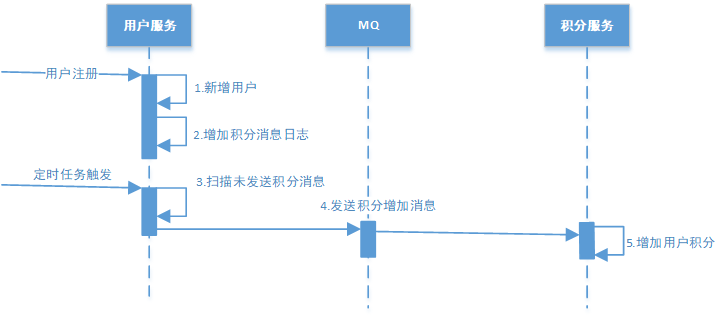

交互流程如下：

1. **用户注册**

用户服务在本地事务新增用户和增加 ”积分消息日志“。（用户表和消息表通过本地事务保证一致）。以下是伪代码：

```java
begin transaction;
    //1.新增用户
    //2.存储积分消息日志
commit transation;
```

这种情况下，本地数据库操作与存储积分消息日志处于同一个事务中，本地数据库操作与记录消息日志操作具备原子性。

2. **定时任务扫描日志**

如何保证将消息发送给消息队列？

经过第一步消息已经写到消息日志表中，可以启动独立的线程，定时对消息日志表中的消息进行扫描并发送至消息中间件，在消息中间件反馈发送成功后删除该消息日志，否则等待定时任务下一周期重试。

3. **消费消息**

如何保证消费者一定能消费到消息？

这里可以使用 MQ 的 ack（即消息确认）机制，消费者监听 MQ，如果消费者接收到消息并且业务处理完成后向 MQ 发送 ack（即消息确认），此时说明消费者正常消费消息完成，MQ 将不再向消费者推送消息，否则消费者会不断重试向消费者来发送消息。

积分服务接收到“增加积分”消息，开始增加积分，积分增加成功后向消息中间件回应ack，否则消息中间件将重复投递此消息。由于消息会重复投递，积分服务的“增加积分”功能需要实现幂等性。

#### 7.3.2. MQ 事务方案（可靠消息事务）

MQ 事务方案整体流程和本地消息表的流程很相似，唯一不同就是将本地消息表存在了 MQ 内部，而不是业务数据库中，因此 MQ 内部的处理尤为重要。如下图：

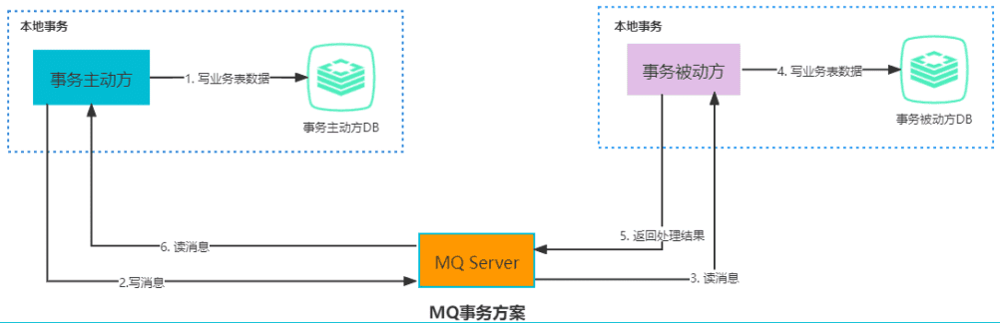

> 下面主要基于 RocketMQ 4.3 之后的版本实现 MQ 的分布式事务方案。具体的案例内容详见[《RocketMQ - 可靠消息最终一致性事务解决方案》](/分布式微服务/分布式事务控制解决方案/RocketMQ-可靠消息最终一致性事务解决方案)

在本地消息表方案中，保证事务主动方发写业务表数据和写消息表数据的一致性是基于数据库事务，RocketMQ 的事务消息相对于普通 MQ 提供了 2PC 的提交接口，方案如下：

##### 7.3.2.1. 正常情况：事务主动方发消息

这种情况下，事务主动方服务正常，没有发生故障，发消息流程如下：

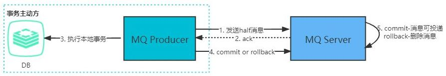

1. 发送方向 MQ 服务端(MQ Server)发送 half 消息。
2. MQ Server 将消息持久化成功之后，向发送方 ack 确认消息已经发送成功。
3. 发送方开始执行本地事务逻辑。
4. 发送方根据本地事务执行结果向 MQ Server 提交二次确认（commit 或是 rollback）。
5. MQ Server 收到 commit 状态则将半消息标记为可投递，订阅方最终将收到该消息；MQ Server 收到 rollback 状态则删除半消息，订阅方将不会接受该消息。

##### 7.3.2.2. 异常情况：事务主动方消息恢复

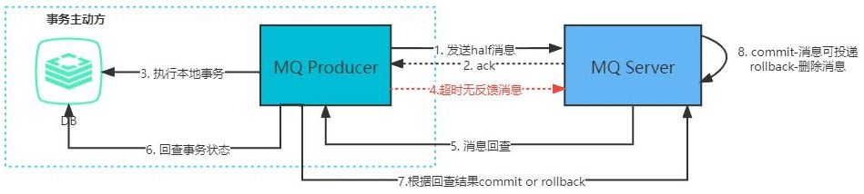

在断网或者应用重启等异常情况下，上图中的第 4 步提交的二次确认超时未到达 MQ Server，此时处理逻辑如下：

- MQ Server 对该消息发起消息回查。
- 发送方收到消息回查后，需要检查对应消息的本地事务执行的最终结果。
- 发送方根据检查得到的本地事务的最终状态再次提交二次确认。
- MQ Server 基于 commit/rollback 对消息进行投递或者删除。

##### 7.3.2.3. 方案优缺点

优点：

- 消息数据独立存储，降低业务系统与消息系统之间的耦合。
- 吞吐量大于使用本地消息表方案。

缺点：

- 一次消息发送需要两次网络请求（半消息 + commit/rollback 消息）。
- 业务处理服务需要实现消息状态回查接口。

#### 7.3.3. 最大努力通知

最大努力通知也称为定期校对，是对 MQ 事务方案的进一步优化。它在事务主动方增加了消息校对的接口，如果事务被动方没有接收到消息，此时可以调用事务主动方提供的消息校对的接口主动获取。最大努力通知的整体流程如下图：

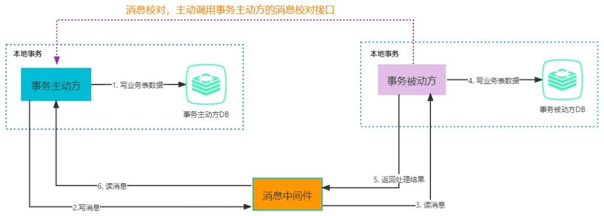

在可靠消息事务中，事务主动方需要将消息发送出去，并且消息接收方成功接收，这种可靠性发送是由事务主动方保证的。事务主动方会尽最大努力（重试，轮询...）将事务发送给事务接收方，但是仍然存在消息接收不到，此时需要事务被动方主动调用事务主动方的消息校对接口查询业务消息并消费，这**种通知的可靠性是由事务被动方保证的**。

最大努力通知适用于业务通知类型，例如微信交易的结果，就是通过最大努力通知方式通知各个商户，既有回调通知，也有交易查询接口。
