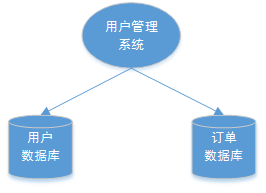

## 1. 分布式事务基础理论概述

### 1.1. 什么是事务

什么是事务？举个生活中的例子：你去商店买东西就是一个事务的例子，买东西是一个交易，包含“一手交钱，一手交货”两个动作，交钱和交货这两个动作必须全部成功，交易才算成功，其中任何一个动作失败，交易就必须撤销。

事务的定义：**事务可以看做是一次大的活动，它由不同的小活动组成，这些小活动要么全部成功，要么全部失败。**

### 1.2. 本地事务

在软件系统中，通常由关系型数据库来控制事务，这是利用数据库本身的事务特性来实现的，因此叫数据库事务，由于应用主要靠关系数据库来控制事务，而数据库通常和应用在同一个服务器，所以基于关系型数据库的事务又被称为本地事务。以下回顾数据库事务的四大特性 ACID：

- **A（Atomic）**：原子性，构成事务的所有操作，要么都执行成功，要么全部不执行，不可能出现部分成功部分失败的情况。
- **C（Consistency）**：一致性，在事务执行前后，数据库的一致性约束没有被破坏。比如：张三向李四转100元，转账前和转账后的数据是正确状态这叫一致性，如果出现张三转出100元，李四账户没有增加100元这就出现了数据错误，就没有达到一致性。
- **I（Isolation）**：隔离性，数据库中的事务一般都是并发的，隔离性是指并发的两个事务的执行互不干扰，一个事务不能看到其他事务运行过程的中间状态。通过配置事务隔离级别可以避脏读、重复读等问题。
- **D（Durability）**：持久性，事务完成之后，该事务对数据的更改会被持久化到数据库，且不会被回滚。

<u>数据库事务在实现时会将一次事务涉及的所有操作全部纳入到一个不可分割的执行单元，该执行单元中的所有操作要么都成功，要么都失败，只要其中任一操作执行失败，都将导致整个事务的回滚</u>s

### 1.3. 分布式事务

随着互联网的快速发展，软件系统由原来的单体应用转变为分布式应用，下图描述了单体应用向分布式微服务应用的演变：


分布式系统会把一个应用系统拆分为可独立部署的多个服务，因此需要服务与服务之间远程协作才能完成事务操作，这种分布式系统环境下的事务机制称之为**分布式事务**。

本地事务依赖数据库本身提供的事务特性来实现，因此以下逻辑是可以实现事务控制：

```sql
begin transaction；
	-- 1.本地数据库操作：张三减少金额
	-- 2.本地数据库操作：李四增加金额
commit transaction;
```

在分布式环境下，就会变成操作不同数据库，因此以下逻辑是不可能实现事务控制：

```sql
begin transaction；
    -- 1.A微服务操作本地数据库A：张三减少金额
    -- 2.A微服务远程调用B微服务，操作数据库B：让李四增加金额
commit transaction;
```

因此在分布式架构的基础上，传统数据库事务就无法使用了，比如上例，张三和李四的账户不在一个数据库中甚至不在一个应用系统里，怎么实现转账事务？也就是说同样一个功能，原来是由一个系统完成的，即使这个功能包含很多个操作，也可以采用数据库事务(本地事务)搞定，而现在这个功能中包含的多个操作可能是由多个系统(微服务)参与完成的，此时数据库事务(本地事务)就无能为力了，这就需要新的分布式事务理论来支撑了。

## 2. 分布式事务基础理论

分布式事务与本地事务不同的是，分布式系统之所以叫分布式，是因为提供服务的各个节点分布在不同机器上，相互之间通过网络交互，那么必然存在出现网络故障的风险，这个网络断开的专业场景称之为网络分区，但不能因为这点网络问题就导致整个系统无法提供服务，网络因素成为了分布式事务的考量标准之一。因此，分布式事务需要更进一步的理论支持，通过分布式事务的基础理论知识指导来确定分布式事务控制的目标，从而理解每个解决方案。

### 2.1. 分布式事务产生的场景

1. 典型的场景就是微服务架构，微服务之间通过远程调用完成事务操作。 比如：订单微服务和库存微服务，下单的同时订单微服务请求库存微服务减库存。 总结：**跨JVM进程产生分布式事务**。


2. 单体系统访问多个数据库实例 当单体系统需要访问多个数据库（实例）时就会产生分布式事务。 比如：用户信息和订单信息分别在两个MySQL实例存储，用户管理系统删除用户信息，需要分别删除用户信息及用户的订单信息，由于数据分布在不同的数据实例，需要通过不同的数据库链接去操作数据，此时产生分布式事务。 总结：**跨数据库实例产生分布式事务**。



3. 多服务访问同一个数据库实例 比如：订单微服务和库存微服务即使访问同一个数据库也会产生分布式事务，原因就是跨JVM进程，两个微服务持有了不同的数据库链接进行数据库操作，此时产生分布式事务。


### 2.2. CAP 理论

CAP 是 Consistency、Availiability、Partition tolerance 三个词语的缩写，分别表示一致性、可用性、分区容忍性。

#### 2.2.1. 业务场景

结合电商系统中的一些业务场景来理解 CAP 理论。业务背景：

- 每台数据库服务器有它的最大连接数、负载和吞吐量，若有一天无法再满足业务的需求，就需要横向去扩展几台 Slave(从数据库) 去分担 Master(主数据库) 的压力。
- 如果服务对数据库的需求是 IO 密集型的，那可能会经常遇到增删改影响到了查询效率。这就需要进行读写分离，由主数据库应付增删改操作，由从数据库应付查询操作，主从数据库的数据要进行同步。


上图商品信息管理的执行流程：

1. 商品服务请求主数据库写入商品信息（添加商品、修改商品、删除商品）	
2. 主数据库向商品服务响应写入成功。
3. 商品服务请求从数据库读取商品信息。

#### 2.2.2. C - Consistency

一致性是指写操作后的读操作可以读取到最新的数据状态，当数据分布在多个节点上，从任意节点读取到的数据都是最新的状态。上图中，商品信息的读写要满足一致性就是要实现如下目标：

1. 商品服务写入主数据库成功，则向从数据库查询新数据也成功。
2. 商品服务写入主数据库失败，则向从数据库查询新数据也失败。

如何实现一致性？

1. 写入主数据库后要将数据同步到从数据库。
2. 写入主数据库后，在向从数据库同步期间要将从数据库锁定，待同步完成后再释放锁，以免在新数据写入成功后，向从数据库查询到旧的数据。

分布式系统一致性的特点：

1. 由于存在数据同步的过程，写操作的响应会有一定的延迟。
2. 为了保证数据一致性会对资源暂时锁定，待数据同步完成释放锁定资源。
3. 如果请求数据同步失败的结点则会返回错误信息，一定不会返回旧数据。

#### 2.2.3. A - Availability

可用性是指任何事务操作都可以得到响应结果，且不会出现响应超时或响应错误。上图中，商品信息读取满足可用性就是要实现如下目标：

1. 从数据库接收到数据查询的请求则立即能够响应数据查询结果。
2. 从数据库不允许出现响应超时或响应错误。

如何实现可用性？

1. 写入主数据库后要将数据同步到从数据库。
2. 由于要保证从数据库的可用性，不可将从数据库中的资源进行锁定。
3. 即时数据还没有同步过来，从数据库也要返回要查询的数据，哪怕是旧数据，如果连旧数据也没有则可以按照约定返回一个默认信息，但不能返回错误或响应超时。

> 为了保证可用性，一般需要通过增加从数据库节点来实现。

分布式系统可用性的特点：

1.  所有请求都有响应，且不会出现响应超时或响应错误。

#### 2.2.4. P - Partition tolerance

通常分布式系统的各个节点部署在不同的子网，这就是网络分区，不可避免的会出现由于网络故障而导致节点之间通信失败。分布式系统在遇到某节点或网络分区故障的时候，仍然能够对外提供满足一致性和可用性的服务，这就是分区容忍性。分布式系统中有某一个或者几个机器宕掉了，其他剩下的机器还能够正常运转满足系统需求，或者是机器之间有网络异常，将分布式系统分隔未独立的几个部分，各个部分还能维持分布式系统的运作，这样就具有较好的分区容忍性。上图中，商品信息读写满足分区容忍性就是要实现如下目标：

1. 主数据库向从数据库同步数据失败不影响读写操作。
2. 其中一个节点挂掉不影响另一个节点对外提供服务。

如何实现分区容忍性？

1. 尽量使用异步取代同步操作，例如使用异步方式将数据从主数据库同步到从数据，这样结点之间能有效的实现松耦合。
2. 添加从数据库结点，其中一个从结点挂掉其它从结点提供服务。

分布式分区容忍性的特点：

1. 分区容忍性分是布式系统具备的基本能力。

#### 2.2.5. CAP 共存分析


以上面章节的“商品信息管理”为例，实现了分区容忍：

- 主数据库通过网络向从数据同步数据，可以认为主从数据库部署在不同的分区，通过网络进行交互。
- 当主数据库和从数据库之间的网络出现问题不影响主数据库和从数据库对外提供服务。
- 其一个结点挂掉不影响另一个结点对外提供服务。

如果要实现C则必须保证数据一致性，在数据同步的时候为防止向从数据库查询不一致的数据则需要将从数据库数据锁定，待同步完成后解锁，如果同步失败从数据库要返回错误信息或超时信息；如果要实现A则必须保证数据可用性，不管任何时候都可以向从数据查询数据，则不会响应超时或返回错误信息。

通过分析发现，<font color=red>**在所有分布式事务场景中是不会同时具备 CAP 三个特性，因为在具备了 P 的前提下 C 和 A 是不能共存的**</font>

#### 2.2.6. CAP 组合方式

在保证分区容忍性的前提下，一致性和可用性是无法兼顾，如果要提高系统的可用性就要增加多个节点，如果要保证数据的一致性就要实现每个节点的数据一致，节点越多可用性越好，但是数据一致性会越差。 CAP 的组合方式有如下几种：

- **AP**：放弃一致性，追求分区容忍性和可用性。这是很多分布式系统设计时的选择。
    - > 例如：上边的商品管理，完全可以实现AP，前提是只要用户可以接受所查询的到数据在一定时间内不是最新的即可。通常实现AP都会保证最终一致性，后面的 BASE 理论就是根据 AP 组合来扩展的，一些业务场景，比如，订单退款，今日退款成功，明日账户到账，只要用户可以接受在一定时间内到账即可。
- **CP**：放弃可用性，追求一致性和分区容错性。比如，zookeeper 其实就是追求的强一致；又比如跨行转账，一次转账请求要等待双方银行系统都完成整个事务才算完成。
- **CA**：放弃分区容忍性，即不进行分区，不考虑由于网络不通或节点挂掉的问题，则可以实现一致性和可用性。那么系统将不是一个标准的分布式系统，最常用的关系型数据库就满足了 CA 组合。

以上面商品管理为例，如果要实现 CA 则架构如下：


不再存在主从数据，单个数据库可以响应每次的查询请求，通过事务隔离级别实现每个查询请求都可以返回最新的数据。

#### 2.2.7. 总结

CAP 是一个已经被证实的理论：一个分布式系统最多只能同时满足一致性（Consistency）、可用性（Availability）和分区容忍性（Partition tolerance）这三项中的两项。它可以作为架构设计、技术选型的考量标准。对于多数大型互联网应用的场景，节点众多、部署分散，而且现在的集群规模越来越大，所以节点故障、网络故障是常态，而且要保证服务可用性达到 N个9（99.99..%），并要达到良好的响应性能来提高用户体验，因此一般都会做出如下选择：<font color=red>**保证分区容忍性（P）和高可用性（A），舍弃强一致性（C），保证最终一致性**</font>。

### 2.3. BASE 理论

#### 2.3.1. 理解强一致性和最终一致性

从 CAP 理论可知，一个分布式系统最多只能同时满足一致性（Consistency）、可用性（Availability）和分区容忍性（Partition tolerance）这三项中的两项，其中AP在实际应用中较多，AP即舍弃一致性，保证可用性和分区容忍性。

但是在实际生产中很多场景都要实现一致性，比如上面的例子，主数据库向从数据库同步数据，即使不要一致性，但是最终也要将数据同步成功来保证数据一致，这种一致性和CAP中的一致性不同，CAP中的一致性要求在任何时间查询每个节点数据都必须一致，它强调的是强一致性，但是最终一致性是允许可以在一段时间内每个节点的数据不一致，但是经过一段时间每个节点的数据必须一致，它强调的是最终数据的一致性。

#### 2.3.2. Base 理论简介

BASE 是 Basically Available(基本可用)、Soft state(软状态)和 Eventually consistent (最终一致性)三个短语的缩写。BASE 理论是对 CAP 中AP的一个扩展，通过牺牲强一致性来获得可用性，当出现故障允许部分不可用但要保证核心功能可用，允许数据在一段时间内是不一致的，但最终达到一致状态。满足 BASE 理论的事务，称之为『**柔性事务**』。

- **基本可用 (Basically Available)** : 分布式系统在出现故障时，允许损失部分可用功能，保证核心功能可用。比如，电商网站交易付款出现问题了，商品依然可以正常浏览。
- **软状态 (Soft state)** : 由于不要求强一致性，所以 BASE 允许系统中存在中间状态（也叫**软状态**），这个状态不影响系统可用性，如订单的"支付中"、“数据同步中”等状态，待数据最终一致后状态改为“成功”状态。
- **最终一致 (Eventually consistent)** : 最终一致是指经过一段时间后，所有节点数据都将会达到一致。如订单的"支付中"状态，最终会变为“支付成功”或者"支付失败"，使订单状态与实际交易结果达成一致，但需要一定时间的延迟、等待。

### 2.4. 分布式事务幂等性

#### 2.4.1. 幂等性定义

幂等性指的是：一个业务操作，不管重复执行多少次调用方法或者接口，不会改变业务状态，保证最终产生的效果或返回的结果都和执行一次的结果一致。

#### 2.4.2. 使用幂等性场景

- 用户重复点击(网络波动)
- MQ 消息重复
- 应用使用失败或超时重试机制

#### 2.4.3. HTTP 接口的幂等性

以基于 RESTful API 的角度对部分常见类型请求的幂等性特点进行分析

- GET 请求：查询操作，天然幂等
- POST 请求：新增操作，请求一次与请求多次造成的结果不同，非幂等
- PUT 请求：更新操作，如果是以绝对值更新，则是幂等的；如果是通过增量的方式更新，则非幂等。如下：

```sql
-- 幂等
update t_item set money = 500 where id = 1;
-- 非幂等
update t_item set money = money + 500 where id = 1;
```

- DELETE 请求：删除操作，根据唯一值删除，是幂等的

#### 2.4.4. 实现幂等性的方案

1. 通过数据库唯一索引来实现幂等性，此方案适用于**新增操作**
2. 通过 token + redis 实现幂等性，此方案适用于**新增、修改操作**。实现流程如下：


3. 通过分布式锁实现幂等性，此方案适用于**新增、修改操作**。

```java
public void saveOrder(Item item) throws InterruptedException {
	// 获取锁（重入锁），执行锁的名称
	RLock lock = redissonClient.getLock("lock");
	// 尝试获取锁，参数分别是：获取锁的最大等待时间（期间会重试），锁自动释放时间，时间单位
	boolean isLock = lock.tryLock(10, TimeUnit.SECONDS);
	try {
		// 判断是否获取成功
		if (!isLock) {
			log.info("下单操作获取锁失败,order:{}", item);
			throw new RuntimeException("新增或修改失败");
		}
		// 下单操作
	} finally {
		// 释放锁
		lock.unlock();
	}
}
```

## 3. 分布式事务解决方案种类

以分布式事务的理论为基础，针对不同的分布式场景业界常见的解决方案有：2PC、TCC、可靠消息最终一致性、最大努力通知这几种。

## 4. 分布式事务解决方案之 2PC (两阶段提交)

TODO: 待整理！

## 5. 分布式事务解决方案之 TCC (补偿事务)

### 5.1. TCC 事务概述

TCC(Try/Confirm/Cancel 三个词语的缩写) 编程模式的核心思想是：针对每个分支事务操作，都要向全局事务管理器（TM）发起方注册 Try（预处理）、Confirm（确认）和 Cancel（撤销）三个操作，具体这些操作由开发者根据业务进行实现，然后分为两个阶段去执行：

- TM 首先发起所有的分支事务的 Try 操作，若 Try 操作全部成功，TM 将会发起所有分支事务的 Confirm 操作。其中 Confirm 操作若执行失败，TM会进行重试。


- 若 TM 发起的任何一个分支事务的 Try 操作执行失败，TM 将会发起所有分支事务的 Cancel 操作。其中 Cancel 操作若执行失败，TM会进行重试。


### 5.2. TCC 中涉及的元素

TCC 分为三个阶段：

1. **Try** 阶段主要是做业务检查(一致性)及资源预留(隔离)，此阶段仅是一个初步操作，它和后续的 Confirm 一起才能真正构成一个完整的业务逻辑。
2. **Confirm** 阶段主要是做确认提交，Try 阶段所有分支事务执行成功后开始执行 Confirm。通常情况下，采用 TCC 则认为 Confirm 阶段是不会出错的。即：只要 Try 成功，Confirm 一定成功。若 Confirm 阶段真的出错了，需引入重试机制或人工处理。
3. **Cancel** 阶段主要是在业务执行错误，需要回滚的状态下执行分支事务的业务取消，预留资源释放。通常情况下，采用 TCC 则认为 Cancel 阶段也是一定成功的。若 Cancel 阶段真的出错了，需引入重试机制或人工处理。


- **TM（事务管理器）**

可以实现为独立的服务，也可以让全局事务发起方充当 TM 的角色，TM 独立出来是为了成为公用组件，是为了考虑系统结构和软件复用。

TM 在发起全局事务时生成全局事务记录，全局事务ID贯穿整个分布式事务调用链条，用来记录事务上下文，追踪和记录状态，由于 Confirm  和 Cancel 失败需进行重试，因此需要实现为幂等，幂等性是指同一个操作无论请求多少次，其结果都相同。

### 5.3. TCC 案例说明

案例1： A转账30元给B，A账户和B账户在不同银行(服务)，当前余额都为100元


上述案例需要把之前实现的转账的代码拆分成三块，套到 try-confirm-cancel 中，由事务管理器(协调管理)推进AB两个 try 分别执行，在这个过程中，事务管理器会对AB进行监控，一旦任何一方出现了问题，就推进对方执行cancel；如果双方都没有异常，就推进AB执行 Confirm。如果在执行 confirm 或 cancel 过程中出现问题，就引入重试机制或由人工处理。

TCC 解决方案要求每个分支事务实现三个操作 Try/Confirm/Cancel。Try 操作做业务检查及资源预留，Confirm 操作做业务确认操作，Cancel 操作需要实现一个与try相反的操作。TM(事务管理器)首先发起所有的分支事务的 Try 操作，任何一个分支事务的 Try 操作执行失败，TM 将会发起所有分支事务的 Cancel 操作，若 Try 操作全部成功，TM 将会发起所有分支事务的 Confirm 操作，其中 Confirm/Cancel 操作若执行失败，TM 会进行重试，因此需要实现幂等。Try/Confirm/Cancel 这三个操作的具体实现，由开发者根据业务情况灵活掌握。

TCC不足之处：

- 对应用的侵入性强。业务逻辑的每个分支都需要实现 try、confirm、cancel 三个操作，应用侵入性较强，改造成本高。
- 实现难度较大。需要按照网络状态、系统故障等不同的失败原因实现不同的回滚策略。为了满足一致性的要求，confirm 和 cancel 接口必须实现幂等。

### 5.4. TCC 解决方案

目前市面上的 TCC 框架众多比如下面这几种：（以下统计时间截止于 2019年07月11日）

|     框架名称     |                    Gitbub地址                    |
| --------------- | ----------------------------------------------- |
| tcc-transaction | https://github.com/changmingxie/tcc-transaction |
| Hmily           | https://github.com/yu199195/hmily               |
| ByteTCC         | https://github.com/liuyangming/ByteTCC          |
| EasyTransaction | https://github.com/QNJR-GROUP/EasyTransaction   |

- Hmily 框架的使用详见[《Hmily-TCC分布式事务解决方案》笔记](/分布式微服务/分布式事务控制解决方案/Hmily-TCC分布式事务解决方案)

### 5.5. TCC 需要注意三种异常处理

TCC 需要注意三种异常处理分别是**空回滚**、**幂等**、**悬挂**

#### 5.5.1. 空回滚

在没有调用 TCC 资源 Try 方法的情况下，调用了二阶段的 Cancel 方法，Cancel 方法需要识别出这是一个空回滚，然后直接返回成功。

出现原因是当一个分支事务所在服务宕机或网络异常，分支事务调用记录为失败，这个时候其实是没有执行 Try 阶段，当故障恢复后，分布式事务进行回滚则会调用二阶段的 Cancel 方法，从而形成空回滚。

解决思路是关键就是要识别出这个空回滚。思路很简单就是需要知道一阶段是否执行，如果执行了，那就是正常回滚；如果没执行，那就是空回滚。TM 在发起全局事务时生成全局事务记录，全局事务ID贯穿整个分布式事务调用链条。再额外增加一张分支事务记录表，其中有全局事务 ID 和分支事务 ID，第一阶段 Try 方法里会插入一条记录，表示一阶段执行了。Cancel 接口里读取该记录，如果该记录存在，则正常回滚；如果该记录不存在，则是空回滚。

#### 5.5.2. 幂等

为了保证 TCC 二阶段提交重试机制不会引发数据不一致，要求 TCC 的二阶段 Try、Confirm 和 Cancel 接口保证幂等，这样不会重复使用或者释放资源。如果幂等控制没有做好，很有可能导致数据不一致等严重问题。

解决思路在上述“分支事务记录”中增加执行状态，每次执行前都查询该状态。

#### 5.5.3. 悬挂

悬挂就是对于一个分布式事务，其二阶段 Cancel 接口比 Try 接口先执行。

出现原因是在 RPC 调用分支事务 Try 时，先注册分支事务，再执行 RPC 调用，如果此时 RPC 调用的网络发生拥堵，通常 RPC 调用是有超时时间的，RPC 超时以后，TM 就会通知 RM 回滚该分布式事务，可能回滚完成后，RPC 请求才到达参与者真正执行，而一个 Try 方法预留的业务资源，只有该分布式事务才能使用，该分布式事务第一阶段预留的业务资源就再也没有人能够处理了，就称这种情况为悬挂，即业务资源预留后没法继续处理。

解决思路是如果二阶段执行完成，那一阶段就不能再继续执行。在执行一阶段事务时判断在该全局事务下，“分支事务记录”表中是否已经有二阶段事务记录，如果有则不执行 Try

### 5.6. 总结

如果拿 TCC 事务的处理流程与 2PC 两阶段提交做比较，2PC 通常都是在跨库的 DB 层面，而 TCC 则在应用层面的处理，需要通过业务逻辑来实现。这种分布式事务的实现方式的优势在于，可以让应用自己定义数据操作的粒度，使得降低锁冲突、提高吞吐量成为可能。

而不足之处则在于对应用的侵入性非常强，业务逻辑的每个分支都需要实现 try、confirm、cancel 三个操作。此外，其实现难度也比较大，需要按照网络状态、系统故障等不同的失败原因实现不同的回滚策略。

## 6. 分布式事务解决方案之可靠消息最终一致性

### 6.1. 可靠消息最终一致性事务概述

可靠消息最终一致性方案是指当事务发起方执行完成本地事务后并发出一条消息，事务参与方(消息消费者)一定能够接收消息并处理事务成功，此方案强调的是只要消息发给事务参与方最终事务要达到一致。此方案是利用消息中间件完成，如下图：


### 6.2. 可靠消息最终一致性方案需解决的问题

事务发起方（消息生产方）将消息发给消息中间件，事务参与方从消息中间件接收消息，事务发起方和消息中间件之间，事务参与方（消息消费方）和消息中间件之间都是通过网络通信，由于网络通信的不确定性会导致分布式事务问题。因此可靠消息最终一致性方案要解决以下几个问题：

#### 6.2.1. 本地事务与消息发送的原子性

本地事务与消息发送的原子性问题即：事务发起方在本地事务执行成功后消息必须发出去，否则就丢弃消息。即实现本地事务和消息发送的原子性，要么都成功，要么都失败。本地事务与消息发送的原子性问题是实现可靠消息最终一致性方案的关键问题。

- 如先发送消息，再操作数据库。这种情况下无法保证数据库操作与发送消息的一致性，因为可能发送消息成功，数据库操作失败。

```java
begin transaction;
    //1.发送MQ
    //2.数据库操作
commit transation;
```

- 如先进行数据库操作，再发送消息。此时如果发送MQ消息失败，就会抛出异常，导致数据库事务回滚；但如果是超时异常，数据库回滚，但MQ其实已经正常发送了，同样会导致不一致。

```java
begin transaction;
    //1.数据库操作
    //2.发送MQ
commit transation;
```

#### 6.2.2. 事务参与方接收消息的可靠性

事务参与方必须能够从消息队列接收到消息，如果接收消息失败可以重复接收消息。

#### 6.2.3. 消息重复消费

由于网络的存在，若某一个消费节点超时但是消费成功，此时消息中间件会重复投递此消息，就导致了消息的重复消费。

要解决消息重复消费的问题就要事务参与方的方法实现幂等性。

### 6.3. 解决方案

#### 6.3.1. 本地消息表方案

本地消息表这个方案最初是 eBay 提出的，此方案的核心是通过本地事务保证数据业务操作和消息的一致性，然后通过定时任务将消息发送至消息中间件，待确认消息发送给消费方成功再将消息删除。

下面以注册送积分为例来说明，示例中共有两个微服务交互，用户服务和积分服务，用户服务负责添加用户，积分服务负责增加积分。


交互流程如下：

1. **用户注册**

用户服务在本地事务新增用户和增加 ”积分消息日志“。（用户表和消息表通过本地事务保证一致）。以下是伪代码：

```java
begin transaction;
    //1.新增用户
    //2.存储积分消息日志
commit transation;
```

这种情况下，本地数据库操作与存储积分消息日志处于同一个事务中，本地数据库操作与记录消息日志操作具备原子性。

2. **定时任务扫描日志**

如何保证将消息发送给消息队列？

经过第一步消息已经写到消息日志表中，可以启动独立的线程，定时对消息日志表中的消息进行扫描并发送至消息中间件，在消息中间件反馈发送成功后删除该消息日志，否则等待定时任务下一周期重试。

3. **消费消息**

如何保证消费者一定能消费到消息？

这里可以使用 MQ 的 ack（即消息确认）机制，消费者监听 MQ，如果消费者接收到消息并且业务处理完成后向 MQ 发送 ack（即消息确认），此时说明消费者正常消费消息完成，MQ 将不再向消费者推送消息，否则消费者会不断重试向消费者来发送消息。

积分服务接收到“增加积分”消息，开始增加积分，积分增加成功后向消息中间件回应ack，否则消息中间件将重复投递此消息。由于消息会重复投递，积分服务的“增加积分”功能需要实现幂等性。

#### 6.3.2. RocketMQ 事务消息方案

此内容详见[《RocketMQ - 可靠消息最终一致性事务解决方案》](/分布式微服务/分布式事务控制解决方案/RocketMQ-可靠消息最终一致性事务解决方案)
