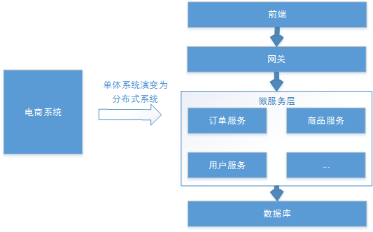
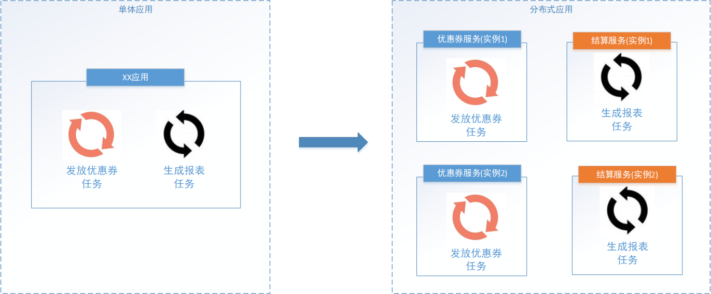
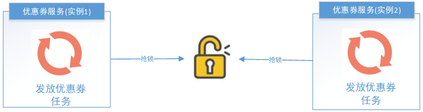

## 1. 任务调度概述

### 1.1. 场景简介

以下业务场景业务场景解决方案，都是任务调度

- 某电商系统需要在每天上午 10 点，下午 3 点，晚上 8 点发放一批优惠券。
- 某银行系统需要在信用卡到期还款日的前三天进行短信提醒。
- 某财务系统需要在每天凌晨 0:10 结算前一天的财务数据，统计汇总。
- 12306 会根据车次的不同，设置某几个时间点进行分批放票。
- 某网站为了实现天气实时展示，每隔 10 分钟就去天气服务器获取最新的实时天气信息。

<font color=red>**任务调度是指系统为了自动完成特定任务，在约定的特定时刻去执行任务的过程。有了任务调度即可解放更多的人力，而是由系统自动去执行任务。**</font>

### 1.2. 任务调度实现几种方式

#### 1.2.1. 多线程方式实现

可以开启一个线程，每sleep一段时间，就去检查是否已到预期执行时间。以下代码简单实现了任务调度的功能：

```java
public static void main(String[] args) {
    // 任务执行间隔时间
    final long timeInterval = 1000;
    Runnable runnable = new Runnable() {
        public void run() {
            while (true) {
                // TODO：something
                try {
                    Thread.sleep(timeInterval);
                } catch (InterruptedException e) {
                    e.printStackTrace();
                }
            }
        }
    };
    Thread thread = new Thread(runnable);
    thread.start();
}
```

#### 1.2.2. Timer 方式实现

JDK 也为提供了相关定时器的支持，如 `Timer`、`ScheduledExecutor`

Timer 的优点在于简单易用，每个 Timer 对应一个线程，因此可以同时启动多个 Timer 并行执行多个任务，同一个 Timer 中的任务是串行执行。

```java
public static void main(String[] args) {
    Timer timer = new Timer();
    timer.schedule(new TimerTask() {
        @Override
        public void run() {
            // TODO：something
        }
    }, 1000, 2000); // 1秒后开始调度，每2秒执行一次
}
```

#### 1.2.3. ScheduledExecutor 方式实现

Java 5 推出了基于线程池设计的 `ScheduledExecutor`，其设计思想是，每一个被调度的任务都会由线程池中一个线程去执行，因此任务是并发执行的，相互之间不会受到干扰。

```java
public static void main(String[] args) {
    ScheduledExecutorService service = Executors.newScheduledThreadPool(10);
    service.scheduleAtFixedRate(
            new Runnable() {
                @Override
                public void run() {
                    // TODO：something
                    System.out.println("todo something");
                }
            }, 1, 2, TimeUnit.SECONDS);
}
```

#### 1.2.4. 第三方 Quartz 框架方式实现

值得注意的是，`Timer` 和 `ScheduledExecutor` 都仅能提供基于开始时间与重复间隔的任务调度，不能胜任更加复杂的调度需求。比如，设置每月第一天凌晨1点执行任务、复杂调度任务的管理、任务间传递数据等等。此时可以选择使用第三方的任务调度框架

Quartz 是一个功能强大的任务调度框架，它可以满足更多更复杂的调度需求，Quartz 设计的核心类包括 Scheduler，Job 以及 Trigger。其中，Job 负责定义需要执行的任务，Trigger 负责设置调度策略，Scheduler 将二者组装在一起，并触发任务开始执行。Quartz 支持简单的按时间间隔调度、还支持按日历调度方式，通过设置 CronTrigger 表达式（包括：秒、分、时、日、月、周、年）进行任务调度。

```java
public static void main(String[] agrs) throws SchedulerException {
    // 创建一个Scheduler
    SchedulerFactory schedulerFactory = new StdSchedulerFactory();
    Scheduler scheduler = schedulerFactory.getScheduler();
    // 创建JobDetail
    JobBuilder jobDetailBuilder = JobBuilder.newJob(MyJob.class);
    jobDetailBuilder.withIdentity("jobName", "jobGroupName");
    JobDetail jobDetail = jobDetailBuilder.build();
    // 创建触发的CronTrigger 支持按日历调度
    CronTrigger trigger = TriggerBuilder.newTrigger()
            .withIdentity("triggerName", "triggerGroupName")
            .startNow()
            .withSchedule(CronScheduleBuilder.cronSchedule("0/2 * * * * ?"))
            .build();
    // 创建触发的SimpleTrigger 简单的间隔调度
    /*SimpleTrigger trigger = TriggerBuilder.newTrigger()
            .withIdentity("triggerName", "triggerGroupName")
            .startNow()
            .withSchedule(SimpleScheduleBuilder
                    .simpleSchedule()
                    .withIntervalInSeconds(2)
                    .repeatForever())
            .build();*/
    scheduler.scheduleJob(jobDetail, trigger);
    scheduler.start();
}

public class MyJob implements Job {
    @Override
    public void execute(JobExecutionContext jobExecutionContext) {
        System.out.println("todo something");
    }
}
```

## 2. cron 表达式(任务执行表达式)

### 2.1. 表达式语法格式

cron 表达式是一个字符串，用来设置定时规则，由七部分组成，每部分中间用空格隔开，具体格式如下：

```
秒 分钟 小时 日(?) 月 周(?) 年
```

> Notes: <font color=red>**注意：日与周不能同时指定值，必须有一个值是`?`号**</font>

每部分的含义如下表所示：

| 组成部分 |       含义        |         取值范围          | 是否必须 |           支持的特殊字符           |
| :-----: | :---------------: | :---------------------: | :-----: | -------------------------------- |
| 第一部分 |   Seconds (秒)    |          0-59           |   是    | `,`、`-`、`*`、`/`                |
| 第二部分 |    Minutes(分)    |          0-59           |   是    | `,`、`-`、`*`、`/`                |
| 第三部分 |     Hours(时)     |          0-23           |   是    | `,`、`-`、`*`、`/`                |
| 第四部分 | Day-of-Month(天)  |          1-31           |   是    | `,`、`-`、`*`、`?`、`/`、L、W、C   |
| 第五部分 |     Month(月)     |      0-11或JAN-DEC      |   是    | `,`、`-`、`*`、`/`                |
| 第六部分 | Day-of-Week(星期) | 1-7(1表示星期日)或SUN-SAT |   是    | `,`、`-`、`*`、`?`、`/`、L、C、`#` |
| 第七部分 |   Year(年) 可选   |        1970-2099        |   否    | `,`、`-`、`*`、`/`                |

> 表达式参数说明：
>
> 1. 年可以省略。其余都必须写上
> 2. `，`(逗号)，具体值时候执行。例如：`1,2,3` (秒)，表示第 2 秒第 3 秒第 4 秒执行
> 3. `-` 表示范围，满足范围执行。例如：`1-3` 代表的含义同上。
> 4. `*` 表示任意值。例如：`*` (秒) 表示每秒执行
> 5. `/` 按照指定的频率执行。例如：`0/5` 每 5 秒执行
> 6. 日与周的特有字符。例如：`L` 表示最后的天（周）

另外，cron 表达式还可以包含一些特殊符号来设置更加灵活的定时规则，如下表所示:

| 符号 |                                                                                 含义                                                                                  |
| :--: | -------------------------------------------------------------------------------------------------------------------------------------------------------------------- |
| `?`  | 表示不确定的值。当两个子表达式其中一个被指定了值以后，为了避免冲突，需要将另外一个的值设为“`?`”。例如：想在每月20日触发调度，不管20号是星期几，只能用如下写法：`0 0 0 20 * ?`，其中最后以为只能用“`?`” |
| `*`  | 代表所有可能的值                                                                                                                                                         |
| `,`  | 设置多个值，例如“`26,29,33`”表示在26分，29分和33分各自运行一次任务                                                                                                             |
| `-`  | 设置取值范围，例如“`5-20`”，表示从5分到20分钟每分钟运行一次任务                                                                                                                 |
| `/`  | 设置频率或间隔，如“`1/15`”表示从1分开始，每隔15分钟运行一次任务                                                                                                                 |
| `L`  | 用于每月，或每周，表示每月的最后一天，或每个月的最后星期几，例如“`6L`”表示"每月的最后一个星期五"                                                                                       |
| `W`  | 表示离给定日期最近的工作日，例如“`15W`”放在每月（day-of-month）上表示"离本月15日最近的工作日"                                                                                      |
| `#`  | 表示该月第几个周X。例如“`6#3`”表示该月第3个周五                                                                                                                              |

### 2.2. 常用示例

以下列举了一些cron表达式的用法例子，如下表所示：

|       cron表达式       |               含义                |
| :------------------: | --------------------------------- |
|   `*/5 * * * * ?`    | 每隔5秒运行一次任务                  |
|    `0 0 23 * * ?`    | 每天23点运行一次任务                 |
|    `0 0 1 1 * ?`     | 每月1号凌晨1点运行一次任务            |
|    `0 0 23 L * ?`    | 每月最后一天23点运行一次任务           |
| `0 26,29,33 * * * ?` | 在26分、29分、33分运行一次任务        |
| `0 0/30 9-17 * * ?`  | 朝九晚五工作时间内每半小时运行一次任务   |
|  `0 15 10 ? * 6#3`   | 每月的第三个星期五上午10:15运行一次任务 |

```
【0 0 12 * * ?】 每天12点触发 
【0 15 10 ? * *】 每天10点15分触发 
【0 15 10 * * ?】 每天10点15分触发 
【0 15 10 * * ?】 * 每天10点15分触发 
【0 15 10 * * ?】 2005 2005年每天10点15分触发 
【0 * 14 * * ?】 每天下午的 2点到2点59分每分触发 
【0 0/5 14 * * ?】 每天下午的 2点到2点59分(整点开始，每隔5分触发) 
【0 0/5 14,18 * * ?】 每天下午的 2点到2点59分(整点开始，每隔5分触发) 每天下午的 18点到18点59分(整点开始，每隔5分触发) 
【0 0-5 14 * * ?】 每天下午的 2点到2点05分每分触发 
【0 10,44 14 ? 3 WED】     3月分每周三下午的 2点10分和2点44分触发 （特殊情况，在一个时间设置里，执行两次或两次以上的情况） 
【0 59 2 ? * FRI】    每周5凌晨2点59分触发； 
【0 15 10 ? * MON-FRI】 从周一到周五每天上午的10点15分触发 
【0 15 10 15 * ?】 每月15号上午10点15分触发 
【0 15 10 L * ?】 每月最后一天的10点15分触发 
【0 15 10 ? * 6L】 每月最后一周的星期五的10点15分触发 
【0 15 10 ? * 6L】 2002-2005 从2002年到2005年每月最后一周的星期五的10点15分触发 
【0 15 10 ? * 6#3】 每月的第三周的星期五开始触发 
【0 0 12 1/5 * ?】 每月的第一个中午开始每隔5天触发一次 
【0 11 11 11 11 ?】 每年的11月11号 11点11分触发
```

### 2.3. cron 表达式在线工具

- [crontab guru](https://crontab.guru/)：标准 cron 在线生成工具

## 3. 分布式任务调度

### 3.1. 概述

当前软件的架构已经开始向分布式架构转变，将单体结构拆分为若干服务，服务之间通过网络交互来完成业务处理。如下图，电商系统为分布式架构，由订单服务、商品服务、用户服务等组成：



分布式系统具体如下基本特点：

1. 分布性：每个部分都可以独立部署，服务之间交互通过网络进行通信，比如：订单服务、商品服务。
2. 伸缩性：每个部分都可以集群方式部署，并可针对部分结点进行硬件及软件扩容，具有一定的伸缩能力。
3. 高可用：每个部分都可以集群部分，保证高可用。

通常任务调度的程序是集成在应用中的，比如：优惠卷服务中包括了定时发放优惠卷的的调度程序，结算服务中包括了定期生成报表的任务调度程序。在分布式架构下，一个服务往往会部署多个实例来运行相关的业务，如果在这种分布式系统环境下运行任务调度，称之为**分布式任务调度**。如下图：



#### 3.1.1. 分布式调度要实现的目标

不管是任务调度程序集成在应用程序中，还是单独构建的任务调度系统，如果采用分布式调度任务的方式就相当于将任务调度程序分布式构建，这样就可以具有分布式系统的特点，并且提高任务的调度处理能力：

1. **并行任务调度**

并行任务调度实现靠多线程，如果有大量任务需要调度，此时光靠多线程就会有瓶颈了，因为一台计算机CPU的处理能力是有限的。

如果将任务调度程序分布式部署，每个结点还可以部署为集群，这样就可以让多台计算机共同去完成任务调度，可以将任务分割为若干个分片，由不同的实例并行执行，来提高任务调度的处理效率。

2. **高可用**

若某一个实例宕机，不影响其他实例来执行任务。

3. **弹性扩容**

当集群中增加实例就可以提高并执行任务的处理效率。

4. **任务管理与监测**

对系统中存在的所有定时任务进行统一的管理及监测。让开发人员及运维人员能够时刻了解任务执行情况，从而做出快速的应急处理响应。

#### 3.1.2. 分布式任务调度面临的问题

当任务调度以集群方式部署，同一个任务调度可能会执行多次，例如：电商系统定期发放优惠券，就可能重复发放优惠券，对公司造成损失，信用卡还款提醒就会重复执行多次，给用户造成烦恼，所以需要控制相同的任务在多个运行实例上只执行一次。常见解决方案如下：

- 分布式锁，多个实例在任务执行前首先需要获取锁，如果获取失败那么就证明有其他服务已经在运行，如果获取成功那么证明没有服务在运行定时任务，那么就可以执行。



- ZooKeeper 选举，利用 ZooKeeper 对 Leader 实例执行定时任务，执行定时任务的时候判断自己是否是 Leader，如果不是则不执行，如果是则执行业务逻辑，这样也能达到目的。


### 3.2. 相关分布式任务调度产品

针对分布式任务调度的需求，市场上出现了很多的产品：

1. TBSchedule：淘宝推出的一款非常优秀的高性能分布式调度框架，目前被应用于阿里、京东、支付宝、国美等很多互联网企业的流程调度系统中。但是已经多年未更新，文档缺失严重，缺少维护。
2. XXL-Job：大众点评的分布式任务调度平台，是一个轻量级分布式任务调度平台, 其核心设计目标是开发迅速、学习简单、轻量级、易扩展。现已开放源代码并接入多家公司线上产品线，开箱即用。
3. Elastic-job：当当网借鉴TBSchedule并基于quartz 二次开发的弹性分布式任务调度系统，功能丰富强大，采用zookeeper实现分布式协调，具有任务高可用以及分片功能。
4. Saturn： 唯品会开源的一个分布式任务调度平台，基于Elastic-job，可以全域统一配置，统一监控，具有任务高可用以及分片功能。 

