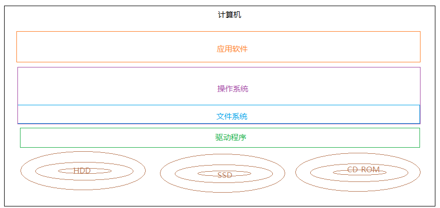
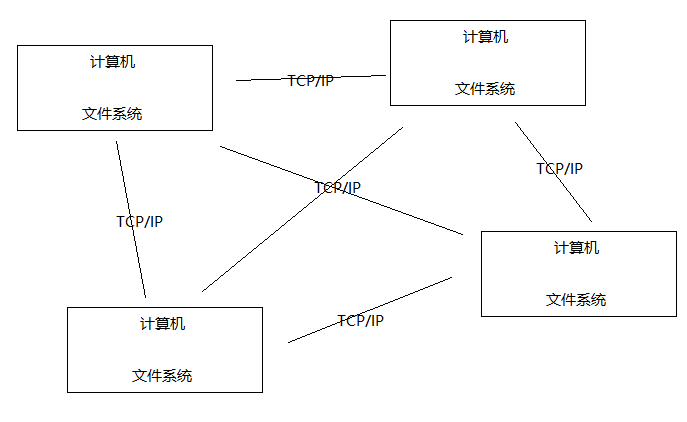
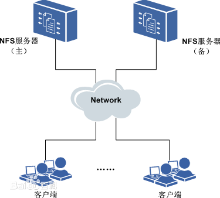
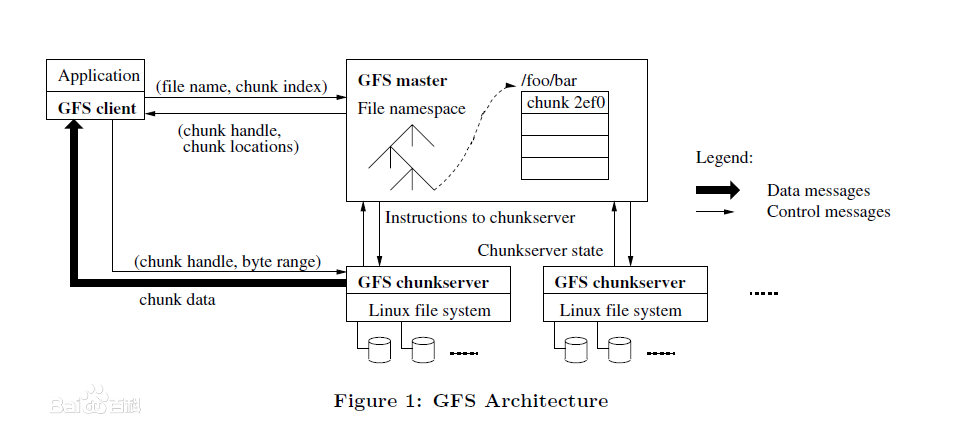
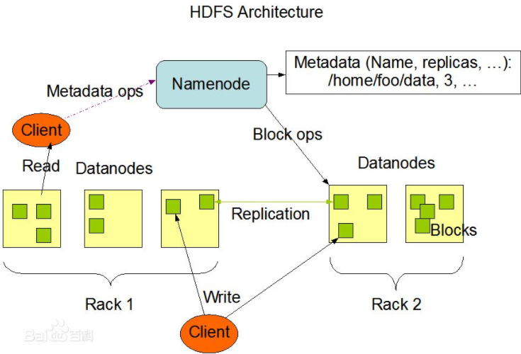
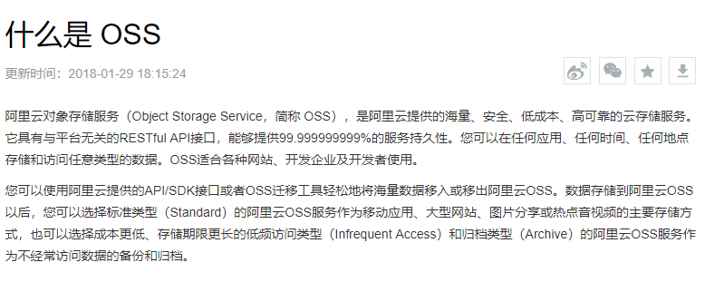

## 1. 分布式文件系统概述

### 1.1. 什么是文件系统

> 引用百度百科的描述：文件系统是操作系统用于明确存储设备（常见的是磁盘，也有基于NAND Flash的固态硬盘）或分区上的文件的方法和数据结构；即在存储设备上组织文件的方法。操作系统中负责管理和存储文件信息的软件机构称为文件管理系统，简称文件系统。文件系统由三部分组成：文件系统的接口，对对象操纵和管理的软件集合，对象及属性。从系统角度来看，文件系统是对文件存储设备的空间进行组织和分配，负责文件存储并对存入的文件进行保护和检索的系统。具体地说，它负责为用户建立文件，存入、读出、修改、转储文件，控制文件的存取，当用户不再使用时撤销文件等。

总结：文件系统是负责管理和存储文件的系统软件，它是操作系统和硬件驱动之间的桥梁，操作系统通过文件系统提供的接口去存取文件，用户通过操作系统访问磁盘上的文件。如下图：

常见的文件系统：FAT16/FAT32、NTFS、HFS、UFS、APFS、XFS、Ext4 等

*思考：如果没有文件系统我们该怎么管理自己的文件？*

### 1.2. 什么是分布式文件系统

> 引用百度百科的描述：分布式文件系统（Distributed File System）是指文件系统管理的物理存储资源不一定直接连接在本地节点上，而是通过计算机网络与节点相连。分布式文件系统的设计基于客户机/服务器模式。一个典型的网络可能包括多个供多用户访问的服务器。另外，对等特性允许一些系统扮演客户机和服务器的双重角色。例如，用户可以“发表”一个允许其他客户机访问的目录，一旦被访问，这个目录对客户机来说就像使用本地驱动器一样，下面是三个基本的分布式文件系统。

为什么会有分布文件系统呢？

分布式文件系统是面对互联网的需求而产生，互联网时代对海量数据如何存储？靠简单的增加硬盘的个数已经满足不了我们的要求，因为硬盘传输速度有限但是数据在急剧增长，另外我们还要要做好数据备份、数据安全等。

采用分布式文件系统可以将多个地点的文件系统通过网络连接起来，组成一个文件系统网络，结点之间通过网络进行通信，一台文件系统的存储和传输能力有限，我们让文件在多台计算机上存储，通过多台计算共同传输。如下图：

分布式文件系统的好处：

1. 一台计算机的文件系统处理能力扩充到多台计算机同时处理
2. 一台计算机挂了还有另外副本计算机提供数据
3. 每台计算机可以放在不同的地域，这样用户就可以就近访问，提高访问速度

### 1.3. 分布式文件系统与一般文件系统对比

分布式文件系统一般文件系统存储数据的方式数据分散的存储在多台服务器上集中存放所有数据，在一台服务器上特点分布式网络存储系统采用可扩展的系统结构，利用多台服务器分担负荷，利用位置服务器定位存储信息，不但提高了系统的可靠性、可用性和存取效率，还易于扩展，避免单点故障。传统的网络存储系统采用集中的服务器存放所有数据，到一定程度服务器会成为系统性能的瓶颈，也是可靠性和安全性的焦点，不能满足大规模存储应用的需要。

### 1.4. 技术应用场景

一个应该拥有大量优质的视频与图片，并且免费提供给用户去下载，文件太多如何高效存储？用户访问量大如何保证下载速度？可以使用分布式文件系统将解决这些问题

分布式文件系统解决了海量文件存储及传输访问的瓶颈问题，对海量视频的管理、对海量图片的管理等

## 2. 主流的分布式文件系统

常用的分布式文件系统有：GFS、TFS、HDFS、MooseFs、FastDfs、MogileFs、GridFs、MinIO、SeaweedFS、GlusterFS、Ceph、GlusterFS 等。

### 2.1. NFS（网络文件系统）

> 引用百度百科的描述：NFS（Network File System）即网络文件系统，是 FreeBSD 支持的文件系统中的一种，它允许网络中的计算机之间共享资源。在 NFS 的应用中，本地 NFS 的客户端应用可以透明地读写位于远端 NFS 服务器上的文件，就像访问本地文件一样。

1. 在客户端上映射 NFS 服务器的驱动器。
2. 客户端通过网络访问 NFS 服务器的硬盘完全透明。

### 2.2. GFS（Google 文件系统）

> 引用百度百科的描述：GFS是一个可扩展的分布式文件系统，用于大型的、分布式的、对大量数据进行访问的应用。它运行于廉价的普通硬件上，并提供容错功能。它可以给大量的用户提供总体性能较高的服务。

1. GFS采用主从结构，一个GFS集群由一个master和大量的chunkserver组成
2. master存储了数据文件的元数据，一个文件被分成了若干块存储在多个chunkserver中
3. 用户从master中获取数据元信息，从chunkserver存储数据

### 2.3. HDFS（Hadoop分布式文件系统）

> 引用百度百科的描述：Hadoop分布式文件系统(HDFS)被设计成适合运行在通用硬件(commodity hardware)上的分布式文件系统。它和现有的分布式文件系统有很多共同点。但同时，它和其他的分布式文件系统的区别也是很明显的。HDFS是一个高度容错性的系统，适合部署在廉价的机器上。HDFS能提供高吞吐量的数据访问，非常适合大规模数据集上的应用。HDFS放宽了一部分POSIX约束，来实现流式读取文件系统数据的目的。HDFS在最开始是作为Apache Nutch搜索引擎项目的基础架构而开发的。HDFS是Apache Hadoop Core项目的一部分。
>
> HDFS有着高容错性（fault-tolerant）的特点，并且设计用来部署在低廉的（low-cost）硬件上。而且它提供高吞吐量（high throughput）来访问应用程序的数据，适合那些有着超大数据集（large data set）的应用程序。HDFS放宽了（relax）POSIX的要求（requirements）这样可以实现流的形式访问（streaming access）文件系统中的数据。

1. HDFS采用主从结构，一个HDFS集群由一个名称结点和若干数据结点组成。名称结点存储数据的元信息，一个完整的数据文件分成若干块存储在数据结点。
2. 客户端从名称结点获取数据的元信息及数据分块的信息，得到信息客户端即可从数据块来存取数据

### 2.4. FastDFS

由淘宝的余庆先生所开发的一个开源分布式文件系统。它对文件进行管理，功能包括：文件存储、文件同步、文件访问（文件上传、文件下载）等，解决了大容量存储和负载均衡的问题。适合以文件为载体的在线服务，如相册网站、视频网站等等。FastDFS 为互联网量身定制，充分考虑了冗余备份、负载均衡、线性扩容等机制，并注重高可用、高性能等指标，使用 FastDFS 搭建一套高性能的文件服务器集群提供文件上传、下载等服务。但是 FastDFS 部署有点麻烦，且它的 SKD 是不全的。

### 2.5. 各类分布式文件系统比对

#### 2.5.1. 按功能分类

- 适合做通用文件系统的有：Ceph、MooseFS、MinIO。
- 适合做中小文件存储的文件系统有：Ceph、FastDFS、MinIO、SeaweedFS。
- 适合做大文件存储的文件系统有：HDFS、MinIO、Ceph、GridFS。
- 轻量级文件系统有：FastDFS、MinIO、SeaweedFS。
- 简单易用，用户活跃的文件系统有：HDFS、FastDFS、MinIO。

#### 2.5.2. 按使用体验

- MinIO：学习成本低，部署容易，适合存储大容量非结构化的数据，且有详细的中文文档。
- FastDFS：功能精简，支持在线扩容、冗余备份，部分支持跨集群同步，不存在单点故障，性能较好。但是不支持 FUSE 挂载和 POSIX 访问接口，且学习成本相对 MinIO 较高，且部署也相对比较复杂点。
- HDFS：适合批量数据处理.可以部署在廉价的机器上。可以部署在廉价的机器上，但是不适合大量小文件，通过牺牲响应延时来换取高的吞吐量。
- GridFS：能够简化技术栈，如果已经使用了 MongoDB，那么使用 GridFS，就不需要其它独立的存储工具了(但是我们当前没引入 MongoDB)，不过性能不如直接访问文件系统快，而且无法修改文档。如果要修改 GridFS 里面的文档，只能是先删除再添加(对我们当前业务没有影响)

## 3. 分布式文件服务提供商

1. 阿里的OSS

2. 七牛云存储
3. 百度云存储
