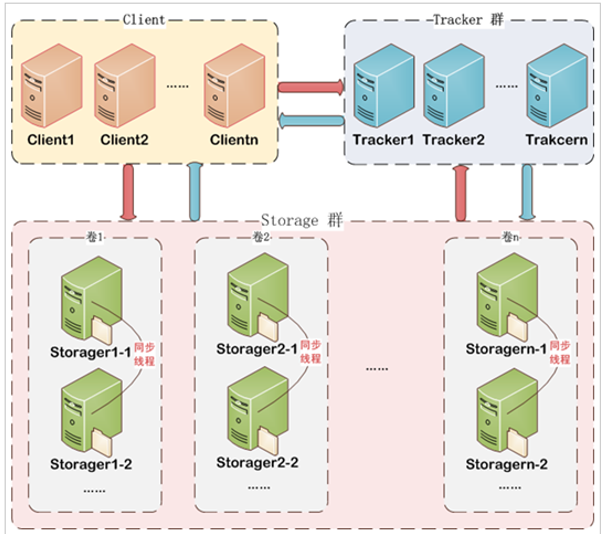
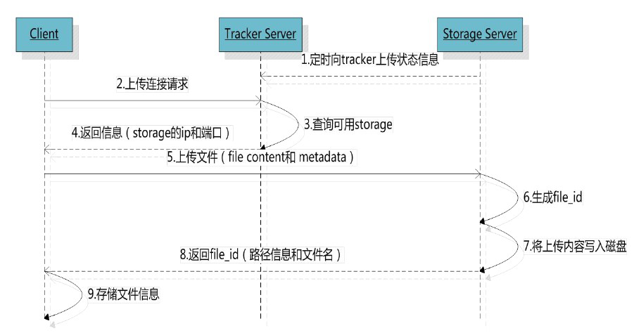
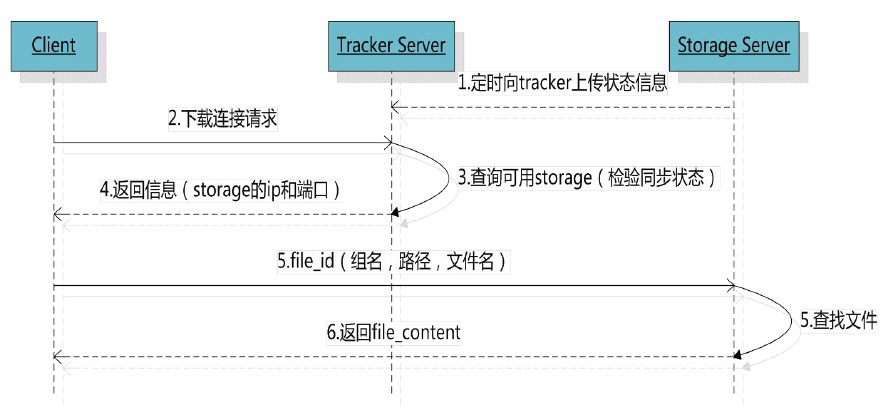
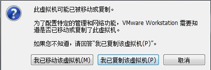
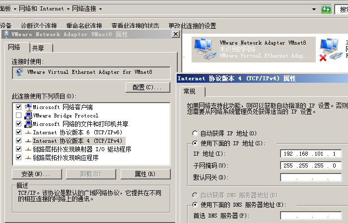
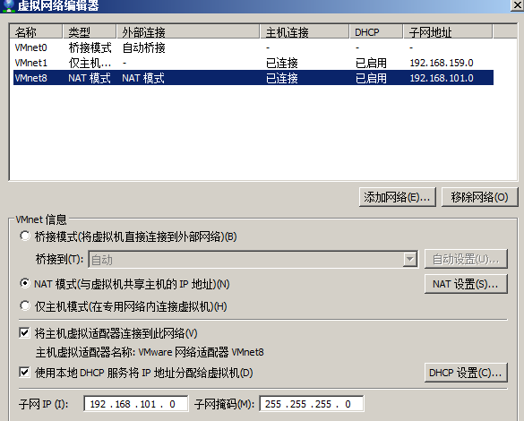
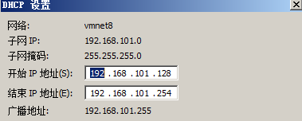
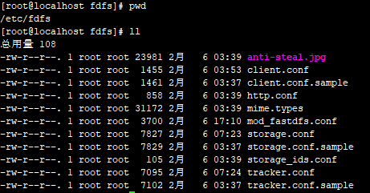
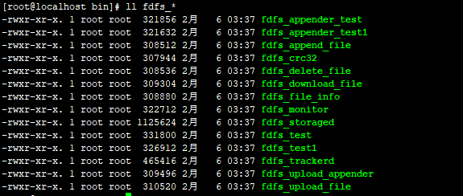

## 1. FastDFS 分布式文件系统概述

### 1.1. FastDFS 是什么

FastDFS 是用 C 语言编写的一款开源的分布式文件系统，它是由淘宝资深架构师余庆编写并开源。FastDFS 专为互联网量身定制，充分考虑了冗余备份、负载均衡、线性扩容等机制，并注重高可用、高性能等指标，使用 FastDFS 很容易搭建一套高性能的文件服务器集群提供文件上传、下载等服务。

为什么要使用 fastDFS 呢？

上边介绍的 NFS、GFS 都是通用的分布式文件系统，通用的分布式文件系统的优点的是开发体验好，但是系统复杂性高、性能一般，而专用的分布式文件系统虽然开发体验性差，但是系统复杂性低并且性能高。fastDFS 非常适合存储图片等那些小文件，fastDFS 不对文件进行分块，所以它就没有分块合并的开销，fastDFS 网络通信采用 socket，通信速度很快。

### 1.2. fastDFS 架构

FastDFS 架构包括 Tracker server 和 Storage server。客户端请求 Tracker server 进行文件上传、下载，通过 Tracker server 调度最终由 Storage server 完成文件上传和下载。



1. **Tracker**
    - Tracker Server作用是负载均衡和调度，通过Tracker server在文件上传时可以根据一些策略找到Storage server提供文件上传服务。可以将tracker称为追踪服务器或调度服务器
    - FastDFS集群中的Tracker server可以有多台，Tracker server之间是相互平等关系同时提供服务，Tracker server不存在单点故障。客户端请求Tracker server采用轮询方式，如果请求的tracker无法提供服务则换另一个tracker
2. **Storage**
    - Storage Server作用是文件存储，客户端上传的文件最终存储在Storage服务器上，Storage server没有实现自己的文件系统而是使用操作系统的文件系统来管理文件。可以将storage称为存储服务器
    - Storage集群采用了分组存储方式。storage集群由一个或多个组构成，集群存储总容量为集群中所有组的存储容量之和。一个组由一台或多台存储服务器组成，组内的Storage server之间是平等关系，不同组的Storage server之间不会相互通信，同组内的Storage server之间会相互连接进行文件同步，从而保证同组内每个storage上的文件完全一致的。一个组的存储容量为该组内的存储服务器容量最小的那个，由此可见组内存储服务器的软硬件配置最好是一致的
    - 采用分组存储方式的好处是灵活、可控性较强。比如上传文件时，可以由客户端直接指定上传到的组也可以由tracker进行调度选择。一个分组的存储服务器访问压力较大时，可以在该组增加存储服务器来扩充服务能力（纵向扩容）。当系统容量不足时，可以增加组来扩充存储容量（横向扩容）
3. **Storage状态收集**
    - Storage server会连接集群中所有的Tracker server，定时向他们报告自己的状态，包括磁盘剩余空间、文件同步状况、文件上传下载次数等统计信息

### 1.3. 文件上传流程

- 文件上传流程如下图（时序图）



- 客户端上传文件后存储服务器将文件ID返回给客户端，此文件ID用于以后访问该文件的索引信息。文件索引信息包括：组名，虚拟磁盘路径，数据两级目录，文件名。
    - 例：`group1/M00/02/44/wKgDrE34E8wAAAAAAAAGkEIYJK42378.sh`
- **组名**：文件上传后所在的storage组名称，在文件上传成功后有storage服务器返回，需要客户端自行保存。
- **虚拟磁盘路径**：storage配置的虚拟路径，与磁盘选项`store_path*`对应。如果配置了store_path0则是M00，如果配置了store_path1则是M01，以此类推。
- **数据两级目录**：storage服务器在每个虚拟磁盘路径下创建的两级目录，用于存储数据文件。两级目录的范围都是 00~FF
- **文件名**：与文件上传时不同。是由存储服务器根据特定信息生成，文件名包含：源存储服务器IP地址、文件创建时间戳、文件大小、随机数和文件拓展名等信息。

### 1.4. 文件下载流程

- 文件下载流程图



- tracker根据请求的文件路径即文件ID 来快速定义文件。
- 比如请求文件：`group1/M00/02/44/wKgDrE34E8wAAAAAAAAGkEIYJK42378.sh`
    1. 通过组名tracker能够很快的定位到客户端需要访问的存储服务器组是group1，并选择合适的存储服务器提供客户端访问。
    2. 存储服务器根据“文件存储虚拟磁盘路径”和“数据文件两级目录”可以很快定位到文件所在目录，并根据文件名找到客户端需要访问的文件

## 2. FastDFS 入门

### 2.1. FastDFS 安装与配置

对 FastDFS 的安装过程参考资料：\07-编程工具资料\03-Java相关框架+源代码\FastDFS【分布式文件系统】\分布式文件系统研究.zip。资料中提供已经安装好的虚拟镜像，也有linux系统下安装fastDFS的文档

#### 2.1.1. 导入资料中虚拟机及相关配置

1. 使用Vmware打开虚拟机配置文件“CentOS 7 64 位.vmx”，提示如下图



2. 选择“我已复制该虚拟机”
3. 启动虚拟机之前启动VMware的服务


4. 修改网卡的IP地址为101网段



5. 修改虚拟机网络配置，修改 VMnet8 的子网 IP 为 101.0



DHCP配置：



6. 启动虚拟机。用户名：root/密码：centos
7. 导入的虚拟机已经安装了fastDFS，直接启动fastDFS即可使用

#### 2.1.2. fastDFS 安装

tracker和storage使用相同的安装包，fastDFS的下载地址在：https://github.com/happyfish100/FastDFS

学成项目day08资料中有安装包： FastDFS_v5.05.tar.gz。FastDFS是C语言开发，建议在linux上运行，本项目使用CentOS7作为安装环境

安装细节请参考 “\07-编程工具资料\03-Java相关框架+源代码\FastDFS【分布式文件系统】\分布式文件系统研究.zip 的 FastDFS安装教程.pdf”。

#### 2.1.3. fastDFS 配置文件介绍

- fastDFS的配置文件所在目录：`/etc/fdfs`
- 主要的配置文件：
    - tracker配置文件：`/etc/fdfs/tracker.conf`
    - storage配置文件：`/etc/fdfs/storage.conf`



#### 2.1.4. Tracker 配置

- tracker.conf 配置内容如下
    - 端口：`port=22122`
    - 存储策略：`store_lookup=?`
        - 取值范围：0（轮询向storage存储文件）；1（指定具体的group）；2负载均衡，选择空闲的storage存储
    - 指定具体的group：`store_group=?`
        - 如果store_lookup设置为“1”，则这里必须指定一个具体的group
    - tracker 基础目录：`base_path=/home/fastdfs`，tracker在运行时会向此目录存储storage的管理数据

#### 2.1.5. storage 配置

- storage.conf配置内容如下
    - 组名：`group_name=group1`
    - 端口：`port=23000`
    - 向 tracker心跳间隔（秒）：`heart_beat_interval=30`
    - storage基础目录：`base_path=/home/fastdfs`
    - 磁盘存储目录，可定义多个store_path：
        - `store_path0=/home/fastdfs/fdfs_storage` 此目录下存储上传的文件，在/home/fastdfs/fdfs_storage/data下
        - `store_path1=...`
        - `store_path[N]=...`
    - 上报tracker的地址：`tracker_server=192.168.101.64:22122`。如果有多个tracker则配置多个tracker，比如：

    ```shell
    tracker_server=192.168.101.64:22122
    tracker_server=192.168.101.65:22122
    ....
    ```

#### 2.1.6. 启动停止

fastDFS启动/停止脚本目录



**fdfs_trackerd**：tracker脚本，通过此脚本对 tracker 进行启动和停止

```shell
/usr/bin/fdfs_trackerd /etc/fdfs/tracker.conf restart
```

**fdfs_storaged**：storage脚本，通过此脚本对 storage 进行启动和停止

```shell
/usr/bin/fdfs_storaged /etc/fdfs/storage.conf restart
```

### 2.2. 文件上传下载测试
#### 2.2.1. 环境搭建

使用javaApi测试文件的上传，java版本的fastdfs-client地址在：https://github.com/happyfish100/fastdfs-client-java，参考此工程编写测试用例。

1. 创建maven工程(jar类型)，配置pom.xml文件相关依赖

```xml
<?xml version="1.0" encoding="UTF-8"?>
<project xmlns="http://maven.apache.org/POM/4.0.0"
         xmlns:xsi="http://www.w3.org/2001/XMLSchema-instance"
         xsi:schemaLocation="http://maven.apache.org/POM/4.0.0
         http://maven.apache.org/xsd/maven-4.0.0.xsd">
    <!-- 如果是单独测试，直接加spring boot parent依赖 -->
    <!--<parent>
        <groupId>org.springframework.boot</groupId>
        <artifactId>spring-boot-starter-parent</artifactId>
        <version>2.0.1.RELEASE</version>
    </parent>-->
    <parent>
        <artifactId>xc-framework-parent</artifactId>
        <groupId>com.xuecheng</groupId>
        <version>1.0-SNAPSHOT</version>
        <relativePath>../xc-framework-parent/pom.xml</relativePath>
    </parent>
    <modelVersion>4.0.0</modelVersion>
    <artifactId>test-fastdfs</artifactId>
    <name>test-fastdfs</name>

    <dependencies>
        <dependency>
            <groupId>org.springframework.boot</groupId>
            <artifactId>spring-boot-starter-web</artifactId>
        </dependency>
        <!-- https://mvnrepository.com/artifact/net.oschina.zcx7878/fastdfs-client-java -->
        <dependency>
            <groupId>net.oschina.zcx7878</groupId>
            <artifactId>fastdfs-client-java</artifactId>
            <version>1.27.0.0</version>
        </dependency>
        <dependency>
            <groupId>org.springframework.boot</groupId>
            <artifactId>spring-boot-starter-test</artifactId>
            <scope>test</scope>
        </dependency>
        <dependency>
            <groupId>org.apache.commons</groupId>
            <artifactId>commons-io</artifactId>
            <version>1.3.2</version>
        </dependency>
    </dependencies>
</project>
```

2. 创建配置文件，在classpath:config下创建fastdfs-client.properties文件

```properties
# http连接超时时间
fastdfs.connect_timeout_in_seconds=5
# tracker与storage网络通信超时时间
fastdfs.network_timeout_in_seconds=30
# 字符编码
fastdfs.charset=UTF-8
# tracker服务器地址，多个地址中间用英文逗号分隔
fastdfs.tracker_servers=192.168.12.132:22122
```

3. 创建入口类

```java
@SpringBootApplication
public class TestFastDFSApplication {
    public static void main(String[] args) {
        SpringApplication.run(TestFastDFSApplication.class, args);
    }
}
```

#### 2.2.2. 文件上传

```java
package com.xuecheng.test.fastdfs;

import org.csource.fastdfs.ClientGlobal;
import org.csource.fastdfs.StorageClient1;
import org.csource.fastdfs.StorageServer;
import org.csource.fastdfs.TrackerClient;
import org.csource.fastdfs.TrackerServer;
import org.junit.Test;
import org.junit.runner.RunWith;
import org.springframework.boot.test.context.SpringBootTest;
import org.springframework.test.context.junit4.SpringRunner;

/**
 * FastDFS 测试类
 */
@SpringBootTest
@RunWith(SpringRunner.class)
public class TestFastDFS {
    /**
     * FastDFS文件上传测试
     */
    @Test
    public void testUpload() {
        try {
            // 1. 加载fastdfs-client.properties配置文件
            ClientGlobal.initByProperties("config/fastdfs-client.properties");
            System.out.println(String.format("network_timeout = %d ms \n charset= %s", ClientGlobal.g_network_timeout, ClientGlobal.g_charset));

            // 2. 定义TrackerClient，用于请求TrackerServer
            TrackerClient trackerClient = new TrackerClient();
            // 3. 连接tracker
            TrackerServer trackerServer = trackerClient.getConnection();
            if (trackerServer == null) {
                System.out.println("trackerClient getConnection return null");
                return;
            }

            // 4. 获取Stroage
            StorageServer storeStorage = trackerClient.getStoreStorage(trackerServer);
            // 5. 创建stroageClient，一个storage存储客户端
            StorageClient1 storageClient1 = new StorageClient1(trackerServer, storeStorage);
            // 6. 向stroage服务器上传文件，指定本地文件的路径
            String filePath = "E:\\00-Downloads\\2019080400001.jpeg";
            // 上传成功后拿到文件Id
            String fileId = storageClient1.upload_file1(filePath, "jpeg", null);

            System.out.println(String.format("上传成功后返回的文件ID：%s", fileId));
            // 输出结果：group1/M00/00/00/wKgMhF1GLFWADYpFAAC8U7Yhv9Q90.jpeg
        } catch (Exception e) {
            e.printStackTrace();
        }
    }
}
```

#### 2.2.3. 文件查询

```java
/**
 * FastDFS查询文件测试
 */
@Test
public void testQueryFile() throws IOException, MyException {
    // 1. 加载fastdfs-client.properties配置文件
    ClientGlobal.initByProperties("config/fastdfs-client.properties");

    // 2. 定义TrackerClient，用于请求TrackerServer
    TrackerClient trackerClient = new TrackerClient();
    // 3. 连接tracker
    TrackerServer trackerServer = trackerClient.getConnection();
    if (trackerServer == null) {
        System.out.println("trackerClient getConnection return null");
        return;
    }

    // 4. 创建stroageClient
    StorageServer storageServer = null;
    StorageClient storageClient = new StorageClient(trackerServer, storageServer);

    // 5. 根据fileId查询文件
    FileInfo fileInfo = storageClient.query_file_info("group1", "M00/00/00/wKgMhF1GLFWADYpFAAC8U7Yhv9Q90.jpeg");
    System.out.println(fileInfo);
    // 输出结果：source_ip_addr = 192.168.12.132, file_size = 48211, create_timestamp = 2019-08-04 08:52:37, crc32 = -1239302188
}
```

#### 2.2.4. 文件下载

```java
/**
 * FastDFS文件下载测试
 */
@Test
public void testDownload() {
    FileOutputStream fileOutputStream = null;
    try {
        // 1. 加载fastdfs-client.properties配置文件
        ClientGlobal.initByProperties("config/fastdfs-client.properties");
        System.out.println(String.format("network_timeout = %d ms \n charset= %s", ClientGlobal.g_network_timeout, ClientGlobal.g_charset));

        // 2. 定义TrackerClient，用于请求TrackerServer
        TrackerClient trackerClient = new TrackerClient();
        // 3. 连接tracker
        TrackerServer trackerServer = trackerClient.getConnection();
        if (trackerServer == null) {
            System.out.println("trackerClient getConnection return null");
            return;
        }

        // 4. 获取Stroage
        StorageServer storeStorage = trackerClient.getStoreStorage(trackerServer);
        // 5. 创建stroageClient，一个storage存储客户端
        StorageClient1 storageClient1 = new StorageClient1(trackerServer, storeStorage);
        // 6. 根据fileId，向stroage服务器下载文件
        String fileId = "group1/M00/00/00/wKgMhF1GLFWADYpFAAC8U7Yhv9Q90.jpeg";
        // 查询文件的字节数组
        byte[] fileBytes = storageClient1.download_file1(fileId);


        // 使用输出流保存文件
        String fileFullPath = String.format("E:\\00-Downloads\\moon-%s.jpeg", UUID.randomUUID().toString());
        fileOutputStream = new FileOutputStream(new File(fileFullPath));
        fileOutputStream.write(fileBytes);
    } catch (Exception e) {
        e.printStackTrace();
    } finally {
        if (fileOutputStream != null) {
            try {
                fileOutputStream.close();
            } catch (IOException e) {
                e.printStackTrace();
            }
        }
    }
}
```

### 2.3. 搭建图片虚拟主机(!此部分按学成项目的资料暂未实现，但项目2的资料可以实现)

#### 2.3.1. 在 storage 上安装 Nginx

在 storage server 上安装 nginx 的目的是对外通过 http 访问 storage server 上的文 件。使用 nginx 的模块 FastDFS-nginx-module 的作用是通过 http 方式访问 storage 中 的文件，当 storage 本机没有要找的文件时向源 storage 主机代理请求文件。

在 storage 上安装 nginx（安装FastDFS-nginx-module模块）。具体操作参考：\07-编程工具资料\03-Java相关框架+源代码\FastDFS【分布式文件系统】\分布式文件系统研究\fastDFS安装\FastDFS安装教程.pdf

安装完成启动 storage 上的 nginx

## 3. 总结

1. 分布式文件系统的概念及应用场景
    - 分布式文件系统是通过网络将单机上的文件系统组成一个网络文件系统
    - 分布式文件系统主要应用在大型互联网项目中，实现图片存储、音视频存储等服务
    - 分布式文件系统的优点：可以快速扩容存储，提高文件访问速度
2. fastDFS的工作原理
    - fastDFS由tracker和storage组成，它们都可以部署集群
    - tracker负责调度，storage负责存储
3. fastDFS存取文件方法
    - 客户端与fastDFS采用socket协议通信，可以采用官方提供的java版本的fastDSF-client快速开发
4. 掌握搭建一个fastDSF文件服务器
