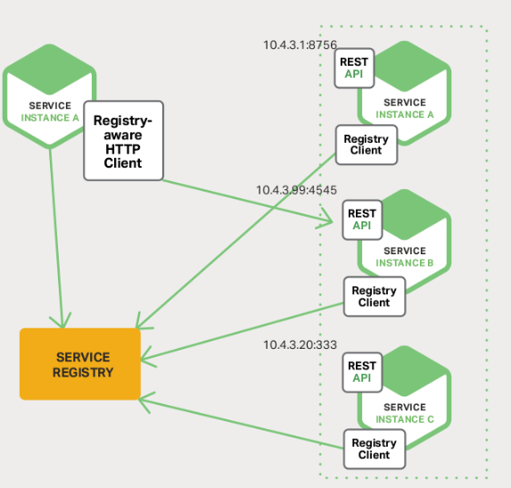
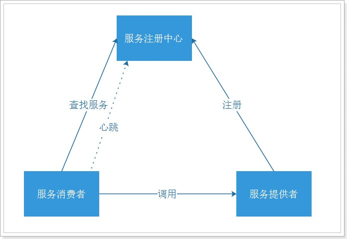

## 1. 服务的注册与发现概念

- **服务注册**：服务实例将自身服务信息注册到注册中心。这部分服务信息包括服务所在主机IP和提供服务的Port，以及暴露服务自身状态以及访问协议等信息。
- **服务发现**：服务实例请求注册中心获取所依赖服务信息。服务实例通过注册中心，获取到注册到其中的服务实例的信息（如服务名、IP地址等），通过这些信息去请求它们提供的服务
- **服务剔除**：服务注册中心会以心跳的方式去监测服务注册清单中的服务是否可用，如有服务不可用，服务注册中心将出问题的服务自动剔除到可用列表之外，使其不会被调用到。

一个服务既是服务提供者，也是服务消费者。服务消费者一般使用HTTP协议或者消费。

Spring cloud 采用 Eureka 来注册服务和发现服务。也可以使用 Zookeeper、Consul 等服务集中化管理框架

## 2. 注册中心的主要作用

服务注册中心（下称注册中心）是微服务架构非常重要的一个组件，在微服务架构里主要起到了协调者的一个作用。注册中心一般包含如下几个功能：

服务发现：

- 服务注册/反注册：保存服务提供者和服务调用者的信息
- 服务订阅/取消订阅：服务调用者订阅服务提供者的信息，注册中心会向订阅者推送提供者的信息（通常都是实时推送）
- 服务路由（可选）：具有筛选整合服务提供者的能力。

服务配置：

- 配置订阅：服务提供者和服务调用者订阅微服务相关的配置
- 配置下发：主动将配置推送给服务提供者和服务调用者

服务健康检测：

- 检测服务提供者的健康情况。如果发现异常，执行服务剔除

## 3. 微服务的注册与发现流程图

由上图可以看出：

1. 服务提供者将服务注册到注册中心
2. 服务消费者通过注册中心查找服务
3. 查找到服务后进行调用（这里就是无需硬编码url的解决方案）
4. 服务的消费者与服务注册中心保持心跳连接，一旦服务提供者的地址发生变更时，注册中心会通知服务消费者

## 4. 常用的注册中心

### 4.1. Zookeeper

**Zookeeper**：它是一个分布式服务框架，是 Apache Hadoop 的一个子项目，它主要是用来解决分布式应用中经常遇到的一些数据管理问题，如：统一命名服务、状态同步服务、集群管理、分布式应用配置项的管理等。简单来说**zookeeper=文件系统+监听通知机制**。

> 更多内容详见[《Zookeeper 基础》笔记](/分布式微服务/Zookeeper/Zookeeper-基础)

### 4.2. Eureka

**Eureka**：是使用 Java 语言开发的，基于 Restful Api 开发的服务注册与发现组件，Springcloud Netflix 中的重要组件。*但目前现在已经闭源*

> 更多内容详见[《Spring Cloud Netflix Eureka 服务注册和发现》笔记](/分布式微服务/SpringCloud/Spring-Cloud-Netflix-Eureka)

### 4.3. Consul

**Consul**：是由HashiCorp基于Go语言开发的支持多数据中心分布式高可用的服务发布和注册服务软件，其中包括：服务注册/发现、健康检查、Key/Value 存储、多数据中心和采用Raft算法保证分布式服务的一致性等特性。Consul 本身只是一个二进制的可执行文件，所以安装和部署都非常简单，只需要从官网下载后，在执行对应的启动脚本即可。

> 更多内容详见[《Spring Cloud Consul 注册中心》笔记](/分布式微服务/SpringCloud/Spring-Cloud-Consul)

### 4.4. Nacos

**Nacos**：是 Spring Cloud Alibaba 组件之一，是一个更易于构建云原生应用的动态服务发现、配置管理和服务管理平台。简单来说**Nacos 就是注册中心 + 配置中心的组合**，提供简单易用的特性集，解决微服务开发必会涉及到的服务注册与发现，服务配置，服务管理等问题。

> 更多内容详见[《Spring Cloud Alibaba Nacos 服务注册与配置管理》笔记](/分布式微服务/SpringCloud/Spring-Cloud-Alibaba-Nacos)的『Spring Cloud Alibaba Nacos Discovery』章节

## 5. 各类注册中心产品对比

### 5.1. 总结

选择什么类型的服务注册与发现组件可以根据自身项目要求决定。整体区别如下：

|   组件名   | 语言  | CAP | 一致性算法 | 服务健康检查 | 对外暴露接口 |
| --------- | ---- | --- | --------- | ---------- | ---------- |
| Eureka    | Java | AP  | 无        | 可配支持     | HTTP       |
| Consul    | go   | CP  | Raft      | 支持        | HTTP/DNS   |
| Zookeeper | Java | CP  | Paxos     | 支持        | 客户端      |
| Nacos     | Java | AP  | Raft      | 支持        | HTTP       |

### 5.2. Eureka 和 Zookeeper 区别 

分布式中的 CAP 原理：

- A：高可用
- C：一致性
- P：分区容错性

Zookeeper 保证了 CP；Eureka 保证了 AP。

- **Zookeeper 保证了一致性**，当向注册中心查询服务列表时，可以容忍注册中心返回的是几分钟以前的信息，但不能容忍直接 down 掉不可用。也就是说，服务注册功能对高可用性要求比较高，但 zk 会出现这样一种情况，当 master 节点因为网络故障与其他节点失去联系时，剩余节点会重新选 leader。问题在于，选取 leader 时间过长，30 ~ 120s，且选取期间 zk 集群都不可用，这样就会导致选取期间注册服务瘫痪。在云部署的环境下，因网络问题使得 zk 集群失去 master 节点是较大概率会发生的事，虽然服务能够恢复，但是漫长的选取时间导致的注册长期不可用是不能容忍的。
- **Eureka 保证了可用性**，Eureka 各个节点是平等的，几个节点挂掉不会影响正常节点的工作，剩余的节点仍然可以提供注册和查询服务。而 Eureka 的客户端向某个 Eureka 注册或发现时发生连接失败，则会自动切换到其他节点，只要有一台 Eureka 还在，就能保证注册服务可用，只是查到的信息可能不是最新的。除此之外，Eureka 还有自我保护机制，如果在 15 分钟内超过 85% 的节点没有正常的心跳，那么 Eureka 就认为客户端与注册中心发生了网络故障，此时会出现以下几种情况：
    1. Eureka 不在从注册列表中移除因为长时间没有收到心跳而应该过期的服务。
    2. Eureka 仍然能够接受新服务的注册和查询请求，但是不会被同步到其他节点上（即保证当前节点仍然可用）。
    3. 当网络稳定时，当前实例新的注册信息会被同步到其他节点。（最终一致性）

因此，Eureka 可以很好地应对因网络故障导致部分节点失去联系的情况，而不会像 Zookeeper 那样使整个微服务瘫痪。

### 5.3. Nacos 和 Eureka 的区别

- **数据存储方式不同**：Eureka 使用基于内存的数据存储方式；而 Nacos 使用可扩展的存储方式，可以支持多种数据源，例如 MySQL、MongoDB 等。
- **功能支持不同**：Nacos 提供了更加丰富的功能支持，例如支持配置管理、服务管理、动态路由、流量管理等；而 Eureka 主要支持服务注册和发现。
- **服务治理能力不同**：Nacos 具有更强的服务治理能力，例如支持灰度发布、流量路由等；而 Eureka 的服务治理能力相对较弱。
