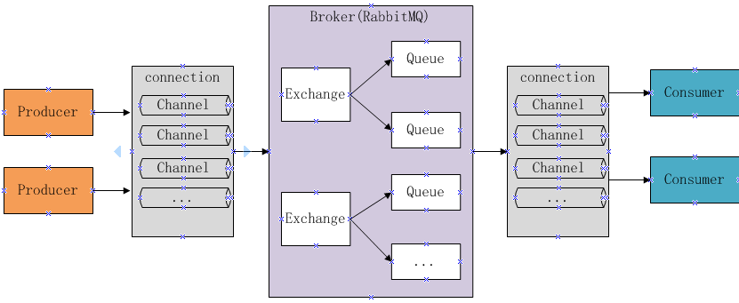
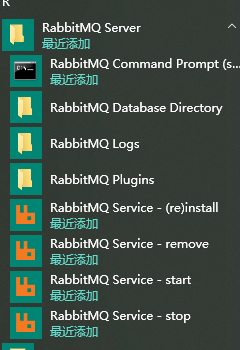
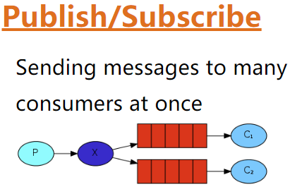
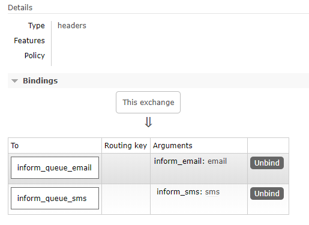
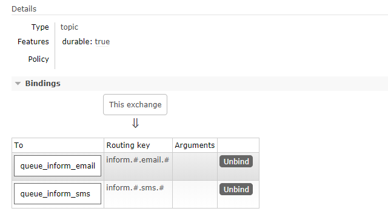

## 1. RabbitMQ 简介

> RabbitMQ 官方地址：http://www.rabbitmq.com/

MQ 全称为 Message Queue，即消息队列， RabbitMQ 是由 erlang 语言开发，基于 AMQP（Advanced Message Queue 高级消息队列协议）协议实现的消息队列，它是一种应用程序之间的通信方法，消息队列在分布式系统开发中应用非常广泛。

市场上还有其他的消息队列框架，如：ActiveMQ，ZeroMQ，Kafka，MetaMQ，RocketMQ、Redis。为什么使用 RabbitMQ 呢？

1. 使得简单，功能强大。
2. 基于 AMQP 协议。
3. 社区活跃，文档完善。
4. 高并发性能好，这主要得益于 Erlang 语言。
5. Spring Boot 默认已集成 RabbitMQ

### 1.1. 基础概念

#### 1.1.1. AMQP

AMQP 是一套公开的消息队列协议，最早在 2003 年被提出，它旨在从协议层定义消息通信数据的标准格式，为的就是解决 MQ 市场上协议不统一的问题。RabbitMQ 就是遵循 AMQP 标准协议开发的 MQ 服务。

官网：http://www.amqp.org/

#### 1.1.2. JMS

JMS 是 java 提供的一套消息服务 API 标准，其目的是为所有的 java 应用程序提供统一的消息通信的标准，类似 java 的 jdbc，只要遵循 jms 标准的应用程序之间都可以进行消息通信。它和 AMQP 有以下区别：

- jms 是 java 语言专属的消息服务标准，它是在 api 层定义标准，并且只能用于 java 应用。
- AMQP 是在协议层定义的标准，是跨语言的。

### 1.2. 消息队列的应用场景

总结一下，主要三点原因：**异步、解耦、削峰**。

1. **异步**。将不需要同步处理的并且耗时长的操作写入消息队列中，由消息队列通知消息接收方以异步的方式处理，提高了应用程序的响应时间。
2. **解耦**。MQ相当于一个中介，生产方通过MQ与消费方交互，它将应用程序进行解耦合。
> 比如，用户下单后，订单系统需要通知库存系统，假如库存系统无法访问，则订单减库存将失败，从而导致订单操作失败。订单系统与库存系统耦合，这个时候如果使用消息队列，可以返回给用户成功，先把消息持久化，等库存系统恢复后，就可以正常消费减去库存了。
3. **削峰**。实际生产中，可能会出现某个时间点流量高峰期，比如秒杀活动等，导致流量暴增。如果服务器不采取任何措施，可能就是会因为请求过多导致应用服务器挂掉。此时可以加上消息队列，服务器接收到用户的请求后，首先写入消息队列，如果消息队列长度超过最大数量，则直接抛弃用户请求或跳转到错误页面。然后消费端慢慢的按照数据库能处理的并发量，从消息队列中慢慢拉取消息并处理。

### 1.3. 使用消息队列的缺点

- **系统可用性降低**。引入消息队列之后，如果消息队列挂了，可能会影响到业务系统的可用性。
- **系统复杂性增加**。加入了消息队列，要多考虑很多方面的问题，比如：一致性问题、如何保证消息不被重复消费、如何保证消息可靠性传输等。

### 1.4. RabbitMQ 的基本结构




组成部分说明如下

- Message：由消息头和消息体组成。消息体是不透明的，而消息头则由一系列的可选属性组成，这些属性包括 `routing-key`、`priority`、`delivery-mode`（是否持久性存储）等。
- Broker：消息队列服务进程，此进程包括两个部分：Exchange 和 Queue。
- Exchange：消息队列交换机，接收消息并按一定的规则将消息路由转发到一个或多个队列(Queue)，对消息进行过滤。`default exchange` 是默认的直连交换机，名字为空字符串，每个新建队列都会自动绑定到默认交换机上，绑定的路由键名称与队列名称相同。
- Queue：存储消息的队列，消息到达队列并转发给指定的消费方。队列的特性是先进先出。一个消息可分发到一个或多个队列。
- Binding：将 Exchange 和 Queue 进行关联，让 Exchange 就知道将消息路由到哪个 Queue 中。
- Virtual host：每个 vhost 本质上就是一个 mini 版的 RabbitMQ 服务器，拥有自己的队列、交换器、绑定和权限机制。vhost 是 AMQP 概念的基础，必须在连接时指定，RabbitMQ 默认的 vhost 是 `/`。当多个不同的用户使用同一个 RabbitMQ server 提供的服务时，可以划分出多个 vhost，每个用户在自己的 vhost 创建 exchange 和 queue。
- Producer：消息生产者，即生产方客户端，生产方客户端将消息发送到 MQ。
- Consumer：消息消费者，即消费方客户端，接收 MQ 转发的消息。

### 1.5. 消息发布与接收流程

**发送消息**

1. 生产者和 Broker 建立 TCP 连接
2. 生产者和 Broker 建立通道
3. 生产者通过通道消息发送给 Broker，由 Exchange 将消息进行转发
4. Exchange 将消息转发到指定的 Queue（队列）

**接收消息**

1. 消费者和 Broker 建立 TCP 连接
2. 消费者和 Broker 建立通道
3. 消费者监听指定的 Queue（队列）
4. 当有消息到达 Queue 时 Broker 默认将消息推送给消费者
5. 消费者接收到消息

## 2. RabbitMQ 快速入门

### 2.1. window版 安装

#### 2.1.1. 说明

RabbitMQ 由 Erlang 语言开发，Erlang 语言用于并发及分布式系统的开发，在电信领域应用广泛，OTP（Open Telecom Platform）作为 Erlang 语言的一部分，包含了很多基于 Erlang 开发的中间件及工具库，安装 RabbitMQ 需要安装 Erlang/OTP，并保持版本匹配，如下图


本次测试使用 Erlang/OTP 22.0 版本和 RabbitMQ 3.7.15 版本。

#### 2.1.2. Erlang 下载与安装

erlang 下载地址：http://www.erlang.org/downloads


下载安装包后，<font color=red>**以管理员方式运行安装**</font>。安装的过程中可能会出现依赖 Windows 组件的提示，根据提示下载安装即可，都是自动执行的，如下：


erlang 安装完成后，需要配置 erlang 的环境变量，否则 RabbitMQ 将无法找到安装的 Erlang

```
ERLANG_HOME=D:\development\erl10.4
```

在 path 变量中添加

```
%ERLANG_HOME%\bin;
```

#### 2.1.3. RabbitMQ 下载与安装

RabbitMQ 的下载地址：http://www.rabbitmq.com/download.html

安装包下载完成后，<font color=red>**以管理员方式运行 RabbitMQ 安装文件**</font>。

官方安装说明文档：https://www.rabbitmq.com/install-windows.html

#### 2.1.4. 启动

安装成功后会自动创建 RabbitMQ 服务并且启动，默认对外服务端口是 5672

1. 从开始菜单启动 RabbitMQ



2. 如果没有开始菜单则进入安装目录下 sbin 目录手动启动


- 安装并运行服务

```shell
rabbitmq-service.bat install # 安装服务
rabbitmq-service.bat stop # 停止服务
rabbitmq-service.bat start # 启动服务
```

#### 2.1.5. 安装管理插件

RabbitMQ 也提供有 web 控制台服务，但是此功能是一个插件，需要先启用才可以使用。安装 rabbitMQ 的管理插件，方便在浏览器端管理 RabbitMQ。以管理员身份运行 cmd 命令行，执行以下命令：

```shell
./rabbitmq-plugins.bat list                          # 查看当前所有插件的运行状态
./rabbitmq-plugins.bat enable rabbitmq_management    # 启动rabbitmq_management插件
```

安装管理插件启动成功后，打开浏览器访问：http://localhost:15672


初始化用户名和密码均为：guest，成功登录后进入管理后台界面，如下：


#### 2.1.6. 注意事项

1. 安装 erlang 和 rabbitMQ 都以管理员身份运行。
2. 当卸载重新安装时会出现 RabbitMQ 服务注册失败，此时需要进入注册表清理 erlang，搜索 RabbitMQ、ErlSrv，将对应的项全部删除。

### 2.2. Linux版安装

#### 2.2.1. 使用 Docker 安装部署 RabbitMQ

1. `docker search rabbitmq:management`：查询RabbitMQ的镜像
2. `docker pull rabbitmq:management`：拉取RabbitMQ镜像，**注意：如果docker pull rabbitmq 后面不带management，启动rabbitmq后是无法打开管理界面的，所以我们要下载带management插件的rabbitmq.**
3. 创建rabbitmq容器

```shell
# 创建rabbitmq容器
docker run -id --name moon_rabbitmq -p 5671:5671 -p 5672:5672 -p 4369:4369 -p 25672:25672 -p 15671:15671 -p 15672:15672 rabbitmq:management
```
**映射的端口说明**：4369 (epmd)；25672 (Erlang distribution)；5672, 5671 (AMQP 0-9-1 without and with TLS)应用访问端口号；15671，15672 (if management plugin is enabled)控制台端口号；61613, 61614 (if STOMP is enabled)；1883, 8883 (if MQTT is enabled)；

4. 开放端口防火墙

```shell
# 对外开放8080端口
firewall-cmd --zone=public --add-port=8080/tcp --permanent
    # 注：–zone：作用域
        # –add-port=8080/tcp：添加端口，格式为：端口/通讯协议
        # –permanent：永久生效，没有此参数重启后失效

# 重启防火墙
firewall-cmd --reload
# 查看已经开放的端口
firewall-cmd --list-ports

# 停止防火墙
systemctl stop firewalld.service
# 启动防火墙
systemctl start firewalld.service
# 禁止防火墙开机启动
systemctl disable firewalld.service
```

#### 2.2.2. 传统方式安装部署RabbitMQ（待整理）


### 2.3. 测试使用

按照[官方教程文档](http://www.rabbitmq.com/getstarted.html)，测试 hello world

#### 2.3.1. 搭建环境

##### 2.3.1.1. Java client

- 生产者和消费者都属于客户端，rabbitMQ 的 java 客户端参考：https://github.com/rabbitmq/rabbitmq-java-client/
- 先用 rabbitMQ 官方提供的java client测试，目的是对RabbitMQ的交互过程有个清晰的认识

##### 2.3.1.2. 创建maven工程

- 创建生产者工程和消费者工程，分别加入RabbitMQ java client的依赖。
    - **test-rabbitmq-producer**：生产者工程
    - **test-rabbitmq-consumer**：消费者工程

```xml
<dependencies>
    <dependency>
        <groupId>com.rabbitmq</groupId>
        <artifactId>amqp-client</artifactId>
        <!-- 此版本与spring boot 1.5.9版本匹配 -->
        <version>4.0.3</version>
    </dependency>
    <dependency>
        <groupId>org.springframework.boot</groupId>
        <artifactId>spring-boot-starter-logging</artifactId>
    </dependency>
</dependencies>
```

#### 2.3.2. 生产者

在生产者工程下的test中创建测试类如下

```java
/**
 * RabbitMQ的入门程序
 */
public class Producer01 {

    /* 定义队列的名称 */
    private static final String QUEUE = "helloworld";

    public static void main(String[] args) {

        Connection connection = null;
        Channel channel = null;

        try {
            // 通过连接工厂创建新的连接和mq建立连接
            ConnectionFactory connectionFactory = new ConnectionFactory();
            connectionFactory.setHost("192.168.12.132");    // 设置RabbitMQ服务主机地址
            connectionFactory.setPort(5672);    // 设置端口号
            connectionFactory.setUsername("guest"); //设置用户名与密码
            connectionFactory.setPassword("guest");
            /* 设置虚拟机。rabbitmq默认虚拟机名称为“/”，一个mq服务可以设置多个虚拟机，每个虚拟机就相当于一个独立的mq */
            connectionFactory.setVirtualHost("/");

            // 创建与RabbitMQ服务的TCP连接
            connection = connectionFactory.newConnection();
            // 创建与Exchange的会话通道，生产者和mq服务所有通信都在channel通道中完成，每个连接可以创建多个通道，每个通道代表一个会话任务
            channel = connection.createChannel();

            /*
             * 声明队列，如果队列在RabbitMQ中没有则将自动创建
             *      Queue.DeclareOk queueDeclare(String queue, boolean durable,
             *                                   boolean exclusive, boolean autoDelete,
             *                                   Map<String, Object> arguments) throws IOException;
             *  参数明细
             *      1、queue 队列名称
             *      2、durable 是否持久化，如果持久化，mq重启后队列还在
             *      3、exclusive 是否独占连接，队列只允许在该连接中访问，如果connection连接关闭队列则自动删除,如果将此参数设置true可用于临时队列的创建
             *      4、autoDelete 自动删除，队列不再使用时是否自动删除此队列，如果将此参数和exclusive参数设置为true就可以实现临时队列（队列不用了就自动删除）
             *      5、arguments 参数，可以设置一个队列的扩展参数，比如：可设置存活时间
             */
            channel.queueDeclare(QUEUE, true, false, false, null);

            /*
             *  消息发布的方法
             *      void basicPublish(String exchange, String routingKey, boolean mandatory, BasicProperties props, byte[] body) throws IOException;
             *  参数明细
             *      1、exchange，交换机名称，如果不指定将使用mq的默认交换机Default Exchange（设置为""）
             *      2、routingKey，消息路由key，交换机根据路由key来将消息转发到指定的队列，如果使用默认交换机，routingKey设置为队列的名称
             *      3、props，消息包含的属性
             *      4、body，消息内容，字节数组
             *  注：这里没有指定交换机，消息将发送给默认交换机，每个队列也会绑定那个默认的交换机，但是不能显示绑定或解除绑定
             *      默认的交换机，routingKey等于队列名称
             */
            String message = "Hello! MooNkirA!";
            channel.basicPublish("", QUEUE, null, message.getBytes());
            System.out.println("send to mq " + message);

        } catch (Exception ex) {
            ex.printStackTrace();
        } finally {
            // 关闭资源，先关闭通道，再关闭连接
            if (channel != null) {
                try {
                    channel.close();
                } catch (IOException e) {
                    e.printStackTrace();
                } catch (TimeoutException e) {
                    e.printStackTrace();
                }
            }
            if (connection != null) {
                try {
                    connection.close();
                } catch (IOException e) {
                    e.printStackTrace();
                }
            }

        }
    }
}
```

#### 2.3.3. 消费者

在消费者工程下的test中创建测试类如下

```java
/**
 * 入门程序消费者
 */
public class Consumer01 {

    /* 定义队列的名称 */
    private static final String QUEUE = "helloworld";

    public static void main(String[] args) throws IOException, TimeoutException {

        // 通过连接工厂创建新的连接和mq建立连接
        ConnectionFactory connectionFactory = new ConnectionFactory();
        connectionFactory.setHost("192.168.12.132");    // 设置RabbitMQ服务主机地址
        connectionFactory.setPort(5672);    // 设置端口号
        connectionFactory.setUsername("guest"); //设置用户名与密码
        connectionFactory.setPassword("guest");
        /* 设置虚拟机。rabbitmq默认虚拟机名称为“/”，一个mq服务可以设置多个虚拟机，每个虚拟机就相当于一个独立的mq */
        connectionFactory.setVirtualHost("/");

        // 创建与RabbitMQ服务的TCP连接
        Connection connection = connectionFactory.newConnection();
        // 创建与Exchange的会话通道，生产者和mq服务所有通信都在channel通道中完成，每个连接可以创建多个通道，每个通道代表一个会话任务
        Channel channel = connection.createChannel();

        /*
         * 监听队列，声明队列，如果队列在RabbitMQ中没有则将自动创建
         *      Queue.DeclareOk queueDeclare(String queue, boolean durable,
         *                                   boolean exclusive, boolean autoDelete,
         *                                   Map<String, Object> arguments) throws IOException;
         *  参数明细
         *      1、queue 队列名称
         *      2、durable 是否持久化，如果持久化，mq重启后队列还在
         *      3、exclusive 是否独占连接，队列只允许在该连接中访问，如果connection连接关闭队列则自动删除,如果将此参数设置true可用于临时队列的创建
         *      4、autoDelete 自动删除，队列不再使用时是否自动删除此队列，如果将此参数和exclusive参数设置为true就可以实现临时队列（队列不用了就自动删除）
         *      5、arguments 参数，可以设置一个队列的扩展参数，比如：可设置存活时间
         */
        channel.queueDeclare(QUEUE, true, false, false, null);

        /* 实现消费方法（重写） */
        DefaultConsumer consumer = new DefaultConsumer(channel) {
            /**
             * 当消费者接收到消息后，此方法将被调用
             *
             * @param consumerTag 消费者标签，用来标识消费者的，在监听队列时设置channel.basicConsume
             * @param envelope    信封，消息包的内容，可从中获取消息id，消息routingkey，交换机，消息和重传标志(收到消息失败后是否需要重新发送)
             * @param properties  消息属性
             * @param body        消息内容
             */
            @Override
            public void handleDelivery(String consumerTag, Envelope envelope, AMQP.BasicProperties properties, byte[] body) throws IOException {
                // 获取交换机
                String exchange = envelope.getExchange();
                // 路由key
                String routingKey = envelope.getRoutingKey();
                // 消息id，mq在channel中用来标识消息的id，可用于确认消息已接收
                long deliveryTag = envelope.getDeliveryTag();
                System.out.println("交换机exchange：" + exchange + "；路由routingKey：" + routingKey + "；消息id：" + deliveryTag);

                // 消息内容
                String message = new String(body, StandardCharsets.UTF_8);
                System.out.println("receive message:" + message);
            }
        };

        /*
         *  监听队列
         *      String basicConsume(String queue, boolean autoAck, Consumer callback) throws IOException;
         *  参数明细
         *      1、queue 队列名称
         *      2、autoAck 是否自动回复，当消费者接收到消息后要告诉mq消息已接收，如果将此参数设置为tru表示会自动回复mq，如果设置为false要通过编程实现回复
         *      3、callback，消费方法，当消费者接收到消息要执行的方法
         */
        channel.basicConsume(QUEUE, true, consumer);
    }
}
```

#### 2.3.4. 总结

发送端操作流程

1. 创建连接
2. 创建通道
3. 声明队列
4. 发送消息

接收端操作流程

1. 创建连接
2. 创建通道
3. 声明队列
4. 监听队列
5. 接收消息
6. ack回复

## 3. 工作模式

RabbitMQ 有以下几种工作模式：

1. Work queues
2. Publish/Subscribe
3. Routing
4. Topics
5. Header
6. RPC

### 3.1. Work queues 工作队列


Work queues 与入门程序相比，只是多了一个消费端，两个消费端共同消费同一个队列中的消息。

Work queues 工作队列应用场景：对于任务过重或任务较多情况使用工作队列可以提高任务处理的速度。

#### 3.1.1. 测试

测试流程：

1. 使用入门程序，启动多个消费者
2. 生产者发送多个消息

测试结果：

1. 一条消息只会被一个消费者接收；
2. rabbitmq 采用轮询的方式将消息是平均发送给消费者的；
3. 消费者在处理完某条消息后，才会收到下一条消息

### 3.2. Publish/subscribe 发布订阅工作模式



发布订阅模式：

1. 每个消费者监听自己的队列。
2. 生产者将消息发给 broker，由交换机将消息转发到绑定此交换机的每个队列，每个绑定交换机的队列都将接收到消息

#### 3.2.1. 案例代码

用户通知，当用户充值成功或转账完成系统通知用户，通知方式有短信、邮件多种方法 。

##### 3.2.1.1. 生产者

- 声明Exchange_fanout_inform交换机。
- 声明两个队列并且绑定到此交换机，绑定时不需要指定routingkey
- 发送消息时不需要指定routingkey

```java
/**
 * RabbitMQ - Publish/subscribe 工作模式
 */
public class Producer02_publish {

    /* 定义队列的名称 */
    private static final String QUEUE_INFORM_EMAIL = "queue_inform_email";
    private static final String QUEUE_INFORM_SMS = "queue_inform_sms";
    /* 定义交换机名称 */
    private static final String EXCHANGE_FANOUT_INFORM = "exchange_fanout_inform";

    public static void main(String[] args) {

        Connection connection = null;
        Channel channel = null;

        try {
            // 通过连接工厂创建新的连接和mq建立连接
            ConnectionFactory connectionFactory = new ConnectionFactory();
            connectionFactory.setHost("192.168.12.132");
            connectionFactory.setPort(5672);
            connectionFactory.setUsername("guest");
            connectionFactory.setPassword("guest");
            connectionFactory.setVirtualHost("/");

            // 创建与RabbitMQ服务的TCP连接
            connection = connectionFactory.newConnection();
            // 创建与Exchange的会话通道
            channel = connection.createChannel();

            // 声明两个队列
            channel.queueDeclare(QUEUE_INFORM_EMAIL, true, false, false, null);
            channel.queueDeclare(QUEUE_INFORM_SMS, true, false, false, null);

            /*
             *  声明一个交换机
             *      Exchange.DeclareOk exchangeDeclare(String exchange, BuiltinExchangeType type) throws IOException;
             *  参数明细
             *      1、交换机的名称
             *      2、交换机的类型
             *          fanout：对应的rabbitmq的工作模式是 publish/subscribe
             *          direct：对应的Routing	工作模式
             *          topic：对应的Topics工作模式
             *          headers：对应的headers工作模式
             */
            channel.exchangeDeclare(EXCHANGE_FANOUT_INFORM, BuiltinExchangeType.FANOUT);

            /*
             *  交换机和队列绑定
             *      Queue.BindOk queueBind(String queue, String exchange, String routingKey) throws IOException;
             *  参数明细
             *      1、queue 队列名称
             *      2、exchange 交换机名称
             *      3、routingKey 路由key，作用是交换机根据路由key的值将消息转发到指定的队列中，在发布订阅模式中调协为空字符串
             */
            channel.queueBind(QUEUE_INFORM_EMAIL, EXCHANGE_FANOUT_INFORM, "");
            channel.queueBind(QUEUE_INFORM_SMS, EXCHANGE_FANOUT_INFORM, "");

            // 发送消息
            for (int i = 0; i < 5; i++) {
                String message = "send inform message to user! NO." + i;
                channel.basicPublish(EXCHANGE_FANOUT_INFORM, "", null, message.getBytes());
                System.out.println("send to mq " + message);
            }

        } catch (Exception ex) {
            ex.printStackTrace();
        } finally {
            // 关闭资源，先关闭通道，再关闭连接
            if (channel != null) {
                try {
                    channel.close();
                } catch (IOException e) {
                    e.printStackTrace();
                } catch (TimeoutException e) {
                    e.printStackTrace();
                }
            }
            if (connection != null) {
                try {
                    connection.close();
                } catch (IOException e) {
                    e.printStackTrace();
                }
            }
        }
    }
}
```

##### 3.2.1.2. 邮件发送消费者

```java
/**
 * RabbitMQ消费者（消费邮件队列） - Publish/subscribe 工作模式
 */
public class Consumer02_subscribe_email {

    /* 定义队列的名称 */
    private static final String QUEUE_INFORM_EMAIL = "queue_inform_email";
    /* 定义交换机的名称 */
    private static final String EXCHANGE_FANOUT_INFORM = "exchange_fanout_inform";

    public static void main(String[] args) throws IOException, TimeoutException {
        // 通过连接工厂创建新的连接和mq建立连接
        ConnectionFactory connectionFactory = new ConnectionFactory();
        connectionFactory.setHost("192.168.12.132");
        connectionFactory.setPort(5672);
        connectionFactory.setUsername("guest");
        connectionFactory.setPassword("guest");
        connectionFactory.setVirtualHost("/");

        // 创建与RabbitMQ服务的TCP连接
        Connection connection = connectionFactory.newConnection();
        // 创建与Exchange的会话通道
        Channel channel = connection.createChannel();

        // 声明监听的队列，如果队列在RabbitMQ中没有则将自动创建
        channel.queueDeclare(QUEUE_INFORM_EMAIL, true, false, false, null);
        // 声明一个交换机
        channel.exchangeDeclare(EXCHANGE_FANOUT_INFORM, BuiltinExchangeType.FANOUT);
        // 进行交换机和队列绑定
        channel.queueBind(QUEUE_INFORM_EMAIL, EXCHANGE_FANOUT_INFORM, "");

        /* 实现消费方法（重写） */
        DefaultConsumer consumer = new DefaultConsumer(channel) {
            /**
             * 当消费者接收到消息后，此方法将被调用
             *
             * @param consumerTag 消费者标签，用来标识消费者的，在监听队列时设置channel.basicConsume
             * @param envelope    信封，消息包的内容，可从中获取消息id，消息routingkey，交换机，消息和重传标志(收到消息失败后是否需要重新发送)
             * @param properties  消息属性
             * @param body        消息内容
             */
            @Override
            public void handleDelivery(String consumerTag, Envelope envelope, AMQP.BasicProperties properties, byte[] body) throws IOException {
                // 获取交换机
                String exchange = envelope.getExchange();
                // 路由key
                String routingKey = envelope.getRoutingKey();
                // 消息id，mq在channel中用来标识消息的id，可用于确认消息已接收
                long deliveryTag = envelope.getDeliveryTag();
                System.out.println("交换机exchange：" + exchange + "；路由routingKey：" + routingKey + "；消息id：" + deliveryTag);

                // 消息内容
                String message = new String(body, StandardCharsets.UTF_8);
                System.out.println("receive message:" + message);
            }
        };

        // 监听队列
        channel.basicConsume(QUEUE_INFORM_EMAIL, true, consumer);
    }
}
```

##### 3.2.1.3. 短信发送消费者

参考上边的邮件发送消费者代码编写。*只需要将邮件队列的名称换成短信队列即可*

```java
/* 定义队列的名称 */
private static final String QUEUE_INFORM_EMAIL = "queue_inform_email";
...
// 声明监听的队列，如果队列在RabbitMQ中没有则将自动创建
channel.queueDeclare(QUEUE_INFORM_EMAIL, true, false, false, null);
...
// 进行交换机和队列绑定
channel.queueBind(QUEUE_INFORM_SMS, EXCHANGE_FANOUT_INFORM, "");
...
// 监听队列
channel.basicConsume(QUEUE_INFORM_SMS, true, consumer);
```

#### 3.2.2. 测试

打开RabbitMQ的管理界面，观察交换机绑定情况：


使用生产者发送若干条消息，每条消息都转发到各个队列，每个消费者都接收到了消息


#### 3.2.3. 总结

1. **publish/subscribe与work queues有什么区别**
    - **区别**
        1. work queues不用定义交换机，而publish/subscribe需要定义交换机
        2. publish/subscribe的生产方是面向交换机发送消息，work queues的生产方是面向队列发送消息(底层使用默认交换机)
        3. publish/subscribe需要设置队列和交换机的绑定，work queues不需要设置，实质上work queues会将队列绑定到默认的交换机
    - **相同点**
        1. 两者实现的发布/订阅的效果是一样的，多个消费端监听同一个队列不会重复消费消息
2. **实质工作用什么 publish/subscribe还是work queues**
    - 建议使用 publish/subscribe，发布订阅模式比工作队列模式更强大，并且发布订阅模式可以指定自己专用的交换机

### 3.3. Routing 路由工作模式


**路由模式**：

1. 每个消费者监听自己的队列，并且设置 routingkey
2. 生产者将消息发给交换机，由交换机根据 routingkey 来转发消息到指定的队列

#### 3.3.1. 案例代码

##### 3.3.1.1. 生产者

- 声明exchange_routing_inform交换机。
- 声明两个队列并且绑定到此交换机，绑定时需要指定routingkey
- 发送消息时需要指定routingkey

```java
/**
 * RabbitMQ生产者 - routing 工作模式
 */
public class Producer03_routing {

    /* 定义队列的名称 */
    private static final String QUEUE_INFORM_EMAIL = "queue_inform_email";
    private static final String QUEUE_INFORM_SMS = "queue_inform_sms";
    /* 定义交换机名称 */
    private static final String EXCHANGE_ROUTING_INFORM = "exchange_routing_inform";
    /* 定义路由名称 */
    private static final String ROUTINGKEY_EMAIL = "inform_email";
    private static final String ROUTINGKEY_SMS = "inform_sms";

    public static void main(String[] args) {

        Connection connection = null;
        Channel channel = null;

        try {
            // 通过连接工厂创建新的连接和mq建立连接
            ConnectionFactory connectionFactory = new ConnectionFactory();
            connectionFactory.setHost("192.168.12.132");
            connectionFactory.setPort(5672);
            connectionFactory.setUsername("guest");
            connectionFactory.setPassword("guest");
            connectionFactory.setVirtualHost("/");

            // 创建与RabbitMQ服务的TCP连接
            connection = connectionFactory.newConnection();
            // 创建与Exchange的会话通道
            channel = connection.createChannel();

            // 声明两个队列
            channel.queueDeclare(QUEUE_INFORM_EMAIL, true, false, false, null);
            channel.queueDeclare(QUEUE_INFORM_SMS, true, false, false, null);

            /*
             *  声明一个交换机
             *      Exchange.DeclareOk exchangeDeclare(String exchange, BuiltinExchangeType type) throws IOException;
             *  参数明细
             *      1、交换机的名称
             *      2、交换机的类型
             *          fanout：对应的rabbitmq的工作模式是 publish/subscribe
             *          direct：对应的Routing	工作模式
             *          topic：对应的Topics工作模式
             *          headers：对应的headers工作模式
             */
            channel.exchangeDeclare(EXCHANGE_ROUTING_INFORM, BuiltinExchangeType.DIRECT);

            /*
             *  交换机和队列绑定
             *      Queue.BindOk queueBind(String queue, String exchange, String routingKey) throws IOException;
             *  参数明细
             *      1、queue 队列名称
             *      2、exchange 交换机名称
             *      3、routingKey 路由key，作用是交换机根据路由key的值将消息转发到指定的队列中，在发布订阅模式中调协为空字符串
             */
            channel.queueBind(QUEUE_INFORM_EMAIL, EXCHANGE_ROUTING_INFORM, ROUTINGKEY_EMAIL);
            channel.queueBind(QUEUE_INFORM_EMAIL, EXCHANGE_ROUTING_INFORM, "inform");
            channel.queueBind(QUEUE_INFORM_SMS, EXCHANGE_ROUTING_INFORM, ROUTINGKEY_SMS);
            channel.queueBind(QUEUE_INFORM_SMS, EXCHANGE_ROUTING_INFORM, "inform");

            // 测试1：发送消息(指定routingKey为inform_email)
            /*for (int i = 0; i < 5; i++) {
                String message = "send email inform message to user! NO." + i;
                channel.basicPublish(EXCHANGE_ROUTING_INFORM, ROUTINGKEY_EMAIL, null, message.getBytes());
                System.out.println("send to mq " + message);
            }*/

            // 测试2：发送消息(指定routingKey为inform_sms)
            /*for (int i = 0; i < 5; i++) {
                String message = "send sms inform message to user! NO." + i;
                channel.basicPublish(EXCHANGE_ROUTING_INFORM, ROUTINGKEY_SMS, null, message.getBytes());
                System.out.println("send to mq " + message);
            }*/

            // 测试3：发送消息(指定routingKey为inform)
            for (int i = 0; i < 5; i++) {
                String message = "send inform message to user! NO." + i;
                channel.basicPublish(EXCHANGE_ROUTING_INFORM, "inform", null, message.getBytes());
                System.out.println("send to mq " + message);
            }

        } catch (Exception ex) {
            ex.printStackTrace();
        } finally {
            // 关闭资源，先关闭通道，再关闭连接
            if (channel != null) {
                try {
                    channel.close();
                } catch (IOException e) {
                    e.printStackTrace();
                } catch (TimeoutException e) {
                    e.printStackTrace();
                }
            }
            if (connection != null) {
                try {
                    connection.close();
                } catch (IOException e) {
                    e.printStackTrace();
                }
            }
        }
    }
}
```

##### 3.3.1.2. 邮件发送消费者

```java
/**
 * RabbitMQ消费者（消费邮件队列） - Routing 工作模式
 */
public class Consumer03_routing_email {

    /* 定义队列的名称 */
    private static final String QUEUE_INFORM_EMAIL = "queue_inform_email";
    /* 定义交换机的名称 */
    private static final String EXCHANGE_ROUTING_INFORM = "exchange_routing_inform";
    /* 定义路由的名称 */
    private static final String ROUTINGKEY_EMAIL = "inform_email";

    public static void main(String[] args) throws IOException, TimeoutException {
        // 通过连接工厂创建新的连接和mq建立连接
        ConnectionFactory connectionFactory = new ConnectionFactory();
        connectionFactory.setHost("192.168.12.132");
        connectionFactory.setPort(5672);
        connectionFactory.setUsername("guest");
        connectionFactory.setPassword("guest");
        connectionFactory.setVirtualHost("/");

        // 创建与RabbitMQ服务的TCP连接
        Connection connection = connectionFactory.newConnection();
        // 创建与Exchange的会话通道
        Channel channel = connection.createChannel();

        // 声明监听的队列，如果队列在RabbitMQ中没有则将自动创建
        channel.queueDeclare(QUEUE_INFORM_EMAIL, true, false, false, null);
        // 声明一个交换机（路由模式）
        channel.exchangeDeclare(EXCHANGE_ROUTING_INFORM, BuiltinExchangeType.DIRECT);
        // 进行交换机和队列绑定
        channel.queueBind(QUEUE_INFORM_EMAIL, EXCHANGE_ROUTING_INFORM, ROUTINGKEY_EMAIL);

        /* 实现消费方法（重写） */
        DefaultConsumer consumer = new DefaultConsumer(channel) {
            /**
             * 当消费者接收到消息后，此方法将被调用
             *
             * @param consumerTag 消费者标签，用来标识消费者的，在监听队列时设置channel.basicConsume
             * @param envelope    信封，消息包的内容，可从中获取消息id，消息routingkey，交换机，消息和重传标志(收到消息失败后是否需要重新发送)
             * @param properties  消息属性
             * @param body        消息内容
             */
            @Override
            public void handleDelivery(String consumerTag, Envelope envelope, AMQP.BasicProperties properties, byte[] body) throws IOException {
                // 获取交换机
                String exchange = envelope.getExchange();
                // 路由key
                String routingKey = envelope.getRoutingKey();
                // 消息id，mq在channel中用来标识消息的id，可用于确认消息已接收
                long deliveryTag = envelope.getDeliveryTag();
                System.out.println("交换机exchange：" + exchange + "；路由routingKey：" + routingKey + "；消息id：" + deliveryTag);

                // 消息内容
                String message = new String(body, StandardCharsets.UTF_8);
                System.out.println("receive message:" + message);
            }
        };

        // 监听队列
        channel.basicConsume(QUEUE_INFORM_EMAIL, true, consumer);
    }
}
```

##### 3.3.1.3. 短信发送消费者

参考邮件发送消费者的代码流程，编写短信通知的代码，修改队列名称与路由名称即可

```java
/* 定义队列的名称 */
private static final String QUEUE_INFORM_SMS = "queue_inform_sms";
/* 定义交换机的名称 */
private static final String EXCHANGE_ROUTING_INFORM = "exchange_routing_inform";
/* 定义路由的名称 */
private static final String ROUTINGKEY_SMS = "inform_sms";

...
// 声明监听的队列，如果队列在RabbitMQ中没有则将自动创建
channel.queueDeclare(QUEUE_INFORM_SMS, true, false, false, null);
...
// 进行交换机和队列绑定
channel.queueBind(QUEUE_INFORM_SMS, EXCHANGE_ROUTING_INFORM, ROUTINGKEY_SMS);
...
// 监听队列
channel.basicConsume(QUEUE_INFORM_SMS, true, consumer);
```

#### 3.3.2. 测试

打开RabbitMQ的管理界面，观察交换机绑定情况


使用生产者发送若干条消息，交换机根据routingkey转发消息到指定的队列

#### 3.3.3. 总结

- **Routing模式和Publish/subscibe有啥区别**
    - Routing模式要求队列在绑定交换机时要指定routingkey，消息会转发到符合routingkey的队列

### 3.4. Topics 主题工作模式


**主题模式：**

1. 一个交换机可以绑定多个队列，每个队列可以设置一个或多个带统配符的 routingKey
2. 生产者将消息发给交换机，交换机根据 routingKey 的值来匹配队列，匹配时采用统配符方式，匹配成功的将消息转发到指定的队列
3. 每个消费者监听自己的队列，并且设置带统配符的 routingkey。
4. 生产者将消息发给 broker，由交换机根据 routingkey 来转发消息到指定的队列。

#### 3.4.1. 案例代码

案例：根据用户的通知设置去通知用户，设置接收 Email 的用户只接收 Email，设置接收 sms 的用户只接收 sms，设置两种通知类型都接收的则两种通知都有效。

##### 3.4.1.1. 生产者

声明交换机，指定topic类型

```java
/*
 *  声明一个交换机
 *      1、交换机的名称
 *      2、交换机的类型
 *          fanout：对应的rabbitmq的工作模式是 publish/subscribe
 *          direct：对应的Routing	工作模式
 *          topic：对应的Topics工作模式
 *          headers：对应的headers工作模式
 */
channel.exchangeDeclare(EXCHANGE_TOPICS_INFORM, BuiltinExchangeType.TOPIC);
/* Email通知 */
channel.basicPublish(EXCHANGE_TOPICS_INFORM, "inform.email", null, message.getBytes());
/* SMS通知 */
channel.basicPublish(EXCHANGE_TOPICS_INFORM, "inform.sms", null, message.getBytes());
/* 两种类型都通知 */
channel.basicPublish(EXCHANGE_TOPICS_INFORM, "inform.sms.email", null, message.getBytes());
```

完整代码

```java
/**
 * RabbitMQ生产者 - topics 工作模式
 */
public class Producer04_topics {

    /* 定义队列的名称 */
    private static final String QUEUE_INFORM_EMAIL = "queue_inform_email";
    private static final String QUEUE_INFORM_SMS = "queue_inform_sms";
    /* 定义交换机名称 */
    private static final String EXCHANGE_TOPICS_INFORM = "exchange_topics_inform";
    /* 定义路由名称(带通配符) */
    private static final String ROUTINGKEY_EMAIL = "inform.#.email.#";
    private static final String ROUTINGKEY_SMS = "inform.#.sms.#";

    public static void main(String[] args) {

        Connection connection = null;
        Channel channel = null;

        try {
            // 通过连接工厂创建新的连接和mq建立连接
            ConnectionFactory connectionFactory = new ConnectionFactory();
            connectionFactory.setHost("192.168.12.132");
            connectionFactory.setPort(5672);
            connectionFactory.setUsername("guest");
            connectionFactory.setPassword("guest");
            connectionFactory.setVirtualHost("/");

            // 创建与RabbitMQ服务的TCP连接
            connection = connectionFactory.newConnection();
            // 创建与Exchange的会话通道
            channel = connection.createChannel();

            // 声明两个队列
            channel.queueDeclare(QUEUE_INFORM_EMAIL, true, false, false, null);
            channel.queueDeclare(QUEUE_INFORM_SMS, true, false, false, null);

            /*
             *  声明一个交换机
             *      Exchange.DeclareOk exchangeDeclare(String exchange, BuiltinExchangeType type) throws IOException;
             *  参数明细
             *      1、交换机的名称
             *      2、交换机的类型
             *          fanout：对应的rabbitmq的工作模式是 publish/subscribe
             *          direct：对应的Routing	工作模式
             *          topic：对应的Topics工作模式
             *          headers：对应的headers工作模式
             */
            channel.exchangeDeclare(EXCHANGE_TOPICS_INFORM, BuiltinExchangeType.TOPIC);

            /*
             *  交换机和队列绑定
             *      Queue.BindOk queueBind(String queue, String exchange, String routingKey) throws IOException;
             *  参数明细
             *      1、queue 队列名称
             *      2、exchange 交换机名称
             *      3、routingKey 路由key，作用是交换机根据路由key的值将消息转发到指定的队列中，在发布订阅模式中调协为空字符串
             */
            channel.queueBind(QUEUE_INFORM_EMAIL, EXCHANGE_TOPICS_INFORM, ROUTINGKEY_EMAIL);
            channel.queueBind(QUEUE_INFORM_SMS, EXCHANGE_TOPICS_INFORM, ROUTINGKEY_SMS);

            // 测试1：发送消息(指定routingKey为inform_email)
            for (int i = 0; i < 5; i++) {
                String message = "send email inform message to user! NO." + i;
                channel.basicPublish(EXCHANGE_TOPICS_INFORM, "inform.email", null, message.getBytes());
                System.out.println("send to mq " + message);
            }

            // 测试2：发送消息(指定routingKey为inform_sms)
            for (int i = 0; i < 5; i++) {
                String message = "send sms inform message to user! NO." + i;
                channel.basicPublish(EXCHANGE_TOPICS_INFORM, "inform.sms", null, message.getBytes());
                System.out.println("send to mq " + message);
            }

            // 测试3：发送消息(指定routingKey为inform)
            for (int i = 0; i < 5; i++) {
                String message = "send inform message to user! NO." + i;
                channel.basicPublish(EXCHANGE_TOPICS_INFORM, "inform.sms.email", null, message.getBytes());
                System.out.println("send to mq " + message);
            }

        } catch (Exception ex) {
            ex.printStackTrace();
        } finally {
            // 关闭资源，先关闭通道，再关闭连接
            if (channel != null) {
                try {
                    channel.close();
                } catch (IOException e) {
                    e.printStackTrace();
                } catch (TimeoutException e) {
                    e.printStackTrace();
                }
            }
            if (connection != null) {
                try {
                    connection.close();
                } catch (IOException e) {
                    e.printStackTrace();
                }
            }
        }
    }
}
```

##### 3.4.1.2. 消费端

- 队列绑定交换机指定通配符：
- 统配符规则：
    - 中间以“.”分隔。
    - 符号`#`可以匹配多个词，符号`*`可以匹配一个词语。

```java
/**
 * RabbitMQ消费者（消费邮件队列） - Topics 工作模式
 */
public class Consumer04_topics_email {

    /* 定义队列的名称 */
    private static final String QUEUE_INFORM_EMAIL = "queue_inform_email";
    /* 定义交换机的名称 */
    private static final String EXCHANGE_TOPICS_INFORM = "exchange_topics_inform";
    /* 定义路由的名称 */
    private static final String ROUTINGKEY_EMAIL = "inform.#.email.#";

    public static void main(String[] args) throws IOException, TimeoutException {
        ...

        // 声明监听的队列，如果队列在RabbitMQ中没有则将自动创建
        channel.queueDeclare(QUEUE_INFORM_EMAIL, true, false, false, null);
        // 声明一个交换机（路由模式）
        channel.exchangeDeclare(EXCHANGE_TOPICS_INFORM, BuiltinExchangeType.TOPIC);
        // 进行交换机和队列绑定
        channel.queueBind(QUEUE_INFORM_EMAIL, EXCHANGE_TOPICS_INFORM, ROUTINGKEY_EMAIL);

        ...

        // 监听队列
        channel.basicConsume(QUEUE_INFORM_EMAIL, true, consumer);
    }
}

/**
 * RabbitMQ消费者（消费短信队列） - Topics 工作模式
 */
public class Consumer04_topics_sms {

    /* 定义队列的名称 */
    private static final String QUEUE_INFORM_SMS = "queue_inform_sms";
    /* 定义交换机的名称 */
    private static final String EXCHANGE_TOPICS_INFORM = "exchange_topics_inform";
    /* 定义路由的名称 */
    private static final String ROUTINGKEY_SMS = "inform.#.sms.#";

    public static void main(String[] args) throws IOException, TimeoutException {
        ...

        // 声明监听的队列，如果队列在RabbitMQ中没有则将自动创建
        channel.queueDeclare(QUEUE_INFORM_SMS, true, false, false, null);
        // 声明一个交换机（路由模式）
        channel.exchangeDeclare(EXCHANGE_TOPICS_INFORM, BuiltinExchangeType.TOPIC);
        // 进行交换机和队列绑定
        channel.queueBind(QUEUE_INFORM_SMS, EXCHANGE_TOPICS_INFORM, ROUTINGKEY_SMS);

        ...

        // 监听队列
        channel.basicConsume(QUEUE_INFORM_SMS, true, consumer);
    }
}
```

#### 3.4.2. 测试


使用生产者发送若干条消息，交换机根据routingkey统配符匹配并转发消息到指定的队列

#### 3.4.3. 总结

- **本案例的需求使用Routing工作模式能否实现？**
    - 使用Routing模式也可以实现本案例，共设置三个 routingkey，分别是email、sms、all，email队列绑定email和all，sms队列绑定sms和all，这样就可以实现上边案例的功能，实现过程比topics复杂。
    - Topic模式更多加强大，它可以实现Routing、publish/subscirbe模式的功能

#### 3.4.4. Topics 与 Routing 的区别

- Topics 与 Routing 的基本原理相同，即：生产者将消息发给交换机，交换机根据 routingKey 将消息转发给与 routingKey 匹配的队列
- 不同之处是：routingKey 的匹配方式，Routing 模式是相等匹配，topics 模式是统配符匹配

> 符号`#`：匹配一个或者多个词，比如`inform.#`可以匹配inform.sms、inform.email、inform.email.sms  
> 符号`*`：只能匹配一个词，比如`inform.*`可以匹配inform.sms、inform.email

### 3.5. Header 工作模式

header模式与routing不同的地方在于，header模式取消routingkey，使用header中的 key/value（键值对）匹配队列。

案例：根据用户的通知设置去通知用户，设置接收Email的用户只接收Email，设置接收sms的用户只接收sms，设置两种通知类型都接收的则两种通知都有效。

#### 3.5.1. 案例代码

##### 3.5.1.1. 生产者

- 队列与交换机绑定的代码与之前不同，如下

```java
Map<String, Object> headers_email = new Hashtable<String, Object>();
headers_email.put("inform_type", "email");
Map<String, Object> headers_sms = new Hashtable<String, Object>();
headers_sms.put("inform_type", "sms");
channel.queueBind(QUEUE_INFORM_EMAIL, EXCHANGE_HEADERS_INFORM, "", headers_email);
channel.queueBind(QUEUE_INFORM_SMS, EXCHANGE_HEADERS_INFORM, "", headers_sms);
```

- 通知

```java
String message = "email inform to user" + i;
Map<String, Object> headers = new Hashtable<String, Object>();
headers.put("inform_type", "email");    // 匹配email通知消费者绑定的header
// headers.put("inform_type", "sms");   // 匹配sms通知消费者绑定的header
AMQP.BasicProperties.Builder properties = new AMQP.BasicProperties.Builder();
properties.headers(headers);
// Email通知
channel.basicPublish(EXCHANGE_HEADERS_INFORM, "", properties.build(), message.getBytes());
```

##### 3.5.1.2. 发送邮件消费者

```java
channel.exchangeDeclare(EXCHANGE_HEADERS_INFORM, BuiltinExchangeType.HEADERS);
Map<String, Object> headers_email = new Hashtable<String, Object>();
headers_email.put("inform_email", "email");
// 交换机和队列绑定
channel.queueBind(QUEUE_INFORM_EMAIL, EXCHANGE_HEADERS_INFORM, "", headers_email);
// 指定消费队列
channel.basicConsume(QUEUE_INFORM_EMAIL, true, consumer);
```

#### 3.5.2. 测试



### 3.6. RPC 工作模式


RPC即客户端远程调用服务端的方法，使用MQ可以实现RPC的异步调用，基于Direct交换机实现，流程如下：

1. 客户端即是生产者就是消费者，向 RPC 请求队列发送 RPC 调用消息，同时监听 RPC 响应队列。
2. 服务端监听 RPC 请求队列的消息，收到消息后执行服务端的方法，得到方法返回的结果
3. 服务端将 RPC 方法的结果发送到 RPC 响应队列
4. 客户端（RPC 调用方）监听 RPC 响应队列，接收到 RPC 调用结果。

## 4. Spring 整合 RibbitMQ

### 4.1. 搭建SpringBoot环境

- 基于Spring-Rabbit去操作RabbitMQ，参考：https://github.com/spring-projects/spring-amqp
- 使用 spring-boot-starter-amqp 会自动添加 spring-rabbit 依赖。修改工程的pom.xml文件：

```xml
<dependencies>
    <dependency>
        <groupId>org.springframework.boot</groupId>
        <artifactId>spring-boot-starter-web</artifactId>
    </dependency>
    <dependency>
        <groupId>org.springframework.boot</groupId>
        <artifactId>spring-boot-starter-amqp</artifactId>
    </dependency>
    <dependency>
        <groupId>org.springframework.boot</groupId>
        <artifactId>spring-boot-starter-test</artifactId>
    </dependency>
    <dependency>
        <groupId>com.alibaba</groupId>
        <artifactId>fastjson</artifactId>
    </dependency>
    <dependency>
        <groupId>org.springframework.boot</groupId>
        <artifactId>spring-boot-starter-logging</artifactId>
    </dependency>
</dependencies>
```

### 4.2. 配置

#### 4.2.1. 配置application.yml

配置连接 rabbitmq 的参数

```yml
server:
  port: 44000
spring:
  application:
    name: test-rabbitmq-producer
  rabbitmq:
    host: 192.168.12.132
    port: 5672
    username: guest
    password: guest
    virtualHost: /
```

#### 4.2.2. 定义RabbitConfig类，配置Exchange、Queue、及绑定交换机

本例配置Topic交换机

```java
package com.xuecheng.test.rabbitmq.config;

import org.springframework.amqp.core.Binding;
import org.springframework.amqp.core.BindingBuilder;
import org.springframework.amqp.core.Exchange;
import org.springframework.amqp.core.ExchangeBuilder;
import org.springframework.amqp.core.Queue;
import org.springframework.beans.factory.annotation.Qualifier;
import org.springframework.context.annotation.Bean;
import org.springframework.context.annotation.Configuration;

/**
 * RabbitMQ配置类
 */
@Configuration
public class RabbitmqConfig {

    /* 定义队列的名称 */
    private static final String QUEUE_INFORM_EMAIL = "queue_inform_email";
    private static final String QUEUE_INFORM_SMS = "queue_inform_sms";
    /* 定义交换机名称 */
    private static final String EXCHANGE_TOPICS_INFORM = "exchange_topics_inform";
    /* 定义路由名称(带通配符) */
    private static final String ROUTINGKEY_EMAIL = "inform.#.email.#";
    private static final String ROUTINGKEY_SMS = "inform.#.sms.#";


    /**
     * 声明配置交换机
     * ExchangeBuilder提供了fanout、direct、topic、header交换机类型的配置
     *
     * @return the exchange
     */
    @Bean(EXCHANGE_TOPICS_INFORM)
    public Exchange EXCHANGE_TOPICS_INFORM() {
        // 设置durable为true，表示持久化，消息队列重启后交换机仍然存在
        return ExchangeBuilder.topicExchange(EXCHANGE_TOPICS_INFORM).durable(true).build();
    }

    /**
     * 声明QUEUE_INFORM_EMAIL队列
     *
     * @return Queue
     */
    @Bean(QUEUE_INFORM_EMAIL)
    public Queue QUEUE_INFORM_EMAIL() {
        return new Queue(QUEUE_INFORM_EMAIL);
    }

    /**
     * 声明QUEUE_INFORM_SMS队列
     *
     * @return Queue
     */
    @Bean(QUEUE_INFORM_SMS)
    public Queue QUEUE_INFORM_SMS() {
        return new Queue(QUEUE_INFORM_SMS);
    }

    /**
     * ROUTINGKEY_EMAIL队列绑定交换机，指定routingKey
     *
     * @param queue    the queue
     * @param exchange the exchange
     * @return the binding
     */
    @Bean
    public Binding BINDING_QUEUE_INFORM_EMAIL(@Qualifier(QUEUE_INFORM_EMAIL) Queue queue,
                                              @Qualifier(EXCHANGE_TOPICS_INFORM) Exchange exchange) {
        return BindingBuilder.bind(queue).to(exchange).with(ROUTINGKEY_EMAIL).noargs();
    }

    /**
     * ROUTINGKEY_SMS队列绑定交换机，指定routingKey
     *
     * @param queue    the queue
     * @param exchange the exchange
     * @return the binding
     */
    @Bean
    public Binding BINDING_ROUTINGKEY_SMS(@Qualifier(QUEUE_INFORM_SMS) Queue queue,
                                          @Qualifier(EXCHANGE_TOPICS_INFORM) Exchange exchange) {
        return BindingBuilder.bind(queue).to(exchange).with(ROUTINGKEY_SMS).noargs();
    }
}
```

### 4.3. 生产端

使用RarbbitTemplate发送消息

```java
/**
 * RabbitMQ生产者 与 Spring 整合
 */
@SpringBootTest
@RunWith(SpringRunner.class)
public class Producer05_topics_springboot {

    /* 注入RabbitMQ操作对象 */
    @Autowired
    private RabbitTemplate rabbitTemplate;

    /**
     * 使用rabbitTemplate发送消息
     */
    @Test
    public void testSendEmail() {
        for (int i = 0; i < 5; i++) {
            String message = "send email inform message to user! NO." + i;
            /*
             * 发送消息
             *  public void convertAndSend(String exchange, String routingKey, final Object object)
             * 参数说明
             *      exchange：交换机名称
             *      routingKey：路由key
             *      object：消息体内容
             */
            rabbitTemplate.convertAndSend(RabbitmqConfig.EXCHANGE_TOPICS_INFORM, "inform.email", message);
            System.out.println("send to mq " + message);
        }
    }
}
```

### 4.4. 消费端

- 创建消费端工程，添加依赖

```java
<dependencies>
    <dependency>
        <groupId>org.springframework.boot</groupId>
        <artifactId>spring-boot-starter-amqp</artifactId>
    </dependency>
    <dependency>
        <groupId>org.springframework.boot</groupId>
        <artifactId>spring-boot-starter-test</artifactId>
    </dependency>
    <dependency>
        <groupId>org.springframework.boot</groupId>
        <artifactId>spring-boot-starter-logging</artifactId>
    </dependency>
</dependencies>
```

- 使用`@RabbitListener`注解监听队列

```java
/**
 * RabbitMQ消费者 与 Spring 整合
 */
@Component
public class ReceiveHandler {
    /**
     * 监听email队列
     *
     * @param msg
     * @param message
     * @param channel
     */
    @RabbitListener(queues = {RabbitmqConfig.QUEUE_INFORM_EMAIL})
    public void receive_email(String msg, Message message, Channel channel) {
        System.out.println("receive message is:" + msg);
    }

    /**
     * 监听sms队列
     *
     * @param msg
     * @param message
     * @param channel
     */
    @RabbitListener(queues = {RabbitmqConfig.QUEUE_INFORM_SMS})
    public void receive_sms(String msg, Message message, Channel channel) {
        System.out.println("receive message is:" + msg);
    }
}
```

### 4.5. 测试


