## 1. RocketMQ 介绍

RocketMQ 是一款阿里巴巴开源的分布式消息中间件，现在是 Apache 的一个顶级项目。基于高可用分布式集群技术，提供低延时的、高可靠的消息发布与订阅服务。同时，广泛应用于多个领域，包括异步通信解耦、企业解决方案、金融支付、电信、电子商务、快递物流、广告营销、社交、即时通信、移动应用、手游、视频、物联网、车联网等。

具有以下特点：

- 能够保证严格的消息顺序
- 提供丰富的消息拉取模式
- 高效的订阅者水平扩展能力
- 实时的消息订阅机制
- 亿级消息堆积能力

## 2. RocketMQ 环境搭建

RocketMQ 学习示例是在 linux 环境下安装

### 2.1. 资源下载

> 最新版本 4.9.2（截止 2021.10.18）

RocketMQ 下载地址：https://rocketmq.apache.org/release_notes/release-notes-4.9.2/

解压后的目录结构如下：

```
apache-rocketmq
├── LICENSE
├── NOTICE
├── README.md
├── benchmark
├── bin
├── conf
└── lib
```

### 2.2. Linux 环境安装

#### 2.2.1. 环境要求

- Linux 64位操作系统
- 64bit JDK 1.8+

#### 2.2.2. 安装

1. 上传文件到Linux系统

```bash
# 上传
rz
```

2. 解压到安装目录

```bash
# 解压
unzip rocketmq-all-4.4.0-bin-release.zip

# 移动到指定的目录（如需要）
mv rocketmq-all-4.4.0-bin-release /xx/xxx
```

#### 2.2.3. 启动服务

- 进入 rocketmq 的安装目录下的bin目录

```bash
cd ./xxx/rocketmq-all-4.4.0-bin-release/bin
```

##### 2.2.3.1. 修改配置文件

启动前，需要修改两个配置文件。修改服务占用的内存

```bash
vim runbroker.sh
# JAVA_OPT="${JAVA_OPT} -server -Xms8g -Xmx8g -Xmn4g"
# 修改为JAVA_OPT="${JAVA_OPT} -server -Xms256m -Xmx256m -Xmn128m"

vim runserver.sh
# JAVA_OPT="${JAVA_OPT} -server -Xms4g -Xmx2g -Xmn -XX:MetaspaceSize=128m -XX:MaxMetaspaceSize=320m"
# 修改为 JAVA_OPT="${JAVA_OPT} -server -Xms256m -Xmx128m -Xmn -XX:MetaspaceSize=128m -XX:MaxMetaspaceSize=320m"
```

##### 2.2.3.2. 启动 NameServer

```bash
nohup ./mqnamesrv &
```

只要进程不报错，就应该是启动成功了，可以查看一下日志或者查看进程来确认是否成功启动

```bash
# 查看日志
tail -f /root/logs/rocketmqlogs/namesrv.log

# 查看进程
netstat -an | grep 9876
```

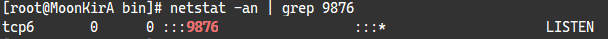

##### 2.2.3.3. 启动 Broker

启动 Broker，需要指定一下 NameServer 的地址和端口

```bash
nohup ./mqbroker -n localhost:9876 &
```

只要进程不报错，就应该是启动成功了，可以查看一下日志或者查看进程来确认是否成功启动

```bash
tail -f /root/logs/rocketmqlogs/broker.log
```

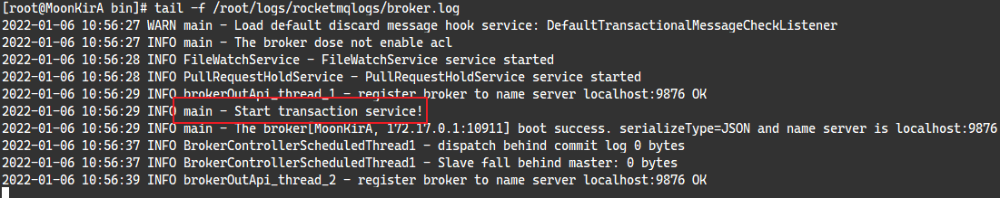

#### 2.2.4. 测试

官方文档提供了一个测试脚本。*注：以下命令是在RocketMQ根目录执行*

发送消息：

```bash
export NAMESRV_ADDR=localhost:9876
bin/tools.sh org.apache.rocketmq.example.quickstart.Producer
```

发送成功后显示：SendResult [sendStatus=SEND_OK, msgId= …​

接收消息：

```bash
export NAMESRV_ADDR=localhost:9876
bin/tools.sh org.apache.rocketmq.example.quickstart.Consumer
```

接收成功后显示：ConsumeMessageThread_%d Receive New Messages: [MessageExt…​

#### 2.2.5. 关闭服务

在 RocketMQ 根目录执行以下命令，关闭 RocketMQ

```bash
bin/mqshutdown broker
bin/mqshutdown namesrv
```

### 2.3. windows 环境安装

#### 2.3.1. 安装

- 将下载的 rocketmq-all-4.9.2-bin-release.zip 到无中文无空格的目录下
- 新增环境变量 `ROCKETMQ_HOME`，指定 rocketmq 解压的根目录

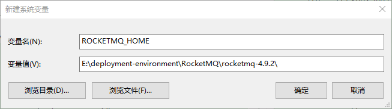

> 注意：RocketMQ 的环境变量名称必须是 `ROCKETMQ_HOME`，因为启动的脚本是用此名称。

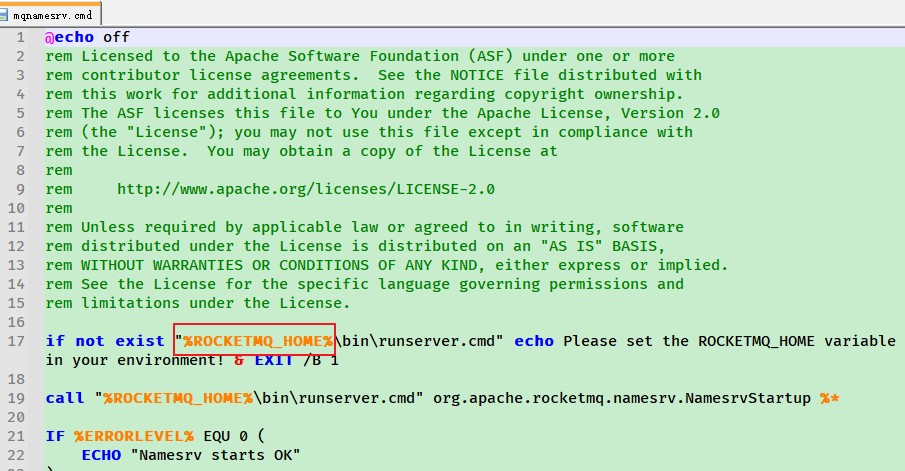

- 可选配置的环境变量：`NAMESRV_ADDR`，值为 `127.0.0.1:9876`。如果不配置，则可以通过命令或者配置文件来设置对应值。（本人不配置环境变量，直接修改配置文件）
- 修改 `根目录/conf/broker.conf` 配置文件，添加如下配置：

```properties
enablePropertyFilter=true
# 指定 NameServer 的地址，把 borker 与 NameServer 关联起来
namesrvAddr=127.0.0.1:9876
```

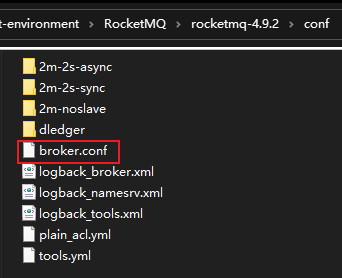

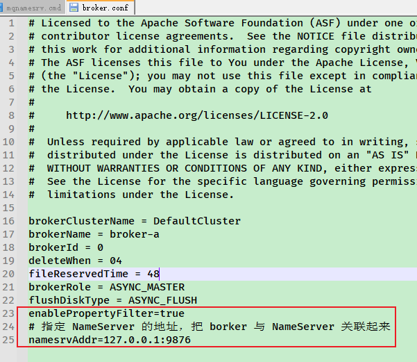

#### 2.3.2. 启动服务

先进入 RocketMQ 的 bin 目录下

##### 2.3.2.1. 修改配置文件

启动前，需要修改两个配置文件。修改服务占用的内存

- 修改 runbroker.cmd

```
# set "JAVA_OPT=%JAVA_OPT% -server -Xms2g -Xmx2g"
# 修改为 set "JAVA_OPT=%JAVA_OPT% -server -Xms256m -Xmx256m"
```

- 修改 runserver.cmd

```
# set "JAVA_OPT=%JAVA_OPT% -server -Xms2g -Xmx2g -Xmn1g -XX:MetaspaceSize=128m -XX:MaxMetaspaceSize=320m"
# 修改为 set "JAVA_OPT=%JAVA_OPT% -server -Xms256m -Xmx320m -Xmn256m -XX:MetaspaceSize=128m -XX:MaxMetaspaceSize=320m"
```

- 修改服务的日志保存位置（可选），日志的配置文件位置是：rocketmq-4.9.2\conf\logback_xxx.xml，共3个文件

##### 2.3.2.2. 启动 NameServer

运行 bin 目录下的 `mqnamesrv` 命令即可启动命名服务器，默认对外服务端口 9876

- 方式一：直接进入`/根目录/bin/`，双击 mqnamesrv.cmd 启动
- 方式二：命令行启动

```bash
cd /d E:\deployment-environment\RocketMQ\rocketmq-4.9.2\bin
mqnamesrv.cmd
```

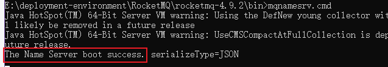

##### 2.3.2.3. 启动 Broker

进入 `/根目录/bin/` 目录，通过命令行启动 broker

```bash
cd /d E:\deployment-environment\RocketMQ\rocketmq-4.9.2\bin
mqbroker.cmd -c ../conf/broker.conf
```

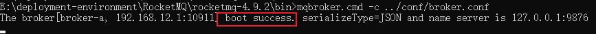

> 注：如果不配置环境变量 `NAMESRV_ADDR` 或者 `broker.conf` 配置文件，将 borker 与 NameServer 关联起来，则需要在运行 `mqbroker` 指令前通过 `set` 指令设置 `NAMESRV_ADDR` 的值，并且每次开启均需要设置此项。

#### 2.3.3. 关闭服务

直接关闭命令行窗口即可

### 2.4. RocketMQ 控制台安装（windows环境）

RocketMQ 控制台 的 github 仓库地址：https://github.com/apache/rocketmq-externals

原下载地址：~~https://github.com/apache/rocketmq-externals/releases~~（已失效）

> 没有打包好的版本下载，在github仓库中，选择`release-rocketmq-console`的分支，然后克隆或者打包下载到本地即可

- 修改项目的配置

```properties
# 修改配置文件 rocketmq-console\src\main\resources\application.properties
server.port=7777 # 项目部署端口号
rocketmq.config.namesrvAddr=192.168.12.132:9876 # nameserv的地址，注意防火墙要开启9876端口
rocketmq.config.dataPath=E:/logs/tmp/rocketmq-console/data # 项目的临时配置文件
```

- 修改 \src\main\resources\logback.xml 中日志保存位置，默认保存在`${user.dir}`
- 将工程打成jar包后，再启动项目

```bash
# 进入控制台项目根目录，将工程打成jar包
mvn clean package -Dmaven.test.skip=true
# 启动控制台
java -jar target/rocketmq-console-ng-1.0.0.jar
```

> 注：也可以不修改原配置文件，在启动命令中，指定项目部署端口号和NameServer的地址

```bash
cd /d E:\deployment-environment\RocketMQ\rocketmq-console\target\
# 启动控制台
java -jar rocketmq-console-ng-1.0.0.jar --server.port=7777 --rocketmq.config.namesrvAddr=127.0.0.1:9876
```

- 根据配置的端口号，访问控制台

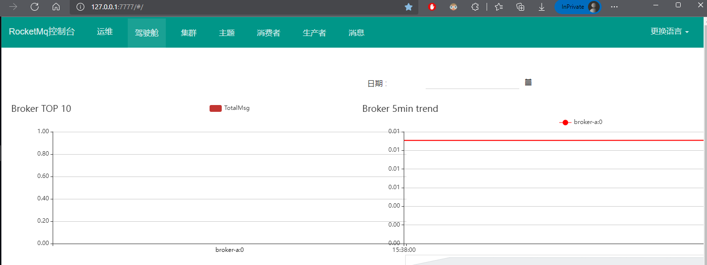

## 3. RocketMQ 的架构及概念

### 3.1. 技术架构

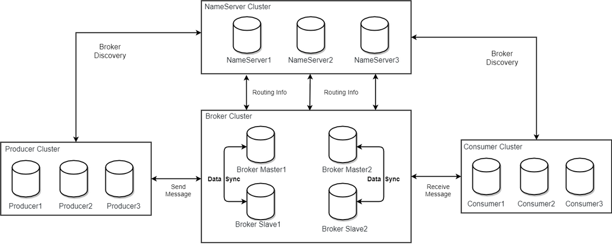

RocketMQ 架构上主要分为四部分，如上图所示:

- Producer：消息发布的角色，支持分布式集群方式部署。Producer 通过 MQ 的负载均衡模块选择相应的 Broker 集群队列进行消息投递，投递的过程支持快速失败并且低延迟。
- Consumer：消息消费的角色，支持分布式集群方式部署。支持以 push（推送），pull（拉取）两种模式对消息进行消费。同时也支持集群方式和广播方式的消费，它提供实时消息订阅机制，可以满足大多数用户的需求。
- NameServer：NameServer 是一个非常简单的 Topic 路由注册中心，其角色类似 Dubbo 中的 zookeeper，支持 Broker 的动态注册与发现。主要包括两个功能：Broker 管理，NameServer 接受 Broker 集群的注册信息并且保存下来作为路由信息的基本数据。然后提供心跳检测机制，检查 Broker 是否还存活；路由信息管理，每个NameServer将保存关于Broker集群的整个路由信息和用于客户端查询的队列信息。然后Producer和Conumser通过NameServer就可以知道整个Broker集群的路由信息，从而进行消息的投递和消费。NameServer通常也是集群的方式部署，各实例间相互不进行信息通讯。Broker是向每一台NameServer注册自己的路由信息，所以每一个NameServer实例上面都保存一份完整的路由信息。当某个NameServer因某种原因下线了，Broker仍然可以向其它NameServer同步其路由信息，Producer,Consumer仍然可以动态感知Broker的路由的信息。
- BrokerServer：Broker 主要负责消息的存储、投递和查询以及服务高可用保证。

### 3.2. Broker 核心子模块

Broker 为了实现这些功能，其架构包含了以下几个重要子模块：

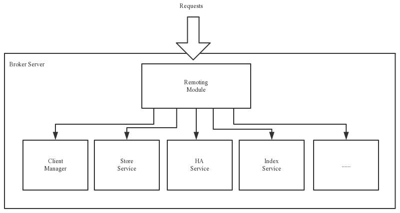

- Remoting Module：整个 Broker 的实体入口，负责处理来自 clients 端的请求。
- Client Manager：负责管理客户端(Producer/Consumer)和维护 Consumer 的 Topic 订阅信息
- Store Service：提供方便简单的 API 接口处理消息存储到物理硬盘和查询功能。
- HA Service：高可用服务，提供 Master Broker 和 Slave Broker 之间的数据同步功能。
- Index Service：根据特定的 Message key 对投递到 Broker 的消息进行索引服务，以提供消息的快速查询。

### 3.3. 基本概念

- **消息模型（Message Model）**：RocketMQ 主要由 Producer、Broker、Consumer 三部分组成，其中 Producer 负责生产消息，Consumer 负责消费消息，Broker 负责存储消息。Broker 在实际部署过程中对应一台服务器，每个 Broker 可以存储多个 Topic 的消息，每个 Topic 的消息也可以分片存储于不同的 Broker。Message Queue 用于存储消息的物理地址，每个Topic中的消息地址存储于多个 Message Queue 中。ConsumerGroup 由多个Consumer 实例构成。
- **消息生产者（Producer）**：负责生产消息，一般由业务系统负责生产消息。一个消息生产者会把业务应用系统里产生的消息发送到broker服务器。RocketMQ提供多种发送方式，同步发送、异步发送、顺序发送、单向发送。同步和异步方式均需要Broker返回确认信息，单向发送不需要。
- **消息消费者（Consumer）**：负责消费消息，一般是后台系统负责异步消费。一个消息消费者会从Broker服务器拉取消息、并将其提供给应用程序。从用户应用的角度而言提供了两种消费形式：拉取式消费、推动式消费。
- **主题（Topic）**：表示一类消息的集合，每个主题包含若干条消息，每条消息只能属于一个主题，是RocketMQ进行消息订阅的基本单位。
- **代理服务器（Broker Server）**：消息中转角色，负责存储消息、转发消息。代理服务器在RocketMQ系统中负责接收从生产者发送来的消息并存储、同时为消费者的拉取请求作准备。代理服务器也存储消息相关的元数据，包括消费者组、消费进度偏移和主题和队列消息等。
- **名字服务（Name Server）**：名称服务充当路由消息的提供者。生产者或消费者能够通过名字服务查找各主题相应的Broker IP列表。多个Namesrv实例组成集群，但相互独立，没有信息交换。
- **拉取式消费（Pull Consumer）**：Consumer消费的一种类型，应用通常主动调用Consumer的拉消息方法从Broker服务器拉消息、主动权由应用控制。一旦获取了批量消息，应用就会启动消费过程。
- **推动式消费（Push Consumer）**：Consumer消费的一种类型，该模式下Broker收到数据后会主动推送给消费端，该消费模式一般实时性较高。
- **生产者组（Producer Group）**：同一类Producer的集合，这类Producer发送同一类消息且发送逻辑一致。如果发送的是事务消息且原始生产者在发送之后崩溃，则Broker服务器会联系同一生产者组的其他生产者实例以提交或回溯消费。
- **消费者组（Consumer Group）**：同一类Consumer的集合，这类Consumer通常消费同一类消息且消费逻辑一致。消费者组使得在消息消费方面，实现负载均衡和容错的目标变得非常容易。要注意的是，消费者组的消费者实例必须订阅完全相同的Topic。RocketMQ 支持两种消息模式：集群消费（Clustering）和广播消费（Broadcasting）。
- **集群消费（Clustering）**：集群消费模式下，相同Consumer Group的每个Consumer实例平均分摊消息。
- **广播消费（Broadcasting）**：广播消费模式下，相同Consumer Group的每个Consumer实例都接收全量的消息。
- **普通顺序消息（Normal Ordered Message）**：普通顺序消费模式下，消费者通过同一个消息队列（ Topic 分区，称作 Message Queue） 收到的消息是有顺序的，不同消息队列收到的消息则可能是无顺序的。
- **严格顺序消息（Strictly Ordered Message）**：严格顺序消息模式下，消费者收到的所有消息均是有顺序的。
- **消息（Message）**：消息系统所传输信息的物理载体，生产和消费数据的最小单位，每条消息必须属于一个主题。RocketMQ中每个消息拥有唯一的Message ID，且可以携带具有业务标识的Key。系统提供了通过Message ID和Key查询消息的功能。
- **标签（Tag）**：为消息设置的标志，用于同一主题下区分不同类型的消息。来自同一业务单元的消息，可以根据不同业务目的在同一主题下设置不同标签。标签能够有效地保持代码的清晰度和连贯性，并优化RocketMQ提供的查询系统。消费者可以根据Tag实现对不同子主题的不同消费逻辑，实现更好的扩展性。

### 3.4. 消息系统通用模型


## 4. RocketMQ 快速开始

### 4.1. 相关依赖

示例使用 SpringBoot 项目

```xml
<!-- Spring Boot 父项目依赖 -->
<parent>
    <groupId>org.springframework.boot</groupId>
    <artifactId>spring-boot-starter-parent</artifactId>
    <version>2.1.13.RELEASE</version>
</parent>

<dependencies>
    <dependency>
        <groupId>org.apache.rocketmq</groupId>
        <artifactId>rocketmq-spring-boot-starter</artifactId>
        <!--<version>2.0.2</version>-->
        <!--
            采用客户端调用的时候，可能会相对高频的出现的 No route info of this topic这个异常问题
            配置 autoCreateTopicEnable=true，如果这个属性没有配置，且没有手动创建topic，就会出现上面的异常
            注：这个属性在高版本已经默认配置了
        -->
        <version>2.1.1</version>
    </dependency>
    <!-- 测试相关依赖 -->
    <dependency>
        <groupId>org.springframework.boot</groupId>
        <artifactId>spring-boot-starter-test</artifactId>
        <scope>test</scope>
    </dependency>
</dependencies>
```

### 4.2. RocketMQ 相关的配置

修改项目application.yml配置文件，增加 RocketMQ 相关的配置

- 消息发送者配置：

```yml
# RocketMQ 配置
rocketmq:
  name-server: 127.0.0.1:9876 # RocketMQ 服务的地址
  producer:
    group: producer-example # 生产者组名称(按实际命名)
```

- 消息消费者配置：

```yml
# RocketMQ 配置
rocketmq:
  name-server: 127.0.0.1:9876 # RocketMQ 服务的地址
```

### 4.3. 使用 RocketMQ 原生的 API 方式

#### 4.3.1. 发送消息

使用 RocketMQ 发送消息步骤如下：

1. 创建消息生产者，指定生产者所属的组名
2. 指定 Nameserver 地址
3. 启动生产者
4. 创建消息对象，指定主题、标签和消息体
5. 发送消息
6. 关闭生产者

```java
import org.apache.rocketmq.client.producer.DefaultMQProducer;
import org.apache.rocketmq.client.producer.SendResult;
import org.apache.rocketmq.common.message.Message;
import org.junit.Test;

@Test
public void basicTest() throws Exception {
    // 1. 创建消息生产者，并且设置生产组名
    DefaultMQProducer producer = new DefaultMQProducer("my-producer-group");

    // 2. 为生产者设置 NameServer 的地址
    producer.setNamesrvAddr("127.0.0.1:9876");

    // 3. 启动生产者
    producer.start();

    /*
     * 4. 构建消息对象
     *  String topic 消息的主题名
     *  String tags  消息的标签名
     *  byte[] body  消息的内容，字节数组
     */
    Message message = new Message("myTopic", "myTag", ("Test RocketMQ Message").getBytes());

    /*
     * 5. 发送消息
     *  Message msg     消息对象
     *  long timeout    超时时间
     */
    SendResult result = producer.send(message, 10000);
    System.out.println(result);

    // 6. 关闭生产者
    producer.shutdown();
}
```

#### 4.3.2. 接收消息

使用 RocketMQ 接收消息步骤：

1. 创建消息消费者，指定消费者所属的组名
2. 指定 Nameserver 地址
3. 指定消费者订阅的主题和标签
4. 设置回调函数，编写处理消息的方法
5. 启动消息消费者

```java
import org.apache.rocketmq.client.consumer.DefaultMQPushConsumer;
import org.apache.rocketmq.client.consumer.listener.ConsumeConcurrentlyContext;
import org.apache.rocketmq.client.consumer.listener.ConsumeConcurrentlyStatus;
import org.apache.rocketmq.client.consumer.listener.MessageListenerConcurrently;
import org.apache.rocketmq.common.message.MessageExt;
import org.junit.Test;

import java.util.List;

@Test
public void basicTest() throws Exception {
    // 1. 创建消费者，并且为其指定消费者组名
    DefaultMQPushConsumer consumer = new DefaultMQPushConsumer("my-consumer-group");

    // 2. 为消费者设置 NameServer 的地址
    consumer.setNamesrvAddr("127.0.0.1:9876");

    /*
     * 3. 指定消费者订阅的主题和标签
     *  String topic            消息主题名称
     *  String subExpression    消息标签名称（`*`代表所有标签）
     */
    consumer.subscribe("myTopic", "*");

    // 4. 设置一个回调函数,并在函数中编写接收到消息之后的处理方法
    consumer.registerMessageListener(new MessageListenerConcurrently() {
        // 处理获取到的消息
        @Override
        public ConsumeConcurrentlyStatus consumeMessage(List<MessageExt> list, ConsumeConcurrentlyContext consumeConcurrentlyContext) {
            // 消费逻辑
            System.out.println("Message ===> " + list);

            // 返回消费成功状态
            return ConsumeConcurrentlyStatus.CONSUME_SUCCESS;
        }
    });

    // 5. 启动消费者
    consumer.start();
    System.out.println("启动消费者成功了");
    System.in.read();
}
```

### 4.4. Spring Boot 方式

#### 4.4.1. 发送消息

使用 `RocketMQTemplate` 对象发送消息

```java
@RestController
public class ProducerController {
    private final static Logger logger = LoggerFactory.getLogger(ProducerController.class);

    @Autowired
    private RocketMQTemplate rocketMQTemplate;

    @GetMapping("sendMessage/{msg}")
    public String sendMessage(@PathVariable String msg) {
        logger.info("开始发送消息");
        // 发送异步消息
        rocketMQTemplate.asyncSend("spring-boot-test-topic", msg, new SendCallback() {
            @Override
            public void onSuccess(SendResult sendResult) {
                logger.info("发送消息成功，结果：{}", sendResult);
            }

            @Override
            public void onException(Throwable e) {
                logger.error("发送消息异常：{}", e);
            }
        });
        return "send message success!" + msg;
    }
}
```

#### 4.4.2. 接收消息

RocketMQ 支持两种消息模式：

- 广播消费：每个消费者实例都会收到消息，也就是一条消息可以被每个消费者实例处理；
- 集群消费：一条消息只能被一个消费者实例消费

```java
/**
 * Spring Boot 方式接收消息。
 * 消息消费者需要 实现 RocketMQListener<T> 接口。泛型 T 是消息的类型
 */
@Service
// @RocketMQMessageListener 注解用于配置消费者相关信息
@RocketMQMessageListener(
        consumerGroup = "consume-example",      // 消费者分组
        topic = "spring-boot-test-topic",       // 要消费的主题
        consumeMode = ConsumeMode.CONCURRENTLY, // 消费模式:无序和有序，默认是无序
        messageModel = MessageModel.CLUSTERING  // 消息模式:广播和集群，默认是集群
)
public class ConsumeService implements RocketMQListener<String> {
    private final static Logger logger = LoggerFactory.getLogger(ConsumeService.class);

    @Override
    public void onMessage(String message) {
        logger.info("消息消费者接收到的信息：{}", message);
    }
}
```

## 5. 不同类型的消息

引入 RocketMQ 依赖

```xml
<dependency>
    <groupId>org.apache.rocketmq</groupId>
    <artifactId>rocketmq-spring-boot-starter</artifactId>
    <!--<version>2.0.2</version>-->
    <!--
        采用客户端调用的时候，可能会相对高频的出现的 No route info of this topic这个异常问题
        配置 autoCreateTopicEnable=true，如果这个属性没有配置，且没有手动创建topic，就会出现上面的异常
        注：这个属性在高版本已经默认配置了
    -->
    <version>2.1.1</version>
</dependency>
```

> 注：示例依赖 rocketmq-starter 2.0.2 版本时，发送消息时如果当前topic不存在，会报No route info of this topic这个异常问题。高版本默认自动创建topic。

注入 `RocketMQTemplate`

```java
@Autowired
private RocketMQTemplate rocketMQTemplate;
```

### 5.1. 普通消息

RocketMQ 提供三种方式来发送普通消息：可靠同步发送、可靠异步发送和单向发送。

#### 5.1.1. 可靠同步发送

同步发送是指消息发送方发出数据后，会在收到接收方发回响应之后才发下一个数据包的通讯方式。

此种方式应用场景非常广泛，例如重要通知邮件、报名短信通知、营销短信系统等。

```java
// 同步消息测试
@Test
public void testSyncSend() {
    /*
     * public SendResult syncSend(String destination, Object payload, long timeout)
     *  发送同步消息，在等待消息发送结果的返回之前，会一直阻塞
     *  String destination  消息主题和标签。格式：`topicName:tags`
     *  Object payload      消息体
     *  long timeout        超时时间，单位ms
     */
    SendResult result =
            rocketMQTemplate.syncSend("MessageType-test-topic:sync", "这是一条同步消息", 10000);
    System.out.println(result);
}
```

#### 5.1.2. 可靠异步发送

异步发送是指发送方发出数据后，不等接收方发回响应，接着发送下个数据包的通讯方式。发送方通过回调接口接收服务器响应，并对响应结果进行处理。

异步发送一般用于链路耗时较长，对 RT 响应时间较为敏感的业务场景，例如用户视频上传后通知启动转码服务，转码完成后通知推送转码结果等。

```java
// 异步消息测试
@Test
public void testAsyncSend() throws InterruptedException {
    /*
     * public void asyncSend(String destination, Object payload, SendCallback sendCallback)
     *  发送异步消息，发送消息之后，程序会继续往下执行，不会等待结果的返回
     *  String destination          消息主题和标签。格式：`topicName:tags`
     *  Object payload              消息体
     *  SendCallback sendCallback   异步消息发送成功的回调函数
     */
    rocketMQTemplate.asyncSend("MessageType-test-topic:async", "这是一条异步消息", new SendCallback() {
        // 成功响应的回调
        @Override
        public void onSuccess(SendResult result) {
            System.out.println(result);
        }

        // 异常响应的回调
        @Override
        public void onException(Throwable throwable) {
            System.out.println(throwable);
        }
    });
    System.out.println("异步消息发送成功");
    // 线程睡眠，目的等待异步消息发送成功后的回调函数
    Thread.sleep(30000);
}
```

#### 5.1.3. 单向发送

单向发送是指发送方只负责发送消息，不等待服务器回应且没有回调函数触发，即只发送请求不等待应答。

适用于某些耗时非常短，但对可靠性要求并不高的场景，例如日志收集。

```java
// 单向消息
@Test
public void testOneWay() {
    /*
     * public void sendOneWay(String destination, Object payload)
     *  发送消息，不等待服务器回应且没有回调函数触发
     *  String destination  消息主题和标签。格式：`topicName:tags`
     *  Object payload      消息体
     */
    rocketMQTemplate.sendOneWay("MessageType-test-topic:oneway", "这是一条单向消息");
}
```

#### 5.1.4. 三种发送方式的对比

| 发送方式 | 发送 TPS | 发送结果反馈 | 可靠性  |
| :-----: | :------: | :---------: | :-----: |
| 同步发送 |    快    |     有      | 不丢失  |
| 异步发送 |    快    |     有      | 不丢失  |
| 单向发送 |   最快   |     无      | 可能丢失 |

### 5.2. 顺序消息

顺序消息是消息队列提供的一种严格按照顺序来发布和消费的消息类型。

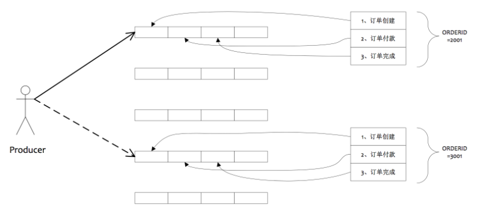

**RocketMQ 默认发送是分布同一个主题中不同的队列中**

```java
// 顺序消息测试
@Test
public void testSendOrderly() throws InterruptedException {
    /*
     * public SendResult syncSendOrderly(String destination, Message<?> message, String hashKey, long timeout)
     *  发送同步顺序消息，在等待消息发送结果的返回之前，会一直阻塞
     *  String destination  消息主题和标签。格式：`topicName:tags`
     *  Object payload      消息体
     *  String hashKey      用于选择队列的 hashkey。
     *  long timeout        超时时间，单位ms
     */
    SendResult result =
            rocketMQTemplate.syncSendOrderly("MessageType-test-topic:sync", "这是一条同步消息", "hk", 10000);
    System.out.println(result);
    /*
     * public void asyncSendOrderly(String destination, Object payload, String hashKey, SendCallback sendCallback)
     *  发送异步顺序消息，发送消息之后，程序会继续往下执行，不会等待结果的返回
     *  String destination          消息主题和标签。格式：`topicName:tags`
     *  Object payload              消息体
     *  String hashKey              用于选择队列的 hashkey。
     *  SendCallback sendCallback   异步消息发送成功的回调函数
     */
    rocketMQTemplate.asyncSendOrderly("MessageType-test-topic:async", "这是一条异步消息", "hk", new SendCallback() {
        // 成功响应的回调
        @Override
        public void onSuccess(SendResult result) {
            System.out.println(result);
        }

        // 异常响应的回调
        @Override
        public void onException(Throwable throwable) {
            System.out.println(throwable);
        }
    });

    /*
     * public void sendOneWayOrderly(String destination, Object payload, String hashKey)
     *  发送单向顺序消息，不等待服务器回应且没有回调函数触发
     *  String destination  消息主题和标签。格式：`topicName:tags`
     *  Object payload      消息体
     *  String hashKey      用于选择队列的 hashkey。
     */
    rocketMQTemplate.sendOneWayOrderly("MessageType-test-topic:oneway", "这是一条单向消息", "hk");
    // 线程睡眠，目的等待异步消息发送成功后的回调函数
    Thread.sleep(30000);
}
```

### 5.3. 事务消息

RocketMQ 提供了事务消息，通过事务消息就能达到分布式事务的最终一致。

#### 5.3.1. 事务消息交互流程

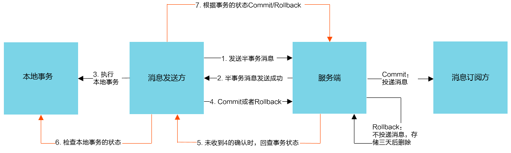

**相关概念**：

- 半事务消息：暂不能投递的消息，发送方已经成功地将消息发送到了 RocketMQ 服务端，但是服务端未收到生产者对该消息的二次确认，此时该消息被标记成“暂不能投递”状态，处于该种状态下的消息即半事务消息。
- 消息回查：由于网络闪断、生产者应用重启等原因，导致某条事务消息的二次确认丢失，RocketMQ 服务端通过扫描发现某条消息长期处于“半事务消息”时，需要主动向消息生产者询问该消息的最终状态（`Commit` 或是 `Rollback`），该询问过程即消息回查。

**事务消息发送步骤**：

1. 发送方将半事务消息发送至 RocketMQ 服务端。
2. RocketMQ 服务端将消息持久化之后，向发送方返回 Ack 确认消息已经发送成功，此时消息为半事务消息。
3. 发送方开始执行本地事务逻辑。
4. 发送方根据本地事务执行结果向服务端提交二次确认（`Commit` 或是 `Rollback`），服务端收到 `Commit` 状态则将半事务消息标记为可投递，订阅方最终将收到该消息；服务端收到 `Rollback` 状态则删除半事务消息，订阅方将不会接受该消息。

**事务消息回查步骤**：

1. 在断网或者是应用重启的特殊情况下，上述步骤4提交的二次确认最终未到达服务端，经过固定时间后服务端将对该消息发起消息回查。
2. 发送方收到消息回查后，需要检查对应消息的本地事务执行的最终结果。
3. 发送方根据检查得到的本地事务的最终状态再次提交二次确认，服务端仍按照步骤4对半事务消息进行操作。

#### 5.3.2. 基础使用示例

```java
@RestController
public class TxMessageController {

    @Autowired
    private RocketMQTemplate rocketMQTemplate;

    @GetMapping("tx_message_example")
    public String txMessageExample() {
        System.out.println("======= 程序开始 =======");

        Product product = new Product();
        product.setId("001");
        product.setProductName("秋天的兰花");
        product.setPrice(BigDecimal.TEN);
        product.setProductDesc("オータム オーキッド");

        /*
         * public TransactionSendResult sendMessageInTransaction(final String destination, final Message<?> message, final Object arg)
         *  发送半事务消息。
         *      final String destination    消息主题和标签。格式：`topicName:tags`
         *      final Message<?> message    消息内容
         *      final Object arg            在执行本地事务方法中传入的参数
         */
        rocketMQTemplate.sendMessageInTransaction(
                "tx_topic",
                MessageBuilder.withPayload(product).setHeader("tx_id", "tx-id-001").build(),
                product
        );

        return product.getProductName();
    }

}
```

创建事务消息监听实现类。需要继承 RocketMQLocalTransactionListener 接口，实现 executeLocalTransaction 与 checkLocalTransaction 方法。

```java
@Service
@RocketMQTransactionListener
public class TxMessageServiceListener implements RocketMQLocalTransactionListener {
    /**
     * 执行本地事务
     *
     * @param msg
     * @param arg
     * @return
     */
    @Override
    public RocketMQLocalTransactionState executeLocalTransaction(Message msg, Object arg) {
        System.out.println("executeLocalTransaction 方法调用，执行本地事务...");
        String txId = (String) msg.getHeaders().get("tx_id");
        Product product = (Product) arg;
        System.out.println("executeLocalTransaction 方法获取到的消息体：" + txId);
        System.out.println("executeLocalTransaction 方法获取到的参数：" + product);

        // 模拟本地一些业务逻辑(30s)
        try {
            Thread.sleep(30000);
            return RocketMQLocalTransactionState.COMMIT;
        } catch (InterruptedException e) {
            e.printStackTrace();
            return RocketMQLocalTransactionState.ROLLBACK;
        }
    }

    /**
     * 消息回查
     *
     * @param msg
     * @return
     */
    @Override
    public RocketMQLocalTransactionState checkLocalTransaction(Message msg) {
        System.out.println("checkLocalTransaction 方法调用，进行消息回查...");
        String txId = (String) msg.getHeaders().get("tx_id");
        System.out.println("checkLocalTransaction 方法获取到的消息体：" + txId);

        // 模拟本地一些业务逻辑(10s)，如：查询本地数据库，是否已经操作成功 orderDao.findById(txId)
        try {
            Thread.sleep(10000);
            // 如果确认本地事务成功，则提交
            return RocketMQLocalTransactionState.COMMIT;
        } catch (InterruptedException e) {
            e.printStackTrace();
            return RocketMQLocalTransactionState.ROLLBACK;
        }
    }
}
```

#### 5.3.3. @RocketMQTransactionListener 注解与 sendMessageInTransaction 在版本升级的变化

依赖：

```xml
<dependency>
    <groupId>org.apache.rocketmq</groupId>
    <artifactId>rocketmq-spring-boot-starter</artifactId>
    <!-- <version>2.0.2</version> -->
    <!--
        2.0.2对应rocketmq 4.4.0
        2.1.0对应rocketmq 4.6.0
    -->
    <version>2.1.0</version>
</dependency>
```

- 从 2.0.2 升级 2.1.0 版本，发送事务消息的 `sendMessageInTransaction` 方法参数个数从4个变成3个

```java
// *********** 2.0.2 版本 ***********
/**
 * Send Spring Message in Transaction
 *
 * @param txProducerGroup the validate txProducerGroup name, set null if using the default name
 * @param destination     destination formats: `topicName:tags`
 * @param message         message {@link org.springframework.messaging.Message}
 * @param arg             ext arg
 * @return TransactionSendResult
 * @throws MessagingException
 */
public TransactionSendResult sendMessageInTransaction(final String txProducerGroup, final String destination, final Message<?> message, final Object arg) throws MessagingException {
    try {
        TransactionMQProducer txProducer = this.stageMQProducer(txProducerGroup);
        org.apache.rocketmq.common.message.Message rocketMsg = RocketMQUtil.convertToRocketMessage(objectMapper,
            charset, destination, message);
        return txProducer.sendMessageInTransaction(rocketMsg, arg);
    } catch (MQClientException e) {
        throw RocketMQUtil.convert(e);
    }
}

// *********** 2.1.0 版本 ***********
/**
 * Send Spring Message in Transaction
 *
 * @param destination destination formats: `topicName:tags`
 * @param message message {@link org.springframework.messaging.Message}
 * @param arg ext arg
 * @return TransactionSendResult
 * @throws MessagingException
 */
public TransactionSendResult sendMessageInTransaction(final String destination,
    final Message<?> message, final Object arg) throws MessagingException {
    try {
        if (((TransactionMQProducer) producer).getTransactionListener() == null) {
            throw new IllegalStateException("The rocketMQTemplate does not exist TransactionListener");
        }
        org.apache.rocketmq.common.message.Message rocketMsg = this.createRocketMqMessage(destination, message);
        return producer.sendMessageInTransaction(rocketMsg, arg);
    } catch (MQClientException e) {
        throw RocketMQUtil.convert(e);
    }
}
```

- 从 2.0.2 升级 2.1.0 版本，`@RocketMQTransactionListener` 注解移除了 `txProducerGroup` 属性

```java
@Target({ElementType.TYPE, ElementType.ANNOTATION_TYPE})
@Retention(RetentionPolicy.RUNTIME)
@Documented
@Component
public @interface RocketMQTransactionListener {
    /**
     * Set ExecutorService params -- corePoolSize
     */
    int corePoolSize() default 1;

    /**
     * Set ExecutorService params -- maximumPoolSize
     */
    int maximumPoolSize() default 1;

    /**
     * Set ExecutorService params -- keepAliveTime
     */
    long keepAliveTime() default 1000 * 60; //60ms

    /**
     * Set ExecutorService params -- blockingQueueSize
     */
    int blockingQueueSize() default 2000;

    /**
     * Set rocketMQTemplate bean name, the default is rocketMQTemplate.
     * if use ExtRocketMQTemplate, can set ExtRocketMQTemplate bean name.
     */
    String rocketMQTemplateBeanName() default "rocketMQTemplate";
}
```

在 rocketmq-spring-boot-starter 低于 2.1.0 以前的项目中，可以用多个 `@RocketMQTransactionListener` 来监听不同的 `txProducerGroup` 来发送不同类型的事务消息到topic，但是现在在一个项目中，如果在一个项目中写了多个 `@RocketMQTransactionListener`，项目将不能启动，启动会报

```
java.lang.IllegalStateException: rocketMQTemplate already exists RocketMQLocalTransactionListener
```

所以发送事务消息：在客户端，首先用户需要实现 `RocketMQLocalTransactionListener` 接口，并在接口类上注解声明 `@RocketMQTransactionListener`，实现确认和回查方法；然后再使用资源模板 `RocketMQTemplate`，调用方法 `sendMessageInTransaction()` 来进行消息的发布。注意：从 RocketMQ-Spring 2.1.0 版本之后，注解 `@RocketMQTransactionListener` 不能设置 `txProducerGroup`、`ak`、`sk`，这些值均与对应的 `RocketMQTemplate` 保持一致。

