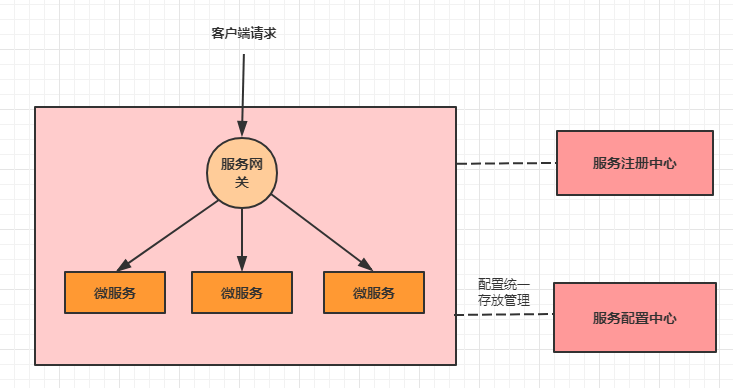
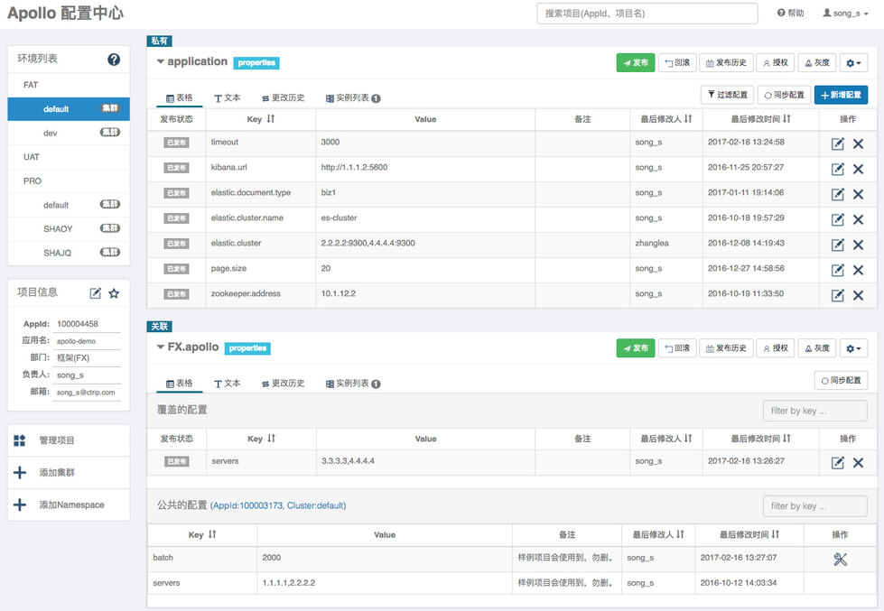
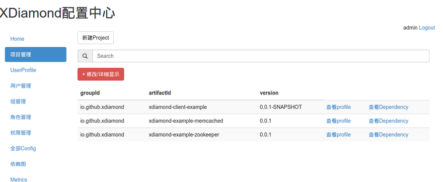
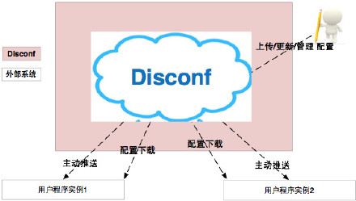
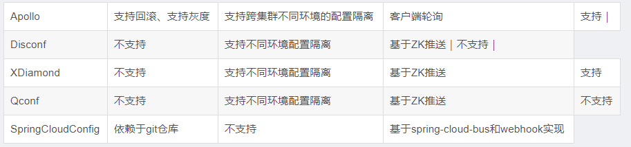

## 1. 分布式配置中心介绍

微服务架构下关于配置文件的一些问题：

1. 配置文件相对分散。在一个微服务架构下，配置文件会随着微服务的增多变的越来越多，而且分散在各个微服务中，不好统一配置和管理。
2. 配置文件无法区分环境。微服务项目可能会有多个环境，例如：测试环境、预发布环境、生产环境。每一个环境所使用的配置理论上都是不同的，一旦需要修改，就需要到各个微服务下手动更新，维护困难。
3. 配置文件无法实时更新。修改了配置文件之后，必须重新启动微服务才能使配置生效，这对一个正在运行的项目来说是非常不友好的。

通过配置中心来解决以上问题。配置中心的实现思路是：

- 首先把项目中各种配置全部都放到一个集中的地方进行统一管理，并提供一套标准的接口。
- 当各个服务需要获取配置的时候，就来配置中心的接口拉取自己的配置。
- 当配置中心中的各种参数有更新的时候，也能通知到各个服务实时的过来同步最新的信息，使之动态更新。

当加入了服务配置中心之后，我们的系统架构图会变成如下：

## 2. 配置中心开源方案

分布式配置中心，网上的一些开源的解决方案

### 2.1. Apollo

Apollo（阿波罗）是携程框架部门研发的分布式配置中心，能够集中化管理应用不同环境、不同集群的配置，配置修改后能够实时推送到应用端，并且具备规范的权限、流程治理等特性，适用于微服务配置管理场景。

> - 项目地址：https://github.com/ctripcorp/apollo
> - 具体内容详见：[Apollo.md](/分布式微服务/分布式配置中心/Apollo)

### 2.2. XDiamond

全局配置中心，存储应用的配置项，解决配置混乱分散的问题。名字来源于淘宝的开源项目Diamond，前面加上一个字母X以示区别。

> 项目地址：https://github.com/hengyunabc/xdiamond

### 2.3. Qconf

QConf 是一个分布式配置管理工具。 用来替代传统的配置文件，使得配置信息和程序代码分离，同时配置变化能够实时同步到客户端，而且保证用户高效读取配置，这使的工程师从琐碎的配置修改、代码提交、配置上线流程中解放出来，极大地简化了配置管理工作。

> 项目地址：https://github.com/Qihoo360/QConf

### 2.4. Disconf

专注于各种「分布式系统配置管理」的「通用组件」和「通用平台」, 提供统一的「配置管理服务」包括 百度、滴滴出行、银联、网易、拉勾网、苏宁易购、顺丰科技 等知名互联网公司正在使用!「disconf」在「2015 年度新增开源软件排名 TOP 100(OSC开源中国提供)」中排名第16强。目前已经不再维护更新。

Disconf的功能特点描述图：

> 项目地址：https://github.com/knightliao/disconf

### 2.5. Spring Cloud Config

Spring Cloud Config 为分布式系统中的外部配置提供服务器和客户端支持。2014年9月开源，Spring Cloud 生态组件，可以和Spring Cloud体系无缝整合，使用起来非常方便，并且它的配置存储支持Git。不过它没有可视化的操作界面，配置的生效也不是实时的，需要重启或去刷新。

> - 项目地址：https://github.com/spring-cloud/spring-cloud-config
> - 具体内容详见：[Spring-Cloud-Config.md](/分布式微服务/SpringCloud/Spring-Cloud-Config)

### 2.6. Nacos

Sping Cloud Alibaba 技术栈中的一个组件，2018年6月，阿里开源的配置中心，也可以做DNS和RPC的服务发现。

> - 项目地址：https://github.com/alibaba/nacos
> - 具体内容详见：[《Spring-Cloud-Alibaba-Nacos》笔记]((/分布式微服务/SpringCloud/Spring-Cloud-Alibaba-Nacos))的『nacos config 章节』

### 2.7. 各个方案的区别

