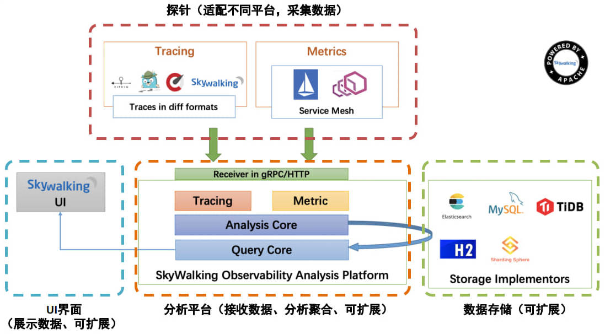

## 1. SkyWalking 概述

> 官网：https://skywalking.apache.org/

根据官方的解释，Skywalking 是一个可观测性分析平台（Observability Analysis Platform 简称 OAP）和应用性能管理系统（Application Performance Management 简称 APM）。提供分布式链路追踪、服务网格(Service Mesh)遥测分析、度量(Metric)聚合和可视化一体化解决方案。

Skywalking 的特点：

- 多语言自动探针，Java、.NET Core 和 Node.JS。
- 多种监控手段，语言探针和 service mesh。
- 轻量高效。不需要额外搭建大数据平台。
- 模块化架构。UI、存储、集群管理多种机制可选。
- 支持告警。
- 优秀的可视化效果。

### 1.1. Skywalking 整体架构

整体架构包含如下三个组成部分：

1. 探针(agent)负责进行数据的收集，包含了 Tracing 和 Metrics 的数据，agent 会被安装到服务所在的服务器上，以方便数据的获取。
2. 可观测性分析平台 OAP(Observability Analysis Platform)，接收探针发送的数据，并在内存中使用分析引擎（Analysis Core)进行数据的整合运算，然后将数据存储到对应的存储介质上，比如 Elasticsearch、MySQL 数据库、H2 数据库等。同时 OAP 还使用查询引擎(Query Core)提供 HTTP 查询接口。
3. Skywalking 提供单独的 UI 进行数据的查看，此时 UI 会调用 OAP 提供的接口，获取对应的数据然后进行展示。

