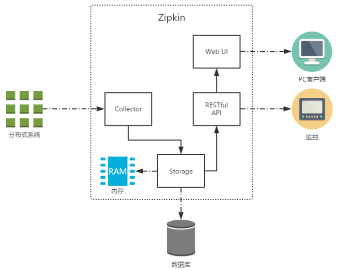

## 1. Zipkin 概述

### 1.1. 简介

Zipkin 是 Twitter 的一个开源项目，它基于 Google Dapper 实现，它致力于收集服务的定时数据，以解决微服务架构中的延迟问题，包括**数据的收集、存储、查找和展现**。

Zipkin 可以用来收集各个服务器上请求链路的跟踪数据，并通过它提供的 REST API 接口来辅助查询跟踪数据以实现对分布式系统的监控程序，从而及时地发现系统中出现的延迟升高问题并找出系统性能瓶颈的根源。

除了面向开发的 API 接口之外，它也提供了方便的 UI 组件来直观的搜索跟踪信息和分析请求链路明细，比如：可以查询某段时间内各用户请求的处理时间等。Zipkin 提供了可插拔数据存储方式：In-Memory、MySql、Cassandra 以及 Elasticsearch。

> 官方网址：https://zipkin.io/

### 1.2. Zipkin 核心组件



上图展示了 Zipkin 的基础架构，它主要由 4 个核心组件构成：

- **Collector**：收集器组件，它主要用于处理从外部系统发送过来的跟踪信息，将这些信息转换为 Zipkin 内部处理的 Span 格式，以支持后续的存储、分析、展示等功能。
- **Storage**：存储组件，它主要对处理收集器接收到的跟踪信息，默认会将这些信息存储在内存中，我们也可以修改此存储策略，通过使用其他存储组件将跟踪信息存储到数据库中。
- **RESTful API**：API 组件，它主要用来提供外部访问接口。比如给客户端展示跟踪信息，或是外接系统访问以实现监控等。
- **Web UI**：UI 组件，基于 API 组件实现的上层应用。通过 UI 组件用户可以方便而有直观地查询和分析跟踪信息。

Zipkin 分为两端，一个是 Zipkin 服务端，一个是 Zipkin 客户端，客户端也就是微服务的应用。客户端会配置服务端的 URL 地址，一旦发生服务间的调用的时候，会被配置在微服务里面的 Sleuth 的监听器监听，并生成相应的 Trace 和 Span 信息发送给服务端。

发送的方式主要有两种，一种是 HTTP 报文的方式，还有一种是消息总线的方式如 RabbitMQ。不论哪种方式，使用 zipkin 实现链路追踪的日志收集都需要：

- 一个服务注册中心，*示例项目使用之前的 eureka 项目来当注册中心*。
- 一个 Zipkin 服务端。
- 多个微服务，这些微服务中配置 Zipkin 客户端。

## 2. Zipkin Server （服务端）的部署和配置

### 2.1. Zipkin Server 下载

从 spring boot 2.0 开始，官方就不再支持使用自建 Zipkin Server 的方式进行服务链路追踪，而是直接提供了编译好的 jar 包来使用。可以从官方网站下载先下载 Zipkin 的 web UI

> - Zipkin 源码下载地址：https://github.com/openzipkin/zipkin/releases
> - Zipkin Server 编译后 jar 下载地址：https://search.maven.org/artifact/io.zipkin/zipkin-server
> - 此次示例下载的是 zipkin-server-2.20.0-exec.jar

### 2.2. 启动

进行 jar 所在目录，使用命令行直接启动 Zipkin Server

```bash
java -jar zipkin-server-2.22.0-exec.jar
```

### 2.3. 相关部署与配置信息

默认 Zipkin Server 的请求端口为 `9411`。Zipkin Server 的启动参数可以通过官方提供的 yml 配置文件查找

> 配置文件地址：https://github.com/openzipkin/zipkin/blob/master/zipkin-server/src/main/resources/zipkin-server-shared.yml

在浏览器输入 `http://127.0.0.1:9411` 即可进入到 Zipkin Server 的管理后台
