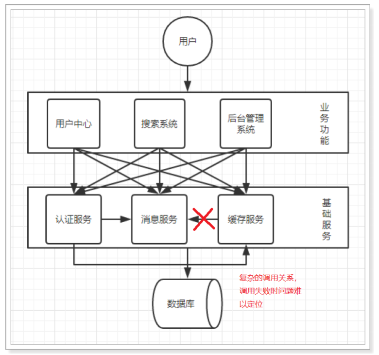
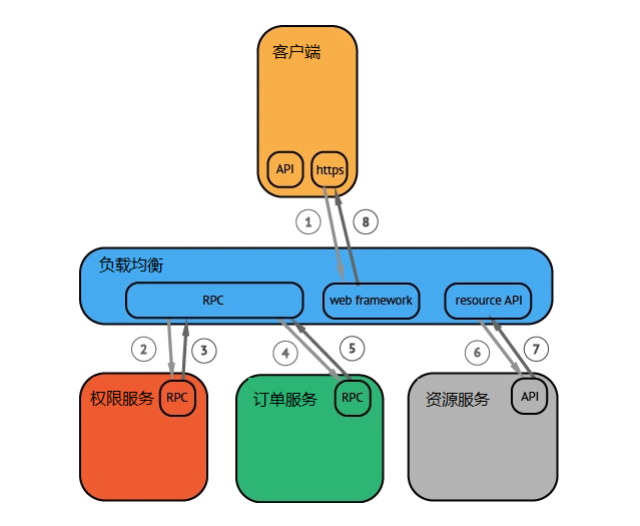
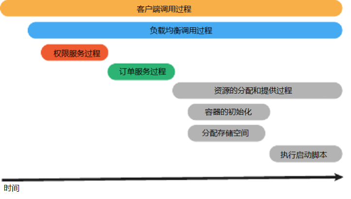
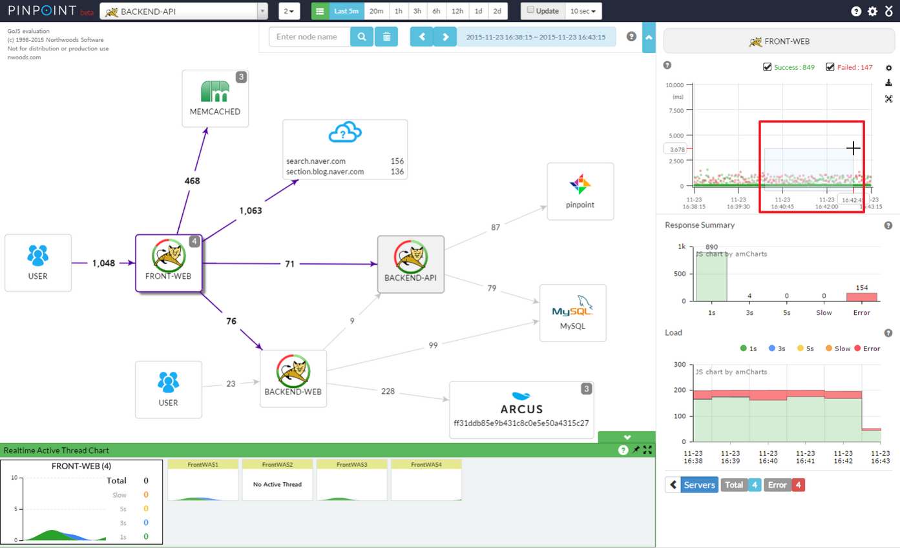
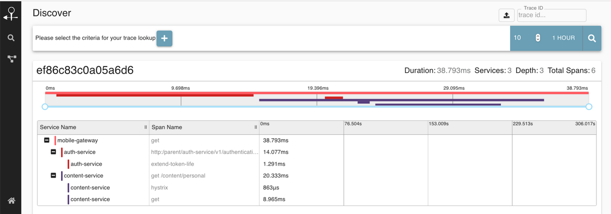

## 1. APM 系统概述

APM (Application Performance Management)即应用性能管理系统，是对企业系统即时监控以实现对应用程序性能管理和故障管理的系统化的解决方案。应用性能管理，主要指对企业的关键业务应用进行监测、优化，提高企业应用的可靠性和质量，保证用户得到良好的服务，降低 IT 总拥有成本。

**APM 系统是可以帮助理解系统行为、用于分析性能问题的工具，以便发生故障的时候，能够快速定位和解决问题。**

## 2. 分布式链路追踪概述

随着分布式系统和微服务架构的出现，一次用户的请求会经过多个系统，不同服务之间的调用关系十分复杂，任何一个系统出错都可能影响整个请求的处理结果。以往的监控系统往往只能知道单个系统的健康状况、一次请求的成功失败，无法快速定位失败的根本原因。

除此之外，复杂的分布式系统也面临这下面这些问题：

- 性能分析：一个服务依赖很多服务，被依赖的服务也依赖了其他服务。如果某个接口耗时突然变长了，那未必是直接调用的下游服务慢了，也可能是下游的下游慢了造成的，如何快速定位耗时变长的根本原因呢？
- 链路梳理：需求迭代很快，系统之间调用关系变化频繁，靠人工很难梳理清楚系统链路拓扑(系统之间的调用关系)。

为了解决这些问题，Google 推出了一个分布式链路跟踪系统 Dapper，之后各个互联网公司都参照 Dapper 的思想推出了自己的分布式链路跟踪系统，而这些系统就是分布式系统下的 APM 系统。

## 3. OpenTracing 概述

OpenTracing 通过提供平台无关、厂商无关的 API，使得开发人员能够方便的添加（或更换）分布式链路跟踪系统的实现。

下图是一个分布式调用的例子，客户端发起请求，请求首先到达负载均衡器，接着经过认证服务，订单服务，然后请求资源，最后返回结果。

虽然这种图对于看清各组件的组合关系是很有用的，但是存在下面两个问题：

- 它不能很好显示组件的调用时间，是串行调用还是并行调用，如果展现更复杂的调用关系，会更加复杂，甚至无法画出这样的图。
- 这种图也无法显示调用间的时间间隔以及是否通过定时调用来启动调用。

基于 OpenTracing 就可以很轻松的构建出以下这种更有效的展现一个调用过程的图：

## 4. 主流的开源链路追踪相关产品

以下是目前业界比较流行的链路追踪技术，大部分都是基于 google 发表的 Dapper。Dapper 阐述了分布式系统，特别是微服务架构中链路追踪的概念、数据表示、埋点、传递、收集、存储与展示等技术细节。

### 4.1. PinPoint

> 官方网站：https://github.com/naver/pinpoint

Pinpoint 是由一个韩国团队实现并开源，基于字节码注入的调用链分析，以及应用监控分析工具。针对 Java 编写的大规模分布式系统设计，通过 JavaAgent 的机制做字节代码植入，实现加入 traceid 和获取性能数据的目的，特点是支持多种插件，UI功能强大，对应用代码零侵入。

### 4.2. SkyWalking 

> 官方网站：http://skywalking.apache.org/

SkyWalking 本土开源的基于字节码注入的调用链分析，以及应用监控分析工具。目前是 apache 基金会下面的一个开源 APM 项目，为微服务架构和云原生架构系统设计。它通过探针自动收集所需的指标，并进行分布式追踪。

通过这些调用链路以及指标，Skywalking APM 会感知应用间关系和服务间关系，并进行相应的指标统计。Skywalking 支持链路追踪和监控应用组件基本涵盖主流框架和容器，如国产 RPC Dubbo 和 motan 等，国际化的 spring boot，spring cloud。

SkyWalking 特点是支持多种插件，UI功能较强，接入端无代码侵入。目前已加入Apache孵化器。

> 更多内容详见[《SkyWalking 笔记》](/分布式微服务/分布式链路追踪/SkyWalking)

### 4.3. Zipkin 

> 官方网站：https://zipkin.io/

Zipkin 是由 Twitter 开源，是分布式链路调用监控系统，聚合各业务系统调用延迟数据，达到链路调用监控跟踪。Zipkin 基于 Google 的 Dapper 论文实现，主要完成数据的收集、存储、搜索与界面展示。该产品结合 spring-cloud-sleuth 使用较为简单，集成很方便，但是功能较简单。

> 更多内容详见[《Zipkin 笔记》](/分布式微服务/分布式链路追踪/Zipkin)

### 4.4. CAT

> 官方网站: https://github.com/dianping/cat

CAT 是由大众点评开源的项目，基于 Java 开发的实时应用监控平台，包括实时应用监控，业务监控，可以提供十几张报表展示。集成方案是通过代码埋点的方式来实现监控，比如：拦截器，过滤器等。对代码的侵入性很大，集成成本较高。风险较大。

### 4.5. Sleuth

Spring Cloud 提供的分布式系统中链路追踪解决方案。

> 更多内容详见[《Spring Cloud Sleuth 链路跟踪》笔记](/分布式微服务/SpringCloud/Spring-Cloud-Sleuth)

### 4.6. 其他产品

- 阿里的鹰眼
- 美团的Mtrace
