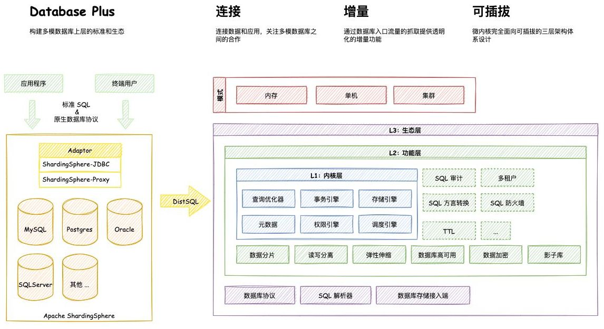
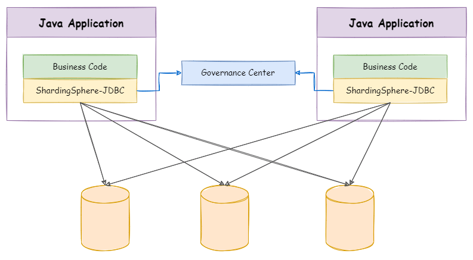
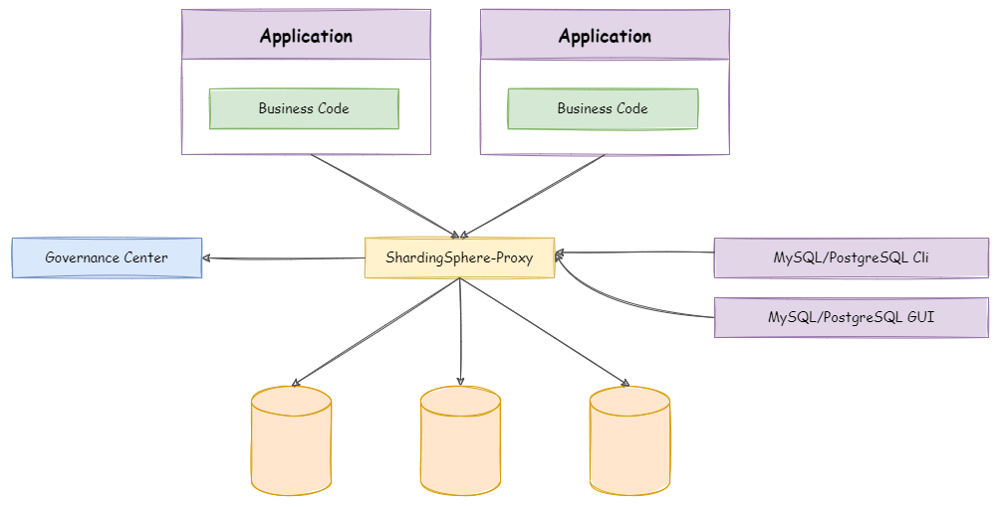
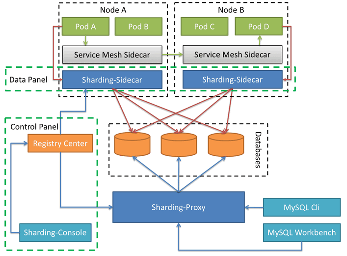
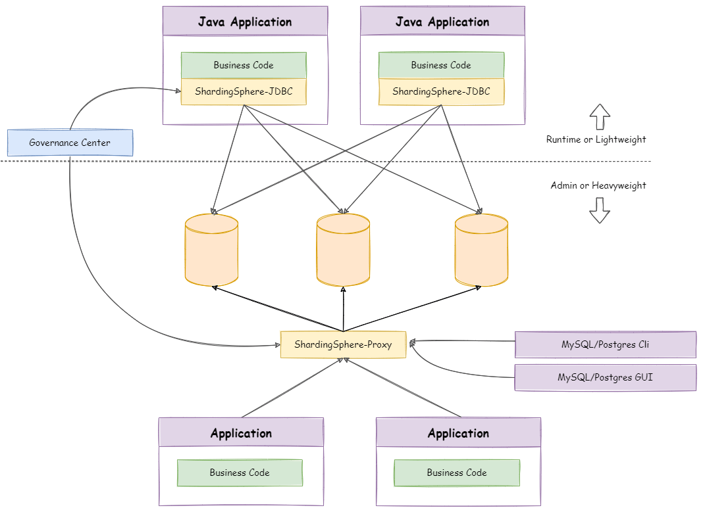

## 1. ShardingSphere 概述

Apache ShardingSphere 是一款分布式 SQL 事务和查询引擎，可通过数据分片、弹性伸缩、加密等能力对任意数据库进行增强。

Apache ShardingSphere 设计哲学为 Database Plus，旨在构建异构数据库上层的标准和生态。 它关注如何充分合理地利用数据库的计算和存储能力，而并非实现一个全新的数据库。 它站在数据库的上层视角，关注它们之间的协作多于数据库自身。

### 1.1. ShardingSphere 组成简介

Apache ShardingSphere 由 JDBC、Proxy 和 Sidecar（规划中）这 3 款既能够独立部署，又支持混合部署配合使用的产品组成。 它们均提供标准化的基于数据库作为存储节点的增量功能，可适用于如 Java 同构、异构语言、云原生等各种多样化的应用场景。

- ShardingSphere-JDBC：定位为轻量级 Java 框架，在 Java 的 JDBC 层提供的额外服务。
- ShardingSphere-Proxy：定位为透明化的数据库代理端，通过实现数据库二进制协议，对异构语言提供支持。

### 1.2. 产品功能

- **数据分片**：是应对海量数据存储与计算的有效手段。ShardingSphere 基于底层数据库提供分布式数据库解决方案，可以水平扩展计算和存储。
- **分布式事务**：是保障数据库完整、安全的关键技术，也是数据库的核心技术。基于 XA 和 BASE 的混合事务引擎，ShardingSphere 提供在独立数据库上的分布式事务功能，保证跨数据源的数据安全。
- **读写分离**：是应对高压力业务访问的手段。基于对 SQL 语义理解及对底层数据库拓扑感知能力，ShardingSphere 提供灵活的读写流量拆分和读流量负载均衡。
- **数据迁移**：是打通数据生态的关键能力。ShardingSphere 提供跨数据源的数据迁移能力，并可支持重分片扩展。
- **联邦查询**：是面对复杂数据环境下利用数据的有效手段。ShardingSphere 提供跨数据源的复杂查询分析能力，实现跨源的数据关联与聚合。
- **数据加密**：是保证数据安全的基本手段。ShardingSphere 提供完整、透明、安全、低成本的数据加密解决方案。
- **影子库**：在全链路压测场景下，ShardingSphere 支持不同工作负载下的数据隔离，避免测试数据污染生产环境。

### 1.3. 产品优势

- 极致性能：驱动程序端历经长年打磨，效率接近原生 JDBC，性能极致。
- 生态兼容：代理端支持任何通过 MySQL/PostgreSQL 协议的应用访问，驱动程序端可对接任意实现 JDBC 规范的数据库。
- 业务零侵入：面对数据库替换场景，ShardingSphere 可满足业务无需改造，实现平滑业务迁移。
- 运维低成本：在保留原技术栈不变前提下，对 DBA 学习、管理成本低，交互友好。
- 安全稳定：基于成熟数据库底座之上提供增量能力，兼顾安全性及稳定性。
- 弹性扩展：具备计算、存储平滑在线扩展能力，可满足业务多变的需求。
- 开放生态：通过多层次（内核、功能、生态）插件化能力，为用户提供可定制满足自身特殊需求的独有系统。

## 2. Apache ShardingSphere 的核心概念

- 连接：打造数据库上层标准。通过对数据库协议、SQL 方言以及数据库存储的灵活适配，快速构建多模异构数据库上层的标准，同时通过内置 DistSQL 为应用提供标准化的连接方式。
- 增强：数据库计算增强引擎。在原生数据库基础能力之上，提供分布式及流量增强方面的能力。前者可突破底层数据库在计算与存储上的瓶颈，后者通过对流量的变形、重定向、治理、鉴权及分析能力提供更为丰富的数据应用增强能力。
- 可插拔：构建数据库功能生态。项目采用微内核 + 三层可插拔模型，使内核、功能组件以及生态对接完全能够灵活的方式进行插拔式扩展，开发者能够像使用积木一样定制属于自己的独特系统。Apache ShardingSphere 的可插拔架构划分为 3 层：
    - **L1 内核层**：是数据库基本能力的抽象，其所有组件均必须存在，但具体实现方式可通过可插拔的方式更换。主要包括查询优化器、分布式事务引擎、分布式执行引擎、权限引擎和调度引擎等。
    - **L2 功能层**：用于提供增量能力，其所有组件均是可选的，可以包含零至多个组件。组件之间完全隔离，互无感知，多组件可通过叠加的方式相互配合使用。主要包括数据分片、读写分离、数据加密、影子库等。用户自定义功能可完全面向 Apache ShardingSphere 定义的顶层接口进行定制化扩展，而无需改动内核代码。
    - **L3 生态层**：用于对接和融入现有数据库生态，包括数据库协议、SQL 解析器和存储适配器，分别对应于 Apache ShardingSphere 以数据库协议提供服务的方式、SQL 方言操作数据的方式以及对接存储节点的数据库类型。

## 3. 部署形态

Apache ShardingSphere 由 ShardingSphere-JDBC 和 ShardingSphere-Proxy 这 2 款既能够独立部署，又支持混合部署配合使用的产品组成。它们均提供标准化的基于数据库作为存储节点的增量功能，可适用于如 Java 同构、异构语言、云原生等各种多样化的应用场景。

### 3.1. ShardingSphere-JDBC 独立部署

ShardingSphere-JDBC 定位为轻量级 Java 框架，在 Java 的 JDBC 层提供的额外服务。它使用客户端直连数据库，以 jar 包形式提供服务，无需额外部署和依赖，可理解为增强版的 JDBC 驱动，完全兼容 JDBC 和各种 ORM 框架。

- 适用于任何基于 JDBC 的 ORM 框架，如：JPA，Hibernate，Mybatis，Spring JDBC Template 或直接使用 JDBC。
- 支持任何第三方的数据库连接池，如：DBCP，C3P0，BoneCP，HikariCP 等。
- 支持任意实现 JDBC 规范的数据库，目前支持 MySQL，PostgreSQL，Oracle，SQLServer 以及任何可使用 JDBC 访问的数据库。

### 3.2. ShardingSphere-Proxy 独立部署

ShardingSphere-Proxy 定位为透明化的数据库代理端，通过实现数据库二进制协议，对异构语言提供支持。 目前提供 MySQL 和 PostgreSQL 协议，透明化数据库操作，对 DBA 更加友好。

- 对应用程序完全透明，可直接当做 MySQL/PostgreSQL 使用。
- 兼容 MariaDB 等基于 MySQL 协议的数据库，以及 openGauss 等基于 PostgreSQL 协议的数据库。
- 适用于任何兼容 MySQL/PostgreSQL 协议的的客户端，如：MySQL Command Client, MySQL Workbench, Navicat 等。

### 3.3. ShardingSphere-JDBC 与 ShardingSphere-Proxy 对比

|           | ShardingSphere-JDBC | ShardingSphere-Proxy |
| -------- | ------------------- | -------------------- |
| 数据库     | 任意                 | MySQL/PostgreSQL     |
| 连接消耗数 | 高                  | 低                   |
| 异构语言   | 仅 Java             | 任意                  |
| 性能      | 损耗低               | 损耗略高               |
| 无中心化   | 是                  | 否                   |
| 静态入口   | 无                  | 有                   |

### 3.4. ShardingSphere-Sidecar（TODO）

定位为 Kubernetes 的云原生数据库代理，以 Sidecar 的形式代理所有对数据库的访问。 通过无中心、零侵入的方案提供与数据库交互的啮合层，即 Database Mesh，又可称数据库网格。

Database Mesh 的关注重点在于如何将分布式的数据访问应用与数据库有机串联起来，它更加关注的是交互，是将杂乱无章的应用与数据库之间的交互进行有效地梳理。 使用 Database Mesh，访问数据库的应用和数据库终将形成一个巨大的网格体系，应用和数据库只需在网格体系中对号入座即可，它们都是被啮合层所治理的对象。

### 3.5. 混合部署架构

ShardingSphere-JDBC 采用无中心化架构，与应用程序共享资源，适用于 Java 开发的高性能的轻量级 OLTP 应用；ShardingSphere-Proxy 提供静态入口以及异构语言的支持，独立于应用程序部署，适用于 OLAP 应用以及对分片数据库进行管理和运维的场景。

Apache ShardingSphere 是多接入端共同组成的生态圈。通过混合使用 ShardingSphere-JDBC 和 ShardingSphere-Proxy，并采用同一注册中心统一配置分片策略，能够灵活的搭建适用于各种场景的应用系统，使得架构师更加自由地调整适合于当前业务的最佳系统架构。

## 4. 运行模式

Apache ShardingSphere 提供了两种运行模式，分别是单机模式和集群模式。

### 4.1. 单机模式

**单机模式**能够将数据源和规则等元数据信息持久化，但无法将元数据同步至多个 Apache ShardingSphere 实例，无法在集群环境中相互感知。通过某一实例更新元数据之后，会导致其他实例由于获取不到最新的元数据而产生不一致的错误。

> 适用于工程师在本地搭建 Apache ShardingSphere 环境。

### 4.2. 集群模式

**集群模式**提供了多个 Apache ShardingSphere 实例之间的元数据共享和分布式场景下状态协调的能力。 它能够提供计算能力水平扩展和高可用等分布式系统必备的能力，集群环境需要通过独立部署的注册中心来存储元数据和协调节点状态。

> 在生产环境建议使用集群模式。
