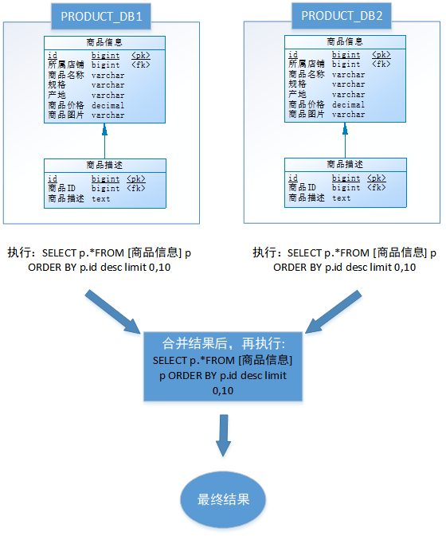
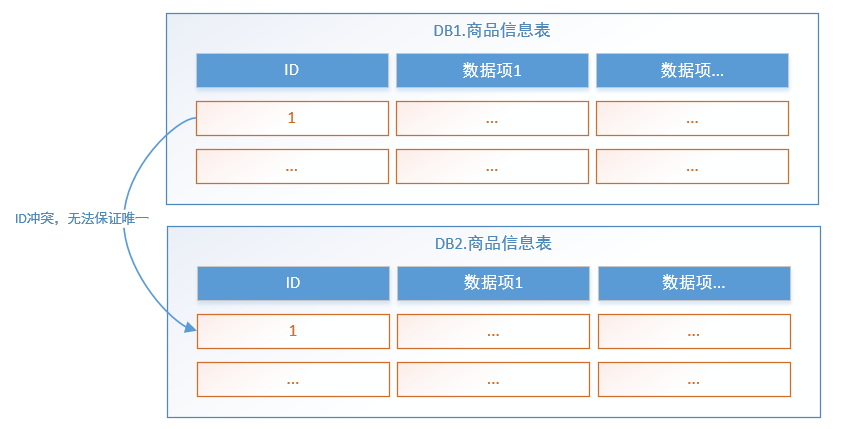

## 1. 分库分表概述

分库分表就是把较大的数据库和数据表按照某种策略进行拆分。目的在于：降低每个库、每张表的数据量，减小数据库的负担，提高数据库的效率，缩短查询时间。另外，因为分库分表这种改造是可控的，底层还是基于 RDBMS，因此整个数据库的运维体系以及相关基础设施都是可重用的。

### 1.1. 分库与分表各自解决的问题

- **分库**：是为了解决数据库连接资源不足问题，和磁盘 IO 的性能瓶颈问题。
- **分表**：是为了解决单表数据量太大，sql 语句查询数据时，即使走了索引也非常耗时问题。此外还可以解决消耗 cpu 资源问题。
- **分库分表**：可以解决数据库连接资源不足、磁盘 IO 的性能瓶颈、检索数据耗时和消耗 cpu 资源等问题。

### 1.2. 分库分表中的业务场景

- 如果在有些业务场景中，用户并发量很大，但是需要保存的数据量很少，这时可以**只分库，不分表**。
- 如果在有些业务场景中，用户并发量不大，但是需要保存的数量很多，这时可以**只分表，不分库**。
- 如果在有些业务场景中，用户并发量大，并且需要保存的数量也很多时，可以**分库分表**。

## 2. 分库分表的方式

### 2.1. 概述

数据库（表）的切分可以分为两种方式：

**垂直划分**


**水平划分**


### 2.2. 垂直划分

#### 2.2.1. 垂直分表

用户在电商平台流览商品时，首先看到的是商品的基本信息，如果对该商品感兴趣时才会继续查看该商品的详细描述。因此，商品基本信息的访问频次要高于商品详细描述信息，商品基本信息的访问效率要高于商品详细描述信息(大字段)。由于这两种数据的特性不一样，因此考虑将商品信息表进行**垂直分表**，拆分结果如下：


<font color=red>**垂直分表定义：将一个表的字段分散到多个表中，每个表存储其中一部分字段**</font>。

**垂直分表的好处**：

1. 减少IO争抢，减少锁表的几率，查看商品详情的与商品概述互不影响
2. 充分发挥高频数据的操作效率，对商品概述数据操作的高效率不会被操作商品详情数据的低效率所拖累。

**垂直拆分常用原则**：

一般来说，某业务实体中的各个数据项的访问频次是不一样的，部分数据项可能是占用存储空间比较大的BLOB或是TEXT，例如上例中的<u>商品描述字段</u>。所以，当数据量很大时，可以**将表按字段拆分，将热门字段、冷门字段分开放置在不同表中**。垂直切分带来的性能提升，主要集中在热门数据的操作效率上，而且磁盘争用情况减少。

- 把不常用的字段单独放在一张表
- 把 text，blob 等大字段拆分出来单独放在一张表
- 经常组合查询的字段单独放在一张表中

#### 2.2.2. 垂直分库 

通过垂直分表，数据库性能得到了一定程度的提升，但是还没有达到要求，并且磁盘空间也快不够了，因为数据还是始终存放在一台服务器。库内垂直分表只解决了单一表数据量过大的问题，但没有将表分布到不同机器的库上，因此对于减轻数据库的压力来说，作用有限，所有请求还是竞争同一个物理机的CPU、内存、网络IO、磁盘。

以电商平台为例，可以把原有的 SELLER_DB (卖家库)，拆分为 PRODUCT_DB (商品库)和 STORE_DB (店铺库)，并把这两个库分散到不同服务器上。由于**商品信息**与**商品描述**业务耦合度较高，因此一起被存放在PRODUCT_DB(商品库)；而**店铺信息**相对独立，因此单独被存放在STORE_DB(店铺库)，这就叫**垂直分库**。如下图所示：


<font color=red>**垂直分库定义：指按照业务将表进行分类，分布到不同的数据库上面，每个库可以放在不同的服务器上，从而达到多个服务器共同分摊压力的效果**</font>。垂直分库的好处是：

- 解决业务层面的耦合，业务清晰
- 能对不同业务的数据进行分级管理、维护、监控、扩展等
- 高并发场景下，垂直分库在一定程度上可以提升IO、数据库连接数、单机硬件资源的性能

#### 2.2.3. 垂直划分的优缺点

**优点**：行记录变小，数据页可以存放更多记录，在查询时减少I/O次数。

**缺点**：

- 主键出现冗余，需要管理冗余列；
- 会引起表连接 `JOIN` 操作，可以通过在业务服务器上进行 `join` 来减少数据库压力；
- 依然存在单表数据量过大的问题。

### 2.3. 水平划分

#### 2.3.1. 水平分库

经过**垂直分表和垂直分库**后，数据库性能问题并没有完全解决。假设某电商平台发展迅猛，PRODUCT_DB (商品库)单库存储数据已经超出预估。假设目前该平台有8万个店铺，每个店铺平均有150个不同规格的商品，再算上增长，那商品数量就会达到 1500w+ 级别，并且 PRODUCT_DB (商品库)属于访问非常频繁的资源，性能瓶颈再次出现。

从业务角度分析，目前已经无法再次进行垂直拆分。于是可以尝试一种办法，判断商品ID是奇数还是偶数，然后把商品信息分别存放到两个数据库中。也就是说，要操作某条数据，先分析这条数据的商品ID，如果商品ID为奇数，将此操作映射至 RRODUCT_DB1(商品库1)；如果商品ID为偶数，将操作映射至 RRODUCT_DB2(商品库2)，这就叫**水平分库**。


<font color=red>**水平分库定义：把同一个表的数据按一定规则拆分到不同的数据库中，每个库可以放在不同的服务器上**</font>。水平分库的好处是：

- 解决了单库大数据，高并发的性能瓶颈。
- 按照合理拆分规则拆分，join操作基本避免跨库。*例子中商品信息、商品描述表都使用商品ID字段拆库，可避免跨库join*
- 提高了系统的稳定性及可用性。*稳定性体现在IO冲突减少，锁定减少，可用性指某个库出问题，部分可用*

当一个应用难以再细粒度的垂直切分，或切分后数据量行数仍然巨大，存在单库读写、存储性能瓶颈，这时候就需要进行**水平分库**了，经过水平切分的优化，往往能解决单库存储量及性能瓶颈。但由于同一个表被分配在不同的数据库，需要额外进行数据操作的路由工作，因此大大增加了系统复杂度。

#### 2.3.2. 水平分表

数据库能水平拆分，数据表也可以水平拆分。尝试把某 PRODUCT_DB (商品库)内的表，进行了一次水平拆分。与水平分库的思路类似，不过这次拆分的目标是表，商品信息及商品描述被分成了两套表。如果商品ID为奇数，将此操作映射至商品信息1表；如果商品ID为偶数，将操作映射至商品信息2表，这就叫**水平分表**。


<font color=red>**水平分表定义：在同一个数据库内，把同一个表的数据按一定规则拆分到多个表中**</font>。水平分表的好处是：

- 优化单一表数据量过大而产生的性能问题
- 避免IO争抢并减少锁表的几率

库内的水平分表，解决了单一表数据量过大的问题，分出来的小表中只包含一部分数据，从而使得单个表的数据量变小，提高检索性能。但由于同一个表的数据被拆分为多张表，也需要额外进行数据操作的路由工作，因此增加了系统复杂度。

#### 2.3.3. 水平划分的优缺点

**优点**：单库（表）的数据量得以减少，提高性能；切分出的表结构相同，程序改动较少。

**缺点**：

- 分片事务一致性难以解决
- 跨节点 `join` 操作性能差，逻辑复杂
- 数据分片在扩容时需要迁移

### 2.4. 小结

垂直方向（即业务方向）的分库和分表，比较容易理解，使用场景相似；而水平方向（即数据方向）的分库和分表，作用与使用场景是有区别的。

- 垂直分表：可以把一个宽表的字段按访问频次、业务耦合松紧、是否是大字段的原则拆分为多个表，这样既能使业务清晰，还能提升部分性能。拆分后，尽量从业务角度避免联查，否则性能方面将得不偿失。
- 垂直分库：可以把多个表按业务耦合松紧归类，分别存放在不同的库，这些库可以分布在不同服务器，从而使访问压力被多服务器负载，大大提升性能，同时能提高整体架构的业务清晰度，不同的业务库可根据自身情况定制优化方案。但是它需要解决跨库带来的所有复杂问题。
- 水平分库：可以把一个表的数据（按数据行）分到多个不同的库，每个库只有这个表的部分数据，这些库可以分布在不同服务器，从而使访问压力被多服务器负载，大大提升性能。它不仅需要解决跨库带来的所有复杂问题，还要解决数据路由的问题。
- 水平分表：可以把一个表的数据（按数据行）分到多个同一个数据库的多张表中，每个表只有这个表的部分数据，这样做能小幅提升性能，它仅仅作为水平分库的一个补充优化。

一般来说，在系统设计阶段就应该根据业务耦合松紧来确定垂直分库，垂直分表方案，在数据量及访问压力不是特别大的情况，首先考虑缓存、读写分离、索引技术等方案。若数据量极大，且持续增长，再考虑水平分库分表方案。

## 3. 分库分表存在问题

分库分表有效的缓解了大数据、高并发带来的性能和压力，也能突破网络IO、硬件资源、连接数的瓶颈，但同时也带来了一些问题。

### 3.1. 事务一致性问题

由于分库分表把数据分布在不同库甚至不同服务器，不可避免会带来**分布式事务**问题，需要额外编程解决该问题。

### 3.2. 跨节点 join

在没有进行分库分表前，检索商品时可以通过以下 SQL 对店铺信息进行关联查询：

```sql
SELECT
	p.*,s.[店铺名称],s.[信誉] 
FROM
	[商品信息表] p
	LEFT JOIN [店铺信息表] s ON p.id = s.[所属店铺] 
WHERE
	...
ORDER BY
	...
LIMIT...
```

但经过分库分表后，<u>商品信息表</u>和<u>店铺信息表</u>不在一个数据库或一个表中，甚至不在一台服务器上，无法通过 sql 语句进行关联查询，需要额外编程解决该问题。

### 3.3. 跨节点分页、排序和聚合函数

跨节点多库进行查询时，`limit` 分页、`order by` 排序以及聚合函数等问题，就变得比较复杂了。需要先在不同的分片节点中将数据进行排序并返回，然后将不同分片返回的结果集进行汇总和再次排序。例如，进行水平分库后的商品库，按 ID 倒序排序分页，取第一页：



以上流程是取第一页的数据，性能影响不大，但由于商品信息的分布在各数据库的数据可能是随机的，如果是取第 N 页，需要将所有节点前 N 页数据都取出来合并，再进行整体的排序，操作效率可想而知，所以请求页数越大，系统的性能也会越差。

在使用 `Max`、`Min`、`Sum`、`Count` 之类的函数进行计算的时候，与排序分页同理，也需要先在每个分片上执行相应的函数，然后将各个分片的结果集进行汇总和再次计算，最终将结果返回。

### 3.4. 主键避重

在分库分表环境中，由于表中数据同时存在不同数据库中，主键值无法使用自增长，某个分区数据库生成的ID无法保证全局唯一。因此需要单独设计全局主键，以避免跨库主键重复问题。



### 3.5. 小结

由于分库分表之后，数据被分散在不同的服务器、数据库和表中。因此，对数据的操作也就无法通过常规方式完成，并且它还带来了一系列的问题。在开发过程中需要通过一些中间件解决这些问题，市面上有很多中间件可供选择，其中 Sharding-JDBC 较为流行。

## 4. 分库分表涉及技术

### 4.1. 常用的分库分表实现

目前市面上分库分表的主要实现技术有以下几个：

1. **ShardingSphere** 是一套开源的分布式数据库中间件解决方案组成的生态圈，它由 Sharding-JDBC、Sharding-Proxy 和 Sharding-Sidecar（计划中）这3款相互独立的产品组成。是一个功能丰富的开源分布式数据库中间件，具有灵活的配置和扩展性，它支持主流关系型数据库（如 MySQL、Oracle、SQL Server 等），它们均提供标准化的数据分片、分布式事务、数据库治理、读写分离和完整的分库分表等功能。可适用于 Java 同构、异构语言、容器、云原生等各种多样化的应用场景。其中 **Sharding-JDBC**是当当网研发的开源分布式数据库中间件。

> 官网地址：https://shardingsphere.apache.org/document/legacy/4.x/document/cn/manual/sharding-jdbc/

2. MyCAT（MySQL Clustering and Advancement Toolkit）：是一个开源的分布式数据库中间件，特别适合于大规模的分库分表应用。它支持 MySQL 和 MycatSQL，提供了分片、读写分离、分布式事务等功能。MyCAT 具有高性能、高可用性、可扩展性和易用性的特点，广泛应用于各种大型互联网和电商平台。

> 项目地址：https://github.com/MyCATApache/Mycat2

3. TDDL（Taobao Distributed Data Layer）：是阿里巴巴开源的分库分表中间件。它为开发者提供了透明的分库分表解决方案，可以将数据按照指定的规则分布到不同的数据库和表中。TDDL 支持 MyISAM 和 InnoDB 引擎，提供了读写分离、动态扩容、数据迁移等功能。

> 项目地址：https://github.com/alibaba/tb_tddl

4. Vitess：是一个由 YouTube 开发和维护的分布式数据库集群中间件，支持 MySQL 作为后端存储系统。Vitess 提供了水平拆分、弹性缩放、负载均衡、故障恢复等功能，可以在大规模的数据集和高并发访问场景下提供高性能和可扩展性

> 项目地址：https://vitess.io/zh/

### 4.2. 分库分表后 id 主键解决方案

随着分库分表实现后，需要解决表生成一个全局唯一主键 id 的问题，以下生成全局 id 几种解决方案：

- **使用 UUID**：这种方式不适合作为主键，因为太长了，并且无序不可读，查询效率低。比较适合用于生成唯一的名字的标示比如文件的名字。
- **数据库自增 id**：两台数据库分别设置不同步长，生成不重复ID的策略来实现高可用。这种方式生成的 id 有序，但是需要独立部署数据库实例，成本高，还会有性能瓶颈。
- **利用 redis 生成 id**：性能比较好，灵活方便，不依赖于数据库。但是项目需要引入了新的组件，从而造成系统更加复杂，可用性降低，编码更加复杂，增加了系统成本。
- **Twitter 的 snowflake 算法**：
> snowflake 项目 Github 地址：https://github.com/twitter-archive/snowflake
- **美团的 Leaf 分布式 ID 生成系统**：Leaf 是美团开源的分布式ID生成器，能保证全局唯一性、趋势递增、单调递增、信息安全，里面也提到了几种分布式方案的对比，但也需要依赖关系数据库、Zookeeper等中间件。
> 参考美团技术团队的一篇文章：https://tech.meituan.com/2017/04/21/mt-leaf.html

### 4.3. 水平分表的路由方式

『路由』是指，数据应该分到哪个表。水平分表主要有三种路由方式：

#### 4.3.1. 范围路由

**范围路由**：选取有序的数据列（例如：整型、时间戳等）作为路由的条件，不同分段分散到不同的数据库表中。*例如一些支付系统，只能查一年范围内的支付记录，这个可能就是支付公司按照时间进行了分表*。


范围路由设计的复杂点主要体现在分段大小的选取上，分段太小会导致切分后子表数量过多，增加维护复杂度；分段太大可能会导致单表依然存在性能问题，一般建议分段大小在 100 万至 2000 万之间，具体需要根据业务选取合适的分段大小。

范围路由的优点是可以随着数据的增加平滑地扩充新的表。例如，现在的用户是 100 万，如果增加到 1000 万，只需要增加新的表就可以了，原有的数据不需要动。范围路由的一个比较隐含的缺点是分布不均匀，假如按照 1000 万来进行分表，有可能某个分段实际存储的数据量只有 1000 条，而另外一个分段实际存储的数据量有 900 万条。

#### 4.3.2. Hash 路由

**Hash 路由**：选取某个列（或者某几个列组合）的值进行 Hash 运算，然后根据 Hash 结果分散到不同的数据库表中。以订单 id 为例，规划 4 个数据库表，路由算法可以简单地用 `id % 4` 的值来表示数据所属的数据库表编号。


Hash 路由设计的复杂点主要体现在初始表数量的选取上，表数量太多维护比较麻烦，表数量太少又可能导致单表性能存在问题。而用了 Hash 路由后，增加子表数量是非常麻烦的，所有数据都要重分布。Hash 路由的优缺点和范围路由基本相反，Hash 路由的优点是表分布比较均匀，缺点是扩充新的表很麻烦，所有数据都要重分布。

#### 4.3.3. 配置路由

**配置路由**：就是路由表，用一张独立的表来记录路由信息。以订单 id 为例，新增一张 `order_router` 表，该表包含 order_id 和 table_id 两列，根据 order_id 就可以查询对应的 table_id。


- 优点：配置路由设计简单，使用起来非常灵活，尤其是在扩充表的时候，只需要迁移指定的数据，然后修改路由表即可。
- 缺点：就是必须多查询一次，会影响整体性能；而且路由表本身如果太大（如几亿条数据），性能同样可能成为瓶颈，如果再次将路由表分库分表，则又面临一个死循环式的路由算法选择问题。

