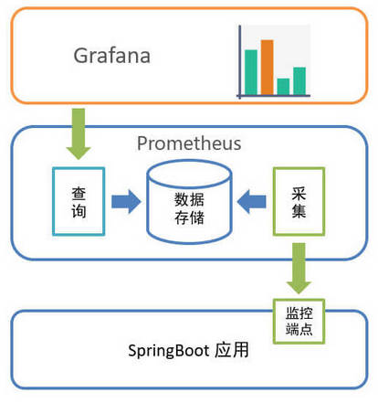
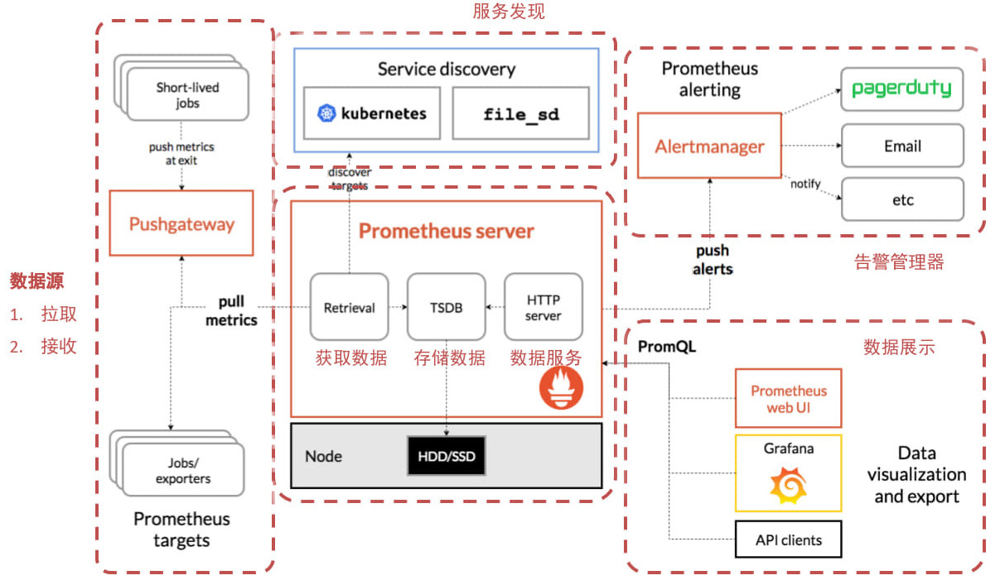
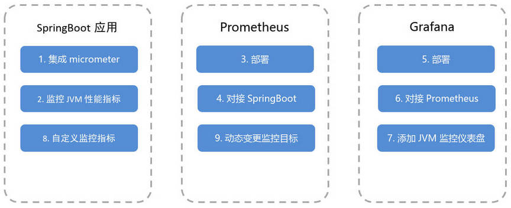
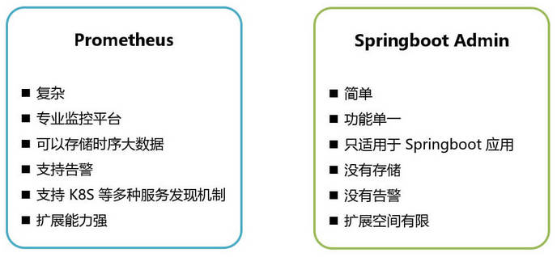

## 1. Prometheus 概述

Prometheus （普罗米修斯）是一个开源的系统监控与告警工具，用于**收集、存储监控数据，并提供数据查询服务**。

SpringBoot 的 actuator 提供了监控端点，SpringBoot2 中引入了 micrometer，可以更方便的对接各种监控系统，包括 Prometheus。

Grafana 是**专业 UI 仪表盘系统**，支持 Prometheus 数据源。

### 1.1. Prometheus 架构

## 2. Prometheus + Grafana 监控实践

### 2.1. 实践流程

## 3. 其他

### 3.1. Prometheus 与 SpringbootAdmin 区别

