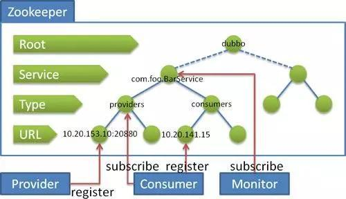

## 1. Zookeeper 典型应用场景概述

Zookeeper 是一个典型的发布/订阅模式的分布式数据管理与协调框架。通过对 Zookeeper 中丰富的数据节点进行交叉使用，配合 Watcher 事件通知机制，可以非常方便的构建一系列分布式应用中涉及的核心功能，如：

- 数据发布/订阅
- 负载均衡
- 命名服务
- 分布式协调/通知
- 集群管理
- Master 选举
- 分布式锁
- 分布式队列

## 2. 数据发布/订阅系统（待整理）

### 2.1. 概述

数据发布/订阅系统，就是发布者发布数据供订阅者进行数据订阅。例如：配置中心

场景实现的功能：

- 动态获取数据（配置信息）
- 实现数据（配置信息）的集中式管理和数据的动态更新

涉及的设计模式：

- Push 模式
- Pull 模式

数据（配置信息）特性：

- 数据量通常比较小
- 数据内容在运行时会发生动态更新
- 集群中各机器共享，配置一致

> 如：机器列表信息、运行时开关配置、数据库配置信息等

### 2.2. 基于 Zookeeper 的实现思路

- 数据存储：将数据（配置信息）存储到 Zookeeper 上的一个数据节点。
- 数据获取：应用在启动初始化节点从 Zookeeper 数据节点读取数据，并在该节点上注册一个数据变更 Watcher
- 数据变更：当变更数据时，更新 Zookeeper 对应节点数据，Zookeeper 会将数据变更通知发到各客户端，客户端接到通知后重新读取变更后的数据即可。

## 3. 命名服务（待整理）

命名服务是指通过指定的名字来获取资源或者服务的地址，利用 Zookeeper 创建一个全局的路径，即是唯一的路径，这个路径就可以作为一个名字，指向集群中的集群，提供的服务的地址，或者一个远程的对象等等。

## 4. 分布式锁

分布式锁有多种实现方式，比如通过数据库、redis 都可实现。作为分布式协同工具 ZooKeeper，也有着标准的实现方式。

### 4.1. 独占锁

在 zookeeper 中如何实现独占锁，设计思路如下：

1. 每个 Zookeeper 客户端往 Zookeeper 服务端中创建临时节点（如：`/lock`），因为同级目录下，只能创建一个同名的节点，所以N个客户端只有一个客户端可以成功创建节点
2. 成功创建节点的客户端相当于成功获取锁，继续执行相关的业务逻辑
3. 其他创建失败的客户端，进行等待，同时创建`Watcher`，监听临时节点`/lock`
4. 成功获取锁的客户端在执行完成业务逻辑后，只需要关闭连接，此时临时节点就会被删除，相当于释放锁。其他所有监听该节点的客户端全部开始重新创建临时节点`/lock`，竞争锁
5. 当某个客户成功竞争到锁后，重复上述的逻辑

### 4.2. 排他锁

在 zookeeper 中如何实现排他锁，设计思路如下：

1. 每个客户端往/Locks下创建临时有序节点/Locks/Lock_，创建成功后/Locks下面会有每个客户端对应的节点，如/Locks/Lock_000000001
2. 客户端取得/Locks下子节点，并进行排序，判断排在最前面的是否为自己，如果自己的锁节点在第一位，代表获取锁成功
3. 如果自己的锁节点不在第一位，则监听自己前一位的锁节点。例如，自己锁节点Lock_000000002，那么则监听Lock_000000001
4. 当前一位锁节点（Lock_000000001）对应的客户端执行完成，释放了锁，将会触发监听客户端（Lock_000000002）的逻辑
5. 监听客户端重新执行第2步逻辑，判断自己是否获得了锁

### 4.3. 控制时序

设计思路：在 Zookeeper 服务端中原已存在的节点（如：`/distribute_lock`），所有客户端在它下面创建临时顺序编号目录节点，编号最小的获得锁，使用完后删除其节点，依次获取。

## 5. 配置中心（待整理）

多个应用分别部署在不同的机器上，将各个应用的配置信息放在 Zookeeper 的 znode 下。当有配置发生改变时，也就是 znode 发生变化时，可以通过改变 Zookeeper 中某个目录节点的内容，利用 watcher 通知给各个客户端，从而动态更改配置。

## 6. 生成分布式唯一 ID（待整理）

> TODO: 整理中

## 7. Dubbo 的注册中心

Dubbo 作为管理业务层的服务接入者和服务提供者的框架，完成服务的调度必须要有一个分布式的注册中心。而 Dubbo 的将注册中心进行抽象，它可以外接不同的存储媒介给注册中心提供服务，有 ZooKeeper，Memcached，Redis 等。而 ZooKeeper 

- 单注册中心的承载能力是有限的，在流量达到一定程度的时候就需要通过负载均衡来分流，ZooKeeper 群配合相应的 Web 应用就可以很容易达到负载均衡
- 节点之间的数据和资源需要同步，ZooKeeper 集群就天然具备有此功能
- 命名服务，将树状结构用于维护全局的服务地址列表，服务提供者在启动的时候，向 ZooKeeper 上的指定节点 `/dubbo/${serviceName}/providers` 目录下写入自己的 URL 地址，从而完成了服务的发布
- 其他特性还有 Mast 选举，分布式锁等。

## 8. Zookeeper 队列管理（待整理）

两种类型的队列：

1. 同步队列，当一个队列的成员都聚齐时，这个队列才可用，否则一直等待所有成员到达。

实现思路：在约定目录下创建临时目录节点，监听节点数目是否是要求的数目。

2. 队列按照 FIFO 方式进行入队和出队操作。

实现思路：和分布式锁服务中的控制时序场景基本原理一致，入列有编号，再按编号出列。在特定的目录下创建 `PERSISTENT_SEQUENTIAL` 节点，创建成功时 Watcher 通知等待的队列，队列删除序列号最小的节点用以消费。此场景下 Zookeeper 的 znode 用于消息存储，znode 存储的数据就是消息队列中的消息内容，SEQUENTIAL 序列号就是消息的编号，按序取出即可。由于创建的节点是持久化的，所以不必担心队列消息的丢失问题。

## 9. 集群管理（待整理）

集群管理核心点在于：

1. 是否有服务器加入或者退出。
2. 选举 Master。

对于第1点的实现思路是，所有机器约定在父目录下创建临时目录节点，然后监听父目录节点的子节点变化消息。一旦有机器挂掉，该机器与 zookeeper 的连接断开，其所创建的临时目录节点被删除，所有其他机器都收到通知；新机器加入也是类似，在父目录节点下增加子节点，所有机器也会收到通知。

对于第2点的实现思路是，所有机器创建临时顺序编号目录节点，每次选取编号最小的机器作为 master 即可。
