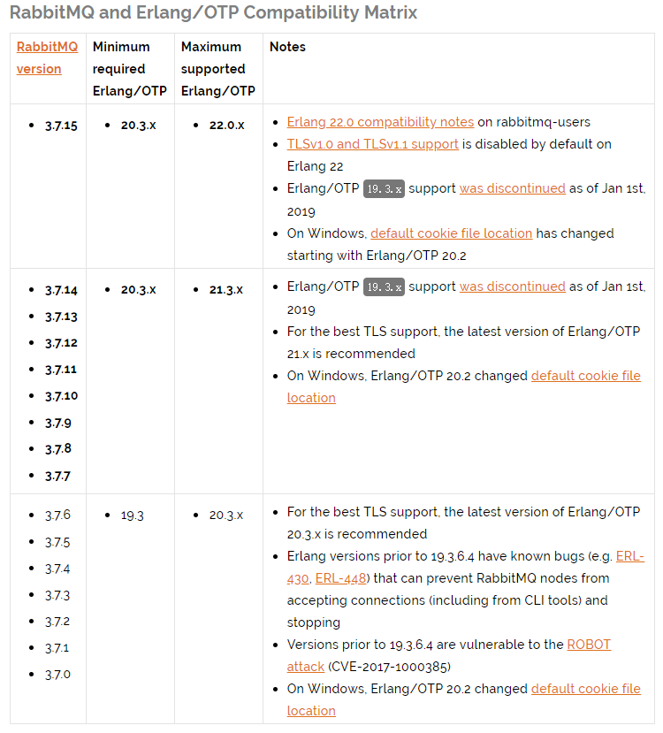
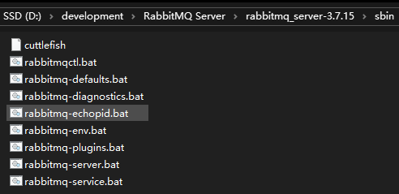
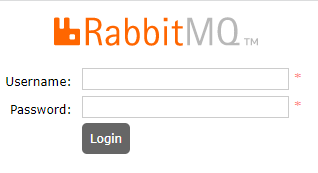
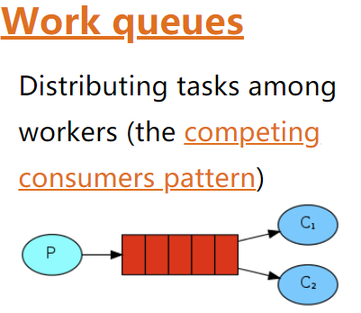
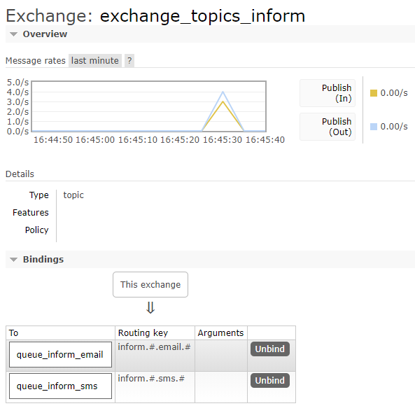
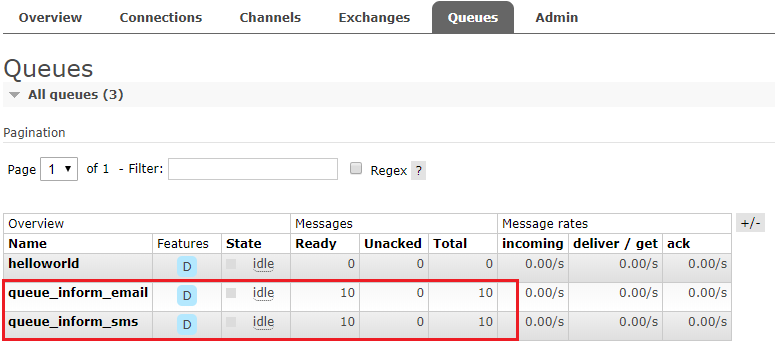

## 1. RabbitMQ 简介

> RabbitMQ 官方地址：http://www.rabbitmq.com/

MQ 全称为 Message Queue，即消息队列， RabbitMQ 是由 erlang 语言开发，基于 AMQP（Advanced Message Queue 高级消息队列协议）协议实现的消息队列，它是一种应用程序之间的通信方法，实现服务之间的高度解耦。消息队列在分布式系统开发中应用非常广泛，市场上还有其他的消息队列框架，如：ActiveMQ，ZeroMQ，Kafka，MetaMQ，RocketMQ、Redis。

### 1.1. RabbitMQ 的特点

1. 遵循 AMQP 标准协议开发的 MQ 服务
2. 使得简单，功能强大。在分布式系统下具备异步，削峰，负载均衡等一系列高级功能。
3. 社区活跃，文档完善。
4. 高并发性能好，这主要得益于 Erlang 语言。
5. Spring Boot 默认已集成 RabbitMQ。
6. 拥有持久化的机制，进程消息，队列中的信息也可以保存下来。
7. 实现消费者和生产者之间的解耦。
8. 对于高并发场景下，利用消息队列可以使得同步访问变为串行访问达到一定量的限流，利于数据库的操作。

### 1.2. RabbitMQ 的基本结构


组成部分说明如下

- Message：由消息头和消息体组成。消息体是不透明的，而消息头则由一系列的可选属性组成，这些属性包括 `routing-key`、`priority`、`delivery-mode`（是否持久性存储）等。
- Broker：消息队列服务进程，此进程包括两个部分：Exchange 和 Queue。
- Exchange：消息队列交换机，接收消息并按一定的规则将消息路由转发到一个或多个队列(Queue)，对消息进行过滤。`default exchange` 是默认的直连交换机，名字为空字符串，每个新建队列都会自动绑定到默认交换机上，绑定的路由键名称与队列名称相同。
- Queue：存储消息的队列，消息到达队列并转发给指定的消费方。队列的特性是先进先出。一个消息可分发到一个或多个队列。
- Binding：将 Exchange 和 Queue 进行关联，让 Exchange 就知道将消息路由到哪个 Queue 中。
- Producer：消息生产者，即生产方客户端，生产方客户端将消息发送到 MQ。
- Consumer：消息消费者，即消费方客户端，接收 MQ 转发的消息。
- Channel：消息通道，在客户端的每个连接里，可建立多个 channel，每个 channel 代表一个会话任务由 Exchange、Queue、RoutingKey 三个要素才能决定一个从 Exchange 到 Queue 的唯一的线路。

#### 1.2.1. Virtual host（虚拟主机）

RabbitMQ 中虚拟主机（vhost） 是 AMQP 概念的基础，必须在连接时指定，RabbitMQ 默认的 vhost 是 `/`。有以下作用：

1. **隔离性**：虚拟主机在单个 RabbitMQ 服务器上提供逻辑上的隔离。每个 vhost 本质上是一个独立的 mini 版的 RabbitMQ 服务器，拥有自己的队列、交换器、绑定和权限机制。
2. **权限控制**：可以对不同的 vhost 设置不同的访问权限，控制用户对于特定 vhost 中资源的访问。
3. **资源管理**：在不同的 vhost 中管理队列、交换器等，使得结构更加清晰，便于维护。

当多个不同的用户使用同一个 RabbitMQ server 提供的服务时，可以划分出多个 vhost，每个用户在自己的 vhost 创建 exchange 和 queue。

### 1.3. 消息发布与接收流程

**发送消息**

1. 生产者和 Broker 建立 TCP 连接
2. 生产者和 Broker 建立通道
3. 生产者通过通道消息发送给 Broker，由 Exchange 将消息进行转发
4. Exchange 将消息转发到指定的 Queue（队列）

**接收消息**

1. 消费者和 Broker 建立 TCP 连接
2. 消费者和 Broker 建立通道
3. 消费者监听指定的 Queue（队列）
4. 当有消息到达 Queue 时 Broker 默认将消息推送给消费者
5. 消费者接收到消息

## 2. RabbitMQ 快速入门

### 2.1. window 版安装

#### 2.1.1. 说明

RabbitMQ 由 Erlang 语言开发，Erlang 语言用于并发及分布式系统的开发，在电信领域应用广泛，OTP（Open Telecom Platform）作为 Erlang 语言的一部分，包含了很多基于 Erlang 开发的中间件及工具库，安装 RabbitMQ 需要安装 Erlang/OTP，并保持版本匹配，如下图：



本次测试使用 Erlang/OTP 22.0 版本和 RabbitMQ 3.7.15 版本。

#### 2.1.2. Erlang 下载与安装

erlang 下载地址：http://www.erlang.org/downloads


下载安装包后，<font color=red>**以管理员方式运行安装**</font>。安装的过程中可能会出现依赖 Windows 组件的提示，根据提示下载安装即可，都是自动执行的，如下：


erlang 安装完成后，需要配置 erlang 的环境变量，否则 RabbitMQ 将无法找到安装的 Erlang

```
ERLANG_HOME=D:\development\erl10.4
```

在 path 变量中添加

```
%ERLANG_HOME%\bin;
```

#### 2.1.3. RabbitMQ 下载与安装

RabbitMQ 的下载地址：http://www.rabbitmq.com/download.html

安装包下载完成后，<font color=red>**以管理员方式运行 RabbitMQ 安装文件**</font>。

官方安装说明文档：https://www.rabbitmq.com/install-windows.html

#### 2.1.4. 启动

安装成功后会自动创建 RabbitMQ 服务并且启动，默认对外服务端口是 5672

1. 从开始菜单启动 RabbitMQ


2. 如果没有开始菜单则进入安装目录下 sbin 目录手动启动



- 安装并运行服务

```shell
rabbitmq-service.bat install # 安装服务
rabbitmq-service.bat stop # 停止服务
rabbitmq-service.bat start # 启动服务
```

#### 2.1.5. 安装管理插件

RabbitMQ 也提供有 web 控制台服务，但是此功能是一个插件，需要先启用才可以使用。安装 rabbitMQ 的管理插件，方便在浏览器端管理 RabbitMQ。以管理员身份运行 cmd 命令行，执行以下命令：

```shell
./rabbitmq-plugins.bat list                          # 查看当前所有插件的运行状态
./rabbitmq-plugins.bat enable rabbitmq_management    # 启动rabbitmq_management插件
```

安装管理插件启动成功后，打开浏览器访问：http://localhost:15672



初始化用户名和密码均为：guest，成功登录后进入管理后台界面，如下：


#### 2.1.6. 注意事项

1. 安装 erlang 和 rabbitMQ 都以管理员身份运行。
2. 当卸载重新安装时会出现 RabbitMQ 服务注册失败，此时需要进入注册表清理 erlang，搜索 RabbitMQ、ErlSrv，将对应的项全部删除。

### 2.2. Linux 版安装

#### 2.2.1. 使用 Docker 安装部署 RabbitMQ

1. `docker search rabbitmq:management`：查询RabbitMQ的镜像
2. `docker pull rabbitmq:management`：拉取RabbitMQ镜像，**注意：如果docker pull rabbitmq 后面不带management，启动rabbitmq后是无法打开管理界面的，所以我们要下载带management插件的rabbitmq.**
3. 创建rabbitmq容器

```shell
# 创建rabbitmq容器
docker run -id --name moon_rabbitmq -p 5671:5671 -p 5672:5672 -p 4369:4369 -p 25672:25672 -p 15671:15671 -p 15672:15672 rabbitmq:management
```
**映射的端口说明**：4369 (epmd)；25672 (Erlang distribution)；5672, 5671 (AMQP 0-9-1 without and with TLS)应用访问端口号；15671，15672 (if management plugin is enabled)控制台端口号；61613, 61614 (if STOMP is enabled)；1883, 8883 (if MQTT is enabled)；

4. 开放端口防火墙

```shell
# 对外开放8080端口
firewall-cmd --zone=public --add-port=8080/tcp --permanent
    # 注：–zone：作用域
        # –add-port=8080/tcp：添加端口，格式为：端口/通讯协议
        # –permanent：永久生效，没有此参数重启后失效

# 重启防火墙
firewall-cmd --reload
# 查看已经开放的端口
firewall-cmd --list-ports

# 停止防火墙
systemctl stop firewalld.service
# 启动防火墙
systemctl start firewalld.service
# 禁止防火墙开机启动
systemctl disable firewalld.service
```

#### 2.2.2. 传统方式安装部署 RabbitMQ（待整理）

> TODO: 待整理

### 2.3. 测试使用

按照[官方教程文档](http://www.rabbitmq.com/getstarted.html)，测试 hello world

#### 2.3.1. 搭建环境

##### 2.3.1.1. Java client

生产者和消费者都属于客户端，rabbitMQ 的 java 客户端参考：https://github.com/rabbitmq/rabbitmq-java-client/

先用 rabbitMQ 官方提供的 java client 测试，目的是对 RabbitMQ 的交互过程有个清晰的认识。

##### 2.3.1.2. 创建maven工程

创建生产者工程和消费者工程，分别加入 RabbitMQ java client 的依赖。

- **test-rabbitmq-producer**：生产者工程
- **test-rabbitmq-consumer**：消费者工程

```xml
<dependencies>
    <dependency>
        <groupId>com.rabbitmq</groupId>
        <artifactId>amqp-client</artifactId>
        <!-- 此版本与spring boot 1.5.9版本匹配 -->
        <version>4.0.3</version>
    </dependency>
    <dependency>
        <groupId>org.springframework.boot</groupId>
        <artifactId>spring-boot-starter-logging</artifactId>
    </dependency>
</dependencies>
```

#### 2.3.2. 生产者

在生产者工程下的 test 中创建测试类如下

```java
/**
 * RabbitMQ的入门程序
 */
public class Producer01 {

    /* 定义队列的名称 */
    private static final String QUEUE = "helloworld";

    public static void main(String[] args) {

        Connection connection = null;
        Channel channel = null;

        try {
            // 通过连接工厂创建新的连接和mq建立连接
            ConnectionFactory connectionFactory = new ConnectionFactory();
            connectionFactory.setHost("192.168.12.132");    // 设置RabbitMQ服务主机地址
            connectionFactory.setPort(5672);    // 设置端口号
            connectionFactory.setUsername("guest"); //设置用户名与密码
            connectionFactory.setPassword("guest");
            /* 设置虚拟机。rabbitmq默认虚拟机名称为“/”，一个mq服务可以设置多个虚拟机，每个虚拟机就相当于一个独立的mq */
            connectionFactory.setVirtualHost("/");

            // 创建与RabbitMQ服务的TCP连接
            connection = connectionFactory.newConnection();
            // 创建与Exchange的会话通道，生产者和mq服务所有通信都在channel通道中完成，每个连接可以创建多个通道，每个通道代表一个会话任务
            channel = connection.createChannel();

            /*
             * 声明队列，如果队列在RabbitMQ中没有则将自动创建
             *      Queue.DeclareOk queueDeclare(String queue, boolean durable,
             *                                   boolean exclusive, boolean autoDelete,
             *                                   Map<String, Object> arguments) throws IOException;
             *  参数明细
             *      1、queue 队列名称
             *      2、durable 是否持久化，如果持久化，mq重启后队列还在
             *      3、exclusive 是否独占连接，队列只允许在该连接中访问，如果connection连接关闭队列则自动删除,如果将此参数设置true可用于临时队列的创建
             *      4、autoDelete 自动删除，队列不再使用时是否自动删除此队列，如果将此参数和exclusive参数设置为true就可以实现临时队列（队列不用了就自动删除）
             *      5、arguments 参数，可以设置一个队列的扩展参数，比如：可设置存活时间
             */
            channel.queueDeclare(QUEUE, true, false, false, null);

            /*
             *  消息发布的方法
             *      void basicPublish(String exchange, String routingKey, boolean mandatory, BasicProperties props, byte[] body) throws IOException;
             *  参数明细
             *      1、exchange，交换机名称，如果不指定将使用mq的默认交换机Default Exchange（设置为""）
             *      2、routingKey，消息路由key，交换机根据路由key来将消息转发到指定的队列，如果使用默认交换机，routingKey设置为队列的名称
             *      3、props，消息包含的属性
             *      4、body，消息内容，字节数组
             *  注：这里没有指定交换机，消息将发送给默认交换机，每个队列也会绑定那个默认的交换机，但是不能显示绑定或解除绑定
             *      默认的交换机，routingKey等于队列名称
             */
            String message = "Hello! MooNkirA!";
            channel.basicPublish("", QUEUE, null, message.getBytes());
            System.out.println("send to mq " + message);

        } catch (Exception ex) {
            ex.printStackTrace();
        } finally {
            // 关闭资源，先关闭通道，再关闭连接
            if (channel != null) {
                try {
                    channel.close();
                } catch (IOException e) {
                    e.printStackTrace();
                } catch (TimeoutException e) {
                    e.printStackTrace();
                }
            }
            if (connection != null) {
                try {
                    connection.close();
                } catch (IOException e) {
                    e.printStackTrace();
                }
            }

        }
    }
}
```

#### 2.3.3. 消费者

在消费者工程下的 test 中创建测试类如下

```java
/**
 * 入门程序消费者
 */
public class Consumer01 {

    /* 定义队列的名称 */
    private static final String QUEUE = "helloworld";

    public static void main(String[] args) throws IOException, TimeoutException {

        // 通过连接工厂创建新的连接和mq建立连接
        ConnectionFactory connectionFactory = new ConnectionFactory();
        connectionFactory.setHost("192.168.12.132");    // 设置RabbitMQ服务主机地址
        connectionFactory.setPort(5672);    // 设置端口号
        connectionFactory.setUsername("guest"); //设置用户名与密码
        connectionFactory.setPassword("guest");
        /* 设置虚拟机。rabbitmq默认虚拟机名称为“/”，一个mq服务可以设置多个虚拟机，每个虚拟机就相当于一个独立的mq */
        connectionFactory.setVirtualHost("/");

        // 创建与RabbitMQ服务的TCP连接
        Connection connection = connectionFactory.newConnection();
        // 创建与Exchange的会话通道，生产者和mq服务所有通信都在channel通道中完成，每个连接可以创建多个通道，每个通道代表一个会话任务
        Channel channel = connection.createChannel();

        /*
         * 监听队列，声明队列，如果队列在RabbitMQ中没有则将自动创建
         *      Queue.DeclareOk queueDeclare(String queue, boolean durable,
         *                                   boolean exclusive, boolean autoDelete,
         *                                   Map<String, Object> arguments) throws IOException;
         *  参数明细
         *      1、queue 队列名称
         *      2、durable 是否持久化，如果持久化，mq重启后队列还在
         *      3、exclusive 是否独占连接，队列只允许在该连接中访问，如果connection连接关闭队列则自动删除,如果将此参数设置true可用于临时队列的创建
         *      4、autoDelete 自动删除，队列不再使用时是否自动删除此队列，如果将此参数和exclusive参数设置为true就可以实现临时队列（队列不用了就自动删除）
         *      5、arguments 参数，可以设置一个队列的扩展参数，比如：可设置存活时间
         */
        channel.queueDeclare(QUEUE, true, false, false, null);

        /* 实现消费方法（重写） */
        DefaultConsumer consumer = new DefaultConsumer(channel) {
            /**
             * 当消费者接收到消息后，此方法将被调用
             *
             * @param consumerTag 消费者标签，用来标识消费者的，在监听队列时设置channel.basicConsume
             * @param envelope    信封，消息包的内容，可从中获取消息id，消息routingkey，交换机，消息和重传标志(收到消息失败后是否需要重新发送)
             * @param properties  消息属性
             * @param body        消息内容
             */
            @Override
            public void handleDelivery(String consumerTag, Envelope envelope, AMQP.BasicProperties properties, byte[] body) throws IOException {
                // 获取交换机
                String exchange = envelope.getExchange();
                // 路由key
                String routingKey = envelope.getRoutingKey();
                // 消息id，mq在channel中用来标识消息的id，可用于确认消息已接收
                long deliveryTag = envelope.getDeliveryTag();
                System.out.println("交换机exchange：" + exchange + "；路由routingKey：" + routingKey + "；消息id：" + deliveryTag);

                // 消息内容
                String message = new String(body, StandardCharsets.UTF_8);
                System.out.println("receive message:" + message);
            }
        };

        /*
         *  监听队列
         *      String basicConsume(String queue, boolean autoAck, Consumer callback) throws IOException;
         *  参数明细
         *      1、queue 队列名称
         *      2、autoAck 是否自动回复，当消费者接收到消息后要告诉mq消息已接收，如果将此参数设置为tru表示会自动回复mq，如果设置为false要通过编程实现回复
         *      3、callback，消费方法，当消费者接收到消息要执行的方法
         */
        channel.basicConsume(QUEUE, true, consumer);
    }
}
```

#### 2.3.4. 总结

发送端操作流程

1. 创建连接
2. 创建通道
3. 声明队列
4. 发送消息

接收端操作流程

1. 创建连接
2. 创建通道
3. 声明队列
4. 监听队列
5. 接收消息
6. ack回复

## 3. 工作模式

RabbitMQ 有以下几种工作模式：

1. Work queues
2. Publish/Subscribe
3. Routing
4. Topics
5. Header
6. RPC

### 3.1. Exchange 交换机的类型

根据 RabbitMQ 不同类型的工作模式会选择不同类型的 Exchange，在分发消息时会选择不同的分发策略，目前共四种类型：direct、fanout、topic、headers。

其中 headers 模式根据消息的 headers 进行路由，此外 headers 交换器和 direct 交换器完全一致，但性能差很多。

| 类型名称  |                                             类型描述                                             |    相应的工作模式    |
| ------- | ----------------------------------------------------------------------------------------------- | ----------------- |
| fanout  | 把所有发送到该Exchange的消息路由到所有与它绑定的Queue中                                               | publish/subscribe |
| direct  | 发送到Routing Key与Binding Key完全匹配的的Queue中                                                  | Routing           |
| topic   | 模糊匹配                                                                                         | Topics            |
| headers | Exchange不依赖于routing key与binding key的匹配规则来路由消息，而是根据发送的消息内容中的header属性进行匹配 | headers           |

#### 3.1.1. fanout

所有发到 fanout 类型交换机的消息都会路由到所有与该交换机绑定的队列。fanout 类型转发消息是最快的。


#### 3.1.2. direct

direct 交换机会将消息路由到 binding key 和 routing key 完全匹配的队列中。它是完全匹配、单播的模式。


#### 3.1.3. topic

topic 交换机使用 routing key 和 binding key 进行模糊匹配，匹配成功则将消息发送到相应的队列。routing key 和 binding key 都是句号 `.` 作为分隔的字符串，binding key 中可以存在两种特殊字符 `*` 与 `#`，用于做模糊匹配，其中 `*` 用于匹配一个单词，`#` 用于匹配多个单词。


#### 3.1.4. headers

headers 交换机是根据发送的消息内容中的 headers 属性进行路由的。在绑定 Queue 与 Exchange 时指定一组键值对；当消息发送到 Exchange 时，RabbitMQ 会取到该消息的 headers（也是一个键值对的形式），对比其中的键值对是否完全匹配 Queue 与 Exchange 绑定时指定的键值对；如果完全匹配则消息会路由到该 Queue，否则不会路由到该 Queue。

### 3.2. Work queues 工作队列(多个消费者监听同一个队列)



Work queues 与入门程序相比，只是多了一个消费端，两个消费端共同消费同一个队列中的消息。

Work queues 工作队列应用场景：对于任务过重或任务较多情况使用工作队列可以提高任务处理的速度。

测试流程：

1. 使用入门程序，启动多个消费者
2. 生产者发送多个消息

测试结果：

1. 一条消息只会被一个消费者接收；
2. rabbitmq 采用<font color=red>**轮询**</font>的方式将消息是平均发送给消费者的；
3. 消费者在处理完某条消息后，才会收到下一条消息

### 3.3. Publish/Subscribe 发布订阅工作模式


发布订阅模式：

1. 每个消费者监听自己的队列。
2. 生产者将消息发给 broker，由交换机将消息转发到绑定此交换机的每个队列，每个绑定交换机的队列都将接收到消息

#### 3.3.1. 案例代码

用户通知，当用户充值成功或转账完成系统通知用户，通知方式有短信、邮件多种方法 。

##### 3.3.1.1. 生产者

- 声明 Exchange_fanout_inform 交换机。
- 声明两个队列并且绑定到此交换机，绑定时不需要指定 routingkey
- 发送消息时不需要指定 routingkey

```java
/**
 * RabbitMQ - Publish/subscribe 工作模式
 */
public class Producer02_publish {

    /* 定义队列的名称 */
    private static final String QUEUE_INFORM_EMAIL = "queue_inform_email";
    private static final String QUEUE_INFORM_SMS = "queue_inform_sms";
    /* 定义交换机名称 */
    private static final String EXCHANGE_FANOUT_INFORM = "exchange_fanout_inform";

    public static void main(String[] args) {

        Connection connection = null;
        Channel channel = null;

        try {
            // 通过连接工厂创建新的连接和mq建立连接
            ConnectionFactory connectionFactory = new ConnectionFactory();
            connectionFactory.setHost("192.168.12.132");
            connectionFactory.setPort(5672);
            connectionFactory.setUsername("guest");
            connectionFactory.setPassword("guest");
            connectionFactory.setVirtualHost("/");

            // 创建与RabbitMQ服务的TCP连接
            connection = connectionFactory.newConnection();
            // 创建与Exchange的会话通道
            channel = connection.createChannel();

            // 声明两个队列
            channel.queueDeclare(QUEUE_INFORM_EMAIL, true, false, false, null);
            channel.queueDeclare(QUEUE_INFORM_SMS, true, false, false, null);

            /*
             *  声明一个交换机
             *      Exchange.DeclareOk exchangeDeclare(String exchange, BuiltinExchangeType type) throws IOException;
             *  参数明细
             *      1、交换机的名称
             *      2、交换机的类型
             *          fanout：对应的rabbitmq的工作模式是 publish/subscribe
             *          direct：对应的Routing工作模式
             *          topic：对应的Topics工作模式
             *          headers：对应的headers工作模式
             */
            channel.exchangeDeclare(EXCHANGE_FANOUT_INFORM, BuiltinExchangeType.FANOUT);

            /*
             *  交换机和队列绑定
             *      Queue.BindOk queueBind(String queue, String exchange, String routingKey) throws IOException;
             *  参数明细
             *      1、queue 队列名称
             *      2、exchange 交换机名称
             *      3、routingKey 路由key，作用是交换机根据路由key的值将消息转发到指定的队列中，在发布订阅模式中调协为空字符串
             */
            channel.queueBind(QUEUE_INFORM_EMAIL, EXCHANGE_FANOUT_INFORM, "");
            channel.queueBind(QUEUE_INFORM_SMS, EXCHANGE_FANOUT_INFORM, "");

            // 发送消息
            for (int i = 0; i < 5; i++) {
                String message = "send inform message to user! NO." + i;
                channel.basicPublish(EXCHANGE_FANOUT_INFORM, "", null, message.getBytes());
                System.out.println("send to mq " + message);
            }

        } catch (Exception ex) {
            ex.printStackTrace();
        } finally {
            // 关闭资源，先关闭通道，再关闭连接
            if (channel != null) {
                try {
                    channel.close();
                } catch (IOException e) {
                    e.printStackTrace();
                } catch (TimeoutException e) {
                    e.printStackTrace();
                }
            }
            if (connection != null) {
                try {
                    connection.close();
                } catch (IOException e) {
                    e.printStackTrace();
                }
            }
        }
    }
}
```

##### 3.3.1.2. 邮件发送消费者

```java
/**
 * RabbitMQ消费者（消费邮件队列） - Publish/subscribe 工作模式
 */
public class Consumer02_subscribe_email {

    /* 定义队列的名称 */
    private static final String QUEUE_INFORM_EMAIL = "queue_inform_email";
    /* 定义交换机的名称 */
    private static final String EXCHANGE_FANOUT_INFORM = "exchange_fanout_inform";

    public static void main(String[] args) throws IOException, TimeoutException {
        // 通过连接工厂创建新的连接和mq建立连接
        ConnectionFactory connectionFactory = new ConnectionFactory();
        connectionFactory.setHost("192.168.12.132");
        connectionFactory.setPort(5672);
        connectionFactory.setUsername("guest");
        connectionFactory.setPassword("guest");
        connectionFactory.setVirtualHost("/");

        // 创建与RabbitMQ服务的TCP连接
        Connection connection = connectionFactory.newConnection();
        // 创建与Exchange的会话通道
        Channel channel = connection.createChannel();

        // 声明监听的队列，如果队列在RabbitMQ中没有则将自动创建
        channel.queueDeclare(QUEUE_INFORM_EMAIL, true, false, false, null);
        // 声明一个交换机
        channel.exchangeDeclare(EXCHANGE_FANOUT_INFORM, BuiltinExchangeType.FANOUT);
        // 进行交换机和队列绑定
        channel.queueBind(QUEUE_INFORM_EMAIL, EXCHANGE_FANOUT_INFORM, "");

        /* 实现消费方法（重写） */
        DefaultConsumer consumer = new DefaultConsumer(channel) {
            /**
             * 当消费者接收到消息后，此方法将被调用
             *
             * @param consumerTag 消费者标签，用来标识消费者的，在监听队列时设置channel.basicConsume
             * @param envelope    信封，消息包的内容，可从中获取消息id，消息routingkey，交换机，消息和重传标志(收到消息失败后是否需要重新发送)
             * @param properties  消息属性
             * @param body        消息内容
             */
            @Override
            public void handleDelivery(String consumerTag, Envelope envelope, AMQP.BasicProperties properties, byte[] body) throws IOException {
                // 获取交换机
                String exchange = envelope.getExchange();
                // 路由key
                String routingKey = envelope.getRoutingKey();
                // 消息id，mq在channel中用来标识消息的id，可用于确认消息已接收
                long deliveryTag = envelope.getDeliveryTag();
                System.out.println("交换机exchange：" + exchange + "；路由routingKey：" + routingKey + "；消息id：" + deliveryTag);

                // 消息内容
                String message = new String(body, StandardCharsets.UTF_8);
                System.out.println("receive message:" + message);
            }
        };

        // 监听队列
        channel.basicConsume(QUEUE_INFORM_EMAIL, true, consumer);
    }
}
```

##### 3.3.1.3. 短信发送消费者

参考上边的邮件发送消费者代码编写。*只需要将邮件队列的名称换成短信队列即可*

```java
/* 定义队列的名称 */
private static final String QUEUE_INFORM_EMAIL = "queue_inform_email";
...
// 声明监听的队列，如果队列在RabbitMQ中没有则将自动创建
channel.queueDeclare(QUEUE_INFORM_EMAIL, true, false, false, null);
...
// 进行交换机和队列绑定
channel.queueBind(QUEUE_INFORM_SMS, EXCHANGE_FANOUT_INFORM, "");
...
// 监听队列
channel.basicConsume(QUEUE_INFORM_SMS, true, consumer);
```

#### 3.3.2. 测试

打开RabbitMQ的管理界面，观察交换机绑定情况：


使用生产者发送若干条消息，每条消息都转发到各个队列，每个消费者都接收到了消息


#### 3.3.3. 总结

1. **publish/subscribe与work queues有什么区别**
    - **区别**
        1. work queues不用定义交换机，而publish/subscribe需要定义交换机
        2. publish/subscribe的生产方是面向交换机发送消息，work queues的生产方是面向队列发送消息(底层使用默认交换机)
        3. publish/subscribe需要设置队列和交换机的绑定，work queues不需要设置，实质上work queues会将队列绑定到默认的交换机
    - **相同点**
        1. 两者实现的发布/订阅的效果是一样的，多个消费端监听同一个队列不会重复消费消息
2. **实质工作用什么 publish/subscribe还是work queues**
    - 建议使用 publish/subscribe，发布订阅模式比工作队列模式更强大，并且发布订阅模式可以指定自己专用的交换机

### 3.4. Routing 路由工作模式


**路由模式**：

1. 每个消费者监听自己的队列，并且设置 routingkey
2. 生产者将消息发给交换机，由交换机根据 routingkey 来转发消息到指定的队列

#### 3.4.1. RabbitMQ 消息实现路由的原理

消息路由必须有三部分：**交换器、路由、绑定**。生产者把消息发布到交换器上；绑定决定了消息如何从路由器路由到特定的队列；消息最终到达队列，并被消费者接收。

1. 消息发布到交换器时，消息将拥有一个路由键（routing key），在消息创建时设定。
2. 通过队列路由键，可以把队列绑定到交换器上。
3. 消息到达交换器后，RabbitMQ 会将消息的路由键与队列的路由键进行匹配（针对不同的交换器有不同的路由规则）。如果能够匹配到队列，则消息会投递到相应队列中。

#### 3.4.2. 案例代码

##### 3.4.2.1. 生产者

- 声明 exchange_routing_inform 交换机。
- 声明两个队列并且绑定到此交换机，绑定时需要指定 routingkey
- 发送消息时需要指定 routingkey

```java
/**
 * RabbitMQ生产者 - routing 工作模式
 */
public class Producer03_routing {

    /* 定义队列的名称 */
    private static final String QUEUE_INFORM_EMAIL = "queue_inform_email";
    private static final String QUEUE_INFORM_SMS = "queue_inform_sms";
    /* 定义交换机名称 */
    private static final String EXCHANGE_ROUTING_INFORM = "exchange_routing_inform";
    /* 定义路由名称 */
    private static final String ROUTINGKEY_EMAIL = "inform_email";
    private static final String ROUTINGKEY_SMS = "inform_sms";

    public static void main(String[] args) {

        Connection connection = null;
        Channel channel = null;

        try {
            // 通过连接工厂创建新的连接和mq建立连接
            ConnectionFactory connectionFactory = new ConnectionFactory();
            connectionFactory.setHost("192.168.12.132");
            connectionFactory.setPort(5672);
            connectionFactory.setUsername("guest");
            connectionFactory.setPassword("guest");
            connectionFactory.setVirtualHost("/");

            // 创建与RabbitMQ服务的TCP连接
            connection = connectionFactory.newConnection();
            // 创建与Exchange的会话通道
            channel = connection.createChannel();

            // 声明两个队列
            channel.queueDeclare(QUEUE_INFORM_EMAIL, true, false, false, null);
            channel.queueDeclare(QUEUE_INFORM_SMS, true, false, false, null);

            /*
             *  声明一个交换机
             *      Exchange.DeclareOk exchangeDeclare(String exchange, BuiltinExchangeType type) throws IOException;
             *  参数明细
             *      1、交换机的名称
             *      2、交换机的类型
             *          fanout：对应的rabbitmq的工作模式是 publish/subscribe
             *          direct：对应的Routing	工作模式
             *          topic：对应的Topics工作模式
             *          headers：对应的headers工作模式
             */
            channel.exchangeDeclare(EXCHANGE_ROUTING_INFORM, BuiltinExchangeType.DIRECT);

            /*
             *  交换机和队列绑定
             *      Queue.BindOk queueBind(String queue, String exchange, String routingKey) throws IOException;
             *  参数明细
             *      1、queue 队列名称
             *      2、exchange 交换机名称
             *      3、routingKey 路由key，作用是交换机根据路由key的值将消息转发到指定的队列中，在发布订阅模式中调协为空字符串
             */
            channel.queueBind(QUEUE_INFORM_EMAIL, EXCHANGE_ROUTING_INFORM, ROUTINGKEY_EMAIL);
            channel.queueBind(QUEUE_INFORM_EMAIL, EXCHANGE_ROUTING_INFORM, "inform");
            channel.queueBind(QUEUE_INFORM_SMS, EXCHANGE_ROUTING_INFORM, ROUTINGKEY_SMS);
            channel.queueBind(QUEUE_INFORM_SMS, EXCHANGE_ROUTING_INFORM, "inform");

            // 测试1：发送消息(指定routingKey为inform_email)
            /*for (int i = 0; i < 5; i++) {
                String message = "send email inform message to user! NO." + i;
                channel.basicPublish(EXCHANGE_ROUTING_INFORM, ROUTINGKEY_EMAIL, null, message.getBytes());
                System.out.println("send to mq " + message);
            }*/

            // 测试2：发送消息(指定routingKey为inform_sms)
            /*for (int i = 0; i < 5; i++) {
                String message = "send sms inform message to user! NO." + i;
                channel.basicPublish(EXCHANGE_ROUTING_INFORM, ROUTINGKEY_SMS, null, message.getBytes());
                System.out.println("send to mq " + message);
            }*/

            // 测试3：发送消息(指定routingKey为inform)
            for (int i = 0; i < 5; i++) {
                String message = "send inform message to user! NO." + i;
                channel.basicPublish(EXCHANGE_ROUTING_INFORM, "inform", null, message.getBytes());
                System.out.println("send to mq " + message);
            }

        } catch (Exception ex) {
            ex.printStackTrace();
        } finally {
            // 关闭资源，先关闭通道，再关闭连接
            if (channel != null) {
                try {
                    channel.close();
                } catch (IOException e) {
                    e.printStackTrace();
                } catch (TimeoutException e) {
                    e.printStackTrace();
                }
            }
            if (connection != null) {
                try {
                    connection.close();
                } catch (IOException e) {
                    e.printStackTrace();
                }
            }
        }
    }
}
```

##### 3.4.2.2. 邮件发送消费者

```java
/**
 * RabbitMQ消费者（消费邮件队列） - Routing 工作模式
 */
public class Consumer03_routing_email {

    /* 定义队列的名称 */
    private static final String QUEUE_INFORM_EMAIL = "queue_inform_email";
    /* 定义交换机的名称 */
    private static final String EXCHANGE_ROUTING_INFORM = "exchange_routing_inform";
    /* 定义路由的名称 */
    private static final String ROUTINGKEY_EMAIL = "inform_email";

    public static void main(String[] args) throws IOException, TimeoutException {
        // 通过连接工厂创建新的连接和mq建立连接
        ConnectionFactory connectionFactory = new ConnectionFactory();
        connectionFactory.setHost("192.168.12.132");
        connectionFactory.setPort(5672);
        connectionFactory.setUsername("guest");
        connectionFactory.setPassword("guest");
        connectionFactory.setVirtualHost("/");

        // 创建与RabbitMQ服务的TCP连接
        Connection connection = connectionFactory.newConnection();
        // 创建与Exchange的会话通道
        Channel channel = connection.createChannel();

        // 声明监听的队列，如果队列在RabbitMQ中没有则将自动创建
        channel.queueDeclare(QUEUE_INFORM_EMAIL, true, false, false, null);
        // 声明一个交换机（路由模式）
        channel.exchangeDeclare(EXCHANGE_ROUTING_INFORM, BuiltinExchangeType.DIRECT);
        // 进行交换机和队列绑定
        channel.queueBind(QUEUE_INFORM_EMAIL, EXCHANGE_ROUTING_INFORM, ROUTINGKEY_EMAIL);

        /* 实现消费方法（重写） */
        DefaultConsumer consumer = new DefaultConsumer(channel) {
            /**
             * 当消费者接收到消息后，此方法将被调用
             *
             * @param consumerTag 消费者标签，用来标识消费者的，在监听队列时设置channel.basicConsume
             * @param envelope    信封，消息包的内容，可从中获取消息id，消息routingkey，交换机，消息和重传标志(收到消息失败后是否需要重新发送)
             * @param properties  消息属性
             * @param body        消息内容
             */
            @Override
            public void handleDelivery(String consumerTag, Envelope envelope, AMQP.BasicProperties properties, byte[] body) throws IOException {
                // 获取交换机
                String exchange = envelope.getExchange();
                // 路由key
                String routingKey = envelope.getRoutingKey();
                // 消息id，mq在channel中用来标识消息的id，可用于确认消息已接收
                long deliveryTag = envelope.getDeliveryTag();
                System.out.println("交换机exchange：" + exchange + "；路由routingKey：" + routingKey + "；消息id：" + deliveryTag);

                // 消息内容
                String message = new String(body, StandardCharsets.UTF_8);
                System.out.println("receive message:" + message);
            }
        };

        // 监听队列
        channel.basicConsume(QUEUE_INFORM_EMAIL, true, consumer);
    }
}
```

##### 3.4.2.3. 短信发送消费者

参考邮件发送消费者的代码流程，编写短信通知的代码，修改队列名称与路由名称即可

```java
/* 定义队列的名称 */
private static final String QUEUE_INFORM_SMS = "queue_inform_sms";
/* 定义交换机的名称 */
private static final String EXCHANGE_ROUTING_INFORM = "exchange_routing_inform";
/* 定义路由的名称 */
private static final String ROUTINGKEY_SMS = "inform_sms";

...
// 声明监听的队列，如果队列在RabbitMQ中没有则将自动创建
channel.queueDeclare(QUEUE_INFORM_SMS, true, false, false, null);
...
// 进行交换机和队列绑定
channel.queueBind(QUEUE_INFORM_SMS, EXCHANGE_ROUTING_INFORM, ROUTINGKEY_SMS);
...
// 监听队列
channel.basicConsume(QUEUE_INFORM_SMS, true, consumer);
```

#### 3.4.3. 测试

打开 RabbitMQ 的管理界面，观察交换机绑定情况


使用生产者发送若干条消息，交换机根据routingkey转发消息到指定的队列

#### 3.4.4. 总结

**Routing 模式和Publish/subscibe 的区别**：Routing 模式要求队列在绑定交换机时要指定 routingkey，消息会转发到符合 routingkey 的队列

### 3.5. Topics 主题工作模式


**主题模式：**

1. 一个交换机可以绑定多个队列，每个队列可以设置一个或多个带统配符的 routingKey
2. 生产者将消息发给交换机，交换机根据 routingKey 的值来匹配队列，匹配时采用统配符方式，匹配成功的将消息转发到指定的队列
3. 每个消费者监听自己的队列，并且设置带统配符的 routingkey。
4. 生产者将消息发给 broker，由交换机根据 routingkey 来转发消息到指定的队列。

#### 3.5.1. 案例代码

案例：根据用户的通知设置去通知用户，设置接收 Email 的用户只接收 Email，设置接收 sms 的用户只接收 sms，设置两种通知类型都接收的则两种通知都有效。

##### 3.5.1.1. 生产者

声明交换机，指定topic类型

```java
/*
 *  声明一个交换机
 *      1、交换机的名称
 *      2、交换机的类型
 *          fanout：对应的rabbitmq的工作模式是 publish/subscribe
 *          direct：对应的Routing	工作模式
 *          topic：对应的Topics工作模式
 *          headers：对应的headers工作模式
 */
channel.exchangeDeclare(EXCHANGE_TOPICS_INFORM, BuiltinExchangeType.TOPIC);
/* Email通知 */
channel.basicPublish(EXCHANGE_TOPICS_INFORM, "inform.email", null, message.getBytes());
/* SMS通知 */
channel.basicPublish(EXCHANGE_TOPICS_INFORM, "inform.sms", null, message.getBytes());
/* 两种类型都通知 */
channel.basicPublish(EXCHANGE_TOPICS_INFORM, "inform.sms.email", null, message.getBytes());
```

完整代码

```java
/**
 * RabbitMQ生产者 - topics 工作模式
 */
public class Producer04_topics {

    /* 定义队列的名称 */
    private static final String QUEUE_INFORM_EMAIL = "queue_inform_email";
    private static final String QUEUE_INFORM_SMS = "queue_inform_sms";
    /* 定义交换机名称 */
    private static final String EXCHANGE_TOPICS_INFORM = "exchange_topics_inform";
    /* 定义路由名称(带通配符) */
    private static final String ROUTINGKEY_EMAIL = "inform.#.email.#";
    private static final String ROUTINGKEY_SMS = "inform.#.sms.#";

    public static void main(String[] args) {

        Connection connection = null;
        Channel channel = null;

        try {
            // 通过连接工厂创建新的连接和mq建立连接
            ConnectionFactory connectionFactory = new ConnectionFactory();
            connectionFactory.setHost("192.168.12.132");
            connectionFactory.setPort(5672);
            connectionFactory.setUsername("guest");
            connectionFactory.setPassword("guest");
            connectionFactory.setVirtualHost("/");

            // 创建与RabbitMQ服务的TCP连接
            connection = connectionFactory.newConnection();
            // 创建与Exchange的会话通道
            channel = connection.createChannel();

            // 声明两个队列
            channel.queueDeclare(QUEUE_INFORM_EMAIL, true, false, false, null);
            channel.queueDeclare(QUEUE_INFORM_SMS, true, false, false, null);

            /*
             *  声明一个交换机
             *      Exchange.DeclareOk exchangeDeclare(String exchange, BuiltinExchangeType type) throws IOException;
             *  参数明细
             *      1、交换机的名称
             *      2、交换机的类型
             *          fanout：对应的rabbitmq的工作模式是 publish/subscribe
             *          direct：对应的Routing	工作模式
             *          topic：对应的Topics工作模式
             *          headers：对应的headers工作模式
             */
            channel.exchangeDeclare(EXCHANGE_TOPICS_INFORM, BuiltinExchangeType.TOPIC);

            /*
             *  交换机和队列绑定
             *      Queue.BindOk queueBind(String queue, String exchange, String routingKey) throws IOException;
             *  参数明细
             *      1、queue 队列名称
             *      2、exchange 交换机名称
             *      3、routingKey 路由key，作用是交换机根据路由key的值将消息转发到指定的队列中，在发布订阅模式中调协为空字符串
             */
            channel.queueBind(QUEUE_INFORM_EMAIL, EXCHANGE_TOPICS_INFORM, ROUTINGKEY_EMAIL);
            channel.queueBind(QUEUE_INFORM_SMS, EXCHANGE_TOPICS_INFORM, ROUTINGKEY_SMS);

            // 测试1：发送消息(指定routingKey为inform_email)
            for (int i = 0; i < 5; i++) {
                String message = "send email inform message to user! NO." + i;
                channel.basicPublish(EXCHANGE_TOPICS_INFORM, "inform.email", null, message.getBytes());
                System.out.println("send to mq " + message);
            }

            // 测试2：发送消息(指定routingKey为inform_sms)
            for (int i = 0; i < 5; i++) {
                String message = "send sms inform message to user! NO." + i;
                channel.basicPublish(EXCHANGE_TOPICS_INFORM, "inform.sms", null, message.getBytes());
                System.out.println("send to mq " + message);
            }

            // 测试3：发送消息(指定routingKey为inform)
            for (int i = 0; i < 5; i++) {
                String message = "send inform message to user! NO." + i;
                channel.basicPublish(EXCHANGE_TOPICS_INFORM, "inform.sms.email", null, message.getBytes());
                System.out.println("send to mq " + message);
            }

        } catch (Exception ex) {
            ex.printStackTrace();
        } finally {
            // 关闭资源，先关闭通道，再关闭连接
            if (channel != null) {
                try {
                    channel.close();
                } catch (IOException e) {
                    e.printStackTrace();
                } catch (TimeoutException e) {
                    e.printStackTrace();
                }
            }
            if (connection != null) {
                try {
                    connection.close();
                } catch (IOException e) {
                    e.printStackTrace();
                }
            }
        }
    }
}
```

##### 3.5.1.2. 消费端

队列绑定交换机指定通配符，统配符规则如下：

- 中间以 `.` 分隔。
- 符号`#`可以匹配多个词，符号`*`可以匹配一个词语。

```java
/**
 * RabbitMQ消费者（消费邮件队列） - Topics 工作模式
 */
public class Consumer04_topics_email {

    /* 定义队列的名称 */
    private static final String QUEUE_INFORM_EMAIL = "queue_inform_email";
    /* 定义交换机的名称 */
    private static final String EXCHANGE_TOPICS_INFORM = "exchange_topics_inform";
    /* 定义路由的名称 */
    private static final String ROUTINGKEY_EMAIL = "inform.#.email.#";

    public static void main(String[] args) throws IOException, TimeoutException {
        ...

        // 声明监听的队列，如果队列在RabbitMQ中没有则将自动创建
        channel.queueDeclare(QUEUE_INFORM_EMAIL, true, false, false, null);
        // 声明一个交换机（路由模式）
        channel.exchangeDeclare(EXCHANGE_TOPICS_INFORM, BuiltinExchangeType.TOPIC);
        // 进行交换机和队列绑定
        channel.queueBind(QUEUE_INFORM_EMAIL, EXCHANGE_TOPICS_INFORM, ROUTINGKEY_EMAIL);

        ...

        // 监听队列
        channel.basicConsume(QUEUE_INFORM_EMAIL, true, consumer);
    }
}

/**
 * RabbitMQ消费者（消费短信队列） - Topics 工作模式
 */
public class Consumer04_topics_sms {

    /* 定义队列的名称 */
    private static final String QUEUE_INFORM_SMS = "queue_inform_sms";
    /* 定义交换机的名称 */
    private static final String EXCHANGE_TOPICS_INFORM = "exchange_topics_inform";
    /* 定义路由的名称 */
    private static final String ROUTINGKEY_SMS = "inform.#.sms.#";

    public static void main(String[] args) throws IOException, TimeoutException {
        ...

        // 声明监听的队列，如果队列在RabbitMQ中没有则将自动创建
        channel.queueDeclare(QUEUE_INFORM_SMS, true, false, false, null);
        // 声明一个交换机（路由模式）
        channel.exchangeDeclare(EXCHANGE_TOPICS_INFORM, BuiltinExchangeType.TOPIC);
        // 进行交换机和队列绑定
        channel.queueBind(QUEUE_INFORM_SMS, EXCHANGE_TOPICS_INFORM, ROUTINGKEY_SMS);

        ...

        // 监听队列
        channel.basicConsume(QUEUE_INFORM_SMS, true, consumer);
    }
}
```

#### 3.5.2. 测试





使用生产者发送若干条消息，交换机根据routingkey统配符匹配并转发消息到指定的队列

#### 3.5.3. 总结

**本案例的需求使用Routing工作模式能否实现？**

- 使用Routing模式也可以实现本案例，共设置三个 routingkey，分别是email、sms、all，email队列绑定email和all，sms队列绑定sms和all，这样就可以实现上边案例的功能，实现过程比topics复杂。
- Topic模式更多加强大，它可以实现Routing、publish/subscirbe模式的功能

#### 3.5.4. Topics 与 Routing 的区别

- Topics 与 Routing 的基本原理相同，即：生产者将消息发给交换机，交换机根据 routingKey 将消息转发给与 routingKey 匹配的队列
- 不同之处是：routingKey 的匹配方式，Routing 模式是相等匹配，topics 模式是统配符匹配

> 符号`#`：匹配一个或者多个词，比如 `inform.#` 可以匹配 `inform.sms`、`inform.email`、`inform.email.sms`  
>
> 符号`*`：只能匹配一个词，比如 `inform.*` 可以匹配 `inform.sms`、`inform.email`

### 3.6. Header 工作模式

header模式与routing不同的地方在于，header模式取消routingkey，使用header中的 key/value（键值对）匹配队列。

#### 3.6.1. 案例代码

案例需求：根据用户的通知设置去通知用户，设置接收Email的用户只接收Email，设置接收sms的用户只接收sms，设置两种通知类型都接收的则两种通知都有效。

##### 3.6.1.1. 生产者

- 队列与交换机绑定的代码与之前不同，如下

```java
Map<String, Object> headers_email = new Hashtable<String, Object>();
headers_email.put("inform_type", "email");
Map<String, Object> headers_sms = new Hashtable<String, Object>();
headers_sms.put("inform_type", "sms");
channel.queueBind(QUEUE_INFORM_EMAIL, EXCHANGE_HEADERS_INFORM, "", headers_email);
channel.queueBind(QUEUE_INFORM_SMS, EXCHANGE_HEADERS_INFORM, "", headers_sms);
```

- 通知

```java
String message = "email inform to user" + i;
Map<String, Object> headers = new Hashtable<String, Object>();
headers.put("inform_type", "email");    // 匹配email通知消费者绑定的header
// headers.put("inform_type", "sms");   // 匹配sms通知消费者绑定的header
AMQP.BasicProperties.Builder properties = new AMQP.BasicProperties.Builder();
properties.headers(headers);
// Email通知
channel.basicPublish(EXCHANGE_HEADERS_INFORM, "", properties.build(), message.getBytes());
```

##### 3.6.1.2. 发送邮件消费者

```java
channel.exchangeDeclare(EXCHANGE_HEADERS_INFORM, BuiltinExchangeType.HEADERS);
Map<String, Object> headers_email = new Hashtable<String, Object>();
headers_email.put("inform_email", "email");
// 交换机和队列绑定
channel.queueBind(QUEUE_INFORM_EMAIL, EXCHANGE_HEADERS_INFORM, "", headers_email);
// 指定消费队列
channel.basicConsume(QUEUE_INFORM_EMAIL, true, consumer);
```

#### 3.6.2. 测试


### 3.7. RPC 工作模式


RPC即客户端远程调用服务端的方法，使用MQ可以实现RPC的异步调用，基于Direct交换机实现，流程如下：

1. 客户端即是生产者就是消费者，向 RPC 请求队列发送 RPC 调用消息，同时监听 RPC 响应队列。
2. 服务端监听 RPC 请求队列的消息，收到消息后执行服务端的方法，得到方法返回的结果
3. 服务端将 RPC 方法的结果发送到 RPC 响应队列
4. 客户端（RPC 调用方）监听 RPC 响应队列，接收到 RPC 调用结果。

## 4. Spring 整合 RibbitMQ

### 4.1. 搭建SpringBoot环境

- 基于Spring-Rabbit去操作RabbitMQ，参考：https://github.com/spring-projects/spring-amqp
- 使用 spring-boot-starter-amqp 会自动添加 spring-rabbit 依赖。修改工程的pom.xml文件：

```xml
<dependencies>
    <dependency>
        <groupId>org.springframework.boot</groupId>
        <artifactId>spring-boot-starter-web</artifactId>
    </dependency>
    <dependency>
        <groupId>org.springframework.boot</groupId>
        <artifactId>spring-boot-starter-amqp</artifactId>
    </dependency>
    <dependency>
        <groupId>org.springframework.boot</groupId>
        <artifactId>spring-boot-starter-test</artifactId>
    </dependency>
    <dependency>
        <groupId>com.alibaba</groupId>
        <artifactId>fastjson</artifactId>
    </dependency>
    <dependency>
        <groupId>org.springframework.boot</groupId>
        <artifactId>spring-boot-starter-logging</artifactId>
    </dependency>
</dependencies>
```

### 4.2. 配置

#### 4.2.1. 配置application.yml

配置连接 rabbitmq 的参数

```yml
server:
  port: 44000
spring:
  application:
    name: test-rabbitmq-producer
  rabbitmq:
    host: 192.168.12.132
    port: 5672
    username: guest
    password: guest
    virtualHost: /
```

#### 4.2.2. 定义RabbitConfig类，配置Exchange、Queue、及绑定交换机

本例配置Topic交换机

```java
package com.xuecheng.test.rabbitmq.config;

import org.springframework.amqp.core.Binding;
import org.springframework.amqp.core.BindingBuilder;
import org.springframework.amqp.core.Exchange;
import org.springframework.amqp.core.ExchangeBuilder;
import org.springframework.amqp.core.Queue;
import org.springframework.beans.factory.annotation.Qualifier;
import org.springframework.context.annotation.Bean;
import org.springframework.context.annotation.Configuration;

/**
 * RabbitMQ配置类
 */
@Configuration
public class RabbitmqConfig {

    /* 定义队列的名称 */
    private static final String QUEUE_INFORM_EMAIL = "queue_inform_email";
    private static final String QUEUE_INFORM_SMS = "queue_inform_sms";
    /* 定义交换机名称 */
    private static final String EXCHANGE_TOPICS_INFORM = "exchange_topics_inform";
    /* 定义路由名称(带通配符) */
    private static final String ROUTINGKEY_EMAIL = "inform.#.email.#";
    private static final String ROUTINGKEY_SMS = "inform.#.sms.#";


    /**
     * 声明配置交换机
     * ExchangeBuilder提供了fanout、direct、topic、header交换机类型的配置
     *
     * @return the exchange
     */
    @Bean(EXCHANGE_TOPICS_INFORM)
    public Exchange EXCHANGE_TOPICS_INFORM() {
        // 设置durable为true，表示持久化，消息队列重启后交换机仍然存在
        return ExchangeBuilder.topicExchange(EXCHANGE_TOPICS_INFORM).durable(true).build();
    }

    /**
     * 声明QUEUE_INFORM_EMAIL队列
     *
     * @return Queue
     */
    @Bean(QUEUE_INFORM_EMAIL)
    public Queue QUEUE_INFORM_EMAIL() {
        return new Queue(QUEUE_INFORM_EMAIL);
    }

    /**
     * 声明QUEUE_INFORM_SMS队列
     *
     * @return Queue
     */
    @Bean(QUEUE_INFORM_SMS)
    public Queue QUEUE_INFORM_SMS() {
        return new Queue(QUEUE_INFORM_SMS);
    }

    /**
     * ROUTINGKEY_EMAIL队列绑定交换机，指定routingKey
     *
     * @param queue    the queue
     * @param exchange the exchange
     * @return the binding
     */
    @Bean
    public Binding BINDING_QUEUE_INFORM_EMAIL(@Qualifier(QUEUE_INFORM_EMAIL) Queue queue,
                                              @Qualifier(EXCHANGE_TOPICS_INFORM) Exchange exchange) {
        return BindingBuilder.bind(queue).to(exchange).with(ROUTINGKEY_EMAIL).noargs();
    }

    /**
     * ROUTINGKEY_SMS队列绑定交换机，指定routingKey
     *
     * @param queue    the queue
     * @param exchange the exchange
     * @return the binding
     */
    @Bean
    public Binding BINDING_ROUTINGKEY_SMS(@Qualifier(QUEUE_INFORM_SMS) Queue queue,
                                          @Qualifier(EXCHANGE_TOPICS_INFORM) Exchange exchange) {
        return BindingBuilder.bind(queue).to(exchange).with(ROUTINGKEY_SMS).noargs();
    }
}
```

### 4.3. 生产端

使用 RarbbitTemplate 发送消息

```java
/**
 * RabbitMQ生产者 与 Spring 整合
 */
@SpringBootTest
@RunWith(SpringRunner.class)
public class Producer05_topics_springboot {

    /* 注入RabbitMQ操作对象 */
    @Autowired
    private RabbitTemplate rabbitTemplate;

    /**
     * 使用rabbitTemplate发送消息
     */
    @Test
    public void testSendEmail() {
        for (int i = 0; i < 5; i++) {
            String message = "send email inform message to user! NO." + i;
            /*
             * 发送消息
             *  public void convertAndSend(String exchange, String routingKey, final Object object)
             * 参数说明
             *      exchange：交换机名称
             *      routingKey：路由key
             *      object：消息体内容
             */
            rabbitTemplate.convertAndSend(RabbitmqConfig.EXCHANGE_TOPICS_INFORM, "inform.email", message);
            System.out.println("send to mq " + message);
        }
    }
}
```

### 4.4. 消费端

- 创建消费端工程，添加依赖

```java
<dependencies>
    <dependency>
        <groupId>org.springframework.boot</groupId>
        <artifactId>spring-boot-starter-amqp</artifactId>
    </dependency>
    <dependency>
        <groupId>org.springframework.boot</groupId>
        <artifactId>spring-boot-starter-test</artifactId>
    </dependency>
    <dependency>
        <groupId>org.springframework.boot</groupId>
        <artifactId>spring-boot-starter-logging</artifactId>
    </dependency>
</dependencies>
```

- 使用`@RabbitListener`注解监听队列

```java
/**
 * RabbitMQ消费者 与 Spring 整合
 */
@Component
public class ReceiveHandler {
    /**
     * 监听email队列
     *
     * @param msg
     * @param message
     * @param channel
     */
    @RabbitListener(queues = {RabbitmqConfig.QUEUE_INFORM_EMAIL})
    public void receive_email(String msg, Message message, Channel channel) {
        System.out.println("receive message is:" + msg);
    }

    /**
     * 监听sms队列
     *
     * @param msg
     * @param message
     * @param channel
     */
    @RabbitListener(queues = {RabbitmqConfig.QUEUE_INFORM_SMS})
    public void receive_sms(String msg, Message message, Channel channel) {
        System.out.println("receive message is:" + msg);
    }
}
```

### 4.5. 测试


## 5. 消息丢失

### 5.1. 消息丢失场景分析

消息丢失有以下场景：

- 生产者生产消息到 RabbitMQ Server 的消息丢失
- RabbitMQ Server 存储的消息丢失
- RabbitMQ Server 到消费者的消息丢失


### 5.2. 针对生产者消息丢失的解决方案

#### 5.2.1. 场景概述

生产者发送消息到队列，可能会出现网络波动问题，从而无法确保发送的消息成功的到达 server。

#### 5.2.2. 方案1：开启 RabbitMQ 事务

选择开启 RabbitMQ 提供的事务功能。生产者发送数据之前执行 `channel.txSelect` 开启 RabbitMQ 事务，然后发送消息，此时发送端会进入阻塞状态，并等待 RabbitMQ 的回应。如果消息没有成功被 RabbitMQ 接收到，那么生产者会收到异常报错，此时就可以回滚事务 `channel.txRollback`，然后重试发送消息；如果收到了消息，那么可以提交事务 `channel.txCommit`，之后才能继续发送下一条消息。方案实现示例（伪代码）如下：

```java
// 开启事务
channel.txSelect();
try {
    // 这里发送消息
} catch (Exception e) {
    channel.txRollback();
    // 这里再次重发这条消息
}

// 提交事务
channel.txCommit();
```

这种方案的缺点就是性能较差。因为 RabbitMQ 事务机制是同步的，提交一个事务之后会阻塞，采用这种方式基本上吞吐量会下来，太耗性能。

#### 5.2.3. 方案2：生产者确认(confirm)机制

##### 5.2.3.1. 概述

开启生产者确认机制。将信道设置成 confirm 模式（发送方确认模式），所有在信道上发布的消息都会生成一个唯一的 ID。只要消息成功被投递到目的队列后，或者消息被写入磁盘后（可持久化的消息），RabbitMQ 就会发送一个 ack 给生产者（包含消息唯一 ID，即使消息没有 Queue 接收，也会发送 ack）；如果消息没有成功发送到交换机或者因 RabbitMQ 发生内部错误从而导致消息丢失，也会发送一条 nack（notacknowledged，未确认）消息，提示发送失败。当确认消息返回给生产者应用程序后，生产者的回调方法就会被触发来处理确认消息，做相应的业务逻辑。

> Notes: 事务机制和 cnofirm 机制最大的不同在于，事务机制是同步的，提交一个事务之后会线程阻塞；发送方确认模式是异步的，生产者应用程序在等待确认的同时，可以继续发送消息。

##### 5.2.3.2. 具体实现步骤

- 在 Springboot 是通过 `publisher-confirms` 参数来设置 `confirm` 模式：

```yml
spring:
  rabbitmq: # RabbitMQ 相关配置
    host: 192.168.12.132
    port: 5672
    publisher-confirms: true # 开启 confirm 确认机制
```

- 在生产端会提供一个回调方法，当服务端确认了一条或者多条消息后，生产者会回调这个方法，根据具体的结果对消息进行后续处理，比如<u>重新发送、记录日志</u>等。

```java
// 消息是否成功发送到Exchange
final RabbitTemplate.ConfirmCallback confirmCallback = (CorrelationData correlationData, boolean ack, String cause) -> {
    log.info("correlationData: " + correlationData);
    log.info("ack: " + ack);
    if (!ack) {
        log.info("异常处理....");
    }
};
rabbitTemplate.setConfirmCallback(confirmCallback);
```

### 5.3. 路由不可达消息

生产者确认机制只确保消息正确到达交换机，对于从交换机路由到 Queue 失败的消息，也会被丢弃掉，导致消息丢失。对于不可路由的消息，有两种处理方式：**Return 消息机制**和**备份交换机**。

#### 5.3.1. Return 

在核心配置文件中，将 `mandatory` 选项设置为 `true`，开启监听到路由不可达的消息。Return 消息机制提供了回调函数 `ReturnCallback`，当消息从交换机路由到 Queue 失败才会回调这个方法。

```yml
spring:
  rabbitmq: # RabbitMQ 相关配置
    # 触发 ReturnCallback 必须设置 mandatory=true, 否则 Exchange 没有找到 Queue 就会丢弃掉消息, 也不会触发 ReturnCallback
    template.mandatory: true
```

通过 `ReturnCallback` 回调函数监听路由不可达消息。

```java
final RabbitTemplate.ReturnCallback returnCallback = (Message message, int replyCode, String replyText, String exchange, String routingKey) -> {
    // do something...
    log.info("return exchange: " + exchange + ", routingKey: " + routingKey + ", replyCode: " + replyCode + ", replyText: " + replyText);
};

rabbitTemplate.setReturnCallback(returnCallback);
```

当消息从交换机路由到 Queue 失败时，会返回 `return exchange: , routingKey: MAIL, replyCode: 312, replyText: NO_ROUTE`。

#### 5.3.2. 备份交换机

备份交换机 alternate-exchange 是一个普通的 exchange，当发送消息到对应的 exchange 时，没有匹配到 queue，就会自动转移到备份交换机对应的 queue，这样消息就不会丢失。

### 5.4. 针对 RabbitMQ Server 消息丢失的解决方案

#### 5.4.1. 场景概述

如果 RabbitMQ 服务异常导致重启，将会导致消息丢失。会出现以下几种情况：

1. 保证 RabbitMQ 不丢失消息，那么就需要开启 RabbitMQ 的持久化机制，即把消息持久化到硬盘，这样即使 RabbitMQ 挂掉在重启后仍然可以从硬盘读取消息。
2. RabbitMQ 单点故障，这种情况不会造成消息丢失，但会涉及到 RabbitMQ 的3种安装方式：**单机模式、普通集群模式、镜像集群模式**。要保证 RabbitMQ 的高可用就要配合 `HAPROXY` 做镜像集群模式。
3. 硬盘坏掉怎么保证消息不丢失？

#### 5.4.2. 消息持久化

RabbitMQ 的消息默认存放在内存中，如果不特别声明设置，消息不会持久化保存到硬盘，如果节点重启或者意外 crash 掉，消息就会丢失。RabbitMQ 提供了持久化的机制，将内存中的消息持久化到硬盘上，即使重启 RabbitMQ，消息也不会丢失。消息持久化需要满足以下条件(**缺一不可**)：

1. 消息设置持久化。发布消息前，设置投递模式 `delivery mode` 为`2`，表示消息需要持久化。
2. Queue 设置持久化。
3. 交换机设置持久化。

> Tips: **仅将队列设置为持久化并不足以保证消息的持久化，消息也需要被标记为持久化。持久化不是完全保证消息不丢失的方案，仍需结合其他机制，如事务或者确认机制。**

在开启消息持久化后，RabbitMQ 根据不同情况做以下处理：

- 当生产者发布一条消息到交换机上时，RabbitMQ 会先把消息写入持久化日志，然后才向消息生产者发送响应。
- 一旦从队列中消费了一条消息并且做了确认，RabbitMQ 会在持久化日志中移除这条消息。
- 在消费消息前，如果 RabbitMQ 重启的话，服务器会自动重建交换机和队列（以及绑定），加载持久化日志中的消息到相应的队列或者交换机上，保证消息不会丢失。

**持久化的缺点**：降低了服务器的吞吐量，因为使用的是磁盘而非内存存储，从而降低了吞吐量。可尽量使用 ssd 硬盘来缓解吞吐量的问题。

#### 5.4.3. 镜像队列

> *回顾 RabbitMQ 三种部署模式，详见后面章节*

当 MQ 发生故障时，会导致服务不可用。引入 RabbitMQ 的镜像队列机制，将 queue 镜像到集群中其他的节点之上。如果集群中的一个节点失效了，能自动地切换到镜像中的另一个节点以保证服务的可用性。

通常每一个镜像队列都包含一个 master 和多个 slave，分别对应于不同的节点。发送到镜像队列的所有消息总是被直接发送到 master 和所有的 slave 之上。除了 publish 外所有动作都只会向 master 发送，然后由 master 将命令执行的结果广播给 slave，从镜像队列中的消费操作实际上是在 master 上执行的。

#### 5.4.4. 消息补偿机制

可能有这么一种情况：在持久化的消息，保存到硬盘过程中，当前队列节点挂了，存储节点硬盘又坏了，消息丢了，怎么办？处理方案如下：

1. 生产端首先将业务数据以及消息数据入库，需要在同一个事务中，消息数据入库失败，则整体回滚。


2. 根据消息表中消息状态，失败则进行消息补偿措施，重新发送消息处理。


### 5.5. 针对消费者消息丢失的解决方案

#### 5.5.1. 场景概述

消费者收到消息后，还没来得及处理或者处理失败，MQ 服务就宕机了，从而导致消息丢失。

#### 5.5.2. 消费者手动消息确认

##### 5.5.2.1. 概述

RabbitMQ 的 <font color=red>消费者默认采用自动 ack</font>，一旦消费者收到消息后会通知 MQ Server 这条消息已经处理好了，MQ 就会移除这条消息。但有可能消费者收到消息还没来得及处理，MQ 服务就宕机了，从而导致消息丢失。

解决方案：消费者设置为手动确认消息。消费者处理完逻辑之后再给 broker 回复 `ack`，表示消息已经成功消费，可以从 broker 中删除。当消息者消费失败的时候，给 broker 回复 `nack`，根据配置决定重新入队还是从 broker 移除，或者进入死信队列。只要没收到消费者的 `acknowledgment`，broker 就会一直保存着这条消息，但不会重新入队，也不会分配给其他消费者。

注意：在消费者确认机制中没有使用超时机制，RabbitMQ 仅通过 Consumer 的连接中断来确认是否需要重新发送消息。也就是说，只要连接不中断，RabbitMQ 给了 Consumer 足够长的时间来处理消息，保证数据的最终一致性。

##### 5.5.2.2. 具体实现步骤

- 配置消费者设置手动消息确认 ack：

```yml
spring:
  rabbitmq: # RabbitMQ 相关配置
    listener:
      simple:
        acknowledge-mode: manual # 设置消费端手动消息确认 ack
```

或者

```properties
# 设置消费端手动消息确认 ack
spring.rabbitmq.listener.simple.acknowledge-mode=manual
```

- 消息处理完，手动确认：

```java
@RabbitListener(queues = RabbitMqConfig.MAIL_QUEUE)
public void onMessage(Message message, Channel channel) throws IOException {
    try {
        Thread.sleep(5000); // 模拟业务逻辑耗时
    } catch (InterruptedException e) {
        e.printStackTrace();
    }
    long deliveryTag = message.getMessageProperties().getDeliveryTag();
    // 手工 ack；第二个参数是 multiple，设置为 true，表示 deliveryTag 序列号之前（包括自身）的消息都已经收到，设为 false 则表示收到一条消息
    channel.basicAck(deliveryTag, true);
    System.out.println("mail listener receive: " + new String(message.getBody()));
}
```

当消息消费失败时，消费端给 broker 回复 `nack`，如果 consumer 设置了 `requeue` 为 false，则 `nack` 后 broker 会删除消息或者进入死信队列，否则消息会重新入队。

### 5.6. 总结

如果需要保证消息在整条链路中不丢失，那就需要生产端、MQ 服务与消费端共同去保障。


- **生产端**：对生产的消息进行状态标记，开启 confirm 机制，依据 mq 的响应来更新消息状态，使用定时任务重新投递超时的消息，多次投递失败进行报警。
- **MQ 服务**：开启持久化，并在落盘后再进行 ack。如果是镜像部署模式，需要在同步到多个副本之后再进行 ack。
- **消费端**：开启手动 ack 模式，在业务处理完成后再进行 ack，并且需要保证幂等。

> Notes: 通过以上的处理，理论上不存在消息丢失的情况，但是系统的吞吐量以及性能有所下降。

## 6. 重复消费

消息重复的情况有以下两种：

1. **生产时消息重复**。生产者发送消息给 MQ，在 MQ 确认的时候出现了网络波动，生产者没有收到确认，这时候生产者就会重新发送这条消息，导致 MQ 会接收到重复消息。
2. **消费时消息重复**。消费者消费成功后，给 MQ 确认的时候出现了网络波动，MQ 没有接收到确认，为了保证消息不丢失，MQ 就会继续给消费者投递之前的消息。这时候消费者就接收到了两条一样的消息。

重复消息是由于网络原因造成的，无法避免。

解决方案：发送消息时让每个消息携带一个全局的唯一ID，在消费消息时先判断消息是否已经被消费过，保证消息消费逻辑的幂等性。具体消费过程为：

1. 消费者获取到消息后先根据 id 去查询 redis/db 是否存在该消息。
2. 如果不存在，则正常消费，消费完毕后写入 redis/db。
3. 如果存在，则证明消息被消费过，直接丢弃。

## 7. 消费端限流

当 RabbitMQ 服务器积压大量消息时，队列里的消息会大量涌入消费端，可能导致消费端服务器奔溃。这种情况下需要对**消费端限流**。

Spring RabbitMQ 提供参数 `prefetch` 可以设置单个请求处理的消息个数。如果消费者同时处理的消息到达最大值的时候，则该消费者会阻塞，不会消费新的消息，直到有消息 ack 才会消费新的消息。

- 开启消费端限流：

properties 配置：

```properties
# 在单个请求中处理的消息个数，unack 的最大数量
spring.rabbitmq.listener.simple.prefetch=2
```

yaml 配置：

```yml
spring:
  rabbitmq: # RabbitMQ 相关配置
    listener:
      simple:
        prefetch: 2 # 在单个请求中处理的消息个数，unack 的最大数量
```

- 原生 RabbitMQ 还提供 `prefetchSize` 和 `global` 两个参数。但 Spring RabbitMQ 没有这两个参数。

```java
// 单条消息大小限制，0代表不限制
// global：限制限流功能是channel级别的还是consumer级别。
// 当设置为 false，consumer 级别，限流功能生效，设置为 true 没有了限流功能，因为 channel 级别尚未实现。
void basicQos(int prefetchSize, int prefetchCount, boolean global) throws IOException;
```

## 8. (待整理学习)死信队列（Dead-Letter Queue）

### 8.1. 概述

死信队列，是用于存储消费失败或路由的的消息。消息消费失败的原因主要有如下：

- 消费者使用 `basic.reject` 或 `basic.nack` 声明消费失败（消息被拒绝）并且消息没有重新入队（消息的 `requeue` 参数设置为 false）
- 消息超时未消费。（消息TTL过期）
- 达到最大队列长度，最早的消息可能成为死信。

死信队列的使用场景：用于异常监控和消息审计，可以帮助开发者追踪无法处理的消息，诊断消息为什么无法被正常处理，并采取相应的补救措施。

### 8.2. 死信队列的使用

#### 8.2.1. 使用步骤

1. **配置死信交换机**：为队列设置死信交换机（DLX）。
2. **消息被拒绝或过期**：当消息被消费者拒绝（并设置为不重新入队）、过期或队列达到最大长度时，消息会被发送到 DLX。
3. **路由到死信队列**：死信交换机根据消息的路由键将消息路由到绑定的死信队列。

#### 8.2.2. 死信交换机

如果该队列配置了 `dead-letter-exchange` 属性，指定了一个交换机，那么队列中的死信就会投递到这个交换机中，而这个交换机称为**死信交换机**（Dead Letter Exchange，简称DLX）。参考代码如下：


#### 8.2.3. 死信队列流程简图


### 8.3. TTL

#### 8.3.1. 定义

TTL，即 Time-To-Live，代表消息或队列在 RabbitMQ 中存活的最长时间。如果一个队列中的消息 TTL 结束仍未消费，它们会从队列中移除，如果配置了死信交换器，可以被发送到死信队列。ttl 超时分为两种情况：

- **消息级别 TTL**：可以在消息属性中设置 `expiration` 字段来定义该消息的存活时间。
- **队列级别 TTL**：在声明队列时，可以通过 `x-message-ttl` 参数设置该队列中所有消息的存活时间。

#### 8.3.2. 参考代码(整理)


#### 8.3.3. 流程简图


### 8.4. 延迟队列

延迟队列，是指进入队列的消息会被延迟消费的队列。<font color=red>**延迟队列 = 死信交换机 + TTL（生存时间）**</font>。

延迟队列的使用场景场景：超时订单、限时优惠、定时发布等。

#### 8.4.1. 延迟队列插件

需要在 RabbitMQ 中安装 DelayExchange 插件。在 RabbitMQ 官方的插件社区获取，地址为：https://www.rabbitmq.com/community-plugins.html 

DelayExchange 插件的本质还是官方的三种交换机，只是添加了延迟功能。因此使用时只需要声明一个交换机，交换机的类型可以是任意类型，然后设定 `delayed` 属性为 true 即可。


## 9. （待整理研究）消息堆积

当生产者发送消息的速度超过了消费者处理消息的速度，就会导致队列中的消息堆积，直到队列存储消息达到上限。之后发送的消息就会成为死信，也可能会被丢弃，这就是消息堆积问题。

### 9.1. 解决消息堆积的思路

- 增加更多消费者，提高消费速度。
- 在消费者内开启线程池，使用多线程加快消息处理速度。
- 扩大队列容积，提高堆积上限。（采用**惰性队列**）

### 9.2. 惰性队列

在声明队列的时候可以设置 `x-queue-mode` 属性为 `lazy`，即为惰性队列。


惰性队列的特征如下：

- 接收到消息后直接存入磁盘而非内存。消息数量上限更高。
- 消费者要消费消息时才会从磁盘中读取并加载到内存。
- 支持数百万条的消息存储。
- 性能比较稳定，但基于磁盘存储，受限于磁盘IO，时效性会降低。

## 10. (！待学习研究)实现消息的优先级队列

在 RabbitMQ 中实现消息的优先级队列需要以下步骤：

1. **队列声明时指定优先级**：创建队列时，可以通过 `x-max-priority` 参数指定队列支持的最大优先级数。
2. **发送消息时指定优先级**：在发布消息时，通过设置消息属性中的 `priority` 字段来指定消息的优先级。
3. **优先级的处理逻辑**：RabbitMQ 会根据消息的优先级决定其在队列中的位置，优先级高的消息会被优先消费。但需要注意的是，优先级不是绝对的，低优先级的消息也可能在高优先级消息之前被消费，尤其是在高优先级消息到达前队列已有低优先级消息的情况下。

## 11. RabbitMQ 部署的模式

RabbitMQ 有三种模式：单机模式、普通集群模式、镜像集群模式。RabbitMQ 是基于主从（非分布式）模式实现高可用性的。

### 11.1. 单机模式

一般用于本地开发测试使用，单实例，无法保证高可用。节点挂了，消息就不能用了。业务可能瘫痪，只能等待。

### 11.2. 普通集群模式

在多台机器上启动多个 RabbitMQ 实例，每个机器部署一个实例，可以一台机器部署多个实例。普通集群，或者叫标准集群（classic cluster），具备下列特征：

- 此模式下创建的队列(queue)，只会存放到一个 RabbitMQ 实例上，但是集群中其他各个实例都同步 queue 的元数据。元数据可以认为是 queue 的一些配置信息，包括：交换机、队列元信息。但**不包含队列中的消息**。通过元数据，可以找到 queue 所在实例。
- 当消费消息的时候，实际上如果连接到了另外一个实例，此时那个实例会从 queue 所在实例上拉取数据过来。这方案主要是提高吞吐量的，即让集群中多个节点来服务某个 queue 的读写操作。
- 队列所在节点宕机，队列中的消息就会丢失。


### 11.3. 镜像集群模式

#### 11.3.1. 概述

镜像集群模式才是 RabbitMQ 真正的高可用模式，**本质是主从模式**。跟普通集群模式不一样的是，在镜像集群模式下创建的 queue，无论元数据还是 queue 里的消息都会存在于多个实例上。即每个 RabbitMQ 节点都有这个 queue 的一个完整镜像，包含 queue 的全部数据。然后每次写消息到 queue 的时候，都会自动把消息同步到多个实例的 queue 上。

**主要特征如下**：

- 创建队列的节点被称为该队列的**主节点**，备份到的其它节点叫做该队列的**镜像节点**。
- 一个队列的主节点可能是另一个队列的镜像节点。
- 所有操作都是主节点完成，然后同步给镜像节点。
- 主宕机后，镜像节点会替代成新的主节点。


**镜像集群模式的优缺点**：

- 优点：任何一个机器宕机了，其它机器（节点）还包含了这个 queue 的完整数据，别的 consumer 都可以到其它节点上去消费数据。
- 缺点：性能开销大，消息需要同步到所有机器上，导致网络带宽压力和消耗加重，系统的吞吐量会有所下降。

RabbitMQ 有很好的管理控制台，假如在后台新增一个镜像集群模式的策略，策略是可以设置数据同步到所有节点，也可以设置同步到指定数量的节点。之后创建 queue 的时候，都会应用这个策略，就会自动将数据同步到其他的节点上去了。

#### 11.3.2. HA 镜像模式队列的不同策略

HA策略模式：

1. 同步至所有的
2. 同步最多N个机器
3. 只同步至符合指定名称的nodes

命令处理 HA 策略的语法：

```bash
rabbitmqctl set_policy [-p Vhost] Name Pattern Definition [Priority]
```

1. 为每个以 `rock.wechat` 开头的队列设置所有节点的镜像，并且设置为自动同步模式

```bash
rabbitmqctl set_policy ha-all "^rock.wechat" '{"ha-mode":"all","ha-sync-mode":"automatic"}'
rabbitmqctl set_policy -p rock ha-all "^rock.wechat" '{"ha-mode":"all","ha-sync-mode":"automatic"}'
```

2. 为每个以 `rock.wechat.` 开头的队列设置两个节点的镜像，并且设置为自动同步模式

```bash
rabbitmqctl set_policy -p rock ha-exacly "^rock.wechat" \
'{"ha-mode":"exactly","ha-params":2,"ha-sync-mode":"automatic"}'
```

3. 为每个以 `node.` 开头的队列分配指定的节点做镜像

```bash
rabbitmqctl set_policy ha-nodes "^nodes\." \
'{"ha-mode":"nodes","ha-params":["rabbit@nodeA", "rabbit@nodeB"]}'
```

#### 11.3.3. 仲裁队列

仲裁队列，是 3.8 版本以后才有的新功能，用来替代镜像队列。具备下列特征：

- 与镜像队列一样，都是主从模式，支持主从数据同步
- 使用非常简单，没有复杂的配置
- 主从同步基于 Raft 协议，强一致

```java
@Bean
public Queue quorumQueue() {
    return QueueBuilder
            .durable("quorum.queue") // 持久化 
            .quorum() // 仲裁队列
            .build();
}
```

### 11.4. 部署总结

#### 11.4.1. RabbitMQ 集群搭建注意事项

- 各节点之间使用 `–link` 连接，此属性不能忽略。
- 各节点使用的 erlang cookie 值必须相同，此值相当于“秘钥”的功能，用于各节点的认证。
- 整个集群中必须包含一个磁盘节点。

#### 11.4.2. 集群中每个节点是其他节点的完整拷贝吗？

集群中每个节点**不是**其他节点的完整拷贝，原因有以下两个：

1. 存储空间的考虑：如果每个节点都拥有所有队列的完全拷贝，这样新增节点不但没有新增存储空间，反而增加了更多的冗余数据；
2. 性能的考虑：如果每条消息都需要完整拷贝到每一个集群节点，那新增节点并没有提升处理消息的能力，最多是保持和单节点相同的性能甚至是更糟。

#### 11.4.3. RabbitMQ 集群中唯一一个磁盘节点崩溃后会发生的情况

如果唯一的磁盘节点崩溃了，集群是可以保持运行的，但不能更改任何东西。即不能进行以下操作：

- 不能创建队列
- 不能创建交换器
- 不能创建绑定
- 不能添加用户
- 不能更改权限
- 不能添加和删除集群节点

#### 11.4.4. 集群节点停止顺序要求

RabbitMQ 对集群的停止的顺序的要求是：**应该先关闭内存节点，最后再关闭磁盘节点**。如果顺序恰好相反的话，可能会造成消息的丢失。

## 12. RabbitMQ 扩展

### 12.1. 监控和管理 RabbitMQ 队列的性能和状态

监控和管理 RabbitMQ 队列的性能和状态的方法：

1. **RabbitMQ Management Plugin**：这是 RabbitMQ 提供的管理插件，提供了关于队列、交换器、连接、消息流、节点状态等监控的详细信息。
2. **命令行工具**：如`rabbitmqctl`，用于查询和管理 RabbitMQ 实例。
3. **监控工具集成**：可以将 RabbitMQ 与外部监控工具（如 Prometheus、Grafana）集成，实时监控队列的性能指标如消息率、队列长度、警报等。
4. **日志分析**：RabbitMQ 会记录详细的日志信息，通过分析日志可了解 RabbitMQ 的运行状态和性能瓶颈。
5. **Tracing**：开启 RabbitMQ 的消息跟踪功能，记录消息活动。

### 12.2. RabbitMQ 的常用性能调优方法

RabbitMQ的性能调优常用方法：

1. **合理配置队列和消费者**：根据负载均衡的需要调整队列数量和消费者数量。
2. **内存和磁盘使用优化**：监控和配置 RabbitMQ 的内存使用，避免过度使用磁盘导致性能下降。
3. **消息批处理**：在生产者和消费者端使用批处理来减少网络调用的次数。
4. **避免使用持久化队列和消息**：如果不需要，避免使用持久化队列和消息，因为它们会降低性能。
5. **硬件优化**：使用高性能的硬件，特别是更快的 CPU 和更大的内存。

### 12.3. RabbitMQ 实现消费者的公平调度

在 RabbitMQ 中实现消费者公平调度的方法：

1. **预取计数（Prefetch Count）**：在消费端设置 `basicQos` 方法的 `prefetchCount` 参数。通过设置预取计数，限制分配给每个消费者的最大消息数，防止某些消费者被过度负载。
2. **不使用自动确认**：使用手动消息确认，这样可以控制消费者在同一时间内处理的消息数量。
3. **均匀分配消息**：确保所有消费者都有足够的能力处理消息，避免由于处理能力不均导致的不公平。

### 12.4. RabbitMQ 管理和限制队列的大小

管理和限制 RabbitMQ 队列大小的方法：

1. **设置队列长度限制**：可以在声明队列时设置 `x-max-length` 参数，限制队列可以容纳的消息数量。
2. **设置队列大小限制**：使用 `x-max-length-bytes` 参数限制队列占用的最大字节数。
3. **队列溢出行为**：配置队列的溢出行为（例如丢弃旧消息或拒绝新消息）。
4. **监控和报警**：使用 RabbitMQ 管理插件监控队列大小，并设置警报机制在队列达到阈值时通知管理员。

