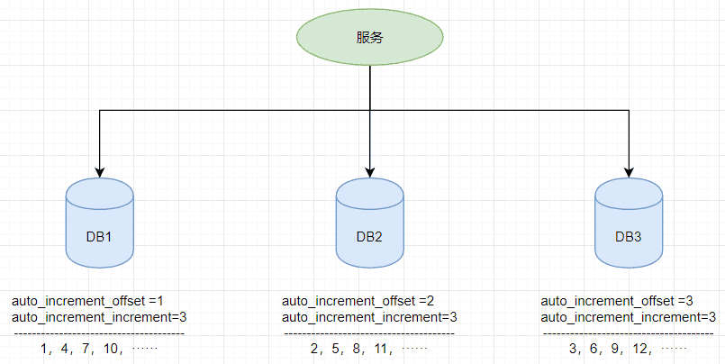
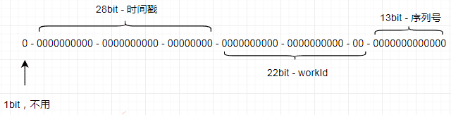
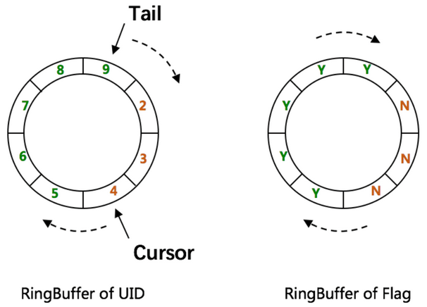
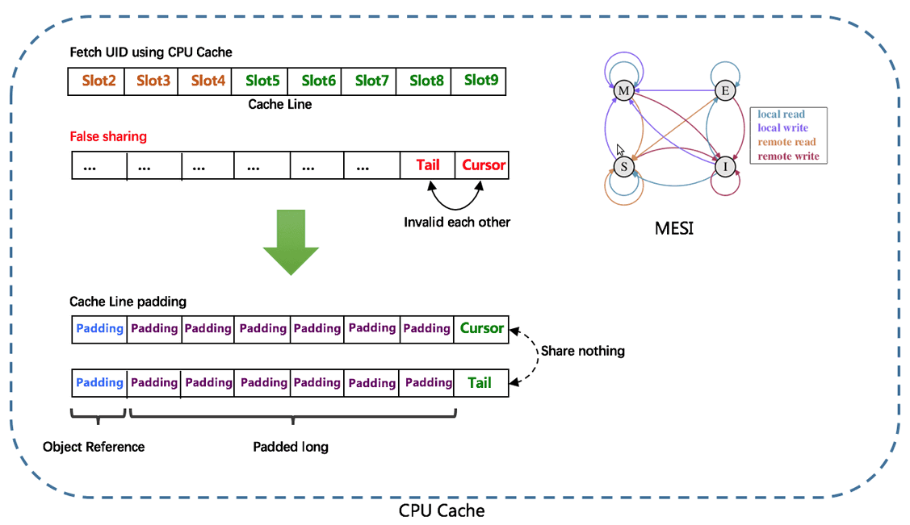
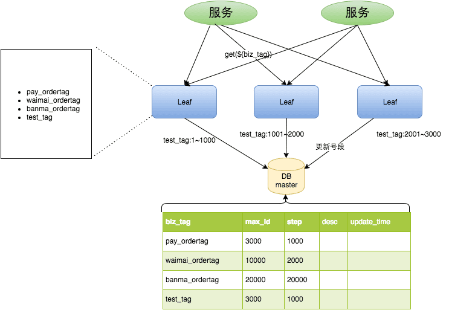
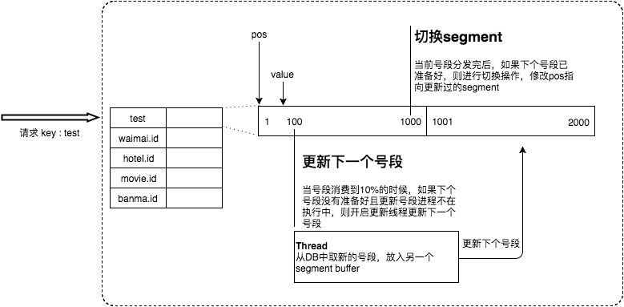
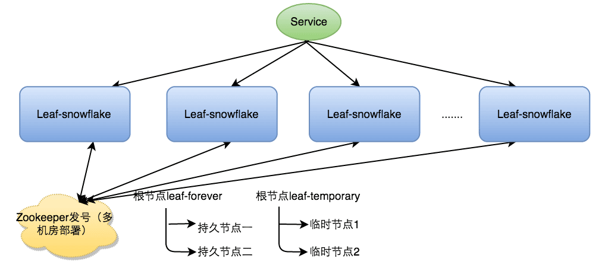
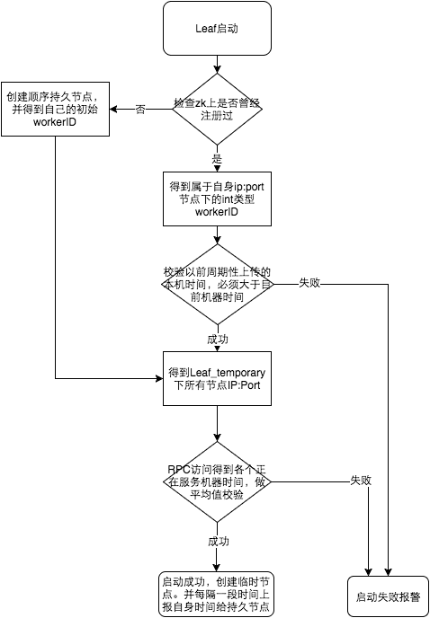

## 1. 分布式全局唯一 ID

传统的单体架构，基本是单数据库、业务单表的结构。每个业务表的 ID 一般都是从 1 自增，通过 `AUTO_INCREMENT=1` 设置自增起始值，但是在分布式服务架构模式下分库分表的设计，使得多个库或多个表存储相同的业务数据。这种情况根据数据库的自增 ID 就会产生相同 ID 的情况，不能保证主键的唯一性。

例如，如果第一个订单存储在 DB1 上则订单 ID 为 1，当一个新订单又入库了存储在 DB2 上订单 ID 也为1 。系统的架构虽然是分布式的，但是在用户层应是无感知的，重复的订单主键显而易见是不被允许的。

分布式 ID 生成方案，大致可以分为两类：

- 类 DB 型的唯一 ID，根据设置不同起始值和步长来实现趋势递增，需要考虑服务的容错性和可用性。
- 类 snowflake 型的唯一 ID，这种就是将 64 位划分为不同的段，每段代表不同的涵义，基本就是时间戳、机器 ID 和序列数。这种方案就是需要考虑时钟回拨的问题以及做一些 buffer 的缓冲设计提高性能。

还可通过将三者（时间戳，机器ID，序列数）划分不同的位数来改变使用寿命和并发数。根据不同的使用场景，可以分为：

- 对于并发数要求不高、期望长期使用的应用，可增加时间戳位数，减少序列数的位数。例如配置成 `{"workerBits":23,"timeBits":31,"seqBits":9}` 时，可支持 28 个节点以整体并发量 14400 UID/s 的速度持续运行 68 年。
- 对于节点重启频率频繁、期望长期使用的应用，可增加工作机器位数和时间戳位数，减少序列数位数。例如配置成 `{"workerBits":27,"timeBits":30,"seqBits":6}` 时，可支持 37 个节点以整体并发量 2400 UID/s 的速度持续运行 34 年。

## 2. UUID

UUID（Universally Unique Identifier），通用唯一识别码的缩写。UUID 是由一组 32 位数的 16 进制数字所构成，所以 UUID 理论上的总数为 16<sup>32</sup> = 2<sup>128</sup> ≈ 3.4 x 10<sup>38。也就是说若每纳秒产生 1 兆个 UUID，要花 100 亿年才会将所有 UUID 用完。

生成的 UUID 是由 `8-4-4-4-12` 格式的数据组成，其中 32 个字符和 4个 连字符 `-`，一般使用的时候会将连字符删除 `uuid.toString().replaceAll("-","")`。

目前 UUID 的产生方式有 5 种版本，每个版本的算法不同，应用范围也不同：

1. **基于时间的 UUID**（版本1）：这个一般是通过当前时间、随机数、和本地 MAC 地址来计算出来，可以通过 `org.apache.logging.log4j.core.util` 包中的 `UuidUtil.getTimeBasedUuid()` 来使用或者其他包中工具。由于使用了 MAC 地址，因此能够确保唯一性，但是同时也暴露了 MAC 地址，私密性不够好。
2. **DCE 安全的 UUID**（版本2）：DCE（Distributed Computing Environment）安全的 UUID 和基于时间的 UUID 算法相同，但会把时间戳的前 4 位置换为 POSIX 的 UID 或 GID。这个版本的 UUID 在实际中较少用到。
3. **基于名字的 UUID（MD5）**（版本3）：基于名字的 UUID 通过计算名字和名字空间的 MD5 散列值得到。这个版本的 UUID 保证了，相同名字空间中不同名字生成的 UUID 的唯一性；不同名字空间中的 UUID 的唯一性；相同名字空间中相同名字的 UUID 重复生成是相同的。
4. **随机 UUID**（版本4）：根据随机数，或者伪随机数生成 UUID。这种 UUID 产生重复的概率是可以计算出来的，但是重复的可能性可以忽略不计，因此该版本也是被经常使用的版本。JDK 中使用的就是这个版本。
5. **基于名字的UUID（SHA1）**（版本5）：和基于名字的 UUID 算法类似，只是散列值计算使用 SHA1（Secure Hash Algorithm 1）算法。

示例：JDK 自带的 UUID 工具生成版本4 根据随机数的 UUID 和版本 3 基于名字的 UUID

```java
public static void main(String[] args) {
    // 获取一个版本4根据随机字节数组的UUID。
    UUID uuid = UUID.randomUUID();
    System.out.println(uuid.toString().replaceAll("-",""));

    // 获取一个版本3(基于名称)根据指定的字节数组的UUID。
    byte[] nbyte = {10, 20, 30};
    UUID uuidFromBytes = UUID.nameUUIDFromBytes(nbyte);
    System.out.println(uuidFromBytes.toString().replaceAll("-",""));
}
```

虽然 UUID 生成方便，本地生成没有网络消耗，但是也有一些缺点：

- 不易于存储：UUID 太长，16 字节 128 位，通常以 36 长度的字符串表示，很多场景不适用。
- 信息不安全：基于 MAC 地址生成 UUID 的算法可能会造成 MAC 地址泄露，暴露使用者的位置。
- 对 MySQL 索引不利：如果作为数据库主键，在 InnoDB 引擎下，UUID 的无序性可能会引起数据位置频繁变动，严重影响性能。

## 3. 数据库生成

由于分布式数据库的起始自增值一样，所以才会有冲突的情况发生，那么将分布式系统中数据库的同一个业务表的自增 ID 设计成不一样的起始值，然后设置固定的步长，步长的值即为分库的数量或分表的数量。

以 MySQL 为例，给字段设置相应的自增长属性来保证 ID 自增：

- `auto_increment_offset`：表示自增长字段从那个数开始，他的取值范围是 1~65535。
- `auto_increment_increment`：表示自增长字段每次递增的量，其默认值是 1，取值范围是 1~65535。

假设有三台机器，则 DB1 中 order 表的起始 ID 值为 1，DB2 中 order 表的起始值为 2，DB3 中 order 表的起始值为 3，它们自增的步长都为 3，则它们的 ID 生成范围如下图所示：



这种方式的优势就是依赖于数据库自身不需要其他资源，并且 ID 号单调自增，可以实现一些对 ID 有特殊要求的业务。

但是缺点也很明显，首先它强依赖 DB，当 DB 异常时整个系统不可用。虽然配置主从复制可以尽可能的增加可用性，但是数据一致性在特殊情况下难以保证。主从切换时的不一致可能会导致重复发号。还有就是 ID 发号性能瓶颈限制在单台 MySQL 的读写性能。

## 4. redis 生成

Redis 实现分布式唯一 ID，主要是通过 `INCR` 和 `INCRBY` 的自增原子命令，由于 Redis 自身的单线程的特点，所以能保证生成的 ID 肯定是唯一有序的。

但是单机存在性能瓶颈，无法满足高并发的业务需求，所以可以采用集群的方式来实现。集群的方式又会涉及到和数据库集群同样的问题，所以也需要设置分段和步长来实现。为了避免长期自增后数字过大可以通过与当前时间戳组合起来使用，另外为了保证并发和业务多线程的问题可以采用 Redis + Lua 的方式进行编码，保证安全。

Redis 实现分布式全局唯一 ID，它的性能比较高，生成的数据是有序的，对排序业务有利，但是同样它依赖于 redis，需要系统引进 redis 组件，增加了系统的整体复杂性。所以如果其他业务已经引进了 Redis 集群，则可以资源利用考虑使用 Redis 来实现。

> 此部分内容详见[《Redis 场景应用设计》笔记](/Database/Redis/Redis-场景应用设计)

## 5. Snowflake（雪花算法）

Snowflake（雪花算法）是由 Twitter 开源的分布式 ID 生成算法，以划分命名空间的方式将 64 位分割成多个部分，每个部分代表不同的含义。而在 Java 中 SnowFlake 算法生成的 ID 是 64 bit 的 Long 类型整数。

- 第 1 位占用 1 bit，其值始终是 0，可看做是符号位不使用。
- 第 2 位开始的 41 位是时间戳，可表示 2<sup>41</sup> 个数，每个数代表毫秒，那么雪花算法可用的时间年限是 `(1L<<41)/(1000L360024*365)=69` 年的时间。
- 中间的 10 bit 可表示机器数，即 2<sup>10</sup> = 1024 台机器，但是一般情况下不会部署如何数量的机器。如果对 IDC（互联网数据中心）有需求，还可以将 10-bit 分 5-bit 给 IDC，分 5-bit 给工作机器。这样就可以表示 32 个 IDC，每个 IDC 下可以有 32 台机器，具体的划分可以根据自身需求定义。
- 最后 12 bit 是自增序列，可表示 2<sup>12</sup> = 4096 个数。

通过以上划分之后，相当于在 1 毫秒 1 个数据中心的一台机器上可产生 4096 个有序的不重复的ID。但是 IDC 和机器数肯定不止一个，所以毫秒内能生成的有序 ID 数是翻倍的。

> Snowflake 的 Twitter 官方原版是用以 Scala 编写，以下是 Java 版本的写法。

```java
/**
 * Twitter_Snowflake<br>
 * SnowFlake的结构如下(每部分用-分开):<br>
 * 0 - 0000000000 0000000000 0000000000 0000000000 0 - 00000 - 00000 - 000000000000 <br>
 * 1位标识，由于long基本类型在Java中是带符号的，最高位是符号位，正数是0，负数是1，所以id一般是正数，最高位是0<br>
 * 41位时间截(毫秒级)，注意，41位时间截不是存储当前时间的时间截，而是存储时间截的差值（当前时间截 - 开始时间截)
 * 得到的值），这里的的开始时间截，一般是我们的id生成器开始使用的时间，由我们程序来指定的（如下下面程序IdWorker类的startTime属性）。41位的时间截，可以使用69年，年T = (1L << 41) / (1000L * 60 * 60 * 24 * 365) = 69<br>
 * 10位的数据机器位，可以部署在1024个节点，包括5位datacenterId和5位workerId<br>
 * 12位序列，毫秒内的计数，12位的计数顺序号支持每个节点每毫秒(同一机器，同一时间截)产生4096个ID序号<br>
 * 加起来刚好64位，为一个Long型。<br>
 * SnowFlake的优点是，整体上按照时间自增排序，并且整个分布式系统内不会产生ID碰撞(由数据中心ID和机器ID作区分)，并且效率较高，经测试，SnowFlake每秒能够产生26万ID左右。
 */
public class SnowflakeDistributeId {
    // ==============================Fields===========================================
    /**
     * 开始时间截 (2015-01-01)
     */
    private final long twepoch = 1420041600000L;

    /**
     * 机器id所占的位数
     */
    private final long workerIdBits = 5L;

    /**
     * 数据标识id所占的位数
     */
    private final long datacenterIdBits = 5L;

    /**
     * 支持的最大机器id，结果是31 (这个移位算法可以很快的计算出几位二进制数所能表示的最大十进制数)
     */
    private final long maxWorkerId = -1L ^ (-1L << workerIdBits);

    /**
     * 支持的最大数据标识id，结果是31
     */
    private final long maxDatacenterId = -1L ^ (-1L << datacenterIdBits);

    /**
     * 序列在id中占的位数
     */
    private final long sequenceBits = 12L;

    /**
     * 机器ID向左移12位
     */
    private final long workerIdShift = sequenceBits;

    /**
     * 数据标识id向左移17位(12+5)
     */
    private final long datacenterIdShift = sequenceBits + workerIdBits;

    /**
     * 时间截向左移22位(5+5+12)
     */
    private final long timestampLeftShift = sequenceBits + workerIdBits + datacenterIdBits;

    /**
     * 生成序列的掩码，这里为4095 (0b111111111111=0xfff=4095)
     */
    private final long sequenceMask = -1L ^ (-1L << sequenceBits);

    /**
     * 工作机器ID(0~31)
     */
    private long workerId;

    /**
     * 数据中心ID(0~31)
     */
    private long datacenterId;

    /**
     * 毫秒内序列(0~4095)
     */
    private long sequence = 0L;

    /**
     * 上次生成ID的时间截
     */
    private long lastTimestamp = -1L;

    //==============================Constructors=====================================

    /**
     * 构造函数
     *
     * @param workerId     工作ID (0~31)
     * @param datacenterId 数据中心ID (0~31)
     */
    public SnowflakeDistributeId(long workerId, long datacenterId) {
        if (workerId > maxWorkerId || workerId < 0) {
            throw new IllegalArgumentException(String.format("worker Id can't be greater than %d or less than 0", maxWorkerId));
        }
        if (datacenterId > maxDatacenterId || datacenterId < 0) {
            throw new IllegalArgumentException(String.format("datacenter Id can't be greater than %d or less than 0", maxDatacenterId));
        }
        this.workerId = workerId;
        this.datacenterId = datacenterId;
    }

    // ==============================Methods==========================================

    /**
     * 获得下一个ID (该方法是线程安全的)
     *
     * @return SnowflakeId
     */
    public synchronized long nextId() {
        long timestamp = timeGen();

        // 如果当前时间小于上一次ID生成的时间戳，说明系统时钟回退过这个时候应当抛出异常
        if (timestamp < lastTimestamp) {
            throw new RuntimeException(String.format("Clock moved backwards.  Refusing to generate id for %d milliseconds", lastTimestamp - timestamp));
        }

        // 如果是同一时间生成的，则进行毫秒内序列
        if (lastTimestamp == timestamp) {
            sequence = (sequence + 1) & sequenceMask;
            // 毫秒内序列溢出
            if (sequence == 0) {
                // 阻塞到下一个毫秒,获得新的时间戳
                timestamp = tilNextMillis(lastTimestamp);
            }
        } else {
            // 时间戳改变，毫秒内序列重置
            sequence = 0L;
        }

        // 上次生成ID的时间截
        lastTimestamp = timestamp;

        // 移位并通过或运算拼到一起组成64位的ID
        return ((timestamp - twepoch) << timestampLeftShift) //
                | (datacenterId << datacenterIdShift) //
                | (workerId << workerIdShift) //
                | sequence;
    }

    /**
     * 阻塞到下一个毫秒，直到获得新的时间戳
     *
     * @param lastTimestamp 上次生成ID的时间截
     * @return 当前时间戳
     */
    protected long tilNextMillis(long lastTimestamp) {
        long timestamp = timeGen();
        while (timestamp <= lastTimestamp) {
            timestamp = timeGen();
        }
        return timestamp;
    }

    /**
     * 返回以毫秒为单位的当前时间
     *
     * @return 当前时间(毫秒)
     */
    protected long timeGen() {
        return System.currentTimeMillis();
    }
}
```

测试的代码：

```java
public static void main(String[] args) {
    SnowflakeDistributeId idWorker = new SnowflakeDistributeId(0, 0);
    for (int i = 0; i < 1000; i++) {
        long id = idWorker.nextId();
        // System.out.println(Long.toBinaryString(id));
        System.out.println(id);
    }
}
```

雪花算法提供了一个很好的设计思想，雪花算法生成的 ID 是趋势递增，不依赖数据库等第三方系统，以服务的方式部署，稳定性更高，生成 ID 的性能也是非常高的，而且可以根据自身业务特性分配 bit 位，非常灵活。

但是雪花算法强依赖机器时钟，如果机器上时钟回拨，会导致发号重复或者服务会处于不可用状态。如果恰巧回退前生成过一些 ID，而时间回退后，生成的 ID 就有可能重复。官方对于此并没有给出解决方案，而是简单的抛错处理，这样会造成在时间被追回之前的这段时间服务不可用。

很多其他类雪花算法也是在此思想上的设计，然后改进规避它的缺陷，如百度 UidGenerator 和美团分布式 ID 生成系统 Leaf 中 snowflake 模式都是在此基础上演进出来。

## 6. 百度 - UidGenerator

### 6.1. 概述

百度的 UidGenerator 是百度开源基于 Java 语言实现的唯一 ID 生成器，是在雪花算法 snowflake 的基础上做了一些改进。UidGenerator 以组件形式工作在应用项目中，支持自定义 workerId 位数和初始化策略，适用于 docker 等虚拟化环境下实例自动重启、漂移等场景。

在实现上，UidGenerator 提供了两种生成唯一 ID 方式，分别是 `DefaultUidGenerator` 和 `CachedUidGenerator`，官方建议如果有性能考虑的话使用 `CachedUidGenerator` 方式实现。

UidGenerator 依然是以划分命名空间的方式将 64-bit 分割成多个部分，只不过它的默认划分方式有别于雪花算法 snowflake。它默认是由 `1-28-22-13` 的格式进行划分。可根据业务的情况和特点，调整各个字段占用的位数。



- 第 1 位仍然占用 1 bit，其值始终是 0。
- 第 2 位开始的 28 位是时间戳，可表示 2<sup>28</sup> 个数，以秒为单位，每个数代表秒则可用 `(1L<<28) / (360024365) ≈ 8.51` 年的时间。
- 中间的 workId（数据中心+工作机器，可以其他组成方式）则由 22-bit 组成，可表示 2<sup>22</sup> = 4194304 个工作ID。
- 最后由 13-bit 构成自增序列，可表示 2<sup>13</sup> = 8192 个数。

其中 workId（机器 id），最多可支持约 420w 次机器启动。内置实现为在启动时由数据库分配（表名为 WORKER_NODE），默认分配策略为用后即弃，后续可提供复用策略。

```sql
DROP TABLE IF	EXISTS WORKER_NODE;
CREATE TABLE WORKER_NODE (
	ID BIGINT NOT NULL AUTO_INCREMENT COMMENT 'auto increment id',
	HOST_NAME VARCHAR ( 64 ) NOT NULL COMMENT 'host name',
	PORT VARCHAR ( 64 ) NOT NULL COMMENT 'port',
	TYPE INT NOT NULL COMMENT 'node type: ACTUAL or CONTAINER',
	LAUNCH_DATE DATE NOT NULL COMMENT 'launch date',
	MODIFIED TIMESTAMP NOT NULL COMMENT 'modified time',
	CREATED TIMESTAMP NOT NULL COMMENT 'created time',
	PRIMARY KEY ( ID ) 
) COMMENT = 'DB WorkerID Assigner for UID Generator', ENGINE = INNODB;
```

### 6.2. DefaultUidGenerator 实现

`DefaultUidGenerator` 就是正常的根据时间戳和机器位、还有序列号的生成方式，和雪花算法很相似，对于时钟回拨也只是抛异常处理。仅有一些不同，如以秒为单位和支持 Docker 等虚拟化环境。

```java
protected synchronized long nextId() {
    long currentSecond = getCurrentSecond();

    // Clock moved backwards, refuse to generate uid
    if (currentSecond < lastSecond) {
        long refusedSeconds = lastSecond - currentSecond;
        throw new UidGenerateException("Clock moved backwards. Refusing for %d seconds", refusedSeconds);
    }

    // At the same second, increase sequence
    if (currentSecond == lastSecond) {
        sequence = (sequence + 1) & bitsAllocator.getMaxSequence();
        // Exceed the max sequence, we wait the next second to generate uid
        if (sequence == 0) {
            currentSecond = getNextSecond(lastSecond);
        }

    // At the different second, sequence restart from zero
    } else {
        sequence = 0L;
    }

    lastSecond = currentSecond;

    // Allocate bits for UID
    return bitsAllocator.allocate(currentSecond - epochSeconds, workerId, sequence);
}
```

如果要使用 `DefaultUidGenerator` 的实现方式的话，以上划分的占用位数可通过 spring 进行参数配置。

```xml
<bean id="defaultUidGenerator" class="com.baidu.fsg.uid.impl.DefaultUidGenerator" lazy-init="false">
    <property name="workerIdAssigner" ref="disposableWorkerIdAssigner"/>

    <!-- Specified bits & epoch as your demand. No specified the default value will be used -->
    <property name="timeBits" value="29"/>
    <property name="workerBits" value="21"/>
    <property name="seqBits" value="13"/>
    <property name="epochStr" value="2016-09-20"/>
</bean>
```

### 6.3. CachedUidGenerator 实现

官方建议的性能较高的 `CachedUidGenerator` 生成方式，是使用 `RingBuffer` 缓存生成的 id。数组每个元素成为一个 slot。`RingBuffer` 容量默认为 Snowflake 算法中 sequence 最大值（2<sup>13</sup> = 8192）。可通过 boostPower 配置进行扩容，以提高 `RingBuffer` 读写吞吐量。Tail 指针、Cursor 指针用于环形数组上读写 slot：

- **Tail 指针**：表示 Producer 生产的最大序号(此序号从0开始，持续递增)。Tail 不能超过 Cursor，即生产者不能覆盖未消费的 slot。当 Tail 已赶上 curosr，此时可通过 `rejectedPutBufferHandler` 指定 `PutRejectPolicy`。
- **Cursor 指针**：表示 Consumer 消费到的最小序号(序号序列与 Producer 序列相同)。Cursor 不能超过 Tail，即不能消费未生产的 slot。当 Cursor 已赶上 tail，此时可通过 `rejectedTakeBufferHandler` 指定 `TakeRejectPolicy`。



`CachedUidGenerator` 采用了双 RingBuffer，Uid-RingBuffer 用于存储 Uid、Flag-RingBuffer 用于存储 Uid 状态(是否可填充、是否可消费)。

由于数组元素在内存中是连续分配的，可最大程度利用 CPU cache 以提升性能。但同时会带来「伪共享」 FalseSharing 问题，为此在 Tail、Cursor 指针、Flag-RingBuffer 中采用了 CacheLine 补齐方式。



RingBuffer 填充时机：

- **初始化预填充**：RingBuffer 初始化时，预先填充满整个 RingBuffer。
- **即时填充**：Take 消费时，即时检查剩余可用 slot 量(`tail - cursor`)，如小于设定阈值，则补全空闲 slots。阈值可通过 `paddingFactor` 来进行配置。
- **周期填充**：通过 Schedule 线程，定时补全空闲 slots。可通过 scheduleInterval 配置，以应用定时填充功能，并指定 Schedule 时间间隔。

## 7. 美团 Leaf

Leaf 是美团基础研发平台推出的一个分布式 ID 生成服务，提供了两种生成方式，分别是** Leaf-segment 数据库方案**和 **Leaf-snowflake 方案**。

### 7.1. Leaf-segment 数据库方案

Leaf-segment 数据库方案，是在前面章节描述的数据库使用方案上，做了如下改变：

- 原方案每次获取 ID 都得读写一次数据库，造成数据库压力大。改为利用 proxy server 批量获取，每次获取一个 segment(由 step 决定大小)号段的值。用完之后再去数据库获取新的号段，可以大大的减轻数据库的压力。
- 各个业务不同的发号需求用 `biz_tag` 字段来区分，每个 biz-tag 的 ID 获取相互隔离，互不影响。如果以后有性能需求需要对数据库扩容，不需要上述描述的复杂的扩容操作，只需要对 biz_tag 分库分表就行。

数据库表设计如下：

```sql
CREATE TABLE `leaf_alloc` (
	`biz_tag` VARCHAR ( 128 ) NOT NULL DEFAULT '' COMMENT '业务key',
	`max_id` BIGINT ( 20 ) NOT NULL DEFAULT '1' COMMENT '当前已经分配了的最大id',
	`step` INT ( 11 ) NOT NULL COMMENT '初始步长，也是动态调整的最小步长',
	`description` VARCHAR ( 256 ) DEFAULT NULL COMMENT '业务key的描述',
	`update_time` TIMESTAMP NOT NULL DEFAULT CURRENT_TIMESTAMP ON UPDATE CURRENT_TIMESTAMP COMMENT '更新时间',
	PRIMARY KEY ( `biz_tag` ) 
) ENGINE = INNODB;
```

原来获取 ID 每次都需要写数据库，现在只需要把 step 设置得足够大，比如 1000。那么只有当 1000 个号被消耗完了之后才会去重新读写一次数据库。读写数据库的频率从 1 减小到了 `1/step`，大致架构如下图所示：



同时 Leaf-segment 为了解决 TP999（满足千分之九百九十九的网络请求所需要的最低耗时）数据波动大，当号段使用完之后还是会 hang 在更新数据库的 I/O 上，TP999 数据会出现偶尔的尖刺的问题，提供了双 buffer 优化。

即 Leaf 取号段的时机是在号段消耗完的时候进行的，也就意味着号段临界点的 ID 下发时间取决于下一次从 DB 取回号段的时间，并且在这期间进来的请求也会因为 DB 号段没有取回来，导致线程阻塞。如果请求 DB 的网络和 DB 的性能稳定，这种情况对系统的影响是不大的，但是假如取 DB 的时候网络发生抖动，或者 DB 发生慢查询就会导致整个系统的响应时间变慢。

为了 DB 取号段的过程能够做到无阻塞，不需要在 DB 取号段的时候阻塞请求线程，即当号段消费到某个点时就异步的把下一个号段加载到内存中，而不需要等到号段用尽的时候才去更新号段。这样做就可以很大程度上的降低系统的 TP999 指标。详细实现如下图所示：



采用双 buffer 的方式，Leaf服务内部有两个号段缓存区 segment。当前号段已下发 10% 时，如果下一个号段未更新，则另启一个更新线程去更新下一个号段。当前号段全部下发完后，如果下个号段准备好了则切换到下个号段为当前 segment 接着下发，循环往复。

- 每个 biz-tag 都有消费速度监控，通常推荐 segment 长度设置为服务高峰期发号 QPS 的 600 倍（10分钟），这样即使 DB 宕机，Leaf 仍能持续发号 10-20 分钟不受影响。
- 每次请求来临时都会判断下个号段的状态，从而更新此号段，所以偶尔的网络抖动不会影响下个号段的更新。

对于这种方案依然存在一些问题，它仍然依赖 DB 的稳定性，需要采用主从备份的方式提高 DB 的可用性，还有 Leaf-segment 方案生成的 ID 是趋势递增的，这样 ID 号是可被计算的，例如订单 ID 生成场景，通过订单 id 号相减就能大致计算出公司一天的订单量，这个是不能忍受的。

### 7.2. Leaf-snowflake 方案

Leaf-snowflake 方案完全沿用 snowflake 方案的 bit 位设计，对于 workerlD 的分配引入了 Zookeeper 持久顺序节点的特性，自动对 snowflake 节点配置 wokerlD。避免了服务规模较大时，动手配置成本太高的问题。一般会按照下面几个步骤启动的：

- 启动 Leaf-snowflake 服务，连接 Zookeeper，在 leaf_forever 父节点下检查自己是否已经注册过（是否有该顺序子节点）。
- 如果有注册过直接取回自己的 workerlD（zk 顺序节点生成的 int 类型 ID 号），启动服务。
- 如果没有注册过，就在该父节点下面创建一个持久顺序节点，创建成功后取回顺序号当做自己的 workerlD 号，启动服务。



为了减少对 Zookeeper 的依赖性，会在本机文件系统上缓存一个 workerlD 文件。当 ZooKeeper 出现问题，恰好机器出现问题需要重启时，能保证服务能够正常启动。

Leaf-snowflake 在解决 snowflake 算法的时钟回拨的问题上，是通过校验自身系统时间与 `leaf_forever/${self}` 节点记录时间做比较然后启动报警的措施。



美团官方建议是由于强依赖时钟，对时间的要求比较敏感，在机器工作时 NTP 同步也会造成秒级别的回退，建议可以直接关闭 NTP 同步。要么在时钟回拨的时候直接不提供服务直接返回 ERROR_CODE，等时钟追上即可。或者做一层重试，然后上报报警系统，更或者是发现有时钟回拨之后自动摘除本身节点并报警。

在性能上官方提供的数据目前 Leaf 的性能在 4C8G 的机器上 QPS 能压测到近 5w/s，TP9991ms。
