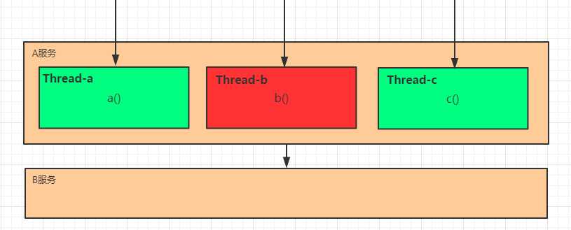
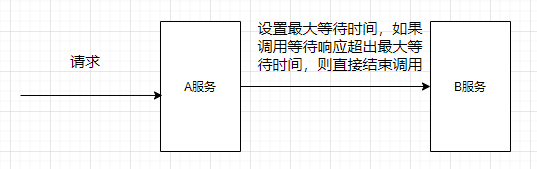

## 1. 高并发架构：服务容错

服务容错的三个核心思想是：

- 不被外界环境影响
- 不被上游请求压垮
- 不被下游响应拖垮

在高并发环境下，服务之间的依赖关系导致调用失败，解决的方式通常是：**限流 -> 熔断 -> 隔离 -> 降级**，其目的是防止雪崩效应。

### 1.1. 雪崩效应

在微服务架构中，一个请求需要调用多个服务，服务与服务之间也会相互调用，这是非常常见的。如客户端访问A服务，而A服务需要调用B服务，B服务需要调用C服务，由于网络原因或者自身的原因，如果B服务或者C服务不能及时响应，A服务将处于阻塞状态，直到B服务C服务响应。此时若有大量的请求涌入，会形成任务堆积，容器的线程资源会被消耗完毕，导致服务瘫痪。

由于服务与服务之间的依赖性，故障会传播，造成连锁反应，会对整个微服务系统造成灾难性的严重后果，这就是服务故障的**“雪崩效应”**。

雪崩是系统中的蝴蝶效应导致其发生的原因多种多样，有不合理的容量设计，或者是高并发下某一个法响应变慢，亦或是某台机器的资源耗尽。从源头上无法完全杜绝雪崩源头的发生，但是雪崩的根本原因来源于服务之间的强依赖，所以可以做好容错（如：**熔断，隔离，限流**）来防止雪崩效应，保证在一个服务发生问题，不会影响到其它服务的正常运行。

### 1.2. 常见容错（防止雪崩效应）方案

常见的容错思路有：隔离、超时、限流、熔断、降级

## 2. 服务隔离

**服务隔离**是指将系统按照一定的原则划分为若干个服务模块，各个模块之间相对独立，无强依赖。当有故障发生时，能将问题和影响隔离在某个模块内部，而不扩散风险，不波及其它模块，不影响整体的系统服务。常见的隔离方式有：**线程池隔离**和**信号量隔离**。

> 上图是线程池隔离

## 3. 服务超时

在上游服务调用下游服务的时候，设置一个最大响应时间，如果超过这个时间，下游未作出反应，就断开请求，释放掉线程。

## 4. 服务熔断

为了防止“雪崩效应”，分布式系统采用了**熔断机制**。当下游服务因访问压力过大而响应变慢或失败，上游服务为了保护系统整体的可用性，可以暂时切断对下游服务的调用，从而保全整体的措施就叫做熔断。在 Spring Cloud 构建的微服务系统中，采用了**熔断器**（如 Hystrix 组件的 Ciruit Breaker）去做熔断。

例：当服务b出现故障，请求失败次数超过设定的阀值之后，服务b就会开启熔断器，之后服务b不进行任何的业务逻辑操作，执行快速失败并直接返回请求失败的信息。其他依赖b的服务就不会因为得不到响应而线程阻塞。此时除了服务b和依赖于服务b的部分功能不可用外，其他功能正常。

熔断器还具有一个**自我修复的机制**。即当服务b熔断后，半打开的熔断器会检查一部分请求，其他请求执行快速失败响应，检查的部分如何成功，则会判定服务b正常，就会关闭服务b的熔断器；如果不正常，则继续打开熔断器。所以**服务熔断一般有三种状态**：

- 熔断关闭状态（Closed）：服务没有故障时，熔断器所处的状态，对调用方的调用不做任何限制
- 熔断开启状态（Open）：一段时间内达到一定的次数无法调用服务并且多次监测没有恢复的迹象，此时熔断器为开启状态，后续对该服务接口的调用不再经过网络，直接执行本地的 fallback 方法
- 半熔断状态（Half-Open）：熔断开启状态一段时间后，尝试恢复服务调用，允许有限的流量调用该服务，并监控调用成功率。如果成功率达到预期，则说明服务已恢复，进入熔断关闭状态；如果成功率仍旧很低，则重新进入熔断开启状态。

熔断组件往往会提供一系列的监控，例如：服务是否可用，熔断器是否被打开、目前的吞吐量、网络延迟状态的监控等。

**熔断器机制的作用**：

- 将资源进行隔离，只会隔离故障的 API 接口，不会影响其他的 API 接口
- 服务降级的功能。当大量请求剏并发时，熔断器会被打开，将服务降级，以免服务器因负载过高而出现故障
- 自我修复能力。

## 5. 服务降级

**降级**，就是当某个服务熔断之后，服务器将不再被调用，此时客户端可以自己准备一个本地的 fallback 回调，返回一个缺省值。也可以理解为兜底

## 6. 服务限流

**限流**也可以认为服务降级的一种，限流就是限制系统的输入和输出流量已达到保护系统的目的。一般来说系统的吞吐量是可以被测算的，为了保证系统的稳固运行，一旦达到的需要限制的阈值，就需要限制流量并采取少量措施以完成限制流量的目的。比方：推迟解决，拒绝解决，或者部分拒绝解决等等。

## 7. 常见的容错组件

- **Hystrix**：由 Netflix 开源的一个延迟和容错库，用于隔离访问远程系统、服务或者第三方库，防止级联失败，从而提升系统的可用性与容错性。
- **Resilience4J**：一款非常轻量、简单，并且文档非常清晰、丰富的熔断工具，这也是 Hystrix 官方推荐的替代产品。不仅如此，Resilicence4j 还原生支持 Spring Boot 1.x/2.x，而且监控也支持和 prometheus 等多款主流产品进行整合。
- **Sentinel**：阿里巴巴开源的一款断路器实现，本身在阿里内部已经被大规模采用，非常稳定。

三个组件在各方面的对比：

|              |                     Sentinel                      |        Hystrix        |        resilience4j         |
| ------------ | ------------------------------------------------- | --------------------- | --------------------------- |
| 隔离策略      | 信号量隔离（并发线程数限流）                          | 线程池隔离/信号量隔离    | 信号量隔离                    |
| 熔断降级策略   | 基于响应时间、异常比率、异常数                         | 基于异常比率            | 基于异常比率、响应时间          |
| 实时统计实现   | 滑动窗口（LeapArray）                               | 滑动窗口（基于 RxJava） | Ring Bit Buffer             |
| 动态规则配置   | 支持多种数据源                                      | 支持多种数据源          | 有限支持                     |
| 扩展性        | 多个扩展点                                         | 插件的形式             | 接口的形式                    |
| 基于注解的支持 | 支持                                              | 支持                  | 支持                         |
| 限流          | 基于 QPS，支持基于调用关系的限流                      | 有限的支持             | Rate Limiter                |
| 流量整形      | 支持预热模式、匀速器模式、预热排队模式                  | 不支持                 | 简单的 Rate Limiter模式       |
| 系统自适应保护 | 支持                                              | 不支持                 | 不支持                       |
| 控制台        | 提供开箱即用的控制台，可配置规则、查看秒级监控、机器发现等 | 简单的监控查看          | 不提供控制台，可对接其它监控系统 |

## 8. 总结

### 8.1. 服务宕机时直接降级是最优解吗

出现服务器宕机时，服务降级、服务熔断和服务限流都不是最优解，因为这些操作都是以牺牲用户体验为前提的，而最优的解决方案，应该是让用户不受影响，让用户无感知的使用程序才对。

具体的做法是，使用负载均衡与集群化，将服务部署在多台服务器上，通过负载均衡来分发请求，当其中一台服务宕机时，负载均衡可以自动将请求转发给其他正常运行的服务，通过集群化部署，可以提高系统的可靠性和可用性。
