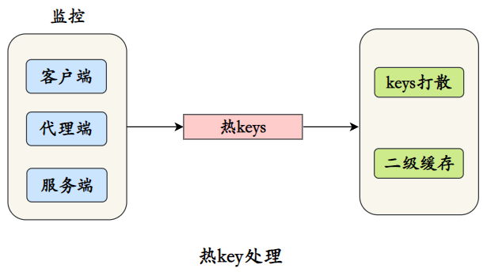
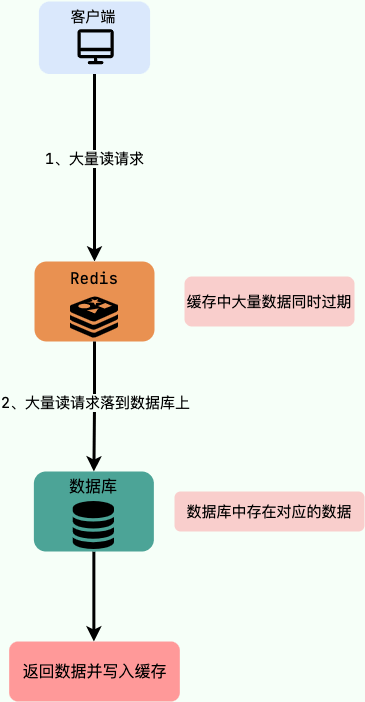
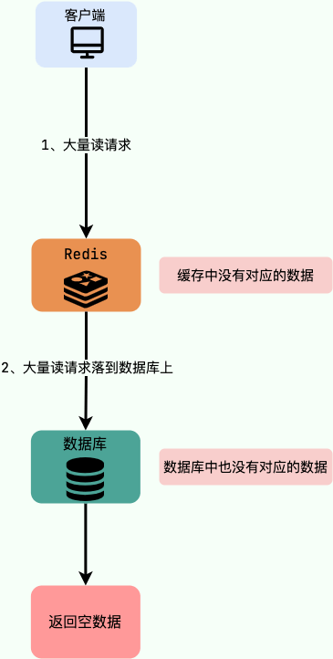
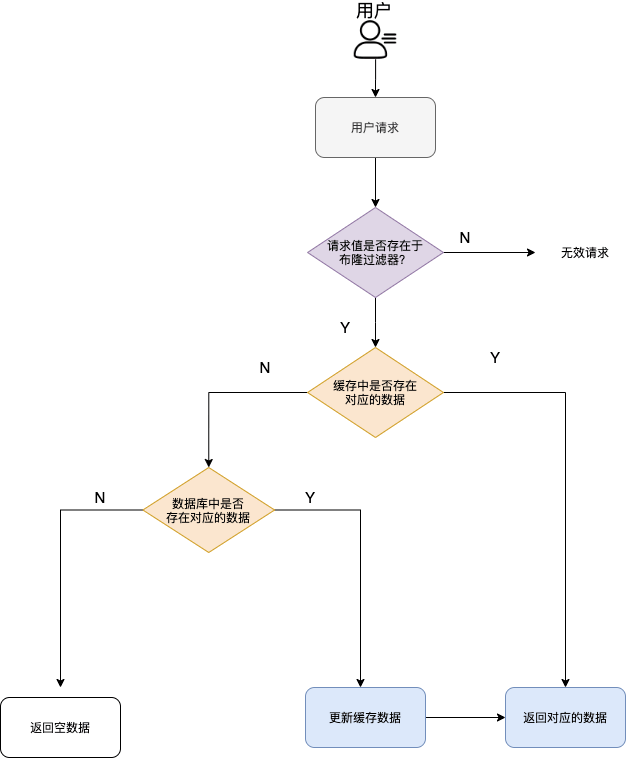
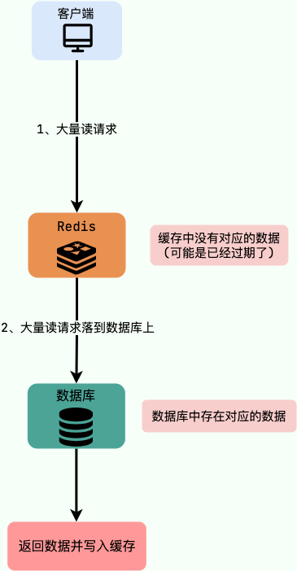
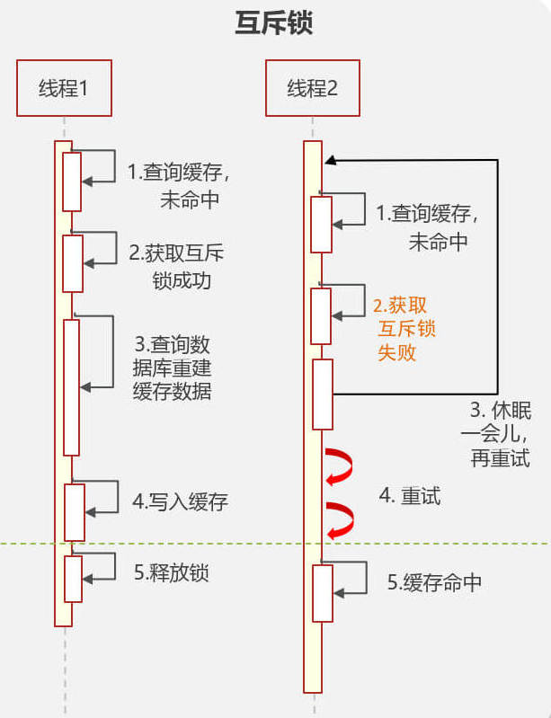
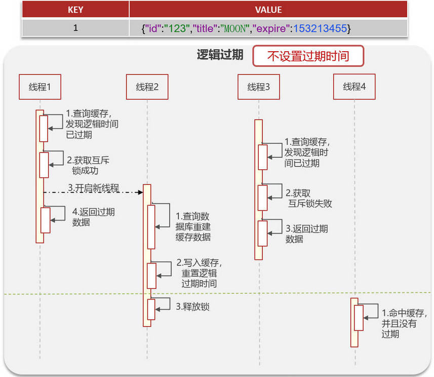
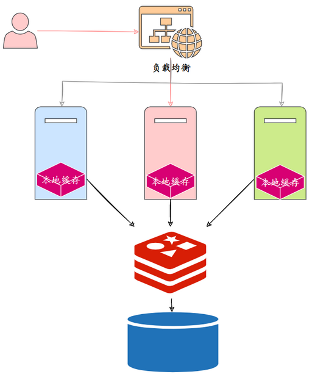
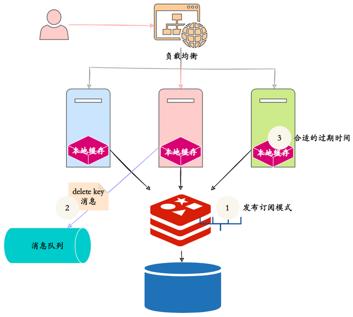

## 1. 高并发架构：缓存

**高并发架构实现的三板斧：缓存，限流和降级**。**缓存**在高并发系统中有者极其广阔的应用

分布式缓存设计的核心问题是**以哪种方式进行缓存预热和缓存更新，以及如何优雅解决缓存雪崩、缓存穿透、缓存降级等问题**。在不同的应用场景下有不同的解决方案。

### 1.1. 缓存命中率

`命中率 = 命中数 / (命中数 + 没有命中数)`，影响缓存命中率的因素：

1. **业务场景和业务需求**。缓存通常适合读多写少的业务场景，反之的使用意义并不多，命中率会很低。业务需求也决定了实时性的要求，直接影响到过期时间和更新策略，实时性要求越低越适合缓存。
2. **缓存的设计（策略和粒度）**。通常情况下缓存的粒度越小，命中率越高。比如说缓存一个用户信息的对象，只有当这个用户的信息发生变化的时候才更新缓存，而如果是缓存一个集合的话，集合中任何一个对象发生变化都要重新更新缓存。当数据发生变化时，直接更新缓存的值比移除缓存或者让缓存过期它的命中率更高，不过这个时候系统的复杂度过高。
3. **缓存的容量和基础设施**。缓存的容量有限就会容易引起缓存的失效和被淘汰。目前多数的缓存框架和中间件都采用 LRU 这个算法。同时采用缓存的技术选型也是至关重要的，比如采用本地内置的应用缓存，就比较容易出现单机瓶颈。而采用分布式缓存就更加容易扩展。所以需要做好系统容量规划，系统是否可扩展。
4. **缓存最大空间**。一旦缓存中元素数量超过这个值（或者缓存数据所占空间超过其最大支持空间），那么将会触发缓存启动清空策略。根据不同的场景合理的设置最大元素值往往可以一定程度上提高缓存的命中率，从而更有效的利用缓存。

### 1.2. 缓存介质

缓存存储的介质：从硬件来分，就是内存和硬盘；从技术上，可以分成内存、硬盘文件、数据库。

- **内存**：将缓存存储于内存中是最快的选择，无需额外的I/O开销，但是内存的缺点是没有持久化落地物理磁盘，一旦应用异常 break down 而重新启动，数据很难或者无法复原。
- **硬盘**：一般来说，很多缓存框架会结合使用内存和硬盘，在内存分配空间满了或是在异常的情况下，可以被动或主动的将内存空间数据持久化到硬盘中，达到释放空间或备份数据的目的。
- **数据库**：使用不支持 SQL，但支持简单的 key-value 存储结构的特殊数据库（如 BerkeleyDB 和 Redis），其响应速度和吞吐量都远远高于常用的关系型数据库等。

### 1.3. 缓存的使用策略（算法）

#### 1.3.1. 缓存更新策略

缓存更新，是指在数据发生变化后及时将变化后的数据更新到缓存。除了缓存服务器自带的缓存失效策略之外（Redis 默认的有 6 中策略可供选择），还可以根据具体的业务需求进行自定义的缓存淘汰，常见的策略有以下几种：

1. **定时更新**：定时将底层数据库内的数据更新到缓存中，此方式比较简单，适合需要缓存的数据量不是很大的应用场景。
2. **过期更新**：定时清理缓存中过期的数据，更新为最新数据与缓存的过期时间。
3. **写请求更新**：在用户有写请求时先写数据库同时更新缓存，这适用于用户对缓存数据和数据库的数据有实时强一致性要求的情况。
4. **读请求更新**：在用户有读请求时，先判断该请求数据的缓存是否存在或过期，如果不存在或已过期，则进行底层数据库查询并将查询结果更新到缓存中，同时将查询结果返回给用户。

#### 1.3.2. 缓存常见淘汰策略

在缓存数据过多时，需要使用某种淘汰算法决定淘汰哪些数据。常用的淘汰算法有以下几种：

- FIFO（First In First Out，先进先出）：在缓存空间不足时，判断被存储的时间，优先淘汰离目前最远的数据。从而保证最新数据可用、实时性。
- LRU（Least Recently Used，最近最少使用）：判断缓存最近被使用的时间，距离当前时间最远的数据优先被淘汰。基于访问时间，在被访问过的元素中淘汰最久未使用的元素，保证热点数据的有效性。
- LFU（Least Frequently Used，最不经常使用）：在一段时间内，被使用次数最少的缓存优先被淘汰。基于访问次数，淘汰命中次数最少的元素，保证高频数据有效性。

### 1.4. 缓存应用场景

- 从硬盘读数据的时候，其实操作系统还额外将数据都写到内存，，CPU 再从内存里读数据的时候，也额外读了许多数据到各级 cache 里。
- 各个输入输出之间用 buffer 保存一批数据统一发送和接受，而不是一个个字节的处理。
- 浏览器会缓存页面的元素，这样在重复访问网页时，就避开了要从互联网上下载数据（例如大图片）。
- web 服务会把静态的内容提前部署（缓存）在 CDN 上。
- 数据库会缓存查询，所以同一条查询第二次会比第一次快。
- 内存数据库（如 redis）选择把大量数据存在内存而非硬盘里。
- 应用程序把最近几次计算的结果放在本地内存里，如果下次有相同的请求，就跳过计算直接返回结果。

### 1.5. 缓存的分类

在目前的应用服务框架中，比较常见的是根据缓存与应用的藕合度，分为 local cache（本地缓存）和 remote cache（分布式缓存）：

- **本地缓存**：指的是在应用中的缓存组件，其最大的优点是应用和 cache 是在同一个进程内部，请求缓存非常快速，没有过多的网络开销等，在单应用不需要集群支持或者集群情况下各节点无需互相通知的场景下，使用本地缓存较合适；同时，它的缺点也是缓存跟应用程序耦合，多个应用程序无法直接的共享缓存，各应用或集群的各节点都需要维护自己的单独缓存，对内存是一种浪费。
- **分布式缓存**：指的是与应用分离的缓存组件或服务，其最大的优点是自身就是一个独立的应用，与本地应用隔离，多个应用可直接的共享缓存。

没有一种缓存方案可以解决一切的业务场景或数据类型，需要根据自身的特殊场景和背景，选择最适合的缓存方案。

## 2. 缓存预热

缓存预热就是系统上线后，将相关的缓存数据直接加载到缓存系统。从而避免在用户请求的时候，先查询数据库，然后再将数据缓存的问题！用户直接查询事先被预热的缓存数据，以提高系统查询效率！常用方案有：

1. 编写一个缓存刷新页面或者接口，上线时手动操作。
2. 数据量不大，可以在项目启动的时候自动进行加载。
3. 定时任务刷新缓存。

### 2.1. 缓存热 key 的处理

所谓的热 key，就是访问频率比较的 key。比如，热门新闻事件或商品，对存储这类信息的 key 通常有大流量的访问。假如 Redis 集群部署，热 key 可能会造成整体流量的不均衡，个别节点出现 OPS 过大的情况，极端情况下热点 key 甚至会超过 Redis 本身能够承受的 OPS。



对热 key 的处理，最关键的是对热点 key 的监控，可以从以下端来监控热点 key：

1. 客户端：因为 Redis 命令就是从客户端发出的，所以在客户端设置全局字典（key 和调用次数），每次调用 Redis 命令时，使用这个字典进行记录。
2. 代理端：像 Twemproxy、Codis 这些基于代理的 Redis 分布式架构，所有客户端的请求都是通过代理端完成的，可以在代理端进行收集统计。
3. Redis 服务端：使用 monitor 命令可以监控到 Redis 执行的所有命令，因此可用于统计热点 key。

只要监控到了热 key 后就可以对其进行处理：

- 把热 key 分散到不同的服务器，降低压力。
- 加⼊二级缓存，提前加载热 key 数据到内存中，如果 Redis 宕机，在本地内存查询。

## 3. 缓存雪崩

### 3.1. 概述

缓存雪崩，是指在同一时刻由于大量缓存失效，导致大量原本应该访问缓存的请求都直接落到了数据库上，对数据库的 CPU 和内存造成巨大压力，严重的话会导致数据库宕机，从而形成一系列连锁反应，使整个系统崩溃。另外，缓存服务宕机也会导致缓存雪崩现象。



### 3.2. 解决方案

**针对 Redis 服务不可用的解决方案**：

- 采用 Redis 集群，避免单机出现问题整个缓存服务都没办法使用。
- 限流，避免同时处理大量的请求。

**针对热点缓存失效的解决方案**：

- **请求加锁**：对于并发量不是很多的应用，可以使用请求加锁排队的方案防止过多请求数据库。
- **失效更新**：给每一个缓存数据都增加过期标记，记录缓存数据是否失效。如果缓存标记失效，则更新数据缓存。
- **设置不同的失效时间**：给不同的 key 设置不同的缓存失效时间，防止在同一时刻有大量的数据失效。
- **添加多级缓存**：给业务增加如 Guava 或 Caffeine 等其他缓存技术。
- **缓存永不失效**：不太推荐，占用内存过大，实用性太差。
- **设置熔断机制**：在缓存失效的情况下，通过设置熔断机制，直接返回默认值或错误信息，避免请求直接访问后端服务，减轻后端服务的压力。
- **实时监控和报警**：监控缓存系统的状态和性能指标，及时发现异常情况，并通过报警机制通知运维人员进行处理，减少缓存雪崩的影响。

## 4. 缓存穿透

### 4.1. 概述

缓存穿透，是指由于缓存系统故障或者用户频繁查询系统中不存在的数据（在系统中不存在，在自然数据库和缓存中都不存在）。就会导致用户查询请求，在缓存中找不到数据后，会穿过缓存不断地发送到数据库（整个过程相当于进行了两次无用的查询），导致数据库过载，进而引发一连串并发问题。请求绕过缓存直接查数据库，也是缓存命中率的问题。



### 4.2. 解决方案

常用的解决缓存穿透问题有以下的方法：

- **cache null（缓存空值策略）**：如果一个查询返回的数据为空（不管是数据不存在，还是系统故障），仍然将这个空结果进行缓存，并设置一个较短的过期时间（最长不超过5分钟）。当再次请求该数据时直接到缓存中返回空值，而不会继续访问数据库。此策略的核心原理是：在缓存中记录一个短暂的（数据过期时间内）数据在系统中是否存在的状态，如果不存在，则直接返回null，不再查询数据库，从而避免缓存穿透到数据库上。
- **布隆过滤器**：将所有可能存在的数据哈希到一个足够大的 Bitmap 中，在接收到请求时，首先经过布隆过滤器的拦截，一些肯定不存在的数据都会被这个 bitmap 拦截掉，从而避免了对底层存储系统的查询压力。*需要注意的是布隆过滤器可能会存在误判的情况。但整体来说，布隆过滤器说某个元素存在，小概率会误判。布隆过滤器说某个元素不在，那么这个元素一定不在*。加入布隆过滤器之后的缓存处理流程图如下：



> 番外：布隆过滤器的原理，当一个元素被加入集合时，通过 K 个散列函数将这个元素映射成一个位数组中的 K 个点，把它们置为 1。查询时，将元素通过散列函数映射之后会得到 k 个点，如果这些点有任何一个 0，则被检元素一定不在，直接返回；如果都是 1，则查询元素很可能存在，就会去查询 Redis 和数据库。

## 5. 缓存击穿

缓存击穿是指，请求的 key 对应的是**热点数据**，该数据存在于数据库中，但不存在于缓存中（通常是因为缓存中的那份数据的 key 已经过期或者是刚好失效）。这就可能会导致瞬时大量的请求直接落到了数据库上，对数据库造成了巨大的压力，可能直接就被这么多请求弄宕机了。



例子：秒杀进行过程中，缓存中的某个秒杀商品的数据突然过期，这就导致瞬时大量对该商品的请求直接落到数据库上，对数据库造成了巨大的压力。

### 5.1. 解决方案1：互斥锁（分布式锁）

解决方法：加分布式锁，第一个请求的线程可以拿到锁，拿到锁的线程查询到了数据之后设置缓存，其他的线程获取锁失败会等待 50ms 然后重新到缓存取数据，这样便可以避免大量的请求落到数据库。以下实现的伪代码：

```java
public String get(String key) {
    String value = redis.get(key);
    if (value == null) { // 缓存值过期
        String unique_key = systemId + ":" + key;
        // 设置30s的超时
        if (redis.set(unique_key, 1, 'NX', 'PX', 30000) == 1) { // 设置成功
            value = db.get(key);
            redis.set(key, value, expire_secs);
            redis.del(unique_key);
        } else { // 其他线程已经到数据库取值并回写到缓存了，可以重试获取缓存值
            sleep(50);
            get(key); // 重试
        }
    } else {
        return value;
    }
}
```

方案实现流程图：



方案的关键点在于：

1. 当某个线程缓存中没有查询到数据时，会加上互斥锁，然后去查询数据库并将缓存数据。
2. 此时其他的线程都会因为获取互斥锁失败而进行自旋重试，不会访问数据库。当第一个访问线程将缓存数据后，这些自旋线程就会从缓存中获取数据并返回。

此方案保证的数据库与缓存的**强一致性**，但因为大量线程进行自旋，**性能差**。

### 5.2. 解决方案2：逻辑过期

方案实现流程图：



逻辑过期方案的关键点在于：

1. **不设置key的过期时间，而在缓存的数据中增加一个逻辑过期时间字段（如上例的 `expire`）**。
2. 当某个线程查询缓存数据时发现逻辑时间已过期，会先加上互斥锁，然后<u>**开启一个新的线程**</u>去查询数据库并将缓存数据，并重置逻辑过期时间，此时线程不会等待，而是直接返回过期的数据。
3. 如果有其他线程查询该缓存数据发现逻辑过期，会尝试获取互斥锁，如果获取失败，则说明已有其他线程在更新缓存，此时会直接返回过期的数据。
4. 当第一个线程更新完缓存数据后并释放锁，往后的线程均可继续命中缓存。

此方案会出现**某个时间点的数据库与缓存的数据不一致性，但性能高**。

## 6. 缓存降级

缓存降级，指由于访问量剧增导致服务出现问题（如响应时间慢或不响应）或非核心服务影响到核心流程的性能时，为了优先保障核心业务的运行，采取减少或关闭非核心业务对资源的使用。系统可以根据一些关键数据进行自动降级，也可以配置开关实现人工降级。降级的最终目的是保证核心服务可用，即使是有损的。但需要注意的是，有些服务是无法降级的（如加入购物车、结算）。

常见的服务降级策略如下：

- **写降级**：在写请求增大时，可以只对缓存进行更新，然后将数据异步更新到数据库中，保证最终一致性即可。即将写请求从数据库降级为缓存。
- **读降级**：在数据库服务负载过高或数据库系统故障时，可以只对缓存进行读取并将结果返回给用户，在数据库服务正常后再去查询数据库。即将读请求从数据库降级为缓存。这种方式适用于对数据实时性要求不高的场景，保障了在系统发生故障的情况下用户依然能够访问到数据，只是访问到的数据相对有延迟。

进行降级之前要对系统进行梳理，哪些必须保护，哪些可降级。比如可以参考日志级别设置预案：

1. 一般：比如有些服务偶尔因为网络抖动或者服务正在上线而超时，可以自动降级；
2. 警告：有些服务在一段时间内成功率有波动（如在95~100%之间），可以自动降级或人工降级，并发送告警；
3. 错误：比如可用率低于90%，或者数据库连接池被打爆了，或者访问量突然猛增到系统能承受的最大阀值，此时可以根据情况自动降级或者人工降级；
4. 严重错误：比如因为特殊原因数据错误了，此时需要紧急人工降级。

## 7. 本地缓存和分布式缓存的一致性

在日常的开发中，常常采用两级缓存：本地缓存+分布式缓存。所谓本地缓存，就是对应服务器的内存缓存，比如 Caffeine，分布式缓存基本就是采用 Redis。



Redis 缓存，数据库发生更新，直接删除缓存的 key 即可，因为对于应用系统而言，它是一种中心化的缓存。但是本地缓存，它是非中心化的，散落在分布式服务的各个节点上，无法通过客户端的请求删除本地缓存的 key，所以可以采用消息队列的方式，通知集群所有节点删除对应的本地缓存。方案如下：

1. 采用 Redis 本身的 Pub/Sub 机制，分布式集群的所有节点订阅删除本地缓存频道，删除 Redis 缓存的节点，同事发布删除本地缓存消息，订阅者们订阅到消息后，删除对应的本地 key。但是 Redis 的发布订阅不是可靠的，不能保证一定删除成功。
2. 引入专业的消息队列，比如 RocketMQ，保证消息的可靠性，但是增加了系统的复杂度。
3. 设置适当的过期时间兜底，本地缓存可以设置相对短一些的过期时间。



## 8. 场景对比

### 8.1. 缓存穿透和缓存击穿有什么区别

- 缓存穿透，是请求的 key 既不存在于缓存中，也不存在于数据库中。
- 缓存击穿，请求的 key 对应的是热点数据，该数据存在于数据库中，但不存在于缓存中（通常是因为缓存中 key 已经过期）。

### 8.2. 缓存雪崩和缓存击穿有什么区别？

缓存雪崩和缓存击穿比较相似

- 缓存雪崩导致的原因是缓存中的大量或者所有数据失效
- 缓存击穿导致的原因主要是某个热点数据在缓存中不存在或者 key 已过期
