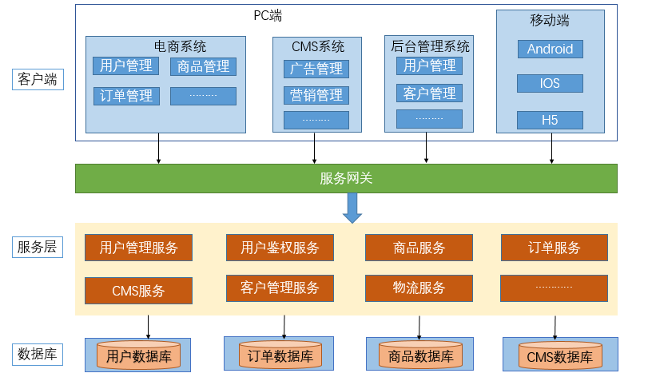
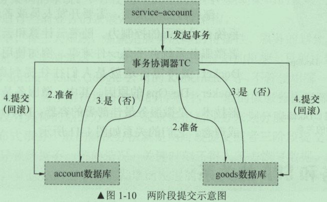
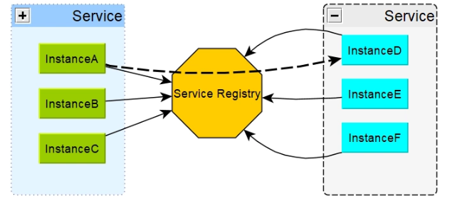
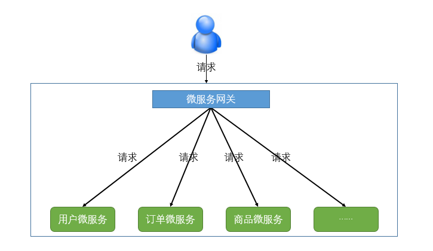

## 1. 系统架构的演变

随着互联网的发展，网站应用的规模不断扩大，常规的应用架构已无法应对，分布式服务架构以及微服务架构势在必行，亟需一个治理系统确保架构有条不紊的演进。

### 1.1. 单体应用架构

Web 应用程序发展的早期，大部分 web 工程(包含前端页面，web 层代码，service 层代码，dao 层代码)是将所有的功能模块，打包到一起并部署到一个 web 容器中运行，这种系统就叫做单体架构。


比如搭建一个电商系统：客户下订单，商品展示，用户管理。


面对业务发展与用户量增加带来的高并发访问，可以将单体应用进行集群部署，并增加负载均衡服务器（如 Nginx 等）。另外，还需要增加集群部署的缓存服务器和文件服务器，并将数据库读写分离。

用负载均衡服务器分发高并发的网络请求，用户的访问被分派到不同的应用服务器，用户量增加时，添加应用服务器即可。通过添加缓存服务器来缓解数据库的数据以及数据库读取数据的压力。大多数的读取操作是由缓存完成，但仍然有少数读操作是从数据库读取的，例如缓存失效、实时数据等。

当有大量读写操作时，可以将数据库进行读写分离，例如 MySQL 的主从热备份，通过相关配置可以将主数据库服务器的数据同步到从数据库服务器，实现数据库的读写分离，改善数据库的负载能力。

单体应用架构优点：

- 所有的功能集成在一个项目工程中
- 项目架构简单，前期开发成本低，周期短，小型项目的首选

单体应用架构缺点：

- 全部功能集成在一个工程中，对于大型项目不易开发、扩展及维护
- 系统性能扩展只能通过扩展集群结点，成本高、有瓶颈
- 技术栈受限

### 1.2. 垂直应用架构

当访问量逐渐增大，单一应用增加机器带来的加速度越来越小，将应用拆成互不相干的几个应用，以提升效率


垂直应用架构优点：

- 项目架构简单，前期开发成本低，周期短，小型项目的首选
- 通过垂直拆分，原来的单体项目不至于无限扩大
- 不同的项目可采用不同的技术

垂直应用架构缺点：

- 全部功能集成在一个工程中，对于大型项目不易开发、扩展及维护
- 系统性能扩展只能通过扩展集群结点，成本高、有瓶颈

### 1.3. 面向服务的架构（SOA）

SOA 全称为 Service-Oriented Architecture，即面向服务的架构。它可以根据需求通过网络对松散耦合的粗粒度应用组件(服务)进行分布式部署、组合和使用。一个服务通常以独立的形式存在于操作系统进程中。


站在功能的角度，把业务逻辑抽象成可复用、可组装的服务，通过服务的编排实现业务的快速再生，其主要目的是把原先固有的业务功能转变为通用的业务服务，实现业务逻辑的快速复用。

**SOA 架构特点：分布式、可重用、扩展灵活、松耦合**。当垂直应用越来越多，应用之间交互不可避免，将核心业务抽取出来，作为独立的服务，逐渐形成稳定的服务中心，使前端应用能更快速的响应多变的市场需求。


SOA 架构优点：

- 抽取公共的功能为服务，提高开发效率
- 对不同的服务进行集群化部署解决系统压力
- 基于ESB/DUBBO减少系统耦合

SOA 架构缺点：

- 抽取服务的粒度较大
- 服务提供方与调用方接口耦合度较高

### 1.4. 微服务架构（Microservices）

微服务架构（Microservices Architecture），简单的说就是将单体应用进一步拆分，拆分成更小的服务，每个服务都是可以独立运行、独立开发、独立部署、独立维护的服务或者应用的聚合，从而满足业务快速变化及分布式多团队并行开发的需求。

例如：



> 更多内容详见『微服务架构』章节

#### 1.4.1. SOA 与微服务的关系

- **SOA（ Service Oriented Architecture ）“面向服务的架构”**：是一种设计方法，其中包含多个服务，服务之间通过相互依赖最终提供一系列的功能。一个服务通常以独立的形式存在与操作系统进程中。各个服务之间通过网络调用。
- **微服务架构**：其实和 SOA 架构类似，微服务是在 SOA 上做的升华，微服务架构强调的一个重点是“业务需要彻底的组件化和服务化”，原有的单个业务系统会拆分为多个可以独立开发、设计、运行的小应用。这些小应用之间通过服务完成交互和集成。


#### 1.4.2. 微服务渐进式替代过程

微服务与微前端原理和软件工程，面向对象设计中的原理同样相通，都是遵循单一职责(Single Responsibility)、关注分离(Separation of Concerns)、模块化(Modularity)与分而治之(Divide & Conquer)等基本的原则。


### 1.5. 云原生架构（Cloud Native）

云原生是通过构建团队、文化和技术，利用自动化和架构来管理系统的复杂性和解放生产力。


云原生应用架构的几个主要特征：符合 12 Factors 应用、面向微服务架构、自服务敏捷架构、基于 API 的协作以及抗脆弱性。2015 年 Google 主导成立了云原生计算基金会（CNCF），起初对云原生（Cloud Native）的定义包含三个方面：**应用容器化、面向微服务架构、应用支持容器的编排调度**。

云原生应用程序简单地定义为从头开始为云计算架构而构建应用程序；这意味着，如果将应用程序设计为预期将部署在分布式、可扩展的基础架构上，那么应用程序就是云原生的。随着公共云将承载越来越多的算力，未来云计算将是主流的 IT 能力交付方式，CNCF 也对云原生进行了重新定义：云原生的代表技术包括容器、服务网格、微服务、不可变基础设施和声明式 API。

- Codeless 对应的是服务开发，实现了源代码托管，只需要关注代码实现，而不需要关心代码在哪，因为在整个开发过程中都不会感受到代码库和代码分支的存在。
- Applicationless 对应的是服务发布，在服务化框架下，服务发布不再需要申请应用，也不需要关注应用部署的地方。
- Serverless 对应的则是服务运维，有了 Serverless 化能力，不再需要关注机器资源，Servlerless 会搞定机器资源的弹性扩缩容 这些技术组合搭配，能够构建容错性好、易于管理和便于观察的松耦合系统；再结合可靠的自动化手段，云原生技术能够使工程师轻松地对系统作出频繁和可预测的重大变更。由此可见，云原生是保障系统能力灵动性地有效抓手；云原生技术有利于各组织在公有云、私有云和混合云等新型动态环境中，构建和运行可弹性扩展的应用。微服务架构非常适合云原生应用程序；但是，云原生同样存在着一定的限制，如果云原生应用程序部署在 AWS 等公有云上，则云原生 API 不是跨云平台的。


云原生应用的关键属性包括了：使用轻量级的容器打包、使用最合适的语言和框架开发、以松耦合的微服务方式设计、以 API 为中心的交互和协作、无状态和有状态服务在架构上界限清晰、不依赖于底层操作系统和服务器、部署在自服务、弹性的云基础设施上、通过敏捷的 DevOps 流程管理、自动化能力、通过定义和策略驱动的资源分配。云原生是分布式应用当下重要的发展路径，其终态应当是 Distributionless，所有与分布式相关的问题由云平台解，分布式应用的开发会跟传统应用的开发一样方便，甚至更加便捷。

## 2. 架构基础理论

### 2.1. 架构的核心要素

软件架构即“有关软件整体结构与组件的抽象描述，用于指导大型软件系统各方面的设计”。一般来说软件架构需要关注性能、可用性、伸缩性、扩展性和安全性这 5 个架构要素。

#### 2.1.1. 性能

性能是网站架构设计的一个重要方面，任何软件架构设计方案都必须考虑可能带来的性能问题。衡量网站性能有一系列重要指标，如：响应时间、TPS、系统性能计数器等，通过这些指标以确定系统设计是否达到目标。

通常优化网站性能的手段有：

- **浏览器端**：可以通过浏览器缓存、页面压缩传输、合理布局页面、减少 Cookie 传输等手段，甚至可以使用 CDN 加速功能。
- **应用服务器端**：可以使用服务器本地缓存和分布式缓存，也可以通过异步操作方式来加快响应，在高并发请求的情况下，可以将多台应用服务器组成一个集群共同对外服务，提高整体处理能力，改善性能。
- **数据库服务器端**：可用使用索引、缓存、SQL 性能优化等手段，还可以使用 NoSQL 数据库来优化数据模型、存储结构等。

#### 2.1.2. 可用性

可用性即能够不间断提供服务的时间。几乎所有网站都承诺7×24小时可用，但事实上任何网站都不可能达到完全的7×24，总会有一些故障时间，扣除这些故障时间，就是**网站的可用时间**。一些大型网站可以做到4个9以上的可用性，也就是99.99%。

网站高可用的主要手段就是冗余，应用部署在多台服务器上同时提供服务，数据存储在多台服务器上相互备份，任何一台服务器都不会影响应用的整体可以，通常的实现手段即把多台服务器通过负载均衡设备组成一个集群。

衡量一个系统架构设计是否满足高可用的目标，就是假设系统中任何一台或者多台服务器宕机时，以及出现各种不可预期的问题时，系统整体是否依然可用。

#### 2.1.3. 伸缩性

大型网站需要面对大量用户的高并发访问和存储海量数据，网站通过集群的方式将多台服务器组成一个整体共同提供服务。所谓**伸缩性**是指通过不断向集群中加入服务器数量的手段，来缓解不断整体上升的用户并发访问压力和不断增长的数据存储需求。

衡量架构伸缩性的主要标准是：是否可用多台服务器构建集群，是否容易向集群中添加新的服务器。加入新的服务器后是否可以提供和原来的服务器无差别的服务。集群中可容纳的总服务器数量是否有限制。

#### 2.1.4. 扩展性

不同于其他架构要素主要关注非功能性需求，网站的扩展性架构直接关注网站的功能需求。网站快速发展，功能不断扩展，如何设计网站的架构使其能够快速响应需求变化，是网站可扩展架构的主要目标。

衡量网站架构扩展性好坏的主要标准是，在网站增加新的业务产品时，是否可以实现对现有产品透明无影响，不同产品之间是否很少耦合等。网站可扩展架构的主要手段是**事件驱动架构**和**分布式服务**。

- 事件驱动通常利用消息队列实现，通过这种方式将消息生产和处理逻辑分隔开。
- 分布式服务则是将业务和可复用服务分离开来，通过分布式服务框架调用。新增加产品可用通过调用可复用的服务来实现自身的业务逻辑，而对现有产品没有任何影响。

#### 2.1.5. 安全性

网站的安全架构就是保护网站不受恶意访问和攻击，保护网站的重要数据不被窃取。

衡量网站安全架构的标准是，针对现存和潜在的各种攻击和窃密手段，是否有可靠的应对策略。

## 3. 微服务架构

### 3.1. 微服务概念

*以下是节选 spring 官网关于微服务介绍*

> Microservices
>
> Microservice architectures are the ‘new normal’. Building small, self-contained, ready to run applications can bring great flexibility and added resilience to your code. Spring Boot’s many purpose-built features make it easy to build and run your microservices in production at scale. And don’t forget, no microservice architecture is complete without Spring Cloud ‒ easing administration and boosting your fault-tolerance.
>
> 翻译：微服务架构是一种 "新常态"。构建小型的、独立的、可随时运行的应用程序可以为您的代码带来极大的灵活性，并增加弹性。Spring Boot 的许多专用功能使其能够轻松地在生产中大规模地构建和运行你的微服务。别忘了，没有 Spring Cloud 的微服务架构是不完整的 -- 它可以减轻管理，提高容错能力。

微服务架构是一种架构模式、风格，它提倡将单一应用程序划分为一组小的服务，每个服务运行在其自己独立的进程中。服务之间采用轻量级的通信机制互相协调、配合（通常是基于 HTTP 的 RESTful API），每个服务都围绕着具体的业务进行构建，并且能够被独立的构建在生产环境、类生产环境等。

另外，应避免统一的、集中式的服务管理机制，可以有一个非常轻量级的集中式管理来协调这些服务。对具体的一个服务而言，应根据业务上下文，选择合适的语言、工具对其进行构建，各个微服务可以使用不同的语言来编写，也可以使用不同的数据存储。

### 3.2. 微服务架构基础组件


- 客户端 – 来自不同设备的不同用户发送请求。
- 身份提供商 – 验证用户或客户身份并颁发安全令牌。
- API 网关 – 处理客户端请求。
- 静态内容 – 容纳系统的所有内容。
- 管理 – 在节点上平衡服务并识别故障。
- 服务发现 – 查找微服务之间通信路径的指南。
- 内容交付网络 – 代理服务器及其数据中心的分布式网络。
- 远程服务 – 启用驻留在 IT 设备网络上的远程访问信息。

### 3.3. 常见微服务框架

#### 3.3.1. Spring Cloud

Spring Cloud 是一系列框架的有序集合。它利用 Spring Boot 的开发便利性巧妙地简化了分布式系统基础设施的开发，如**服务发现注册、配置中心、消息总线、负载均衡、断路器、数据监控**等，都可以用 Spring Boot 的开发风格做到一键启动和部署。

Spring Cloud 并没有重复制造轮子，它只是将目前各家公司开发的比较成熟、经得起实际考验的服务框架组合起来，通过 Spring Boot 风格进行再封装屏蔽掉了复杂的配置和实现原理，最终给开发者留出了一套简单易懂、易部署和易维护的分布式系统开发工具包

官网：https://spring.io/projects/spring-cloud

#### 3.3.2. Apache ServiceComb

Apache ServiceComb，前身是华为云的微服务引擎 CSE (Cloud Service Engine) 云服务，是业界第一个Apache微服务顶级项目，它提供了一站式的微服务开源解决方案，致力于帮助企业、用户和开发者将企业应用轻松微服务化上云，并实现对微服务应用的高效运维管理。其融合SDK框架级、零侵入ServiceMesh场景并支持多语言

官网：http://servicecomb.apache.org/cn/

#### 3.3.3. ZeroC ICE

ZeroC IceGrid 是ZeroC公司的杰作，继承了CORBA的血统，是新一代的面向对象的分布式系统中间件。作为一种微服务架构，它基于RPC框架发展而来，具有良好的性能与分布式能力

官网：https://zeroc.com/products/ice

#### 3.3.4. Spring Cloud Alibaba

Spring Cloud Alibaba 致力于提供微服务开发的一站式解决方案。此项目包含开发分布式应用微服务的必需组件，方便开发者通过 Spring Cloud 编程模型轻松使用这些组件来开发分布式应用服务。

官网：https://spring.io/projects/spring-cloud-alibaba#overview

### 3.4. 微服务特点

- 解耦 – 系统内的服务很大程度上是分离的，按业务划分成一个独立运行的程序，即服务单元。因此，整个应用程序可以轻松构建，更改和扩展
- 微服务是一个分布式系统，具有极强的横向扩展能力，微服务可以集群化部署、集中化管理
- 组件化 – 微服务被视为可以轻松更换和升级的独立组件
- 业务能力 – 微服务非常简单，专注于单一功能
- 自治 – 开发人员和团队可以彼此独立工作，从而提高速度
- 持续交付 – 通过软件创建，测试和标准的系统自动化部署，允许频繁发布软件
- 责任 – 微服务不关注应用程序作为项目。相反，他们将应用程序视为他们负责的产品
- 分散治理 – 重点是使用正确的工具来做正确的工作。这意味着没有标准化模式或任何技术模式。开发人员可以自由选择不同的编程语言、最有用的工具来解决他们的问题
- 敏捷 – 微服务支持敏捷开发。任何新功能都可以快速开发并再次丢弃
- 数据存储 - 各个微服务可以使用不同的存储技术
- 服务之间通过 HTTP 协议相互通信

#### 3.4.1. 微服务通过 HTTP 相互通信

微服务架构中所有服务应该能够彼此交互以构建业务功能。因此，要实现这一点，每个微服务必须具有接口。这使得 Web API 成为微服务的一个非常重要的推动者。RESTful API 基于 Web 的开放网络原则，为构建微服务架构的各个组件之间的接口提供了最合理的模型。

- 微服务单元之间的通信一般使用 HTTP 的通信机制，更多的时候使用 RESTFUL api 的，可以跨平台与语言
- 服务与服务之间也可以通过轻量级的消息总线来通信，如 RabbitMQ，Kafaka 等
- 服务与服务之间的通信格式一般为 json、xml。这两种数据格式与平台、语言、通信协议无关

#### 3.4.2. 微服务的数据库独立

微服务都有自己独立的数据库，数据库之间没有任何联系。数据库的存储方式可以是关系型数据库，也可以是非关系数据库（如：MongoDB、Redis）

#### 3.4.3. 微服务的自动化部署

微服务架构有多少服务就需要部署多少次，所以微服务部署的核心是 Docker 容器技术，是微服务最佳部署的容器，需要使用 Docker 容器技术以及自动化部署工具（如：开源组件 Jenkins）。DevOps 是一种部署手段或理念。

### 3.5. 微服务架构的常见问题

#### 3.5.1. 微服务的复杂度

服务与服务之间相互依赖，如果修改某个服务，会对另一个服务产生影响。比如修改一个比较基础的服务，可能需要重启所有的服务才能完成测试

#### 3.5.2. 分布式事务



分布式事务提交需要两个阶段

- 第1个阶段：Service-account发起一个分布式事务，交给事务协调器TC处理，事务协调器TC向所有参与的事务的节点发送处理事务操作的准备操作，将Undo和Redo信息写进日志，并向事务管理器返回准备操作是否成功。
- 第2个阶段：事务管理器收集的呢节点的准备操作是否成功，如果都成功，则通知所有的节点执行提交操作；如果有一个失败，则执行回滚操作。但如果第1阶段都成功，而执行第2阶段的某一个节点失败，仍然导致数据的不准确。如果分布式事务涉及的节点很多，某个节点的网络出现异常会导致整个事务处于阻塞状态，大大降低数据库的性能。所以一般情况下，尽量少用分布式事务。

### 3.6. 微服务的优缺点

**优点**：

- 独立开发 – 所有微服务都可以根据各自的功能轻松开发
- 独立部署 – 通过服务的原子化拆分，基于其服务，可以在任何应用程序中单独打包、部署和升级，小团队的交付周期将缩短，运维成本也将大幅度下降。
- 故障隔离 – 即使应用程序的一项服务不起作用，系统仍可继续运行
- 混合技术堆栈 – 各个微服务可以使用不同的语言和技术来构建同一应用程序的不同服务，面向接口编程。
- 粒度缩放 – 单个组件可根据需要进行缩放，无需将所有组件缩放在一起
- 易于第三方集成。
- 数据可以灵活搭配，可存储公共库或者独立库。
- 微服务遵循单一原则。微服务之间采用 Restful 等轻量协议传输。
- 松耦合，功能细化。

**缺点**：

- 微服务过多，服务治理成本高，不利于系统维护。
- 分布式系统开发的技术成本高（负载平衡、容错、分布式事务、数据一致性、系统集成测试、性能监控等）。
- 性能问题。复杂性导致系统开销增加，包括网络问题，延迟开销，带宽问题，安全问题。
- 分布式系统中的冗余问题。
- 部署复杂性，对 Devops 技能的要求高。

### 3.7. 微服务测试

#### 3.7.1. 不同类型的微服务测试

在微服务构架中，由于有多个微服务协同工作，测试变得非常复杂。因此，测试分为不同的级别：

- **底层级别**：面向技术的测试，如单元测试和性能测试。这些是完全自动化的。
- **中间层面级别**：进行诸如压力测试和可用性测试之类的探索性测试。
- **顶层级别**：验收测试，有助于利益相关者理解和验证软件功能。

#### 3.7.2. 端到端微服务测试

端到端测试验证了工作流中的每个流程都正常运行。这可确保系统作为一个整体协同工作并满足所有要求。通俗地说，端到端测试是一种在特定时期后测试所有东西。


#### 3.7.3. 测试中消除非确定性

非确定性测试（NDT）基本上是不可靠的测试。即有时可能会发生它们通过，但有时它们也可能会失败。当它们失败时，它们会重新运行通过。从测试中删除非确定性的一些方法如下：

1. 隔离
2. 异步
3. 远程服务
4. 隔离
5. 时间
6. 资源泄漏

#### 3.7.4. Mike Cohn 的测试金字塔

Mike Cohn 提供了一个名为 Test Pyramid 的模型。这描述了软件开发所需的自动化测试类型。根据金字塔，第一层的测试数量应该最高。在服务层，测试次数应小于单元测试级别，但应大于端到端级别。


## 4. 服务治理（注册中心）

服务治理就是进行服务的自动化管理，其**核心是服务的自动化注册与发现**。

注册中心相当于微服务架构中的“通讯录”，它记录了服务和服务地址的映射关系。在分布式架构中，服务会注册到这里，当服务需要调用其它服务时，就这里找到服务的地址，进行调用。



> 更多内容详见[《分布式服务注册中心概述》笔记](/分布式微服务/服务注册中心/分布式服务注册中心-概述)

## 5. 服务调用

在微服务架构中，通常存在多个服务之间的远程调用的需求。<font color=red>**远程调用通常包含两个部分：序列化和通信协议**</font>。常见的序列化协议包括json、xml、hession、protobuf、thrift、text、bytes等，<font color=red>**目前主流的远程调用技术有基于 HTTP 的 RESTful 接口以及基于 TCP 的 RPC 协议**</font>。

- RPC (Remote Promote Call)：一种进程间通信方式。允许像调用本地服务一样调用远程服务。RPC框架的主要目标就是让远程服
务调用更简单、透明。RPC框架负责屏蔽底层的传输方式、序列化方式和通信细节。开发人员在使
用的时候只需要了解谁在什么位置提供了什么样的远程服务接口即可，并不需要关心底层通信细节
和调用过程。

### 5.1. HTTP 的 RESTfull 接口

REST（Representational State Transfer），这是一种HTTP调用的格式，更标准，更通用，无论哪种语言都支持http协议。如果一个架构符合REST原则，就称它为RESTful架构。

- **资源（Resources）**：就是网络上的一个实体，或者说是网络上的一个具体信息。可以用一个URI（统一资源定位符）指向它，每种资源对应一个特定的URI。要获取这个资源，访问它的URI就可以
- **表现层（Representation）**：把"资源"具体呈现出来的形式。
- **状态转化（State Transfer）**：访问一个网站，就代表了客户端和服务器的一个互动过程。在这个过程中，势必涉及到数据和状态的变化。如果客户端想要操作服务器，必须通过某种手段，让服务器端发生"状态转化"（State Transfer）。客户端用到的手段就是HTTP协议里面，四个表示操作方式的动词：GET、POST、PUT、DELETE。它们分别对应四种基本操作：GET用来获取资源，POST用来新建资源（也可以用于更新资源），PUT用来更新资源，DELETE用来删除资源。

RESTful架构总结：

- 每一个URI代表一种资源
- 客户端和服务器之间，传递这种资源的某种表现层
- 客户端通过四个HTTP动词，对服务器端资源进行操作，实现"表现层状态转化"

### 5.2. RPC 协议

RPC（Remote Procedure Call ）一种进程间通信方式。允许像调用本地服务一样调用远程服务。RPC 框架的主要目标就是让远程服务调用更简单、透明。RPC框架负责屏蔽底层的传输方式（TCP或者UDP）、序列化方式（XML/JSON/二进制）和通信细节。开发人员在使用的时候只需要了解谁在什么位置提供了什么样的远程服务接口即可，并不需要关心底层通信细节和调用过程。


### 5.3. RESTful 与 RPC 的区别


- HTTP 相对更规范，更标准，更通用，无论哪种语言都支持http协议。如果对外开放API，例如开放平台，外部的编程语言多种多样，需要对每种语言的支持，现在开源中间件，基本最先支持的几个协议都包含 RESTful
- RPC 框架作为架构微服务化的基础组件，它能大大降低架构微服务化的成本，提高调用方与服务提供方的研发效率，屏蔽跨进程调用函数（服务）的各类复杂细节。让调用方感觉就像调用本地函数一样调用远端函数、让服务提供方感觉就像实现一个本地函数一样来实现服务

## 6. 服务网关（API Gateway）

随着微服务的不断增多，不同的微服务一般会有不同的网络地址，而外部客户端可能需要调用多个服务的接口才能完成一个业务需求，如果让客户端直接与各个微服务通信可能出现以下问题：

- 客户端会请求多个不同的服务，需要维护不同的请求地址，增加开发难度
- 在某些场景下存在跨域请求的问题
- 加大身份认证的难度，每个微服务需要独立的身份认证

此时需要一个微服务网关，介于客户端与服务器之间的中间层，所有的外部请求都会先经过微服务网关。客户端只需要与网关交互，只知道一个网关地址即可。增加服务网关的有以下优点：

1. 易于监控
2. 易于认证
3. 减少了客户端与各个微服务之间的交互次数



### 6.1. 服务网关的概念

微服务系统中，API接口资源通常是由服务网关（也称API网关）统一暴露，由网关层统一接入和输出。API Gateway 是一个服务器，也可以说是进入系统的唯一节点。

API网关封装了系统内部架构，为每个客户端提供一个定制的API。API网关方式的核心要点是，所有的客户端和消费端都通过统一的网关接入微服务，在网关层处理所有的非业务功能。通常，网关也是提供REST/HTTP的访问API。服务端通过API-GW注册和管理服务。

### 6.2. 作用和应用场景

API Gateway 封装内部系统的架构，并且提供 API 给各个客户端。一个网关的基本功能有：统一接入、安全防护、协议适配、流量管控、长短链接支持、容错能力。有了网关之后，各个API服务提供团队可以专注于自己的的业务逻辑处理，而API网关更专注于安全、流量、路由等问题。它还可以有其他功能，如授权、监控、负载均衡、缓存、请求分片和管理、静态响应处理等。网关层作用如下：

1. 将所有服务的API接口资源统一暴露
2. 实现用户身份认证、权限认证、防止非法请求操作API接口
3. 实现监控功能，实时日志输出，对请求进行记录
4. 做流量监控
5. API接口从内部分离出来


**API Gateway 负责请求转发、合成和协议转换**。所有来自客户端的请求都要先经过 API Gateway，然后路由这些请求到对应的微服务。API Gateway 将经常通过调用多个微服务来处理一个请求以及聚合多个服务的结果。它可以在 web 协议与内部使用的非 Web 友好型协议间进行转换，如 HTTP 协议、WebSocket 协议。

### 6.3. 常见的API网关实现方式

**Kong**

- 基于Nginx+Lua开发，性能高，稳定，有多个可用的插件(限流、鉴权等等)可以开箱即用。
- 问题：只支持Http协议；二次开发，自由扩展困难；提供管理API，缺乏更易用的管控、配置方式

**Zuul**

- Netflix开源，功能丰富，使用JAVA开发，易于二次开发；需要运行在web容器中，如Tomcat。
- 问题：缺乏管控，无法动态配置；依赖组件较多；处理Http请求依赖的是Web容器，性能不如Nginx

**Traefik**

- Go语言开发；轻量易用；提供大多数的功能：服务路由，负载均衡等等；提供WebUI
- 问题：二进制文件部署，二次开发难度大；UI更多的是监控，缺乏配置、管理能力；

**Spring Cloud Gateway**

- SpringCloud提供的网关服务

**Nginx+lua实现**

- 使用Nginx的反向代理和负载均衡可实现对api服务器的负载均衡及高可用。lua是一种脚本语言,可以来编写一些简单的逻辑, nginx支持lua脚本
- 问题：自注册的问题和网关本身的扩展性

### 6.4. 基于 Nginx 的网关实现（扩展）

> 注：这里只是基础使用的介绍，具体使用详见 Nginx 的笔记

#### 6.4.1. Nginx 介绍


#### 6.4.2. 正向/反向代理

**正向代理**

正向代理，"它代理的是客户端，代客户端发出请求"，是一个位于客户端和原始服务器(origin server)之间的服务器，为了从原始服务器取得内容，客户端向代理发送一个请求并指定目标(原始服务器)，然后代理向原始服务器转交请求并将获得的内容返回给客户端。客户端必须要进行一些特别的设置才能使用正向代理。

**反向代理**

多个客户端给服务器发送的请求，Nginx服务器接收到之后，按照一定的规则分发给了后端的业务处理服务器进行处理了。此时~请求的来源也就是客户端是明确的，但是请求具体由哪台服务器处理的并不明确了，Nginx扮演的就是一个反向代理角色。客户端是无感知代理的存在的，反向代理对外都是透明的，访问者并不知道自己访问的是一个代理。因为客户端不需要任何配置就可以访问。反向代理，"它代理的是服务端，代服务端接收请求"，主要用于服务器集群分布式部署的情况下，反向代理隐藏了服务器的信息

如果只是单纯的需要一个最基础的具备转发功能的网关，那么使用Ngnix是一个不错的选择。

#### 6.4.3. 简单的使用示例

- 启动订单微服务，单独请求地址：http://127.0.0.1:9001/
- 启动商品微服务，单独请求地址：http://127.0.0.1:9002/

安装ngnix，找到根目录ngnix.exe双击运行即可。修改conf目录下的nginx.conf文件

```
server {
    listen       80;
    server_name  127.0.0.1;
	ssi on;
	ssi_silent_errors on;

	# 订单服务
	location /api-order {
		proxy_pass http://127.0.0.1:9001/;
	}

	# 端口服务
	location /api-product {
		proxy_pass http://127.0.0.1:9002/;
	}
}
```

## 7. 链路追踪

### 7.1. 微服务架构下的问题

在大型系统的微服务化构建中，微服务按照不同的维度，一个系统会被拆分成许多模块。这些模块负责不同的功能，组合成系统，最终可以提供丰富的功能。在这种架构中，一次请求往往需要涉及到多个服务。互联网应用构建在不同的软件模块集上，这些软件模块，有可能是由不同的团队开发、可能使用不同的编程语言来实现、有可能布在了几千台服务器，横跨多个不同的数据中心，也就意味着这种架构形式也会存在一些问题：

- 如何快速发现问题？
- 如何判断故障影响范围？
- 如何梳理服务依赖以及依赖的合理性？
- 如何分析链路性能问题以及实时容量规划？


### 7.2. 分布式链路追踪（Distributed Tracing）

**分布式链路追踪**（Distributed Tracing），就是将一次分布式请求还原成调用链路，进行日志记录，性能监控并将 一次分布式请求的调用情况集中展示。比如各个服务节点上的耗时、请求具体到达哪台机器上、每个服务节点的请求状态等等。


> 更多内容详见[《分布式链路追踪综合概述》笔记](/分布式微服务/分布式链路追踪/链路追踪综合概述)

## 8. 分布式中的 CAP 原理

对于多数大型互联网应用都是分页式系统（distributed system），分布式系统的最大难点，就是各个节点的状态如何同步。CAP 定理是这方面的基本定理，也是理解分布式系统的起点。

分布式系统的CAP理论，把分布式系统归纳成以下三个特性：

- **Consistency（一致性）**：数据一致更新，所有数据的变化都是同步的
- **Availability（可用性）**：在集群中一部分节点故障后，集群整体是否还能响应客户端的读写请求
- **Partition tolerance（分区容忍性）**：某个节点的故障，并不影响整个系统的运行

> 注：通过学习CAP理论，得知任何分布式系统只可同时满足二点，没法三者兼顾，既然一个分布式系统无法同时满足一致性、可用性、分区容错性三个特点，所以就需要抛弃其中一点


| 选择 |                                                  说明                                                   |
| --- | ------------------------------------------------------------------------------------------------------ |
| CA   | 放弃分区容错性，加强一致性和可用性，其实就是传统的关系型数据库的选择                                              |
| AP   | 放弃一致性（这里说的一致性是强一致性），追求分区容错性和可用性，这是很多分布式系统设计时的选择，例如很多NoSQL系统就是如此 |
| CP   | 放弃可用性，追求一致性和分区容错性，基本不会选择，网络问题会直接让整个系统不可用                                    |

需要明确一点的是，**在一个分布式系统当中，分区容忍性和可用性是最基本的需求，所以在分布是系统中最当关注的就是A（可用性）P（容忍性），通过补偿的机制寻求数据的一致性**

## 9. 分布式事务

### 9.1. 事务概念回顾

事务指的就是一个操作单元，在这个操作单元中的所有操作最终要保持一致的行为，要么所有操作都成功，要么所有的操作都被撤销。

本地事务其实可以认为是数据库提供的事务机制。数据库事务中的四大特性:

- A：原子性(Atomicity)，一个事务中的所有操作，要么全部完成，要么全部不完成
- C：一致性(Consistency)，在一个事务执行之前和执行之后数据库都必须处于一致性状态
- I：隔离性(Isolation)，在并发环境中，当不同的事务同时操作相同的数据时，事务之间互不影响
- D：持久性(Durability)，指的是只要事务成功结束，它对数据库所做的更新就必须永久的保存下来

数据库事务在实现时会将一次事务涉及的所有操作全部纳入到一个不可分割的执行单元，该执行单元中的所有操作要么都成功，要么都失败，只要其中任一操作执行失败，都将导致整个事务的回滚

### 9.2. 分布式事务概述

分布式事务指事务的参与者、支持事务的服务器、资源服务器以及事务管理器分别位于不同的分布式系统的不同节点之上。本质上来说，分布式事务就是为了保证不同数据库的数据一致性。

简单来说，就是一次大的操作由不同的小操作组成，这些小的操作分布在不同的服务器上，且属于不同的应用，分布式事务需要保证这些小操作要么全部成功，要么全部失败。

### 9.3. 分布式事务的场景

- **单体系统访问多个数据库**。一个服务需要调用多个数据库实例完成数据的增删改操作


- **多个微服务访问同一个数据库**。多个服务需要调用一个数据库实例完成数据的增删改操作


- **多个微服务访问多个数据库**。多个服务需要调用多个数据库实例完成数据的增删改操作


### 9.4. 分布式事务解决方案

#### 9.4.1. 全局事务

全局事务基于DTP模型实现。DTP是由X/Open组织提出的一种分布式事务模型——X/Open Distributed Transaction Processing Reference Model。它规定了要实现分布式事务，需要三种角色：

- AP: Application 应用系统 (微服务)
- TM: Transaction Manager 事务管理器 (全局事务管理)
- RM: Resource Manager 资源管理器 (数据库)

整个事务分成两个阶段：

- 阶段一: 表决阶段，所有参与者都将本事务执行预提交，并将能否成功的信息反馈发给协调者。
- 阶段二: 执行阶段，协调者根据所有参与者的反馈，通知所有参与者，步调一致地执行提交或者回滚。


**优点**

- 提高了数据一致性的概率，实现成本较低

**缺点**

- 单点问题: 事务协调者宕机
- 同步阻塞: 延迟了提交时间，加长了资源阻塞时间
- 数据不一致: 提交第二阶段，依然存在commit结果未知的情况，有可能导致数据不一致

#### 9.4.2. 可靠消息服务

基于可靠消息服务的方案是通过消息中间件保证上、下游应用数据操作的一致性。假设有A和B两个系统，分别可以处理任务A和任务B。此时存在一个业务流程，需要将任务A和任务B在同一个事务中处理。就可以使用消息中间件来实现这种分布式事务。


**第一步: 消息由系统A投递到中间件**

1. 在系统A处理任务A前，首先向消息中间件发送一条消息
2. 消息中间件收到后将该条消息持久化，但并不投递。持久化成功后，向A回复一个确认应答
3. 系统A收到确认应答后，则可以开始处理任务A
4. 任务A处理完成后，向消息中间件发送Commit或者Rollback请求。该请求发送完成后，对系统A而言，该事务的处理过程就结束了
5. 如果消息中间件收到Commit，则向B系统投递消息；如果收到Rollback，则直接丢弃消息。但是如果消息中间件收不到Commit和Rollback指令，那么就要依靠"超时询问机制"。

> 超时询问机制：系统A除了实现正常的业务流程外，还需提供一个事务询问的接口，供消息中间件调用。当消息中间件收到发布消息便开始计时，如果到了超时没收到确认指令，就会主动调用系统A提供的事务询问接口询问该系统目前的状态。该接口会返回三种结果，中间件根据三种结果做出不同反应：
>
> - 提交：将该消息投递给系统B
> - 回滚：直接将条消息丢弃
> - 处理中：继续等待

**第一步: 消息由系统A投递到中间件**

消息中间件向下游系统投递完消息后便进入阻塞等待状态，下游系统便立即进行任务的处理，任务处理完成后便向消息中间件返回应答。

- 如果消息中间件收到确认应答后便认为该事务处理完毕
- 如果消息中间件在等待确认应答超时之后就会重新投递，直到下游消费者返回消费成功响应为止。一般消息中间件可以设置消息重试的次数和时间间隔，如果最终还是不能成功投递，则需要手工干预。这里之所以使用人工干预，而不是使用让A系统回滚，主要是考虑到整个系统设计的复杂度问题。

基于可靠消息服务的分布式事务，前半部分使用异步，注重性能；后半部分使用同步，注重开发成本。

#### 9.4.3. 最大努力通知

最大努力通知也被称为定期校对，其实是对第二种解决方案的进一步优化。它引入了本地消息表来记录错误消息，然后加入失败消息的定期校对功能，来进一步保证消息会被下游系统消费。


**第一步: 消息由系统A投递到中间件**

1. 处理业务的同一事务中，向本地消息表中写入一条记录
2. 准备专门的消息发送者不断地发送本地消息表中的消息到消息中间件，如果发送失败则重试

**第二步: 消息由中间件投递到系统B**

1. 消息中间件收到消息后负责将该消息同步投递给相应的下游系统，并触发下游系统的任务执行
2. 当下游系统处理成功后，向消息中间件反馈确认应答，消息中间件便可以将该条消息删除，从而该事务完成
3. 对于投递失败的消息，利用重试机制进行重试，对于重试失败的，写入错误消息表
4. 消息中间件需要提供失败消息的查询接口，下游系统会定期查询失败消息，并将其消费

最大努力通知的优缺点：

- **优点**：一种非常经典的实现，实现了最终一致性。
- **缺点**：消息表会耦合到业务系统中，如果没有封装好的解决方案，会有很多杂活需要处理。

#### 9.4.4. TCC 事务

TCC（Try Confirm Cancel），它属于补偿型分布式事务。TCC 实现分布式事务一共有三个步骤：

- Try：尝试待执行的业务

这个过程并未执行业务，只是完成所有业务的一致性检查，并预留好执行所需的全部资源

- Confirm：确认执行业务

确认执行业务操作，不做任何业务检查， 只使用 Try 阶段预留的业务资源。通常情况下，采用 TCC 则认为 Confirm 阶段是不会出错的。即：只要 Try 成功，Confirm 一定成功。若 Confirm 阶段真的出错了，需引入重试机制或人工处理。

- Cancel：取消待执行的业务

取消 Try 阶段预留的业务资源。通常情况下，采用 TCC 则认为 Cancel 阶段也是一定成功的。若 Cancel 阶段真的出错了，需引入重试机制或人工处理。


**TCC两阶段提交与XA两阶段提交的区别是**：

- XA 是资源层面的分布式事务，强一致性，在两阶段提交的整个过程中，一直会持有资源的锁。
- TCC 是业务层面的分布式事务，最终一致性，不会一直持有资源的锁。

**TCC事务的优缺点**：

- **优点**：把数据库层的二阶段提交上提到了应用层来实现，规避了数据库层的 2PC 性能低下问题。
- **缺点**：TCC 的 Try、Confirm 和 Cancel 操作功能需业务提供，开发成本高。

## 10. 分布式基础架构之部署容器编排化


