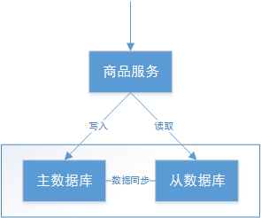

## 1. 分布式系统概述

分布式系统是一个硬件或软件组件分布在不同的网络计算机上，彼此之间仅仅通过消息传递进行通信和协调的系统。简单来说就是**一群独立计算机集合共同对外提供服务，但是对于系统的用户来说，就像是一台计算机在提供服务一样**。分布式意味着可以采用更多的普通计算机（相对于昂贵的大型机）组成分布式集群对外提供服务。计算机越多，CPU、内存、存储资源等也就越多，能够处理的并发访问量也就越大。

从分布式系统的概念中可知，各个主机之间通信和协调主要通过网络进行，所以分布式系统中的计算机在空间上几乎没有任何限制，这些计算机可能被放在不同的机柜上，也可能被部署在不同的机房中，还可能在不同的城市中，对于大型的网站甚至可能分布在不同的国家和地区。

### 1.1. 分布式系统的主要特征

一个标准的分布式系统应该具有以下几个主要特征：

- **分布性**：分布式系统中的多台计算机之间在空间位置上可以随意分布，同时，机器的分布情况也会随时变动。
- **对等性**：分布式系统中的计算机没有主/从之分，即没有控制整个系统的主机，也没有被控制的从机，组成分布式系统的所有计算机节点都是对等的。副本（Replica）是分布式系统最常见的概念之一，指的是分布式系统对数据和服务提供的一种冗余方式。在常见的分布式系统中，为了对外提供高可用的服务，我们往往会对数据和服务进行副本处理。数据副本是指在不同节点上持久化同一份数据，当某一个节点上存储的数据丢失时，可以从副本上读取该数据，这是解决分布式系统数据丢失问题最为有效的手段。另一类副本是服务副本，指多个节点提供同样的服务，每个节点都有能力接收来自外部的请求并进行相应的处理。
- **自治性**：分布式系统中的各个节点都包含自己的处理机和内存，各自具有独立的处理数据的功能。通常，彼此在地位上是平等的，无主次之分，既能自治地进行工作，又能利用共享的通信线路来传送信息，协调任务处理。
- **并发性**：在一个计算机网络中，程序运行过程的并发性操作是非常常见的行为。例如同一个分布式系统中的多个节点，可能会并发地操作一些共享的资源，如何准确并高效地协调分布式并发操作也成为了分布式系统架构与设计中最大的挑战之一。

### 1.2. 分布式系统面临的问题

- **缺乏全局时钟**：在分布式系统中，很难定义两个事件究竟谁先谁后，原因就是因为分布式系统缺乏一个全局的时钟序列控制。
- **机器宕机**：是最常见的异常之一。在大型集群中每日宕机发生的概率为千分之一左右，在实践中，一台宕机的机器恢复的时间通常认为是24 小时，一般需要人工介入重启机器。
- **网络异常**：消息丢失，两片节点之间彼此完全无法通信，即出现了“网络分化”；消息乱序，有一定的概率不是按照发送时的顺序依次到达目的节点，考虑使用序列号等机制处理网络消息的乱序问题，使得无效的、过期的网络消息不影响系统的正确性；数据错误；不可靠的TCP，TCP 协议为应用层提供了可靠的、面向连接的传输服务，但在分布式系统的协议设计中不能认为所有网络通信都基于TCP 协议则通信就是可靠的。TCP协议只能保证同一个TCP 链接内的网络消息不乱序，TCP 链接之间的网络消息顺序则无法保证。
- **分布式三态**：如果某个节点向另一个节点发起RPC(Remote procedure call)调用，即某个节点A 向另一个节点B 发送一个消息，节点B 根据收到的消息内容完成某些操作，并将操作的结果通过另一个消息返回给节点A，那么这个RPC 执行的结果有三种状态：“成功”、“失败”、“超时（未知）”，称之为分布式系统的三态。
- **存储数据丢失**：对于有状态节点来说，数据丢失意味着状态丢失，通常只能从其他节点读取、恢复存储的状态。

被大量工程实践所检验过的异常处理黄金原则是，任何在设计阶段考虑到的异常情况一定会在系统实际运行中发生，但在系统实际运行遇到的异常却很有可能在设计时未能考虑，所以，除非需求指标允许，在系统设计时不能放过任何异常情况。

### 1.3. 衡量分布式系统的指标

- **性能**：系统的吞吐能力，指系统在某一时间可以处理的数据总量，通常可以用系统每秒处理的总的数据量来衡量；系统的响应延迟，指系统完成某一功能需要使用的时间；系统的并发能力，指系统可以同时完成某一功能的能力，通常也用 QPS(query per second)来衡量。上述三个性能指标往往会相互制约，追求高吞吐的系统，往往很难做到低延迟；系统平均响应时间较长时，也很难提高 QPS。
- **可用性**(availability)：指系统在面对各种异常时可以正确提供服务的能力。系统的可用性可以用系统停服务的时间与正常服务的时间的比例来衡量，也可以用某功能的失败次数与成功次数的比例来衡量。可用性是分布式的重要指标，衡量了系统的鲁棒性，是系统容错能力的体现。
- **可扩展性(scalability)**：指分布式系统通过扩展集群机器规模提高系统性能（吞吐、延迟、并发）、存储容量、计算能力的特性。好的分布式系统总在追求“线性扩展性”，也就是使得系统的某一指标可以随着集群中的机器数量线性增长。
- **一致性**：分布式系统为了提高可用性，总是不可避免的使用副本的机制，从而引发副本一致性的问题。越是强的一致的性模型，对于用户使用来说使用起来越简单。

## 2. 分布式系统基础理论

### 2.1. CAP 理论

CAP 是 Consistency（一致性）、Availiability（可用性）、Partition tolerance（分区容错性） 三个词语的缩写。CAP 理论告诉我们 C、A、P 三者不能同时满足，最多只能满足其中两个

#### 2.1.1. 业务场景

结合电商系统中的一些业务场景来理解 CAP 理论。业务背景：

- 每台数据库服务器有它的最大连接数、负载和吞吐量，若有一天无法再满足业务的需求，就需要横向去扩展几台 Slave(从数据库) 去分担 Master(主数据库) 的压力。
- 如果服务对数据库的需求是 IO 密集型的，那可能会经常遇到增删改影响到了查询效率。这就需要进行读写分离，由主数据库应付增删改操作，由从数据库应付查询操作，主从数据库的数据要进行同步。

上图商品信息管理的执行流程：

1. 商品服务请求主数据库写入商品信息（添加商品、修改商品、删除商品）	
2. 主数据库向商品服务响应写入成功。
3. 商品服务请求从数据库读取商品信息。

#### 2.1.2. C - Consistency

一致性是指写操作后的读操作可以读取到最新的数据状态，当数据分布在多个节点上，从任意节点读取到的数据都是最新的状态。上图中，商品信息的读写要满足一致性就是要实现如下目标：

1. 商品服务写入主数据库成功，则向从数据库查询新数据也成功。
2. 商品服务写入主数据库失败，则向从数据库查询新数据也失败。

如何实现一致性？

1. 写入主数据库后要将数据同步到从数据库。
2. 写入主数据库后，在向从数据库同步期间要将从数据库锁定，待同步完成后再释放锁，以免在新数据写入成功后，向从数据库查询到旧的数据。

分布式系统一致性的特点：

1. 由于存在数据同步的过程，写操作的响应会有一定的延迟。
2. 为了保证数据一致性会对资源暂时锁定，待数据同步完成释放锁定资源。
3. 如果请求数据同步失败的结点则会返回错误信息，一定不会返回旧数据。

#### 2.1.3. A - Availability

可用性是指任何事务操作都可以得到响应结果，且不会出现响应超时或响应错误。上图中，商品信息读取满足可用性就是要实现如下目标：

1. 从数据库接收到数据查询的请求则立即能够响应数据查询结果。
2. 从数据库不允许出现响应超时或响应错误。

如何实现可用性？

1. 写入主数据库后要将数据同步到从数据库。
2. 由于要保证从数据库的可用性，不可将从数据库中的资源进行锁定。
3. 即时数据还没有同步过来，从数据库也要返回要查询的数据，哪怕是旧数据，如果连旧数据也没有则可以按照约定返回一个默认信息，但不能返回错误或响应超时。

> 为了保证可用性，一般需要通过增加从数据库节点来实现。

分布式系统可用性的特点：

1. 所有请求都有响应，且不会出现响应超时或响应错误。

#### 2.1.4. P - Partition tolerance

通常分布式系统的各个节点部署在不同的子网，这就是网络分区，不可避免的会出现由于网络故障而导致节点之间通信失败。分布式系统在遇到某节点或网络分区故障的时候，仍然能够对外提供满足一致性和可用性的服务，这就是分区容忍性。分布式系统中有某一个或者几个机器宕掉了，其他剩下的机器还能够正常运转满足系统需求，或者是机器之间有网络异常，将分布式系统分隔未独立的几个部分，各个部分还能维持分布式系统的运作，这样就具有较好的分区容忍性。上图中，商品信息读写满足分区容忍性就是要实现如下目标：

1. 主数据库向从数据库同步数据失败不影响读写操作。
2. 其中一个节点挂掉不影响另一个节点对外提供服务。

如何实现分区容忍性？

1. 尽量使用异步取代同步操作，例如使用异步方式将数据从主数据库同步到从数据，这样结点之间能有效的实现松耦合。
2. 添加从数据库结点，其中一个从结点挂掉其它从结点提供服务。

分布式分区容忍性的特点：

1. 分区容忍性分是布式系统具备的基本能力。

#### 2.1.5. CAP 共存分析

以上面章节的“商品信息管理”为例，实现了分区容忍：

- 主数据库通过网络向从数据同步数据，可以认为主从数据库部署在不同的分区，通过网络进行交互。
- 当主数据库和从数据库之间的网络出现问题不影响主数据库和从数据库对外提供服务。
- 其一个结点挂掉不影响另一个结点对外提供服务。

如果要实现C则必须保证数据一致性，在数据同步的时候为防止向从数据库查询不一致的数据则需要将从数据库数据锁定，待同步完成后解锁，如果同步失败从数据库要返回错误信息或超时信息；如果要实现A则必须保证数据可用性，不管任何时候都可以向从数据查询数据，则不会响应超时或返回错误信息。

通过分析发现，**在所有分布式事务场景中是不会同时具备 CAP 三个特性，因为在具备了 P 的前提下 C 和 A 是不能共存的**

#### 2.1.6. CAP 组合方式

在保证分区容忍性的前提下，一致性和可用性是无法兼顾，如果要提高系统的可用性就要增加多个节点，如果要保证数据的一致性就要实现每个节点的数据一致，节点越多可用性越好，但是数据一致性会越差。 CAP 的组合方式有如下几种：

- **AP**：放弃一致性，追求分区容忍性和可用性。这是很多分布式系统设计时的选择。
    - > 例如：上边的商品管理，完全可以实现AP，前提是只要用户可以接受所查询的到数据在一定时间内不是最新的即可。通常实现AP都会保证最终一致性，后面的 BASE 理论就是根据 AP 组合来扩展的，一些业务场景，比如，订单退款，今日退款成功，明日账户到账，只要用户可以接受在一定时间内到账即可。
- **CP**：放弃可用性，追求一致性和分区容错性。比如，zookeeper 其实就是追求的强一致；又比如跨行转账，一次转账请求要等待双方银行系统都完成整个事务才算完成。
- **CA**：放弃分区容忍性，即不进行分区，不考虑由于网络不通或节点挂掉的问题，则可以实现一致性和可用性。那么系统将不是一个标准的分布式系统，最常用的关系型数据库就满足了 CA 组合。

以上面商品管理为例，如果要实现 CA 则架构如下：

不再存在主从数据，单个数据库可以响应每次的查询请求，通过事务隔离级别实现每个查询请求都可以返回最新的数据。

#### 2.1.7. 总结

CAP 是一个已经被证实的理论：一个分布式系统最多只能同时满足一致性（Consistency）、可用性（Availability）和分区容忍性（Partition tolerance）这三项中的两项。它可以作为架构设计、技术选型的考量标准。对于多数大型互联网应用的场景，节点众多、部署分散，而且现在的集群规模越来越大，所以节点故障、网络故障是常态，而且要保证服务可用性达到 N个9（99.99..%），并要达到良好的响应性能来提高用户体验，因此一般都会做出如下选择：**保证分区容忍性（P）和高可用性（A），舍弃强一致性（C），保证最终一致性**。

### 2.2. BASE 理论

#### 2.2.1. 理解强一致性和最终一致性

从 CAP 理论可知，一个分布式系统最多只能同时满足一致性（Consistency）、可用性（Availability）和分区容忍性（Partition tolerance）这三项中的两项，其中 AP 在实际应用中较多，AP 即舍弃一致性，保证可用性和分区容忍性。

但是在实际生产中很多场景都要实现一致性，比如上面的例子，主数据库向从数据库同步数据，即使不要一致性，但是最终也要将数据同步成功来保证数据一致，这种一致性和 CAP 中的一致性不同，CAP 中的一致性要求在任何时间查询每个节点数据都必须一致，它强调的是强一致性，但是最终一致性是允许可以在一段时间内每个节点的数据不一致，但是经过一段时间每个节点的数据必须一致，它强调的是最终数据的一致性。

#### 2.2.2. Base 理论简介

BASE 是 Basically Available(基本可用)、Soft state(软状态)和 Eventually consistent (最终一致性)三个短语的缩写。BASE 理论是对 CAP 中 AP 的一个扩展，通过牺牲强一致性来获得可用性，当出现故障允许部分不可用但要保证核心功能可用，允许数据在一段时间内是不一致的，但最终达到一致状态。满足 BASE 理论的事务，称之为『**柔性事务**』。

- **基本可用 (Basically Available)** : 分布式系统在出现故障时，允许损失部分可用功能，保证核心功能可用。比如，电商网站交易付款出现问题了，商品依然可以正常浏览。
- **软状态 (Soft state)** : 由于不要求强一致性，所以 BASE 允许系统中存在中间状态（也叫**软状态**），这个状态不影响系统可用性，如订单的"支付中"、“数据同步中”等状态，待数据最终一致后状态改为“成功”状态。
- **最终一致 (Eventually consistent)** : 最终一致是指经过一段时间后，所有节点数据都将会达到一致。如订单的"支付中"状态，最终会变为“支付成功”或者"支付失败"，使订单状态与实际交易结果达成一致，但需要一定时间的延迟、等待。

### 2.3. 分布式一致性算法

一致性算法的目的是保证在分布式系统中，多数据副本节点数据一致性。主要包含一致性 Hash 算法，Paxos 算法，Raft 算法，ZAB 算法等。

#### 2.3.1. 一致性 Hash 算法

一致性Hash算法是个经典算法，Hash环的引入是为解决单调性(Monotonicity)的问题；虚拟节点的引入是为了解决平衡性(Balance)问题

#### 2.3.2. Paxos 算法

Paxos 算法是 Lamport 宗师提出的一种基于消息传递的分布式一致性算法，使其获得 2013 年图灵奖。自 Paxos 问世以来就持续垄断了分布式一致性算法，Paxos 这个名词几乎等同于分布式一致性，很多分布式一致性算法都由 Paxos 演变而来。

#### 2.3.3. Raft 算法

Raft 为了探索一种更易于理解的一致性算法而产生的。它的首要设计目的就是易于理解，所以在选主的冲突处理等方式上它都选择了非常简单明了的解决方案。

#### 2.3.4. ZAB 算法

ZAB 协议全称：Zookeeper Atomic Broadcast（Zookeeper 原子广播协议），是为 Zookeeper 设计的分布式一致性协议，它应该是所有一致性协议中生产环境中应用最多的了。
