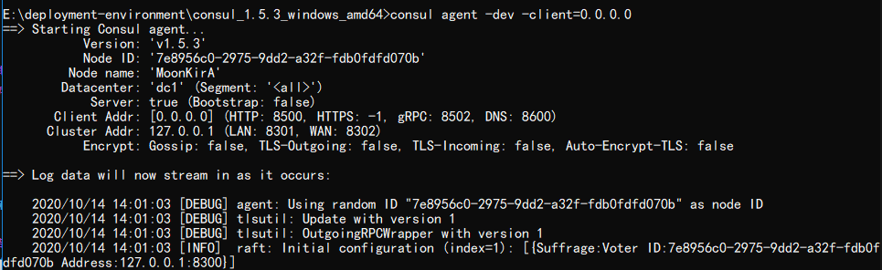
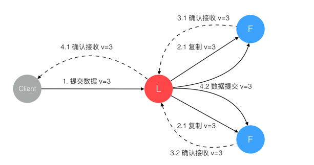

# Spring Cloud Consul

## 1. consul 基础入门

官网：https://www.consul.io/

### 1.1. consul 概述

Consul 是 HashiCorp 公司推出的开源工具，用于实现分布式系统的服务发现与配置。与其它分布式服务注册与发现的方案，Consul 的方案更“一站式”，内置了服务注册与发现框架、分布一致性协议实现、健康检查、Key/Value 存储、多数据中心方案，不再需要依赖其它工具（比如 ZooKeeper 等）。使用起来也较 为简单。Consul 使用 Go 语言编写，因此具有天然可移植性(支持Linux、windows和Mac OS X)；安装包仅包含一个可执行文件，方便部署，与 Docker 等轻量级容器可无缝配合

**Consul 的优势**：

- 使用 Raft 算法来保证一致性, 比复杂的 Paxos 算法更直接. 相比较而言, zookeeper 采用的是Paxos, 而 etcd 使用的则是 Raft。
- 支持多数据中心，内外网的服务采用不同的端口进行监听。 多数据中心集群可以避免单数据中心的单点故障,而其部署则需要考虑网络延迟, 分片等情况等。 zookeeper 和 etcd 均不提供多数据中心功能的支持。
- 支持健康检查。 etcd 不提供此功能。
- 支持 http 和 dns 协议接口。 zookeeper 的集成较为复杂, etcd 只支持 http 协议。
- 官方提供 web 管理界面, etcd 无此功能。

**Consul 的特性**：

- 服务发现
- 健康检查
- Key/Value 存储
- 多数据中心

### 1.2. consul与Eureka的区别

1. 一致性

Consul强一致性（CP）

- 服务注册相比Eureka会稍慢一些。因为Consul的raft协议要求必须过半数的节点都写入成功才认为注册成功
- Leader挂掉时，重新选举期间整个consul不可用。保证了强一致性但牺牲了可用性

Eureka保证高可用和最终一致性（AP）

- 服务注册相对要快，因为不需要等注册信息replicate到其他节点，也不保证注册信息是否replicate成功
- 当数据出现不一致时，虽然A, B上的注册信息不完全相同，但每个Eureka节点依然能够正常对外提供服务，这会出现查询服务信息时如果请求A查不到，但请求B就能查到。如此保证了可用性但牺牲了一致性

2. 开发语言和使用

- eureka就是个servlet程序，跑在servlet容器中
- Consul则是go编写而成，安装启动即可

### 1.3. consul的下载与安装

Consul 不同于 Eureka 需要单独安装，访问 Consul 官网下载 Consul 的最新版本（本次示例安装consul1.5x版）

> 已下载的安装包位置：`\07-编程工具资料\注册中心\consul\`

#### 1.3.1. Linux系统安装Consul

输入以下命令

```bash
## 从官网下载最新版本的Consul服务
wget https://releases.hashicorp.com/consul/1.5.3/consul_1.5.3_linux_amd64.zip
## 使用unzip命令解压
unzip consul_1.5.3_linux_amd64.zip
## 将解压好的consul可执行命令拷贝到/usr/local/bin目录下
cp consul /usr/local/bin
## 测试
consul
```

启动consul服务

```bash
##已开发者模式快速启动，-client指定客户端可以访问的ip地址
[root@node01 ~]# consul agent -dev -client=0.0.0.0
==> Starting Consul agent...
    Version: 'v1.5.3'
    Node ID: '49ed9aa0-380b-3772-a0b6-b0c6ad561dc5'
    Node name: 'node01'
    Datacenter: 'dc1' (Segment: '<all>')
    Server: true (Bootstrap: false)
    Client Addr: [127.0.0.1] (HTTP: 8500, HTTPS: -1, gRPC: 8502, DNS: 8600)
    Cluster Addr: 127.0.0.1 (LAN: 8301, WAN: 8302)
    Encrypt: Gossip: false, TLS-Outgoing: false, TLS-Incoming: false, Auto-Encrypt-TLS: false
```

启动成功之后访问：`http://linux系统ip:8500`，可以看到 Consul 的管理界面

#### 1.3.2. window系统安装Consul

1. 将window版压缩包`consul_1.5.3_windows_amd64.zip`解压到没有中文和空格的目录
2. 进入目录，运行命令行。输入以下命令，启动consul服务

```bash
# 以开发者模式快速启动
consul agent -dev -client=0.0.0.0
```



3. 启动成功后访问`http://127.0.0.1:8500`，进入consul管理界面

### 1.4. consul 的基本使用

Consul 支持健康检查，并提供了 HTTP 和 DNS 调用的API接口完成服务注册，服务发现，以及K/V存储这些功能。以下是基于通过发送HTTP请求的形式来实现Consul的基础使用

> *官方的API接口文档地址：https://www.consul.io/api/catalog.html#catalog_register*

#### 1.4.1. 注册服务

通过postman发送PUT请求到`http://192.168.74.101:8500/v1/catalog/register`地址可以完成服务注册，请求参数如下：

```json
{
    "Datacenter": "dc1",
    "Node": "node01",
    "Address": "192.168.74.102",
    "Service": {
        "ID": "mysql-01",
        "Service": "mysql",
        "tags": [
            "master",
            "v1"
        ],
        "Address": "192.168.74.102",
        "Port": 3306
    }
}
```

#### 1.4.2. 服务查询

通过postman发送GET请求到`http://192.168.74.101:8500/v1/catalog/services`查看所有的服务列表


通过postman发送GET请求到`http://192.168.74.101:8500/v1/catalog/service/`服务名查看具体的服务详情


#### 1.4.3. 服务删除

通过postman发送PUT请求到`http://192.168.74.101:8500/v1/catalog/deregister`删除服务

```json
{
    "Datacenter": "dc1",
    "Node": "node01",
    "ServiceID": "mysql-01"
}
```

#### 1.4.4. Consul的K/V存储

可以参照Consul提供的KV存储的API完成基于Consul的数据存储

|   含义    |   请求路径    | 请求方式 |
| --------- | :-----------: | :-----: |
| 查看key   | `v1/kv/:key`  |   GET   |
| 保存或更新 | `v1/kv/:key`  |   PUT   |
| 删除      | `/v1/kv/:key` | DELETE  |

- key值中可以带`/`, 可以看做是不同的目录结构
- value的值经过了base64_encode,获取到数据后base64_decode才能获取到原始值。数据不能大于512Kb
- 不同数据中心的kv存储系统是独立的，使用`dc=?`参数指定。

## 2. 基于consul的服务注册与发现示例

### 2.1. 示例工程的准备

复用之前eureka单机版的示例项目`02-springcloud-eureka`，将里面eureka子模块、相关的配置与依赖都删除。命名为`05-springcloud-consul`

### 2.2. 引入 consul 依赖

修改服务提供者与消费者微服务的`pom.xml`文件，添加SpringCloud提供的基于Consul的依赖

```xml
<!-- springcloud 提供的对基于Consul的服务发现 -->
<dependency>
    <groupId>org.springframework.cloud</groupId>
    <artifactId>spring-cloud-starter-consul-discovery</artifactId>
</dependency>
<!-- actuator的健康检查（心跳检查） -->
<dependency>
    <groupId>org.springframework.boot</groupId>
    <artifactId>spring-boot-starter-actuator</artifactId>
</dependency>
```

- `spring-cloud-starter-consul-discovery` 是SpringCloud提供的对consul支持的相关依赖
- `spring-boot-starter-actuator` 适用于完成心跳检测响应的相关依赖

### 2.3. 配置服务注册

修改服务提供者与消费者微服务的`application.yml`配置文件，添加consul服务注册的相关配置信息

```yml
spring:
  # ...省略其他配置
  # Consul的服务注册配置
  cloud:
    consul:
      host: 127.0.0.1 # consul服务器的主机ip地址
      port: 8500 # consul服务器的端口
      discovery:
        register: true # 是否需要注册，默认值是true
        instance-id: ${spring.application.name}:${server.port} # 注册的实例ID (唯一标志)
        service-name: ${spring.application.name} # 服务的名称
        port: ${server.port} # 服务的请求端口
        prefer-ip-address: true # 是否开启ip地址注册，默认值是false
        ip-address: ${spring.cloud.client.ip-address} # 当前服务的请求ip
        health-check-path: /actuator/health # 健康检查路径，默认值就是/actuator/health
        health-check-interval: 15s # 健康检查时间间隔，默认值是10s
```

`spring.cloud.consul` 属性是添加consul的相关配置

- `host`：表示Consul的Server的请求地址
- `port`：表示Consul的Server的端口
- `discovery`：服务注册与发现的相关配置
    - `instance-id`：实例的唯一id（推荐必填），spring cloud官网文档的推荐，为了保证生成一个唯一的id，也可以换成`${spring.application.name}:${spring.cloud.client.ip-address}`
    - `prefer-ip-address`：开启ip地址注册
    - `ip-address`：当前微服务的请求ip

### 2.4. Consul 控制台查看服务列表

启动相关的微服务，打开ConsulServer的管理控制台，相关的微服务已经全部注册到Consul中了


### 2.5. 基于consul的服务发现

由于SpringCloud对Consul进行了封装。对于在消费者端获取服务提供者信息和Eureka是一致的。同样使用 `DiscoveryClient` 完成调用获取微服务实例信息，也可以使用 Ribbon 完成服务的调用。


下面以Ribbon的方式完成服务的调用示例

#### 2.5.1. 修改配置类增加负载均衡

修改消费者的配置类`HttpConfig`，给`RestTemplate`对象增加Ribbon组件的`@LoadBalanced`注解标识

```java
@LoadBalanced // springcloud对consul进行了封装，集成了Ribbon的支持
@Bean("restTemplate")
public RestTemplate createRestTemplate() {
    return new RestTemplate();
}
```

#### 2.5.2. 修改消费者请求方式

修改消费者`OrderController`使用Ribbon请求方式

```java
@Autowired
private RestTemplate restTemplate;

/**
 * 根据商品id创建订单
 *
 * @param id 商品的id
 * @return
 */
@PostMapping("/{id}")
public String createOrder(@PathVariable Long id) {
    /*
     * 通过http请求，获取商品数据
     * 拼接请求url，将原来使用ip+端口调用的方式，改成要调用的服务对应的名称即可
     * 服务提供者名称在其项目配置文件的spring.application.name属性中定义
     */
    Product product = restTemplate.getForObject("http://shop-service-product/product/" + id, Product.class);
    LOGGER.info("当前下单的商品是: ${}", product);
    return "创建订单成功";
}
```

## 3. consul高可用集群

### 3.1. consul 集群架构图


上图是官网提供的一个事例系统图，图中的Server是consul服务端高可用集群，Client是consul客户端。consul客户端不保存数据，客户端将接收到的请求转发给响应的Server端。Server之间通过局域网或广域网通信实现数据一致性。每个Server或Client都是一个consul agent。Consul集群间使用了GOSSIP协议通信和raft一致性算法。上面这张图涉及到了很多术语：

- Agent：agent是一直运行在Consul集群中每个成员上的守护进程。通过运行 consul agent来启动。agent可以运行在client或者server模式。指定节点作为client或者server是非常简单的，除非有其他agent实例。所有的agent都能运行DNS或者HTTP接口，并负责运行时检查和保持服务同步。
- Client：一个Client是一个转发所有RPC到server的代理。这个client是相对无状态的。client唯一执行的后台活动是加入LAN gossip池。这有一个最低的资源开销并且仅消耗少量的网络带宽。
- Server：一个server是一个有一组扩展功能的代理，这些功能包括参与Raft选举，维护集群状态，响应RPC查询，与其他数据中心交互WANgossip和转发查询给leader或者远程数据中心。
- DataCenter：虽然数据中心的定义是显而易见的，但是有一些细微的细节必须考虑。例如，在EC2中，多个可用区域被认为组成一个数据中心？我们定义数据中心为一个私有的，低延迟和高带宽的一个网络环境。这不包括访问公共网络，但是对于我们而言，同一个EC2中的多个可用区域可以被认为是一个数据中心的一部分。
- Consensus：在我们的文档中，我们使用Consensus来表明就leader选举和事务的顺序达成一致。由于这些事务都被应用到有限状态机上，Consensus暗示复制状态机的一致性。
- Gossip：Consul建立在Serf的基础之上，它提供了一个用于多播目的的完整的gossip协议。Serf提供成员关系，故障检测和事件广播。更多的信息在gossip文档中描述。这足以知道gossip使用基于UDP的随机的点到点通信
- LAN Gossip：它包含所有位于同一个局域网或者数据中心的所有节点。
- WAN Gossip：它只包含Server。这些server主要分布在不同的数据中心并且通常通过因特网或者广域网通信

在每个数据中心，client和server是混合的。一般建议有3-5台server。这是基于有故障情况下的可用性和性能之间的权衡结果，因为越多的机器加入达成共识越慢。然而，并不限制client的数量，它们可以很容易的扩展到数千或者数万台。

同一个数据中心的所有节点都必须加入gossip协议。这意味着gossip协议包含一个给定数据中心的所有节点。这服务于几个目的：第一，不需要在client上配置server地址。发现都是自动完成的。第二，检测节点故障的工作不是放在server上，而是分布式的。这是的故障检测相比心跳机制有更高的可扩展性。第三：它用来作为一个消息层来通知事件，比如leader选举发生时。

每个数据中心的server都是Raft节点集合的一部分。这意味着它们一起工作并选出一个leader，一个有额外工作的server。leader负责处理所有的查询和事务。作为一致性协议的一部分，事务也必须被复制到所有其他的节点。因为这一要求，当一个非leader得server收到一个RPC请求时，它将请求转发给集群leader。

server节点也作为WAN gossip Pool的一部分。这个Pool不同于LAN Pool，因为它是为了优化互联网更高的延迟，并且它只包含其他Consul server节点。这个Pool的目的是为了允许数据中心能够以low-touch的方式发现彼此。这使得一个新的数据中心可以很容易的加入现存的WAN gossip。因为server都运行在这个pool中，它也支持跨数据中心请求。当一个server收到来自另一个数据中心的请求时，它随即转发给正确数据中想一个server。该server再转发给本地leader。

这使得数据中心之间只有一个很低的耦合，但是由于故障检测，连接缓存和复用，跨数据中心的请求都是相对快速和可靠的。

<font color=red>**总结：**</font>

`agent`命令用于启动一个consul的守护进程，其中有3个参数：`dev`、`client`、`server`

- `dev`：是开发者模式
- `client`：用于高可用集群，是consul的代理，主要作用是和consul server进行交互。一般一个微服务会绑定一个client，相当于微服务和client部署到同一台机器上
- `server`：用于高可用集群，所有操作都由此服务进行。官方建议一般部署3-5个server进行集群，如果过多server会因为数据的同步导致注册比较慢

### 3.2. Consul的核心知识

#### 3.2.1. Gossip协议

传统的监控，如ceilometer，由于每个节点都会向server报告状态，随着节点数量的增加server的压力随之增大。在所有的Agent之间（包括服务器模式和普通模式）运行着Gossip协议。服务器节点和普通Agent都会加入这个Gossip集群，收发Gossip消息。每隔一段时间，每个节点都会随机选择几个节点发送Gossip消息，其他节点会再次随机选择其他几个节点接力发送消息。这样一段时间过后，整个集群都能收到这条消息。示意图如下：


Gossip协议实现效果动态图如下：


#### 3.2.2. RAFT协议（一致性算法）



为了实现集群中多个ConsulServer中的数据保持一致性，consul使用了基于强一致性的RAFT算法。

在Raft中，任何时候一个服务器可以扮演下面角色之一：

1. Leader：处理所有客户端交互，日志复制等，一般一次只有一个Leader
2. Follower：类似选民，完全被动
3. Candidate（候选人）：可以被选为一个新的领导人

Leader全权负责所有客户端的请求，以及将数据同步到Follower中（同一时刻系统中只存在一个Leader）。Follower被动响应请求RPC，从不主动发起请求RPC。Candidate由Follower向Leader转换的中间状态

> 关于RAFT一致性算法有一个经典的动画，其中详细介绍了选举，数据同步的步骤。网址：http://thesecretlivesofdata.com/raft/

### 3.3. Consul 集群搭建


首先需要有一个正常的Consul集群，有Server，有Leader。这里在服务器Server1、Server2、Server3上分别部署了Consul Server。（这些服务器上最好只部署Consul程序，以尽量维护Consul Server的稳定）

服务器Server4和Server5上通过Consul Client分别注册Service A、B、C，这里每个Service分别部署在了两个服务器上，这样可以避免Service的单点问题。（一般微服务和Client绑定）

在服务器Server6中Program D需要访问Service B，这时候Program D首先访问本机Consul Client提供的HTTP API，本机Client会将请求转发到Consul Server，Consul Server查询到Service B当前的信息返回

#### 3.3.1. 准备环境

| 服务器ip       | consul类型 | Node（节点名称） | 序号 |
| -------------- | ---------- | ---------------- | ---- |
| 192.168.74.101 | server     | server-1         | s1   |
| 192.168.74.102 | server     | server-2         | s2   |
| 192.168.74.103 | server     | server-3         | s3   |
| 192.168.71.1   | client     | clent-1          | s4   |

- Agent 以 client 模式启动的节点。在该模式下，该节点会采集相关信息，通过 RPC 的方式向 server 发送。Client模式节点有无数个，官方建议搭配微服务配置
- Agent 以 server 模式启动的节点。一个数据中心中至少包含 1 个 server 节点。不过官方建议使用 3 或 5 个 server 节点组建成集群，以保证高可用且不失效率。server 节点参与 Raft、维护会员信息、注册服务、健康检查等功能。

#### 3.3.2. 安装consul并启动

- 在每个consul节点上安装consul服务，下载安装过程和单节点一致。

```shell
## 从官网下载最新版本的Consul服务
wget https://releases.hashicorp.com/consul/1.5.3/consul_1.5.3_linux_amd64.zip
## 使用unzip命令解压
unzip consul_1.5.3_linux_amd64.zip
## 将解压好的consul可执行命令拷贝到/usr/local/bin目录下
cp consul /usr/local/bin
## 测试一下
consul
```

- 启动每个consul server节点

```shell
# 登录s1虚拟机，以server形式运行
consul agent -server -bootstrap-expect 3 -data-dir /etc/consul.d -node=server-1 -bind=192.168.74.101 -ui -client 0.0.0.0 &
# 登录s2 虚拟机，以server形式运行
consul agent -server -bootstrap-expect 2 -data-dir /etc/consul.d -node=server-2 -bind=192.168.74.102 -ui -client 0.0.0.0 &
# 登录s3 虚拟机，以server形式运行
consul agent -server -bootstrap-expect 2 -data-dir /etc/consul.d -node=server-3 -bind=192.168.74.103 -ui -client 0.0.0.0 &
```

参数说明：

- `-server`：以server身份启动。
- `-bootstrap-expect`：集群要求的最少server数量，当低于这个数量，集群即失效。
- `-data-dir`：data存放的目录，更多信息请参阅consul数据同步机制
- `-node`：节点id，在同一集群不能重复。
- `-bind`：监听的ip地址。
- `-client`：客户端的ip地址(0.0.0.0表示不限制)
- `&`：在后台运行，此为linux脚本语法

至此三个Consul Server模式服务全部启动成功

- 启动 Consul Client

```shell
# 在本地电脑中使用client形式启动consul
consul agent -client=0.0.0.0  -data-dir /etc/consul.d -node=client-1
```

#### 3.3.3. 每个节点加入集群

在s2，s3，s4 服务其上通过consul join 命令加入 s1中的consul集群中

```shell
# 加入consul集群
consul join 192.168.74.101
```

#### 3.3.4. 测试

在任意一台服务器中输入 `consul members` 查看集群中的所有节点信息

```shell
# 查看consul集群节点信息
consul members
```


## 4. Consul 常见问题

### 4.1. 节点和服务注销

当服务或者节点失效，Consul不会对注册的信息进行剔除处理，仅仅标记已状态进行标记（并且不可使用）。如果担心失效节点和失效服务过多影响监控，可以通过调用HTTP API的形式进行处理。节点和服务的注销可以使用HTTP API：

- 注销任意节点和服务：`/catalog/deregister`
- 注销当前节点的服务：`/agent/service/deregister/:service_id`

如果某个节点不继续使用了，也可以在本机使用`consul leave`命令，或者在其它节点使用 `consul force-leave` 节点Id

### 4.2. 健康检查与故障转移

在集群环境下，健康检查是由服务注册到的Agent来处理的，那么如果这个Agent挂掉了，那么此节点的健康检查就处于无人管理的状态

从实际应用看，节点上的服务可能既要被发现，又要发现别的服务，如果节点挂掉了，仅提供被发现的功能实际上服务还是不可用的。当然发现别的服务也可以不使用本机节点，可以通过访问一个Nginx实现的若干Consul节点的负载均衡来实现
