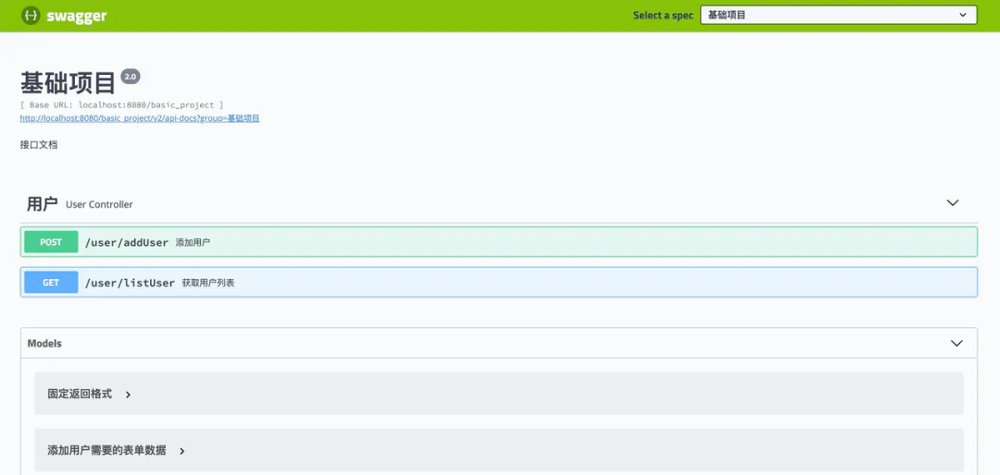
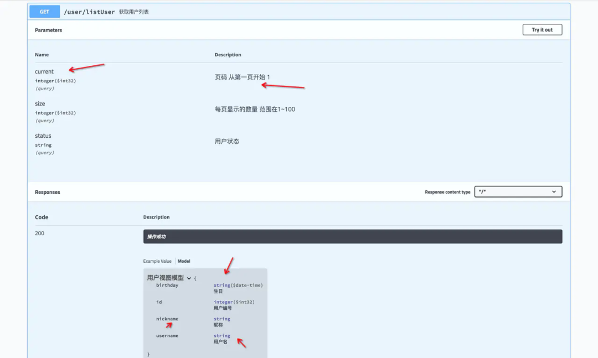
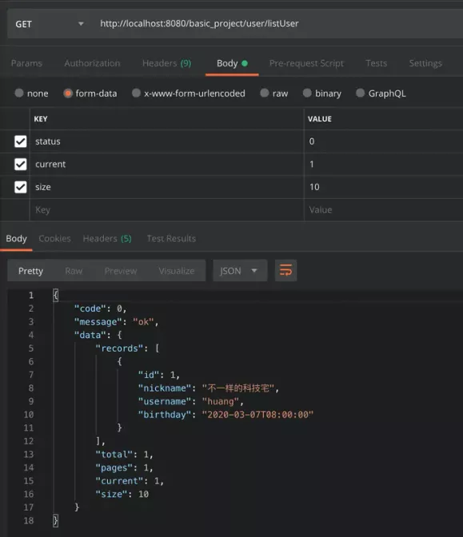

# 项目搭建模板

## 1. Spring Boot 项目搭建基础模板

建立一个全新的项目，或者把旧的庞大的项目，进行拆分成多个项目。在建立新的项目中，经常需要做一些重复的工作，比如说拷贝一下常用的工具类，通用代码等等。所以就可以做一个基础的项目方便使用，在经历新项目的时候，直接在基础项目上进行简单配置就可以开发业务代码了

基础项目该包含哪些东西。

- Swagger在线接口文档。
- CodeGenerator 代码生成器。
- 统一返回。
- 通用的分页对象。
- 常用工具类。
- 全局异常拦截。
- 错误枚举。
- 自定义异常。
- 多环境配置文件。
- Maven多环境配置。
- 日志配置。
- JenkinsFile。

### 1.1. 在线接口文档 Swagger

#### 1.1.1. 简介

Swagger可以在线生成接口文档，并且可以在页面上进行测试。



可以非常清楚的显示，请求数据已经响应数据。当然这一切都需要在代码中进行配置。



注意的点：接口文档只能在测试/开发环境开启，其他环境请关闭。

#### 1.1.2. 常用的Swagger注解

`@Api`用于Controller
`@ApiOperation`用于Controller内的方法
`@ApiResponses`用于标识接口返回数据的类型
`@ApiModel`用于标识类的名称
`@ApiModelProperty`用于标识属性的名称

对应的swagger的配置可以查看基础项目内的`SwaggerConfiguration.java`

```java
@RestController
@Api(tags = "用户")
@AllArgsConstructor
@RequestMapping("/user")
public class UserController {
    private IUserService userService;

    @ApiOperation("获取用户列表")
    @GetMapping("/listUser")
    @ApiResponses(
            @ApiResponse(code = 200, message = "操作成功", response = UserVo.class)
    )
    public ResultVo listUser(@Validated ListUserForm listUserForm){
        return ResultVoUtil.success(userService.listUser(listUserForm));
    }
}
```

```java
@Data
@ApiModel("获取用户列表需要的表单数据")
@EqualsAndHashCode(callSuper = false)
public class ListUserForm extends PageForm<ListUserForm> {
    @ApiModelProperty("用户状态")
    @NotEmpty(message = "用户状态不能为空")
    @Range(min = -1 , max = 1 , message = "用户状态有误")
    private String status;
}
```

### 1.2. CodeGenerator 代码生成器

mybatis_plus代码生成器可以一键生成entity，service，serviceImpl，mapper，mapper.xml。省去了建立一大堆实体类的麻烦。

由于配置太长这里就不贴出来了，对应的CodeGenerator的配置可以查看基础项目内的CodeGenerator.java

### 1.3. 常用的封装

#### 1.3.1. 统一返回 ResultVo

将所有的接口的响应数据的格式进行统一

```java
@Data
@ApiModel("固定返回格式")
public class ResultVo {
    @ApiModelProperty("错误码")
    private Integer code;

    @ApiModelProperty("提示信息")
    private String message;

    @ApiModelProperty("响应数据")
    private Object data;
}
```

#### 1.3.2. 创建抽象基础请求表单类 BaseForm

很多情况都是将接受到的参数，转变成对应的实体类然后**保存或者更新**。所以对于这类的`form`可以继承`baseform`并实现`buildEntity()`方法，这样可以更加符合面向对象，service不需要关心请求参数form如何转变成entity，只需要在使用的时候调用`buildEntity()`即可，尤其是在form转成entity相对复杂的时候，这样做可以减少service内的代码。让代码逻辑看起来更加清晰。

创建抽象基础请求表单类`BaseForm<T>`

```java
public abstract class BaseForm<T> {
    public abstract T buildEntity();
}
```

示例，通过使用`BaseForm`抽象父类进行重构 `AddUserForm` 继承 `BaseForm`并重写`buildEntity()`方法，原逻辑如下

```java
@Override
public boolean addUser(AddUserForm userForm) {
    User user = new User();
    user.setNickname(userForm.getNickname());
    user.setBirthday(userForm.getBirthday());
    user.setUsername(userForm.getUsername());
    user.setPassword(userForm.getPassword());
    return save(user);
}
```

```java
@Data
@EqualsAndHashCode(callSuper = false)
public class AddUserForm extends BaseForm<User> {

    private String nickname;
    private Date birthday;
    private String username;
    private String password;

    @Override
    public User buildEntity() {
        User user = new User();
        BeanUtils.copyProperties(this,user);
        return user;
    }
}

@Override
public boolean addUser(AddUserForm userForm) {
    return save(userForm.buildEntity());
}
```

#### 1.3.3. 通用的分页对象

查询的时候，绝大多数都需要用到分页，所以说封装分页对象就很有必要。可以注意下`PageForm.calcCurrent()`、`PageVo.setCurrentAndSize()`、`PageVo.setTotal()`这个几个方法

- 分页请求实体`PageForm`

```java
@Data
@ApiModel(value = "分页数据", description = "分页需要的表单数据")
public class PageForm<T extends PageForm<?>>{

    @ApiModelProperty(value = "页码 从第一页开始 1")
    @Min(value = 1, message = "页码输入有误")
    private Integer current;

    @ApiModelProperty(value = "每页显示的数量 范围在1~100")
    @Range(min = 1, max = 100, message = "每页显示的数量输入有误")
    private Integer size;

    @ApiModelProperty(hidden = true)
    public T calcCurrent(){
        current = (current - 1 ) * size;
        return (T) this;
    }
}
```

- 响应分页实体`PageVo`

```java
@Data
public class PageVo<T> {

    @ApiModelProperty(value = "分页数据")
    private List<T> records;
    @ApiModelProperty(value = "总条数")
    private Integer total;
    @ApiModelProperty(value = "总页数")
    private Integer pages;
    @ApiModelProperty(value = "当前页")
    private Integer current;
    @ApiModelProperty(value = "查询数量")
    private Integer size;

    @ApiModelProperty(hidden = true)
    public PageVo<T> setCurrentAndSize(PageForm<?> pageForm){
        BeanUtils.copyProperties(pageForm,this);
        return this;
    }

    @ApiModelProperty(hidden = true)
    public void setTotal(Integer total) {
        this.total = total;
        this.setPages(this.total % this.size > 0 ? this.total / this.size + 1 : this.total / this.size);
    }
}
```

**案例**

- ListUserForm

```java

@Data
@ApiModel("获取用户列表需要的表单数据")
@EqualsAndHashCode(callSuper = false)
public class ListUserForm extends PageForm<ListUserForm> {
    @ApiModelProperty("用户状态")
    @NotEmpty(message = "用户状态不能为空")
    @Range(min = -1 , max = 1 , message = "用户状态有误")
    private String status;
}
```

- UserServiceImpl

```java
@Override
public PageVo<UserVo> listUser(ListUserForm listUserForm) {
    PageVo<UserVo> pageVo = new PageVo<UserVo>().setCurrentAndSize(listUserForm);
    pageVo.setTotal(countUser(listUserForm.getStatus()));
    pageVo.setRecords(userMapper.listUser(listUserForm.calcCurrent()));
    return pageVo;
}

private Integer countUser(String status){
    return count(new QueryWrapper<User>().eq("status",status));
}
```

- UserController

```java
@ApiOperation("获取用户列表")
@GetMapping("/listUser")
@ApiResponses(
        @ApiResponse(code = 200, message = "操作成功", response = UserVo.class)
)
public ResultVo listUser(@Validated ListUserForm listUserForm){
    return ResultVoUtil.success(userService.listUser(listUserForm));
}
```



案例注意点说明：

- `PageVo`在实例化的时候需要**设置当前页和每页显示的数量**，可以调用`setCurrentAndSize()`完成。
- 进行分页查询的时候，需要计算偏移量。`listUserForm.calcCurrent()`

为什么要计算偏移量呢？

- 假如查询第1页每页显示10条记录，前端传递过来的参数是`current=1&&size=10`，这个时候`limit 1,10`没有问题。
- 假如查询第2页每页显示10条记录，前端传递过来的参数是`current=2&&size=10`，这个时候`limit 2,10`就有问题，实际应该是`limit 10,10`。`calcCurrent()`方法的作用就是如此。


### 1.4. 常用工具类

常用工具类可以根据平时的项目积累与开发习惯引入。

### 1.5. 异常处理


