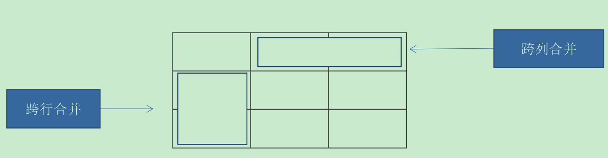
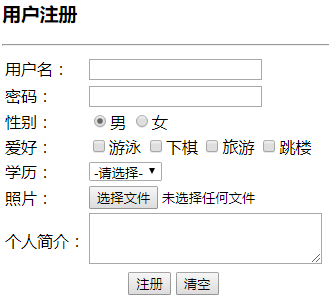

## 1. HTML概述

### 1.1. HTTP 协议

- `http://www.xxx.com/`：Hyper Text Transfer Protocol 超文本传输协议，用于在浏览器与服务器之间传输网页
- `https://www.xxx.com/`：加密的超文本传输协议，在进行数据传输过程中对数据进行了加密

### 1.2. W3C

万维网发布的一种规范，Web技术标准及实施指南。如：超文本标记语言HTML，可扩展标记语言XML。

### 1.3. HTML 概念

HTML 全称：Hyper Text Markup Language 超文本标记语言。html 也是一个 xml 文件，但是一个特殊的 xml 文件，xml 可以描述数据，html 不仅描述数据，而且可以布局数据。对书写出错的标记将不指出其错误，且不停止其解释执行过程。相关概念如下：

- **超文本**：不同于普通文本（文本字符串）的文本，不仅描述普通文本，还可以描述图片、超链接、音频、视频
- **标记语言**：整个网页由各种标签组成，标签也叫标记，标签时成对出现的。如：`<标签名称>描述的数据</标签名称>`
- **网页语言**：就是一种编写代码的方式（与 xml 相似），html 浏览器可以解析的语言

> Notes: HTTP 其中一种传输的内容就是 HTML，用来规定浏览器与服务器之间网页数据传输的格式。

### 1.4. HTML特点

html 后缀名是：`xx.html` 或者 `xx.htm`。直接通过浏览器就可以运行

### 1.5. HTML的规范

1. 一个 html 文件开始标签和结束的标签，如：`<html>xxx</html>`
2. html 包含两部分内容
    - `<head>设置相关信息</head>`
    - `<body>显示在页面上的内容都写在body里面</body>`
    - 如果使用框架标签则使用`<frameset></frameset>`替换`<body>`
3. html 的标签有开始标签，也要有结束标签
4. html 的代码不区分大小写
5. 有些标签，没有结束标签
    - 比如：换行`<br/>`、水平线`<hr/>`

### 1.6. HTML的操作思想

- 网页中有很多数据，不同的数据可能需要不同的显示效果。这个时候需要使用标签把要操作的数据包起来(封装起来)
- 通过修改标签的属性值实现标签内数据样式的变化
- 一个标签相当于一个容器，想要修改容器内的数据的样式，只需要改变容器的属性值，就可以实现容器内数据样式的变化

### 1.7. 拼接的注意问题

**拼接要点：外双内单，再出现引号则需要转义**

```html
"<a href='#' onclick='updateCategory("+cid+",\""+ cname +"\");'>修改</a>"
```

## 2. HTML标签

### 2.1. 标签的格式

有主体标签：

```html
<标签名称 属性名="属性值">数据</标签名称>
```

无主体标：

```html
<标签名称 属性名="属性值"/>
```

### 2.2. HTML标签分类

- **块标签**：每个标签单独独一行，自动**换行**
- **内联标签**：标签<u>**不换行**</u>，每个标签是排在上一个标签的后面。

## 3. HTML网页的基本结构相关

### 3.1. HTML整体结构标签

|     标签名      |                                         作用                                         |
| :-------------: | ----------------------------------------------------------------------------------- |
|    `<html>`     | 网页的根元素                                                                          |
|    `<head>`     | 网页的头部                                                                            |
|    `<body>`     | 网页的主体<br/>`bgcolor`属性：用于设置网页的背景颜色<br/>`background`属性：用于设置网页的背景 |
| `<!-- 注释 -->` | 与XML的注释相同                                                                       |

### 3.2. 网页头部标签的作用

语法：`<head>头部内容</head>`

1. `<title>`标签显示整个网页标题：例：`<title>这是一个标题</title>`
2. 用来设置网页的字符集(编码)，汉字如果编码不正确，就会出现乱码的问题。
    - HTML5设置字符集：`<meta charset="UTF-8">`
    - HTML4设置字符集：`<meta http-equiv="Content-Type" content="text/html;charset=UTF-8"/>`
3. 告诉搜索引擎（如：百度），当前网页包含哪些关键字。`<meta name="keywords" content="xx1,xx2,xx3……">`

### 3.3. 网页体的作用

语法：`<body>网页体内容</body>`

- 网页要显示的内容
- HTML4：主要用于电脑端浏览器
- HTML5：主要用于移动端

### 3.4. HTML其他结构标签

#### 3.4.1. 文档类型声明标签

`<!DOCTYPE>` 文档类型声明，作用就是告诉浏览器使用哪种HTML版本来显示网页。

```html
<!DOCTYPE html>
```

以上示例意思是：当前页面采取的是 HTML5 版本来显示网页

- **注意**:
1. `<!DOCTYPE>`声明位于文档中的最前面的位置，处于 `<html>` 标签之前。
2. `<!DOCTYPE>`不是一个 HTML 标签，它就是文档类型声明标签。

#### 3.4.2. lang 语言种类

`<html lang="en">`用来定义当前文档显示的语言。

`en`定义语言为英语；`zh-CN`定义语言为中文。其实对于文档显示来说，定义成en的文档也可以显示中文，定义成zh-CN的文档也可以显示英文。这个属性对浏览器和搜索引擎(百度.谷歌等)还是有作用的

#### 3.4.3. 字符集

字符集 (Character set)是多个字符的集合。以便计算机能够识别和存储各种文字。

在`<head>`标签内，可以通过`<meta>`标签的 charset 属性来规定 HTML 文档应该使用哪种字符编码。

```html
<meta charset="UTF-8">
```

charset 常用的值有：`GB2312`、`BIG5`、`GBK`和`UTF-8`，其中 `UTF-8` 也被称为**万国码**，基本包含了全世界所有国家需要用到的字符

<font color=red>注意：`<meta charset="UTF-8">`是必须要写的代码，否则可能引起乱码的情况。一般情况下，统一使用"UTF-8"编码，尽量统一写成标准的"UTF-8"，不要写成"utf8"或"UTF8"</font>

## 4. HTML中常用标签

### 4.1. 标题标签

为了使网页更具有语义化，经常会在页面中用到标题标签。HTML提供了6个等级的网页标题，即`<h1>`-`<h6>`，具体用法如下：

```html
<h1>标题一共六级选,</h1>
<h2>文字加粗一行显。</h2>
<h3>由大到小依次减，</h3>
<h4>从重到轻随之变。</h4>
<h5>语法规范书写后，</h5>
<h6>具体效果刷新见。</h6>
```

- 特点：
1. 加了标题的文字会变的加粗，字号也会依次变大。即自带加粗
2. 一个标题独占一行，即自动换行

#### 4.1.1. 常用属性

- align：设置标题对齐方式，默认是左对齐。可选值：`center`居中，`right`右对齐

### 4.2. 段落和换行标签

#### 4.2.1. 段落标签

在 HTML 标签中，`<p>`标签用于定义段落，标签语义：它可以把 HTML 文档分割为若干段落。

```html
<p>我是一个段落标签</p>
```

- **特点**：
1. 文本在一个段落中会根据浏览器窗口的大小自动换行。
2. 段落和段落之间保有空隙。
3. 段落没有首行缩进

- **常用属性**
    - `title`：当鼠标移动到段落上的时候，会出现提示性的文字

#### 4.2.2. 换行标签

在 HTML 中，一个段落中的文字会从左到右依次排列，直到浏览器窗口的右端，然后才自动换行。换行标签`<br />`就是将某段文本强制换行显示，标签语义：强制换行。

```html
我是换行前的文字<br/>我是换行后的文字
```

- **特点**:
1. `<br />` 是个单标签。
2. `<br />` 标签只是简单地开始新的一行，跟段落不一样，段落之间会插入一些垂直的间距。

### 4.3. 文本格式化标签

HTML 中的文本格式化标签，使文字设置为粗体、斜体 或下划线等效果显示。

|  语义  |              标签              |
| :---: | :----------------------------: |
|  加粗  | `<strong></strong>`或`<b></b>` |
|  倾斜  |     `<em></em>`或`<i></i>`     |
| 删除线 |    `<del></del>`或`<s></s>`    |
| 下划线 |    `<ins></ins>`或`<u></u>`    |

```html
我是<strong>加粗</strong>的文字 <br />
我是<b>加粗</b>的文字 <br />

我是<em>倾斜</em>的文字 <br />
我是<i>倾斜</i>的文字 <br />

我是<del>删除线</del> <br />
我是<s>删除线</s> <br />

我是<ins>下划线</ins> <br />
我是<u>下划线</u> <br />
```

### 4.4. `<div>`和`<span>`标签

`<div>` 和 `<span>` 标签是没有语义的，它们就是一个盒子，用来装网页的内容。

- **特点**：
1. `<div>` 标签用来布局，将网页中的内容在逻辑上分成不同的块，换行，是<font color=red>**块标签**</font>。在没有写css样式前，一行只能放一个`<div>`。
2. `<span>` 标签用来布局，将网页中的内容在逻辑上分成不同的块，不换行，是<font color=red>**内联标签**</font>。一行上可以多个`<span>`。

```htmL
<div>我是div标签，我是块元素，独占一行</div>
<span>我是span标签，我是行内元素，多个span标签能在一行中显示</span>
```

### 4.5. 图像标签
#### 4.5.1. 图像标签作用

在 HTML 标签中，`` 标签用于定义 HTML 页面中的图像。

#### 4.5.2. 图像标签语法

```html

```

<font color=red>**注意：`src`是``标签的必须属性，它用于指定图像文件的路径和文件名**</font>

#### 4.5.3. 图像标签相关属性

|  属性名   | 描述                                                                        |
| :------: | :-------------------------------------------------------------------------- |
|  `src`   | 图片的地址，可以使用本地服务器，也可以链接其它网站。是**必须的属性**              |
| `width`  | 指定图片的宽度。（如果只指定1个，另一个会按比例缩放。）                           |
| `height` | 指定图片的高度。（如果只指定1个，另一个会按比例缩放。）                           |
|  `alt`   | 如果图片丢失，会出现这个替代文字                                               |
| `title`  | 如果鼠标移动到图片上面，会出现提示的信息。但有些浏览器下不显示（没有效果，兼容性差） |
| `border` | 定义图像周围的边框的粗细。**不推荐使用**                                       |

```html
<h4>图像标签的使用:</h4>
<!-- 图像标签 -->

<h4>alt 替换文本 图像显示不出来的时候用文字替换:</h4>

<h4>title 提示文本 鼠标放到图像上,提示的文字:</h4>


<h4>width 给图像设定宽度:</h4>

<h4>height 给图像设定高度:</h4>

<h4>border 给图像设定边框:</h4>

```

- 图像标签注意点：
1. 图像标签可以拥有多个属性，必须写在标签名的后面。
2. 属性之间不分先后顺序，标签名与属性、属性与属性之间均以空格分开。
3. 属性采取键值对的格式，即 `key="value"` 的格式，即`属性名="属性值"`。

#### 4.5.4. 路径分类写法

路径可以分为：**绝对路径**和**相对路径**

##### 4.5.4.1. 相对路径（三种形式）

**相对路径**：以<font color=red>引用文件所在位置为参考基础</font>，而建立出的目录路径。简单来说，就是<font color=red>图片相对于 HTML 页面的位置</font>

1. html文件和图片在同一个路径下，直接写文件名称即可

```html
`
```

2. 图片在html文件夹的下层目录中

```html
<!--
	c:\xxx\x.html
	c:\xxx\img\x.jpg
-->

```

3. 图片在html文件夹的上层目录中

```html
<!--
	c:\xxx\code\x.html
	c:\xxx\x.jpg
    表示上层的上层则: ..\..\
-->

```

##### 4.5.4.2. 绝对路径

**绝对路径**：是指目录下的绝对位置，直接到达目标位置，通常是从盘符开始的路径。或者是完整的网络地址

如：`D:\web\img\logo.gif`或者网址`http://www.moon.cn/images/logo.gif`

### 4.6. 超链接标签（重点）

#### 4.6.1. 超链接作用

在 HTML 标签中，`<a>`标签用于定义超链接，作用是从一个页面链接到另一个页面

#### 4.6.2. 超链接语法

```html
<a href="链接到资源的路径URL" target="目标窗口的弹出方式">显示在页面上的文字或者图片</a>
```

#### 4.6.3. 超链接相关属性

|  属性名   | 属性值                                                                   | 描述                                 |
| :------: | :----------------------------------------------------------------------- | :----------------------------------- |
|  `href`  | 链接到资源的路径URL，是必须的属性                                           | 链接的资源的地址                      |
| `title`  |                                                                          | 当鼠标移上去时候，显示提示信息          |
| `target` | `target="_self"`：在当前页打开（默认）<br/>`target="_blank"`：在新的窗口打开 | 设置链接的打开的方式，默认是在当前页打开 |

```html
<!-- 超链接标签 -->
<a href="Java学习路线图1.jpg" target="_blank">这是一个超链接。</a><br/>
<a href="#">这是一个没有写链接资源的超链接。</a>
```

#### 4.6.4. 链接分类

1. 外部链接：当前网站以外的资源，例如`<a href="http://www.baidu.com">百度</a>`
2. 内部链接：网站内部页面之间的相互链接，直接链接内部页面名称即可。例如`<a href="index.html">首页</a>`
3. 空链接：如果当时没有确定链接目标时，`<a href="#">首页</a>`
4. 下载链接：如果 href 里面地址是一个文件或者压缩包，会下载这个文件
5. 网页元素链接：在网页中的各种网页元素，如文本、图像、表格、音频、视频等都可以添加超链接
6. 锚点链接：点击链接时，可以快速定位到页面中的某个位置

```html
<h4>1.外部链接</h4>
<a href="http://www.qq.com">腾讯</a>
<h4>target 打开窗口的方式 默认的值是_self。 _self: 当前窗口打开页面 _blank: 新窗口打开页面</h4>
<a href="http://www.baidu.com" target="_blank">百度</a>
<h4>2.内部链接: 网站内部页面之间的相互链接</h4>
<a href="08-图像标签.html" target="_blank">网站内的页面</a>
<h4>3.空链接:#</h4>
<a href="#">我是一个空链接</a>
<h4>4.下载链接: 地址链接的是文件（.exe）或者压缩包（.zip等）形式</h4>
<a href="test-download.zip">下载文件</a>
<h4>5.网页元素的链接</h4>
<a href="http://www.baidu.com"></a>
```

#### 4.6.5. 调用发邮件客户端

```html
<a href="mailto:xxx@xx.com">给我发邮件</a>
```

#### 4.6.6. 定位资源(锚的使用)

锚：当一个网页的内容特别长的时候，需要定位到网页中不同的部分，就可以在网页中设置一些锚点，可以让链接跳转到这个位置上。

- 如果想要定位资源，则先定义一个位置(锚点)，可以使用`<a>`标签设置name属性，或者其他html标签设置id属性，值为锚点的名称

```html
<!-- <a>标签 -->
<a name="锚点名称">锚点的位置</a>
<!-- 或者使用其他html标签 -->
<h3 id="锚点名称">其他标签定义的锚点</h3>
```

- 在链接文本的`href`属性中，设置属性值为`#锚点名字`的形式

```html
<a href="#锚点名称">显示在网页的文字内容</a>
```

示例

```html
<a name="here">链接</a>
<h1 id="here">标题1</h1>
……
<!-- 定位资源 -->
<a href="#here">点击定位到指定位置</a>
```

#### 4.6.7. 跳到本页的写法

```html
<a href="#">xxx</a>
```

- 设置成一个链接，没有名字的锚点，主要用于后期编程使用。
- **当超链接不需要链接到任何的地址，在href里面需要加`#`，如果什么都不写，则点击后会自动打开该html文件所在的文件夹(注：这个在不同浏览器中有不同效果。在IE浏览器中才这么实现，如果是chrome浏览器，点击都是直接跳到当前页面的最顶端位置而已)**

### 4.7. 特殊字符(符号实体)

在 HTML 页面中，一些特殊的符号很难或者不方便直接使用，此时就可以使用下面的字符来替代。

- 需要对实体字符进行转义
- 格式：以`&`开头，以`;`结尾
- 实体字符对应的转义字符：

| 实体字符 |   描述   | 对应的转义字符 |
| :------: | :-----: | :----------: |
|          |   空格   |   `&nbsp;`   |
|    <     |  小于号  |    `&lt;`    |
|    >     |  大于号  |    `&gt;`    |
|    &     |   和    |   `&amp;`    |
|    /     |  反斜杠  |  `&frasl;`   |
|    "     |   引号   |   `&quot;`   |
|    ©     |   版权   |   `&copy;`   |
|    ¥     |   日元   |   `&yen;`    |
|    √    | 正确符号 |  `&radic;`   |

<font color=red>**注释：实体名称对大小写敏感。**</font>

### 4.8. HTML基本文本标签

#### 4.8.1. hr 标签

`<hr>` 标签用于定义水平线。可以通过属性指定粗细和长度，单独一行或者在语句的后面。单位：像素(px)，常用属性：

- `color`：水平线的颜色
- `width`：水平线的长度
- `size`：水平线的粗细

#### 4.8.2. font 标签

`<font>` 标签用于定义字体。前提：客户端系统中安装了这种字体

- `size`：文字的大小，取值范围(1-7)，超出了 7，默认还是 7
- `color`：字体颜色，有两种表示方式（英文单词或十六进制数）
- `face`：字体样式

#### 4.8.3. pre 标签

`<pre>` 标签用于将网页中纯文本原样输出 

#### 4.8.4. sup / sub 标签

- `<sup>`：上标
- `<sub>`：下标

### 4.9. 构架标签

#### 4.9.1. 构架标签

- frameset框架集(使用时要替换`<body>`标签)
- frame框架

#### 4.9.2. frameset的属性

**rows**属性

- 行，单位：像素或百分比。列出了每一行的高度
- `rows="20,50,100"`：一共有3行，第1行占20像素，第2行占50像素，第3行占100像素
- ` rows="100,*"`：第1行占100像素，剩下的全部给第2行

**cols**属性

- 列，单位：像或百分比素。列出了每一列的宽度
- `clos="200,*"`：第1列占200，剩下的给第2列

#### 4.9.3. frame的属性

|    属性名     | 作用                                               |
| :----------: | :------------------------------------------------- |
|   **src**    | 当前这个框架引用的html文件                            |
|   **name**   | 当前框架的名字                                       |
| **noresize** | 构架的大小不能修改，值和名字一样，`noresize="noresize"` |

#### 4.9.4. 与普通页面的区别

1. DTD约束不同，使用框架的dtd文件
2. body没有，换成frameset

- main.html

```html
<!DOCTYPE html>
<html>
	<head>
		<meta charset="UTF-8">
		<title></title>
	</head>
	<frameset rows="100,*" noresize="noresize" border="0">
		<frame src="top.html" />
		<frameset cols="200,*">
			<frame src="left.html"/>
			<frame src="main.html" name="main"/>
		</frameset>
	</frameset>
</html>
```

- top.html

```html
<!DOCTYPE html>
<html>
	<head>
		<meta charset="UTF-8">
		<title></title>
	</head>
	<body>
		<h1>我是顶端框架</h1>
	</body>
</html>
```

- left.html

```html
<!DOCTYPE html>
<html>
	<head>
		<meta charset="UTF-8">
		<title></title>
	</head>
	<body>
		<h2>选项菜单</h2>
		<ul type="square">
		<li><a href="welcome.html" target="main"><b>选项1</b></a><br/></li>
		<li><a href="#"><b>选项2</b></a><br/></li>
		<li><a href="#"><b>选项3</b></a><br/></li>
		<li><a href="#"><b>选项4</b></a><br/></li>
		</ul>
	</body>
</html>
```

- main.html

```html
<!DOCTYPE html>
<html>
	<head>
		<meta charset="UTF-8">
		<title></title>
	</head>
	<body>
		<h1>我是主界面</h1>
	</body>
</html>
```

- welcome.html

```html
<!DOCTYPE html>
<html>
	<head>
		<meta charset="UTF-8">
		<title></title>
	</head>
	<body>
		<h1>欢迎！</h1>
	</body>
</html>
```

## 5. 表格标签（重点）

### 5.1. 表格的作用

- 用来显示从服务器读取的数据
- 用于网页布局，后期主要还是使用div布局
- 表格由 `<table>` 标签来定义。
- 每个表格均有若干行（由 `<tr>` 标签定义）
- 每行被分割为若干单元格（由 `<td>` 标签定义）。字母 td 指表格数据（table data），即数据单元格的内容。
- 数据单元格可以包含文本、图片、列表、段落、表单、水平线、表格等等。

### 5.2. 表格相关的标签元素

|    标签名    | 作用                                                                                                                                              |
| :---------: | :----------------------------------------------------------------------------------------------------------------------------------------------- |
|  `<table>`  | 用于定义表格的标签，相当于表格容器                                                                                                                     |
|   `<tr>`    | 用于定义表格中的行，必须嵌套在`<table></table>`标签中                                                                                                  |
|   `<th>`    | 表格中表头，一般表头单元格位于表格的第一行或第一列，表头单元格里面的文本内容具有加粗居中显示效果                                                                 |
|   `<td>`    | 用于定义表格中的单元格，必须嵌套在`<tr></tr>`标签中                                                                                                     |
| `<caption>` | 表格的标题                                                                                                                                         |
|  `<thead>`  | 用于定义表格的头部，在逻辑上将表格分成表格头部，不会显示内容。`<thead>`内部必须拥有`<tr>`标签。一般是位于第一行                                                  |
|  `<tbody>`  | 用于定义表格的主体，主要用于放数据本体。浏览器在解析的时候，会自动加上`<tbody>`标签，在逻辑上将表格分成不同组成部分，**`<tbody>`标签无论代码有没有写，始终是存在的。** |
|  `<tfoot>`  | 表格的脚部                                                                                                                                         |

```html
 <table>
    <tr>
        <td>单元格内的文字</td>
        ...
    </tr>
    ...
</table>
```

### 5.3. 表格标签

标签：`<table></table>`，在table里面(就是表格的行，多少行则写多少个tr)

table表格的相关属性：

|  **属性名**   | **作用**                            |
| :-----------: | :---------------------------------- |
|    `width`    | 表格的宽度                            |
|   `height`    | 表格的高度                            |
|   `border`    | 边框厚度                             |
|    `align`    | 水平对齐方式(取值：left,right,center) |
|   `valign`    | 垂直对齐方式(取值：top,buttom,middle) |
|   `rowspan`   | 单元格跨多行                          |
|   `colspan`   | 单元格跨多列                          |
| `cellspacing` | 单元格与单元格之间的间距              |
| `cellpadding` | 单元格的边框与单元格内容的间距         |

### 5.4. 行标签

- 在table里面定义，`<tr></tr>`
- tr行标签的相关属性：
    - 设置一行的对齐方式**align**: left/center/right

### 5.5. 单元格（表头）

- 在tr里面，如果表头可以使用 `<th>` 标签进行定义。(与td同级，作用一样，但自带居中和加粗效果)
- `<th>表头内容</th>`

### 5.6. 单元格

- 在tr里面(就是表格的单元格，一行内有多少个单元格，则写多少个td)

```html
<td>单元格内容</td>
```

- td单元格的相关属性：
- 设置单元格的对齐方式`align`,取值：`left/center/right`

### 5.7. 表格标题

```html
<caption>表格的标题</caption>
```

### 5.8. 合并单元格

#### 5.8.1. 合并的相关属性

合并单元格都在`<td>`标签中相关属性进行设置

- `rowspan`：跨行合并（将一列中的指定的行数合并）

```html
<td rowspan="3" align="center">合并行</td>
```

- `colspan`：跨列合并（将一行中的指定的列数合并）

```html
<td colspan="3" align="center">合并列</td>
```




```html
<!-- 表格标签 -->
<table border="1" bordercolor="blue" cellspacing="0" width="200" height="100">
	<caption>表格的标题</caption>
	<tr>
		<td colspan="3" align="center">合并列</td>
	</tr>
	<tr>
		<th>姓名</th>
		<th>年龄</th>
		<th>性别</th>
	</tr>
	<tr align="center">
		<td>剑圣</td>
		<td>19</td>
		<td>男</td>
	</tr>
	<tr align="center">
		<td>敌法师</td>
		<td>20</td>
		<td>男</td>
	</tr>
</table>
```

#### 5.8.2. 合并单元格步骤

1. 先确定是跨行还是跨列合并。
2. 找到目标单元格。写上`合并方式=合并的单元格数量`。比如：`<td colspan=“2”></td>`。
3. 删除多余的单元格。

## 6. 列表标签（重点）

如果表格是用来显示数据的，那么<font color=red>**列表就是用来布局**</font>的。

列表最大的特点就是整齐、整洁、有序，它作为布局会更加自由和方便。

根据使用情景不同，列表可以分为三大类：**无序列表**、**有序列表**和**自定义列表**。

### 6.1. 无序列表（重点）

`<ul>` 标签表示 HTML 页面中项目的无序列表，一般会以项目符号呈现列表项，而列表项使用 `<li>` 标签定义。

#### 6.1.1. 基本语法格式

```html
<ul>
    <li>列表项1</li>
    <li>列表项2</li>
    <li>列表项3</li>
    ...
</ul>
```

#### 6.1.2. 相关属性

无序列表`<ul>`标签有设置样式的属性`type`，取值如下：

- `type="disc"`：● (默认样式)
- `type="circle"`：○
- `type="square"`：■

*注：这个样式属性不常用，以后都是编写CSS样式取代*

#### 6.1.3. 无序列表总结

1. 无序列表的各个列表项之间没有顺序级别之分，是并列的。
2. `<ul></ul>` 中只能嵌套 `<li></li>`，直接在 `<ul></ul>` 标签中输入其他标签或者文字的做法是不被允许的。
3. `<li>` 与 `</li>` 之间相当于一个容器，可以容纳所有其他html元素。
4. 无序列表会带有自己的样式属性，但在实际使用时，会使用 CSS 来设置。

### 6.2. 有序列表（理解）

有序列表即为有排列顺序的列表，其各个列表项会按照一定的顺序排列定义。

在 HTML 标签中，`<ol>` 标签用于定义有序列表，列表排序以数字来显示，并且使用 `<li>` 标签来定义列表项。

#### 6.2.1. 基本语法格式

```html
<ol>
    <li>列表项1</li>
    <li>列表项2</li>
    <li>列表项3</li>
    ...
</ol>
```

#### 6.2.2. 相关属性

无序列表`<ol>`标签有设置样式的属性`type`，取值如下：

- `type="1"`：显示数字（默认值）
- `type="a"`：显示"A"字母
- `type="i"`：显示"I"罗马数字

*注：这个样式属性不常用，以后都是编写CSS样式取代*

#### 6.2.3. 有序列表总结

1. `<ol></ol>`中只能嵌套`<li></li>`，直接在`<ol></ol>`标签中输入其他标签或者文字的做法是不被允许的。
2. `<li>` 与 `</li>`之间相当于一个容器，可以容纳所有元素。
3. 有序列表会带有自己样式属性，但在实际使用时，会使用 CSS 来设置。

### 6.3. 自定义列表（重点）

自定义列表的使用场景：常用于对术语或名词进行解释和描述，定义列表的列表项前没有任何项目符号。

在 HTML 标签中，`<dl>` 标签用于定义描述列表（或定义列表），该标签会与 `<dt>`（定义项目/名字）和 `<dd>`（描述每一个项目/名字）一起使用。

#### 6.3.1. 基本语法格式

```html
<dl>
    <dt>名词1</dt>
    <dd>名词1解释1</dd>
    <dd>名词1解释2</dd>
</dl>
```

#### 6.3.2. 自定义列表总结

1. `<dl></dl>` 里面只能包含 `<dt>` 和 `<dd>`。
2. `<dt>`和`<dd>`个数没有限制，经常是一个`<dt>`对应多个`<dd>`。

### 6.4. 各列表类型总结

|    标签名    |     定义      | 说明                                                               |
| :---------: | :----------: | :---------------------------------------------------------------- |
| `<ul></ul>` |   无序标签    | 里面只能包含`<li>`标签，没有顺序，使用较多。`<li>`标签中可以包含任何标签 |
| `<ol></ol>` |   有序标签    | 里面只能包含`<li>`标签，有顺序，使用较少。`<li>`标签中可以包含任何标签   |
| `<dl></dl>` | 自定义列表标签 | 里面只能包含`<dt>`和`<dd>`标签。`<dt>`和`<dd>`标签中可以包含任何标签   |

## 7. 表单标签（重点）

### 7.1. 表单的概念

- 将用户在浏览器端输入的数据提交给服务器
- 只要需要提交数据的场景都会使用到表单标签
- 表单标签不会在网站上显示任何内容，本身是一个数据的容器。所有的控件要放在表单标签内部

在 HTML 中，<font color=red>**一个完整的表单通常由表单域、表单控件（也称为表单元素）和提示信息3个部分构成**</font>。

### 7.2. 表单域

#### 7.2.1. 表单域标签语法

定义一个表单容器：

```html
<form action="url地址" method="提交方式" name="表单域名称">
    各种表单元素控件
</form>
```

#### 7.2.2. 表单的常用的属性

- `action`：用于指定接收并提交表单数据给服务器的url地址，默认提交到当前页面。值是提交表单的 URL
- `method`：用于设置表单数据提交给服务器的方式。可选值有：get/post，默认值是 get 请求
- `enctype`：规定在发送表单数据之前如何对其进行编码。一般请求下不需要这个属性，做文件上传时候需要设置这个属性。有如下可选值：
  - `application/x-www-form-urlencoded`
  - `multipart/form-data`
  - `text/plain`
-  `name`：用于指定表单的名称，以区分同一个页面中的多个表单域。值为 form_name（名称）

#### 7.2.3. get 和 post 的区别

主要区别点如下：

- **得到数据的方式**：
  -  GET 方法：主动从服务器去取一个网页
  -  POST 方法：把数据发送给服务器
- **地址栏的变化**
  - GET 方法提交表单后，网址的地址会发生变化。相关的参数会显示在地址栏上，格式：`http://127.0.0.1/web/server/user=aaa&pwd=xxx`。url 中的`?`用于分隔地址与参数，前面是地址，后面是`参数名=参数值`；`&`是用于分隔多个参数；参数名就是表单项的名字。进行查询、删除操作时建议使用 get 方法
  - POST 方法参数不会显示在地址栏，数据是以请求体的方式发送。进行新增、修改操作时建议使用post方法
- **传输的数据大小限制**：GET 方法发给服务器的数据最大1K；POST 方法数据大小没有限制
- **安全性** ：GET 方法更低；POST 方法更高

### 7.3. 表单元素

在表单域中可以定义各种表单元素，这些表单元素就是允许用户在表单中输入或者选择的内容控件。主要分成如下几种类型：

1. input 输入表单元素
2. select 下拉表单元素
3. textarea 文本域元素

#### 7.3.1. `<input>`表单元素

在表单元素中 `<input>` 标签用于收集用户信息

在 `<input>` 标签中，包含一个 `type` 属性，根据不同的 `type` 属性值，输入字段拥有很多种形式（可以是文本字段、复选框、掩码后的文本控件、单选按钮、按钮等）。

##### 7.3.1.1. 语法格式

```html
<input type="输入项的类型" />
```

- **在输入项里面需要有一个name属性，用于提交时获取的表单元素的值**

##### 7.3.1.2. type 属性相关设置

- `text`：**文本输入框**，type可以省略，默认就是文本框，默认宽度为20个字符。属性如下：
    - `name`: 名字
    - `value`: 值，显示在文本框的文字
    - `readonly`: 只读，不能修改，**默认底色**，`readonly="readonly"`
    - `disabled`: 文本框不可用，**以灰色显示**，`disabled="disabled"`。注意：设置该属性后，值无法提交
    - `size`：输入框的长度
    - `maxlength`：输入最大的字符个数
- `password`：**密码框**，输入的字符是不可见的。其余可用属性与`text`类型一样                                 |
- `redio`：**单选框**，name属性相同的是一组，一组单选框中只能选其中一个。属性如下：
    - `checked="checked"`：默认选中
    - `name`：单选框的值，如果值是一样的单选框定义为同一个组
    - `value`: 代表当前项的值
- `checkbox`：**复选框**，可以选中多项，只有选中的值才会提交到服务器。属性如下：
    - `checked="checked"`：默认选中
    - `value`: 代表当前项的值
    - `name`：代表复选框的名字，如果不指定提交后没有显示`xx=xxx`
- `select`：**下拉列表**，包含多个`<option>`的下拉列表，每个选项是一个option。属性如下：
    - `name`：select标签指定名字
    - `option`：表示其中一个选项
    - `multiple`：多选项，按ctrl选，`multiple="multiple"`
    - `value`：选项的值，每个 option 建议都加上 value，有些浏览器 value 可以省略，会使用 option 中的文本做为值。
    - `selected="selected"`：下拉菜单设置默认值，不设置该属性的话，页面显示第一项
- `hidden`：**隐藏表单域**，不会在表单上显示任何的内容，但可以将数据提交给服务器。属性如下：
    - `name`：名字
    - `value`：值
- `file`：**文件域(上传)**，出现文件选择对话框。属性如下：
    - `accept`：指定文件的类型，格式：`image/*`。这种类型全称叫“MIME 类型”
- `<textarea cols="x" rows="x">文本域内容</textarea>`：**多行文本域**，文本域是有主体的标签，标签中的内容就是文本域提交给服务器的数据。属性如下：
    - `name`：文本域提交时显示的名字
    - `rows`: 文本有多少行
    - `cols`: 文本有多少列
- `submit`：**提交按钮**，提交表单的数据给服务器。属性如下：
    - `value="按钮上显示的文字"`，如果不写 value 则提交按键显示默认的文字
- `reset`：**重置按钮**，表单中状态还原到初始状态。属性如下：
    - `value="按钮上显示的文字"`，如果不写 value 则重置按键显示默认的文字
- `button`：**普通按钮**，用于编程，一般和JS一起使用
- `image`：**图片按钮**，功能与 submit 相同。属性如下：
    - `src`：图片地址
    - 鼠标点击的位置：`x` 水平方向；`y`：垂直方向

> 注意事项说明：
>
> - **上面的属性中，如果有name这属性，一般都指定名称，不然提交后会出来数据无法接收的问题**
> - `id`属性是给浏览器使用，`name`属性是服务器使用
> - `name` 表单元素的名字，要求单选按钮和复选框要有相同的 name 值
> - **`checked` 属性主要针对于单选按钮和复选框**，主要作用一打开页面，就要可以默认选中某个表单元素
> - `maxlength` 是可以在表单元素输入的最大字符数，一般较少使用.

#### 7.3.2. `<label>` 标签

`<label>` 标签为 input 元素定义标注（标签），用于绑定一个表单元素。当点击`<label>`标签内的文本时，浏览器就会自动将焦点(光标)转到或者选择对应的表单元素上，用来增强用户体验。

**语法格式**：

```html
<label for="sex">男</label>
<input type="radio" name="sex" id="sex" />
```

**核心**：`<label>` 标签的 `for` 属性应当与绑定的表单元素的 `id` 属性相同。

#### 7.3.3. `<select>`表单元素

在页面中，如果有多个选项让用户选择，并且想要节约页面空间时，可以使用`<select>`标签控件定义下拉列表.

**语法格式**：

```html
<select>
    <option>选项1</option>
    <option>选项2</option>
    <option>选项3</option>
    ...
</select>
```

- **注意**：
1. `<select>`中至少包含一对`<option>`
2. 在`<option>`中定义`selected ="selected"`时，代表当前项为默认选中项。

#### 7.3.4. `<textarea>`表单元素

当用户输入内容较多的情况下，就不能使用文本框表单了，此时可以使用 `<textarea>` 标签。

在表单元素中，<textarea> 标签是用于定义多行文本输入的控件。使用多行文本输入控件，可以输入更多的文字，该控件常见于留言板，评论。

**语法格式**：

```html
<textarea rows="3" cols="20">文本内容</textarea>
```

- **注意**：
1. `<textarea>`标签的输入默认值是设置在标签体内，而不是像`<input>`标签的value属性
2. 通过 `<textarea>` 标签可以轻松地创建多行文本输入框。
3. `cols="每行中的字符数"`，`rows="显示的行数"`，在实际开发中不会使用，都是用 CSS 来改变大小。

### 7.4. 表单基础使用案例



```html
<!DOCTYPE html>
<html>
	<head>
		<meta charset="UTF-8">
		<title>用户注册</title>
	</head>
	<body>
		<h3>用户注册</h3>
		<hr />
		<form action="../level01test02/Day29Test01_02.html" method="post">
			<!--隐藏表单-->
			<input type="hidden" name="userid" value="1100123" />
			<!--使用表格布局-->
			<table>
				<tr>
					<td>用户名：</td>
					<td><input type="text" name="username" /></td>
				</tr>
				<tr>
					<td>密码：</td>
					<td><input type="password" name="pwd" /></td>
				</tr>
				<tr>
					<td>性别：</td>
					<td>
						<input type="radio" name="gender" checked="checked" value="man"/>男
						<input type="radio" name="gender" value="woman"/>女
					</td>
				</tr>
				<tr>
					<td>爱好：</td>
					<td>
						<input type="checkbox" name="hobby" value="swim"/>游泳
						<input type="checkbox" name="hobby" value="chess"/>下棋
						<input type="checkbox" name="hobby" value="travel"/>旅游
						<input type="checkbox" name="hobby" value="jump"/>跳楼
					</td>
				</tr>
				<tr>
					<td>学历：</td>
					<td>
						<select name="education">
							<option value="none">-请选择-</option>
							<option value="初中">初中</option>
							<option value="高中">高中</option>
							<option value="大专">大专</option>
							<option value="本科">本科</option>
							<option value="硕士">硕士</option>
							<option value="博士">博士</option>
						</select>
					</td>
				</tr>
				<tr>
					<td>照片：</td>
					<td><input type="file" accept="image/*" name="pic"/></td>
				</tr>
				<tr>
					<td>个人简介：</td>
					<td>
						<textarea rows="3" cols="30" name="resume"></textarea>
					</td>
				</tr>
				<tr>
					<td colspan="2" align="center">
						<input type="submit" value="注册"/>
						<input type="reset" value="清空"/>
					</td>
				</tr>
			</table>
		</form>
	</body>
</html>
```
