## 1. JavaScript( ECMA Script )

JavaScript 这门语言属于一系列 Web 标准套件中的一部分，这些标准定义出了可互操作的浏览器平台。此部分的内容主要是 ES6 以前的语法，ES6 及其更后的版本详见[《ECMAScript6 基础笔记》](/前端资料/JavaScript/ECMAScript6)

### 1.1. 作用

一种高级编程语言，<font color=red>**运行在浏览器上的一种脚本语言**</font>。原名 livescript，为了提高 HTML 网页与用户之间的交互功能，提高用户的体验。其它的脚本语言如：vbscript，jscript, tcl。

运行在浏览器上的语言，是可以看到源代码。

### 1.2. 特点

- 安全性：因为 JavaScript 只能运行在浏览器端，不能直接访问本地客户端硬盘上的文件。最多让浏览器崩溃。
- 跨平台：无论电脑，手机，平板，只要设备上有浏览器，就可以运行 JS 代码

### 1.3. JavaScript 与 Java 区别

|         |                      Java                       |                  JavaScript                  |
| ------- | ----------------------------------------------- | -------------------------------------------- |
| 出品公司 | Oracle                                          | 网景公司                                      |
| 面向对象 | 完全面向对象：封装、继承、多态                       | 基于对象语言，有一些面向对象特性                  |
| 运行方式 | 编译型语言，会产生字节码中间文件。最终是运行字节码文件。 | 解释型，不会产生中间文件  浏览器解析一行运行一句。   |
| 数据类型 | 强类型，字符串与整数不能互用                         | 弱类型，不同的数据类型之间会自动转换，可以相互赋值。 |

### 1.4. JavaScript三大组成部分

|    取值     |                                   作用                                   |
| ---------- | ----------------------------------------------------------------------- |
| ECMAScript | 也是一种脚本语言的标准，构成了JS的脚本语法基础                                  |
| BOM        | Browser Object  Model 浏览器对象模型，用来操作浏览器中的对象。如：window对象    |
| DOM        | Document Object Model 文档对象模型，用来操作网页中的元素。如：`<h1>`、`<span>` |

## 2. JavaScript 基础语法( ECMA Script )

### 2.1. 注释

```js
// 单行注释

/*
 多行注释
*/
```

### 2.2. 引入方式

1. JS 脚本放在 HTML 文件中内部，写在 HTML 内部时需要写在 `<script>` 标签中
2. JS 脚本以文件方式存在于 HTML 外部，扩展名叫 js。写在 HTML 外部 js 文件中，直接写脚本内容即可。<font color=red>**使用的时候需要导入。(常用)**</font>

### 2.3. script 标签

`<script>` 标签的主要属性如下：

- `src`：要导入外部 js 文件
- `type`：指定文件类型 text/javascript
- `charset`：设置字符集(可选属性)。

在 html 中使用示例：

```html
<!-- 导入外部的文件 -->
<script src="js/out.js" type="text/javascript" charset="utf-8"></script>
```

`<script>` 标签的特点与使用注意事项：

- 标签个数：在一个网页中可以使用多个 script 标签，并且每个标签会由上往下依次执行
- 标签出现的位置：可以出现在 HTML 中任意位置，甚至可以出现在 HTML 的标签之外。
- 关于语句后面的分号：如果每条语句写一行，则可以省略分号。如果一行出现多条语句，分号就不能省略。建议以后都不要省略。
- 大小写敏感性：与 Java 相同，JS 中的大小写也是敏感的，区分大小写。
- <font color=red>**所有 HTML 中 JS 代码都要写在`<script>`这个标签中，如果是写在 JS 文件中，则不需要`<script>`标签，但在HTML引用时也需要**</font>

```html
<script type="text/javascript">
	for (i=0; i<5; i++){
		document.writeln("Hello World<br/>");
	}
</script>
```

### 2.4. var (变量)

#### 2.4.1. 变量的定义

定义变量的关键字 `var` (variable)。不区分类型，统一使用 `var` 表示变量

| 变量类型(对应Java类型) |    JS变量定义格式    |
| -------------------- | ------------------ |
| 整数(int)            | `var i = 10;`      |
| 双精度(double)        | `var d = 3.14;`    |
| 字符串(String)        | `var str = "abc";` |
| 字符(char)           | `var c = 'a';`     |
| 布尔(boolean)        | `var b = true;`    |

#### 2.4.2. JS中关于字符和字符串类型

在 JS 中没有字符和字符串区分，<font color=red>**只有字符串类型，没有字符类型**</font>。字符串即可以使用双引号，也可以使用单引号

```js
var str = "abc";
var c = 'a';
```

#### 2.4.3. 弱类型

不同的数据类型之间可以相互转换，可以相互赋值

#### 2.4.4. 变量定义的注意问题

1. `var` 关键字不是必须存在，可以省略，但建议写上
2. 一个变量名在 JS 中是可以重复定义的（但不推荐）
3. 大括号在 JS 中不会对变量造成隔离的作用

### 2.5. NaN 的概念

`NaN`: Not a Number，不是一个数，在字符串转整数中，如果不能进行转换，则返回 NaN

## 3. JavaScript 数据类型

### 3.1. 5 种基本数据类型

|    关键字    |                                                  数据类型                                                   |
| :---------: | ---------------------------------------------------------------------------------------------------------- |
|  `Number`   | 数值型（整数和浮点数）                                                                                        |
|  `String`   | 字符串类型(字符和字符串)，可以使用单引号或双引号                                                                  |
|  `Boolean`  | 布尔类型(true/false)                                                                                        |
|  `Object`   | 对象类型，对象类型格式：(定义对象，称为JSON对象<br/>(JavaScript Object Notation, JS对象标记)是一种轻量级的数据交换格式 |
| `undefined` | 未初始化的类型，如果一个变量没有赋值它的类型是不确定的                                                              |

- Object 示例

```json
const obj = {
    name: "张三",
    age: 18
}
```

**`null`与`undefined`的区别**

- `null`：其实是Object对象类型，这个对象只是没有值，为空
- `undefined`：没有初始化的类型，并不知道是什么数据类型

### 3.2. typeof 操作符

`typeof` 操作符作用：用于判断变量是什么数据类型，返回值是这个变量的数据类型。语法格式如下：

```js
typeof(变量名)
// 或
typeof 变量名
```

示例：

```html
<!DOCTYPE html>
<html>
	<head>
		<meta charset="utf-8" />
		<title></title>
	</head>
	<body>
		<!--引用外部的js文件，文件代码以下面的代码一样，在引用的时候执行js中的代码-->
		<script src="js/test.js" type="text/javascript" charset="utf-8"></script>

		<hr />

		<script type="text/javascript">
			//整数
			var i = 10;

			//双精度
			var d = 3.14;

			//字符串和字符
			var str = "abc";
			var c = 'a';

			//布尔类型
			var b = true;

			//js创建对象方法
			var o = new Object();
			var o = {name:"xx", age:18};
			var u;
			var n = null;

			document.write("i的类型：" + typeof(i) + "<br/>");
			document.write("d的类型：" + typeof(d) + "<br/>");
			document.write("s的类型：" + typeof(str) + "<br/>");
			document.write("c的类型：" + typeof(c) + "<br/>");
			document.write("b的类型：" + typeof(b) + "<br/>");
			document.write("o的姓名：" + o.name + "年龄：" + o.age + "<br/>");
			document.write("o的类型：" + typeof(o) + "<br/>");
			document.write("u的类型：" + typeof(u) + "<br/>");
			document.write("n的类型：" + typeof(n) + "<br/>");
		</script>
	</body>
</html>
```

### 3.3. 类型强制转换

#### 3.3.1. String 强制转换为数字

- 可以用 `*1` 来转化为数字(实际上是调用`.valueOf`方法)。然后使用` Number.isNaN` 来判断是否为`NaN`，或者使用 `a!==a` 来判断是否为 `NaN`，因为 `NaN !== NaN`

```js
"32" * 1;  // 32
"ds" * 1;  // NaN
null * 1;  // 0
undefined * 1;  // NaN
1 * { valueOf: () => "3" };  // 3
```

- 常用：也可以使用 `+` 来转化字符串为数字

```js
+ "123"  // 123
+ "ds"  // NaN
+ ""    // 0
+ null  // 0
+ undefined  // NaN
+ { valueOf: () => "3" }  // 3
```

#### 3.3.2. 取整 |0

对一个数字 `|0` 可以取整，负数也同样适用，`num|0`

```js
const a = 1.3 | 0;  // 1
const b = -1.9 | 0; // -1
```

#### 3.3.3. 判断奇偶数 &1

对一个数字 `&1` 可以判断奇偶数，负数也同样适用，`num&1`

```js
const num = 3;
const b1 = !!(num & 1);  // true
const b2 = !!(num % 2);  // true
```

## 4. 运算符

### 4.1. 双位运算符 ~~

可以使用双位操作符来替代 `Math.floor()`。双否定位操作符的优势在于它执行相同的操作运行速度更快。

```js
Math.floor(4.9) === 4;  // true

// 简写为：
~~4.9 === 4;  // true
```

不过要注意，对整数来说 `~~` 运算结果与 `Math.floor()` 运算结果相同，而对于负数来说不相同：

```js
~~4.5;  // 4
Math.floor(4.5);  // 4

~~-4.5;  // -4
Math.floor(-4.5);  // -5
```

### 4.2. 短路运算符

#### 4.2.1. 常规用法 - 逻辑判断

逻辑与 `&&` 与逻辑或 `||` 是短路运算符。短路运算符就是从左到右的运算中前者满足要求，就不再执行后者了

- `&&` 为取假运算，从左到右依次判断，如果遇到一个假值，就返回假值，以后不再执行，否则返回最后一个真值
- `||` 为取真运算，从左到右依次判断，如果遇到一个真值，就返回真值，以后不再执行，否则返回最后一个假值

```js
let param1 = expr1 && expr2;
let param2 = expr1 || expr2;
```

#### 4.2.2. 其他用法

- 变量赋初值。如下例：如果variable1是真值就直接返回了，后面短路就不会被返回了，如果为假值，则会返回后面的 foo

```js
let variable1;
let variable2 = variable1 || "foo";
```

- 也可以用来进行简单的判断，取代冗长的if语句。如下例：如果 param 如果为真值则返回 `param.prop` 属性，否则返回 param 这个假值，这样在某些地方防止 param 为 `undefined` 的时候还取其属性造成报错。

```js
let variable = param && param.prop;
```

## 5. 流程控制语句

### 5.1. if-else 判断

语法格式：

```js
if(条件) {
    需要执行的代码;
} else if(条件) {
	需要执行的代码;
} else {
	需要执行的代码;
}
```

不是布尔类型的条件，直接使用该类型的值用作条件

|      数据类型       |  为真   | 为假  |
| ----------------- | ------ | ---- |
| number            | 非0    | 0    |
| string            | 非空串  | 空串  |
| undefined         |        | 假   |
| NaN(Not a Number) |        | 假   |
| Object            | 非null | null |

### 5.2. switch 多分支

case 使用变量名语法格式：

```js
switch(变量名){
	case 常量1:
		需要执行的代码;
		break;
	case 常量1:
		需要执行的代码;
		break;
	...
	default:
		需要执行的代码;
		break;
}
```

case 使用表达式语法格式：

```js
switch(true){
	case 表达式1:
		需要执行的代码;
		break;
	case 表达式2:
		需要执行的代码;
		break;
	...
	default:
		需要执行的代码;
		break;
}
```

### 5.3. 循环

#### 5.3.1. while 语句

语法格式

```js
while(条件) {
	需要执行的代码;
}
```

#### 5.3.2. do-while 语句

语法格式

```js
do {
	需要执行的代码;
} while(条件);
```

注：<font color=red>**最少执行1次循环**</font>

#### 5.3.3. for 语句

语法格式

```js
for(初始化语句; 判断条件语句; 控制条件语句){
	需要执行的代码;
}
```

#### 5.3.4. break 和 continue

此两个关键字需要在循环语句中使用

- `break`: 结束整个循环
- `continue`: 结束本次循环，继续执行下一次循环

#### 5.3.5. 示例

使用循环制作乘法表：

```html
<!DOCTYPE html>
<html>
	<head>
		<meta charset="UTF-8">
		<title>乘法表</title>
		<style type="text/css">
			table{
				/*使表格边框塌陷*/
				border-collapse: collapse;
				text-align: center;
			}
			
			td{
				padding: 5px;
			}
		</style>
	</head>
	<body>
			<script type="text/javascript">
				var num = window.prompt("请输入一个整数：","9");
				document.write("<table border='1px' align='center'>");
				document.write("<caption>乘法表</caption>");
				for (var i = 1; i <= num; i++) {
					document.write("<tr>");
						for (var j = 1; j <= i; j++) {
							document.write("<td>");
							document.write(j + "×" + i + "=" + (i*j));
							document.write("</td>");
						}
					document.write("</tr>");
				}
				document.write("</table>");
			</script>
	</body>
</html>
```

## 6. 函数

### 6.1. 函数的定义与语法格式

#### 6.1.1. 函数的定义

- 第1种方式：全名函数

```js
function 函数名(参数列表) {
    代码块;
    // 如果有返回值就加return
    [return 返回值;]
}
```

- 第2种方式：匿名函数

```js
var 变量名 = function (参数列表) {
    代码块;
    // 如果有返回值就加return
    [return 返回值;]
}
```

示例

```js
// 方式一 定义函数
function sayHi(name){
    // 弹出个新窗口显示 window可能省略
    window.alert("和 " + name + " 打个鸟招呼！");
}

// 定义一个name变量
var realName = "birdMan";
// 调用函数 或者直接sayHi("birdMan");
sayHi(realName);

// 方式二 匿名函数
var sayHi2 = function (name){
    window.alert("和 " + name + " 打第2个鸟招呼！");
}

// 调用函数，输入形式变量
sayHi2("鸟人");
```

#### 6.1.2. 参数类型与返回值

1. 形参的类型。在定义函数时，形参的类型是不需要指定的，因是可以变化的类型
2. 函数的返回值。function前面没有返回类型，如果有返回值，使用return，如果没有返回值则不用写。

#### 6.1.3. 函数的重载

在JS中没有函数的重载，后面定义的同名函数会覆盖前面的函数，只有最后一个函数起作用。

形参的个数与实参个数没有关系

#### 6.1.4. arguments 隐式数组对象

在每一个函数的内部都有一个隐式的数组对象，名字叫arguments，用来保存用户提交的实际参数。函数运行的时候形参从数组中去取值，再进行运算。

实参个数与形参个数无关

- 调用函数时，隐式数组的执行流程
1. 调用的时候，先会将形参的值赋值给arguments数组
2. 执行的时候，实参从arguments数组中按顺序取出值，再进行计算

<font color=red>**结论：函数的形参的个数与调用时实参的个数不用相等，可以不同。建议还是写成相同的个数。**</font>

Code Demo: 输出 arguments 的长度和数组中的每个元素

```js
// 输出隐式数组
function innerArray(n1,n2){
    // 输出函数中的数组
    document.write("数组的长度是：" + arguments.length + "<br/>");
    // 输出数组中每个元素
    for (var i = 0; i<arguments.length; i++) {
        document.write(arguments[i] + "&nbsp;");
    }

    document.write("<br/>");
    document.write("n1 = " + n1 + "<br/>");
    document.write("n2 = " + n2 + "<br/>");
}

// 调用函数
innerArray(10);
innerArray(10,20);
innerArray(10,20,30);
```

输出结果：

```
数组的长度是：1
10
n1 = 10
n2 = undefined
数组的长度是：2
10 20
n1 = 10
n2 = 20
数组的长度是：3
10 20 30
n1 = 10
n2 = 20
```

### 6.2. 函数内 this 的指向

函数内 this 的指向，是当调用函数的时候确定的。调用方式的不同决定了this 的指向不同。一般指向调用者

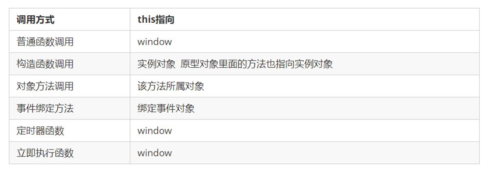

```js
// 函数的不同调用方式决定了this 的指向不同
// 1. 普通函数 this 指向window
function fn() {
  console.log("普通函数的this" + this)
}
window.fn()
// 2. 对象的方法 this指向的是对象 o
var o = {
  sayHi: function () {
    console.log("对象方法的this:" + this)
  },
}
o.sayHi()
// 3. 构造函数 this 指向 moon 这个实例对象原型对象里面的this 指向的也是moon这个实例对象
function Star() {}
Star.prototype.sing = function () {}
var moon = new Star()
// 4. 绑定事件函数 this 指向的是函数的调用者 btn这个按钮对象
var btn = document.querySelector("button")
btn.onclick = function () {
  console.log("绑定时间函数的this:" + this)
}
// 5. 定时器函数 this 指向的也是window
window.setTimeout(function () {
  console.log("定时器的this:" + this)
}, 1000)
// 6. 立即执行函数 this还是指向window
;(function () {
  console.log("立即执行函数的this" + this)
})()
```

JavaScript 专门提供了一些函数方法来处理函数内部 this 的指向问题，常用的有 bind()、call()、apply() 三种方法

#### 6.2.1. call 方法

语法：

```js
fun.call(thisArg, arg1, arg2, ...)
```

- `thisArg`：在 fun 函数运行时指定的 this 值
- `arg1，arg2`：传递的其他参数
- 返回值就是函数的返回值，因为它就是调用函数

```js
// 改变函数内this指向，js提供了三种方法：call()  apply()  bind()
// 1. call()方法
var o = {
  name: "MooN",
}
function fn(a, b) {
  console.log(this)
  console.log(a + b)
}
// call 第一个可以调用函数 第二个可以改变函数内的this 指向
fn.call(o, 1, 2)
// call 的主要作用可以实现继承
function Father(uname, age, sex) {
  this.uname = uname
  this.age = age
  this.sex = sex
}
function Son(uname, age, sex) {
  Father.call(this, uname, age, sex)
}
var son = new Son("路飞", 18, "男")
console.log(son)
```

#### 6.2.2. apply 方法

`apply()` 方法调用一个函数。简单理解为调用函数的方式，但是它可以改变函数的 this 指向。语法如下：

```js
fun.apply(thisArg, [argsArray])
```

- `thisArg`：在fun函数运行时指定的 this 值
- `argsArray`：传递的值，必须包含在数组里面
- 返回值就是函数的返回值，因为它就是调用函数
- `apply()` 函数主要跟数组有关系，比如使用 `Math.max()` 求数组的最大值

```js
// 改变函数内this指向  js提供了三种方法  call()  apply()  bind()
// 2. apply()  应用 运用的意思
var o = {
  name: "MooN",
}
function fn(arr) {
  console.log(this)
  console.log(arr) // 'pink'
}
fn.apply(o, ["pink"])
// 1. 也是调用函数 第二个可以改变函数内部的this指向
// 2. 但是他的参数必须是数组(伪数组)
// 3. apply 的主要应用 比如说可以利用 apply 借助于数学内置对象求数组最大值
// Math.max();
var arr = [1, 66, 3, 99, 4]
var arr1 = ["red", "pink"]
// var max = Math.max.apply(null, arr);
var max = Math.max.apply(Math, arr)
var min = Math.min.apply(Math, arr)
console.log(max, min)
```

#### 6.2.3. bind 方法

`bind()` 方法不会调用函数。但是能改变函数内部 this 指向。语法如下：

```js
fun.bind(thisArg, arg1, arg2, ...)
```

- `thisArg`：在 fun 函数运行时指定的 this 值
- `arg1，arg2`：传递的其他参数
- 返回由指定的 this 值和初始化参数改造的原函数拷贝
- 因此当只是想改变 this 指向，并且不想调用这个函数的时候，可以使用 `bind()`

```js
// 改变函数内this指向  js提供了三种方法  call()  apply()  bind()
// 3. bind()方法 绑定
var o = {
  name: "MooN",
}
function fn(a, b) {
  console.log(this)
  console.log(a + b)
}
var f = fn.bind(o, 1, 2)
f()
// 1. 不会调用原来的函数，可以改变原来函数内部的this 指向
// 2. 返回的是原函数改变this之后产生的新函数
// 3. 如果有的函数不需要立即调用,但是又想改变这个函数内部的this指向此时用bind
// 示例：有一个按钮,当点击了之后,就禁用这个按钮,3秒钟之后开启这个按钮
/* var btn1 = document.querySelector("button")
btn1.onclick = function () {
  this.disabled = true // 这个this 指向的是 btn 这个按钮
  // var that = this;
  setTimeout(
    function () {
      // that.disabled = false; // 定时器函数里面的this 指向的是window
      this.disabled = false // 此时定时器函数里面的this 指向的是btn
    }.bind(this),
    3000
  ) // 这个this 指向的是btn 这个对象
} */
// 多个按钮
var btns = document.querySelectorAll("button")
for (var i = 0; i < btns.length; i++) {
  btns[i].onclick = function () {
    this.disabled = true
    setTimeout(
      function () {
        this.disabled = false
      }.bind(this),
      2000
    )
  }
}
```

#### 6.2.4. 改变函数内部 this 指向三种方式总结

- 相同点：
    - 都可以改变函数内部的this指向
- 区别点：
    - call 和 apply 会调用函数，并且改变函数内部this指向
    - call 和 apply 传递的参数不一样，call 传递参数 `arg1, arg2..`形式。apply 必须数组形式[arg]
    - bind 不会调用函数，可以改变函数内部this指向
- 主要应用场景：
    - `call`：经常做继承
    - `apply`：经常跟数组有关系。比如借助于数学对象实现数组最大值最小值
    - `bind`：不调用函数，但是还想改变this指向/比如改变定时器内部的this指向

### 6.3. 闭包函数

给函数使用`()`包裹，表示闭包函数，作用就是在页面打开的时候就执行地函数

```js
(function(){
	xxx;
})();
```

### 6.4. 全局函数

#### 6.4.1. 什么是全局函数

在 JS 中任何地方都可以直接调用的函数，不属于任何一个对象。

#### 6.4.2. 常用的全局函数

> Notes: `window.alert()` 这是 window 对象的方法，不是全局函数。只是因为 window 可以省略而已。

以下是部分全局函数

```js
eval()
```

- 执行函数。基本作用如下：
    1. 可以执行一段字符串中的JS代码；
    2. 可以对字符串的表达式进行运算，返回计算的结果；
    3. 可以调用字符串中函数

```js
parseInt(String s)
```

- 将一个字符串转成整数类型。如果不能转换，返回 NaN (Not a Number)

```js
parseFloat(String s)
```

- 将一个字符串转成小数类型。如果不能转换，返回 NaN (Not a Number)

```js
isNaN(String s)
```

- 一般用在转换数字之前，用来判断当前这个字符串是否能转成一个数字。非数字为 true，数字为 false

```js
encodeURI(uri)
```

- 对 URI 地址栏上的参数进行编码，可以避免提交给服务器出现乱码，返回值是编码后的uri对象。uri 可以理解为地址栏元素

```js
decodeURI(uri)
```

- 对使用encodeURI编码以后的字符串进行解码，相当于还原。

> Notes: 如果参数中有特殊字符，需要使用 `encodeURI` 对地址进行编码，可以避免乱码的问题。再使用 `decodeURI` 对编码以后的字符串进行解码。

#### 6.4.3. eval() 函数

在 js 中 `eval()` 函数的基本使用以及一些特殊的使用方式如下：

- `eval` 函数只能在<font color=red>**非严格模式**</font>中进行使用，在 `use strict` 中是不允许使用这个方法的。
- `eval` 函数接收一个参数 s，如果 s 不是字符串，则直接返回 s。否则执行 s 语句。

```js
var code1='"a" + 2'; // 表达式 
var code2='{a:2}'; // 语句 
alert(eval(code1)); // 结果：'a2' 
alert(eval(code2)); // 结果：2
alert(eval('(' + code2 + ')')); // 结果：[object Object]
```

当 eval 中的字符串内是对象时加上括号则可以将原对象原样返回，如果定义 `code2={a:2,b:3}` 后直接使用 `eval(code2)` 时会报错，加上括号就会将 code2 原样返回。

- `eval` 直接在函数内部使用则返回的是局部变量

```js
function te (){
	eval('var a=1;')
}
te();
alert(a); // 这样会报错，因为a是局部变量，只能在te方法内使用
```

- 有两种的处理方式可以使在函数内部使用的 `eval` 成为全局变量
1. 利用 `window.eval()` 使其成为全局的

```js
function te (){
	window.eval('var a=1')
}
te();
```

> a 变量也是全局的

2. 这种方式下变量b 也是全局的。

```js
function te (){
	var a=eval;
	a('var b=1');
}
te();
```

总结：

在非严格的模式下，通过 `eval` 函数相当于又多了一种方法将 JSON 字符串形式转换为对象的形式。其功能和 `JSON.parse()` 是相似的，但是当已经为通过 `JSON.parse()` 转换为对象后的 JSON 不能再调用该函数继续进行转换，这样会报错，但是`eval()`方法不会当传入字符串是对象使继续使用上述的方式，当然会返回原对象。

```js
var m = eval('('+ data + ')')
```

> 其中 m 是 JSON 对象

`eval` 方法是将字符串形式的类转化为类。也可以让类对象作为参数也行，只不过也是直接转化为类

- 将字符串形式的类转化为类：在参数前后添加`(`和`)`
- 将类转化为类：直接将类作为参数即可

## 7. JavaScript 的对象

类就是对象的模板，对象就是类的实例。在 ES6之前，JS 中并没用引入类的概念。

在 ES6之前，对象不是基于类创建的，而是用一种称为<font color=red>**构建函数**</font>的特殊函数来定义对象和它们的特征。

创建对象可以通过以下三种方式：

1. 对象字面量。例如：`var obj2 = {}`
2. `new Object()`。例如：`var obj1 = new Object()`
3. 自定义构造函数

### 7.1. 构造函数

**构造函数**是一种特殊的函数，主要用来初始化对象，即为对象成员变量赋初始值，它总与 `new` 关键字一起使用。可以把对象中一些公共的属性和方法抽取出来，然后封装到这个函数里面

```js
// ES6之前，利用构造函数创建对象
function Star(uname, age) {
  this.uname = uname
  this.age = age
  this.sing = function () {
    console.log(this.uname + "会唱歌")
  }
}
var shiyuan = new Star("石原里美", 18)
var jieye = new Star("新垣结衣", 20)
console.log(shiyuan)
shiyuan.sing()
jieye.sing()
```

在 JS 中，使用构造函数时要注意以下两点：

- 构造函数用于创建某一类对象，<font color=red>**其首字母要大写**</font>
- <font color=red>**构造函数要和`new`一起使用**</font>才有意义

**new 对象在执行时会做四件事情**：

1. 在内存中创建一个新的空对象。
2. 让 `this` 指向这个新的对象。
3. 执行构造函数里面的代码，给这个新对象添加属性和方法。
4. 返回这个新对象（所以构造函数里面不需要 return ）。

### 7.2. 静态成员和实例成员

JavaScript 的构造函数中可以添加一些成员，可以在构造函数本身上添加，也可以在构造函数内部的 `this` 上添加。通过这两种方式添加的成员，就分别称为静态成员和实例成员。

- **静态成员**：在构造函数本上添加的成员称为静态成员，<font color=red>**只能由构造函数本身来访问**</font>
- **实例成员**：在构造函数内部创建的对象成员称为实例成员，<font color=red>**只能由实例化的对象来访问**</font>

```js
// 构造函数中的属性和方法称为成员, 成员可以添加
function Star(uname, age) {
  this.uname = uname
  this.age = age
  this.sing = function () {
    console.log("我会唱歌")
  }
}
var shiyuan = new Star("石原里美", 18)
// 1.实例成员就是构造函数内部通过this添加的成员 uname age sing 就是实例成员
// 实例成员只能通过实例化的对象来访问
console.log(shiyuan.uname)
shiyuan.sing()
// console.log(Star.uname); // 不可以通过构造函数来访问实例成员
// 2. 静态成员在构造函数本身直接添加的成员，就是静态成员。比较这个sex属性
Star.sex = "女"
console.log(Star.sex) // 静态成员只能通过构造函数来访问
console.log(ldh.sex) // 不能通过对象来访问
```

### 7.3. 原型

#### 7.3.1. 构造函数原型 prototype

JavaScript 规定，<font color=red>**每一个构造函数都有一个 `prototype` 属性**</font>，指向另一个对象。注意这个 `prototype` 就是一个对象，这个对象的所有属性和方法，都会被构造函数所拥有，所有通过此构造函数生成的对象都共享此`prototype`对象。

所以可以把那些不变的方法，直接定义在 `prototype` 对象上，这样所有对象的实例就可以共享这些方法。

```js
// 1. 构造函数的问题.
function Star(uname, age) {
  this.uname = uname
  this.age = age
  // 直接定义到构造函数上的函数，会造成浪费内存空间的问题
  /* this.sing = function () {
    console.log("我会唱歌")
  } */
}
/*
  2. 一般情况下，的公共属性定义到构造函数里面, 公共的方法放到原型对象身上
      这样可以使所有实例都共享这些公共的方法，节省内存空间
*/
Star.prototype.sing = function () {
  console.log("我会唱歌")
}
var shiyuan = new Star("石原里美", 18)
var jieye = new Star("新垣结衣", 20)
console.log(shiyuan.sing === jieye.sing)
console.dir(Star); // 通过输入到控制台可以看到构造函数中的prototype属性对象
shiyuan.sing()
jieye.sing()
```

#### 7.3.2. 对象原型 __proto__

<font color=red>**对象都会有一个属性 `__proto__` 指向构造函数的 `prototype` 原型对象**</font>

- `__proto__`对象原型和原型对象 `prototype` 是等价的
- `__proto__`对象原型的意义就在于为对象的查找机制提供一个方向，或者说一条路线，但是它是一个非标准属性，因此实际开发中，不可以使用这个属性，它只是内部指向原型对象 `prototype`

```js
function Star(uname, age) {
  this.uname = uname
  this.age = age
}
Star.prototype.sing = function () {
  console.log("我会唱歌")
}
var shiyuan = new Star("石原里美", 18)
shiyuan.sing()
console.log(shiyuan) // 对象身上系统自己添加一个 __proto__ 指向构造函数的原型对象 prototype
console.log(shiyuan.__proto__ === Star.prototype)
/*
  方法的查找规则: 首先先看实例对象身上是否有 sing 方法,如果有就执行这个对象上的sing
  如果么有sing 这个方法,因为有__proto__ 的存在,就去构造函数原型对象prototype身上去查找sing这个方法
 */
```

#### 7.3.3. 构造函数 constructor

对象原型（`__proto__`）和构造函数（`prototype`）原型对象里面都有一个属性 `constructor` 属性 `，constructor` 称为构造函数，因为它指回构造函数本身。

`constructor` 主要用于记录该对象引用于哪个构造函数，它可以让原型对象重新指向原来的构造函数

<font color=red>**一般情况下，对象的方法都在构造函数的原型对象中设置**</font>。如果有多个对象的方法，可以给原型对象采取对象形式赋值，但是这样就会覆盖构造函数原型对象原来的内容，这样修改后的原型对象 `constructor`  就不再指向当前构造函数了。此时，我们可以在修改后的原型对象中，添加一个 `constructor` 指向原来的构造函数。

```js
function Star(uname, age) {
  this.uname = uname
  this.age = age
}
// 很多情况下,需要手动的利用constructor 这个属性指回 原来的构造函数
/* Star.prototype.sing = function() {
    console.log('我会唱歌');
};
Star.prototype.movie = function() {
    console.log('我会演电影');
} */
Star.prototype = {
  // 如果修改了原来的原型对象，给原型对象赋值的是一个对象，则必须手动的利用constructor指回原来的构造函数
  constructor: Star,
  sing: function () {
    console.log("我会唱歌")
  },
  movie: function () {
    console.log("我会演电影")
  },
}
var shiyuan = new Star("石原里美", 18)
console.log(Star.prototype)
console.log(shiyuan.__proto__)
console.log(Star.prototype.constructor)
console.log(shiyuan.__proto__.constructor)
```

#### 7.3.4. 构造函数、实例、原型对象三者之间的关系

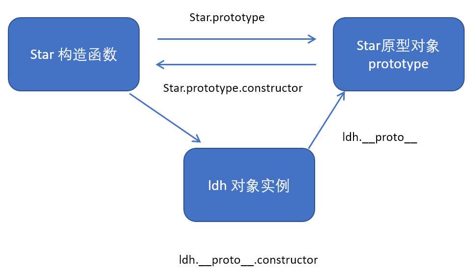

#### 7.3.5. 原型链

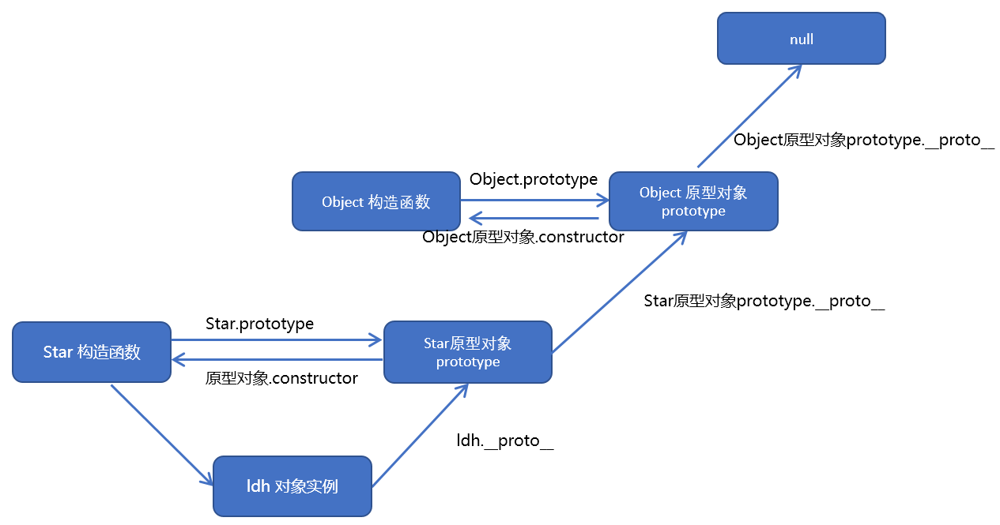

```js
function Star(uname, age) {
  this.uname = uname
  this.age = age
}
Star.prototype.sing = function () {
  console.log("我会唱歌")
}
var shiyuan = new Star("石原里美", 18)
// 1. 只要是对象就有__proto__ 原型, 指向原型对象
console.log(Star.prototype)
console.log(Star.prototype.__proto__ === Object.prototype)
// 2.我们Star原型对象里面的__proto__原型指向的是 Object.prototype
console.log(Object.prototype.__proto__)
// 3. 我们Object.prototype原型对象里面的__proto__原型  指向为 null
```

### 7.4. JavaScript 的成员查找机制(规则)

1. 当访问一个对象的属性（包括方法）时，首先查找这个对象自身有没有该属性。
2. 如果没有就查找它的原型（也就是 `__proto__` 指向的 `prototype` 原型对象）。
3. 如果还没有就查找原型对象的原型（Object的原型对象）。
4. 依此类推一直找到 Object 为止（null）。
5. `__proto__`对象原型的意义就在于为对象成员查找机制提供一个方向，或者说一条路线。

```js
function Star(uname, age) {
  this.uname = uname
  this.age = age
}
Star.prototype.sing = function () {
  console.log("我会唱歌")
}
// Object.prototype.sex = '男';
Star.prototype.sex = "男"
var shiyuan = new Star("石原里美", 18)
shiyuan.sex = "女"
console.log(shiyuan.sex)
console.log(Object.prototype)
console.log(shiyuan)
console.log(Star.prototype)
console.log(shiyuan.toString())
```

### 7.5. 原型对象this指向

- 构造函数中的 `this` 指向实例对象
- **原型对象**里面放的是方法，这个方法里面的 `this` 指向的是这个方法的调用者，也就是这个实例对象

```js
function Star(uname, age) {
  this.uname = uname
  this.age = age
}
var that
Star.prototype.sing = function () {
  console.log("我会唱歌")
  that = this
}
var shiyuan = new Star("石原里美", 18)
// 1. 在构造函数中，里面this指向的是对象实例
shiyuan.sing()
// 2.原型对象函数里面的 this 指向的是实例对象
console.log(that === shiyuan)
```

### 7.6. 扩展 JS 内置对象

可以通过原型对象，对JS原来的内置对象进行扩展自定义的方法。

```js
// 原型对象的应用 扩展内置对象方法
Array.prototype.sum = function () {
  var sum = 0
  for (var i = 0; i < this.length; i++) {
    sum += this[i]
  }
  return sum
}
// 使用此方式扩展内置对象，会覆盖原来其他方法。
/* Array.prototype = {
  sum: function () {
    var sum = 0
    for (var i = 0; i < this.length; i++) {
      sum += this[i]
    }
    return sum
  },
} */
var arr = [1, 2, 3]
console.log(arr.sum())
console.log(Array.prototype)
var arr1 = new Array(11, 22, 33)
console.log(arr1.sum())
```

> 注意：数组和字符串内置对象不能给原型对象覆盖操作` Array.prototype = {}` ，只能是 `Array.prototype.xxx = function(){}` 的方式。

### 7.7. 对象常用方法

#### 7.7.1. Object.assign() 对象属性复制，浅拷贝

- 使用Object.assign方法可以浅克隆一个对象：

```js
let cloneObj = Object.assign({}, targetObj)
```

- 简单的深克隆可以使用`JSON.parse()`和`JSON.stringify()`，这两个api是解析json数据的，所以**只能解析除symbol外的原始类型及数组和对象**

```js
let cloneObj = JSON.parse(JSON.stringify(targetObj))
```

#### 7.7.2. Object.keys() 获取对象全部属性

`Object.keys()` 用于获取对象自身所有的属性名，返回对象所有属性名的数组

```js
Object.keys(obj);
```

示例：

```js
// 用于获取对象自身所有的属性
var obj = {
  id: 1,
  pname: "小米",
  price: 1999,
  num: 2000,
}
var arr = Object.keys(obj)
console.log(arr)
arr.forEach(function (value) {
  console.log(value)
})
```

#### 7.7.3. Object.values() 获取对象全部（属性）值

`Object.values(对象)`方法作用是，获取对象内的所有值，返回值的数组。

```js
const user = {
  name: "Alex",
  age: 23,
  isOnline: false
}

console.log(Object.values(user));
// output: ["Alex", 23, false]
```

#### 7.7.4. Object.entries() 获取对象的键值

`Object.entries(对象)`方法的作用是同时获取对象的键和值，返回一个键和值的多维数组。

```js
const user = {
  name: "Alex",
  age: 23,
  isOnline: false
}

console.log(Object.entries(user));
// output: [["name", "Alex"], ["age", 23], ["isOnline", false]]
```

#### 7.7.5. Object.defineProperty() 定义属性

`Object.defineProperty()` 定义对象中新属性或修改原有的属性。语法如下：

```js
Object.defineProperty(obj, prop, descriptor)
```

- `obj`：必需。目标对象
- `prop`：必需。需定义或修改的属性的名字
- `descriptor`：必需。目标属性所拥有的特性。以对象形式`{}`书写
    - `value`：设置属性的值，默认为undefined
    - `writable`：值是否可以重写。取值：true|false，默认为false
    - `enumerable`：目标属性是否可以被枚举。取值：true|false，默认为 false
    - `configurable`：目标属性是否可以被删除或是否可以再次修改特性。取值：true|false，默认为false

```js
// Object.defineProperty() 定义新属性或修改原有的属性
var obj = {
  id: 1,
  pname: "小米",
  price: 1999,
}
// 1. 以前的对象添加和修改属性的方式
// obj.num = 1000;
// obj.price = 99;
// console.log(obj);
// 2. Object.defineProperty() 定义新属性或修改原有的属性
Object.defineProperty(obj, "num", {
  value: 1000,
  enumerable: true,
})
console.log(obj)
Object.defineProperty(obj, "price", {
  value: 9.9,
})
console.log(obj)
Object.defineProperty(obj, "id", {
  // 如果值为false 不允许修改这个属性值 默认值也是false
  writable: false,
})
obj.id = 2
console.log(obj)
Object.defineProperty(obj, "address", {
  value: "中国山东蓝翔技校xx单元",
  // 如果只为false 不允许修改这个属性值 默认值也是false
  writable: false,
  // enumerable 如果值为false 则不允许遍历, 默认的值是 false
  enumerable: false,
  // configurable 如果为false 则不允许删除这个属性 不允许在修改第三个参数里面的特性 默认为false
  configurable: false,
})
console.log(obj)
console.log(Object.keys(obj))
delete obj.address
console.log(obj)
delete obj.pname
console.log(obj)
Object.defineProperty(obj, "address", {
  value: "中国山东蓝翔技校xx单元",
  // 如果值为false 不允许修改这个属性值 默认值也是false
  writable: true,
  // enumerable 如果值为false 则不允许遍历, 默认的值是 false
  enumerable: true,
  // configurable 如果为false 则不允许删除这个属性 默认为false
  configurable: true,
})
console.log(obj.address)
```

#### 7.7.6. Object.freeze() 防止对象数据修改

`Object.freeze(对象)`方法作用是防止对象中的数据突变。即不能将`Object.freeze()`作为参数传递给对象，更不能添加，更新或删除对象的属性。

```js
const employee = {
  name: "James",
  age: 25,
  available: true
}

// Freezing the object.
Object.freeze(employee);
// updating and adding properties.
employee.name = "Brad";
employee.newProp = "Hard Worker";
console.log(employee);
// Output: {name: "James", age: 25, available: true}
```

#### 7.7.7. Object.seal() 防止对象增加属性

`Object.seal()`方法有点类似于`Object.freeze()`，它可以防止向对象添加新属性，但是可以更改和更新现有属性。

```js
const user = {
  name: "Alex",
  age: 23,
  isOnline: false
}

// 使用Object.seal（）
Object.seal(user);
// 更新属性。
user.isOnline = true;
// 添加一个属性。
user.active = false;
console.log(user);
// 输出：{名称：“ Alex”，年龄：23，isOnline：true}
```

> 示例中：该对象的`isOnline`属性值已更新，但是无法将新的`active`属性添加到对象中

#### 7.7.8. Object.create() 创建一个新对象

`Object.create()`作用是，从另一个现有对象的原型创建一个新对象。

```js
const user = {
  firstName: "John",
  lastName: "Doe",
  age: 25,
  fullName(){
    return `${this.firstName} ${this.lastName}`;
  }
}

// 新对象
let newObject = Object.create(user);
// 更新属性
newObject.firstName = "Mehdi";
newObject.lastName = "Aoussiad";
// 也可以在此新对象中使用user的fullName方法。
newObject.fullName();  // 输出：Mehdi Aoussiad
console.log(newObject);
// 输出：{firstName：“ Mehdi”，lastName：“ Aoussiad”}
```

### 7.8. 字符串转对象的三种方式

#### 7.8.1. 方式1：JSON.parse(str)

```js
// 定义一个对象字符串
var str = '{"error":1,"data":"用户不存在"}';
// 使用JSON.parse()
var obj = JSON.parse(str);
// 输出该对象
console.log(obj);
```

#### 7.8.2. 方式2：eval("("+str+")")

```js
// 定义一个对象字符串
var str = '{"error":1,"data":"用户不存在"}';
// 使用eval();
var obj = eval("(" + str + ")")
// 输出该对象
console.log(obj);
```

#### 7.8.3. 方式3：(new Function("return " + str))()

```js
// 定义一个对象字符串
var str = '{"error":1,"data":"用户不存在"}';
// 使用Function
var obj = (new Function("return " + str))();
// 输出该对象
console.log(obj);
```


## 8. BOM（浏览器模型）

### 8.1. BOM 模型

Browser Object Model 浏览器对象模型，用来操作浏览器中的对象。

### 8.2. BOM 常用对象

| BOM 常用对象 |         作用          |
| ----------- | -------------------- |
| window      | 浏览器窗体对象          |
| location    | 浏览器上的地址栏对象     |
| history     | 浏览器访问的历史记录对象 |

### 8.3. window 对象

#### 8.3.1. 对话框的相关方法

|               方法名                |                              作用                              |
| ---------------------------------- | ------------------------------------------------------------- |
| `alert("提示信息")`                 | 弹出一个信息框                                                  |
| `string prompt("提示信息","默认值")` | 弹出一个输入信息框，让用户输入数据                                  |
| `boolean confirm("提示信息")`       | 弹出一个确认对话框，有确认或取消两个按钮，点确认返回true，否则返回false |

> Notes: 所有 window 对象的属性和方法，都可以省略 window

示例：

```xml
<script type="text/javascript">
	if(confirm("你确定是否要输入？")){
		var s = prompt("请输入你的信息：","看看什么是默认值！")
		// 输出弹框
		alert(s);
	}else{
		alert("放弃设置");
	}
</script>
```

#### 8.3.2. 计时的相关方法

```js
setTimeout("函数名", 间隔毫秒数)
```

- 在指定的时间以后，运行一次指定的函数。返回值是当前的计时器。例如，1秒以后调用`sum()`函数，有以下两种写法：
    - `setTimeout("sum()", 1000);` 
    - `setTimeout(sum, 1000);`

```js
clearTimeout(计时器对象)
```

- 清除 `setTimeout()` 生成的计时器

```js
setInterval("函数名", 间隔毫秒数)
```

- 不停止地每过指定的时间间隔以后调用一次函数。<font color=red>**返回一个当前计时对象，可以利用这个变量清除计时器**</font>

```js
clearInterval(计时器对象)
```

- 清除 `setInterval()` 生成的计时器。<font color=red>**`clearInterval()`清空对象，只是把 timer 所指定的计时器清除，timer 的值不会发生变化。timer 的值在这里是一个整数，是 number 类型。**</font>

> Notes: 所有 window 对象的属性和方法，都可以省略 window

### 8.4. 日期对象

#### 8.4.1. 日期对象的创建

通过 `new` 关键字可以得到当前的日期对象

```js
var date = new Date();
```
			
#### 8.4.2. Date 对象的常用方法

```js
getFullYear()
```

- 从 Date 对象以四位数字返回年份

```js
getMonth()
```

- 从 Date 对象返回月份（0-11），从0开始，真实的月份要加1

```js
getDate()
```

- 从 Date 对象返回一个月中的某一天 (1 ~ 31)

```js
getDay()
```

- 从 Date 对象返回一周中的某一天 (0 ~ 6)。0是周日，1是周1，2是周2，依次类推

```js
getHours()
```

- 返回 Date 对象的小时 (0 ~ 23

```js
getMinutes()
```

- 返回 Date 对象的分钟 (0 ~ 59)

```js
getSeconds()
```

- 返回 Date 对象的秒数 (0 ~ 59)

```js
getMilliseconds()
```

- 返回 Date 对象的毫秒(0 ~ 999)

```js
getTime()
```

- 返回 1970 年 1 月 1 日至今的毫秒数

```js
toLocaleString()
```

- 根据本地时间格式，把 Date 对象转换为字符串

### 8.5. location 地址栏对象

#### 8.5.1. location 是什么

浏览器的地址栏对象，`location` 对象提供了关于当前打开窗口或者特定框架的 url 信息。一个多框架的窗口对象在 `location` 属性显示的是父窗口的 URL，每个框架也有一个与之相伴的 `location` 对象

#### 8.5.2. 相关属性

- `hash`：`location.hash` 返回当前框架的 URL 中 `#` 号之后(包括`#`号)的部分，即 URL 的锚点
- `host`：描述 URL 的主机名和端口，只有端口号是 URL 的一个明确部分时，值中才包括端口号。
- `hostname`：同 host 属性，但不包括端口号
- `href`：该属性提供一个指定窗口对象的整个 URL 的字符串。有如下两种操作：
    - 得到值：当前地址栏中的访问地址
    - 设置值：可以直接设置为一个值（URL），会对浏览器进行页面的跳转，从当前页面跳转新的页面

```js
location.href = 'http://www.moon.com';
```

- `pathname`：URL 的路径名部分，主机名之后的部分，不包括锚点和query(即`?`之后的部分)
- `port`：端口号。如果 URL 中没有端口号则为空，如果输入 URL 有端口号而被服务器自动忽略(redirect到80)，在 Firefox 中能得到80，而在 IE 中为空
- `protocol`：协议名，且后面紧跟着冒号

#### 8.5.3. 常用方法

```ts
/** Navigates to the given URL. */
assign(url: string | URL): void;
```

- 导航到指定的 URL

```ts
/** Reloads the current page. */
reload(): void;
```

- 重新加载当前页面，相当于点击了浏览器上的刷新按钮。

```ts
/** Removes the current page from the session history and navigates to the given URL. */
replace(url: string | URL): void;
```

- 导航跳转到新的页面，并将当前页面从历史记录移除。即无法使用后退方法返回到当前页面。

### 8.6. history 对象

#### 8.6.1. 作用

读取浏览器的缓存页面，不访问服务器，访问之前已经访问过的页面。

源码定义如下：

```ts
interface History {
    readonly length: number;
    scrollRestoration: ScrollRestoration;
    readonly state: any;
    back(): void;
    forward(): void;
    go(delta?: number): void;
    pushState(data: any, unused: string, url?: string | URL | null): void;
    replaceState(data: any, unused: string, url?: string | URL | null): void;
}
```

#### 8.6.2. 常用方法

```ts
back(): void;
```

- 返回前一个页面，相当于浏览器上的后退按钮。

```ts
forward(): void;
```

- 前进到曾经访问过的一个页面，相当于浏览器上的前进按钮。

```ts
go(delta?: number): void;
```

- 跳转到历史浏览记录中指定的第几个页面。函数的参数是整数类型，可以是负数或正数。如果是负数类似于`back()`；如果是正数，类似于`forward()`。例如是-2，则表示后退2个页面

## 9. DOM（文档对象模型）

### 9.1. DOM 概念

Document Object Model 文档对象模型，用于操作网页中的各种元素。对应 JS 中的一个名为 `document` 对象。

<font color=red>**注：使用 `document.write()` 方法时需要注意，如果直接使用，相当于重新写了一个新的文档，会覆盖原来的网页的元素。**</font>

### 9.2. 获取 DOM 结点(元素)

```js
document.getElementById("id")
```

- 文档对象通过 id 得到唯一的一个网页标签元素，如果有同名的 id，则得到第1个元素。

```js
document.getElementsByName("name")
```

- 通过 name 属性得到一组同名的元素，返回一个数组

```js
document.getElementsByTagName("标签名")
```

- 通过标签的名字得到一组标签，返回一个数组

### 9.3. DOM 元素的 innerHTML 与 innerText 属性

#### 9.3.1. innerHTML 

通过元素对象的 `innerHTML`， 可以得到或设置元素的内容，主体是 HTML 内容。如页面有元素如下：

```html
<h1 id="moon">xxx</h1>
```

若要修改其标签元素的内容：

```js
document.getElementById("moon").innerHTML = "abc";
```

#### 9.3.2. innerText

元素对象的 `innerText`，可以得到或设置元素的内容，主体是<font color=red>**纯文本内容，标签不起作用**</font>。

#### 9.3.3. innerHTML 与 value 选择

一般是表单元素才有 `value` 属性，会放在 form 中，如：`<input>`、`<select>` 等，其中 `<textarea>` 是没有 value 属性。如果没有 value 属性的，则不能使用 value。

假如要修改元素的主体内容。如：`<h3>xxx</h3>`，则需要通过 `innerHTML` 属性进行修改。

#### 9.3.4. 示例

编写代码实现：实现当点击『计算折扣价』按钮时展示图2的效果。

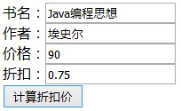 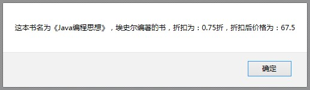

操作步骤描述：

1. 为『计算折扣价』按钮添加点击事件
2. 为各标签添加属性 id
3. 书写方法，实现方法体
    1. 根据 id 获取标签元素的值
    2. 根据页面效果拼接结果

页面定义输入框：

```html
<!DOCTYPE html>
<html>
	<head>
		<meta charset="UTF-8">
		<title>图书价格计算器</title>
		<!--导入外部JS文件-->
		<script src="js/Day30Test02.js" type="text/javascript"></script>
	</head>
	<body>
		<!--定义表单与表格-->
		<form name="myForm">
			<table>
				<tr>
					<th colspan="2">图书价格计算器</th>
				</tr>
				<tr>
					<td>书名：</td>
					<td><input type="text" name="bookname" id="bookname"/></td>
				</tr>
				<tr>
					<td>作者：</td>
					<td><input type="text" name="author" id="author"/></td>
				</tr>
				<tr>
					<td>价格：</td>
					<td><input type="text" name="price" id="price"/></td>
				</tr>
				<tr>
					<td>折扣：</td>
					<td><input type="text" name="discount" id="discount"/></td>
				</tr>
				<tr>
					<td colspan="2"><input type="button" value="计算折扣价" onclick="count()"/></td>
				</tr>
			</table>
		</form>
	</body>
</html>
```

通过 js 获取输入框里的值，输出相关信息

```js
function count(){
	//使用文档对象的函数,根据ID获取输入元素的值
	var bookname = document.getElementById("bookname").value;
	var author = document.getElementById("author").value;
	var price = document.getElementById("price").value;
	var discount = document.getElementById("discount").value;
	
	var count = price * discount;
	alert("这本书名为《" + bookname + "》，" + author + "编著的书，原价是：" + price + "，折扣为：" + discount + "折，折扣后价格为：" + count);
}
```

### 9.4. DOM 的创建和修改

#### 9.4.1. 元素操作常用方法

```js
document.createElement("标签名")
```

- 创建一个新的标签元素，如：`<input>`

```js
// element 是元素对象
element.setAttribute("属性名", "属性值")
```

- 给标签增加或修改属性和属性值。如果原来没有此属性名，则新增；如果原来有此属性名，则修改属性值。

```js
document.createTextNode("文本节点内容")
```

- 创建一个文本节点，参数是文本内容。如：`<h1>文本</h1>`

```js
// parent 是父元素对象 child 是子元素对象
parent.appendChild(child)
```

- 将一个元素追加成当前元素的最后一个子元素

```js
// parent 是父元素对象 oldElement、newElement 都是元素对象
parent.insertBefore(newElement,oldElement)
```

- 在父元素下面，将一个元素(newElement)插入到指定元素(oldElement)的之前

```js
// parent 是父元素对象 child 是子元素对象
parent.removeChild(child)
```

- 删除当前元素的一个子元素

```js
// element 是元素对象
element.remove()
```

- 删除元素本身

#### 9.4.2. 通过关系找节点

通过元素对象的相关属性，可以获取指定的节点元素。若返回的是数组，可以通过遍历的方式来访问相关的节点。以下变量 `element` 为某个元素对象：

```js
element.childNodes
```

- 得到当前元素所有的子元素，返回数组

```js
element.firstChild
```

- 得到当前元素的第1个子元素

```js
element.lastChild
```

- 得到当前元素最后1个子元素

```js
element.parentNode
```

- 得到当前元素的父元素

```js
element.nextSibling
```

- 得到当前元素的下一个兄弟元素

```js
element.previousSibling
```

- 得到当前元素的上一个兄弟元素

### 9.5. DOM 编程综合案例

#### 9.5.1. 案例1：计数器对象使用案例

案例需求：实现5秒后跳转到主页的操作。

编写页面元素：

```html
<!DOCTYPE html>
<html>
	<head>
		<meta charset="UTF-8">
		<title>自动跳转</title>
		<!--导入外部js文件-->
		<script src="js/Day30Test03.js" type="text/javascript"></script>
	</head>
	<body>
		<font style="font-size: 28px;">操作成功！！</font><br />
		<font style="font-size: 28px;"><span id="num">5</span>秒后回到主页</font>&nbsp;&nbsp;
		<a href="http://ntlias-stu.boxuegu.com">返回</a>
	</body>
</html>
```

编写 js 实现功能（可以写在页面上的`<script>`标签，或者定义在外部js文件中）

```js
/变量
var n = 5;

// 2. 编写定时器定时执行的函数
function refresh(){
	// 通过id获取span标签的对象
	document.getElementById("num").innerHTML = --n;
	
	// 判断将n=1时跳转
	if(n == 1){
		location.href = "http://www.moon.com"
	}
}

// 1. 设置定时器
setInterval("refresh()", 1000);
```

案例2需求：显示时钟，暂停、开始和根据时间提示相关信息

编写页面元素：

```html
<!DOCTYPE html>
<html>
	<head>
		<meta charset="UTF-8">
		<title>显示当前时间</title>
		<!--使用外部js文件-->
		<script src="../js/Day30Exercise01_02.js" type="text/javascript"></script>
	</head>
	<body>
		<table>
			<caption><h1>当前时间</h1></caption>
			<tr>
				<td><h2 id="h2"></h2></td>
			</tr>
			<tr>
				<td><hr/></td>
			</tr>
			<tr>
				<td height="30px"><span id="h3" style="font-weight: bold; color: red;"></span></td>
			</tr>
			<tr>
				<td><input type="button" id="b1" value="点击我say hi" onclick="clickMe()"/>&nbsp;&nbsp;
					<input type="button" id="b2" value="开始" onclick="begin()"/>&nbsp;&nbsp;
					<input type="button" id="b3" value="暂停" onclick="pause()"/>
				</td>
			</tr>
		</table>
	</body>
</html>
```

编写 js 实现功能

```js
var timer = setInterval("time()", 50);

//定义函数
function time(){
	//获取当前时间对象
	var date = new Date();
	document.getElementById("h2").innerHTML = date.toLocaleString();
}

function clickMe(){
	setInterval("checkTime()", 10);
}

function checkTime(){
	var d = new Date();
	var time = d.getHours();
	// 对当前时间进行判断
	switch (true){
		case time>6 && time<12:
			document.getElementById("h3").innerHTML = "Good morning";
			break;
		case time>=12 && time<=18:
			document.getElementById("h3").innerHTML = "Good afternoon";
			break;
		default:
			document.getElementById("h3").innerHTML = "Good night";
			break;
	}
}

// 开始
function begin(){
	// 每次点击开始就将之前的计时器清空
	window.clearInterval(timer);
	// 开启新的计时器
	timer = setInterval("time()", 50);
}

// 暂停
function pause(){
	window.clearInterval(timer);
}
```

#### 9.5.2. 案例2：选择商品并计算总金额

案例需求：页面上有5件商品，前面都有复选框，名字叫item，value是商品的价格。下面有一个"全选/全不选"的复选框，id是"all"，点它实现全选或全不选的功能，还有个反选的按钮，点它实现反选的功能。下面有一个按钮，点它则计算选中商品的总金额。

注：在 DOM 编程中，如果要给一个复选框选中，是将`checked`属性设置 true，不选中设置为 false，而不是`checked="checked"`

页面代码：

```html
<!DOCTYPE html>
<html>
	<head>
		<meta charset="utf-8" />
		<title>商品清单</title>
		<!-- 引用外部js文件 -->
		<script src="js/test.js" type="text/javascript"></script>
	</head>
	<body>
		<h3>商品价格列表</h3>
		<input type="checkbox" name="item" value="1500" /> 山地自行车1500<br />
		<input type="checkbox" name="item" value="200" /> 时尚女装200<br />
		<input type="checkbox" name="item" value="3000" /> 笔记本电脑3000元<br />
		<input type="checkbox" name="item" value="800" /> 情侣手表800<br />
		<input type="checkbox" name="item" value="2000" /> 桑塔纳2000<br />
		<hr/>
		<input type="checkbox" id="all" onclick="selectAll()" />全选/全不选 &nbsp;
		<input type="button" id="reverse" onclick="reverseSelect()"  value=" 反 选 "/>&nbsp;
		<input type="button" value=" 结 账 " onclick="total()" />&nbsp;<span id="result"></span>
	</body>
</html>
```

js 代码：

```js
// 编写选择全部/不选择全部的函数
function selectAll(){
	// 当点击全选/全不选按键后，根据该按键自身是否勾选还判断是否选择
	// 先获取全部的复选框项的元素对象
	var items = document.getElementsByName("item");
	// 遍历数组，如果按键自己勾选则选全部，不勾则不选择
	var all = document.getElementById("all");
	for (var i = 0; i < items.length; i++) {
		items[i].checked = all.checked;
	}
}

// 编写反选函数
function reverseSelect(){
	// 获取所有复选框对象
	var items = document.getElementsByName("item");
	// 遍历数组，将所有复选框对象的checked属性取反
	for (var i = 0; i < items.length; i++) {
		items[i].checked = !items[i].checked;
	}
}

// 结账按钮函数
function total(){
	// 获取所有复选框对象
	var items = document.getElementsByName("item");
	// 遍历数组，将所有复选框，将所有选中的元素的值相加
	var sum = 0;
	for (var i = 0; i < items.length; i++) {
		if(items[i].checked){
			sum += parseFloat(items[i].value);
		}
	}
	// 将统计后的结果赋值给result元素
	document.getElementById("result").innerHTML = sum;
}
```

#### 9.5.3. 案例3：学生信息管理

案例要求实现以下功能：

1. 使用 CSS 样式：当鼠标移入时，该行的背景颜色为黄色，当鼠标移出时，该行的背景颜色还原；
2. 当添加按钮“添加一行数据”时，文本框中的数据添加到表格中且文本框置空； 
3. 当点击表格中的“删除”时，该行数据被删除。

注意事项：

1. 如果 HTML 里有表格的话，要注意 `<table>` 标签里默认会有一个`<tbody>`的标签，在添加元素的时候需要注意。
2. `<a>` 标签同时定义了 `href` 与 `onclick` 属性，则点击时会优先执行连接的操作，需要给 `href` 属性设置成`javascript:void(0)`，表示不让 `href` 属性起作用，而是执行 `onclick` 属性中的代码

js 代码：

```js
JS文件
// 增加行的函数
function addRow(){
	// 获取两个文本框输入的值
	var num = document.getElementById("no").value;
	var name = document.getElementById("name").value;
	// 取出文件框的值后清空文本框
	document.getElementById("no").value = "";
	document.getElementById("name").value = "";
	// 将最后一行的代码包装成字符串,语句的双引号
	var delString = "<a href='javascript:void(0)' onclick='deleteRow(this)'>删除</a>";
	
	// 创建3个td标签对象
	var td1 = document.createElement("td");
	var td2 = document.createElement("td");
	var td3 = document.createElement("td");
	
	// 将文本框的内容放到td标签对象中,分别使用两种不同方法
	// 方式1，先将文本框的内容转成文本节点，再放到td标签中
	var txt = document.createTextNode(num);
	td1.appendChild(txt);
	// 方式2：将文本框的内容直接设置td标签对象的innerHTML属性
	td2.innerHTML = name;
	td3.innerHTML = delString;
	
	// 创建新的tr标签对象，将3个td标签增加到tr中
	var tr = document.createElement("tr");
	tr.appendChild(td1);
	tr.appendChild(td2);
	tr.appendChild(td3);
	
	// 获取tbody标签对象，将新的tr标签增加到tbody对象中
	var tbody = document.getElementById("data");
	tbody.appendChild(tr);
}

// 删除标签函数,函数有参数，是该链接对象
function deleteRow(obj){
	// 提示是否要删除
	if(confirm("确定是否要删除？")){
		// 参数是该链接对象，先得到上级td标签对象，再获取上级tr标签对象
		obj.parentNode.parentNode.remove();
	}
}
```

CSS样式文件代码：

```css
/*使用CSS样式：当鼠标移入时，该行的背景颜色为黄色，当鼠标移出时，该行的背景颜色还原*/
table{
	width: 500px;
	border-collapse: collapse;
}
tr{
	text-align: center;
}
/*使用伪类样式*/
tr:hover{
	background-color: lightcyan;
}
```

HTML 文件代码：

```html
<!DOCTYPE html>
<html>
	<head>
		<meta charset="utf-8" />
		<title>商品清单</title>
		<!-- 引用外部js文件 -->
		<script src="js/test.js" type="text/javascript"></script>
		<!--使用外部样式-->
		<link rel="stylesheet" href="css/test.css" type="text/css" />
	</head>
	<body>
		<div>
			<table border="1" cellspacing="0" cellpadding="3">
				<tbody id="data">
					<tr>
						<th>学号</th>
						<th>姓名</th>
						<th>操作</th>
					</tr>
					<tr>
						<td>00001</td>
						<td>敌法师</td>
						<td>
              <!-- javascript:void(0)表示不让href起作用，而是执行onclick中的代码-->
							<a href="javascript:void(0)" onclick="deleteRow(this)">删除</a>
						</td>
					</tr>
					<tr>
						<td>00002</td>
						<td>剑圣主宰</td>
						<td>
							<a href="javascript:void(0)" onclick="deleteRow(this)">删除</a>
						</td>
					</tr>
				</tbody>
			</table>
			<br />
			学号：<input type="text" id="no" value="" />&nbsp;&nbsp;
			姓名：<input type="text" id="name" value="" />&nbsp;&nbsp;
			<input type="button" id="add" value="新增" onclick="addRow()" />
		</div>
	</body>
</html>
```

## 10. 样式操作

### 10.1. JS 修改 CSS 样式

通过获取元素对象，再根据对应样式属性名称修改即可。

在 JavaScript 中，样式的命名规则是：<font color=red>**CSS的名字，多个单词，首字母小写，第二个单词去掉减号，首字母大写**</font>。

#### 10.1.1. 方式一：单个元素修改

每条 JS 代码修改一个样式。一条语句修改一个样式。

```js
元素名.style.样式名 = 样式值;
```

#### 10.1.2. 方式二：批量元素修改

首先定义一个类样式，给类起名。一次修改一批样式。

```js
元素名.className = 类样式名;
```

注：在使用 CSS 类选择器时，是在需要修改的元素标签里添加属性 `class="xxx"`。但在 JS 中修改 CSS 时，如果用类批量修改样式，是获取到修改的元素对象后，给 `className` 赋值新定义的类选择器名字，而不是 `class`（*可能是因为 `class` 属性的名称与关键字冲突*）。

### 10.2. 在 JS 中操作 CSS 属性命名上的区别

使用 JavaScript 修改元素的 css 样式，与直接定义样式的属性名称有些不一样。例如：

|  CSS中写法   |        JS中的写法        |              说明               |
| ----------- | ---------------------- | ------------------------------ |
| `color`     | `元素名.style.color`    | 颜色                            |
| `font-size` | `元素名.style.fontSize` | 第二个单词首字母大小，去掉中间减号。 |

## 11. 事件的处理

### 11.1. 事件的概述

| 事件机制组成 |        描述        |               具体对象                |
| ---------- | ----------------- | ----------------------------------- |
| 事件源      | 发出事件的对象      | 如：按钮，链接，图片                    |
| 事件        | 发出什么类型的事情   | 如：点击，双击，鼠标移动事件             |
| 监听者      | 对事件进行处理的函数 | 事件处理函数 `funnction changeCode()` |

### 11.2. 事件命名的规则

1. 所有事件以`on`开头
2. 所有的事件都是以标签属性的方式存在的，名字的字母都是小写

### 11.3. 设置事件

JavaScript 有两种方式设置事件

- 方式1：**命名函数**。直接在标签中使用，可以多次使用。

```html
<标签 onclick="函数名()" />
```

- 方式2：**匿名函数**。使用匿名函数的方式，只能在一个地方使用。

```js
元素.onclick = function(){
    // do something...
}
```

设置事件的两种方式示例：

```html
<!DOCTYPE html>
<html>
	<head>
		<meta charset="utf-8" />
		<title>JS事件</title>
	</head>
	<body>
		<!--设置事件的两种方式-->
		<!--方式一-->
		<h1>设置事件的两种方式</h1>
		<!--设置事件的方式一：直接写在标签中-->
		<input type="button" id="b1" value="我是按键1" onclick="clickMe()" />
		<br /><br />
		<!--设置事件的方式二：以匿名函数的方式存在js代码中，标签中没有on开头的属性-->
		<input type="button" id="b2" value="我是按键2" />&nbsp;&nbsp;
		<input type="button" id="b3" value="我是按键3" />
		
		<script type="text/javascript">
			function clickMe(){
				alert("我是一个按键点击出来的");
			}
			
			document.getElementById("b2").onclick = function (){
				alert("我是匿名函数方式点出来的");
			}
			
			// 使用命名函数,函数后面没有括号
			document.getElementById("b3").onclick = clickMe;
		</script>
	</body>
</html>
```

### 11.4. 常用的事件

|     事件名     |           作用           |
| ------------- | ------------------------ |
| `onclick`     | 单击事件                  |
| `ondbclick`   | 双击事件                  |
| `onsubmit`    | 表单提交事件               |
| `onload`      | 加载完毕                  |
| `onfocus`     | 得到焦点                  |
| `onblur`      | 失去焦点                  |
| `onchange`    | 文本框和下拉列表内容改变事件 |
| `onmousemove` | 鼠标移动                  |
| `onmouseout`  | 鼠标移出                  |
| `onmouseup`   | 鼠标松开                  |
| `onmousedown` | 鼠标按下                  |
| `onkeyup`     | 键盘按键松开               |
| `onkeydown`   | 键盘按键按下               |

#### 11.4.1. 加载完成事件

`onload` 事件：用于一个元素<font color=red>**加载完毕**</font>以后执行的代码。一般用在页面或图片加载完毕以后激活的事件

<font color=red>**如果使用匿名函数的方式设置事件，要注意要在设置事件之前，要设置在页面加载后再触发匿名函数事件，即 `window.onload = function(){}`，因为匿名函数一般需要先得到元素，即`document.getElementById("xxx")`，如果不设置 `onload` 事件，那么不一定能得到元素，如果加载 script 放在最后，那就可以得到元素**</font>

面试题：在页面加载后就能触发函数执行的三种写法：

1. `window.onload = function()`
2. `<body onload = "函数名()"></body>`
3. `onload = function()` 与第一种相同，只是省略了 window 对象

`onload` 事件基础使用示例：

```html
<!DOCTYPE html>
<html>
	<head>
		<meta charset="utf-8">
		<title>事件和对指定的元素样式进行操作</title>
		<style type="text/css">
			/*标签选择器*/
			a{
				text-decoration: none;
				font-size: 50px;
			}
		</style>
		<!--使用外部js文件-->
		<script src="js/Day31Test01_01.js" type="text/javascript"></script>
	</head>
	<body>
		<a href="http://www.baidu.com" title="百度" target="_blank" id="a1">百度</a>
		<div id="d1" style="color: blue; display: none;" ><a href="#">百度一下你就知道</a></div>
	</body>
</html>
```

js 代码：

```js
// 在网页加载后再加载事件
window.onload = function(){
	// 当鼠标移动到链接时显示div内容
	document.getElementById("a1").onmouseover = function(){
		document.getElementById("d1").style.display = "";
	}

	// 当鼠标移出链接后隐藏div内容
	document.getElementById("a1").onmouseout = function(){
		document.getElementById("d1").style.display = "none";
	}
}
```

上面的例子，如果将`<script src="js/Day31Test01_01.js" type="text/javascript"></script>`放到`<body>`标签的最后，就算不设置 `onload` 事件，也可以得到效果。

直接在标签上定义事件：

```html
<!DOCTYPE html>
<html>
	<head>
		<meta charset="utf-8">
		<title>事件和对指定的元素样式进行操作</title>
		<style type="text/css">
			/*标签选择器*/
			a{
				text-decoration: none;
				font-size: 50px;
			}
		</style>
		<!--使用外部js文件-->
		<script src="js/Day31Test01_01_方式2.js" type="text/javascript"></script>
	</head>
	<body>
		<a href="http://www.baidu.com" title="百度" target="_blank" onmouseover="mouseover()" onmouseout="mouseout()">百度</a>
		<div id="d1" style="color: blue; display: none;" ><a href="#">百度一下你就知道</a></div>
	</body>
</html>
```

#### 11.4.2. 鼠标点击事件

- `onclick` 点击事件
- `ondblclick` 双击事件

单击与双击代码示例：

```html
<!DOCTYPE html>
<html>
	<head>
		<meta charset="utf-8" />
		<title>JS事件</title>
	</head>
	<body>
		<table>
			<tr>
				<td>Field1:</td>
				<td><input type="text" id="f1" /></td>
			</tr>
			<tr>
				<td>Field2:</td>
				<td><input type="text" id="f2" /></td>
			</tr>
			<tr>
				<td colspan="2"><input type="button" id="b1" value="单击复制/双击改变颜色"/></td>
			</tr>
		</table>
		
		<script type="text/javascript">
			// 单击事件
			document.getElementById("b1").onclick = function (){
				document.getElementById("f2").value = document.getElementById("f1").value;
			}
			
			// 双击事件
			document.getElementById("b1").ondblclick = function (){
				document.getElementById("f1").style.color = "red";
			}
		</script>
	</body>
</html>
```

#### 11.4.3. 鼠标按下与松开

- `onmousedown` 鼠标按下事件
- `onmouseup` 鼠标松开事件，必须在按下的元素地方松开才有效果。

#### 11.4.4. 鼠标移动事件

- onmousemove 鼠标移动到某个元素上面，激活事件
- onmouseout 鼠标从元素上移走，激活事件。

> Notes: <font color=red>**如果是图片的鼠标移动事件，要设置图片的大小**</font>

鼠标按下与松开、移动事件示例：

```html
<!DOCTYPE html>
<html>
	<head>
		<meta charset="utf-8" />
		<title>JS事件</title>
	</head>
	<body>
		<script type="text/javascript">
			window.onload = function(){
				// 鼠标按下事件
				document.getElementById("t3").onmousedown = function (){
					document.getElementById("t3").innerHTML = "鼠标按下了";
				}
			
				// 鼠标松开事件
				document.getElementById("t3").onmouseup = function (){
					this.innerHTML = "鼠标松开了";
				}
			
				// 鼠标移动事件
				document.getElementById("pic").onmousemove = function (){
					this.src = "img/用户登录/bg1.jpg";
				}
				
				// 鼠标移出事件
				document.getElementById("pic").onmouseout = function (){
					document.getElementById("pic").src = "";
				}
			}
		</script>
		
		<h3 id="t3">试试又不会怀孕</h3>
		
	</body>
</html>
```

#### 11.4.5. 焦点相关事件

如果一个文本框（控件）得到光标，处于一种可以操作或输入的状态，称为**获得焦点**。

- `onblur` 失去焦点
- `onfocus` 得到焦点

#### 11.4.6. 改变事件

`onchange` 一般用于文本框内容改变，或下拉列表选项发生变化

> Notes: <font color=red>**文本框必须是失去焦点以后才激活改变事件**</font>

#### 11.4.7. 键盘相关事件

- `onkeyup` 松开键盘某个按键激活的事件
- `onkeydown` 按下键盘某个按键激活的事件

键盘码：键盘上每个按键都有一个对应的键盘码，大小字母的键盘码是一样的。得到键盘码需要传入一个参数：事件对象。keyCode 就是键盘码。

#### 11.4.8. 表单提交事件

`onsubmit` 每个表单在提交之前都会有一个表单的提交的事件。一般可以用于表单验证。

如果 `onsubmit` 中返回 false，可以阻止表单的提交。

```html
<!DOCTYPE html>
<html>
	<head>
		<meta charset="utf-8" />
		<title>JS事件</title>
		<script type="text/javascript">
			function checkUser(){
				if(document.getElementById("user").value.trim() == ""){
					alert("用户名不能为空");
					return false;
				}
				return true;
			}
		</script>
	</head>
	<body>
		<form action="http://ntlias-stu.boxuegu.com" method="post" onsubmit="return checkUser()">
			<span id="t1">用户名:</span><input type="text" id="user"/><br/>
			<input type="submit" value="登录"/>
		</form>
	</body>
</html>
```

## 12. 继承（ES6以前的实现方式）

ES6之前并没有提供 `extends` 继承。但可以<font color=red>**通过构造函数+原型对象模拟实现继承，被称为组合继承**</font>

### 12.1. call() 函数

通过`call()`去调用某个函数, 并且修改函数运行时的 `this` 指向

```js
fun.call(thisArg, arg1, arg2, ...)
```

- `thisArg`：当前调用函数 this 的指向对象
- `arg1，arg2`：传递的其他参数

```js
// call 方法
function fn(x, y) {
  console.log("我想喝手磨咖啡")
  console.log(this)
  console.log(x + y)
}
var o = {
  name: "斩月",
}
// 直接调用函数
// fn();
// 1. call() 可以调用函数
// fn.call();
// 2. call() 可以改变这个函数的this指向 此时这个函数的this 就指向了o这个对象
fn.call(o, 1, 2)
```10.2. 
### 9.6. 借用构造函数继承父类型属性

核心原理：通过 `call()` 把父类型的this指向子类型的this，这样就可以实现子类型继承父类型的属性。

```js
// 借用父构造函数继承属性
// 1. 父构造函数
function Father(uname, age) {
  // this 指向父构造函数的对象实例
  this.uname = uname
  this.age = age
}
// 2 .子构造函数
function Son(uname, age, score) {
  // this 指向子构造函数的对象实例
  Father.call(this, uname, age)
  this.score = score
}
var son = new Son("敌法师", 18, 100)
console.log(son)
```

### 12.2. 借用原型对象继承父类型方法

<font color=red>**一般情况下，对象的方法都在构造函数的原型对象中设置，通过构造函数无法继承父类方法**</font>。实现的核心原理：

1. 将子类所共享的方法提取出来，让子类的 `prototype 原型对象 = new 父类()`
2. 本质：子类原型对象等于是实例化父类，因为父类实例化之后另外开辟空间，就不会影响原来父类原型对象
3. 将子类的 constructor 从新指向子类的构造函数

```js
// 借用父构造函数继承属性
// 1. 父构造函数
function Father(uname, age) {
  // this 指向父构造函数的对象实例
  this.uname = uname
  this.age = age
}
Father.prototype.money = function () {
  console.log(100000)
}
// 2 .子构造函数
function Son(uname, age, score) {
  // this 指向子构造函数的对象实例
  Father.call(this, uname, age)
  this.score = score
}
// 这样直接赋值会有问题，如果修改了子原型对象，父原型对象也会跟着一起变化
// Son.prototype = Father.prototype
Son.prototype = new Father()
// 如果利用对象的形式修改了原型对象,别忘了利用constructor 指回原来的构造函数
Son.prototype.constructor = Son
// 这个是子构造函数专门的方法
Son.prototype.exam = function () {
  console.log("孩子要考试")
}
var son = new Son("剑圣主宰", 18, 100)
console.log(son)
console.log(Father.prototype)
console.log(Son.prototype.constructor)
```


## 13. 数组对象 Array

在JS中，数组等价于集合

### 13.1. 创建数组的方式

#### 13.1.1. 一维数组

1. 创建一个长度为0的数组

```js
var arr = new Array();
```

2. 创建一个长度为num的数组

```js
var arr = new Array(num);
```

3. 创建一个指定元素的数组

```js
var arr = new Array(x1,x2,x3……);
```

4. 使用中括号创建数组，指定数组中的每个元素

```js
var arr = [x1,x2,x3,……];
```

#### 13.1.2. 二维数组

```js
var arr = [[x,x,x],[x,x,x],[x,x],……];
```

- 值：`arr[0] = [x,x,x]`
- 使用嵌套循环遍历

#### 13.1.3. Array.of() 方法

`Array.of()`方法用于将一组值，转换为数组。这个方法的主要目的，是弥补数组构造函数`Array()`的不足。因为参数个数的不同，会导致`Array()`的行为有差异。

```js
/* new Array()的构造方法创建数组
 *    Array方法没有参数、一个参数、三个参数时，返回结果都不一样。
 *    只有当参数个数不少于 2 个时，Array()才会返回由参数组成的新数组。参数个数只有一个时，实际上是指定数组的长度。
 */
Array() // []
Array(3) // [, , ,]
Array(3, 11, 8) // [3, 11, 8]

// 使用Array.of()方法创建数组
Array.of(3, 11, 8) // [3,11,8]
Array.of(3) // [3]
Array.of(undefined)    // [ undefined ]
Array.of(3).length // 1
```

- `Array.of()`方法基本上可以用来替代`Array()`或`new Array()`，并且不存在由于参数不同而导致的重载。它的行为非常统一。
- `Array.of()`方法总是返回参数值组成的数组。如果没有参数，就返回一个空数组。

### 13.2. 数组中元素的类型

1. 数组中的元素类型可以各不相同
2. 数组的长度可以动态增长

```js
var arr = [1, 3, 2];
arr[2] = "hello";
arr[3] = new Date();
arr[5] = 99;
```

- 上面的案例最后的结果是：如果跳过增加，则数组也会自动在空的位置加上undefined
- 数组的长度是6
- 数组的内容是`[1, 3, "hello", 时间对象, undefined, 99]`

### 13.3. 数组的遍历

#### 13.3.1. for...of 循环

- 语法：`for(const item of array)`
- 作用：循环遍历数组所有元素项
- > 注：此方式可以随时使用`break`语句停止遍历

```js
const colors = ['blue', 'green', 'white'];

for (const color of colors) {
    console.log(color);
}
// 'blue'
// 'green'
// 'white'
```

#### 13.3.2. for 循环

- 语法：`for(let i; i < array.length; i++)`
- 作用：循环使用递增的索引变量的方式遍历数组所有元素项，index变量从0递增到`colors.length-1`
- > 注：此方式可以随时使用`break`语句停止遍历

```js
const colors = ['blue', 'green', 'white'];

for (let index = 0; index < colors.length; index++) {
    const color = colors[index];
    console.log(color);
}
// 'blue'
// 'green'
// 'white'
```

#### 13.3.3. forEach()方法

- 语法：

```js
array.forEach(callback(item[, index[, array]]))
```

- 参数callback函数，该函数参数包括：当前遍历项（item）、索引（index）和数组本身（array）。
- 作用：forEach是Array新方法中最基本的一个，就是遍历，循环。对数组中的每一项元素调用callback函数，执行相关逻辑来遍历数组所有元素项
- forEach方法与map方法的区别是：forEach不返回值，只用来操作数据。

```js
var arr = [1,2,3];
arr.forEach((item, index) => {
    console.log(item, index);
    // 也可以有其他的操作。
})
```

> 注：`array.forEach()`迭代中，不能使用`break`来中断操作

### 13.4. 数组的映射

#### 13.4.1. map()方法 - ES6新特性

- 语法：`map(callback(item[, index[, array]]))`
    - 参数callback函数，该函数参数包括：当前遍历项（item）、索引（index）和数组本身（array）。
- 作用：接收一个函数，将原数组中的所有元素用这个函数处理后，创建新的数组返回。
- > 注：`array.map()`创建一个新的映射数组，而不改变原始数组。

例：有一个字符串数组，将其转为int数组

```js
let arr = ['1', '20', '-5', '3'];
console.log(arr)

let newArr = arr.map(s => parseInt(s));
console.log(newArr)
```

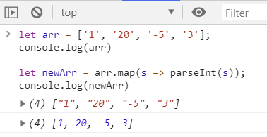

#### 13.4.2. Array.from()方法

`Array.from()`方法就是将一个**类数组对象**或者**可遍历对象(包括ES6新增的数据结构Set和Map)**转换成一个真正的数组。

**类数组对象**，最基本的要求就是具有length属性的对象。

##### 13.4.2.1. 语法

```js
Array.from(arrayLike[, mapFunction[, thisArg]])
```

- arrayLike：必传参数，想要转换成数组的伪数组对象或可迭代对象。
- mapFunction：可选参数，`mapFunction(item，index){…}` 是在集合中的每个项目上调用的函数。返回的值将插入到新集合中。
- thisArg：可选参数，执行回调函数 mapFunction 时 this 对象。这个参数很少使用。

简单的示例

```js
const someNumbers = { '0': 10, '1': 15, length: 2 };
Array.from(someNumbers, value => value * 2); // => [20, 30]
```

> 注：
>
> - `Array.from()`创建一个新的映射数组，而不改变原始数组。
> - `Array.from()`更适合从类似数组的对象进行映射。

##### 13.4.2.2. 用法1：将类数组对象转换为真正数组

```js
let arrayLike = {
    0: 'tom',
    1: '65',
    2: '男',
    3: ['jane', 'john', 'Mary'],
    'length': 4
}

// ES5的写法
let arrEs5 = [].slice.call(arrayLike);

// ES6的写法
let arr = Array.from(arrayLike)
console.log(arr)    // ['tom', '65', '男', ['jane','john','Mary']]
```

```js
// 如果将上面代码中length属性去掉，将会是一个长度为0的空数组
let arrayLike = {
    'name': 'tom',
    'age': '65',
    'sex': '男',
    'friends': ['jane','john','Mary'],
}
let arr = Array.from(arrayLike)
console.log(arr)  // [ ]
```

```js
// 如果具有length属性，但是对象的属性名不再是数字类型的，而是其他字符串型的。输出结果是长度为4，元素均为undefined的数组
let arrayLike = {
    'name': 'tom',
    'age': '65',
    'sex': '男',
    'friends': ['jane','john','Mary'],
    length: 4
}
let arr = Array.from(arrayLike)
console.log(arr)  // [ undefined, undefined, undefined, undefined ]
```

- **总结，将一个类数组对象转换为一个真正的数组，必须具备以下条件：**
    1. 该类数组对象必须具有length属性，用于指定数组的长度。如果没有length属性，那么转换后的数组是一个空数组
    2. 该类数组对象的属性名必须为数值型或字符串型的数字
- ps: 该类数组对象的属性名可以加引号，也可以不加引号

##### 13.4.2.3. 用法2：将Set结构的数据转换为真正的数组

```js
let arr = [12,45,97,9797,564,134,45642]
let set = new Set(arr)
console.log(Array.from(set))  // [ 12, 45, 97, 9797, 564, 134, 45642 ]
```

Array.from还可以接受第二个参数，作用类似于数组的map方法，用来对每个元素进行处理，将处理后的值放入返回的数组。

```js
let arr = [12,45,97,9797,564,134,45642]
let set = new Set(arr)
console.log(Array.from(set, item => item + 1)) // [ 13, 46, 98, 9798, 565, 135, 45643 ]
```

##### 13.4.2.4. 用法3：将字符串转换为数组

```js
let str = 'hello world!';
console.log(Array.from(str)) // ["h", "e", "l", "l", "o", " ", "w", "o", "r", "l", "d", "!"]s
```

##### 13.4.2.5. Array.from参数是一个真正的数组

Array.from会返回一个一模一样的新数组

```js
console.log(Array.from([12,45,47,56,213,4654,154]))
```

### 13.5. 数据的简化

#### 13.5.1. reduce() 方法 - ES6新特性

`reduce()` 方法是 ES6 新增的数组方法，其作用是：对数组中的每个元素依次执行一个回调函数，从左到右依次累积计算出一个最终的值。可以简单理解为对数组的所有元素项进行累积操作。

##### 13.5.1.1. 语法格式

```js
array.reduce(callback(accumulator, currentValue[, index[, array]])[, initialValue])
```

参数解析：

- callback（必须）：每个每个元素执行的回调函数，包含以下4个参数：
    - accumulator（必选）：第一个参数是上一次 reduce处理的结果
    - currentValue（必选）：第二个参数是数组中要处理的下一个元素
    - index（可选）：当前元素的索引
    - array（可选）：当前元素所属的原始数组对象
- initialValue（可选）：累积器的初始值

`reduce` 函数的执行过程如下：

1. 默认如果没有指定 `initialValue` 初始值作为起始参数，则将数组的第一个元素作为累积器的初始值，否则将 `initialValue` 作为累积器的初始值。
2. 从数组的第二个元素开始，依次对数组中的每个元素执行回调函数。
3. 将回调函数的返回值作为下一次回调函数执行时的累积器的值。
4. 对数组中的每个元素执行完回调函数后，`reduce` 函数返回最后一次回调函数的返回值，即最终的累积值。

##### 13.5.1.2. 示例

基础累积运算示例：

```js
const arr = [1, 20, -5, 3];

/* 没有初始值 */
let result1 = arr.reduce((a, b) => a + b);        // 结果：19
let result2 = arr.reduce((a, b) => a * b);        // 结果：-300
/* 指定初始值 */
let result3 = arr.reduce((a, b) => a * b, 0);     // 结果：-0
let result4 = arr.reduce((a, b) => a * b, 1);     // 结果：-300
let result5 = arr.reduce((a, b) => a * b, -1);    // 结果：300
```

计算数组中每个元素出现的次数：

```js
const fruits = ['apple', 'banana', 'apple', 'orange', 'banana', 'apple']
const count = fruits.reduce((accumulator, currentValue) => {
    accumulator[currentValue] = (accumulator[currentValue] || 0) + 1
    return accumulator
}, {})
console.log(count) // Output: { apple: 3, banana: 2, orange: 1 }
```

拍平嵌套数组：

```js
const nestedArray = [
    [1, 2],
    [3, 4],
    [5, 6],
]
const flattenedArray = nestedArray.reduce(
    (accumulator, currentValue) => accumulator.concat(currentValue),
    []
)
console.log(flattenedArray) // Output: [1, 2, 3, 4, 5, 6]
```

按条件分组：

```js
const people = [
    { name: 'Alice', age: 25 },
    { name: 'Bob', age: 30 },
    { name: 'Charlie', age: 35 },
    { name: 'David', age: 25 },
    { name: 'Emily', age: 30 },
]
const groupedPeople = people.reduce((accumulator, currentValue) => {
    const key = currentValue.age
    if (!accumulator[key]) {
        accumulator[key] = []
    }
    accumulator[key].push(currentValue)
    return accumulator
}, {})
console.log(groupedPeople)
// Output: {
//   25: [{ name: 'Alice', age: 25 }, { name: 'David', age: 25 }],
//   30: [{ name: 'Bob', age: 30 }, { name: 'Emily', age: 30 }],
//   35: [{ name: 'Charlie', age: 35 }]
// }
```

将多个数组合并为一个对象：

```js
const keys = ['name', 'age', 'gender']
const values = ['Alice', 25, 'female']
const person = keys.reduce((accumulator, currentValue, index) => {
    accumulator[currentValue] = values[index]
    return accumulator
}, {})
console.log(person) // Output: { name: 'Alice', age: 25, gender: 'female' }
```

将字符串转换为对象：

```js
const str = 'key1=value1&key2=value2&key3=value3'
const obj = str.split('&').reduce((accumulator, currentValue) => {
    const [key, value] = currentValue.split('=')
    accumulator[key] = value
    return accumulator
}, {})
console.log(obj)
// Output: { key1: 'value1', key2: 'value2', key3: 'value3' }
```

将对象转换为查询字符串：

```js
const params = { foo: 'bar', baz: 42 }
const queryString = Object.entries(params)
    .reduce((acc, [key, value]) => {
        return `${acc}${key}=${value}&`
    }, '?')
    .slice(0, -1)
console.log(queryString) // "?foo=bar&baz=42"
```

打印斐波那契数列：

```js
const fibonacci = n => {
    return [...Array(n)].reduce((accumulator, currentValue, index) => {
        if (index < 2) {
            accumulator.push(index)
        } else {
            accumulator.push(accumulator[index - 1] + accumulator[index - 2])
        }
        return accumulator
    }, [])
}
console.log(fibonacci(10)) // Output: [0, 1, 1, 2, 3, 5, 8, 13, 21, 34]
```

检查字符串是否是回文字符串：

```js
const str = 'racecar'
const isPalindrome = str.split('').reduce((accumulator, currentValue, index, array) => {
    return accumulator && currentValue === array[array.length - index - 1]
}, true)
console.log(isPalindrome) // Output: true
```

检查括号是否匹配：

```js
const str = '(()()())'
const balanced =
    str.split('').reduce((acc, cur) => {
        if (cur === '(') {
            acc++
        } else if (cur === ')') {
            acc--
        }
        return acc
    }, 0) === 0
console.log(balanced) // true
```

递归获取对象属性：

```js
const user = {
    info: {
        name: 'MooN',
        address: { home: 'kira', company: 'zero' },
    },
}
function get(config, path, defaultVal) {
    return path.split('.').reduce((config, name) => config[name], config) || defaultVal
    return fallback
}
get(user, 'info.name') // MooN
get(user, 'info.address.home') // kira
get(user, 'info.address.company') // zero
get(user, 'info.address.abc', 'default') // default
```

##### 13.5.1.3. 手写 reduce 实现

可以通过手写一个简单的 `reduce` 函数来更好地理解它的实现原理：

```js
function myReduce(arr, callback, initialValue) {
    let accumulator = initialValue === undefined ? arr[0] : initialValue
    for (let i = initialValue === undefined ? 1 : 0; i < arr.length; i++) {
        accumulator = callback(accumulator, arr[i], i, arr)
    }
    return accumulator
}
```

上面的代码中，`myReduce` 函数接受 3 个参数：要执行 `reduce` 操作的数组 `arr`、回调函数 `callback` 和累积器的初始值 `initialValue`。如果没有提供初始值，则将数组的第一个元素作为累积器的初始值。

接下来在循环中，如果有 initialValue，则从第一个元素开始遍历 callback，此时 callabck 的第二个参数是从数组的第一项开始的；如果没有 initialValue，则从第二个元素开始遍历 callback，此时 callback 的第二个参数是从数组的第二项开始的从数组的第二个元素开始，依次对数组中的每个元素执行回调函数，并将返回值作为下一次回调函数执行时的累积器的值。

最后，`myReduce` 函数返回最后一次回调函数的返回值，即最终的累积值。

> Notes: 此简易实现只为更好地理解 `reduce` 函数的实现原理，并没有考虑很多边界情况和复杂的应用场景。

### 13.6. 数据的连接

#### 13.6.1. concat()方法

- 语法：`array.concat(array1[, array2, ...])`
- 作用：连接两个或更多的数组，或者给数组增加元素，并返回结果。一般用于数组的拼接和增加元素操作
- > 注：concat方法是创建一个新的数组，而不改变原来的数组

```js
const arr1 = [1, 2];
const arr2 = ['moon', 'hehe'];

const concatArray = arr1.concat(arr2);
console.log(concatArray); // 1, 2, moon, hehe
```

#### 13.6.2. 展开操作符(...)

- 语法：`[...array1, ...array2]`
- 作用：可以使用展开操作符与数组变量一起使用来连接数组，与`concat()`方法效果一样

```js
const arr1 = [1, 2];
const arr2 = ['moon', 'hehe'];

const concatArray = [...arr1, ...arr2];
console.log(concatArray); // 1, 2, moon, hehe
```

#### 13.6.3. join() 方法 - 将数组转成字符串

- 语法：`array.join(separator分隔符)`
- join方法正好与**字符串的方法`split(分隔符)`（方法将一个字符串切割成一个字符串数组）**相反，将数组通过分隔符，拼成一个字符串。

```js
var a3 = [1, 2, 3]
var str = a3.join("+")
// 输出结果："1+2+3"
```

#### 13.6.4. split() 方法 - 将字符串转成数组

- 语法：`array.split(separator分隔符)`
- 作用：将字符串，按指定的分隔符截取成数组，与join()方法相反

### 13.7. 过滤（获取）数组的部分数据

#### 13.7.1. slice() 方法

- 语法：`array.slice([fromIndex[，toIndex]])`
    - 可选参数fromIndex：截取的开始索引，默认值为0
    - 可选参数toIndex：截取结束索引（不包括），默认值为`array.length`
- 作用：返回数组的一个片段，该片段从fromIndex开始，以toIndex结尾（不包括toIndex本身）
- > **注意，此方法与splice() 方法很相似，但slice()方法是创建一个新数组，不会改变原数组的。**

```js
const names = ["moon", "abc", "kira", "N"]

const heroes = names.slice(0, 2)
const villains = names.splice(2)

console.log(heroes) // ["moon", "abc"]
console.log(villains) // ["kira", "N"]
```

#### 13.7.2. filter()方法

- 语法：

```js
array.filter(predicate(item[, index[, array]]))
```

- 参数predicate函数，该函数参数包括：当前遍历项（item）、索引（index）和数组本身（array）。
- 作用：对数组进行筛选出符合条件的项，最终得到一个新的筛选后的数组

```js
var arr = [1, 2, 3, 4];
var newarr = arr.filter((item, idx) => {
    return item % 2 === 0;
})
```

> 注：`array.filter()` 创建一个新数组，而不改变原始数组

##### 13.7.2.1. 扩展：使用Boolean过滤数组中的所有假值

JS中的相关假值：`false`, `null`, `0`, `undefined`, `NaN`。可以使用Boolean构造函数来进行一次转换，快速将数组中假值过滤

```js
const compact = arr => arr.filter(Boolean);
compact([0, 1, false, 2, "", 3, "a", "e" * 23, NaN, "s", 34]);
// [ 1, 2, 3, 'a', 's', 34 ]
```

### 13.8. 数组的拷贝

#### 13.8.1. 方式1：使用展开操作符(...)

- 语法：`const clone = [...array]`
- 作用：复制一个新的数组
- > 注：`[...array]`是创建一个浅拷贝

```js
const colors = ['white', 'black', 'gray'];
const clone = [...colors];

console.log(clone); // => ['white', 'black', 'gray']
console.log(colors === clone); // => false
```

#### 13.8.2. 方式2：[].concat(array)

- 语法：`[].concat(array)`是另一种复制数组的方式
- > 注：`[].concat(array)`是创建一个浅拷贝。

```js
const colors = ['white', 'black', 'gray'];
const clone = [].concat(colors);

console.log(clone); // => ['white', 'black', 'gray']
console.log(colors === clone); // => false
```

#### 13.8.3. 方式3：slice()

- 语法：`array.slice()`，利用slice的参数默认值，进行数组的复制
- > `array.slice()` 创建一个浅拷贝。

```js
const colors = ['white', 'black', 'gray'];
const clone = colors.slice();

console.log(clone); // => ['white', 'black', 'gray']
console.log(colors === clone); // => false
```

### 13.9. 查找数组中元素

#### 13.9.1. includes()方法

- 语法：`Array.includes(itemToSearch[，fromIndex])`
    - 参数itemToSearch：数据包含的元素
    - 参数fromIndex（可选）：默认值为0，表示开始搜索的索引。
- 作用：返回一个布尔值，判断数组是否包含itemToSearch。如数组array包含itemToSearch，则返回true
- Array.includes可以使用在多重判断中

```js
// condition
function test(fruit) {
  if (fruit == 'apple' || fruit == 'strawberry') {
    console.log('red');
  }
}
```

- 如果多个判断条件，则用更多的`||`来拓展条件语句，此时可以使用(Array.includes)重写条件语句。

```js
function test(fruit) {
  const redFruits = ['apple', 'strawberry', 'cherry', 'cranberries'];

  if (redFruits.includes(fruit)) {
    console.log('red');
  }
}
```

#### 13.9.2. find() 和 findIndex() 方法

- 语法：`array.find/findIndex((value, index, arr) => {})`
- 函数参数都是一个查找的回调函数。
    - value：每一次迭代查找的数组元素
    - index：每一次迭代查找的数组元素索引
    - arr：被查找的数组。
- `find()`函数用来查找满足回调函数的**第一个目标元素**，找到就返回该元素，找不到返回undefined
- `findIndex()`函数也是查找目标元素，找到就返回元素的位置（索引），找不到就返回-1

```js
/* 1. 查找元素，返回找到的值，找不到返回undefined */
const arr1 = [1, 2, 3, 4, 5, 6, 7, 8, 9, 10, 11]
var ret1 = arr1.find((value, index, arr) => {
  return value > 4
})

var ret2 = arr1.find((value, index, arr) => {
  return value > 14
})
console.log('%s', ret1)    // 5
console.log('%s', ret2)    // undefined

/* 2. 查找元素，返回找到的index，找不到返回-1 */
var ret3 = arr1.findIndex((value, index, arr) => {
  return value > 4
})

var ret4 = arr1.findIndex((value, index, arr) => {
  return value > 14
})
console.log('%s', ret3)    // 4
console.log('%s', ret4)    // -1
```

#### 13.9.3. indexOf() 方法

- 语法：`array.indexOf(itemToSearch[, fromIndex])`
    - 参数itemToSearch：查找的元素
    - 可选参数fromIndex：表示开始搜索的索引，默认值为0
- 作用：返回array中第一个出现的itemToSearch的索引；如果找不到该项，则返回-1
- 注：`array.findIndex(predicate)`方法是使用predicate函数查找索引的替代方法

```js
const arr = ['a', 'b', 'c', 'd'];
const index = arr.indexOf('b');

console.log(index); // 1
```

#### 13.9.4. every() 方法

- 语法：`array.every(predicate(item[, index[, array]]))`
    - 参数predicate函数，该函数参数包括：当前遍历项（item）、索引（index）和数组本身（array）。
- `every()`是对数组中每一项运行给定函数，如果该函数对每一项返回true，则最终返回true。

```js
const fruits = [
    { name: 'apple', color: 'red' },
    { name: 'banana', color: 'yellow' },
    { name: 'grape', color: 'purple' }
];

// 传统处理方式
function test() {
  let isAllRed = true;

  // 条件：所有水果都是红色
  for (let f of fruits) {
    if (!isAllRed) break;
    isAllRed = (f.color == 'red');
  }

  console.log(isAllRed); // false
}

// 使用Array.every()方法判断所有元素都符合条件
function test() {
  const isAllRed = fruits.every(f => f.color == 'red');

  console.log(isAllRed); // false
}
```

#### 13.9.5. some() 方法

- 语法：`array.every(predicate(item[, index[, array]]))`
    - 参数predicate函数，该函数参数包括：当前遍历项（item）、索引（index）和数组本身（array）。
- `some()`是对数组中每一项运行给定函数，如果该函数对任一项返回true，则返回true。
- 使用`Array.some`判断部分元素符合条件

```js
const fruits = [
    { name: 'apple', color: 'red' },
    { name: 'banana', color: 'yellow' },
    { name: 'grape', color: 'purple' }
];

function test() {
  // 条件：任何一个水果是红色
  const isAnyRed = fruits.some(f => f.color == 'red');

  console.log(isAnyRed); // true
}
```

### 13.10. 数组的增删改操作

#### 13.10.1. push() 方法增加元素

- 语法：`array.push(item1 [...，itemN])`
- 作用：将一个或多个项追加到数组的末尾，并返回新的长度
- > 注：此方法会改变原数组

```js
const names = ['moon']
names.push('abc')
console.log(names) // ["moon", "abc"]
```

#### 13.10.2. unshift() 方法增加元素

- 语法：`array.unshift(item1[..., itemN])`
- 作用：将一个或多个项追加到数组的开头，并返回新的长度
- > 注：此方法会改变原数组

```js
const names = ['moon']
names.unshift('abc')
console.log(names) // ["abc", "moon"]
```

#### 13.10.3. 展开操作符(...)增加元素

- 通过组合展开操作符和数组变量，以不可变的方式在数组中插入项
- 在数组末尾追加一个项

```js
const names = ['moon', 'kira']
const names2 = [...names, 'N']
console.log(names2) // ["moon", "kira", "N"]
```

- 在数组的开头追加一个项

```js
const names = ['moon', 'kira']
const names2 = ['N', ...names]
console.log(names2) // ["N", "moon", "kira"]
```

- 在任何索引处插入元素

```js
const names = ['moon', 'kira']
const indexToInsert = 1
const names2 = [
  ...names.slice(0, indexToInsert),
  'newWord',
  ...names.slice(indexToInsert)
]
console.log(names2)  // ["moon", "newWord", "kira"]
```

#### 13.10.4. pop() 方法删除元素

- 语法：`array.pop()`
- 作用：从数组中删除最后一个元素，然后返回该元素
- 注：`array.pop()`方法会改变原数组

```js
const colors = ['blue', 'green', 'black'];
const lastColor = colors.pop();
console.log(lastColor); // => 'black'
console.log(colors); // => ['blue', 'green']
```

#### 13.10.5. shift() 方法删除元素

- 语法：`array.shift()`
- 作用：从数组中删除第一个元素，然后返回该元素
- 注：`array.shift()`方法会改变原数组，并具有O(n)复杂度。

```js
const colors = ['blue', 'green', 'black'];
const firstColor = colors.shift();
console.log(firstColor); // => 'blue'
console.log(colors); // => ['green', 'black']
```

#### 13.10.6. splice() 方法，对数组删除/替换/插入某一项

- 语法：`array.splice(index, len, [item, ...itemN])`
- 作用：返回增删改后的数组，**该方法会改变原始数组**
- 参数：splice有3个参数，它也可以用来替换/删除/添加数组内某一个或者几个值
    - `index`：数组开始下标，可选参数默认值为0
    - `len`: 替换/删除的长度，可选参数，默认值为`array.length`
    - `item`：替换的值，删除操作的时候，item为空

- 删除操作

```js
// 删除起始下标为1，长度为1的一个值(len设置1，如果为0，则数组不变)
var arr = ['a', 'b', 'c', 'd'];
arr.splice(1, 1);
console.log(arr); // ['a','c','d'];

// 删除起始下标为1，长度为2的一个值(len设置2)
var arr2 = ['a', 'b', 'c', 'd']
arr2.splice(1, 2);
console.log(arr2); // ['a','d']

// 清空数组
const colors = ['blue', 'green', 'black'];
colors.splice(0);
console.log(colors); // []
```

- 替换操作

```js
// 替换起始下标为1，长度为1的一个值为‘ttt'，len设置的1
var arr = ['a', 'b', 'c', 'd'];
arr.splice(1, 1, 'ttt');
console.log(arr);   // ['a','ttt','c','d']

var arr2 = ['a', 'b', 'c', 'd'];
arr2.splice(1, 2, 'ttt');
console.log(arr2); // ['a','ttt','d'] 替换起始下标为1，长度为2的两个值为‘ttt'，len设置的1
```

- 添加操作 -- len设置为0，item为添加的值

```js
var arr = ['a', 'b', 'c', 'd'];
arr.splice(1, 0, 'ttt');
console.log(arr); // ['a','ttt','b','c','d'] 表示在下标为1处添加一项'ttt'
```

- delete方法删除掉数组中的元素后，会把该下标出的值置为undefined,数组的长度不会变

```js
var arr = ['a', 'b', 'c', 'd'];
delete arr[1];
arr; // ["a", undefined × 1, "c", "d"] 中间出现两个逗号，数组长度不变，有一项为undefined
```

#### 13.10.7. 展开操作符号(...)

可以通过组合展开操作符和数据字面量以不可变的方式从数组中删除项

```js
const names = ['moon', 'kira', 'N', 'L+N']
const fromIndex = 1
const removeCount = 2

const newNames = [
   ...names.slice(0, fromIndex),
   ...names.slice(fromIndex + removeCount)
]

console.log(newNames) // ["moon", "L+N"]
```

#### 13.10.8. array.length 属性清空数组

- array.length是保存数组长度的属性。 除此之外，array.length是可写的。
- 如果写一个小于当前长度的`array.length = newLength`，多余的元素从数组中移除

```js
const colors = ['blue', 'green', 'black'];
colors.length = 0;
console.log(colors); // []
```

#### 13.10.9. fill() 方法填充数组

- 语法：`arr.fill(value, start, end)`
    - value：填充值
    - start：填充起始位置，可选参数，默认值为0
    - end：填充结束位置，可选参数，默认值为`array.length`，即实际结束位置是end-1
- 作用：`fill()`使用制定的元素填充数组，其实就是用默认内容初始化数组

```js
// 全部填充
['a', 'b', 'c'].fill(7)    // [7, 7, 7]

// 使用Array(length).fill(initial)来初始化特定长度和初始值的数组
new Array(3).fill(7)    // [7, 7, 7]

// 填充指定位置的元素
['a', 'b', 'c'].fill(7, 1, 2)    // ['a', 7, 'c']
```

#### 13.10.10. copyWithin() 方法

- 语法：`arr.copyWithin(target[, start[, end]])`
- 参数：
    - target（必需）：从该位置开始替换数据
    - start（可选）：从该位置开始读取数据，默认为0。如果为负值，表示倒数
    - end（可选）：到该位置前停止读取数据，默认等于数组长度。如果为负值，表示倒数

```js
let numbers = [1, 2, 3, 4, 5];

numbers.copyWithin(-2);
// [1, 2, 3, 1, 2]

numbers.copyWithin(0, 3);
// [4, 5, 3, 4, 5]

numbers.copyWithin(0, 3, 4);
// [4, 2, 3, 4, 5]

numbers.copyWithin(-2, -3, -1);
// [1, 2, 3, 3, 4]

[].copyWithin.call({length: 5, 3: 1}, 0, 3);
// {0: 1, 3: 1, length: 5}

// ES2015 Typed Arrays are subclasses of Array
var i32a = new Int32Array([1, 2, 3, 4, 5]);

i32a.copyWithin(0, 2);
// Int32Array [3, 4, 5, 4, 5]

// On platforms that are not yet ES2015 compliant:
[].copyWithin.call(new Int32Array([1, 2, 3, 4, 5]), 0, 3, 4);
// Int32Array [4, 2, 3, 4, 5]
```

### 13.11. 数组的扁平化

#### 13.11.1. flat() 方法

- 语法：`array.flat([depth])`
    - 参数depth：可选参数，默认值为1
- 作用：通过递归扁平属于数组的项直到一定深度来创建新数组
- > 注：`array.flat()` 创建一个新数组，而不会改变原始数组

```js
// arrays 包含数字和数字数组的混合。 arrays.flat()对数组进行扁平，使其仅包含数字。
const arrays = [0, [1, 3, 5], [2, 4, 6]];
const flatArray = arrays.flat();
console.log(flatArray); // [0, 1, 3, 5, 2, 4, 6]
```

### 13.12. 数组的排序

#### 13.12.1. sort()方法

`sort()` 方法作用是对数组进行排序，如果数组是数字，也是默认按字符串的排序方法进行排序。语法格式如下：

```js
array.sort([compare])
```

- 可选参数 `compare(a, b)` 是一个自定义排序顺的回调函数。如果按数字排序，需要指定排序的函数（类似java的比较器），如下是函数的比较规则：
    - 如果a小于b，在排序后的数组中a应该出现在b之前，就返回一个小于0的值。
    - 如果a等于b，就返回0。
    - 如果a大于b，就返回一个大于0的值。

> 注：`array.sort()` 会改变原数组。

```js
// 对数组 numbers 以升序对数字进行排序
const numbers = [4, 3, 1, 2];
numbers.sort();
console.log(numbers); // => [1, 2, 3, 4]

// 使用比较函数，让偶数排在奇数前面
const numbers = [4, 3, 1, 2];

function compare(n1, n2) {
  if (n1 % 2 === 0 && n2 % 2 !== 0) {
    return -1;
  }
  if (n1 % 2 !== 0 && n2 % 2 === 0) {
    return 1;
  }
  return 0;
}

numbers.sort(compare);
console.log(numbers); // => [4, 2, 3, 1]
```

#### 13.12.2. reverse()方法

- 对数组进行反转，直接操作数组本身

## 14. 字符串(String)

### 14.1. trim() 方法

`trim()`方法会从一个字符串的两端删除空白字符。

```js
str.trim();
```

> <font color=red>**注：`trim()`方法并不影响原字符串本身，它返回的是一个新的字符串。**</font>

### 14.2. replace 方法

通过正则表达式，现实去掉中间所有空格

```js
const str = 字符串.replace(/\s/g, "");
```

## 15. 数值函数

### 15.1. 案例应用

#### 15.1.1. 生成一个4位的随机码，包含字母

使用到的 js 中 Math 函数：数学对象，提供对数据的数学计算。

```js
Math.random(); // 返回0和1间(包括0,不包括1)的一个随机数。
Math.ceil(n); // 返回大于等于n的最小整数。
Math.round(n); // 返回n四舍五入后整数的值。
Math.floor(n); // 返回小于等于n的最大整数。
```

示例代码：

```js
getVerifyCode: function () {
    var chars = "1234567890abcdefghijklmnopqrstuvwsyzABCDEFGHIJKLMNOPQRSTUVWSYZ".split("");
    var randomNum = "";
    alert(chars.length);
    for (var i = 0; i < 4; i++) {
        randomNum += chars[Math.floor(Math.random() * chars.length)];
    }
    alert("模拟获取验证码：" + randomNum);
}
```

#### 15.1.2. 生成[min,max]的随机数

```js
// max - 期望的最大值
// min - 期望的最小值
parseInt(Math.random()*(max-min+1)+min,10);
Math.floor(Math.random()*(max-min+1)+min);
```

## 16. 其他

### 16.1. JS的调试

因为 JS 是运行在浏览器端，几乎所有的主流浏览器都提供了 debug 调试的功能，在开发模式中，设置断点进行调试。不同的浏览器对应的操作与快捷键不一样，下面的调试的快捷键以 Chrome 为例：

- F12 进入开发模式
- 单步跳过 F10
- 单步退出 Shift+F11
- 运行到最后 F8

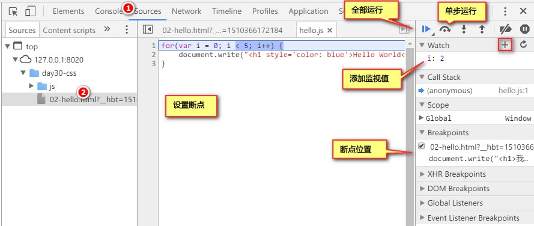

如果有语法错误，进行浏览器开发模式中会出现提示

### 16.2. EventLoop

#### 16.2.1. JavaScript 是单线程的语言

JavaScript 是一门单线程执行的编程语言。也就是说，同一时间只能做一件事情。

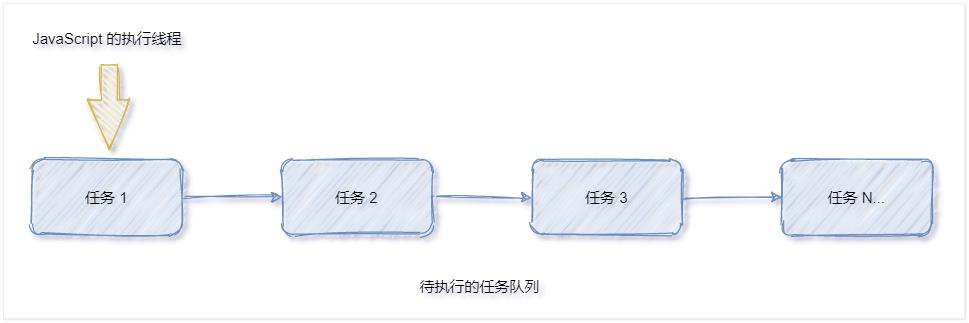

> 单线程执行任务队列的问题：如果前一个任务非常耗时，则后续的任务就不得不一直等待，从而导致程序假死的问题。

#### 16.2.2. 同步任务和异步任务

JavaScript 把待执行的任务分为了两类：

1. 同步任务（synchronous）
    - 又称为**非耗时任务**，指的是在主线程上排队执行的那些任务
    - 只有前一个任务执行完毕，才能执行后一个任务
2. 异步任务（asynchronous）
    - 又称为**耗时任务**，异步任务由 JavaScript 委托给宿主环境进行执行
    - 当异步任务执行完成后，会通知 JavaScript 主线程执行异步任务的回调函数

#### 16.2.3. EventLoop 的基本概念

**同步任务和异步任务的执行过程**

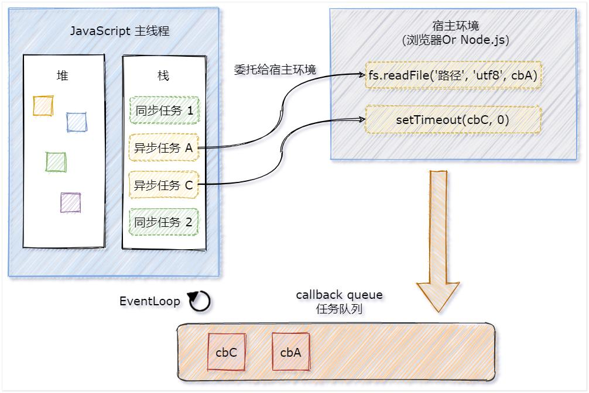

1. 同步任务由 JavaScript 主线程次序执行
2. 异步任务委托给宿主环境执行
3. 已完成的异步任务对应的回调函数，会被加入到任务队列中等待执行
4. JavaScript **主线程的执行栈被清空后，会读取任务队列中的回调函数，次序执行**
5. JavaScript **主线程不断重复上面的第 4 步**

<font color=red>**JavaScript 主线程从“任务队列”中读取异步任务的回调函数，放到执行栈中依次执行。这个过程是循环不断的，所以整个的这种运行机制又称为 EventLoop（事件循环）。**</font>

#### 16.2.4. 结合 EventLoop 分析输出的顺序案例（面试题）

```js
import { getResult } from '../utils/util.js'

console.log('A')

// 模拟请求获取数据
getResult(3).then(res => console.log('B'))

setTimeout(() => console.log('C'), 0)

console.log('D')
```

上面示例最终的输出结果是：ADCB

- A 和 D 属于同步任务。会根据代码的先后顺序依次被执行
- C 和 B 属于异步任务。它们的回调函数会被加入到任务队列中，等待主线程空闲时再执行

### 16.3. 宏任务和微任务

#### 16.3.1. 什么是宏任务和微任务

JavaScript 把异步任务又做了进一步的划分，异步任务又分为两类，分别是：

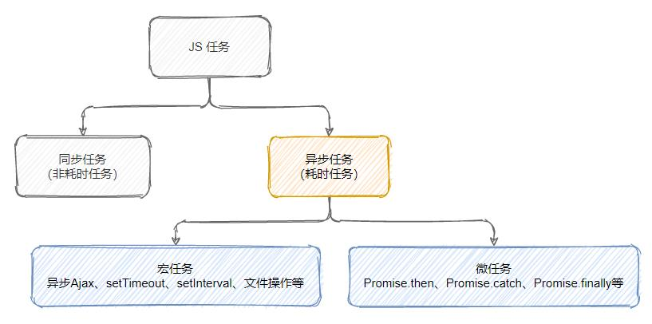

1. 宏任务（macrotask）：异步 Ajax 请求、`setTimeout`、`setInterval`、文件操作等
2. 微任务（microtask）：`Promise.then`、`Promise.catch`、`Promise.finally`、`process.nextTick` 等

#### 16.3.2. 宏任务和微任务的执行顺序

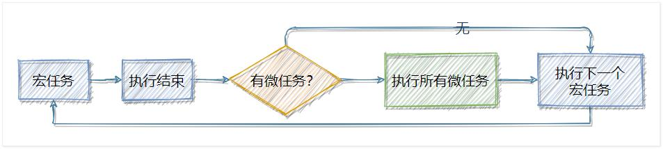

每一个宏任务执行完之后，都会**检查是否存在待执行的微任务**。如果有，则执行完所有微任务之后，再继续执行下一个宏任务。

#### 16.3.3. 宏任务和微任务执行顺序分析案例（面试题）

##### 16.3.3.1. 案例1

```js
setTimeout(() => console.log('1'))

new Promise(resolve => {
  console.log('2')
  resolve()
}).then(res => console.log('3'))

console.log('4')
```

最终结果输出是：2431

1. 先执行所有的同步任务输出：2、4
2. 再执行微任务输出：3
3. 再执行下一个宏任务输出：1

##### 16.3.3.2. 案例2

```js
console.log('1')

setTimeout(() => {
  console.log('2')
  new Promise(resolve => {
    console.log('3')
    resolve()
  }).then(() => console.log('4'))
})

new Promise(resolve => {
  console.log('5')
  resolve()
}).then(() => console.log('6'))

setTimeout(() => {
  console.log('7')
  new Promise(resolve => {
    console.log('8')
    resolve()
  }).then(() => console.log('9'))
})
```

最终结果输出是：156234789

1. 先执行所有的同步任务输出：1、5
2. 再执行第1个宏任务中的同步任务输出：2、3
3. 再执行第1个宏任务的微任务输出：4
4. 再执行第2个宏任务中的同步任务输出：7、8
5. 再执行第2个宏任务的微任务输出：9

### 16.4. WebSocket

#### 16.4.1. 概念

WebSocket 是一种在独立的、创建在 TCP 连接上进行全双工通信的协议。Websocket 通过 HTTP/1.1 协议的 101 状态码进行握手。

WebSocket 使得客户端和服务器之间的数据交换变得更加简单，允许服务端主动向客户端推送数据。在 WebSocket API 中，浏览器和服务器只需要完成一次握手，两者之间就直接可以创建持久性的连接，并进行双向数据传输。

> WebSocket 通信协议于 2011 年被 IETF 定为标准 RFC 6455，并由 RFC7936 补充规范。WebSocket API 也被 W3C 定为标准。

#### 16.4.2. API 方法（待整理）

> TODO: 待参考 MDN 网站整理

#### 16.4.3. 基础示例

WebSockets 它可以在用户的浏览器和服务器之间打开交互式通信会话。使用此API，可以向服务器发送消息并接收事件驱动的响应，而无需通过轮询服务器的方式以获得响应。 WebSocket 对象提供了用于创建和管理 WebSocket 连接，以及可以通过该连接发送和接收数据的API。

```js
// 创建WebSocket连接.
const socket = new WebSocket('ws://localhost:8080');
 
// 连接成功触发
socket.addEventListener('open', function (event) {
    socket.send('Hello Server!');
});
 
// 监听消息
socket.addEventListener('message', function (event) {
    console.log('Message from server ', event.data);
});
```

### 16.5. API 接口案例

#### 16.5.1. 案例需求

基于 MySQL 数据库 + Express 对外提供用户列表的 API 接口服务。用到的技术点如下：

- 第三方包 express 和 mysql2
- ES6 模块化
- Promise
- async/await

#### 16.5.2. 搭建项目的基本结构

1. 启用 ES6 模块化支持，在 package.json 中声明 `"type": "module"`
2. 安装第三方依赖包。`npm install express@4.17.1 mysql2@2.2.5 -S`

#### 16.5.3. 创建基本的服务器

在项目的根目录下创建 app.js 入口文件，创建基础的服务器

```js
import express from 'express'

const app = express()

app.listen(80, () => {
  console.log('server running at http://127.0.0.1')
})
```

运行以下命令测试是否能开启服务

```bash
nodemon app.js
```

如 nodemon 没有安装，先运行全局安装命令

```bash
npm install -g nodemon
```

卸载则运行

```bash
npm uninstall -g nodemon
```

#### 16.5.4. 创建 db 数据库操作模块

创建`db/index.js`，配置数据库的连接信息

```js
import mysql from 'mysql2'

const pool = mysql.createPool({
  host: '127.0.0.1',
  port: 3306,
  database: 'tempdb',
  user: 'root',
  password: '123456',
})

export default pool.promise()
```

#### 16.5.5. 创建请求的处理方法

```js
import db from '../db/index.js'

// 使用 ES6 的按需导出语法，将 getAllUser 方法导出
export async function getAllUser(req, res) {
  try {
    // db.query() 函数的返回值是 Promise 实例对象。所以可以使用 async/await 进行异步处理简化
    const [rows] = await db.query('select id, name, gender from user')
    res.send({
      status: 0,
      message: '获取用户列表数据成功！',
      data: rows,
    })
  } catch (err) {
    res.send({
      status: 1,
      message: '获取用户列表数据失败！',
      desc: err.message,
    })
  }
}
```

#### 16.5.6. 配置路由

```js
import express from 'express'
import { getAllUser } from '../controller/UserController.js'

// 创建路由对象
const router = new express.Router()

// 挂载路由规则
router.get('/user', getAllUser)

// 使用 ES6 默认导出语法，将路由对象导出
export default router
```

#### 16.5.7. 导入并挂载路由模块

在 app.js 文件中导入并挂载路由模块

```js
import express from 'express'
// 默认导入路由对象
import userRouter from './router/user_router.js'

const app = express()

// 挂载用户路由模块
app.use('/api', userRouter)

app.listen(80, () => {
  console.log('server running at http://127.0.0.1')
})
```

#### 16.5.8. 测试

使用postman等请求工具，请求`http://127.0.0.1/api/user`，获取返回数据

### 16.6. console 对象使用

#### 16.6.1. 常用方法

1. `console.log()`

```js
// 用于输出普通信息，最常用
console.log("%c%s", "color:red;font-size:20px", "结果是：这样的哟");
```

2. `console.info()`

```js
// 用于输出提示性信息
console.info("%s", "color:red;这是结果哟");
```

3. `console.error()`

```js
// 用于输出错误信息
console.error("错误");
```

4. `console.warn()`：用于输出警示信息
5. `console.count()`：统计代码被执行的次数
6. `console.assert()`：对输入的表达式进行断言，只有表达式为false时，才输出相应的信息到控制台
7. `console.group()`：输出一组信息的开头
8. `console.groupEnd()`：结束一组输出信息
9. `console.dir()`：直接将该DOM结点以DOM树的结构进行输出，可以详细查对象的方法发展等等
10. `console.time()`：计时开始
11. `console.timeEnd()`：计时结束
12. `console.profile()` 和 `console.profileEnd()`：一起使用来查看CPU使用相关信息
13. `console.timeLine()` 和 `console.timeLineEnd()`：一起使用记录一段时间轴
14. `console.trace()`：堆栈跟踪相关的调试

#### 16.6.2. 格式化符号

|   格式化符号   |            实现的功能            |
| :----------: | ------------------------------ |
|     `%s`     | 格式化成字符串输出                |
| `%d` or `%i` | 格式化成数值输出                  |
|     `%f`     | 格式化成浮点数输出                |
|     `%o`     | 转化成展开的DOM元素输出            |
|     `%O`     | 转化成JavaScript对象输出          |
|     `%c`     | 把字符串按照你提供的样式格式化后输入 |

## 17. AJAX

### 17.1. AJAX 概述

AJAX 全称 Asynchronous Javascript And XML （异步 JavaScript 和 XML），可以使网页实现<font color=red>**异步更新**</font>，就是不重新加载整个网页的情况下，对网页的某部分进行更新（<font color=red>**局部刷新**</font>）。传统的网页（不使用AJAX）如果需要更新内容，必须重载整个网页页面。

AJAX = 异步 JavaScript 和 XML，是一种新的思想，整合之前的多种技术，用于创建快速交互式网页应用的网页开发技术。

#### 17.1.1. 同步与异步的区别

- **同步**：客户端发送请求到服务端，当服务端返回响应之前，客户端都处于等待卡死状态。
- **异步**：客户端发送请求到服务端，无论服务端是否返回响应，客户端都可以在该页面中随意做其他事情，不会被卡死，提高了用户的体验。

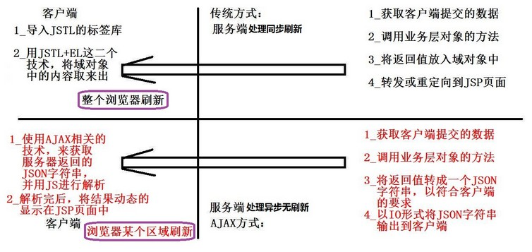

#### 17.1.2. 优缺点

**优点**

1. 页面无刷新，用户的体验非常好。
2. 使用异步方式与服务器通信，具有更加迅速的响应能力。
3. 将以前一些服务器负担的工作转嫁到客户端，利用客户端闲置的能力来处理，减轻服务器和带宽的负担。ajax 的原则是“按需取数据”，可以最大程度的减少冗余请求和响应对服务器造成的负担。
4. 基于标准化的并被广泛支持的技术，不需要下载插件或者小程序。

**缺点**

1. ajax 不支持浏览器 back 按钮。
2. 存在安全问题，AJAX 暴露了与服务器交互的细节。
3. 对搜索引擎的支持比较弱
4. 破坏了程序的异常机制
5. 调试困难

### 17.2. AJAX 原理分析

1. 使用 JavaScript 获得浏览器内置的 AJAX 引擎（`XMLHttpRequest` 异步调用对象）
    1. 通过 AJAX 引擎确定请求路径和请求参数
    2. 通知 AJAX 引擎发送请求

```js
var xmlhttp = new XMLHttpRequest();
```

2. AJAX 引擎会在不刷新浏览器地址栏的情况下，发送 HTTP 请求
    1. 服务器获得请求参数
    2. 服务器处理请求参数（添加、查询等操作）
    3. 服务器响应数据给浏览器
3. AJAX 引擎获得服务器响应的数据，通过执行 JavaScript 的回调函数将数据传递给浏览器页面。
    1. 通过设置给 AJAX 引擎的回调函数获得服务器响应的数据
    2. 使用 JavaScript 在指定的位置，显示响应数据，从而局部修改页面的数据，达到局部刷新目的。 

### 17.3. JavaScript 中 AJAX 的使用

#### 17.3.1. 原生态 JS 操作 ajax 步骤

1. 获得 ajax 引擎。
2. 设置回调函数。作用当前 AJAX 请求服务器过程中不同状态变化的时候都会调用此函数
3. 确定请求路径
4. 发送请求。JavaScript ajax 处理 GET 和 POST 请求会有细微差异

#### 17.3.2. ajax 引擎连接状态变化过程

ajax 引擎连接状态 readyState 值有 0~4 变化过程。存有 XMLHttpRequest 的状态。从 0 到 4 发生变化。

- 0: 请求未初始化
- 1: 服务器连接已建立
- 2: 请求已接收
- 3: 请求处理中
- 4: 请求已完成，且响应已就绪

这里状态值 4 只能说明接收到了服务器的响应服务器处理 ajax 请求结束，但是不能代表正确的获取了服务器的响应，需要配合 http 状态码 200 两个条件就可以说明正确的获取了服务器响应。只有这两个条件满足，xmlhttp.responseText 才可以获取到正确的响应数据。

```js
xmlHttp.onreadystatechange = function(){
	if(xmlHttp.readyState == 4 && xmlHttp.status == 200){
		// 获取服务器的响应内容
		var text = xmlHttp.responseText;
	}
}
```

#### 17.3.3. XMLHttpRequest 对象浏览器兼容

大多数浏览器都支持以下方式得到 `XMLHttpRequest`

```js
var xmlHttp = new XMLHttpRequest();
```

IE6.0：

```js
var xmlHttp = new ActiveXObject("Msxml2.XMLHTTP");
```

IE5.5 以及更早版本的IE：

```js
var xmlHttp = new ActiveXObject("Microsoft.XMLHTTP");
```

示例：

```js
function getXMLhttp(){
	var xmlhttp=null;
	// 谷歌、火狐、IE7+最新浏览器
	if (window.XMLHttpRequest){
		xmlhttp=new XMLHttpRequest();
	}else if (window.ActiveXObject){
		//IE 老版本浏览器（IE5、6 等）
		xmlhttp=new ActiveXObject("Microsoft.XMLHTTP");
	}
} 
```

#### 17.3.4. JS 原生 AJAX 现实示例

```html
<script type="text/javascript">
	//异步提交请求
	function sendGet(){
		//1.获取ajax引擎对象
		var xmlHttp = new XMLHttpRequest();
		//2.设置回调函数,作用ajax请求服务器过程中不同状态变化的时候都会调用这个函数
		xmlHttp.onreadystatechange = function(){
		//获取服务器响应数据并处理显示
		//xmlHttp.readyState,ajax引擎对象请求服务器过程中不同的状态值
		//xmlHttp.readyState，0~4
		//	0: 请求未初始化 
		//	1: 服务器连接已建立 
		//	2: 请求已接收 
		//	3: 请求处理中 
		//	4: 请求已完成，且响应已就绪 
		//获取服务器响应的数据进行处理并显示
			if(xmlHttp.readyState==4){
				//200,http状态码，浏览器与服务器通信正常
				if(xmlHttp.status==200){
					//通信正常，并且接收到服务器的正常响应数据
					//获取服务器响应数据
					var content = xmlHttp.responseText;//服务器响应的文本字符串
					alert(content);
				}
			}
		};
		//3.设置请求方法与提交服务器地址
		//xmlHttp.open(method, url);
		//method,设置请求方法（get或post）
		//url，设置服务器地址
		xmlHttp.open("get", "${pageContext.request.contextPath}/hello?name=admin&pwd=123456");
		//4.ajax引擎对象发送异步请求
		xmlHttp.send();
	}
	
	//发送异步的post请求
	function sendPost(){
		//1.获取ajax引擎
		var xmlHttp = new XMLHttpRequest();
		//2.设置回调函数
		xmlHttp.onreadystatechange = function(){
			//获取服务器响应的数据进行处理并显示
			if(xmlHttp.readyState==4){
				//200,http状态码，浏览器与服务器通信正常
				if(xmlHttp.status==200){
					//通信正常，并且接收到服务器的正常响应数据
					//获取服务器响应数据
					var content = xmlHttp.responseText;//服务器响应的文本字符串
					alert(content);
				}
			}
		};
		//3.设置请求方法与路径
		xmlHttp.open("post", "${pageContext.request.contextPath}/hello");
		//4.设置请求头信息(如果像表单那样post提交数据必须要设置请求头信息，如果不提交参数数据就不用设置)
		xmlHttp.setRequestHeader("content-type","application/x-www-form-urlencoded");
		//5.发送
		xmlHttp.send("name=admin&pwd=123456");
	}
</script>
<body>
	<input type="button" value="js异步提交get请求" onclick="sendGet();"><br/><br/>
	<input type="button" value="js异步提交post请求" onclick="sendPost();"><br/><br/>
</body>
```

## 18. ES2020 新特性

### 18.1. 可选链操作符

可选链操作符(`?.`)允许读取位于连接对象链深处的属性的值，而不必明确验证链中的每个引用是否有效。`?.`操作符的功能类似于`.`链式操作符，不同之处在于，在引用为空(`nullish`) (`null`或者`undefined`) 的情况下不会引起错误，该表达式短路返回值是`undefined`。与函数调用一起使用时，如果给定的函数不存在，则返回`undefined`。

当尝试访问可能不存在的对象属性时，可选链操作符将会使表达式更短、更简明。

```js
const adventurer = {
  name: "Alice",
  cat: {
    name: "Dinah",
  },
};

const dogName = adventurer.dog?.name;
console.log(dogName);
// expected output: undefined

const catName = adventurer.cat?.name;
console.log(catName);
// expected output: Dinah

console.log(adventurer.someNonExistentMethod?.());
// expected output: undefined
```

**语法**：

```js
obj?.prop
obj?.[expr]
arr?.[index]
func?.(args)
```

参考：https://developer.mozilla.org/zh-CN/docs/Web/JavaScript/Reference/Operators/Optional_chaining
