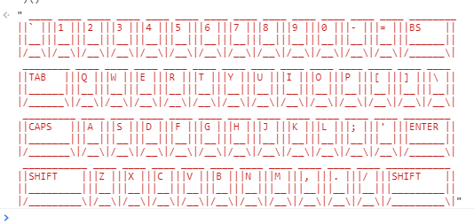
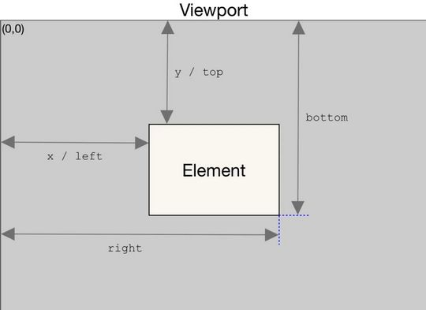

## 1. 原生 JS 工具函数

### 1.1. 判断 JS 各种数据类型是否为空

```js
/**
 * 判断是否为空
 */
export function validatenull(val) {
    if (val == null || val === undefined || val === 'undefined' || val === 'null' || val === '') {
        return true
    }
    if (typeof val === 'boolean') {
        return false
    }
    if (typeof val === 'number') {
        return false
    }
    if (val instanceof Array) {
        if (val.length === 0) return true
    } else if (val instanceof Object) {
        if (JSON.stringify(val) === '{}' || Object.keys(val).length === 0) return true
    }
    return false
}
```

### 1.2. 对象深拷贝

```js
/**
 * 对象深拷贝
 */
export const deepClone = data => {
    var type = getObjType(data);
    var obj;
    if (type === 'array') {
        obj = [];
    } else if (type === 'object') {
        obj = {};
    } else {
        //不再具有下一层次
        return data;
    }
    if (type === 'array') {
        for (var i = 0, len = data.length; i < len; i++) {
            obj.push(deepClone(data[i]));
        }
    } else if (type === 'object') {
        for (var key in data) {
            obj[key] = deepClone(data[key]);
        }
    }
    return obj;
};
```

### 1.3. 数组转成字符串（自己写，不严谨，有bug）

```js
/**
 * 字符串数组或对象数组转换成字符串（不严谨，有bug）
 * @param {Array} array 字符串数组或对象数组
 * @param {String} separator 分隔符号
 * @param {String} property 需要转换的属性值（对象数组才需要）
 */
export function array2string(array, separator, property) {
  var str = '';

  // 判断传入的数组是否为空（调用validatenull的验空工具函数）
  if (validatenull(array)) {
    return str;
  }

  // 判断传入数据是否合法
  if (separator && typeof (separator) !== 'string') {
    return str;
  }
  if (property && typeof (property) !== 'string') {
    return str;
  }

  // 如果没有传入分隔符，使用默认“, ”
  if (validatenull(separator)) {
    separator = ", ";
  }

  // 判断数组元素的类型（不严谨）
  if (property) {
    // 传入属性值，判断是Object数组
    var tempArray = new Array();

    // 循环对象数组
    for (let i = 0; i < array.length; i++) {
      const obj = array[i];

      for (var p in obj) {
        // 将指定的属性添加到数组中
        if (p === property) {
          tempArray.push(obj[p]);
        }
      }
    }

    str = tempArray.join(separator);
  } else {
    // 无传入属性值，判断是字符串数组
    str = array.join(separator);
  }

  return str;
}
```

### 1.4. 格式化日期

#### 1.4.1. 网上案例

```js
/**
 * 按指定格式转换日期
 * @param {String} time
 * @param {String} format
 */
export function formatDate(time, format = 'YY-MM-DD hh:mm:ss') {
  var date = new Date(time)
  var year = date.getFullYear()
  var month = date.getMonth() + 1 // 月份+1处理
  var day = date.getDate()
  var hour = date.getHours()
  var min = date.getMinutes()
  var sec = date.getSeconds()
  // 初始化长度为10的数组，格式为 00 01 02 03
  var preArr = Array.apply(null, Array(10)).map(function(elem, index) {
    return '0' + index
  })
  var newTime = format.replace(/YY/g, year)
    .replace(/MM/g, preArr[month] || month)
    .replace(/DD/g, preArr[day] || day)
    .replace(/hh/g, preArr[hour] || hour)
    .replace(/mm/g, preArr[min] || min)
    .replace(/ss/g, preArr[sec] || sec)
  return newTime
}
```

使用示例：

```js
// 使用格式
formatDate(new Date().getTime()); // 2022-05-12 10:05:44
formatDate(new Date().getTime(), 'YY年MM月DD日'); // 2022年05月12日
formatDate(new Date().getTime(), '今天是YY/MM/DD hh:mm:ss'); // 今天是2022/05/12 10:07:45
```

注意：js 中 `new Date("2022-07-01 08:00:00")` 格式在 IE 内核浏览器中显示 `NaN` 的不兼容的问题，因为 IE 内核的浏览器只识别 `/` 的日期分隔符。可以将造成 `new Date("2022-07-01 08:10:00").replace(/-/g,"/");`，这样确保了任何一个浏览器都没有问题

#### 1.4.2. 开源项目vue-Element-Admin的工具方法

```js
/**
 * 格式化日期，本开源项目自带工具
 * @param {String} time
 * @param {String} cFormat
 */
export function parseTime(time, cFormat) {
  if (arguments.length === 0) {
    return null
  }
  const format = cFormat || '{y}-{m}-{d} {h}:{i}:{s}'
  let date
  if (typeof time === 'object') {
    date = time
  } else {
    if ((typeof time === 'string') && (/^[0-9]+$/.test(time))) {
      time = parseInt(time)
    }
    if ((typeof time === 'number') && (time.toString().length === 10)) {
      time = time * 1000
    }
    date = new Date(time)
  }
  const formatObj = {
    y: date.getFullYear(),
    m: date.getMonth() + 1,
    d: date.getDate(),
    h: date.getHours(),
    i: date.getMinutes(),
    s: date.getSeconds(),
    a: date.getDay()
  }
  const time_str = format.replace(/{(y|m|d|h|i|s|a)+}/g, (result, key) => {
    let value = formatObj[key]
    // Note: getDay() returns 0 on Sunday
    if (key === 'a') { return ['日', '一', '二', '三', '四', '五', '六'][value ] }
    if (result.length > 0 && value < 10) {
      value = '0' + value
    }
    return value || 0
  })
  return time_str
}

export function formatTime(time, option) {
  time = +time * 1000
  const d = new Date(time)
  const now = Date.now()

  const diff = (now - d) / 1000

  if (diff < 30) {
    return '刚刚'
  } else if (diff < 3600) {
    // less 1 hour
    return Math.ceil(diff / 60) + '分钟前'
  } else if (diff < 3600 * 24) {
    return Math.ceil(diff / 3600) + '小时前'
  } else if (diff < 3600 * 24 * 2) {
    return '1天前'
  }
  if (option) {
    return parseTime(time, option)
  } else {
    return (
      d.getMonth() +
      1 +
      '月' +
      d.getDate() +
      '日' +
      d.getHours() +
      '时' +
      d.getMinutes() +
      '分'
    )
  }
}
```

### 1.5. 字符串数组转对象数组(网上资料暂存，好像有问题)

```js
/**
 * 字符串数组转对象数组
 */
export const strCovArray = function () {
  let list = [];
  for (let i = 0; i < arguments.length; i++) {
    const str = arguments[i];
    if (!!str) {
      list.push(str);
    }
  }
  return list;
}
```

### 1.6. 生成指定位数的随机数

```js
/**
 * 生成随机len位数字
 */
export const randomLenNum = (len, date) => {
    let random = '';
    random = Math.ceil(Math.random() * 100000000000000).toString().substr(0, len ? len : 4);
    if (date) random = random + Date.now();
    return random;
}
```

### 1.7. 验证两个对象的属性值是否相等
#### 1.7.1. 方式1：浅对比

```js
/**
 * 验证俩个对象的属性值是否相等
 */
export const validObj = (olds, news) => {
	var flag = true;
	for (var obj in news) {
		if (news[obj] != olds[obj]) {
			flag = false;
			break;
		}
	}
	return flag;
}
```

#### 1.7.2. 方式2：深度对比

```js
function deepCompare(x, y) {
  var i, l, leftChain, rightChain;

  function compare2Objects(x, y) {
    var p;

    // remember that NaN === NaN returns false
    // and isNaN(undefined) returns true
    if (isNaN(x) && isNaN(y) && typeof x === 'number' && typeof y === 'number') {
      return true;
    }

    // Compare primitives and functions.
    // Check if both arguments link to the same object.
    // Especially useful on the step where we compare prototypes
    if (x === y) {
      return true;
    }

    // Works in case when functions are created in constructor.
    // Comparing dates is a common scenario. Another built-ins?
    // We can even handle functions passed across iframes
    if ((typeof x === 'function' && typeof y === 'function') ||
      (x instanceof Date && y instanceof Date) ||
      (x instanceof RegExp && y instanceof RegExp) ||
      (x instanceof String && y instanceof String) ||
      (x instanceof Number && y instanceof Number)) {
      return x.toString() === y.toString();
    }

    // At last checking prototypes as good as we can
    if (!(x instanceof Object && y instanceof Object)) {
      return false;
    }

    if (x.isPrototypeOf(y) || y.isPrototypeOf(x)) {
      return false;
    }

    if (x.constructor !== y.constructor) {
      return false;
    }

    if (x.prototype !== y.prototype) {
      return false;
    }

    // Check for infinitive linking loops
    if (leftChain.indexOf(x) > -1 || rightChain.indexOf(y) > -1) {
      return false;
    }

    // Quick checking of one object being a subset of another.
    // todo: cache the structure of arguments[0] for performance
    for (p in y) {
      if (y.hasOwnProperty(p) !== x.hasOwnProperty(p)) {
        return false;
      } else if (typeof y[p] !== typeof x[p]) {
        return false;
      }
    }

    for (p in x) {
      if (y.hasOwnProperty(p) !== x.hasOwnProperty(p)) {
        return false;
      } else if (typeof y[p] !== typeof x[p]) {
        return false;
      }

      switch (typeof (x[p])) {
        case 'object':
        case 'function':

          leftChain.push(x);
          rightChain.push(y);

          if (!compare2Objects(x[p], y[p])) {
            return false;
          }

          leftChain.pop();
          rightChain.pop();
          break;

        default:
          if (x[p] !== y[p]) {
            return false;
          }
          break;
      }
    }

    return true;
  }

  if (arguments.length < 1) {
    return true; //Die silently? Don't know how to handle such case, please help...
    // throw "Need two or more arguments to compare";
  }

  for (i = 1, l = arguments.length; i < l; i++) {

    leftChain = []; //Todo: this can be cached
    rightChain = [];

    if (!compare2Objects(arguments[0], arguments[i])) {
      return false;
    }
  }

  return true;
}
```

### 1.8. 删除数组指定元素

```js
//删除数组制定元素
export const removeByValue = (arr, val) => {
	for (var i = 0; i < arr.length; i++) {
		if (arr[i] == val) {
			arr.splice(i, 1);
			return arr;
			break;
		}
	}
}
```

### 1.9. JSON格式化

```js
/**
 * JSON格式化
 */
export const formatJson = function (json, options) {
	var reg = null,
		formatted = '',
		pad = 0,
		PADDING = '    ';
	options = options || {};
	options.newlineAfterColonIfBeforeBraceOrBracket = (options.newlineAfterColonIfBeforeBraceOrBracket === true) ? true : false;
	options.spaceAfterColon = (options.spaceAfterColon === false) ? false : true;
	if (typeof json !== 'string') {
		json = JSON.stringify(json);
	} else {
		try {
			json = JSON.parse(json);
		} catch (e) {
			new Error('不是JSON对象');
		}

		json = JSON.stringify(json);
	}
	reg = /([\{\}])/g;
	json = json.replace(reg, '\r\n$1\r\n');
	reg = /([\[\]])/g;
	json = json.replace(reg, '\r\n$1\r\n');
	reg = /(\,)/g;
	json = json.replace(reg, '$1\r\n');
	reg = /(\r\n\r\n)/g;
	json = json.replace(reg, '\r\n');
	reg = /\r\n\,/g;
	json = json.replace(reg, ',');
	if (!options.newlineAfterColonIfBeforeBraceOrBracket) {
		reg = /\:\r\n\{/g;
		json = json.replace(reg, ':{');
		reg = /\:\r\n\[/g;
		json = json.replace(reg, ':[');
	}
	if (options.spaceAfterColon) {
		reg = /\:/g;
		json = json.replace(reg, ':');
	}
	(json.split('\r\n')).forEach(function (node, index) {
		var i = 0,
			indent = 0,
			padding = '';

		if (node.match(/\{$/) || node.match(/\[$/)) {
			indent = 1;
		} else if (node.match(/\}/) || node.match(/\]/)) {
			if (pad !== 0) {
				pad -= 1;
			}
		} else {
			indent = 0;
		}

		for (i = 0; i < pad; i++) {
			padding += PADDING;
		}

		formatted += padding + node + '\r\n';
		pad += indent;
	});
	return formatted;
}
```

### 1.10. 根据身份证计算年龄、性别

```js
/**
 * 根据身份证计算年龄，性别
 * @param {String} UUserCard 身份证字符串
 * @param {Number} num (1.获取出生日期，2.获取性别，3.获取年龄)
 */
export const IdCard = function (UUserCard, num) {
  if (UUserCard.length == 18) {
    if (num == 1) {
      //获取出生日期
      let birth = ''
      birth = UUserCard.substring(6, 10) + "-" + UUserCard.substring(10, 12) + "-" + UUserCard.substring(12, 14);
      return birth;
    }
    if (num == 2) {
      //获取性别
      if (parseInt(UUserCard.substr(16, 1)) % 2 == 1) {
        //男
        return "1";
      } else {
        //女
        return "2";
      }
    }
    if (num == 3) {
      //获取年龄
      var myDate = new Date();
      var month = myDate.getMonth() + 1;
      var day = myDate.getDate();
      var age = myDate.getFullYear() - UUserCard.substring(6, 10) - 1;
      if (UUserCard.substring(10, 12) < month || UUserCard.substring(10, 12) == month && UUserCard.substring(12, 14) <= day) {
        age++;
      }
      return age;
    }
  }
  return '';
}
```

### 1.11. Object的属性设置为空，但是属性存在

```js
/**
 * Object的属性致空，但是属性存在
 */
export const setObjectnull = function (obj) {
  for (var o in obj) {
    obj[o] = "";
  }
  return obj;
}
```

### 1.12. 将Object的属性为null的转为空字符串''

```js
/**
 * Object的属性为null的至为空字符串
 */
export const setObjectstr = function (obj) {
  for (var o in obj) {
    if (obj[o] == null || obj[o] == 'null') {
      obj[o] = "";
    }
  }
  return obj;
}
```

### 1.13. 生成随机UID

```js
/**
 * 生成随机UID
 */
export function genUid() {
  const genUid_soup_ = '!#$%()*+,-./:;=?@[]^_`{|}~ABCDEFGHIJKLMNOPQRSTUVWXYZabcdefghijklmnopqrstuvwxyz0123456789'
  const length = 20
  const soupLength = genUid_soup_.length
  const id = []

  for (let i = 0; i < length; i++) {
    id[i] = genUid_soup_.charAt(Math.random() * soupLength)
  }

  return id.join('')
}
```

### 1.14. 判断数据的类型

```js
/**
 * 判断数据的类型
 * @param {*} data
 */
export function judgeType(data) {
  return Object.prototype.toString.call(data).replace(/^\[object (.+)\]$/, '$1').toLowerCase()
}
```

### 1.15. 常用验证函数（手机、邮箱、身份证、整数、小数等）

```js
export function isvalidUsername(str) {
  const valid_map = ['admin', 'editor']
  return valid_map.indexOf(str.trim()) >= 0
}

/* 合法uri*/
export function validateURL(textval) {
  const urlregex = /^(https?|ftp):\/\/([a-zA-Z0-9.-]+(:[a-zA-Z0-9.&%$-]+)*@)*((25[0-5]|2[0-4][0-9]|1[0-9]{2}|[1-9][0-9]?)(\.(25[0-5]|2[0-4][0-9]|1[0-9]{2}|[1-9]?[0-9])){3}|([a-zA-Z0-9-]+\.)*[a-zA-Z0-9-]+\.(com|edu|gov|int|mil|net|org|biz|arpa|info|name|pro|aero|coop|museum|[a-zA-Z]{2}))(:[0-9]+)*(\/($|[a-zA-Z0-9.,?'\\+&%$#=~_-]+))*$/
  return urlregex.test(textval)
}

/* 小写字母*/
export function validateLowerCase(str) {
  const reg = /^[a-z]+$/
  return reg.test(str)
}

/* 大写字母*/
export function validateUpperCase(str) {
  const reg = /^[A-Z]+$/
  return reg.test(str)
}

/* 大小写字母*/
export function validatAlphabets(str) {
  const reg = /^[A-Za-z]+$/
  return reg.test(str)
}
/*验证pad还是pc*/
export const vaildatePc = function () {
  const userAgentInfo = navigator.userAgent;
  const Agents = ["Android", "iPhone",
    "SymbianOS", "Windows Phone",
    "iPad", "iPod"
  ];
  let flag = true;
  for (var v = 0; v < Agents.length; v++) {
    if (userAgentInfo.indexOf(Agents[v]) > 0) {
      flag = false;
      break;
    }
  }
  return flag;
}
/**
 * validate email
 * @param email
 * @returns {boolean}
 */
export function validateEmail(email) {
  const re = /^(([^<>()\[\]\\.,;:\s@"]+(\.[^<>()\[\]\\.,;:\s@"]+)*)|(".+"))@((\[[0-9]{1,3}\.[0-9]{1,3}\.[0-9]{1,3}\.[0-9]{1,3}\])|(([a-zA-Z\-0-9]+\.)+[a-zA-Z]{2,}))$/
  return re.test(email)
}

/**
 * 判断身份证号码
 */
export function cardid(code) {
  let list = [];
  let result = true;
  let msg = '';
  var city = {
    11: "北京",
    12: "天津",
    13: "河北",
    14: "山西",
    15: "内蒙古",
    21: "辽宁",
    22: "吉林",
    23: "黑龙江 ",
    31: "上海",
    32: "江苏",
    33: "浙江",
    34: "安徽",
    35: "福建",
    36: "江西",
    37: "山东",
    41: "河南",
    42: "湖北 ",
    43: "湖南",
    44: "广东",
    45: "广西",
    46: "海南",
    50: "重庆",
    51: "四川",
    52: "贵州",
    53: "云南",
    54: "西藏 ",
    61: "陕西",
    62: "甘肃",
    63: "青海",
    64: "宁夏",
    65: "新疆",
    71: "台湾",
    81: "香港",
    82: "澳门",
    91: "国外 "
  };
  if (!validatenull(code)) {
    if (code.length == 18) {
      if (!code || !/(^\d{18}$)|(^\d{17}(\d|X|x)$)/.test(code)) {
        msg = "证件号码格式错误";
      } else if (!city[code.substr(0, 2)]) {
        msg = "地址编码错误";
      } else {
        //18位身份证需要验证最后一位校验位
        code = code.split('');
        //∑(ai×Wi)(mod 11)
        //加权因子
        var factor = [7, 9, 10, 5, 8, 4, 2, 1, 6, 3, 7, 9, 10, 5, 8, 4, 2];
        //校验位
        var parity = [1, 0, 'X', 9, 8, 7, 6, 5, 4, 3, 2, 'x'];
        var sum = 0;
        var ai = 0;
        var wi = 0;
        for (var i = 0; i < 17; i++) {
          ai = code[i];
          wi = factor[i];
          sum += ai * wi;
        }
        var last = parity[sum % 11];
        if (parity[sum % 11] != code[17]) {
          msg = "证件号码校验位错误";
        } else {
          result = false;
        }

      }
    } else {
      msg = "证件号码长度不为18位";
    }

  } else {
    msg = "证件号码不能为空";
  }
  list.push(result);
  list.push(msg);
  return list;
}
/**
 * 判断手机号码是否正确
 */
export function isvalidatemobile(phone) {
  let list = [];
  let result = true;
  let msg = '';
  var isPhone = /^0\d{2,3}-?\d{7,8}$/;
  //增加134 减少|1349[0-9]{7}，增加181,增加145，增加17[678]  
  var isMob = /^((\+?86)|(\(\+86\)))?(13[0123456789][0-9]{8}|15[012356789][0-9]{8}|18[012356789][0-9]{8}|14[57][0-9]{8}|17[3678][0-9]{8})$/;
  if (!validatenull(phone)) {
    if (phone.length == 11) {
      if (isPhone.test(phone)) {
        msg = '手机号码格式不正确';
      } else {
        result = false;
      }
    } else {
      msg = '手机号码长度不为11位';
    }
  } else {
    msg = '手机号码不能为空';
  }
  list.push(result);
  list.push(msg);
  return list;
}
/**
 * 判断姓名是否正确
 */
export function validatename(name) {
  var regName = /^[\u4e00-\u9fa5]{2,4}$/;
  if (!regName.test(name)) return false;
  return true;
};
/**
 * 判断是否为整数
 */
export function validatenum(num, type) {
  let regName = /[^\d.]/g;
  if (type == 1) {
    if (!regName.test(num)) return false;
  } else if (type == 2) {
    regName = /[^\d]/g;
    if (!regName.test(num)) return false;
  }
  return true;
};
/**
 * 判断是否为小数
 */
export function validatenumord(num, type) {
  let regName = /[^\d.]/g;
  if (type == 1) {
    if (!regName.test(num)) return false;
  } else if (type == 2) {
    regName = /[^\d.]/g;
    if (!regName.test(num)) return false;
  }
  return true;
};
```

### 1.16. 返回一个图形键盘

```js
(_=>[..."`1234567890-=~~QWERTYUIOP[]~ASDFGHJKL;'~~ZXCVBNM,./~"].map(x=>(o+=`/${b='_'.repeat(w=x<y?2:' 667699'[x=["BS","TAB","CAPS","ENTER"][p++]||'SHIFT',p])}|`,m+=y+(x+'    ').slice(0,w)+y+y,n+=y+b+y+y,l+=' __'+b)[73]&&(k.push(l,m,n,o),l='',m=n=o=y),m=n=o=y='|',p=l=k=[])&&k.join`
`)()
```

运行效果：



### 1.17. JS实现浏览器：加入收藏、设为首页、保存到桌面的方法功能

使用js实现在一些网页的“设置为首页”和“ 收藏本站”，以及“保存到桌面”等功能，完美兼容IE,chrome,ff等浏览器。

```html
<!DOCTYPE html>
<html lang="en">
  <head>
    <meta charset="UTF-8" />
    <meta name="viewport" content="width=device-width, initial-scale=1.0" />
    <title>设置为首页、加入收藏、保存到桌面等功能实现测试</title>
    <script type="text/JavaScript">
      //设为首页
      function SetHome(obj, url) {
        try {
          obj.style.behavior = 'url(#default#homepage)';
          obj.setHomePage(url);
        } catch(e) {
          if (window.netscape) {
            try {
              netscape.security.PrivilegeManager.enablePrivilege("UniversalXPConnect");
            } catch(e) {
              alert("抱歉，此操作被浏览器拒绝！\n\n请在浏览器地址栏输入“about:config”并回车然后将[signed.applets.codebase_principal_support]设置为'true'");
            }
          } else {
            alert("抱歉，您所使用的浏览器无法完成此操作。\n\n您需要手动将【"+url+"】设置为首页。");
          }
        }
      }
      //收藏本站
      function AddFavorite(title, url) {
        try {
          window.external.addFavorite(url, title);
        } catch (e) {
          try {
            window.sidebar.addPanel(title, url, "");
          } catch (e) {
            alert("抱歉，您所使用的浏览器无法完成此操作。\n\n加入收藏失败，请使用Ctrl+D进行添加");
          }
        }
      }
      //保存到桌面
      function toDesktop(sUrl,sName){
        try {
          var WshShell = new ActiveXObject("WScript.Shell");
          var oUrlLink = WshShell.CreateShortcut(WshShell.SpecialFolders("Desktop") + "\\" + sName + ".url");
          oUrlLink.TargetPath = sUrl;
          oUrlLink.Save();
        } catch(e) {
          alert("当前IE安全级别不允许操作！");
        }
      }
    </script>
  </head>
  <body>
    <a href="JavaScript:void(0);" onclick="SetHome(this, 'http://www.moon.com');">设为首页</a>
    <hr />
    <a href="JavaScript:void(0);" onclick="AddFavorite('我的网站', location.href)">收藏本站</a>
    <hr />
    <a href="JavaScript:void(0);" onclick=" toDesktop(location.href, '我的网站')">保存到桌面</a>
  </body>
</html>
```

### 1.18. 最快获取dom的方法

HTML中带有 `id` 属性的元素，都会被全局的 ID 同名变量所引用，实际就是保存到`window`对象中

```html
<div id="zero"></div>
```

原本获取 dom 的方式

```js
const el = document.getElementById('zero')
console.log(el) // <div id="zero"></div>
```

可直接通过与id一样的变量获取

```java
console.log(zero) // <div id="zero"></div>
```

### 1.19. 一行代码生成随机生成字符串

主要是用ASCII码来实现。

```js
const str = Math.random().toString(36).substr(2, 10);
console.log(str); // 'w5jetivt7e'
```

以上可获得了一个10位数的随机字符串。先是 `Math.random()` 生成 `[0, 1)` 的数，也就是 0.123312、0.982931之类的，然后调用 `number` 的 `toString`方法将其转换成36进制的，按照MDN的说法，36进制的转换应该是包含了字母 a~z 和数字0~9的，因为这样生成的是`0.89kjna21sa`类似这样的，所以要截取一下小数部分，即从索引 2 开始截取10个字符就是随机字符串了。很多开源库都使用此方式为DOM元素创建随机ID。

## 2. 常见高级知识点

### 2.1. 防抖

定义：在事件被触发n秒后再执行回调，如果在这n秒内又被触发，则重新计时。

```js
function debounce(fn, time) {
    let timer
    return function () {
        clearTimeout(timer)
        let args = arguments
        timer = setTimeout(() => {
            fn.apply(this, args)
        }, time)
    }
}
```

### 2.2. 节流

定义：规定在一个单位时间内，只能触发一次函数。如果这个单位时间内触发多次函数，只有一次生效。

```js
function throttle(fn, time) {
    let timer = null
    return function () {
        if (timer) return
        timer = setTimeout(() => {
            fn.apply(this, arguments)
            timer = null
        }, time)
    }
}
```

### 2.3. 高阶函数

定义：接受和/或返回另外一个函数的函数被称为高阶函数。常见的像数组的 `map`、`reduce`、`filter` 这些都是高阶函数

```js
// 简单的高阶函数
function add(x, y, fn) {
    return fn(x) + fn(y)
}
function fn(num) {
    return Math.abs(num)
}

add(-5, 6, fn) // 11
```

### 2.4. 函数柯里化

定义：函数柯里化指的是将能够接收多个参数的函数转化为接收单一参数的函数，并且返回接收余下参数且返回结果的新函数的技术。

函数柯里化的主要作用和特点就是参数复用、提前返回和延迟执行。

示例：

```js
// 普通的add函数
function add(x, y) {
    return x + y
}
// 柯里化后
function curryingAdd(x) {
    return function (y) {
        return x + y
    }
}

add(1, 2) // 3
curryingAdd(1)(2) // 3
```

实现：

```js
function curry(func) {
    return function curried(...args) {
        if (args.length >= func.length) {
            return func.apply(this, args)
        } else {
            return function (...args2) {
                return curried.apply(this, args.concat(args2))
            }
        }
    }
}

// 用例
function sum(a, b, c) {
    return a + b + c
}
let curriedSum = curry(sum)
console.log(curriedSum(1, 2, 3)) // 6，仍然可以被正常调用
console.log(curriedSum(1)(2, 3)) // 6，对第一个参数的柯里化
console.log(curriedSum(1)(2)(3)) // 6，全柯里化
```

### 2.5. 数组去重

1. Set 去重

```js
const arr = [1, 1, 2, 2, 3, 3, 4, 4, 5, 5]
const res = Array.from(new Set(arr))
console.log(res) // [1,2,3,4,5]
```

2. filter 去重

```js
const removeRepeat = arr => {
    return arr.filter((item, index) => arr.indexOf(item, 0) === index)
}
```

3. includes 去重

```js
const removeRepeat = arr => {
    let repeatArr = []
    for (let i = 0, len = arr.length; i < len; i++) {
        if (!repeatArr.includes(arr[i])) repeatArr.push(arr[i])
    }
    return repeatArr
}
```

### 2.6. 数组扁平化

1. flat方法

```js
const arr = [1, [2, [3, [4, 5]]], 6]
function flatten(arr) {
    return arr.flat(Infinity) // 嵌套深度
}
console.log(flatten(arr)) // [1,2,3,4,5,6]
```

2. toString

```js
function flatten(arr) {
    return arr
        .toString()
        .split(',')
        .map(item => parseFloat(item))
}
console.log(flatten(arr))
```

3. 正则

```js
function flatten(arr) {
    let str = JSON.stringify(arr).replace(/(\[|\])/g, '')
    str = '[' + str + ']'
    arr = JSON.parse(str)
    return arr
}
console.log(flatten(arr))
```

4. 循环递归

```js
function flatten(arr) {
    let result = []
    for (let i = 0; i < arr.length; i++) {
        if (Array.isArray(arr[i])) {
            // 是数组就递归调用上面的扁平化一层的代码
            result = result.concat(flatten(arr[i]))
        } else {
            // 不是数组,直接通过push添加到返回值数组
            result.push(arr[i])
        }
    }
    return result
}
console.log(flatten(arr))
```

### 2.7. 深拷贝

```js
function deepClone(obj) {
    // 原始类型和null直接返回
    if (typeof obj !== 'object' || obj == null) return obj

    let newObj = Array.isArray(obj) ? [] : {}
    // 处理日期对象
    if (obj instanceof Date) {
        newObj = new Date(obj)
    }
    // 处理正则对象
    if (obj instanceof RegExp) {
        newObj = new RegExp(obj)
    }
    for (let key in obj) {
        if (obj.hasOwnProperty(key)) {
            // 如果属性为对象就进行递归
            newObj[key] = typeof obj[key] == 'object' ? deepClone(obj[key]) : obj[key]
        }
    }
    return newObj
}
```

### 2.8. getBoundingCilentRect

`getBoundingCilentRect` 用于获得页面中某个元素的左，上，右和下分别相对浏览器视窗的位置。该函数返回一个对象，该对象有6个属性：top,lef,right,bottom,width,height，如图：



判断某个元素是否滚动到了可视区域内

```js
window.onscroll = function () {
    const box = document.querySelector('.box')
    // 获取浏览器窗口可视化高度
    const clientHeight =
        window.innerHeight || document.documentElement.clientHeight || document.body.clientHeight
    // 获取box元素顶部到浏览器窗口顶部的距离
    const boxTop = box.getBoundingClientRect().top
    // 如果距离小于可视化窗口高度，就说明元素滚动到了可视区内
    if (boxTop <= clientHeight) {
        // 可以控制元素的显示隐藏或者进行其他操作
    }
}
```

### 2.9. IntersectionObserver

Intersection Observer API 提供了一种异步检测目标元素与祖先元素或视口(可统称为根元素)相交情况变化的方法。

如果想知道一个元素有没有进入到可视区域内，第一种方法就是使用 `getBoundingClientRect`，但是需要持续监听页面的 scroll 事件，就会带来不可避免的性能问题，而 Intersection Observer API 的出现就是为了解决这一问题。API 如下：

```js
const observer = new IntersectionObserver(callback[, options]);
```

参数说明：

- `callback`(必填)：当目标元素和根元素的交集超过指定阈值触发回调函数，此函数可接受两个参数：entries 和 observer
- `options`(可选)：用于配置回调函数触发的条件，有三个属性：
    - `root` - 指定根元素，默认为浏览器视口
    - `rootMargin` - 根元素的扩缩边距，控制计算根元素和目标元素的交集的区域范围
    - `threshold` - 阈值，回调函数触发的条件

示例：使用 IntersectionObserver 实现图片的懒加载

```html
// html代码
<body>
  
  
  
  
</body>
```

```js
// js代码
function observe() {
    let images = document.querySelectorAll('img')
    let observer = new IntersectionObserver(
        entries => {
            entries.forEach(item => {
                if (item.isIntersecting) {
                    item.target.src = item.target.dataset.origin
                    observer.unobserve(item.target)
                }
            })
        },
        {
            rootMargin: '0px 0px 300px 0px', // 监视区向下扩展300px
        }
    )
    images.forEach(item => observer.observe(item))
}
observe()
```

### 2.10. 自定义事件

自定义事件，是指在开发的过程中，会监听很多的事件，比如：点击事件(click)、鼠标移动事件(mousemove)等等。这些事件是 js 提供的，但是有时候这些事件并不能满足开发需要，这个时候就可以用自定义事件来解决。自定义事件可以让开发者自主命名事件名，并且可以通过特定的方法进行添加，触发以及删除。

目前实现自定义事件的两种主要方式是 js 的 `Event()` 构造函数和 `CustomEvent()` 构造函数来创建。

1. `Event()` 构造函数，用来创建一个新的事件对象 Event。

```js
// typeArg: string类型，表示创建事件的名称
// eventInit: object类型，可选项，参数包括：bubbles-表示该事件是否冒泡；cancelable-表示该事件能否被取消；composed：指示事件是否会在影子DOM根节点之外触发侦听器。
let myEvent = new Event(typeArg, eventInit)
```

示例：

```js
const btn = document.querySelector('button')
// 创建事件
let myEvent = new Event('myEvent', {
    bubbles: true, // 是否冒泡
})
// 给按钮添加点击事件
btn.addEventListener('click', function () {
    // 触发自定义事件
    dispatchEvent(myEvent)
})
// 给自定义事件添加事件监听器
window.addEventListener('myEvent', function () {
    console.log('触发了自定义事件') // 当调用 dispatchEvent(myEvent) 时就会触发监听
})
```

2. `CustomEvent()` 构造函数，创建一个新的事件对象 CustomEvent。

```js
// typeArg: string类型，表示创建事件的名称
// eventInit: object类型，可选项，参数包括：bubbles-表示该事件是否冒泡；cancelable-表示该事件能否被取消；detail：表示该事件中需要被传递的数据
let myEvent = new CustomEvent(typeArg, eventInit)
```

示例：

```js
const btn = document.querySelector('button')
// 创建事件
let myEvent = new CustomEvent('myEvent', {
    detail: { name: '大前端' }, //
})
// 给按钮添加点击事件
btn.addEventListener('click', function () {
    // 触发自定义事件
    dispatchEvent(myEvent)
})
// 给自定义事件添加事件监听器
window.addEventListener('myEvent', function (e) {
    console.log(`触发了自定义事件，name为${e.detail.name}`) // 当调用 dispatchEvent(myEvent) 时就会触发监听
})
```

**Event 和 CustomEvent 区别**：

- `Event()` 一般用来创建简单的自定义事件
- `CustomEvent()` 支持传递参数的自定义事件，它支持 detail 参数，可以在 detail 中放一些需要传递的参数，并在事件监听函数中获取

## 3. 依赖第三工具包工具函数

### 3.1. clipboard.js(复制文本到剪切板)

依赖clipboard.js复制文字工具包，官网地址：http://www.clipboardjs.cn/

#### 3.1.1. 安装

可以通过npm工具安装

```bash
npm install clipboard --save
```

或者下载js文件，在html页面引入`clipboard.min.js`

```html
<script src="dist/clipboard.min.js"></script>
```

#### 3.1.2. 使用示例(Vue框架)

- 创建切剪板工具函数

```js
/** Clipboard（复制粘贴）工具JS */
import Vue from 'vue'
import Clipboard from 'clipboard'

function clipboardSuccess() {
  Vue.prototype.$message({
    message: 'Copy successfully',
    type: 'success',
    duration: 1500
  })
}

function clipboardError() {
  Vue.prototype.$message({
    message: 'Copy failed',
    type: 'error'
  })
}

export default function handleClipboard(text, event) {
  const clipboard = new Clipboard(event.target, {
    text: () => text
  })
  clipboard.on('success', () => {
    clipboardSuccess()
    clipboard.destroy()
  })
  clipboard.on('error', () => {
    clipboardError()
    clipboard.destroy()
  })
  clipboard.onClick(event)
}
```

- 在页面中导入工具js，调用复制方法即可

```html
<!-- 将字母转大写按钮 -->
<el-button v-if="operationalStatus === 'create'" slot="prepend" @click="changeUpperCase($event)">转大写</el-button>

<script>
import clip from '@/utils/clipboard' // use clipboard directly

export default {
    ......
     methods: {
        /* 将字母转成大写，并复制到剪切板 */
        changeUpperCase(event) {
          const { id } = this.tempObj
          // 转大写
          this.tempObj.id = id.toUpperCase()
          // 复制内容到剪切板
          clip(this.tempObj.id, event)
        },
     }
}
</script>
```
