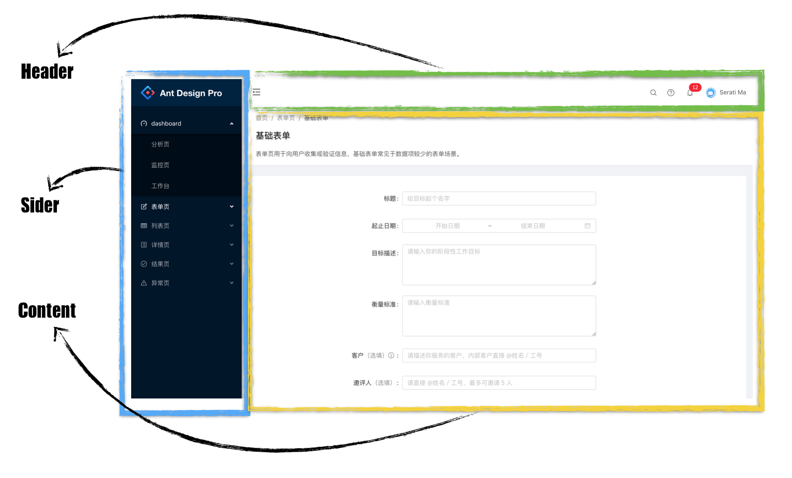

## 1. Ant Design 简介

Ant Design 是阿里蚂蚁金服团队基于 React 开发的 ui 组件，主要用于中后台系统的使用。特性如下：

- 提炼自企业级中后台产品的交互语言和视觉风格。
- 开箱即用的高质量 React 组件。
- 使用 TypeScript 构建，提供完整的类型定义文件。
- 全链路开发和设计工具体系。

> 官网：https://ant.design/index-cn

## 2. 快速入门

### 2.1. 引入Ant Design

Ant Design 是一个服务于企业级产品的设计体系，组件库是它的 React 实现，antd 被发布为一个 npm 包方便开发者安装并使用。

在umi中，你可以通过在插件集umi-plugin-react中配置antd打开antd插件，antd插件会帮你引入antd并实现按需编译。

在config.js文件中进行配置：

```js
export default {
    plugins: [
        ['umi-plugin-react', {
            dva: true, // 开启dva功能
            antd: true // 开启Ant Design功能
        }]
    ]
};
```

### 2.2. 使用 antd 组件

以 tabs 组件为例，官网组件使用示例说明：https://ant.design/components/tabs-cn/

创建 MyTabs.jsx 文件，复制官网组件示例代码，修改后运行查询效果

```jsx
import React from 'react';
import { Tabs } from 'antd';

const TabPane = Tabs.TabPane;

const callback = (key) => {
  console.log(key);
}

class MyTabs extends React.Component {
    render() {
        return(
            <Tabs defaultActiveKey="1" onChange={callback}>
                <TabPane tab="Tab 1" key="1">Content of Tab Pane 1</TabPane>
                <TabPane tab="Tab 2" key="2">Content of Tab Pane 2</TabPane>
                <TabPane tab="Tab 3" key="3">Content of Tab Pane 3</TabPane>
            </Tabs>
        )
    }
}

export default MyTabs;
```

### 2.3. 布局

antd布局官网示例：https://ant.design/components/layout-cn/

在后台系统页面布局中，一般是经典的三部分布局



#### 2.3.1. 组件概述

- `Layout` ：布局容器，其下可嵌套 `Header` `Sider` `Content` `Footer` 或 `Layout` 本身，可以放在任何父容器中。
- `Header` ：顶部布局，自带默认样式，其下可嵌套任何元素，只能放在Layout中。
- `Sider` ：侧边栏，自带默认样式及基本功能，其下可嵌套任何元素，只能放在Layout中。
- `Content` ：内容部分，自带默认样式，其下可嵌套任何元素，只能放在Layout中。
- `Footer` ：底部布局，自带默认样式，其下可嵌套任何元素，只能放在Layout中

#### 2.3.2. 搭建整体框架

1. 在src目录下创建layouts目录，并且在layouts目录下创建index.jsx文件，根据官网示例，修改相应的代码：

```jsx
import React from 'react'
import { Layout } from 'antd';

const { Header, Footer, Sider, Content } = Layout;

class BasicLayout extends React.Component {
    render() {
        return (
            <Layout>
                <Sider>Sider</Sider>
                <Layout>
                    <Header>Header</Header>
                    <Content>Content</Content>
                    <Footer>Footer</Footer>
                </Layout>
            </Layout>
        );
    }
}

export default BasicLayout;
```

> 需要特别说明的是，在umi中约定的目录结构中，layouts/index.js文件将被作为全局的布局文件

2. 配置路由：修改config.js文件（非必须）

```js
export default {
    plugins: [
        ['umi-plugin-react', {
            dva: true, // 开启dva功能
            antd: true // 开启Ant Design功能
        }]
    ],
    routes: [{
        path: '/',
        component: '../layouts' // 配置布局路由
    }]
};
```

3. 输入url：http://localhost:8000/，进行测试

#### 2.3.3. 子页面使用布局

1. 需要在布局文件中，将Content内容替换成{this.props.children}，意思是引入传递的内容。

```jax
import React from 'react'
import { Layout } from 'antd';

const { Header, Footer, Sider, Content } = Layout;

class BasicLayout extends React.Component {
    render() {
        return (
            <Layout>
                <Sider>Sider</Sider>
                <Layout>
                    <Header>Header</Header>
                    <Content>{this.props.children}</Content>
                    <Footer>Footer</Footer>
                </Layout>
            </Layout>
        );
    }
}

export default BasicLayout;
```

2. 配置路由（注意，在布局路由下面进行配置）：

```js
export default {
    plugins: [
        ['umi-plugin-react', {
            dva: true, // 开启dva功能
            antd: true // 开启Ant Design功能
        }]
    ],
    routes: [{
        path: '/',
        component: '../layouts', // 配置布局路由
        routes: [{ // 在这里进行配置子页面
            path: '/myTabs',
            component: './MyTabs'
        }]
    }]
};
```

> **说明：上面的路由配置，是表明你需要通过手动配置的方式上进行访问页面，而不采用umi默认的路由方式。**

3. 输入`http://localhost:8000/myTabs`进行访问测试。

#### 2.3.4. 美化页面

```jsx
import React from 'react'
import { Layout } from 'antd';

const { Header, Footer, Sider, Content } = Layout;

class BasicLayout extends React.Component {
    render() {
        return (
            <Layout>
                <Sider width={256} style={{ minHeight: '100vh', color: 'white' }}>
                    Sider
                </Sider>
                <Layout>
                    <Header style={{ background: '#fff', textAlign: 'center', padding: 0 }}>Header</Header>
                    <Content style={{ margin: '24px 16px 0' }}>
                        <div style={{ padding: 24, background: '#fff', minHeight: 360 }}>
                            {this.props.children}
                        </div>
                    </Content>
                    <Footer style={{ textAlign: 'center' }}>后台系统 ©2019Created by MooNkirA</Footer>
                </Layout>
            </Layout>
        );
    }
}

export default BasicLayout;
```

#### 2.3.5. 引入导航条

使用Menu组件作为导航条，官网示例：https://ant.design/components/menu-cn/

```jsx
import React from 'react'
import { Layout, Menu, Icon, } from 'antd';

const { Header, Footer, Sider, Content } = Layout;
const SubMenu = Menu.SubMenu;

class BasicLayout extends React.Component {

    constructor(props) {
        super(props);
        this.state = {
            collapsed: false,
        }
    }

    render() {
        return (
            <Layout>
                <Sider width={256} style={{ minHeight: '100vh', color: 'white' }}>
                    <div style={{ height: '32px', background: 'rgba(255,255,255,.2)', margin: '16px' }} />
                    <Menu
                        defaultSelectedKeys={['2']}
                        defaultOpenKeys={['sub1']}
                        mode="inline"
                        theme="dark"
                        inlineCollapsed={this.state.collapsed}
                    >
                        <Menu.Item key="1">
                            <Icon type="pie-chart" />
                            <span>Option 1</span>
                        </Menu.Item>
                        <Menu.Item key="2">
                            <Icon type="desktop" />
                            <span>Option 2</span>
                        </Menu.Item>
                        <Menu.Item key="3">
                            <Icon type="inbox" />
                            <span>Option 3</span>
                        </Menu.Item>
                        <SubMenu key="sub1" title={<span><Icon type="mail" /><span>Navigation One</span></span>}>
                            <Menu.Item key="5">Option 5</Menu.Item>
                            <Menu.Item key="6">Option 6</Menu.Item>
                            <Menu.Item key="7">Option 7</Menu.Item>
                            <Menu.Item key="8">Option 8</Menu.Item>
                        </SubMenu>
                        <SubMenu key="sub2" title={<span><Icon type="appstore" /><span>Navigation Two</span></span>}>
                            <Menu.Item key="9">Option 9</Menu.Item>
                            <Menu.Item key="10">Option 10</Menu.Item>
                            <SubMenu key="sub3" title="Submenu">
                                <Menu.Item key="11">Option 11</Menu.Item>
                                <Menu.Item key="12">Option 12</Menu.Item>
                            </SubMenu>
                        </SubMenu>
                    </Menu>
                </Sider>
                <Layout>
                    <Header style={{ background: '#fff', textAlign: 'center', padding: 0 }}>Header</Header>
                    <Content style={{ margin: '24px 16px 0' }}>
                        <div style={{ padding: 24, background: '#fff', minHeight: 360 }}>
                            {this.props.children}
                        </div>
                    </Content>
                    <Footer style={{ textAlign: 'center' }}>后台系统 ©2019Created by MooNkirA</Footer>
                </Layout>
            </Layout>
        );
    }
}

export default BasicLayout;
```

#### 2.3.6. 为导航添加链接

对左侧的导航条添加链接，点击相应的链接在右侧进行相应页面的显示。

1. 在src/pages目录下创建user目录，并在该目录下创建UserAdd.jsx和UserList.jsx文件，用于模拟实现新增用户和查询用户列表功能。

```jsx
/* UserAdd.jsx */
import React from 'react'
class UserAdd extends React.Component {
    render() {
        return (
            <div>新增用户</div>
        );
    }
}
export default UserAdd;
```

```jsx
/* UserList.jsx */
import React from 'react'
class UserList extends React.Component {
    render() {
        return (
            <div>用户列表</div>
        );
    }
}
export default UserList;
```

2. 修改config.js，配置路由(如果使用umi默认的路由规则，则不需要配置，默认的路由是以pages文件夹为根目录)

```js
export default {
    plugins: [
        ['umi-plugin-react', {
            dva: true, // 开启dva功能
            antd: true // 开启Ant Design功能
        }]
    ],
    routes: [{
        path: '/',
        component: '../layouts', // 配置布局路由
        routes: [
            { // 在这里进行配置子页面
                path: '/myTabs',
                component: './MyTabs'
            },
            {
                path: '/user',
                routes: [
                    {
                        path: '/user/list',
                        component: './user/UserList'
                    },
                    {
                        path: '/user/add',
                        component: './user/UserAdd'
                    }
                ]
            }
        ]
    }]
};
```

3. 为菜单添加链接

```jsx
import React from 'react'
import { Layout, Menu, Icon, } from 'antd';
import Link from 'umi/link';    // 引入umi框架的链接标签

const { Header, Footer, Sider, Content } = Layout;
const SubMenu = Menu.SubMenu;

class BasicLayout extends React.Component {

    constructor(props) {
        super(props);
        this.state = {
            collapsed: false,
        }
    }

    render() {
        return (
            <Layout>
                <Sider width={256} style={{ minHeight: '100vh', color: 'white' }}>
                    <div style={{ height: '32px', background: 'rgba(255,255,255,.2)', margin: '16px' }} />
                    <Menu
                        defaultSelectedKeys={['1']} // 默认选择的菜单
                        defaultOpenKeys={['sub1']}  // 默认展开的二级菜单
                        mode="inline"
                        theme="dark"
                        inlineCollapsed={this.state.collapsed}
                    >
                        <SubMenu key="sub1" title={<span><Icon type="user" /><span>用户管理</span></span>}>
                            <Menu.Item key="1">
                                <Link to="/user/list">用户列表</Link> // umi框架默认路由url是pages文件夹开始
                            </Menu.Item>
                            <Menu.Item key="2">
                                <Link to="/user/add">新增用户</Link>
                            </Menu.Item>
                        </SubMenu>
                    </Menu>
                </Sider>
                <Layout>
                    <Header style={{ background: '#fff', textAlign: 'center', padding: 0 }}>Header</Header>
                    <Content style={{ margin: '24px 16px 0' }}>
                        <div style={{ padding: 24, background: '#fff', minHeight: 360 }}>
                            {this.props.children}
                        </div>
                    </Content>
                    <Footer style={{ textAlign: 'center' }}>后台系统 ©2019Created by MooNkirA</Footer>
                </Layout>
            </Layout>
        );
    }
}

export default BasicLayout;
```

### 2.4. 表格

#### 2.4.1. 基本用法

- 参考官方文档进行实现：https://ant.design/components/table-cn/
- 改造 UserList.jsx页面：

```jsx
import React from 'react'
import { Table, Divider, Tag, Pagination } from 'antd';
const { Column } = Table;
const data = [{
    key: '1',
    name: '张三',
    age: 32,
    address: '上海市',
    tags: ['程序员', '帅气'],
}, {
    key: '2',
    name: '李四',
    age: 42,
    address: '北京市',
    tags: ['屌丝'],
}, {
    key: '3',
    name: '王五',
    age: 32,
    address: '杭州市',
    tags: ['高富帅', '富二代'],
}];
class UserList extends React.Component {
    render() {
        return (
            <div>
                <Table dataSource={data} pagination=
                    {{ position: "bottom", total: 500, pageSize: 10, defaultCurrent: 3 }}>
                    <Column
                        title="姓名"
                        dataIndex="name"
                        key="name"
                    />
                    <Column
                        title="年龄"
                        dataIndex="age"
                        key="age"
                    />
                    <Column
                        title="地址"
                        dataIndex="address"
                        key="address"
                    />
                    <Column
                        title="标签"
                        dataIndex="tags"
                        key="tags"
                        render={tags => (
                            <span>
                                {tags.map(tag => <Tag color="blue" key=
                                    {tag}>{tag}</Tag>)}
                            </span>
                        )}
                    />
                    <Column
                        title="操作"
                        key="action"
                        render={(text, record) => (
                            <span>
                                <a href="javascript:;">编辑</a>
                                <Divider type="vertical" />
                                <a href="javascript:;">删除</a>
                            </span>
                        )}
                    />
                </Table>
            </div>
        );
    }
}
export default UserList;
```

#### 2.4.2. 将数据分离到 model 中

- model的实现：在models文件夹下创建UserListData.js

```js
import request from "../util/request";
export default {
    namespace: 'userList',
    state: {
        list: []
    },
    effects: {
        *initData(params, sagaEffects) {
            const { call, put } = sagaEffects;
            const url = "/ds/user/list";
            let data = yield call(request, url);
            yield put({
                type: "queryList",
                data: data
            });
        }
    },
    reducers: {
        queryList(state, result) {
            let data = [...result.data];
            return { //更新状态值
                list: data
            }
        }
    }
}
```

- 修改UserList.jsx中的逻辑：

```jsx
import React from 'react';
import { connect } from 'dva';
import { Table, Divider, Tag, Pagination } from 'antd';
const { Column } = Table;

const namespace = 'userList';

@connect((state) => {
    return {
        data: state[namespace].list
    }
}, (dispatch) => {
    return {
        initData: () => {
            dispatch({
                type: namespace + "/initData"
            });
        }
    }
})
class UserList extends React.Component {

    /* 加载后执行初始化数据 */
    componentDidMount() {
        this.props.initData();
    }

    render() {
        return (
            <div>
                <Table dataSource={this.props.data} pagination=
                    {{ position: "bottom", total: 500, pageSize: 10, defaultCurrent: 3 }}>
                    <Column
                        title="姓名"
                        dataIndex="name"
                        key="name"
                    />
                    <Column
                        title="年龄"
                        dataIndex="age"
                        key="age"
                    />
                    <Column
                        title="地址"
                        dataIndex="address"
                        key="address"
                    />
                    <Column
                        title="标签"
                        dataIndex="tags"
                        key="tags"
                        render={tags => (
                            <span>
                                {tags.map(tag => <Tag color="blue" key=
                                    {tag}>{tag}</Tag>)}
                            </span>
                        )}
                    />
                    <Column
                        title="操作"
                        key="action"
                        render={(text, record) => (
                            <span>
                                <a href="javascript:;">编辑</a>
                                <Divider type="vertical" />
                                <a href="javascript:;">删除</a>
                            </span>
                        )}
                    />
                </Table>
            </div>
        );
    }
}
export default UserList;
```

- mock数据：修改MockListData.js文件，增加用户列表的模拟数据

```js
export default {
    'get /ds/list': function (req, res) { // 模拟请求返回数据
        res.json({
            data: [1, 2, 3, 4],
            maxNum: 4
        });
    },
    'get /ds/user/list': function (req, res) { // 模拟请求返回数据
        res.json({
            key: '1',
            name: '张三',
            age: 32,
            address: '上海市',
            tags: ['程序员', '帅气']
        }, {
            key: '2',
            name: '李四',
            age: 42,
            address: '北京市',
            tags: ['屌丝']
        }, {
            key: '3',
            name: '王五',
            age: 32,
            address: '杭州市',
            tags: ['高富帅', '富二代']
        });
    }
}
```
