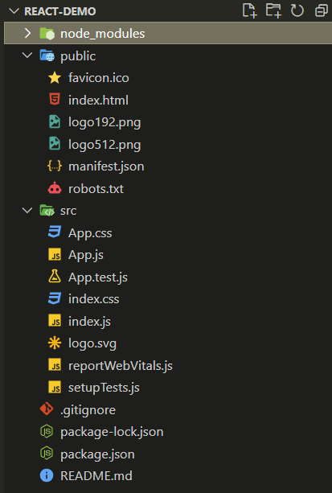
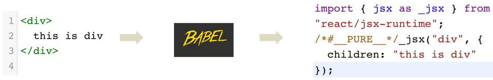

## 1. 前端开发的演变

到目前为止，前端的开发经历了四个阶段，目前处于第四个阶段。这四个阶段分别是：

### 1.1. 阶段一：静态页面阶段

在第一个阶段中前端页面都是静态的，所有前端代码和前端数据都是后端生成的。前端只是纯粹的展示功能，js脚本的作用只是增加一些特殊效果，比如那时很流行用脚本控制页面上飞来飞去的广告。

那时的网站开发，采用的是后端 MVC 模式。

- Model （模型层）：提供/保存数据
- Controller （控制层）：数据处理，实现业务逻辑
- View （视图层）：展示数据，提供用户界面

前端只是后端 MVC 的 V。

### 1.2. 阶段二：ajax 阶段

2004年，AJAX 技术诞生，改变了前端开发。Gmail 和 Google 地图这样革命性的产品出现，使得开发者发现，前端的作用不仅仅是展示页面，还可以管理数据并与用户互动。

就是从这个阶段开始，前端脚本开始变得复杂，不再仅仅是一些玩具性的功能。

### 1.3. 阶段三：前端 MVC 阶段

2010年，第一个前端 MVC 框架 Backbone.js 诞生。它基本上是把 MVC 模式搬到了前端，但是只有 M（读写数据）和 V（展示数据），没有 C（处理数据）。

有些框架提出了 MVVM模式，用 View Model 代替 Controller。Model 拿到数据以后，View Model 将数据处理成视图层（View）需要的格式，在视图层展示出来。

### 1.4. 阶段四：SPA 阶段

前端可以做到读写数据、切换视图、用户交互，这意味着，网页其实是一个应用程序，而不是信息的纯展示。这种单张网页的应用程序称为 SPA（single-page-application）。

2010年后，前端工程师从开发页面（切模板），逐渐变成了开发“前端应用”（跑在浏览器里面的应用程序）。

目前，最流行的前端框架 Vue、Angular、React 等等，都属于 SPA 开发框架。

## 2. ReactJS 简介

> - React.js 英文官网： https://react.dev
> - React.js 中文官网： https://zh-hans.react.dev

ReactJS，就是一个用于构建 Web 和原生用户交互界面的 JavaScript 框架，是 Facebook（现改名为 Meta） 开发的一款的 JS 框架。ReactJS 把复杂的页面，拆分成一个个的组件，将这些组件一个个的拼装起来，就会呈现多样的页面。ReactJS 可以用于 MVC 架构，也可以用于 MVVM 架构，或者别的架构。

ReactJS 圈内的一些框架简介：

- Flux
    - Flux 是 Facebook 用户建立客户端 Web 应用的前端架构，它通过利用一个单向的数据流补充了 React 的组合视图组件，这更是一种模式而非框架。
- Redux
    - Redux 是 JavaScript 状态容器，提供可预测化的状态管理。Redux 可以让 React 组件状态共享变得简单。
- Ant Design of React
    - 阿里开源的基于 React 的企业级后台产品，其中集成了多种框架，包含了上面提到的 Flux、Redux。
    - Ant Design 提供了丰富的组件，包括：按钮、表单、表格、布局、分页、树组件、日历等。

## 3. React 环境搭建

> 更多 React 项目创建方式详见官网 https://zh-hans.react.dev/learn/start-a-new-react-project

### 3.1. 导包方式

React 可以直接下载使用，可以在[官网仓库](http://facebook.github.io/react/)下载最新版。也可以直接使用 React CDN 库，地址如下：

```html
<script src="https://unpkg.com/react@17/umd/react.production.min.js"></script>
<script src="https://unpkg.com/react-dom@17/umd/react-dom.production.min.js"></script>
<script src="https://unpkg.com/babel-standalone@6/babel.min.js"></script>
```

**使用实例**：

```html
<!DOCTYPE html>
<html>
  <head>
    <meta charset="UTF-8" />
    <title>Hello React!</title>
    <script src="https://unpkg.com/react@17/umd/react.production.min.js"></script>
    <script src="https://unpkg.com/react-dom@17/umd/react-dom.production.min.js"></script>
    <script src="https://unpkg.com/babel-standalone@6/babel.min.js"></script>
  </head>
  <body>
    <div id="example"></div>
    <script type="text/babel">
      ReactDOM.render(
        <h1>测试测试！</h1>,
        document.getElementById('example')
      );
    </script>
  </body>
</html>
```

实例引入了三个库：​react.production.min.js​ 、​react-dom.production.min.js​ 和 ​babel.min.js，其作用分别如下：

- react.production.min.js：React 的核心库
- react-dom.production.min.js：提供与 DOM 相关的功能
- babel.min.js：Babel 可以将 ES6 代码转为 ES5 代码，这样就能在目前不支持 ES6 的浏览器上执行 React 代码。

Babel 内嵌了对 JSX 的支持。通过将 Babel 和 babel-sublime 包（package）一同使用可以让源码的语法渲染上升到一个全新的水平。

### 3.2. 使用 npm + webpack 搭建 React

> Tips: 此方式搭建过程相对比较复杂，建议使用一些主流的脚手架来快速创建 React 项目。

#### 3.2.1. 安装全局包

```bash
$ npm install babel -g
$ npm install webpack -g
$ npm install webpack-dev-server -g
```

#### 3.2.2. 创建根目录

创建一个根目录，例如目录名为 reactApp，再使用 `npm init` 初始化，生成 package.json 文件：

```bash
$ mkdir reactApp
$ cd reactApp/
$ npm init
name: (reactApp) react-test
version: (1.0.0) 
description: react 测试
entry point: (index.js) 
test command: 
git repository: 
keywords: 
author: 
license: (ISC) 
About to write to /Users/laolan/www/reactApp/package.json:

{
  "name": "react-test",
  "version": "1.0.0",
  "description": "react 测试",
  "main": "index.js",
  "scripts": {
    "test": "echo \"Error: no test specified\" && exit 1"
  },
  "author": "",
  "license": "ISC"
}

Is this ok? (yes)
```

#### 3.2.3. 添加依赖包及插件

要使用 React 就需要先安装，`--save` 命令用于将包添加至 package.json 文件。

```bash
$ npm install react --save
$ npm install react-dom --save
```

同时也要安装一些 babel 插件

```bash
$ npm install babel-core
$ npm install babel-loader
$ npm install babel-preset-react
$ npm install babel-preset-es2015
```

#### 3.2.4. 创建文件

创建一些必要项目文件。linux 系统下使用 `touch` 命令创建新文件：

```bash
$ touch index.html
$ touch App.jsx
$ touch main.js
$ touch webpack.config.js
```

在 Windows 系统中可以使用 ni 命令创建新文件：

```bash
ni index.html
ni App.jsx
ni main.js
ni webpack.config.js
```

#### 3.2.5. 设置编译器，服务器，载入器

打开 webpack.config.js 文件添加以下代码：

```js
var config = {
    entry: './main.js',
    output: {
        path:'./',
        filename: 'index.js',
    },
    devServer: {
        inline: true,
        port: 7777
    },
    module: {
        loaders: [ {
            test: /\.jsx?$/,
            exclude: /node_modules/,
            loader: 'babel',
            query: {
                presets: ['es2015', 'react']
            }
        }]
    }
}

module.exports = config;
```

配置参数解释：

- `entry`: 指定打包的入口文件 main.js。
- `output`：配置打包结果，`path` 定义了输出的文件夹，`filename` 则定义了打包结果文件的名称。
- `devServer`：设置服务器端口号为 7777。（端口号可以自由设定）
- `module`：定义了对模块的处理逻辑，这里可以用 loaders 定义了一系列的加载器，以及一些正则。当需要加载的文件匹配 test 的正则时，就会调用后面的 loader 对文件进行处理，这正是 webpack 强大的原因。

打开 package.json 文件，找到 `​"scripts"` ​中的​ `"test" "echo \"Error: no test specified\" && exit 1"`​ 使用以下代码替换：

```json
"start": "webpack-dev-server --hot"
```

替换后的 package.json 文件内容如下：

```json
{
    "name": "youj-react-test",
    "version": "1.0.0",
    "description": "W3Cschool教程 react 测试",
    "main": "index.js",
    "scripts": {
        "start": "webpack-dev-server --hot"
    },
    "author": "",
    "license": "ISC",
    "dependencies": {
        "react": "^17.0.2",
        "react-dom": "^17.0.2"
    }
}
```

至此，可以使用​ `npm start` ​命令来启动服务。`​--hot` ​命令会在文件变化后重新载入，这样就不需要在代码修改后重新刷新浏览器就能看到变化。

#### 3.2.6. 修改页面文件

打开 index.html，设置 `​<div id = "app">`​ 为应用的根元素，并引入 index.js 脚本文件。

```html
<!DOCTYPE html>
<html>
    <head>
        <meta charset = "UTF-8">
        <title>React App</title>
    </head>
    <body>
        <div id = "app"></div>
        <script src = "index.js"></script>
    </body>
</html>
```

修改 App.jsx 创建第一个 React 组件

```jsx
import React from 'react';

class App extends React.Component {
    render() {
        return (
            <div>Hello World!!!</div>
        );
    }
}

export default App;
```

修改 main.js 文件，引入组件并将其渲染到根元素 App 上，这样就可以在浏览器上显示。

```js
import React from 'react';
import ReactDOM from 'react-dom';

import App from './App.jsx';

ReactDOM.render(<App />, document.getElementById('app'))
```

> Tips: 如果想要组件可以在任何的应用中使用，需要在创建后使用 `export` 将其导出，在使用组件的文件使用 `import` 将其导入。

#### 3.2.7. 运行服务

完成以上配置后，执行命令运行服务。

```bash
$ npm start
```

浏览器访问查看效果 http://localhost:7777/

### 3.3. create-react-app 脚手架

create-react-app 是一个快速创建 React 开发环境的工具，底层由 Webpack 构件，封装了配置细节，开箱即用。执行以下命令：

```bash
npx create-react-app 项目名称
```

命令解释：

1. `npx`：Node.js工具命令，查找并执行后续的包命令
2. `create-react-app`：核心包（固定写法），用于创建 React 项目
3. `项目名称`：创建的 React 项目名称（可以自定义）

创建后目录结构：



### 3.4. UmiJs 构建工具

#### 3.4.1. 创建项目

本案例使用选择使用 UmiJS 作为构建工具。

1. 创建工程。*（如果使用 vscode，就创建空的文件夹即可）*
2. 在命令行窗口，在工程所在路径上输入命令，进行初始化：

```shell
npm init -y
```


3. 在命令输入如下命令，添加 umi 的依赖

```shell
# 项目中添加 umi 的依赖
npm add umi --dev
```

#### 3.4.2. 编写 HelloWorld 程序

- 第一步，在工程的根目录下创建 config 目录，在 config 目录下创建 config.js 文件。注：在 UmiJS 的约定中，config/config.js 将作为 UmiJS 的全局配置文件。

  

umi 约定的目录结构如下：


在 config.js 文件中输入以下内存，以便后面使用

```js
// 导出一个对象，暂时设置为空对象，后面再填充内容
export default {};
```

- 第二步，创建 HelloWorld.js 页面文件。umi 约定存放页面代码的文件夹是在 `src/pages`，也可以通过`singular:false`来设置单数的命名方式，一般采用默认即可。在 HelloWorld.js 文件中输入如下内容：

```jsx
export default () => {
    return <div> hello world </div>;
}
```

**注：上面的 js 文件是 react 自创的写法，叫 JSX 语法**

- 第三步，启动服务查看页面效果

```shell
# 启动服务
umi dev
```

可以看到，通过 `/HelloWorld` 路径即可访问到刚刚写的 HelloWorld.js 文件。

在 umi 中，可以使用约定式的路由，在 pages下 面的 JS 文件都会按照文件名映射到一个路由，比如上面这个例子，访问 `/helloworld` 会对应到 HelloWorld.js。当然了，也可以自定义路由

#### 3.4.3. 添加 umi-plugin-react 插件

umi-plugin-react 插件是 umi 官方基于 react 封装的插件，包含了 13 个常用的进阶功能。

具体可查看：https://umijs.org/zh/plugin/umi-plugin-react.html

- 在当前工程目录下，输入以下命令添加该插件依赖。成功后会在package.json文件的`dependencies`属性中增加`"umi-plugin-react": "^1.7.4"`

```shell
# 添加插件
npm add umi-plugin-react --dev
```


- 修改config.js文件，引入该插件：

```js
export default {
    plugins: [
        ['umi-plugin-react', {
            //暂时不启用任何功能
        }]
    ]
};
```

#### 3.4.4. 构建和部署

- 通过umi是可以进行转码生成文件的

```shell
# 工程的目录下输入命令
umi build
```

- 运行命令后，会在dish文件夹中生成*index.html和umi.js*文件。umi.js文件是一个已经压缩过的文件，之前写的代码都已经被转码到此文件中。这些文件就是用于部署到生产环境中

### 3.5. 编辑器设置

#### 3.5.1. 推荐的 React 代码编辑器

- VS Code 是如今最流行的编辑器之一。它拥有庞大的扩展市场，同时可以与 GitHub 等流行服务完美集成，具有极高的可配置性！
- WebStorm 是专为 JavaScript 设计的集成开发环境。
- Sublime Text 支持 JSX 和 TypeScript，内置语法高亮和代码自动补全功能。
- Vim 是一个高度可配置的文本编辑器，可以非常高效地创建和更改任何类型的文本。它作为 “vi” 包含在大多数 UNIX 系统和 Apple OS X 中。

#### 3.5.2. 推荐的编辑器插件

> Tips: 有些编辑器内置了以下的功能，但某些编辑器可能需要添加扩展。

##### 3.5.2.1. 代码检查（Linting）

**代码检查（Linting）**可以在编写代码时，发现代码中的问题，以便尽早修复。ESLint 是一款流行且开源的 JavaScript 代码检查工具。

- 使用 React 的推荐配置安装 ESLint 的 [`eslint-config-react-app`](https://www.npmjs.com/package/eslint-config-react-app)（确保你已经安装了 Node）
- 安装 VSCode 中的[官方 ESLint 扩展](https://marketplace.visualstudio.com/items?itemName=dbaeumer.vscode-eslint)

**开发的过程中，确保已经为项目启用了 [`eslint-plugin-react-hooks`](https://www.npmjs.com/package/eslint-plugin-react-hooks) 规则**。这在 React 项目中是必备的，同时能及早的捕获较为严重的 bug。在推荐的 `eslint-config-react-app` 的 preset 中已经集成了该规则。

##### 3.5.2.2. 代码格式化

推荐使用 Prettier，它会根据预设配置的规则重新格式化代码，以保证代码整洁。运行 Prettier 会将所有 tabs 都将转换为空格，同时缩进、引号等也都将根据配置而改变。理想状态下，当你保存文件时，Prettier 会自动执行格式化操作。VSCode 安装 [Prettier 扩展](https://marketplace.visualstudio.com/items?itemName=esbenp.prettier-vscode)，具体步骤如下：

1. 启动 VS Code
2. 使用快速打开（使用快捷键 `Ctrl/Cmd + P`）
3. 粘贴 `ext install esbenp.prettier-vscode`
4. 按回车键

> Notes: 如果 ESLint 预设包含格式化规则，它们可能会与 Prettier 发生冲突。建议使用[`eslint-config-prettier`](https://github.com/prettier/eslint-config-prettier) 禁用 ESLint 预设中的所有格式化规则，这样 ESLint 就只用于捕捉逻辑错误。如果想在合并 PR 前强制执行文件的格式化，则在 CI 中使用 [`prettier --check`](https://prettier.io/docs/en/cli.html#--check) 命令。

##### 3.5.2.3. 保存并自动格式化

以 VS Code 为例，设置每次保存时自动格式化代码：

1. 在 VS Code, 按快捷键 `Ctrl/Cmd + Shift + P`.
2. 在命令栏中输入 “settings”, 按回车键
3. 在搜索栏, 输入 “format on save”, 确保勾选 “format on save” 选项！

## 4. JSX 语法

### 4.1. 概述 

JSX 是 JavaScript 和 XMl(HTML) 的缩写，该语法允许在 JS 代码中编写 HTML 模版结构，它是 React 中构建 UI 的方式。JSX 是 React 自创的一种语法，它会被 Babel 等转码工具进行转码，最终得到正常的 js 代码再执行。JSX 示例：

```jsx
const message = 'this is message'

function App(){
  return (
    <div>
      <h1>this is title</h1>
      {message}
    </div>
  )
}
```

JSX 的优势：

1. HTML 的声明式模版写法。
2. JavaScript 的可编程能力。

#### 4.1.1. JSX 语法注意事项

1. 所有的 html 标签必须是闭合的，如：`<div>HelloWorld</div>` 的写法是正确；`<div>HelloWorld` 的写法是错误的。
2. 在 JSX 语法中，只能有一个根标签，不能有多个。

```jsx
const div1 = <div>hello world</div> // 正确
const div2 = <div>hello</div> <div>world</div> // 错误
```

#### 4.1.2. JSX 的本质

JSX 并不是标准的 JS 语法，它是 JS 的语法扩展，浏览器本身不能识别，需要通过解析工具（如 Babel）做解析之后才能在浏览器中使用。



### 4.2. JSX 基础规则

#### 4.2.1. 只能返回一个根元素

如果想要在一个组件中包含多个元素，需要**用一个父标签把它们包裹起来**。例如：

```html
<div>
  <h1>海蒂·拉玛的待办事项</h1>
  
  <ul>
    ...
  </ul>
</div>
```

如果不想在标签中增加一个额外的 `<div>`，可以用 `<>...</>` 元素来代替。这个空标签被称作 Fragment。React Fragment 允许将子元素分组，而不会在 HTML 结构中添加额外节点。

```html
<>
  <h1>海蒂·拉玛的待办事项</h1>
  
  <ul>
    ...
  </ul>
</>
```

> Tips: JSX 虽然看起来很像 HTML，但在底层其实被转化为了 JavaScript 对象，因此不能在一个函数中返回多个对象，除非用一个数组把它们包装起来。这就是为什么多个 JSX 标签必须要用一个父元素或者 Fragment 来包裹。

#### 4.2.2. 标签必须闭合

JSX 要求标签必须正确闭合。像 `` 这样的自闭合标签必须书写成 ``，而像 `<li>oranges` 这样只有开始标签的元素必须带有闭合标签，需要改为 `<li>oranges</li>`。

#### 4.2.3. 使用驼峰式命名法给大部分属性命名

JSX 最终会被转化为 JavaScript，而 JSX 中的属性也会变成 JavaScript 对象中的键值对。在组件中，经常会遇到需要用变量的方式读取这些属性的时候。但 JavaScript 对变量的命名有限制。例如，变量名称不能包含 `-` 符号或者像 `class` 这样的保留字。

在 React 中，大部分 HTML 和 SVG 属性都用<u>**驼峰式命名法**</u>表示。例如，需要用 `strokeWidth` 代替 `stroke-width`。由于 `class` 是一个保留字，所以在 React 中需要用 `className` 来代替。

```jsx

```

> Notes: 由于历史原因，`aria-*` 和 `data-*` 属性是以带 `-` 符号的 HTML 格式书写的。

### 4.3. JavaScript 表达式

JSX 允许在 JavaScript 中编写类似 HTML 的标签，从而使渲染的逻辑和内容可以写在一起。但如果想要在 html 标签中插入 JavaScript 表达式、逻辑或者引用动态的属性时，可以在 JSX 的大括号（`{}`）内来编写 JavaScript。主要用法包括如下：

- JSX 引号内的值会作为字符串传递
- 在 JSX 的大括号内引用 JavaScript 变量
- 在 JSX 的大括号内调用 JavaScript 函数
- 在 JSX 的大括号内使用 JavaScript 对象

> Notes: if 语句、switch 语句、变量声明不属于表达式，不能直接出现在`{}`中

#### 4.3.1. 使用引号传递字符串 

当想把一个字符串属性传递给 JSX 时，把它放到单引号或双引号中：

```jsx
export default function Avatar() {
  return (
    
  );
}
```

但是如果想要动态地指定 src 或 alt 的值呢？可以用 `{}` 替代 `""`，从而使用 JavaScript 变量 ：

```jsx
export default function Avatar() {
  const avatar = 'https://i.imgur.com/7vQD0fPs.jpg';
  const description = 'Gregorio Y. Zara';
  return (
    
  );
}
```

> Tips: `className="avatar"` 和 `src={avatar}` 之间的区别，`className="avatar"` 指定了一个就叫 `"avatar"` 的 CSS 类名，而 `src={avatar}` 这种写法会去读取 JavaScript 中 `avatar` 这个变量的值。这是因为大括号可以直接在标签中使用 JavaScript！

#### 4.3.2. 使用“双大括号”：JSX 中的 CSS 和 对象 

除了字符串、数字和其它 JavaScript 表达式，还可以在 JSX 中传递对象。由于对象也用大括号表示，例如 `{ name: "MooN", inventions: 5 }`。因此，为了能在 JSX 中传递，必须用另一对额外的大括号包裹对象：`person={{ name: "MooN", inventions: 5 }}`。

React 不要求必须使用内联样式（使用 CSS 类就能满足大部分情况）。当需要内联样式的时候，可以给 `style` 属性传递一个对象：

```jsx
export default function TodoList() {
  return (
    <ul style={{
      backgroundColor: 'black',
      color: 'pink'
    }}>
      <li>Improve the videophone</li>
      <li>Prepare aeronautics lectures</li>
      <li>Work on the alcohol-fuelled engine</li>
    </ul>
  );
}
```

使用 camelCase 语法来设置内联样式，React 会在指定元素数字后自动添加 px。

```jsx
const myStyle = {
    fontSize : 100,
    color : "#FF0000"
};
ReactDOM.render(
    <h1 style = {myStyle}>月の哀傷</h1>,
    document.getElementById('example')
);
```

值得注意的是：<font color=red>**内联 `style` 属性需要使用驼峰命名法编写**</font>。例如，HTML `<ul style="background-color: black">` 在组件里应该写成 `<ul style={{ backgroundColor: 'black' }}>`。

#### 4.3.3. JavaScript 函数调用

大括号内的任何 JavaScript 表达式都能正常运行，包括像 `formatDate()` 这样的函数调用：

```jsx
const today = new Date();

function formatDate(date) {
  return new Intl.DateTimeFormat(
    'zh-CN',
    { weekday: 'long' }
  ).format(date);
}

export default function TodoList() {
  return (
    <h1>To Do List for {formatDate(today)}</h1>
  );
}
```


#### 4.3.4. 大括号使用场景总结

在 JSX 中，只能在以下两种场景中使用大括号：

1. 用作 JSX 标签内的**文本**：`<h1>{name}'s To Do List</h1>` 是有效的，但是 `<{tag}>Gregorio Y. Zara's To Do List</{tag}>` 无效。
2. 用作紧跟在 `=` 符号后的 **属性**：`src={avatar}` 会读取 `avatar` 变量，但是 `src="{avatar}"` 只会传一个字符串 `{avatar}`。

### 4.4. 注释

注释需要写在花括号中

```jsx
ReactDOM.render(
    <div>
        <h1>月の哀傷</h1>
        {/*注释...*/}
    </div>,
    document.getElementById('example')
);
```

### 4.5. 条件渲染

#### 4.5.1. 概述

通常组件会需要根据不同的情况显示不同的内容。在 React 中，可以通过使用 JavaScript 的 if 语句、逻辑与（`&&`）运算符和三元表达式（`? :`）来选择性地渲染 JSX。

#### 4.5.2. if/else 语句 

示例中 Item 组件通过判断 `isPacked` 属性是 true 或 false。在那些满足 `isPacked={true}` 条件的物品旁加上一个勾选符号（✔）。

```jsx
function Item({ name, isPacked }) {
  if (isPacked) {
    return <li className="item">{name} ✔</li>;
  }
  return <li className="item">{name}</li>;
}

export default function PackingList() {
  return (
    <section>
      <h1>Sally Ride 的行李清单</h1>
      <ul>
        <Item isPacked={true} name="宇航服" />
        <Item isPacked={true} name="带金箔的头盔" />
        <Item isPacked={false} name="Tam 的照片" />
      </ul>
    </section>
  );
}
```

#### 4.5.3. 选择性地返回 null

在一些情况下，不想有任何东西进行渲染。此时可以直接返回 null。如下例，如果组件的 `isPacked` 属性为 true，那么它将只返回 null。否则，它将返回相应的 JSX 用来渲染。

```jsx
function Item({ name, isPacked }) {
  if (isPacked) {
    return null;
  }
  return <li className="item">{name}</li>;
}

export default function PackingList() {
  return (
    <section>
      <h1>Sally Ride 的行李清单</h1>
      <ul>
        <Item isPacked={true} name="宇航服" />
        <Item isPacked={true} name="带金箔的头盔" />
        <Item isPacked={false} name="Tam 的照片" />
      </ul>
    </section>
  );
}
```

> Tips: 实际上，在组件里返回 null 并不常见，因为这样会让想使用它的开发者感觉奇怪。通常情况下，可以在父组件里选择是否要渲染该组件。

#### 4.5.4. 三目运算符

当渲染的内容有重复的内容，并且只有两个分支的时候，可以使用 JavaScript 的条件运算符（又称“三目运算符”）这种紧凑型语法来实现条件判断表达式。上例可修改为

```jsx
if (isPacked) {
  return <li className="item">{name} ✔</li>;
}
return <li className="item">{name}</li>;
// 或者
return <li className="item">{isPacked ? name + " ✔" : name}</li>;
```

> Tips: 对于简单的条件判断，以上风格可以很好地实现，但需要适量使用。如果组件里有很多的嵌套式条件表达式，则需要考虑通过提取为子组件来简化这些嵌套表达式。在 React 里，标签也是代码中的一部分，所以可以使用变量和函数来整理一些复杂的表达式。

#### 4.5.5. 与运算符

在 React 组件里，有些情况是，当某个条件成立时，想渲染一些 JSX，或者不做任何渲染。此时可以一种常用的 JavaScript **逻辑与（`&&`）运算符**来实现。如上例可修改为：

```jsx
function Item({ name, isPacked }) {
  return (
    <li className="item">
      {name} {isPacked && "✔"}
    </li>
  );
}

export default function PackingList() {
  return (
    <section>
      <h1>Sally Ride 的行李清单</h1>
      <ul>
        <Item isPacked={true} name="宇航服" />
        <Item isPacked={true} name="带金箔的头盔" />
        <Item isPacked={false} name="Tam 的照片" />
      </ul>
    </section>
  );
}
```

当 JavaScript `&&` 表达式的左侧（即条件）为 true 时，它则返回其右侧的值（即例子的“勾选符号”）。但条件的结果是 false，则整个表达式会变成 false。在 JSX 里，React 会将 false 视为一个“空值”，就像 null 或者 undefined，这样 React 就不会在这里进行任何渲染。

> Notes: 特别注意，<font color=red>**切勿将数字放在 `&&` 左侧**</font>。因为 JavaScript 会自动将左侧的值转换成布尔类型，用于判断条件成立与否。如果左侧是 0，整个表达式将变成左侧的值（0），React 此时则会渲染 0 而不是不进行渲染。

#### 4.5.6. 选择性地将 JSX 赋值给变量 

还有一些条件渲染的处理方式，就是使用 let 变量根据不同条件进行赋值，若要初始时就展示特定的内容，将内容作为默认值赋予给该变量即可。如上例中，结合 if 语句，当 `isPacked` 为 true 时，将 JSX 表达式的值重新赋值给 itemContent：

```jsx
function Item({ name, isPacked }) {
  let itemContent = name;
  if (isPacked) {
    itemContent = name + " ✔";
  }
  return <li className="item">{itemContent}</li>;
}

export default function PackingList() {
  return (
    <section>
      <h1>Sally Ride 的行李清单</h1>
      <ul>
        <Item isPacked={true} name="宇航服" />
        <Item isPacked={true} name="带金箔的头盔" />
        <Item isPacked={false} name="Tam 的照片" />
      </ul>
    </section>
  );
}
```

这种方式不仅适用于文本，任意的 JSX 均适用。所以可以将上面的 Item 组件修改为：

```jsx
function Item({ name, isPacked }) {
  let itemContent = name;
  if (isPacked) {
    itemContent = <del>{name + " ✔"}</del>;
  }
  return <li className="item">{itemContent}</li>;
}
```

### 4.6. 渲染列表

#### 4.6.1. 概述

在 React 中，经常需要通过 JavaScript 的数组方法来操作数组中的数据，从而将一个数据集渲染成多个相似的组件。例如使用 `filter()` 筛选需要渲染的组件和使用 `map()` 把数组转换成组件数组。

#### 4.6.2. 数组的自动展开

JSX 允许在模板中插入数组，数组会自动展开所有成员

```jsx
const arr = [
    <h1>月の哀傷</h1>,
    <h2>Hello MooNkirA！</h2>,
];
ReactDOM.render(
    <div>{arr}</div>,
    document.getElementById('example')
);
```

#### 4.6.3. 使用 map 从数组中渲染数据

以下是一个由数组生成一系列列表项的简单示例：

```jsx
// 1. 把数据存储到数组中。
const people = [
  "凯瑟琳·约翰逊: 数学家",
  "马里奥·莫利纳: 化学家",
  "穆罕默德·阿卜杜勒·萨拉姆: 物理学家",
  "珀西·莱温·朱利亚: 化学家",
  "苏布拉马尼扬·钱德拉塞卡: 天体物理学家",
];

export default function List() {
  // 2. 遍历 people 这个数组中的每一项，并获得一个新的 JSX 节点数组 listItems 
  const listItems = people.map((person) => <li>{person}</li>);
  // 3. 把 listItems 用 <ul> 包裹起来，然后 返回 它
  return <ul>{listItems}</ul>;
}
```

#### 4.6.4. 使用 filter 从数组过滤后渲染数据

如果只需显示数组中部分数据，可以使用 JavaScript 的 `filter()` 方法来返回满足条件的项。此方法让数组的子项经过 “过滤器”（一个返回值为 true 或 false 的函数）的筛选，最终返回一个只包含满足条件的项的新数组。

```jsx
const people = [
  { id: 0, name: "凯瑟琳·约翰逊", profession: "数学家" },
  { id: 1, name: "马里奥·莫利纳", profession: "化学家" },
  { id: 2, name: "穆罕默德·阿卜杜勒·萨拉姆", profession: "物理学家" },
  { id: 3, name: "珀西·莱温·朱利亚", profession: "化学家" },
];

export default function List() {
  // 1. 创建 一个用来存化学家们的新数组 chemists，用 filter() 方法过滤 people 数组来得到所有的化学家，过滤的条件是 person.profession === '化学家'
  const chemists = people.filter((person) => person.profession === "化学家");
  // 2. 用 map 方法遍历 chemists 数组
  const listItems = chemists.map((person) => (
    <li>
      <p>
        <b>{person.name}:</b>
        {" " + person.profession + " "}因{person.accomplishment}而闻名世界
      </p>
    </li>
  ));
  // 3. 返回 listItems
  return <ul>{listItems}</ul>;
}
```

#### 4.6.5. 渲染列表的 key 值 

值得注意的是，以上的示例在渲染后，控制台会出现以下的报错：

```
Warning: Each child in a list should have a unique “key” prop.
```

这是因为 React 必须给数组中的每一项都指定一个 `key`，它可以是字符串或数字的形式，只要能唯一标识出各个数组项即可。这些 key 会告诉 React，每个组件对应着数组里的哪一项，所以 React 可以把它们匹配起来。这在数组项进行移动（例如排序）、插入或删除等操作时非常重要。一个合适的 key 可以帮助 React 推断发生了什么，从而得以正确地更新 DOM 树。

```jsx
<li key={person.id}>...</li>
```

> Tips: 直接放在 `map()` 方法里的 JSX 元素一般都需要指定 key 值！

##### 4.6.5.1. 如何设定 key 值 

不同来源的数据往往对应不同的 `key` 值获取方式：

- **来自数据库的数据**：如果数据是从数据库中获取的，可以直接使用数据表中的主键，因为它们天然具有唯一性。
- **本地产生数据**：如果数据的产生和保存都在本地（例如笔记软件里的笔记），那么可以使用一个自增计数器或者一个类似 `uuid` 的库来生成 key。

##### 4.6.5.2. key 需要满足的条件

- **key 值在兄弟节点之间必须是唯一的**。但不要求全局唯一，在不同的数组中可以使用相同的 key。
- **key 值不能改变**，否则就失去了使用 key 的意义！因此千万不要在渲染时动态地生成 key。

##### 4.6.5.3. key 定义的注意事项

可以把数组项的索引当作 key 值来用，实际上，如果没有显式地指定 key 值，React 确实默认会这么做。但是数组项的顺序在插入、删除或者重新排序等操作中会发生改变，此时把索引顺序用作 key 值会产生一些微妙且令人困惑的 bug。

与之类似，不要在运行过程中动态地产生 key，如 `key={Math.random()}`。这会导致每次重新渲染后的 key 值都不一样，从而使得所有的组件和 DOM 元素每次都要重新创建。这不仅会造成运行变慢的问题，更有可能导致用户输入的丢失。所以，使用能从给定数据中稳定取得的值才是明智的选择。

有一点需要注意，组件不会把 `key` 当作 props 的一部分。Key 的存在只对 React 本身起到提示作用。如果组件需要一个 ID，那么把它作为一个单独的 prop 传给组件：`<Profile key={id} userId={id} />`。

#### 4.6.6. 扩展：为每个列表项显示多个 DOM 节点 

如果想让每个列表项都输出多个 DOM 节点而非一个的话，可以使用 Fragment 语法的简写形式 `<> </>`，但这种方式无法接受 key 值，解决方案有以下两种：

1. 把生成的节点用一个 `<div>` 标签包裹起来
2. 使用更明确的 `<Fragment>` 标签，并且此 `<Fragment>` 标签本身并不会出现在 DOM 上

```jsx
import { Fragment } from "react";

// ...

const listItems = people.map((person) => (
  <Fragment key={person.id}>
    <h1>{person.name}</h1>
    <p>{person.bio}</p>
  </Fragment>
));
```

## 5. React 事件绑定

使用 React 可以在 JSX 中添加**事件处理函数**。即自定义函数，它将在响应交互（如点击、悬停、表单输入框获得焦点等）时触发。

### 5.1. 添加事件处理函数

React 中的事件绑定，通过语法 `on + 事件名称 = { 事件处理函数 }`，将其作为 prop 传入 合适的 JSX 标签。事件名称整体上遵循驼峰命名法。例如：

```jsx
export default function Button() {
  function handleClick() {
    alert("你点击了我！");
  }

  return <button onClick={handleClick}>点我</button>;
}
```

1. 在 `Button` 组件**内部**声明一个名为 `handleClick` 的函数。
2. 实现函数内部的逻辑（示例是使用 `alert` 来显示消息）。
3. 添加 `onClick={handleClick}` 到 `<button>` JSX 中。

### 5.2. 事件绑定注意事项

传递给事件处理函数的函数应是**直接传递，而非调用**。

|         传递一个函数（正确）         |          调用一个函数（错误）          |
| -------------------------------- | ---------------------------------- |
| `<button onClick={handleClick}>` | `<button onClick={handleClick()}>` |

- 左边示例 `handleClick` 函数作为 `onClick` 事件处理函数传递。让 React 绑定它，并且只在用户点击按钮时调用该函数。
- 右边示例 `handleClick()` 中最后的 `()` 符号表示会**在<u>渲染</u>过程中，即使没有任何点击也会<u>立即触发</u>函数**。这是因为在 JSX `{}` 之间的 JavaScript 会立即执行。

当编写内联代码时，同样的陷阱可能会以不同的方式出现：

|            传递一个函数（正确）             |       调用一个函数（错误）            |
| --------------------------------------- | --------------------------------- |
| `<button onClick={() => alert('...')}>` | `<button onClick={alert('...')}>` |

- 右边示例，并不会在点击时触发内联代码，而是会在每次组件渲染时触发。
- 左边示例，在定义内联事件处理函数时，使用了箭头函数包装，表示它是一个稍后调用的函数，而不会在每次渲染时执行其内部代码。

### 5.3. 事件传播

事件处理函数还将捕获任何来自子组件的事件。通常，事件会沿着树向上“冒泡”或“传播”：它从事件发生的地方开始，然后沿着树向上传播。

## 6. 组件（基于类）

### 6.1. 概述

组件是 React 中最重要也是最核心的概念，一个网页，可以被拆分成一个个的组件。在 React 中，这样定义一个组件：

```jsx
import React from 'react'; // 第一步，导入React
class HelloWorld extends React.Component { // 第二步，编写类并且继承 React.Component
    render() { // 第三步，重写render()方法，用于渲染页面
        return <div>hello world!</div> // JSX语法
    }
}
export default HelloWorld; // 第四步，导出该类
```

**注：页面的标签是定义在 render 中的 return，如果是标签是多行，则需要使用 `()` 进行包裹**。

### 6.2. HTML 标签与 React 组件

- React 可以渲染 HTML 标签 (strings) 或 React 组件 (classes)。要渲染 HTML 标签，只需在 JSX 里使用小写字母的标签名。

```jsx
var myDivElement = <div className="foo" />;
ReactDOM.render(myDivElement, document.getElementById('example'));
```

- 要渲染 React 组件，只需创建一个大写字母开头的本地变量。

```jsx
var MyComponent = React.createClass({/*...*/});
var myElement = <MyComponent someProperty={true} />;
ReactDOM.render(myElement, document.getElementById('example'));
```

- React 的 JSX 使用大、小写的约定来区分本地组件的类和 HTML 标签。

> **注意：由于 JSX 就是 JavaScript，一些标识符像 class 和 for 不建议作为 XML 属性名。作为替代，React DOM 使用 className 和 htmlFor 来做对应的属性。**

### 6.3. 导入自定义组件

创建Show.js文件，用于测试导入组件

```jsx
import React from 'react'
import HelloWorld from './HelloWorld' // 导入HelloWorld组件
class Show extends React.Component {
    render() {
        return <HelloWorld />; // 使用HelloWorld组件
    }
}
export default Show;
```

### 6.4. 组件参数

#### 6.4.1. 定义传递参数

组件是可以传递参数的，有2种方式传递，分别是**属性**和**标签包裹的内容**传递

如下例子，引入组件HelloWorld，定义name="zhangsan"就是属性传递，shanghai就是标签包裹的内容传递。

```jsx
import React from 'react'
import HelloWorld from './HelloWorld' // 导入HelloWorld组件
class Show extends React.Component {
    render() {
        return <HelloWorld name="zhangsan">shanghai</HelloWorld>; // 使用HelloWorld组件
    }
}
export default Show;
```

#### 6.4.2. 接收参数

接收参数也是2种方法：

- **属性**：**`this.props.name`**接收；
- **标签内容**：**`this.props.children`**接收；

```jsx
import React from 'react';
class HelloWorld extends React.Component {
    render() {
        // 属性：this.props.name 接收；
        // 标签内容：this.props.children 接收；
        return <div>hello world! name={this.props.name}, address={this.props.children}</div>
    }
}
export default HelloWorld;
```

### 6.5. 组件的状态

**每一个组件都有一个状态，其保存在 `this.state` 中，当状态值发生变化时，React 框架会自动调用 `render()` 方法，重新渲染页面。**

其中，要注意两点：

1. **`this.state` 值的设置要在构造参数中完成。**
2. **要修改 `this.state` 的值，需要调用 `this.setState()` 完成，不能直接对 `this.state` 进行修改**

案例说明：通过点击按钮，不断的更新 `this.state`，从而反应到页面中。

```jsx
import React from 'react'
class List extends React.Component {
    constructor(props) { // 构造参数中必须要props参数
        super(props); // 调用父类的构造方法
        this.state = { // 初始化this.state
            dataList: [1, 2, 3],
            maxNum: 3
        };
    }
    render() {
        return (
            <div>
                <ul>
                    {
                        // 遍历值
                        this.state.dataList.map((value, index) => {
                            return <li key={index}>{value}</li>
                        })
                    }
                </ul>
                <button
                    onClick={() => { // 为按钮添加点击事件
                        let maxNum = this.state.maxNum + 1;
                        let list = [...this.state.dataList, maxNum];
                        this.setState({ // 更新状态值
                            dataList: list,
                            maxNum: maxNum
                        });
                    }}>
                    添加
                </button>
            </div>
        );
    }
}
export default List;
```

- 初始状态：


- 当点击 “添加”按钮：


- 过程分析


### 6.6. React 组件 API

- 设置状态：setState
- 替换状态：replaceState
- 设置属性：setProps
- 替换属性：replaceProps
- 强制更新：forceUpdate
- 获取 DOM 节点：findDOMNode
- 判断组件挂载状态：isMounted

#### 6.6.1. 设置状态：setState

```js
setState(object nextState[, function callback])
```

- 参数说明
    - `nextState`，将要设置的新状态，该状态会和当前的state合并
    - `callback`，可选参数，回调函数。该函数会在`setState`设置成功，且组件重新渲染后调用。
- 合并`nextState`和当前`state`，并重新渲染组件。`setState`是React事件处理函数中和请求回调函数中触发UI更新的主要方法。
- 关于setState
    - 不能在组件内部通过`this.state`修改状态，因为该状态会在调用`setState()`后被替换。
    - `setState()`并不会立即改变this.state，而是创建一个即将处理的state。`setState()`并不一定是同步的，为了提升性能React会批量执行state和DOM渲染。
    - `setState()`总是会触发一次组件重绘，除非在`shouldComponentUpdate()`中实现了一些条件渲染逻辑。

```jsx
var Counter = React.createClass({
  getInitialState: function () {
    return { clickCount: 0 };
  },
  handleClick: function () {
    this.setState(function(state) {
      return {clickCount: state.clickCount + 1};
    });
  },
  render: function () {
    return (<h2 onClick={this.handleClick}>点我！点击次数为: {this.state.clickCount}</h2>);
  }
});
ReactDOM.render(
  <Counter />,
  document.getElementById('message')
);
```

#### 6.6.2. 替换状态：replaceState

```js
replaceState(object nextState[, function callback])
```

- nextState，将要设置的新状态，该状态会替换当前的state。
- callback，可选参数，回调函数。该函数会在replaceState设置成功，且组件重新渲染后调用。

`replaceState()`方法与`setState()`类似，但是方法只会保留nextState中状态，原state不在nextState中的状态都会被删除

#### 6.6.3. 设置属性：setProps

```js
setProps(object nextProps[, function callback])
```

- nextProps，将要设置的新属性，该状态会和当前的props合并
- callback，可选参数，回调函数。该函数会在setProps设置成功，且组件重新渲染后调用。

设置组件属性，并重新渲染组件。

props相当于组件的数据流，它总是会从父组件向下传递至所有的子组件中。当和一个外部的JavaScript应用集成时，我们可能会需要向组件传递数据或通知`React.render()`组件需要重新渲染，可以使用`setProps()`。

更新组件，我可以在节点上再次调用`React.render()`，也可以通过`setProps()`方法改变组件属性，触发组件重新渲染。

#### 6.6.4. 替换属性：replaceProps

```js
replaceProps(object nextProps[, function callback])
```

- nextProps，将要设置的新属性，该属性会替换当前的props。
- callback，可选参数，回调函数。该函数会在replaceProps设置成功，且组件重新渲染后调用。

`replaceProps()`方法与`setProps`类似，但它会删除原有props

#### 6.6.5. 强制更新：forceUpdate

```js
forceUpdate([function callback])
```

- callback，可选参数，回调函数。该函数会在组件`render()`方法调用后调用。

`forceUpdate()`方法会使组件调用自身的`render()`方法重新渲染组件，组件的子组件也会调用自己的`render()`。但是，组件重新渲染时，依然会读取`this.props`和`this.state`，如果状态没有改变，那么React只会更新DOM。

`forceUpdate()`方法适用于`this.props`和`this.state`之外的组件重绘（如：修改了`this.state`后），通过该方法通知React需要调用`render()`

一般来说，应该尽量避免使用`forceUpdate()`，而仅从`this.props`和`this.state`中读取状态并由React触发`render()`调用。

#### 6.6.6. 获取DOM节点：findDOMNode

```js
DOMElement findDOMNode()
```

- 返回值：DOM元素DOMElement

如果组件已经挂载到 DOM 中，该方法返回对应的本地浏览器 DOM 元素。当render返回 null 或 false 时，`this.findDOMNode()`也会返回null。从 DOM 中读取值的时候，该方法很有用，如：获取表单字段的值和做一些 DOM 操作。

#### 6.6.7. 判断组件挂载状态：isMounted

```js
boolean isMounted()
```

- 返回值：true或false，表示组件是否已挂载到DOM中

`isMounted()`方法用于判断组件是否已挂载到DOM中。可以使用该方法保证了`setState()`和`forceUpdate()`在异步场景下的调用不会出错。

### 6.7. 组件的生命周期

组件的运行过程中，存在不同的阶段。React 为这些阶段提供了钩子方法，允许开发者自定义每个阶段自动执行的函数。这些方法统称为生命周期方法（lifecycle methods）。

- 组件的生命周期可分成三个状态：
    - **Mounting**：已插入真实 DOM
    - **Updating**：正在被重新渲染
    - **Unmounting**：已移出真实 DOM
- 生命周期的方法有：
    - **componentWillMount**：在渲染前调用,在客户端也在服务端。
    - **componentDidMount**：在第一次渲染后调用，只在客户端。之后组件已经生成了对应的DOM结构，可以通过`this.getDOMNode()`来进行访问。 如果你想和其他JavaScript框架一起使用，可以在这个方法中调用setTimeout, setInterval或者发送AJAX请求等操作(防止异部操作阻塞UI)。
    - **componentWillReceiveProps**：在组件接收到一个新的prop时被调用。这个方法在初始化render时不会被调用。
    - **shouldComponentUpdate**：返回一个布尔值。在组件接收到新的props或者state时被调用。在初始化时或者使用forceUpdate时不被调用。可以在你确认不需要更新组件时使用。
    - **componentWillUpdate**：在组件接收到新的props或者state但还没有render时被调用。在初始化时不会被调用。
    - **componentDidUpdate**：在组件完成更新后立即调用。在初始化时不会被调用。
    - **componentWillUnmount**：在组件从 DOM 中移除的时候立刻被调用。

#### 6.7.1. 组件生命周期图


#### 6.7.2. 生命周期示例

```jsx
import React from 'react'; // 导入React
class LifeCycle extends React.Component {
    constructor(props) {
        super(props);
        // 构造方法;
        console.log("constructor()");
    }
    componentDidMount() {
        // 组件挂载后调用
        console.log("componentDidMount()");
    }
    componentWillUnmount() {
        // 在组件从 DOM 中移除之前立刻被调用。
        console.log("componentWillUnmount()");
    }
    componentDidUpdate() {
        // 在组件完成更新后立即调用。在初始化时不会被调用。
        console.log("componentDidUpdate()");
    }
    shouldComponentUpdate(nextProps, nextState) {
        // 每当this.props或this.state有变化，在render方法执行之前，就会调用这个方法。
        // 该方法返回一个布尔值，表示是否应该继续执行render方法，即如果返回false，UI 就不会更新，默认返回true。
        // 组件挂载时，render方法的第一次执行，不会调用这个方法。
        console.log("shouldComponentUpdate()");
    }
    render() {
        return (
            <div>
                <h1>React Life Cycle!</h1>
            </div>
        );
    }
}
export default LifeCycle;
```

### 6.8. React 中 Component 和 PureComponent 比较

React 15.3 中新加了一个 `PureComponent` 类，顾名思义， pure 是纯的意思， `PureComponent` 也就是纯组件，取代其前身 `PureRenderMixin`, `PureComponent` 是优化 React 应用程序最重要的方法之一，易于实施，只要把继承类从 Component 换成 PureComponent 即可，可以减少不必要的 render 操作的次数，从而提高性能，而且可以少写 `shouldComponentUpdate` 函数，节省了点代码。

```js
import React, { PureComponent } from 'react';
class App extends PureComponent {}
```

```js
import React, { Component } from 'react';
class App extends Component {}
```

Component是React App的基本构建的单位，也是React中的基本代码复用单位。PureComponent与Component在除了其shouldComponentUpdate方法的实现之外几乎完全相同。PureComponent已经替我们实现了shouldComponentUpdate方法。

对于PureComponent而言，当其props或者state改变之时，新旧props与state将进行浅对比（shallow comparison）。另一方面，Component默认的情况下其shouldComponentUpdate方法并不进行新旧props与state的对比。

因此意味着相比于Component，PureCompoent的性能表现将会更好。但**使用PureCompoent要求满足如下条件**：

1. props和state都必须是不可变对象（immutable object）。
2. props和state不能有层级嵌套的结构，（否则对子层级的改变无法反映在浅拷贝中）。
3. 如果数据改变无法反应在浅拷贝上，则应该调用forceUpdate来更新Component。
4. 一个PureComponent的子Component也应当是PureComponent。

### 6.9. 组件的导入与导出

通常，文件中仅包含一个组件时，一般会选择默认导出；而当文件中包含多个组件或某个值需要导出时，则会选择具名导出。无论选择哪种方式，建议给组件和相应的文件一个有意义的命名，不建议创建未命名的组件，比如 `export default () => {}`，因为这样会使得调试变得异常困难。

> Notes: 为了减少在默认导出和具名导出之间的混淆，一些团队会选择只使用一种风格（默认或者具名），或者禁止在单个文件内混合使用。

## 7. React 的 Refs 属性

### 7.1. 简述

- React 支持一种非常特殊的属性 Ref，可以用来绑定到 `render()` 输出的任何组件上。
- 这个特殊的属性允许你引用 `render()` 返回的相应的支撑实例（backing instance）。这样就可以确保在任何时间总是拿到正确的实例。
- ref 属性的值可以是一个字符串也可以是一个函数。

### 7.2. 使用方法

绑定一个 ref 属性到 render 的返回值上

```jsx
<input ref="myInput" />
```

在其它代码中，可以通过 this.refs 获取对应的支撑实例

```jsx
var input = this.refs.myInput;
var inputValue = input.value;
var inputRect = input.getBoundingClientRect();
```

### 7.3. 示例代码

通过使用 this 来获取当前 React 组件，或使用 ref 来获取组件的引用

```jsx
var MyComponent = React.createClass({
  handleClick: function() {
    // 使用原生的 DOM API 获取焦点
    this.refs.myInput.focus();
  },
  render: function() {
    //  当组件插入到 DOM 后，ref 属性添加一个组件的引用于到 this.refs
    return (
      <div>
        <input type="text" ref="myInput" />
        <input
          type="button"
          value="点我输入框获取焦点"
          onClick={this.handleClick}
        />
      </div>
    );
  }
});

ReactDOM.render(
  <MyComponent />,
  document.getElementById('example')
);
```

## 8. Model
### 8.1. 数据分层


- 上图中左侧是服务端代码的层次结构，由 Controller、Service、Data Access 三层组成服务端系统
    - Controller 层负责与用户直接打交道，渲染页面、提供接口等，侧重于展示型逻辑。
    - Service 层负责处理业务逻辑，供 Controller 层调用。
    - Data Access 层顾名思义，负责与数据源对接，进行纯粹的数据读写，供 Service 层调用。
- 上图的右侧是前端代码的结构，同样需要进行必要的分层：
    - Page 负责与用户直接打交道：渲染页面、接受用户的操作输入，侧重于展示型交互性逻辑。
    - Model 负责处理业务逻辑，为 Page 做数据、状态的读写、变换、暂存等。
    - Service 负责与 HTTP 接口对接，进行纯粹的数据读写。

### 8.2. 使用 DVA 框架进行数据分层管理（好客租房项目使用，其他项目不一定使用）

dva 是基于 redux、redux-saga 和 react-router 的轻量级前端框架。官网：https://dvajs.com/

#### 8.2.1. 引入 dva 框架

引入dva框架，由于umi对dva进行了整合，所以导入时只需要修改umi项目中的config.js文件，进行如下配置：

```js
export default {
    plugins: [
        ['umi-plugin-react', {
            dva: true // 开启dva功能
        }]
    ]
};
```

#### 8.2.2. 定义 state 数据

创建 model 文件夹，在 umi 中，约定在 src/models 文件夹中定义 model，所以，在该文件夹下创建 ListData.js 文件


将此前定义在组件中的 state 剪切到 ListData.js 文件中

```js
export default {
    namespace: 'list',
    state: {
        data: [1, 2, 3],
        maxNum: 3
    }
}
```

对之前定义的 List.jsx 组件进行修改

```jsx
import React from 'react';  // 引入react
import { connect } from 'dva';  // 引入dva框架

// 定义变量，需要引入的model的命名空间
const namespace = 'list';

const mapStateToProps = (state) => {
    const listData = state[namespace].data; // 获取：[1, 2, 3]
    return {
        listData
    };
};

/* 参数1：函数，将model中的state数据映射到this.props中 */
@connect(mapStateToProps)
class List extends React.Component {
    render() {
        return (
            <div>
                <ul>
                    {
                        // 遍历值
                        this.props.listData.map((value, index) => {
                            return <li key={index}>{value}</li>
                        })
                    }
                </ul>
                <button
                    onClick={() => { //为按钮添加点击事件
                        // let maxNum = this.state.maxNum + 1;
                        // let list = [...this.state.dataList, maxNum];
                        // this.setState({ //更新状态值
                        //     dataList : list,
                        //     maxNum : maxNum
                        // });
                    }}>
                    添加
                </button>
            </div>
        );
    }
}

export default List;
```

测试会看到遍历对应的数据

**流程说明：**

1. umi框架启动，会自动读取models目录下model文件，即ListData.js中的数据
2. `@connect`修饰符的第一个参数，接收一个方法，该方法必须返回`{}`对象，将接收到model数据
3. 在全局的数据中，会有很多model数据，所以需要通过namespace进行区分，然后通过`state[namespace]`进行获取数据
4. 拿到model数据中state属性下的data数据，也就是`[1, 2, 3]`数据，进行包裹`{}`后返回
5. 返回的数据，将被封装到`this.props`中，所以通过`this.props.listData`即可获取到model中的数据

#### 8.2.3. 更新state数据

此前通过`this.setState()`可以修改组件中的state属性值，从而使react去刷新页面。

1. 使用dva框架对modle数据进行分层后，需要在model(案例中的ListData.js)中新增reducers方法，用于更新state中的数据

```js
export default {
    namespace: 'list',
    state: {
        data: [1, 2, 3],
        maxNum: 3
    },
    reducers: {
        addNewData(state) { // state是更新前的对象
            let maxNum = state.maxNum + 1;
            // 使用...扩展运算符，创建新的数组
            let list = [...state.data, maxNum];
            return { // 返回更新后的state对象
                data: list,
                maxNum: maxNum
            }
        }
    }
}
```

2. 修改List.js新增点击事件

```jsx
import React from 'react';  // 引入react
import { connect } from 'dva';  // 引入dva框架

// 定义变量，需要引入的model的命名空间
const namespace = 'list';

/* 定义映射数据的函数 */
const mapStateToProps = (state) => {
    const listData = state[namespace].data; // 获取：[1, 2, 3]
    const maxNum = state[namespace].maxNum;
    return {
        listData,
        maxNum
    };
};

/* 定义映射事件（方法）的函数 */
const mapDispatchToProps = (dispatch) => { // 定义方法，dispatch是内置函数
    return { // 返回的这个对象将绑定到this.props对象中
        addNewData: () => { // 定义方法
            dispatch({ // 通过调用dispatch()方法，调用model中reducers的方法
                type: namespace + "/addNewData" // 指定方法，格式：namespace/方法名
            });
        }
    }
}

/**
 * 参数1：函数，将model中的state属性中定义的数据映射到this.props中
 * 参数2：函数，将model中reducers属性中定义的方法映射到this.props中
 */
@connect(mapStateToProps, mapDispatchToProps)
class List extends React.Component {
    render() {
        return (
            <div>
                <ul>
                    {
                        // 遍历值
                        this.props.listData.map((value, index) => {
                            return <li key={index}>{value}</li>
                        })
                    }
                </ul>
                <button onClick={() => { this.props.addNewData() }}>
                    添加
                </button>
            </div>
        );
    }
}

export default List;
```

绑定方法流程梳理如下


### 8.3. 在model中请求数据

实现动态查询后台获取model里的数据

1. 在src下创建util目录，新建request.js文件（用于定义异步请求后端的工具js），输入如下内容

```js
// import fetch from 'dva/fetch';
function checkStatus(response) {
    if (response.status >= 200 && response.status < 300) {
        return response;
    }
    const error = new Error(response.statusText);
    error.response = response;
    throw error;
}

/**
 * Requests a URL, returning a promise.
 *
 * @param  {string} url       The URL we want to request
 * @param  {object} [options] The options we want to pass to "fetch"
 * @return {object}           An object containing either "data" or "err"
 */
export default async function request(url, options) {
    const response = await fetch(url, options);
    checkStatus(response);
    return await response.json();
}
```

2. 修改model（即ListData.js）中新增请求方法，需要定义effects配置，用于异步加载数据

```js
// 导入请求工具js
import request from '../util/request';

export default {
    namespace: 'list',
    state: {
        data: [],
        maxNum: 0
    },
    reducers: {
        addNewData(state, result) { // state是更新前的对象；result就是拿到的结果数据

            // 判断result中的data是否存在，如果存在，说明是初始化数据，直接返回
            if (result.data) {
                return result.data;
            }

            let maxNum = state.maxNum + 1;
            // 使用...扩展运算符，创建新的数组
            let list = [...state.data, maxNum];
            return { // 返回更新后的state对象
                data: list,
                maxNum: maxNum
            }
        }
    },
    effects: { // 新增effects配置，用于异步加载数据
        *initData(params, sagaEffects) { // 定义异步方法
            const { call, put } = sagaEffects; // 获取到call、put方法
            const url = "/ds/list"; // 定义请求的url
            let data = yield call(request, url); // 执行请求
            yield put({ // 调用reducers中的方法
                type: "addNewData", // 指定方法名
                data: data // 传递ajax回来的数据
            });
        }
    }
}
```

3. 修改页面(List.jsx)逻辑

```jsx
import React from 'react';  // 引入react
import { connect } from 'dva';  // 引入dva框架

// 定义变量，需要引入的model的命名空间
const namespace = 'list';

/* 定义映射数据的函数 */
const mapStateToProps = (state) => {
    const listData = state[namespace].data; // 获取：[1, 2, 3]
    const maxNum = state[namespace].maxNum;
    return {
        listData,
        maxNum
    };
};

/* 定义映射事件（方法）的函数 */
const mapDispatchToProps = (dispatch) => { // 定义方法，dispatch是内置函数
    return { // 返回的这个对象将绑定到this.props对象中
        addNewData: () => { // 定义方法
            dispatch({ // 通过调用dispatch()方法，调用model中reducers的方法
                type: namespace + "/addNewData" // 指定方法，格式：namespace/方法名
            });
        },
        /* 定义model中的初始化方法 */
        initData: () => {
            dispatch({
                type: `${namespace}/initData`	// 使用ES6字符串模板标记
            });
        }
    }
}

/**
 * 参数1：函数，将model中的state属性中定义的数据映射到this.props中
 * 参数2：函数，将model中reducers属性中定义的方法映射到this.props中
 */
@connect(mapStateToProps, mapDispatchToProps)
class List extends React.Component {

    /* 定义生命周期的钩子方法-组件挂载后调用 */
    componentDidMount() {
        this.props.initData(); // 组件加载完后进行初始化操作
    }

    render() {
        return (
            <div>
                <ul>
                    {
                        // 遍历值
                        this.props.listData.map((value, index) => {
                            return <li key={index}>{value}</li>
                        })
                    }
                </ul>
                <button onClick={() => { this.props.addNewData() }}>
                    添加
                </button>
            </div>
        );
    }
}

export default List;
```

测试结果，发现会报错，原因是返回的是html代码，数据不是json导致解析出错。


### 8.4. mock数据

umi中支持对请求的模拟，当没有后端服务的时候，可以使用mock数据进行测试

在项目根目录下创建mock目录，然后创建MockListData.js文件，并且输入如下内容：

```js
export default {
    'get /ds/list': function (req, res) { // 模拟请求返回数据
        res.json({
            data: [1, 2, 3, 4],
            maxNum: 4
        });
    }
}
```

## 9. React 其他资料

### 9.1. React 相关资源

**优质 React UI 库**：

- [Ant Design 官网](https://ant-design.gitee.io/index-cn) - 助力设计开发者「更灵活」地搭建出「更美」的产品，让用户「快乐工作」～
- [Ant Design Pro 官网](https://ant-design-pro.gitee.io/zh-CN) - 开箱即用的中台前端/设计解决方案
- [Ant Design Mobile 官网](https://mobile.ant.design/zh) - 探索移动端 Web 的极致体验
- [MATERIAL-UI](https://v4.mui.com/zh/) - React 组件用于更快速、更简便的 web 开发。你也可以建立你自己的设计系统，或者从 Material Design 开始。

**React 工具 Github 仓库**：

- [awesome-react react资源大全，该有的都有了](https://github.com/enaqx/awesome-react)
- [react-developer-roadmap react的学习路线图2018版](https://github.com/adam-golab/react-developer-roadmap)
- [react-bits react最佳实践，有你想知道](https://github.com/vasanthk/react-bits)
- [react-bits react最佳实践中文版](https://github.com/hateonion/react-bits-CN)
- react-in-patterns react 开发设计模式  star: 9903
- create-react-app facebook 官方提供 react 开发命令工具，解决初学者的各种烦恼  star: 54549
- next.js react服务端渲染框架  star: 28519 view
- [gatsby 静态页面生成器，非常强大，自定能力强，模版极多](https://github.com/gatsbyjs/gatsby)
- preact react的瘦身版，兼容官方react所有api,压缩后只有3kb  star: 19912
- recharts d3图表库的react版  star: 9706 view
- Sortable react的拖拽排序组件  star: 14180 view
- react-loadable react组件懒加载组件  star: 9932
- react-dnd react拖拽组件，满足各种拖拽需求  star: 9218 view
- react-grid-layout 可拖拽的伸缩的布局组件，admin dashboard必备精选，很高大上 recommand star: 6950 view
- docz 基于react开发的写文档的神器,号称 写文档从未如此简单 recommand star: 9670 view
- react-spring 写react动画的好帮手，不废话看样例  star: 7074 view
- react-360 react VR 开发框架  star: 6364 view
- taro 一套遵循 React 语法规范的 多端开发 解决方案, 有一套代码多端编译，适用小程序与原生app  star: 7296 view
- ink 用 react 开发命令行交互工具，很酷  star: 6252
- ag-grid 非常强大的table组件，完全满足以数据为主的数据展示表格  star: 4231
